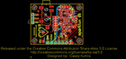
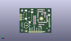
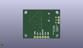
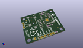

Contents
========

* [PROJ-SPAR-12650-STAN-01>AD8232 Heart Rate Monitor](#proj-spar-12650-stan-01ad8232-heart-rate-monitor)
	* [Images](#images)
	* [Interactive BOM](#interactive-bom)
	* [OOMP Parts](#oomp-parts)
	* [Tags](#tags)
  
![][im]
# PROJ-SPAR-12650-STAN-01>AD8232 Heart Rate Monitor

- ID: PROJ-SPAR-12650-STAN-01
- Hex ID: PRS12650
- Name: AD8232 Heart Rate Monitor
- Description: 

## Images
  
  

|eagleImage|kicadPcb3dFront|kicadPcb3dBack|kicadPcb3d|
| :---: | :---: | :---: | :---: |
|||||

## Interactive BOM

- Interactive BOM page: [ibom.html](kicad/bom/ibom.html)

## OOMP Parts
  

|OOMP Parts|
| :---: |
|CAPE-0603-X-UNMATCHED-01, C1, 26.034999999999997, 9.398, 180,C1, 1.5nF, 0603-CAP, SparkFun-Passives, (1.025, 0.37), R180|
|CAPE-0603-X-UNMATCHED-01, C2, 20.574, 14.350999999999997, 270,C2, 1nF, 0603-CAP, SparkFun-Passives, (0.81, 0.565), R270|
|CAPE-0603-X-UNMATCHED-01, C3, 22.733, 11.811, 180,C3, 10nF, 0603-CAP, SparkFun-Passives, (0.895, 0.465), R180|
|CAPE-0805-X-NF330-01, C4, 20.574, 18.796, 90,C4, 0.33uF, 0805, SparkFun-Capacitors, (0.81, 0.74), R90|
|CAPE-0603-X-NF100-01, C5, 28.320999999999998, 18.923, 270,C5, 0.1uF, 0603-CAP, SparkFun-Passives, (1.115, 0.745), R270|
|CAPE-0805-X-NF330-01, C6, 26.542999999999996, 26.034999999999997, 0,C6, 0.33uF, 0805, SparkFun-Capacitors, (1.045, 1.025), R0|
|CAPE-0603-X-NF100-01, C7, 28.194000000000003, 21.59, 0,C7, 0.1uf, 0603-CAP, SparkFun-Passives, (1.11, 0.85), R0|
|UNMATCHED-0603-X-UNMATCHED-01, D1, 8.382, 8.382, 90,D1, RED, LED-0603, SparkFun-LED, (0.33, 0.33), R90|
|UNMATCHED-UNMATCHED-X-UNMATCHED-01, JP1, 1.27, 15.239999999999998, 90,JP1, 1X03, SparkFun-Connectors, (0.05, 0.6), R90|
|UNMATCHED-UNMATCHED-X-UNMATCHED-01, JP2, 10.540999999999999, 27.686, 270,JP2, AUDIO-JACK-3.5MM-SMD, SparkFun-Connectors, (0.415, 1.09), R270|
|UNMATCHED-UNMATCHED-X-UNMATCHED-01, JP3, 11.43, 1.27, 0,JP3, 1X06, SparkFun-Connectors, (0.45, 0.05), R0|
|RESE-0603-X-UNMATCHED-01, R1, 16.891, 18.923, 0,R1, 10M, 0603-RES, SparkFun-Passives, (0.665, 0.745), R0|
|RESE-0603-X-UNMATCHED-01, R2, 16.891, 13.843, 0,R2, 10M, 0603-RES, SparkFun-Passives, (0.665, 0.545), R0|
|RESE-0603-X-O184-01, R3, 16.891, 17.272000000000002, 0,R3, 180k, 0603-RES, SparkFun-Passives, (0.665, 0.68), R0|
|RESE-0603-X-O184-01, R4, 16.891, 15.620999999999999, 0,R4, 180k, 0603-RES, SparkFun-Passives, (0.665, 0.615), R0|
|RESE-0603-X-O364-01, R5, 16.891, 12.065, 180,R5, 360k, 0603-RES, SparkFun-Passives, (0.665, 0.475), R180|
|RESE-0603-X-UNMATCHED-01, R6, 22.733, 7.365999999999999, 180,R6, 1M, 0603-RES, SparkFun-Passives, (0.895, 0.29), R180|
|RESE-0603-X-UNMATCHED-01, R7, 22.733, 9.398, 180,R7, 1M, 0603-RES, SparkFun-Passives, (0.895, 0.37), R180|
|<table><tr><td></td><td> R8</td><td>[RESE-0603-X-O104-01 SMD (0603) 100k Ohm Resistor](https://github.com/oomlout/oomlout_OOMP_parts/tree/main/RESE-0603-X-O104-01/)</td><td>[R6104](https://github.com/oomlout/oomlout_OOMP_parts/tree/main/RESE-0603-X-O104-01/)</td></tr></table>|
|RESE-0603-X-UNMATCHED-01, R9, 28.955999999999996, 11.811, 180,R9, 1M, 0603-RES, SparkFun-Passives, (1.14, 0.465), R180|
|RESE-0603-X-UNMATCHED-01, R10, 25.2095, 21.462999999999997, 90,R10, 10M, 0603-RES, SparkFun-Passives, (0.9925, 0.845), R90|
|RESE-0603-X-UNMATCHED-01, R11, 20.574, 21.843999999999998, 90,R11, 10M, 0603-RES, SparkFun-Passives, (0.81, 0.86), R90|
|RESE-0603-X-UNMATCHED-01, R12, 24.892, 24.002999999999997, 0,R12, 1.4M, 0603-RES, SparkFun-Passives, (0.98, 0.945), R0|
|RESE-0603-X-UNMATCHED-01, R13, 21.843999999999998, 24.002999999999997, 0,R13, 10M, 0603-RES, SparkFun-Passives, (0.86, 0.945), R0|
|RESE-0603-X-UNMATCHED-01, R14, 28.194000000000003, 23.114, 180,R14, 10M, 0603-RES, SparkFun-Passives, (1.11, 0.91), R180|
|<table><tr><td></td><td> R15</td><td>[RESE-0603-X-O103-01 SMD (0603) 10k Ohm Resistor](https://github.com/oomlout/oomlout_OOMP_parts/tree/main/RESE-0603-X-O103-01/)</td><td>[R6103](https://github.com/oomlout/oomlout_OOMP_parts/tree/main/RESE-0603-X-O103-01/)</td></tr></table>|
|RESE-0603-X-UNMATCHED-01, R16, 16.891, 10.287, 0,R16, 1k, 0603-RES, SparkFun-Resistors, (0.665, 0.405), R0|
|RESE-0603-X-UNMATCHED-01, R17, 21.717, 26.034999999999997, 0,R17, 0, 0603, SparkFun-Resistors, (0.855, 1.025), R0|
|RESE-0603-X-UNMATCHED-01, R18, 23.368, 26.034999999999997, 0,R18, DNP, 0603, SparkFun-Resistors, (0.92, 1.025), R0|
|RESE-0603-X-UNMATCHED-01, R19, 30.733999999999998, 16.509999999999998, 90,R19, 0, 0603, SparkFun-Resistors, (1.21, 0.65), R90|
|RESE-0603-X-UNMATCHED-01, R20, 30.733999999999998, 18.034, 90,R20, DNP, 0603, SparkFun-Resistors, (1.21, 0.71), R90|
|ERROR, SJ4 LED DISABLE, 0, 0, 0,SJ4, LED, DISABLE, SJ_2S-TRACE, SparkFun-Passives, (0.3, 0.08), R90|
|UNMATCHED-UNMATCHED-X-UNMATCHED-01, U1, 24.383999999999997, 16.128999999999998, 0,U1, AD8232, LFCSP_20, AD8232, (0.96, 0.635), R0|

## Tags

- hexID: PRS12650
- oompType: PROJ
- oompSize: SPAR
- oompColor: 12650
- oompDesc: STAN
- oompIndex: 01
- oompName: AD8232 Heart Rate Monitor
- sources: All source files from https://github.com/sparkfun/AD8232_Heart_Rate_Monitor (source licence details in srcLicense.md)
- linkBuyPage: https://www.sparkfun.com/products/12650
- oompPart: CAPE-0603-X-UNMATCHED-01, C1, 26.034999999999997, 9.398, 180
- oompPart: CAPE-0603-X-UNMATCHED-01, C2, 20.574, 14.350999999999997, 270
- oompPart: CAPE-0603-X-UNMATCHED-01, C3, 22.733, 11.811, 180
- oompPart: CAPE-0805-X-NF330-01, C4, 20.574, 18.796, 90
- oompPart: CAPE-0603-X-NF100-01, C5, 28.320999999999998, 18.923, 270
- oompPart: CAPE-0805-X-NF330-01, C6, 26.542999999999996, 26.034999999999997, 0
- oompPart: CAPE-0603-X-NF100-01, C7, 28.194000000000003, 21.59, 0
- oompPart: UNMATCHED-0603-X-UNMATCHED-01, D1, 8.382, 8.382, 90
- oompPart: SKIP-UNMATCHED-X-UNMATCHED-01, FID1, 5.08, 22.86, 0
- oompPart: SKIP-UNMATCHED-X-UNMATCHED-01, FID2, 30.479999999999997, 5.08, 0
- oompPart: UNMATCHED-UNMATCHED-X-UNMATCHED-01, JP1, 1.27, 15.239999999999998, 90
- oompPart: UNMATCHED-UNMATCHED-X-UNMATCHED-01, JP2, 10.540999999999999, 27.686, 270
- oompPart: UNMATCHED-UNMATCHED-X-UNMATCHED-01, JP3, 11.43, 1.27, 0
- oompPart: RESE-0603-X-UNMATCHED-01, R1, 16.891, 18.923, 0
- oompPart: RESE-0603-X-UNMATCHED-01, R2, 16.891, 13.843, 0
- oompPart: RESE-0603-X-O184-01, R3, 16.891, 17.272000000000002, 0
- oompPart: RESE-0603-X-O184-01, R4, 16.891, 15.620999999999999, 0
- oompPart: RESE-0603-X-O364-01, R5, 16.891, 12.065, 180
- oompPart: RESE-0603-X-UNMATCHED-01, R6, 22.733, 7.365999999999999, 180
- oompPart: RESE-0603-X-UNMATCHED-01, R7, 22.733, 9.398, 180
- oompPart: RESE-0603-X-O104-01, R8, 25.9715, 11.811, 180
- oompPart: RESE-0603-X-UNMATCHED-01, R9, 28.955999999999996, 11.811, 180
- oompPart: RESE-0603-X-UNMATCHED-01, R10, 25.2095, 21.462999999999997, 90
- oompPart: RESE-0603-X-UNMATCHED-01, R11, 20.574, 21.843999999999998, 90
- oompPart: RESE-0603-X-UNMATCHED-01, R12, 24.892, 24.002999999999997, 0
- oompPart: RESE-0603-X-UNMATCHED-01, R13, 21.843999999999998, 24.002999999999997, 0
- oompPart: RESE-0603-X-UNMATCHED-01, R14, 28.194000000000003, 23.114, 180
- oompPart: RESE-0603-X-O103-01, R15, 27.178, 1.27, 0
- oompPart: RESE-0603-X-UNMATCHED-01, R16, 16.891, 10.287, 0
- oompPart: RESE-0603-X-UNMATCHED-01, R17, 21.717, 26.034999999999997, 0
- oompPart: RESE-0603-X-UNMATCHED-01, R18, 23.368, 26.034999999999997, 0
- oompPart: RESE-0603-X-UNMATCHED-01, R19, 30.733999999999998, 16.509999999999998, 90
- oompPart: RESE-0603-X-UNMATCHED-01, R20, 30.733999999999998, 18.034, 90
- oompPart: ERROR, SJ4 LED DISABLE, 0, 0, 0
- oompPart: UNMATCHED-UNMATCHED-X-UNMATCHED-01, U1, 24.383999999999997, 16.128999999999998, 0
- rawPart: C1, 1.5nF, 0603-CAP, SparkFun-Passives, (1.025, 0.37), R180
- rawPart: C2, 1nF, 0603-CAP, SparkFun-Passives, (0.81, 0.565), R270
- rawPart: C3, 10nF, 0603-CAP, SparkFun-Passives, (0.895, 0.465), R180
- rawPart: C4, 0.33uF, 0805, SparkFun-Capacitors, (0.81, 0.74), R90
- rawPart: C5, 0.1uF, 0603-CAP, SparkFun-Passives, (1.115, 0.745), R270
- rawPart: C6, 0.33uF, 0805, SparkFun-Capacitors, (1.045, 1.025), R0
- rawPart: C7, 0.1uf, 0603-CAP, SparkFun-Passives, (1.11, 0.85), R0
- rawPart: D1, RED, LED-0603, SparkFun-LED, (0.33, 0.33), R90
- rawPart: FID1, FIDUCIAL1X2, FIDUCIAL-1X2, SparkFun-Aesthetics, (0.2, 0.9), R0
- rawPart: FID2, FIDUCIAL1X2, FIDUCIAL-1X2, SparkFun-Aesthetics, (1.2, 0.2), R0
- rawPart: JP1, 1X03, SparkFun-Connectors, (0.05, 0.6), R90
- rawPart: JP2, AUDIO-JACK-3.5MM-SMD, SparkFun-Connectors, (0.415, 1.09), R270
- rawPart: JP3, 1X06, SparkFun-Connectors, (0.45, 0.05), R0
- rawPart: R1, 10M, 0603-RES, SparkFun-Passives, (0.665, 0.745), R0
- rawPart: R2, 10M, 0603-RES, SparkFun-Passives, (0.665, 0.545), R0
- rawPart: R3, 180k, 0603-RES, SparkFun-Passives, (0.665, 0.68), R0
- rawPart: R4, 180k, 0603-RES, SparkFun-Passives, (0.665, 0.615), R0
- rawPart: R5, 360k, 0603-RES, SparkFun-Passives, (0.665, 0.475), R180
- rawPart: R6, 1M, 0603-RES, SparkFun-Passives, (0.895, 0.29), R180
- rawPart: R7, 1M, 0603-RES, SparkFun-Passives, (0.895, 0.37), R180
- rawPart: R8, 100k, 0603-RES, SparkFun-Passives, (1.0225, 0.465), R180
- rawPart: R9, 1M, 0603-RES, SparkFun-Passives, (1.14, 0.465), R180
- rawPart: R10, 10M, 0603-RES, SparkFun-Passives, (0.9925, 0.845), R90
- rawPart: R11, 10M, 0603-RES, SparkFun-Passives, (0.81, 0.86), R90
- rawPart: R12, 1.4M, 0603-RES, SparkFun-Passives, (0.98, 0.945), R0
- rawPart: R13, 10M, 0603-RES, SparkFun-Passives, (0.86, 0.945), R0
- rawPart: R14, 10M, 0603-RES, SparkFun-Passives, (1.11, 0.91), R180
- rawPart: R15, 10K, 0603-RES, SparkFun-Resistors, (1.07, 0.05), R0
- rawPart: R16, 1k, 0603-RES, SparkFun-Resistors, (0.665, 0.405), R0
- rawPart: R17, 0, 0603, SparkFun-Resistors, (0.855, 1.025), R0
- rawPart: R18, DNP, 0603, SparkFun-Resistors, (0.92, 1.025), R0
- rawPart: R19, 0, 0603, SparkFun-Resistors, (1.21, 0.65), R90
- rawPart: R20, DNP, 0603, SparkFun-Resistors, (1.21, 0.71), R90
- rawPart: SJ4, LED, DISABLE, SJ_2S-TRACE, SparkFun-Passives, (0.3, 0.08), R90
- rawPart: U1, AD8232, LFCSP_20, AD8232, (0.96, 0.635), R0

[im]: kicadPcb3d_450.png
