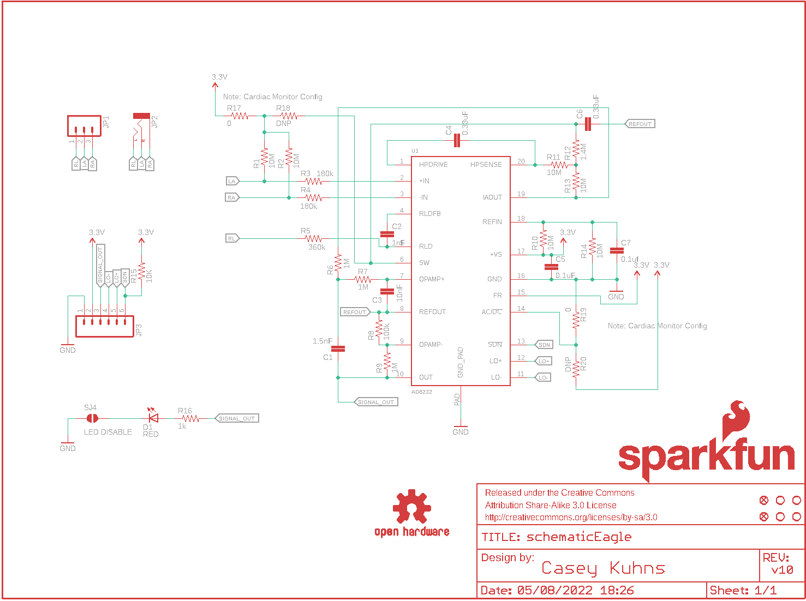
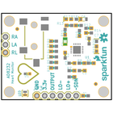
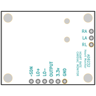
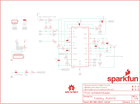

Contents
========

* [PRS12650 > AD8232 Heart Rate Monitor](#prs12650--ad8232-heart-rate-monitor)
	* [Schematic](#schematic)
	* [PCB](#pcb)
	* [Interactive BOM](#interactive-bom)
	* [OOMP Parts](#oomp-parts)
	* [Images](#images)
	* [Tags](#tags)
  
![][im]
# PRS12650 > AD8232 Heart Rate Monitor

- ID: PROJ-SPAR-12650-STAN-01
- Hex ID: PRS12650
- Name: Sparkfun
- Description: Sparkfun
- Long Link: [http://oom.lt/PROJ-SPAR-12650-STAN-01](http://oom.lt/PROJ-SPAR-12650-STAN-01)
- Short Link: [http://oom.lt/PRS12650](http://oom.lt/PRS12650)

## Schematic
  

## PCB
  

## Interactive BOM

- Interactive BOM page: [ibom.html](https://htmlpreview.github.io/?https://github.com/oomlout/oomlout_OOMP_projects/blob/main/PROJ-SPAR-12650-STAN-01/kicad/bom/ibom.html)

## OOMP Parts
  

|OOMP Parts|
| :---: |
|CAPC-0603-X-PF15D-01 C1|
|[CAPC-0603-X-NF1-V50  SMD (0603) 1 nF Capacitor (Ceramic) 50v  C2](https://github.com/oomlout/oomlout_OOMP_parts/tree/main/CAPC-0603-X-NF1-V50/)|
|[CAPC-0603-X-NF10-V50  SMD (0603) 10 nF Capacitor (Ceramic) 50v  C3](https://github.com/oomlout/oomlout_OOMP_parts/tree/main/CAPC-0603-X-NF10-V50/)|
|CAPC-0805-X-NF330-01 C4, C6|
|[CAPC-0603-X-NF100-V50  SMD (0603) 100 nF Capacitor (Ceramic) 50v  C5, C7](https://github.com/oomlout/oomlout_OOMP_parts/tree/main/CAPC-0603-X-NF100-V50/)|
|[LEDS-0603-R-STAN-01  SMD (0603) Red LED  D1](https://github.com/oomlout/oomlout_OOMP_parts/tree/main/LEDS-0603-R-STAN-01/)|
|[HEAD-I01-X-PI03-01  2.54 mm 3 Pin Header  JP1](https://github.com/oomlout/oomlout_OOMP_parts/tree/main/HEAD-I01-X-PI03-01/)|
|TERS-35D-L-UNMATCHED-01 JP2|
|[HEAD-I01-X-PI06-01  2.54 mm 6 Pin Header  JP3](https://github.com/oomlout/oomlout_OOMP_parts/tree/main/HEAD-I01-X-PI06-01/)|
|[RESE-0603-X-O106-01  SMD (0603) 10M Ohm Resistor  R1, R2, R10, R11, R13, R14](https://github.com/oomlout/oomlout_OOMP_parts/tree/main/RESE-0603-X-O106-01/)|
|RESE-0603-X-O1803-01 R3, R4|
|RESE-0603-X-O3603-01 R5|
|[RESE-0603-X-O105-01  SMD (0603) 1M Ohm Resistor  R6, R7, R9](https://github.com/oomlout/oomlout_OOMP_parts/tree/main/RESE-0603-X-O105-01/)|
|RESE-0603-X-O1003-01 R8|
|RESE-0603-X-UNMATCHED-01 R12, R17, R18, R19, R20|
|[RESE-0603-X-O103-01  SMD (0603) 10k Ohm Resistor  R15](https://github.com/oomlout/oomlout_OOMP_parts/tree/main/RESE-0603-X-O103-01/)|
|[RESE-0603-X-O102-01  SMD (0603) 1k Ohm Resistor  R16](https://github.com/oomlout/oomlout_OOMP_parts/tree/main/RESE-0603-X-O102-01/)|
|UNMATCHED-UNMATCHED-X-UNMATCHED-01 U1|

## Images
  
  

|bominteractivefront|bominteractiveback|kicadPcb3d|kicadPcb3dFront|kicadPcb3dBack|eagleImage|eagleSchemImage|
| :---: | :---: | :---: | :---: | :---: | :---: | :---: |
||||||||

## Tags

- hexID: PRS12650
- oompType: PROJ
- oompSize: SPAR
- oompColor: 12650
- oompDesc: STAN
- oompIndex: 01
- oompName: AD8232 Heart Rate Monitor
- sources: All source files from https://github.com/sparkfun/AD8232_Heart_Rate_Monitor (source licence details in srcLicense.md)
- linkBuyPage: https://www.sparkfun.com/products/12650
- oompID: PROJ-SPAR-12650-STAN-01
- oompParts: C1,CAPC-0603-X-PF15D-01
- oompParts: C2,CAPC-0603-X-NF1-V50
- oompParts: C3,CAPC-0603-X-NF10-V50
- oompParts: C4,CAPC-0805-X-NF330-01
- oompParts: C5,CAPC-0603-X-NF100-V50
- oompParts: C6,CAPC-0805-X-NF330-01
- oompParts: C7,CAPC-0603-X-NF100-V50
- oompParts: D1,LEDS-0603-R-STAN-01
- oompParts: JP1,HEAD-I01-X-PI03-01
- oompParts: JP2,TERS-35D-L-UNMATCHED-01
- oompParts: JP3,HEAD-I01-X-PI06-01
- oompParts: R1,RESE-0603-X-O106-01
- oompParts: R2,RESE-0603-X-O106-01
- oompParts: R3,RESE-0603-X-O1803-01
- oompParts: R4,RESE-0603-X-O1803-01
- oompParts: R5,RESE-0603-X-O3603-01
- oompParts: R6,RESE-0603-X-O105-01
- oompParts: R7,RESE-0603-X-O105-01
- oompParts: R8,RESE-0603-X-O1003-01
- oompParts: R9,RESE-0603-X-O105-01
- oompParts: R10,RESE-0603-X-O106-01
- oompParts: R11,RESE-0603-X-O106-01
- oompParts: R12,RESE-0603-X-UNMATCHED-01
- oompParts: R13,RESE-0603-X-O106-01
- oompParts: R14,RESE-0603-X-O106-01
- oompParts: R15,RESE-0603-X-O103-01
- oompParts: R16,RESE-0603-X-O102-01
- oompParts: R17,RESE-0603-X-UNMATCHED-01
- oompParts: R18,RESE-0603-X-UNMATCHED-01
- oompParts: R19,RESE-0603-X-UNMATCHED-01
- oompParts: R20,RESE-0603-X-UNMATCHED-01
- oompParts: U1,UNMATCHED-UNMATCHED-X-UNMATCHED-01
- rawParts: C1,1.5nF,CAP0603-CAP,0603-CAP,Capacitor,,,
- rawParts: C2,1nF,CAP0603-CAP,0603-CAP,Capacitor,,,
- rawParts: C3,10nF,CAP0603-CAP,0603-CAP,Capacitor,,,
- rawParts: C4,0.33uF,CAP0805,0805,Capacitor,,,
- rawParts: C5,0.1uF,CAP0603-CAP,0603-CAP,Capacitor,,,
- rawParts: C6,0.33uF,CAP0805,0805,Capacitor,,,
- rawParts: C7,0.1uf,CAP0603-CAP,0603-CAP,Capacitor,,,
- rawParts: D1,RED,LED-RED0603,LED-0603,Assorted Red LEDs,DIO-00819,RED,
- rawParts: FID1,FIDUCIAL1X2,FIDUCIAL1X2,FIDUCIAL-1X2,Fiducial Alignment Points,,,
- rawParts: FID2,FIDUCIAL1X2,FIDUCIAL1X2,FIDUCIAL-1X2,Fiducial Alignment Points,,,
- rawParts: FRAME1,FRAME-LETTER,FRAME-LETTER,CREATIVE_COMMONS,Schematic Frame,,,
- rawParts: JP1,,M03PTH,1X03,Header 3,,,
- rawParts: JP2,,AUDIO-JACKSMD2,AUDIO-JACK-3.5MM-SMD,3.5mm Audio Jack,CONN-10353,,
- rawParts: JP3,,M06SIP,1X06,Header 6,,,
- rawParts: LOGO1,OSHW-LOGOS,OSHW-LOGOS,OSHW-LOGO-S,Open Source Hardware Logo This logo indicates the piece of hardware it is found on incorporates a OSHW license and/or adheres to the definition of open source hardware found here: http://freedomdefined.org/OSHW,,,
- rawParts: LOGO2,SFE_LOGO_NAME_FLAME.1_INCH,SFE_LOGO_NAME_FLAME.1_INCH,SFE_LOGO_NAME_FLAME_.1,SFE Logo, name and flame,,,
- rawParts: R1,10M,RESISTOR0603-RES,0603-RES,Resistor,,,
- rawParts: R2,10M,RESISTOR0603-RES,0603-RES,Resistor,,,
- rawParts: R3,180k,RESISTOR0603-RES,0603-RES,Resistor,,,
- rawParts: R4,180k,RESISTOR0603-RES,0603-RES,Resistor,,,
- rawParts: R5,360k,RESISTOR0603-RES,0603-RES,Resistor,,,
- rawParts: R6,1M,RESISTOR0603-RES,0603-RES,Resistor,,,
- rawParts: R7,1M,RESISTOR0603-RES,0603-RES,Resistor,,,
- rawParts: R8,100k,RESISTOR0603-RES,0603-RES,Resistor,,,
- rawParts: R9,1M,RESISTOR0603-RES,0603-RES,Resistor,,,
- rawParts: R10,10M,RESISTOR0603-RES,0603-RES,Resistor,,,
- rawParts: R11,10M,RESISTOR0603-RES,0603-RES,Resistor,,,
- rawParts: R12,1.4M,RESISTOR0603-RES,0603-RES,Resistor,,,
- rawParts: R13,10M,RESISTOR0603-RES,0603-RES,Resistor,,,
- rawParts: R14,10M,RESISTOR0603-RES,0603-RES,Resistor,,,
- rawParts: R15,10K,10KOHM1/10W1%(0603)0603,0603-RES,RES-00824,RES-00824,10K,
- rawParts: R16,1k,1K-1%,0603-RES,1k-ohm SMT,RES-07856,1k,
- rawParts: R17,0,0OHM1/10W5%(0603),0603,RES-08609,RES-08609,0,
- rawParts: R18,DNP,0OHM1/10W5%(0603),0603,RES-08609,RES-08609,0,
- rawParts: R19,0,0OHM1/10W5%(0603),0603,RES-08609,RES-08609,0,
- rawParts: R20,DNP,0OHM1/10W5%(0603),0603,RES-08609,RES-08609,0,
- rawParts: SJ4,LED DISABLE,SOLDERJUMPERTRACE,SJ_2S-TRACE,Solder Jumper,,,
- rawParts: STANDOFF1,STAND-OFF,STAND-OFF,STAND-OFF,#4 Stand Off,,,
- rawParts: STANDOFF2,STAND-OFF,STAND-OFF,STAND-OFF,#4 Stand Off,,,
- rawParts: STANDOFF3,STAND-OFF,STAND-OFF,STAND-OFF,#4 Stand Off,,,
- rawParts: STANDOFF4,STAND-OFF,STAND-OFF,STAND-OFF,#4 Stand Off,,,
- rawParts: U1,AD8232,AD8232,LFCSP_20,,,,

[im]: kicadPcb3d_450.png
