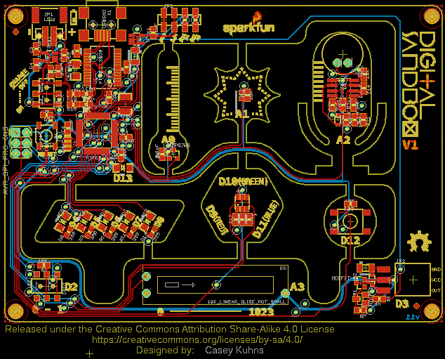
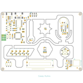
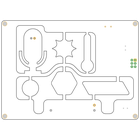
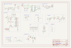
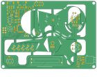

Contents
========

* [PRS12651 > Digital Sandbox](#prs12651--digital-sandbox)
	* [Schematic](#schematic)
	* [PCB](#pcb)
	* [Interactive BOM](#interactive-bom)
	* [OOMP Parts](#oomp-parts)
	* [Images](#images)
	* [Tags](#tags)
  
![][im]
# PRS12651 > Digital Sandbox

- ID: PROJ-SPAR-12651-STAN-01
- Hex ID: PRS12651
- Name: Sparkfun
- Description: Sparkfun
- Long Link: [http://oom.lt/PROJ-SPAR-12651-STAN-01](http://oom.lt/PROJ-SPAR-12651-STAN-01)
- Short Link: [http://oom.lt/PRS12651](http://oom.lt/PRS12651)

## Schematic
  

## PCB
  

## Interactive BOM

- Interactive BOM page: [ibom.html](https://htmlpreview.github.io/?https://github.com/oomlout/oomlout_OOMP_projects/blob/main/PROJ-SPAR-12651-STAN-01/kicad/bom/ibom.html)

## OOMP Parts
  

|OOMP ID|Name|Identifier|
| :---: | :---: | :---: |
|[CAPC-0603-X-NF100-V50](https://github.com/oomlout/oomlout_OOMP_parts/tree/main/CAPC-0603-X-NF100-V50/)|[SMD (0603) 100 nF Capacitor (Ceramic) 50v](https://github.com/oomlout/oomlout_OOMP_parts/tree/main/CAPC-0603-X-NF100-V50/)|[C1, C6, C7, C8, C10, C11, C12, C13, C14](https://github.com/oomlout/oomlout_OOMP_parts/tree/main/CAPC-0603-X-NF100-V50/)|
|[CAPC-0603-X-UF47D-V10](https://github.com/oomlout/oomlout_OOMP_parts/tree/main/CAPC-0603-X-UF47D-V10/)|[SMD (0603) 4.7 uF Capacitor (Ceramic) 10v](https://github.com/oomlout/oomlout_OOMP_parts/tree/main/CAPC-0603-X-UF47D-V10/)|[C2, C5](https://github.com/oomlout/oomlout_OOMP_parts/tree/main/CAPC-0603-X-UF47D-V10/)|
|CAPX-3528-X-UF47-01||C3|
|CAPC-0603-X-UNMATCHED-01||C4|
|[CAPT-3216-X-UF10-V10](https://github.com/oomlout/oomlout_OOMP_parts/tree/main/CAPT-3216-X-UF10-V10/)|[SMD (3216) 10 uF Capacitor (Tantalum) 10v](https://github.com/oomlout/oomlout_OOMP_parts/tree/main/CAPT-3216-X-UF10-V10/)|[C9](https://github.com/oomlout/oomlout_OOMP_parts/tree/main/CAPT-3216-X-UF10-V10/)|
|[LEDS-0603-Y-STAN-01](https://github.com/oomlout/oomlout_OOMP_parts/tree/main/LEDS-0603-Y-STAN-01/)|[SMD (0603) Yellow LED](https://github.com/oomlout/oomlout_OOMP_parts/tree/main/LEDS-0603-Y-STAN-01/)|[D1](https://github.com/oomlout/oomlout_OOMP_parts/tree/main/LEDS-0603-Y-STAN-01/)|
|LEDS-1206-R-STAN-01||D2|
|DIOD-S323-X-UNMATCHED-01||D4, D5|
|REFU-1206-X-UNMATCHED-01||F1, F2|
|UNMATCHED-UNMATCHED-X-UNMATCHED-01||J1, S1, S2, S3, S5, U2, U3, U5, U6, U8, U9, X1, Y1|
|HEAD-I01-X-UNMATCHED-01||JP1|
|[HEAD-I01-X-PI03-01](https://github.com/oomlout/oomlout_OOMP_parts/tree/main/HEAD-I01-X-PI03-01/)|[2.54 mm 3 Pin Header](https://github.com/oomlout/oomlout_OOMP_parts/tree/main/HEAD-I01-X-PI03-01/)|[JP2](https://github.com/oomlout/oomlout_OOMP_parts/tree/main/HEAD-I01-X-PI03-01/)|
|[HEAD-I01-X-PI04-01](https://github.com/oomlout/oomlout_OOMP_parts/tree/main/HEAD-I01-X-PI04-01/)|[2.54 mm 4 Pin Header](https://github.com/oomlout/oomlout_OOMP_parts/tree/main/HEAD-I01-X-PI04-01/)|[JP3](https://github.com/oomlout/oomlout_OOMP_parts/tree/main/HEAD-I01-X-PI04-01/)|
|LEDS-1206-G-STAN-01||LED1, LED2, LED3, LED4, LED5|
|[LEDS-0603-R-STAN-01](https://github.com/oomlout/oomlout_OOMP_parts/tree/main/LEDS-0603-R-STAN-01/)|[SMD (0603) Red LED](https://github.com/oomlout/oomlout_OOMP_parts/tree/main/LEDS-0603-R-STAN-01/)|[LED6](https://github.com/oomlout/oomlout_OOMP_parts/tree/main/LEDS-0603-R-STAN-01/)|
|[LEDS-0603-G-STAN-01](https://github.com/oomlout/oomlout_OOMP_parts/tree/main/LEDS-0603-G-STAN-01/)|[SMD (0603) Green LED](https://github.com/oomlout/oomlout_OOMP_parts/tree/main/LEDS-0603-G-STAN-01/)|[LED7](https://github.com/oomlout/oomlout_OOMP_parts/tree/main/LEDS-0603-G-STAN-01/)|
|UNMATCHED-SO23-X-UNMATCHED-01||Q1, Q2, U4|
|[RESE-0603-X-O331-01](https://github.com/oomlout/oomlout_OOMP_parts/tree/main/RESE-0603-X-O331-01/)|[SMD (0603) 330 Ohm Resistor](https://github.com/oomlout/oomlout_OOMP_parts/tree/main/RESE-0603-X-O331-01/)|[R1, R5](https://github.com/oomlout/oomlout_OOMP_parts/tree/main/RESE-0603-X-O331-01/)|
|[RESE-0603-X-O103-01](https://github.com/oomlout/oomlout_OOMP_parts/tree/main/RESE-0603-X-O103-01/)|[SMD (0603) 10k Ohm Resistor](https://github.com/oomlout/oomlout_OOMP_parts/tree/main/RESE-0603-X-O103-01/)|[R2, R3, R4, R14, R23, R24, R26, R27](https://github.com/oomlout/oomlout_OOMP_parts/tree/main/RESE-0603-X-O103-01/)|
|[RESE-0603-X-O102-01](https://github.com/oomlout/oomlout_OOMP_parts/tree/main/RESE-0603-X-O102-01/)|[SMD (0603) 1k Ohm Resistor](https://github.com/oomlout/oomlout_OOMP_parts/tree/main/RESE-0603-X-O102-01/)|[R6, R7, R13, R15](https://github.com/oomlout/oomlout_OOMP_parts/tree/main/RESE-0603-X-O102-01/)|
|[RESE-0603-X-O301-01](https://github.com/oomlout/oomlout_OOMP_parts/tree/main/RESE-0603-X-O301-01/)|[SMD (0603) 300 Ohm Resistor](https://github.com/oomlout/oomlout_OOMP_parts/tree/main/RESE-0603-X-O301-01/)|[R8, R9, R10, R11, R12, R17](https://github.com/oomlout/oomlout_OOMP_parts/tree/main/RESE-0603-X-O301-01/)|
|[RESE-0603-X-O101-01](https://github.com/oomlout/oomlout_OOMP_parts/tree/main/RESE-0603-X-O101-01/)|[SMD (0603) 100 Ohm Resistor](https://github.com/oomlout/oomlout_OOMP_parts/tree/main/RESE-0603-X-O101-01/)|[R19, R21](https://github.com/oomlout/oomlout_OOMP_parts/tree/main/RESE-0603-X-O101-01/)|
|RESE-0603-X-O1003-01||R22|
|[RESE-0603-X-O222-01](https://github.com/oomlout/oomlout_OOMP_parts/tree/main/RESE-0603-X-O222-01/)|[SMD (0603) 2.2k Ohm Resistor](https://github.com/oomlout/oomlout_OOMP_parts/tree/main/RESE-0603-X-O222-01/)|[R25](https://github.com/oomlout/oomlout_OOMP_parts/tree/main/RESE-0603-X-O222-01/)|
|LEDS-UNMATCHED-G-STAN-01||U$5|
|UNMATCHED-SO235-X-UNMATCHED-01||U1|
|VREG-SO235-X-KMIC5205-01||U7|

## Images
  
  

|bominteractivefront|bominteractiveback|kicadPcb3d|kicadPcb3dFront|kicadPcb3dBack|kicadSchem|eagleImage|eagleSchemImage|pcbdraw|pcbdrawback|
| :---: | :---: | :---: | :---: | :---: | :---: | :---: | :---: | :---: | :---: |
|||||||||||

## Tags

- hexID: PRS12651
- oompType: PROJ
- oompSize: SPAR
- oompColor: 12651
- oompDesc: STAN
- oompIndex: 01
- oompName: Digital Sandbox
- sources: All source files from https://github.com/sparkfun/Digital_Sandbox (source licence details in srcLicense.md)
- linkBuyPage: https://www.sparkfun.com/products/12651
- oompID: PROJ-SPAR-12651-STAN-01
- oompParts: C1,CAPC-0603-X-NF100-V50
- oompParts: C2,CAPC-0603-X-UF47D-V10
- oompParts: C3,CAPX-3528-X-UF47-01
- oompParts: C4,CAPC-0603-X-UNMATCHED-01
- oompParts: C5,CAPC-0603-X-UF47D-V10
- oompParts: C6,CAPC-0603-X-NF100-V50
- oompParts: C7,CAPC-0603-X-NF100-V50
- oompParts: C8,CAPC-0603-X-NF100-V50
- oompParts: C9,CAPT-3216-X-UF10-V10
- oompParts: C10,CAPC-0603-X-NF100-V50
- oompParts: C11,CAPC-0603-X-NF100-V50
- oompParts: C12,CAPC-0603-X-NF100-V50
- oompParts: C13,CAPC-0603-X-NF100-V50
- oompParts: C14,CAPC-0603-X-NF100-V50
- oompParts: D1,LEDS-0603-Y-STAN-01
- oompParts: D2,LEDS-1206-R-STAN-01
- oompParts: D4,DIOD-S323-X-UNMATCHED-01
- oompParts: D5,DIOD-S323-X-UNMATCHED-01
- oompParts: F1,REFU-1206-X-UNMATCHED-01
- oompParts: F2,REFU-1206-X-UNMATCHED-01
- oompParts: J1,UNMATCHED-UNMATCHED-X-UNMATCHED-01
- oompParts: JP1,HEAD-I01-X-UNMATCHED-01
- oompParts: JP2,HEAD-I01-X-PI03-01
- oompParts: JP3,HEAD-I01-X-PI04-01
- oompParts: LED1,LEDS-1206-G-STAN-01
- oompParts: LED2,LEDS-1206-G-STAN-01
- oompParts: LED3,LEDS-1206-G-STAN-01
- oompParts: LED4,LEDS-1206-G-STAN-01
- oompParts: LED5,LEDS-1206-G-STAN-01
- oompParts: LED6,LEDS-0603-R-STAN-01
- oompParts: LED7,LEDS-0603-G-STAN-01
- oompParts: Q1,UNMATCHED-SO23-X-UNMATCHED-01
- oompParts: Q2,UNMATCHED-SO23-X-UNMATCHED-01
- oompParts: R1,RESE-0603-X-O331-01
- oompParts: R2,RESE-0603-X-O103-01
- oompParts: R3,RESE-0603-X-O103-01
- oompParts: R4,RESE-0603-X-O103-01
- oompParts: R5,RESE-0603-X-O331-01
- oompParts: R6,RESE-0603-X-O102-01
- oompParts: R7,RESE-0603-X-O102-01
- oompParts: R8,RESE-0603-X-O301-01
- oompParts: R9,RESE-0603-X-O301-01
- oompParts: R10,RESE-0603-X-O301-01
- oompParts: R11,RESE-0603-X-O301-01
- oompParts: R12,RESE-0603-X-O301-01
- oompParts: R13,RESE-0603-X-O102-01
- oompParts: R14,RESE-0603-X-O103-01
- oompParts: R15,RESE-0603-X-O102-01
- oompParts: R17,RESE-0603-X-O301-01
- oompParts: R19,RESE-0603-X-O101-01
- oompParts: R21,RESE-0603-X-O101-01
- oompParts: R22,RESE-0603-X-O1003-01
- oompParts: R23,RESE-0603-X-O103-01
- oompParts: R24,RESE-0603-X-O103-01
- oompParts: R25,RESE-0603-X-O222-01
- oompParts: R26,RESE-0603-X-O103-01
- oompParts: R27,RESE-0603-X-O103-01
- oompParts: S1,UNMATCHED-UNMATCHED-X-UNMATCHED-01
- oompParts: S2,UNMATCHED-UNMATCHED-X-UNMATCHED-01
- oompParts: S3,UNMATCHED-UNMATCHED-X-UNMATCHED-01
- oompParts: S5,UNMATCHED-UNMATCHED-X-UNMATCHED-01
- oompParts: U$5,LEDS-UNMATCHED-G-STAN-01
- oompParts: U1,UNMATCHED-SO235-X-UNMATCHED-01
- oompParts: U2,UNMATCHED-UNMATCHED-X-UNMATCHED-01
- oompParts: U3,UNMATCHED-UNMATCHED-X-UNMATCHED-01
- oompParts: U4,UNMATCHED-SO23-X-UNMATCHED-01
- oompParts: U5,UNMATCHED-UNMATCHED-X-UNMATCHED-01
- oompParts: U6,UNMATCHED-UNMATCHED-X-UNMATCHED-01
- oompParts: U7,VREG-SO235-X-KMIC5205-01
- oompParts: U8,UNMATCHED-UNMATCHED-X-UNMATCHED-01
- oompParts: U9,UNMATCHED-UNMATCHED-X-UNMATCHED-01
- oompParts: X1,UNMATCHED-UNMATCHED-X-UNMATCHED-01
- oompParts: Y1,UNMATCHED-UNMATCHED-X-UNMATCHED-01
- rawParts: C1,0.1uF,0.1UF-25V(+80/-20%)(0603),0603-CAP,CAP-00810,CAP-00810,0.1uF,
- rawParts: C2,4.7uF,4.7UF-6.3V-10%(0603)0603,0603-CAP,CAP-08280,CAP-08280,4.7uF,
- rawParts: C3,47uF,47UF-10V-10%(TANT),EIA3528,CAP-08310,CAP-08310,47uF,
- rawParts: C4,1.0uF,1.0UF-16V-10%(0603),0603-CAP,CAP-00868,CAP-00868,1.0uF,
- rawParts: C5,4.7uF,4.7UF-6.3V-10%(0603)0603,0603-CAP,CAP-08280,CAP-08280,4.7uF,
- rawParts: C6,0.1uF,0.1UF-25V(+80/-20%)(0603),0603-CAP,CAP-00810,CAP-00810,0.1uF,
- rawParts: C7,0.1uF,0.1UF-25V(+80/-20%)(0603),0603-CAP,CAP-00810,CAP-00810,0.1uF,
- rawParts: C8,0.1uF,0.1UF-25V(+80/-20%)(0603),0603-CAP,CAP-00810,CAP-00810,0.1uF,
- rawParts: C9,10uF,10UF-16V-10%(TANT),EIA3216,CAP-00811,CAP-00811,10uF,
- rawParts: C10,0.1uF,0.1UF-25V(+80/-20%)(0603),0603-CAP,CAP-00810,CAP-00810,0.1uF,
- rawParts: C11,0.1uF,0.1UF-25V(+80/-20%)(0603),0603-CAP,CAP-00810,CAP-00810,0.1uF,
- rawParts: C12,0.1uF,0.1UF-25V(+80/-20%)(0603),0603-CAP,CAP-00810,CAP-00810,0.1uF,
- rawParts: C13,0.1uF,0.1UF-25V(+80/-20%)(0603),0603-CAP,CAP-00810,CAP-00810,0.1uF,
- rawParts: C14,0.1uF,0.1UF-25V(+80/-20%)(0603),0603-CAP,CAP-00810,CAP-00810,0.1uF,
- rawParts: D1,Yellow,LED-YELLOW0603,LED-0603,Yellow SMD LEDs,DIO-09003,,
- rawParts: D2,RED,LED-RED1206,LED-1206,Assorted Red LEDs,DIO-00809,RED,
- rawParts: D4,,DIODESOD,SOD-323,Diode,DIO-09646,,
- rawParts: D5,,DIODESOD,SOD-323,Diode,DIO-09646,,
- rawParts: F1,PTCSMD,PTCSMD,PTC-1206,Resettable Fuse PTC,RES-11150,,
- rawParts: F2,PTCSMD,PTCSMD,PTC-1206,Resettable Fuse PTC,RES-11150,,
- rawParts: FID1,FIDUCIAL1X2,FIDUCIAL1X2,FIDUCIAL-1X2,Fiducial Alignment Points,,,
- rawParts: FID2,FIDUCIAL1X2,FIDUCIAL1X2,FIDUCIAL-1X2,Fiducial Alignment Points,,,
- rawParts: FRAME1,FRAME-LEDGER,FRAME-LEDGER,CREATIVE_COMMONS,Schematic Frame,,,
- rawParts: J1,AVR_SPI_PRG_6NS,AVR_SPI_PRG_6NS,2X3-NS,AVR ISP 6 Pin,,,
- rawParts: JP1,LiPo,M02-JST-2MM-SMT,JST-2-SMD,Standard 2-pin 0.1 header. Use with,CONN-08352,,
- rawParts: JP2,,M03SMD_RA_FEMALE,1X03_SMD_RA_FEMALE,Header 3,CONN-10926,1x3 RA Female .1,
- rawParts: JP3,,M04SMD_STRAIGHT_COMBO,1X04_SMD_STRAIGHT_COMBO,Header 4,,,
- rawParts: LED1,White,LED-WHITE,LED-1206,White SMD LEDs,DIO-09955,WHITE,
- rawParts: LED2,White,LED-WHITE,LED-1206,White SMD LEDs,DIO-09955,WHITE,
- rawParts: LED3,White,LED-WHITE,LED-1206,White SMD LEDs,DIO-09955,WHITE,
- rawParts: LED4,White,LED-WHITE,LED-1206,White SMD LEDs,DIO-09955,WHITE,
- rawParts: LED5,White,LED-WHITE,LED-1206,White SMD LEDs,DIO-09955,WHITE,
- rawParts: LED6,Red,LED-RED0603,LED-0603,Assorted Red LEDs,DIO-00819,RED,
- rawParts: LED7,Green,LED-GREEN0603,LED-0603,Various green LEDs,DIO-00821,GREEN,
- rawParts: Q1,MOSFET-N,MOSFET-NCHANNELBSS138,SOT23,Common NMOSFET Parts,TRANS-00830,,
- rawParts: Q2,MOSFET-P,MOSFET-PCHANNEL,SOT23-3,Generic PMOSFET,TRANS-08285,,
- rawParts: R1,330,330OHM1/10W1%(0603),0603-RES,RES-00818,RES-00818,330,
- rawParts: R2,10k,10KOHM1/10W1%(0603)0603,0603-RES,RES-00824,RES-00824,10K,
- rawParts: R3,10k,10KOHM1/10W1%(0603)0603,0603-RES,RES-00824,RES-00824,10K,
- rawParts: R4,10k,10KOHM1/10W1%(0603)0603,0603-RES,RES-00824,RES-00824,10K,
- rawParts: R5,330,330OHM1/10W1%(0603),0603-RES,RES-00818,RES-00818,330,
- rawParts: R6,1k,1KOHM1/10W1%(0603),0603-RES,RES-07856,RES-07856,1K,
- rawParts: R7,1k,1KOHM1/10W1%(0603),0603-RES,RES-07856,RES-07856,1K,
- rawParts: R8,300,300OHM-1/10W-1%(0603),0603-RES,RES-10328,RES_10328,300,
- rawParts: R9,300,300OHM-1/10W-1%(0603),0603-RES,RES-10328,RES_10328,300,
- rawParts: R10,300,300OHM-1/10W-1%(0603),0603-RES,RES-10328,RES_10328,300,
- rawParts: R11,300,300OHM-1/10W-1%(0603),0603-RES,RES-10328,RES_10328,300,
- rawParts: R12,300,300OHM-1/10W-1%(0603),0603-RES,RES-10328,RES_10328,300,
- rawParts: R13,1k,1KOHM1/10W1%(0603),0603-RES,RES-07856,RES-07856,1K,
- rawParts: R14,10k,10KOHM1/10W1%(0603)0603,0603-RES,RES-00824,RES-00824,10K,
- rawParts: R15,1k,1KOHM1/10W1%(0603),0603-RES,RES-07856,RES-07856,1K,
- rawParts: R17,300,300OHM-1/10W-1%(0603),0603-RES,RES-10328,RES_10328,300,
- rawParts: R19,100,100OHM1/10W1%(0603),0603-RES,RES-07863,RES-07863,100,
- rawParts: R21,100,100OHM1/10W1%(0603),0603-RES,RES-07863,RES-07863,100,
- rawParts: R22,100k,100KOHM1/10W1%(0603),0603-RES,RES-07828,RES-07828,100k,
- rawParts: R23,10k,10KOHM1/10W1%(0603)0603,0603-RES,RES-00824,RES-00824,10K,
- rawParts: R24,10k,10KOHM1/10W1%(0603)0603,0603-RES,RES-00824,RES-00824,10K,
- rawParts: R25,2.2k,2.2KOHM1/10W1%(0603),0603-RES,RES-08272,RES-08272,2.2k,
- rawParts: R26,10k,10KOHM1/10W1%(0603)0603,0603-RES,RES-00824,RES-00824,10K,
- rawParts: R27,10k,10KOHM1/10W1%(0603)0603,0603-RES,RES-00824,RES-00824,10K,
- rawParts: S1,Reset,TAC_SWITCHSMD,TACTILE_SWITCH_SMD,Momentary Switch,SWCH-08247,,
- rawParts: S2,,SWITCH-DPDTAYZ0202,AYZ0202,DPDT Version of the COM-00597,SWCH-08179,DPDT,
- rawParts: S3,On/Off,SWITCH-DPDTAYZ0202,AYZ0202,DPDT Version of the COM-00597,SWCH-08179,DPDT,
- rawParts: S5,SWITCH-MOMENTARY-2SMD-4,SWITCH-MOMENTARY-2SMD-4,TACTILE_SWITCH_TALL,Various NO switches- pushbuttons, reed, etc,SWCH-11966,,
- rawParts: STANDOFF1,STAND-OFF,STAND-OFF,STAND-OFF,#4 Stand Off,,,
- rawParts: STANDOFF2,STAND-OFF,STAND-OFF,STAND-OFF,#4 Stand Off,,,
- rawParts: STANDOFF3,STAND-OFF,STAND-OFF,STAND-OFF,#4 Stand Off,,,
- rawParts: STANDOFF4,STAND-OFF,STAND-OFF,STAND-OFF,#4 Stand Off,,,
- rawParts: U$5,LED-TRICOLOR,LED-TRICOLOR-NO-COMPLCC-6-SMD,PLCC-6-LED,,DIO-12113,,
- rawParts: U1,MCP73831,MCP73831,SOT23-5,Miniature single cell, fully integrated Li-Ion, Li-polymer charge management controller,IC-09995,,
- rawParts: U2,ATMEGA328,ATMEGA328_SMT,TQFP32-08,32-Pin Atmega328 part,IC-09069,ATMEGA328P,
- rawParts: U3,10K_LINEAR_SLIDE_POT_SMALL,10K_LINEAR_SLIDE_POT_SMALL,C2031N-1A2-B10K-GP,,RES-11924,,
- rawParts: U4,MCP9700,MCP9700SMD,SOT23-3,Analog-output temperature sensor,IC-08917,,
- rawParts: U5,FT232RLSSOP,FT232RLSSOP,SSOP28DB,USB UART,IC-00870,,
- rawParts: U6,LIGHTSENSORALS,LIGHTSENSORALS,ALS-PT19,Ambient Light Sensor,IC-11836,,
- rawParts: U7,V_REG_MIC52053.3V,V_REG_MIC52053.3V,SOT23-5,V_REG MIC5219,VREG-00822,3.3V/150mA,
- rawParts: U8,LMV358SOIC,LMV358SOIC,SO08,Jellybean rail-to-rail output op-amp,IC-09657,,
- rawParts: U9,MIC9.7MM,MIC9.7MM,MIC-9.7MM,Omni-directional electret microphone. 9.7mm standard diameter.,COMP-08856,,
- rawParts: X1,USBSMD,USBSMD,USB-MINIB,USB Connectors,CONN-08193,,
- rawParts: Y1,8MHz,RESONATOR8MHZ,RESONATOR-SMD,Resonator,XTAL-08895,8MHZ,

[im]: kicadPcb3d_450.png
