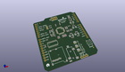
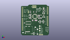
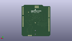
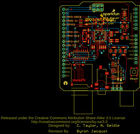
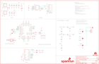

Contents
========

* [PRS12660 > Sparkfun](#prs12660--sparkfun)
	* [Images](#images)
	* [Tags](#tags)
  
![][im]
# PRS12660 > Sparkfun

- ID: PROJ-SPAR-12660-STAN-01
- Hex ID: PRS12660
- Name: Sparkfun
- Description: Sparkfun

## Images
  
  

|kicadPcb3d|kicadPcb3dFront|kicadPcb3dBack|eagleImage|eagleSchemImage|
| :---: | :---: | :---: | :---: | :---: |
||||||

## Tags

- hexID: PRS12660
- oompType: PROJ
- oompSize: SPAR
- oompColor: 12660
- oompDesc: STAN
- oompIndex: 01
- oompName: MP3 Player Shield
- sources: All source files from https://github.com/sparkfun/MP3_Player_Shield (source licence details in srcLicense.md)
- linkBuyPage: https://www.sparkfun.com/products/12660
- oompID: PROJ-SPAR-12660-STAN-01
- oompParts: C1,UNMATCHED-UNMATCHED-UNMATCHED-UNMATCHED-UNMATCHED
- oompParts: C2,UNMATCHED-UNMATCHED-UNMATCHED-UNMATCHED-UNMATCHED
- oompParts: C3,UNMATCHED-UNMATCHED-UNMATCHED-UNMATCHED-UNMATCHED
- oompParts: C4,UNMATCHED-UNMATCHED-UNMATCHED-UNMATCHED-UNMATCHED
- oompParts: C5,UNMATCHED-UNMATCHED-UNMATCHED-UNMATCHED-UNMATCHED
- oompParts: C6,UNMATCHED-UNMATCHED-UNMATCHED-UNMATCHED-UNMATCHED
- oompParts: C7,UNMATCHED-UNMATCHED-UNMATCHED-UNMATCHED-UNMATCHED
- oompParts: C8,UNMATCHED-UNMATCHED-UNMATCHED-UNMATCHED-UNMATCHED
- oompParts: C9,UNMATCHED-UNMATCHED-UNMATCHED-UNMATCHED-UNMATCHED
- oompParts: C10,UNMATCHED-UNMATCHED-UNMATCHED-UNMATCHED-UNMATCHED
- oompParts: C11,UNMATCHED-UNMATCHED-UNMATCHED-UNMATCHED-UNMATCHED
- oompParts: C12,UNMATCHED-UNMATCHED-UNMATCHED-UNMATCHED-UNMATCHED
- oompParts: C13,UNMATCHED-UNMATCHED-UNMATCHED-UNMATCHED-UNMATCHED
- oompParts: C14,UNMATCHED-UNMATCHED-UNMATCHED-UNMATCHED-UNMATCHED
- oompParts: C15,UNMATCHED-UNMATCHED-UNMATCHED-UNMATCHED-UNMATCHED
- oompParts: C16,UNMATCHED-UNMATCHED-UNMATCHED-UNMATCHED-UNMATCHED
- oompParts: C17,UNMATCHED-UNMATCHED-UNMATCHED-UNMATCHED-UNMATCHED
- oompParts: C18,UNMATCHED-UNMATCHED-UNMATCHED-UNMATCHED-UNMATCHED
- oompParts: FRAME1,UNMATCHED-UNMATCHED-UNMATCHED-UNMATCHED-UNMATCHED
- oompParts: J1,UNMATCHED-UNMATCHED-UNMATCHED-UNMATCHED-UNMATCHED
- oompParts: JP1,UNMATCHED-UNMATCHED-UNMATCHED-UNMATCHED-UNMATCHED
- oompParts: JP3,UNMATCHED-UNMATCHED-UNMATCHED-UNMATCHED-UNMATCHED
- oompParts: LED1,UNMATCHED-UNMATCHED-UNMATCHED-UNMATCHED-UNMATCHED
- oompParts: LOGO1,UNMATCHED-UNMATCHED-UNMATCHED-UNMATCHED-UNMATCHED
- oompParts: LOGO2,UNMATCHED-UNMATCHED-UNMATCHED-UNMATCHED-UNMATCHED
- oompParts: Q1,UNMATCHED-UNMATCHED-UNMATCHED-UNMATCHED-UNMATCHED
- oompParts: R1,UNMATCHED-UNMATCHED-UNMATCHED-UNMATCHED-UNMATCHED
- oompParts: R2,UNMATCHED-UNMATCHED-UNMATCHED-UNMATCHED-UNMATCHED
- oompParts: R3,UNMATCHED-UNMATCHED-UNMATCHED-UNMATCHED-UNMATCHED
- oompParts: R4,UNMATCHED-UNMATCHED-UNMATCHED-UNMATCHED-UNMATCHED
- oompParts: R5,UNMATCHED-UNMATCHED-UNMATCHED-UNMATCHED-UNMATCHED
- oompParts: R6,UNMATCHED-UNMATCHED-UNMATCHED-UNMATCHED-UNMATCHED
- oompParts: R7,UNMATCHED-UNMATCHED-UNMATCHED-UNMATCHED-UNMATCHED
- oompParts: R8,UNMATCHED-UNMATCHED-UNMATCHED-UNMATCHED-UNMATCHED
- oompParts: R9,UNMATCHED-UNMATCHED-UNMATCHED-UNMATCHED-UNMATCHED
- oompParts: R10,UNMATCHED-UNMATCHED-UNMATCHED-UNMATCHED-UNMATCHED
- oompParts: R11,UNMATCHED-UNMATCHED-UNMATCHED-UNMATCHED-UNMATCHED
- oompParts: R12,UNMATCHED-UNMATCHED-UNMATCHED-UNMATCHED-UNMATCHED
- oompParts: R13,UNMATCHED-UNMATCHED-UNMATCHED-UNMATCHED-UNMATCHED
- oompParts: R14,UNMATCHED-UNMATCHED-UNMATCHED-UNMATCHED-UNMATCHED
- oompParts: R15,UNMATCHED-UNMATCHED-UNMATCHED-UNMATCHED-UNMATCHED
- oompParts: R16,UNMATCHED-UNMATCHED-UNMATCHED-UNMATCHED-UNMATCHED
- oompParts: R21,UNMATCHED-UNMATCHED-UNMATCHED-UNMATCHED-UNMATCHED
- oompParts: R22,UNMATCHED-UNMATCHED-UNMATCHED-UNMATCHED-UNMATCHED
- oompParts: S2,UNMATCHED-UNMATCHED-UNMATCHED-UNMATCHED-UNMATCHED
- oompParts: SJ1,UNMATCHED-UNMATCHED-UNMATCHED-UNMATCHED-UNMATCHED
- oompParts: SJ2,UNMATCHED-UNMATCHED-UNMATCHED-UNMATCHED-UNMATCHED
- oompParts: SJ3,UNMATCHED-UNMATCHED-UNMATCHED-UNMATCHED-UNMATCHED
- oompParts: SJ4,UNMATCHED-UNMATCHED-UNMATCHED-UNMATCHED-UNMATCHED
- oompParts: SJ5,UNMATCHED-UNMATCHED-UNMATCHED-UNMATCHED-UNMATCHED
- oompParts: TP1,UNMATCHED-UNMATCHED-UNMATCHED-UNMATCHED-UNMATCHED
- oompParts: TP2,UNMATCHED-UNMATCHED-UNMATCHED-UNMATCHED-UNMATCHED
- oompParts: U$1,UNMATCHED-UNMATCHED-UNMATCHED-UNMATCHED-UNMATCHED
- oompParts: U$8,UNMATCHED-UNMATCHED-UNMATCHED-UNMATCHED-UNMATCHED
- oompParts: U1,UNMATCHED-UNMATCHED-UNMATCHED-UNMATCHED-UNMATCHED
- oompParts: U2,UNMATCHED-UNMATCHED-UNMATCHED-UNMATCHED-UNMATCHED
- oompParts: U3,UNMATCHED-UNMATCHED-UNMATCHED-UNMATCHED-UNMATCHED
- oompParts: U4,UNMATCHED-UNMATCHED-UNMATCHED-UNMATCHED-UNMATCHED
- oompParts: U6,UNMATCHED-UNMATCHED-UNMATCHED-UNMATCHED-UNMATCHED
- oompParts: U7,UNMATCHED-UNMATCHED-UNMATCHED-UNMATCHED-UNMATCHED
- rawParts: C1,10uF,10UF-16V-10%(TANT),EIA3216,CAP-00811,CAP-00811,10uF,
- rawParts: C2,0.1uF,0.1UF-25V(+80/-20%)(0603),0603-CAP,CAP-00810,CAP-00810,0.1uF,
- rawParts: C3,22pF,22PF-50V-5%(0603),0603-CAP,CAP-07876,CAP-07876,22pF,
- rawParts: C4,470pF,470PF-50V-5%(0603)SMD,0603-CAP,CAP-07884,CAP-07884,470pF,
- rawParts: C5,0.1uF,0.1UF-25V(+80/-20%)(0603),0603-CAP,CAP-00810,CAP-00810,0.1uF,
- rawParts: C6,10uF,10UF-16V-10%(TANT),EIA3216,CAP-00811,CAP-00811,10uF,
- rawParts: C7,0.1uF,0.1UF-25V(+80/-20%)(0603),0603-CAP,CAP-00810,CAP-00810,0.1uF,
- rawParts: C8,22pF,22PF-50V-5%(0603),0603-CAP,CAP-07876,CAP-07876,22pF,
- rawParts: C9,1.0uF,1.0UF-16V-10%(0603),0603-CAP,CAP-00868,CAP-00868,1.0uF,
- rawParts: C10,10nF,10NF/10000PF-50V-10%(0603),0603-CAP,CAP-00867,CAP-00867,10nF,
- rawParts: C11,10nF,10NF/10000PF-50V-10%(0603),0603-CAP,CAP-00867,CAP-00867,10nF,
- rawParts: C12,47nF,47NF(0.047UF/47000PF)-25V-5%(0603)SMD,0603-CAP,CAP-08605,CAP-08605,47nF,
- rawParts: C13,0.1uF,0.1UF-25V(+80/-20%)(0603),0603-CAP,CAP-00810,CAP-00810,0.1uF,
- rawParts: C14,0.1uF,0.1UF-25V(+80/-20%)(0603),0603-CAP,CAP-00810,CAP-00810,0.1uF,
- rawParts: C15,0.1uF,0.1UF-25V(+80/-20%)(0603),0603-CAP,CAP-00810,CAP-00810,0.1uF,
- rawParts: C16,0.1uF,0.1UF-25V(+80/-20%)(0603),0603-CAP,CAP-00810,CAP-00810,0.1uF,
- rawParts: C17,10uF,10UF-16V-10%(TANT),EIA3216,CAP-00811,CAP-00811,10uF,
- rawParts: C18,10uF,10UF-16V-10%(TANT),EIA3216,CAP-00811,CAP-00811,10uF,
- rawParts: FRAME1,FRAME-LEDGER,FRAME-LEDGER,CREATIVE_COMMONS,Schematic Frame,,,
- rawParts: J1,ISP/SPI,AVR_SPI_PRG_6PTH,2X3,AVR ISP 6 Pin,,,
- rawParts: JP1,,AUDIO-JACKSMD2,AUDIO-JACK-3.5MM-SMD,3.5mm Audio Jack,CONN-10353,,
- rawParts: JP3,Optional,M03PTH,1X03,Header 3,,,
- rawParts: LED1,Power,LED-RED0603,LED-0603,Assorted Red LEDs,DIO-00819,RED,
- rawParts: LOGO1,OSHW-LOGOS,OSHW-LOGOS,OSHW-LOGO-S,Open Source Hardware Logo This logo indicates the piece of hardware it is found on incorporates a OSHW license and/or adheres to the definition of open source hardware found here: http://freedomdefined.org/OSHW,,,
- rawParts: LOGO2,SFE_LOGO_NAME_FLAME.1_INCH,SFE_LOGO_NAME_FLAME.1_INCH,SFE_LOGO_NAME_FLAME_.1,SFE Logo, name and flame,,,
- rawParts: Q1,12.288MHz,CRYSTAL5X3,CRYSTAL-SMD-5X3,Crystals,XTAL-09653,,
- rawParts: R1,1M,1M-1%,0603-RES,1M-ohm SMT,RES-07868,1M,
- rawParts: R2,100k,100KOHM1/10W1%(0603),0603-RES,RES-07828,RES-07828,100k,
- rawParts: R3,100k,100KOHM1/10W1%(0603),0603-RES,RES-07828,RES-07828,100k,
- rawParts: R4,100k,100KOHM1/10W1%(0603),0603-RES,RES-07828,RES-07828,100k,
- rawParts: R5,100k,100KOHM1/10W1%(0603),0603-RES,RES-07828,RES-07828,100k,
- rawParts: R6,20,20OHM1/10W1%(0603)SMD,0603-RES,RES-07862,RES-07862,20,
- rawParts: R7,20,20OHM1/10W1%(0603)SMD,0603-RES,RES-07862,RES-07862,20,
- rawParts: R8,330,330OHM1/10W1%(0603),0603-RES,RES-00818,RES-00818,330,
- rawParts: R9,10,10OHM1/10W5%0603SMD,0603-RES,RES-09834,RES-09834,10,
- rawParts: R10,100k,100KOHM1/10W1%(0603),0603-RES,RES-07828,RES-07828,100k,
- rawParts: R11,100k,100KOHM1/10W1%(0603),0603-RES,RES-07828,RES-07828,100k,
- rawParts: R12,100k,100KOHM1/10W1%(0603),0603-RES,RES-07828,RES-07828,100k,
- rawParts: R13,1K,1KOHM1/10W1%(0603),0603-RES,RES-07856,RES-07856,1K,
- rawParts: R14,1K,1KOHM1/10W1%(0603),0603-RES,RES-07856,RES-07856,1K,
- rawParts: R15,10K,10KOHM1/10W1%(0603)0603,0603-RES,RES-00824,RES-00824,10K,
- rawParts: R16,10K,10KOHM1/10W1%(0603)0603,0603-RES,RES-00824,RES-00824,10K,
- rawParts: R21,470,470OHM1/10W1%(0603),0603-RES,RES-07869,RES-07869,470,
- rawParts: R22,470,470OHM1/10W1%(0603),0603-RES,RES-07869,RES-07869,470,
- rawParts: S2,Reset,SWITCH-MOMENTARY-2SMD,TACTILE_SWITCH_SMD,Various NO switches- pushbuttons, reed, etc,SWCH-08247,,
- rawParts: SJ1,NC,SOLDERJUMPERTRACE,SJ_2S-TRACE,Solder Jumper,,,
- rawParts: SJ2,NC,SOLDERJUMPERTRACE,SJ_2S-TRACE,Solder Jumper,,,
- rawParts: SJ3,AC Coupling L,JUMPER-PAD-3-2OF3_NC_BY_PASTE,PAD-JUMPER-3-2OF3_NC_BY_PASTE_YES_SILK_FULL_BOX,,,,
- rawParts: SJ4,AC Coupling R,JUMPER-PAD-3-2OF3_NC_BY_PASTE,PAD-JUMPER-3-2OF3_NC_BY_PASTE_YES_SILK_FULL_BOX,,,,
- rawParts: SJ5,AC Coupling Gnd,JUMPER-PAD-3-2OF3_NC_BY_PASTE,PAD-JUMPER-3-2OF3_NC_BY_PASTE_YES_SILK_FULL_BOX,,,,
- rawParts: TP1,,TEST-POINT3X5,PAD.03X.05,,,,
- rawParts: TP2,,TEST-POINT3X5,PAD.03X.05,,,,
- rawParts: U$1,REVISION,REVISION,REVISION,,,,
- rawParts: U$4,FIDUCIAL1X2,FIDUCIAL1X2,FIDUCIAL-1X2,Fiducial Alignment Points,,,
- rawParts: U$5,FIDUCIAL1X2,FIDUCIAL1X2,FIDUCIAL-1X2,Fiducial Alignment Points,,,
- rawParts: U$8,LOGO-SFENEW,LOGO-SFENEW,SFE-NEW-WEBLOGO,Spark Fun Electronics PCB Logo,,,
- rawParts: U1,3.3V,V_REG_MIC52053.3V,SOT23-5,V_REG MIC5219,VREG-00822,3.3V/150mA,
- rawParts: U2,ARDUINO_R3_SHIELD,ARDUINO_R3_SHIELD,UNO_R3_SHIELD,Shield form compatible with the Arduino Uno R3.,,,
- rawParts: U3,VS1053,VS1033/1053SMD,LQFP-48,MP3 codec,IC-08983,VS1053B,
- rawParts: U4,1.8V,V_REG_SP62141.8V,SC70,,VREG-08428,1.8V/100mA,
- rawParts: U6,USD-SOCKET,USD-SOCKETNEW,MICRO-SD-SOCKET-PP,microSD Socket,CONN-07820,,
- rawParts: U7,74HC4050 LVL CONVERTER,HEX_CONVERTER,SO016,Just what it says.,IC-09604,,

[im]: kicadPcb3d_450.png
