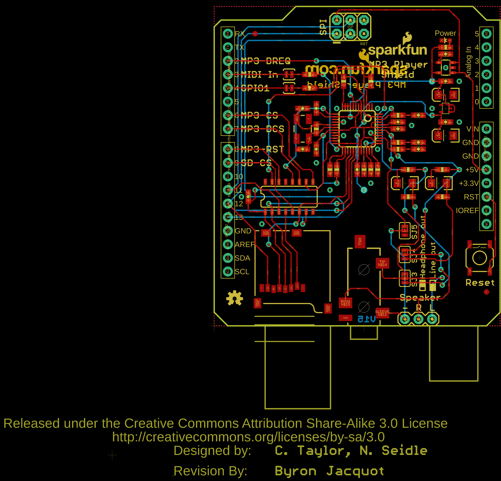
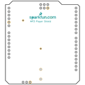
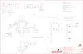
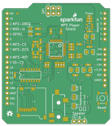
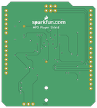

Contents
========

* [PRS12660 > MP3 Player Shield](#prs12660--mp3-player-shield)
	* [Schematic](#schematic)
	* [PCB](#pcb)
	* [Interactive BOM](#interactive-bom)
	* [OOMP Parts](#oomp-parts)
	* [Images](#images)
	* [Tags](#tags)
  
![][im]
# PRS12660 > MP3 Player Shield

- ID: PROJ-SPAR-12660-STAN-01
- Hex ID: PRS12660
- Name: Sparkfun
- Description: Sparkfun
- Long Link: [http://oom.lt/PROJ-SPAR-12660-STAN-01](http://oom.lt/PROJ-SPAR-12660-STAN-01)
- Short Link: [http://oom.lt/PRS12660](http://oom.lt/PRS12660)

## Schematic
  

## PCB
  

## Interactive BOM

- Interactive BOM page: [ibom.html](https://htmlpreview.github.io/?https://github.com/oomlout/oomlout_OOMP_projects/blob/main/PROJ-SPAR-12660-STAN-01/kicad/bom/ibom.html)

## OOMP Parts
  

|OOMP ID|Name|Identifier|
| :---: | :---: | :---: |
|CAPT-3216-X-UF10-01||C1, C6, C17, C18|
|[CAPC-0603-X-NF100-V50](https://github.com/oomlout/oomlout_OOMP_parts/tree/main/CAPC-0603-X-NF100-V50/)|[SMD (0603) 100 nF Capacitor (Ceramic) 50v](https://github.com/oomlout/oomlout_OOMP_parts/tree/main/CAPC-0603-X-NF100-V50/)|[C2, C5, C7, C13, C14, C15, C16](https://github.com/oomlout/oomlout_OOMP_parts/tree/main/CAPC-0603-X-NF100-V50/)|
|[CAPC-0603-X-PF22-V50](https://github.com/oomlout/oomlout_OOMP_parts/tree/main/CAPC-0603-X-PF22-V50/)|[SMD (0603) 22 pF Capacitor (Ceramic) 50v](https://github.com/oomlout/oomlout_OOMP_parts/tree/main/CAPC-0603-X-PF22-V50/)|[C3, C8](https://github.com/oomlout/oomlout_OOMP_parts/tree/main/CAPC-0603-X-PF22-V50/)|
|CAPC-0603-X-PF470-01||C4|
|CAPC-0603-X-UNMATCHED-01||C9|
|[CAPC-0603-X-NF10-V50](https://github.com/oomlout/oomlout_OOMP_parts/tree/main/CAPC-0603-X-NF10-V50/)|[SMD (0603) 10 nF Capacitor (Ceramic) 50v](https://github.com/oomlout/oomlout_OOMP_parts/tree/main/CAPC-0603-X-NF10-V50/)|[C10, C11](https://github.com/oomlout/oomlout_OOMP_parts/tree/main/CAPC-0603-X-NF10-V50/)|
|CAPC-0603-X-NF47-01||C12|
|UNMATCHED-UNMATCHED-X-UNMATCHED-01||J1, Q1, S2, TP1, TP2, U2, U3, U4, U6, U7|
|TERS-35D-L-UNMATCHED-01||JP1|
|[HEAD-I01-X-PI03-01](https://github.com/oomlout/oomlout_OOMP_parts/tree/main/HEAD-I01-X-PI03-01/)|[2.54 mm 3 Pin Header](https://github.com/oomlout/oomlout_OOMP_parts/tree/main/HEAD-I01-X-PI03-01/)|[JP3](https://github.com/oomlout/oomlout_OOMP_parts/tree/main/HEAD-I01-X-PI03-01/)|
|[LEDS-0603-G-STAN-01](https://github.com/oomlout/oomlout_OOMP_parts/tree/main/LEDS-0603-G-STAN-01/)|[SMD (0603) Green LED](https://github.com/oomlout/oomlout_OOMP_parts/tree/main/LEDS-0603-G-STAN-01/)|[LED1](https://github.com/oomlout/oomlout_OOMP_parts/tree/main/LEDS-0603-G-STAN-01/)|
|[RESE-0603-X-O105-01](https://github.com/oomlout/oomlout_OOMP_parts/tree/main/RESE-0603-X-O105-01/)|[SMD (0603) 1M Ohm Resistor](https://github.com/oomlout/oomlout_OOMP_parts/tree/main/RESE-0603-X-O105-01/)|[R1](https://github.com/oomlout/oomlout_OOMP_parts/tree/main/RESE-0603-X-O105-01/)|
|RESE-0603-X-O1003-01||R2, R3, R4, R5, R10, R11, R12|
|[RESE-0603-X-O200-01](https://github.com/oomlout/oomlout_OOMP_parts/tree/main/RESE-0603-X-O200-01/)|[SMD (0603) 20 Ohm Resistor](https://github.com/oomlout/oomlout_OOMP_parts/tree/main/RESE-0603-X-O200-01/)|[R6, R7](https://github.com/oomlout/oomlout_OOMP_parts/tree/main/RESE-0603-X-O200-01/)|
|[RESE-0603-X-O331-01](https://github.com/oomlout/oomlout_OOMP_parts/tree/main/RESE-0603-X-O331-01/)|[SMD (0603) 330 Ohm Resistor](https://github.com/oomlout/oomlout_OOMP_parts/tree/main/RESE-0603-X-O331-01/)|[R8](https://github.com/oomlout/oomlout_OOMP_parts/tree/main/RESE-0603-X-O331-01/)|
|[RESE-0603-X-O100-01](https://github.com/oomlout/oomlout_OOMP_parts/tree/main/RESE-0603-X-O100-01/)|[SMD (0603) 10 Ohm Resistor](https://github.com/oomlout/oomlout_OOMP_parts/tree/main/RESE-0603-X-O100-01/)|[R9](https://github.com/oomlout/oomlout_OOMP_parts/tree/main/RESE-0603-X-O100-01/)|
|[RESE-0603-X-O102-01](https://github.com/oomlout/oomlout_OOMP_parts/tree/main/RESE-0603-X-O102-01/)|[SMD (0603) 1k Ohm Resistor](https://github.com/oomlout/oomlout_OOMP_parts/tree/main/RESE-0603-X-O102-01/)|[R13, R14](https://github.com/oomlout/oomlout_OOMP_parts/tree/main/RESE-0603-X-O102-01/)|
|[RESE-0603-X-O103-01](https://github.com/oomlout/oomlout_OOMP_parts/tree/main/RESE-0603-X-O103-01/)|[SMD (0603) 10k Ohm Resistor](https://github.com/oomlout/oomlout_OOMP_parts/tree/main/RESE-0603-X-O103-01/)|[R15, R16](https://github.com/oomlout/oomlout_OOMP_parts/tree/main/RESE-0603-X-O103-01/)|
|[RESE-0603-X-O471-01](https://github.com/oomlout/oomlout_OOMP_parts/tree/main/RESE-0603-X-O471-01/)|[SMD (0603) 470 Ohm Resistor](https://github.com/oomlout/oomlout_OOMP_parts/tree/main/RESE-0603-X-O471-01/)|[R21, R22](https://github.com/oomlout/oomlout_OOMP_parts/tree/main/RESE-0603-X-O471-01/)|
|VREG-SO235-X-KMIC5205-01||U1|

## Images
  
  

|bominteractivefront|bominteractiveback|kicadPcb3d|kicadPcb3dFront|kicadPcb3dBack|eagleImage|eagleSchemImage|pcbdraw|pcbdrawback|
| :---: | :---: | :---: | :---: | :---: | :---: | :---: | :---: | :---: |
||||||||||

## Tags

- hexID: PRS12660
- oompType: PROJ
- oompSize: SPAR
- oompColor: 12660
- oompDesc: STAN
- oompIndex: 01
- oompName: MP3 Player Shield
- sources: All source files from https://github.com/sparkfun/MP3_Player_Shield (source licence details in srcLicense.md)
- linkBuyPage: https://www.sparkfun.com/products/12660
- oompID: PROJ-SPAR-12660-STAN-01
- oompParts: C1,CAPT-3216-X-UF10-01
- oompParts: C2,CAPC-0603-X-NF100-V50
- oompParts: C3,CAPC-0603-X-PF22-V50
- oompParts: C4,CAPC-0603-X-PF470-01
- oompParts: C5,CAPC-0603-X-NF100-V50
- oompParts: C6,CAPT-3216-X-UF10-01
- oompParts: C7,CAPC-0603-X-NF100-V50
- oompParts: C8,CAPC-0603-X-PF22-V50
- oompParts: C9,CAPC-0603-X-UNMATCHED-01
- oompParts: C10,CAPC-0603-X-NF10-V50
- oompParts: C11,CAPC-0603-X-NF10-V50
- oompParts: C12,CAPC-0603-X-NF47-01
- oompParts: C13,CAPC-0603-X-NF100-V50
- oompParts: C14,CAPC-0603-X-NF100-V50
- oompParts: C15,CAPC-0603-X-NF100-V50
- oompParts: C16,CAPC-0603-X-NF100-V50
- oompParts: C17,CAPT-3216-X-UF10-01
- oompParts: C18,CAPT-3216-X-UF10-01
- oompParts: J1,UNMATCHED-UNMATCHED-X-UNMATCHED-01
- oompParts: JP1,TERS-35D-L-UNMATCHED-01
- oompParts: JP3,HEAD-I01-X-PI03-01
- oompParts: LED1,LEDS-0603-G-STAN-01
- oompParts: Q1,UNMATCHED-UNMATCHED-X-UNMATCHED-01
- oompParts: R1,RESE-0603-X-O105-01
- oompParts: R2,RESE-0603-X-O1003-01
- oompParts: R3,RESE-0603-X-O1003-01
- oompParts: R4,RESE-0603-X-O1003-01
- oompParts: R5,RESE-0603-X-O1003-01
- oompParts: R6,RESE-0603-X-O200-01
- oompParts: R7,RESE-0603-X-O200-01
- oompParts: R8,RESE-0603-X-O331-01
- oompParts: R9,RESE-0603-X-O100-01
- oompParts: R10,RESE-0603-X-O1003-01
- oompParts: R11,RESE-0603-X-O1003-01
- oompParts: R12,RESE-0603-X-O1003-01
- oompParts: R13,RESE-0603-X-O102-01
- oompParts: R14,RESE-0603-X-O102-01
- oompParts: R15,RESE-0603-X-O103-01
- oompParts: R16,RESE-0603-X-O103-01
- oompParts: R21,RESE-0603-X-O471-01
- oompParts: R22,RESE-0603-X-O471-01
- oompParts: S2,UNMATCHED-UNMATCHED-X-UNMATCHED-01
- oompParts: TP1,UNMATCHED-UNMATCHED-X-UNMATCHED-01
- oompParts: TP2,UNMATCHED-UNMATCHED-X-UNMATCHED-01
- oompParts: U1,VREG-SO235-X-KMIC5205-01
- oompParts: U2,UNMATCHED-UNMATCHED-X-UNMATCHED-01
- oompParts: U3,UNMATCHED-UNMATCHED-X-UNMATCHED-01
- oompParts: U4,UNMATCHED-UNMATCHED-X-UNMATCHED-01
- oompParts: U6,UNMATCHED-UNMATCHED-X-UNMATCHED-01
- oompParts: U7,UNMATCHED-UNMATCHED-X-UNMATCHED-01
- rawParts: C1,10uF,10UF-16V-10%(TANT),EIA3216,CAP-00811,CAP-00811,10uF,
- rawParts: C2,0.1uF,0.1UF-25V(+80/-20%)(0603),0603-CAP,CAP-00810,CAP-00810,0.1uF,
- rawParts: C3,22pF,22PF-50V-5%(0603),0603-CAP,CAP-07876,CAP-07876,22pF,
- rawParts: C4,470pF,470PF-50V-5%(0603)SMD,0603-CAP,CAP-07884,CAP-07884,470pF,
- rawParts: C5,0.1uF,0.1UF-25V(+80/-20%)(0603),0603-CAP,CAP-00810,CAP-00810,0.1uF,
- rawParts: C6,10uF,10UF-16V-10%(TANT),EIA3216,CAP-00811,CAP-00811,10uF,
- rawParts: C7,0.1uF,0.1UF-25V(+80/-20%)(0603),0603-CAP,CAP-00810,CAP-00810,0.1uF,
- rawParts: C8,22pF,22PF-50V-5%(0603),0603-CAP,CAP-07876,CAP-07876,22pF,
- rawParts: C9,1.0uF,1.0UF-16V-10%(0603),0603-CAP,CAP-00868,CAP-00868,1.0uF,
- rawParts: C10,10nF,10NF/10000PF-50V-10%(0603),0603-CAP,CAP-00867,CAP-00867,10nF,
- rawParts: C11,10nF,10NF/10000PF-50V-10%(0603),0603-CAP,CAP-00867,CAP-00867,10nF,
- rawParts: C12,47nF,47NF(0.047UF/47000PF)-25V-5%(0603)SMD,0603-CAP,CAP-08605,CAP-08605,47nF,
- rawParts: C13,0.1uF,0.1UF-25V(+80/-20%)(0603),0603-CAP,CAP-00810,CAP-00810,0.1uF,
- rawParts: C14,0.1uF,0.1UF-25V(+80/-20%)(0603),0603-CAP,CAP-00810,CAP-00810,0.1uF,
- rawParts: C15,0.1uF,0.1UF-25V(+80/-20%)(0603),0603-CAP,CAP-00810,CAP-00810,0.1uF,
- rawParts: C16,0.1uF,0.1UF-25V(+80/-20%)(0603),0603-CAP,CAP-00810,CAP-00810,0.1uF,
- rawParts: C17,10uF,10UF-16V-10%(TANT),EIA3216,CAP-00811,CAP-00811,10uF,
- rawParts: C18,10uF,10UF-16V-10%(TANT),EIA3216,CAP-00811,CAP-00811,10uF,
- rawParts: FRAME1,FRAME-LEDGER,FRAME-LEDGER,CREATIVE_COMMONS,Schematic Frame,,,
- rawParts: J1,ISP/SPI,AVR_SPI_PRG_6PTH,2X3,AVR ISP 6 Pin,,,
- rawParts: JP1,,AUDIO-JACKSMD2,AUDIO-JACK-3.5MM-SMD,3.5mm Audio Jack,CONN-10353,,
- rawParts: JP3,Optional,M03PTH,1X03,Header 3,,,
- rawParts: LED1,Power,LED-RED0603,LED-0603,Assorted Red LEDs,DIO-00819,RED,
- rawParts: LOGO1,OSHW-LOGOS,OSHW-LOGOS,OSHW-LOGO-S,Open Source Hardware Logo This logo indicates the piece of hardware it is found on incorporates a OSHW license and/or adheres to the definition of open source hardware found here: http://freedomdefined.org/OSHW,,,
- rawParts: LOGO2,SFE_LOGO_NAME_FLAME.1_INCH,SFE_LOGO_NAME_FLAME.1_INCH,SFE_LOGO_NAME_FLAME_.1,SFE Logo, name and flame,,,
- rawParts: Q1,12.288MHz,CRYSTAL5X3,CRYSTAL-SMD-5X3,Crystals,XTAL-09653,,
- rawParts: R1,1M,1M-1%,0603-RES,1M-ohm SMT,RES-07868,1M,
- rawParts: R2,100k,100KOHM1/10W1%(0603),0603-RES,RES-07828,RES-07828,100k,
- rawParts: R3,100k,100KOHM1/10W1%(0603),0603-RES,RES-07828,RES-07828,100k,
- rawParts: R4,100k,100KOHM1/10W1%(0603),0603-RES,RES-07828,RES-07828,100k,
- rawParts: R5,100k,100KOHM1/10W1%(0603),0603-RES,RES-07828,RES-07828,100k,
- rawParts: R6,20,20OHM1/10W1%(0603)SMD,0603-RES,RES-07862,RES-07862,20,
- rawParts: R7,20,20OHM1/10W1%(0603)SMD,0603-RES,RES-07862,RES-07862,20,
- rawParts: R8,330,330OHM1/10W1%(0603),0603-RES,RES-00818,RES-00818,330,
- rawParts: R9,10,10OHM1/10W5%0603SMD,0603-RES,RES-09834,RES-09834,10,
- rawParts: R10,100k,100KOHM1/10W1%(0603),0603-RES,RES-07828,RES-07828,100k,
- rawParts: R11,100k,100KOHM1/10W1%(0603),0603-RES,RES-07828,RES-07828,100k,
- rawParts: R12,100k,100KOHM1/10W1%(0603),0603-RES,RES-07828,RES-07828,100k,
- rawParts: R13,1K,1KOHM1/10W1%(0603),0603-RES,RES-07856,RES-07856,1K,
- rawParts: R14,1K,1KOHM1/10W1%(0603),0603-RES,RES-07856,RES-07856,1K,
- rawParts: R15,10K,10KOHM1/10W1%(0603)0603,0603-RES,RES-00824,RES-00824,10K,
- rawParts: R16,10K,10KOHM1/10W1%(0603)0603,0603-RES,RES-00824,RES-00824,10K,
- rawParts: R21,470,470OHM1/10W1%(0603),0603-RES,RES-07869,RES-07869,470,
- rawParts: R22,470,470OHM1/10W1%(0603),0603-RES,RES-07869,RES-07869,470,
- rawParts: S2,Reset,SWITCH-MOMENTARY-2SMD,TACTILE_SWITCH_SMD,Various NO switches- pushbuttons, reed, etc,SWCH-08247,,
- rawParts: SJ1,NC,SOLDERJUMPERTRACE,SJ_2S-TRACE,Solder Jumper,,,
- rawParts: SJ2,NC,SOLDERJUMPERTRACE,SJ_2S-TRACE,Solder Jumper,,,
- rawParts: SJ3,AC Coupling L,JUMPER-PAD-3-2OF3_NC_BY_PASTE,PAD-JUMPER-3-2OF3_NC_BY_PASTE_YES_SILK_FULL_BOX,,,,
- rawParts: SJ4,AC Coupling R,JUMPER-PAD-3-2OF3_NC_BY_PASTE,PAD-JUMPER-3-2OF3_NC_BY_PASTE_YES_SILK_FULL_BOX,,,,
- rawParts: SJ5,AC Coupling Gnd,JUMPER-PAD-3-2OF3_NC_BY_PASTE,PAD-JUMPER-3-2OF3_NC_BY_PASTE_YES_SILK_FULL_BOX,,,,
- rawParts: TP1,,TEST-POINT3X5,PAD.03X.05,,,,
- rawParts: TP2,,TEST-POINT3X5,PAD.03X.05,,,,
- rawParts: U$1,REVISION,REVISION,REVISION,,,,
- rawParts: U$4,FIDUCIAL1X2,FIDUCIAL1X2,FIDUCIAL-1X2,Fiducial Alignment Points,,,
- rawParts: U$5,FIDUCIAL1X2,FIDUCIAL1X2,FIDUCIAL-1X2,Fiducial Alignment Points,,,
- rawParts: U$8,LOGO-SFENEW,LOGO-SFENEW,SFE-NEW-WEBLOGO,Spark Fun Electronics PCB Logo,,,
- rawParts: U1,3.3V,V_REG_MIC52053.3V,SOT23-5,V_REG MIC5219,VREG-00822,3.3V/150mA,
- rawParts: U2,ARDUINO_R3_SHIELD,ARDUINO_R3_SHIELD,UNO_R3_SHIELD,Shield form compatible with the Arduino Uno R3.,,,
- rawParts: U3,VS1053,VS1033/1053SMD,LQFP-48,MP3 codec,IC-08983,VS1053B,
- rawParts: U4,1.8V,V_REG_SP62141.8V,SC70,,VREG-08428,1.8V/100mA,
- rawParts: U6,USD-SOCKET,USD-SOCKETNEW,MICRO-SD-SOCKET-PP,microSD Socket,CONN-07820,,
- rawParts: U7,74HC4050 LVL CONVERTER,HEX_CONVERTER,SO016,Just what it says.,IC-09604,,

[im]: kicadPcb3d_450.png
