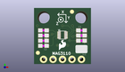
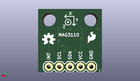
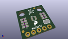

Contents
========

* [PROJ-SPAR-12670-STAN-01>MAG3110 Breakout Board](#proj-spar-12670-stan-01mag3110-breakout-board)
	* [Images](#images)
	* [Interactive BOM](#interactive-bom)
	* [OOMP Parts](#oomp-parts)
	* [Tags](#tags)
  
![][im]
# PROJ-SPAR-12670-STAN-01>MAG3110 Breakout Board

- ID: PROJ-SPAR-12670-STAN-01
- Hex ID: PRS12670
- Name: MAG3110 Breakout Board
- Description: 

## Images
  
  

|eagleImage|kicadPcb3dFront|kicadPcb3dBack|kicadPcb3d|
| :---: | :---: | :---: | :---: |
|||||

## Interactive BOM

- Interactive BOM page: [ibom.html](kicad/bom/ibom.html)

## OOMP Parts
  

|OOMP Parts|
| :---: |
|<table><tr><td></td><td> C1</td><td>[CAPC-0603-X-NF100-V50 SMD (0603) 100 nF Capacitor (Ceramic) 50v](https://github.com/oomlout/oomlout_OOMP_parts/tree/main/CAPC-0603-X-NF100-V50/)</td><td>[C6N100](https://github.com/oomlout/oomlout_OOMP_parts/tree/main/CAPC-0603-X-NF100-V50/)</td></tr></table>|
|<table><tr><td></td><td> C2</td><td>[CAPC-0603-X-NF100-V50 SMD (0603) 100 nF Capacitor (Ceramic) 50v](https://github.com/oomlout/oomlout_OOMP_parts/tree/main/CAPC-0603-X-NF100-V50/)</td><td>[C6N100](https://github.com/oomlout/oomlout_OOMP_parts/tree/main/CAPC-0603-X-NF100-V50/)</td></tr></table>|
|<table><tr><td></td><td> C3</td><td>[CAPC-0603-X-NF100-V50 SMD (0603) 100 nF Capacitor (Ceramic) 50v](https://github.com/oomlout/oomlout_OOMP_parts/tree/main/CAPC-0603-X-NF100-V50/)</td><td>[C6N100](https://github.com/oomlout/oomlout_OOMP_parts/tree/main/CAPC-0603-X-NF100-V50/)</td></tr></table>|
|CAPC-0603-X-UNMATCHED-01, C4, 2.54, 7.746999999999999, 180,C4, 1uF, 0603-CAP, SparkFun, (0.1, 0.305), R180|
|<table><tr><td></td><td> C5</td><td>[CAPC-0603-X-NF100-V50 SMD (0603) 100 nF Capacitor (Ceramic) 50v](https://github.com/oomlout/oomlout_OOMP_parts/tree/main/CAPC-0603-X-NF100-V50/)</td><td>[C6N100](https://github.com/oomlout/oomlout_OOMP_parts/tree/main/CAPC-0603-X-NF100-V50/)</td></tr></table>|
|<table><tr><td></td><td> JP1</td><td>[HEAD-I01-X-PI05-01 2.54 mm 5 Pin Header](https://github.com/oomlout/oomlout_OOMP_parts/tree/main/HEAD-I01-X-PI05-01/)</td><td>[H05](https://github.com/oomlout/oomlout_OOMP_parts/tree/main/HEAD-I01-X-PI05-01/)</td></tr></table>|
|RESE-0603-X-UNMATCHED-01, R1, 12.7, 6.35, 0,R1, 4.7k, 0603-RES, SparkFun, (0.5, 0.25), R0|
|RESE-0603-X-UNMATCHED-01, R2, 12.7, 7.746999999999999, 0,R2, 4.7k, 0603-RES, SparkFun, (0.5, 0.305), R0|
|UNMATCHED-UNMATCHED-X-UNMATCHED-01, U1, 7.619999999999999, 7.874, 0,U1, MAG31101:1, DFN-10-W, SparkFun-Sensors, (0.3, 0.31), R0|

## Tags

- hexID: PRS12670
- oompType: PROJ
- oompSize: SPAR
- oompColor: 12670
- oompDesc: STAN
- oompIndex: 01
- oompName: MAG3110 Breakout Board
- sources: All source files from https://github.com/sparkfun/MAG3110_Breakout_Board (source licence details in srcLicense.md)
- linkBuyPage: https://www.sparkfun.com/products/12670
- oompPart: CAPC-0603-X-NF100-V50, C1, 2.54, 9.143999999999998, 180
- oompPart: CAPC-0603-X-NF100-V50, C2, 2.54, 4.953, 180
- oompPart: CAPC-0603-X-NF100-V50, C3, 12.7, 9.143999999999998, 0
- oompPart: CAPC-0603-X-UNMATCHED-01, C4, 2.54, 7.746999999999999, 180
- oompPart: CAPC-0603-X-NF100-V50, C5, 2.54, 6.35, 180
- oompPart: SKIP-UNMATCHED-X-UNMATCHED-01, FID1, 1.016, 3.0479999999999996, 0
- oompPart: SKIP-UNMATCHED-X-UNMATCHED-01, FID2, 10.16, 14.224, 0
- oompPart: HEAD-I01-X-PI05-01, JP1, 2.54, 1.27, M180
- oompPart: RESE-0603-X-UNMATCHED-01, R1, 12.7, 6.35, 0
- oompPart: RESE-0603-X-UNMATCHED-01, R2, 12.7, 7.746999999999999, 0
- oompPart: SKIP-UNMATCHED-X-UNMATCHED-01, SJ1, 12.7, 4.064, 180
- oompPart: UNMATCHED-UNMATCHED-X-UNMATCHED-01, U1, 7.619999999999999, 7.874, 0
- rawPart: C1, 0.1uF, 0603-CAP, SparkFun, (0.1, 0.36), R180
- rawPart: C2, 0.1uF, 0603-CAP, SparkFun, (0.1, 0.195), R180
- rawPart: C3, 0.1uF, 0603-CAP, SparkFun, (0.5, 0.36), R0
- rawPart: C4, 1uF, 0603-CAP, SparkFun, (0.1, 0.305), R180
- rawPart: C5, 0.1uF, 0603-CAP, SparkFun, (0.1, 0.25), R180
- rawPart: FID1, FIDUCIAL1X2, FIDUCIAL-1X2, SparkFun-Aesthetics, (0.04, 0.12), R0
- rawPart: FID2, FIDUCIAL1X2, FIDUCIAL-1X2, SparkFun-Aesthetics, (0.4, 0.56), R0
- rawPart: JP1, breakout, 1X05, SparkFun, (0.1, 0.05), MR180
- rawPart: R1, 4.7k, 0603-RES, SparkFun, (0.5, 0.25), R0
- rawPart: R2, 4.7k, 0603-RES, SparkFun, (0.5, 0.305), R0
- rawPart: SJ1, SJ_3_PASTE1&2&3, SparkFun-Passives, (0.5, 0.16), R180
- rawPart: U1, MAG31101:1, DFN-10-W, SparkFun-Sensors, (0.3, 0.31), R0
- oompID: PROJ-SPAR-12670-STAN-01

[im]: kicadPcb3d_450.png
