Contents
========

* [PRS12699 > Solderable Breadboard Large](#prs12699--solderable-breadboard-large)
	* [Schematic](#schematic)
	* [PCB](#pcb)
	* [Interactive BOM](#interactive-bom)
	* [OOMP Parts](#oomp-parts)
	* [Images](#images)
	* [Tags](#tags)
  
![][im]
# PRS12699 > Solderable Breadboard Large

- ID: PROJ-SPAR-12699-STAN-01
- Hex ID: PRS12699
- Name: Sparkfun
- Description: Sparkfun
- Long Link: [http://oom.lt/PROJ-SPAR-12699-STAN-01](http://oom.lt/PROJ-SPAR-12699-STAN-01)
- Short Link: [http://oom.lt/PRS12699](http://oom.lt/PRS12699)

## Schematic
  
[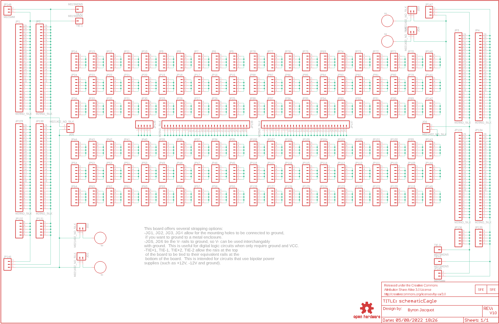](eagleSchemImage.png)
## PCB
  
[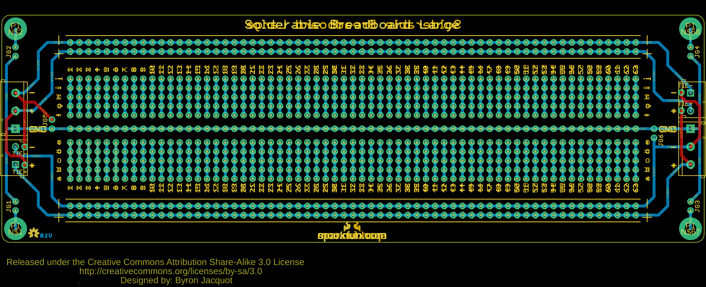](eagleImage.png)
## Interactive BOM

- Interactive BOM page: [ibom.html](https://htmlpreview.github.io/?https://github.com/oomlout/oomlout_OOMP_projects/blob/main/PROJ-SPAR-12699-STAN-01/kicad/bom/ibom.html)

## OOMP Parts
  

|OOMP ID|Name|Identifier|
| :---: | :---: | :---: |
|[HEAD-I01-X-PI02-01](https://github.com/oomlout/oomlout_OOMP_parts/tree/main/HEAD-I01-X-PI02-01/)|[2.54 mm 2 Pin Header](https://github.com/oomlout/oomlout_OOMP_parts/tree/main/HEAD-I01-X-PI02-01/)|[JG1, JG2, JG3, JG4, JG5, JG6](https://github.com/oomlout/oomlout_OOMP_parts/tree/main/HEAD-I01-X-PI02-01/)|
|HEAD-I01-X-PI29-01||JP1, JP2, JP3, JP4, JP129, JP130, JP133, JP134, JP137, JP138|
|[HEAD-I01-X-PI05-01](https://github.com/oomlout/oomlout_OOMP_parts/tree/main/HEAD-I01-X-PI05-01/)|[2.54 mm 5 Pin Header](https://github.com/oomlout/oomlout_OOMP_parts/tree/main/HEAD-I01-X-PI05-01/)|[JP5, JP6, JP7, JP8, JP9, JP10, JP11, JP12, JP13, JP14, JP15, JP16, JP17, JP18, JP19, JP20, JP21, JP22, JP23, JP24, JP25, JP26, JP27, JP28, JP29, JP30, JP31, JP32, JP33, JP34, JP35, JP36, JP37, JP38, JP39, JP40, JP41, JP42, JP43, JP44, JP45, JP46, JP47, JP48, JP49, JP50, JP51, JP52, JP53, JP54, JP55, JP56, JP57, JP58, JP59, JP60, JP61, JP62, JP63, JP64, JP69, JP70, JP71, JP72, JP73, JP74, JP75, JP76, JP77, JP78, JP79, JP80, JP81, JP82, JP83, JP84, JP85, JP86, JP87, JP88, JP89, JP90, JP91, JP92, JP93, JP94, JP95, JP96, JP97, JP98, JP99, JP100, JP101, JP102, JP103, JP104, JP105, JP106, JP107, JP108, JP109, JP110, JP111, JP112, JP113, JP114, JP115, JP116, JP117, JP118, JP119, JP120, JP121, JP122, JP123, JP124, JP125, JP126, JP127, JP128, JP131, JP132, JP135, JP136, JP139, JP140, JP141, JP142, JP143, JP144, JP145](https://github.com/oomlout/oomlout_OOMP_parts/tree/main/HEAD-I01-X-PI05-01/)|
|TERS-UNMATCHED-X-UNMATCHED-01||JP146, JP147, JP148, JP149|
|HEAD-I01-X-PI01-01||TIE+1, TIE+2, TIE-1, TIE-2|

## Images
  
  

|bominteractivefront|bominteractiveback|kicadPcb3d|kicadPcb3dFront|kicadPcb3dBack|kicadSchem|eagleImage|eagleSchemImage|pcbdraw|pcbdrawback|
| :---: | :---: | :---: | :---: | :---: | :---: | :---: | :---: | :---: | :---: |
|[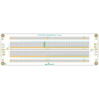](bomFront.png)|[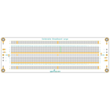](bomBack.png)|[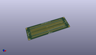](kicadPcb3d.png)|[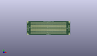](kicadPcb3dFront.png)|[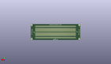](kicadPcb3dBack.png)|[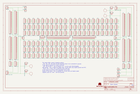](kicadSchem.png)|[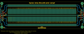](eagleImage.png)|[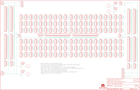](eagleSchemImage.png)|[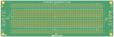](pcbdraw.png)|[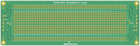](pcbdrawBack.png)|

## Tags

- hexID: PRS12699
- oompType: PROJ
- oompSize: SPAR
- oompColor: 12699
- oompDesc: STAN
- oompIndex: 01
- oompName: Solderable Breadboard Large
- sources: All source files from https://github.com/sparkfun/Solderable_Breadboard_Large (source licence details in srcLicense.md)
- linkBuyPage: https://www.sparkfun.com/products/12699
- oompID: PROJ-SPAR-12699-STAN-01
- oompParts: JG1,HEAD-I01-X-PI02-01
- oompParts: JG2,HEAD-I01-X-PI02-01
- oompParts: JG3,HEAD-I01-X-PI02-01
- oompParts: JG4,HEAD-I01-X-PI02-01
- oompParts: JG5,HEAD-I01-X-PI02-01
- oompParts: JG6,HEAD-I01-X-PI02-01
- oompParts: JP1,HEAD-I01-X-PI29-01
- oompParts: JP2,HEAD-I01-X-PI29-01
- oompParts: JP3,HEAD-I01-X-PI29-01
- oompParts: JP4,HEAD-I01-X-PI29-01
- oompParts: JP5,HEAD-I01-X-PI05-01
- oompParts: JP6,HEAD-I01-X-PI05-01
- oompParts: JP7,HEAD-I01-X-PI05-01
- oompParts: JP8,HEAD-I01-X-PI05-01
- oompParts: JP9,HEAD-I01-X-PI05-01
- oompParts: JP10,HEAD-I01-X-PI05-01
- oompParts: JP11,HEAD-I01-X-PI05-01
- oompParts: JP12,HEAD-I01-X-PI05-01
- oompParts: JP13,HEAD-I01-X-PI05-01
- oompParts: JP14,HEAD-I01-X-PI05-01
- oompParts: JP15,HEAD-I01-X-PI05-01
- oompParts: JP16,HEAD-I01-X-PI05-01
- oompParts: JP17,HEAD-I01-X-PI05-01
- oompParts: JP18,HEAD-I01-X-PI05-01
- oompParts: JP19,HEAD-I01-X-PI05-01
- oompParts: JP20,HEAD-I01-X-PI05-01
- oompParts: JP21,HEAD-I01-X-PI05-01
- oompParts: JP22,HEAD-I01-X-PI05-01
- oompParts: JP23,HEAD-I01-X-PI05-01
- oompParts: JP24,HEAD-I01-X-PI05-01
- oompParts: JP25,HEAD-I01-X-PI05-01
- oompParts: JP26,HEAD-I01-X-PI05-01
- oompParts: JP27,HEAD-I01-X-PI05-01
- oompParts: JP28,HEAD-I01-X-PI05-01
- oompParts: JP29,HEAD-I01-X-PI05-01
- oompParts: JP30,HEAD-I01-X-PI05-01
- oompParts: JP31,HEAD-I01-X-PI05-01
- oompParts: JP32,HEAD-I01-X-PI05-01
- oompParts: JP33,HEAD-I01-X-PI05-01
- oompParts: JP34,HEAD-I01-X-PI05-01
- oompParts: JP35,HEAD-I01-X-PI05-01
- oompParts: JP36,HEAD-I01-X-PI05-01
- oompParts: JP37,HEAD-I01-X-PI05-01
- oompParts: JP38,HEAD-I01-X-PI05-01
- oompParts: JP39,HEAD-I01-X-PI05-01
- oompParts: JP40,HEAD-I01-X-PI05-01
- oompParts: JP41,HEAD-I01-X-PI05-01
- oompParts: JP42,HEAD-I01-X-PI05-01
- oompParts: JP43,HEAD-I01-X-PI05-01
- oompParts: JP44,HEAD-I01-X-PI05-01
- oompParts: JP45,HEAD-I01-X-PI05-01
- oompParts: JP46,HEAD-I01-X-PI05-01
- oompParts: JP47,HEAD-I01-X-PI05-01
- oompParts: JP48,HEAD-I01-X-PI05-01
- oompParts: JP49,HEAD-I01-X-PI05-01
- oompParts: JP50,HEAD-I01-X-PI05-01
- oompParts: JP51,HEAD-I01-X-PI05-01
- oompParts: JP52,HEAD-I01-X-PI05-01
- oompParts: JP53,HEAD-I01-X-PI05-01
- oompParts: JP54,HEAD-I01-X-PI05-01
- oompParts: JP55,HEAD-I01-X-PI05-01
- oompParts: JP56,HEAD-I01-X-PI05-01
- oompParts: JP57,HEAD-I01-X-PI05-01
- oompParts: JP58,HEAD-I01-X-PI05-01
- oompParts: JP59,HEAD-I01-X-PI05-01
- oompParts: JP60,HEAD-I01-X-PI05-01
- oompParts: JP61,HEAD-I01-X-PI05-01
- oompParts: JP62,HEAD-I01-X-PI05-01
- oompParts: JP63,HEAD-I01-X-PI05-01
- oompParts: JP64,HEAD-I01-X-PI05-01
- oompParts: JP69,HEAD-I01-X-PI05-01
- oompParts: JP70,HEAD-I01-X-PI05-01
- oompParts: JP71,HEAD-I01-X-PI05-01
- oompParts: JP72,HEAD-I01-X-PI05-01
- oompParts: JP73,HEAD-I01-X-PI05-01
- oompParts: JP74,HEAD-I01-X-PI05-01
- oompParts: JP75,HEAD-I01-X-PI05-01
- oompParts: JP76,HEAD-I01-X-PI05-01
- oompParts: JP77,HEAD-I01-X-PI05-01
- oompParts: JP78,HEAD-I01-X-PI05-01
- oompParts: JP79,HEAD-I01-X-PI05-01
- oompParts: JP80,HEAD-I01-X-PI05-01
- oompParts: JP81,HEAD-I01-X-PI05-01
- oompParts: JP82,HEAD-I01-X-PI05-01
- oompParts: JP83,HEAD-I01-X-PI05-01
- oompParts: JP84,HEAD-I01-X-PI05-01
- oompParts: JP85,HEAD-I01-X-PI05-01
- oompParts: JP86,HEAD-I01-X-PI05-01
- oompParts: JP87,HEAD-I01-X-PI05-01
- oompParts: JP88,HEAD-I01-X-PI05-01
- oompParts: JP89,HEAD-I01-X-PI05-01
- oompParts: JP90,HEAD-I01-X-PI05-01
- oompParts: JP91,HEAD-I01-X-PI05-01
- oompParts: JP92,HEAD-I01-X-PI05-01
- oompParts: JP93,HEAD-I01-X-PI05-01
- oompParts: JP94,HEAD-I01-X-PI05-01
- oompParts: JP95,HEAD-I01-X-PI05-01
- oompParts: JP96,HEAD-I01-X-PI05-01
- oompParts: JP97,HEAD-I01-X-PI05-01
- oompParts: JP98,HEAD-I01-X-PI05-01
- oompParts: JP99,HEAD-I01-X-PI05-01
- oompParts: JP100,HEAD-I01-X-PI05-01
- oompParts: JP101,HEAD-I01-X-PI05-01
- oompParts: JP102,HEAD-I01-X-PI05-01
- oompParts: JP103,HEAD-I01-X-PI05-01
- oompParts: JP104,HEAD-I01-X-PI05-01
- oompParts: JP105,HEAD-I01-X-PI05-01
- oompParts: JP106,HEAD-I01-X-PI05-01
- oompParts: JP107,HEAD-I01-X-PI05-01
- oompParts: JP108,HEAD-I01-X-PI05-01
- oompParts: JP109,HEAD-I01-X-PI05-01
- oompParts: JP110,HEAD-I01-X-PI05-01
- oompParts: JP111,HEAD-I01-X-PI05-01
- oompParts: JP112,HEAD-I01-X-PI05-01
- oompParts: JP113,HEAD-I01-X-PI05-01
- oompParts: JP114,HEAD-I01-X-PI05-01
- oompParts: JP115,HEAD-I01-X-PI05-01
- oompParts: JP116,HEAD-I01-X-PI05-01
- oompParts: JP117,HEAD-I01-X-PI05-01
- oompParts: JP118,HEAD-I01-X-PI05-01
- oompParts: JP119,HEAD-I01-X-PI05-01
- oompParts: JP120,HEAD-I01-X-PI05-01
- oompParts: JP121,HEAD-I01-X-PI05-01
- oompParts: JP122,HEAD-I01-X-PI05-01
- oompParts: JP123,HEAD-I01-X-PI05-01
- oompParts: JP124,HEAD-I01-X-PI05-01
- oompParts: JP125,HEAD-I01-X-PI05-01
- oompParts: JP126,HEAD-I01-X-PI05-01
- oompParts: JP127,HEAD-I01-X-PI05-01
- oompParts: JP128,HEAD-I01-X-PI05-01
- oompParts: JP129,HEAD-I01-X-PI29-01
- oompParts: JP130,HEAD-I01-X-PI29-01
- oompParts: JP131,HEAD-I01-X-PI05-01
- oompParts: JP132,HEAD-I01-X-PI05-01
- oompParts: JP133,HEAD-I01-X-PI29-01
- oompParts: JP134,HEAD-I01-X-PI29-01
- oompParts: JP135,HEAD-I01-X-PI05-01
- oompParts: JP136,HEAD-I01-X-PI05-01
- oompParts: JP137,HEAD-I01-X-PI29-01
- oompParts: JP138,HEAD-I01-X-PI29-01
- oompParts: JP139,HEAD-I01-X-PI05-01
- oompParts: JP140,HEAD-I01-X-PI05-01
- oompParts: JP141,HEAD-I01-X-PI05-01
- oompParts: JP142,HEAD-I01-X-PI05-01
- oompParts: JP143,HEAD-I01-X-PI05-01
- oompParts: JP144,HEAD-I01-X-PI05-01
- oompParts: JP145,HEAD-I01-X-PI05-01
- oompParts: JP146,TERS-UNMATCHED-X-UNMATCHED-01
- oompParts: JP147,TERS-UNMATCHED-X-UNMATCHED-01
- oompParts: JP148,TERS-UNMATCHED-X-UNMATCHED-01
- oompParts: JP149,TERS-UNMATCHED-X-UNMATCHED-01
- oompParts: TIE+1,HEAD-I01-X-PI01-01
- oompParts: TIE+2,HEAD-I01-X-PI01-01
- oompParts: TIE-1,HEAD-I01-X-PI01-01
- oompParts: TIE-2,HEAD-I01-X-PI01-01
- rawParts: FRAME2,FRAME-LEDGER,FRAME-LEDGER,CREATIVE_COMMONS,Schematic Frame,,
- rawParts: JG1,M021X02_NO_SILK,M021X02_NO_SILK,1X02_NO_SILK,Standard 2-pin 0.1 header. Use with,,
- rawParts: JG2,M021X02_NO_SILK,M021X02_NO_SILK,1X02_NO_SILK,Standard 2-pin 0.1 header. Use with,,
- rawParts: JG3,M021X02_NO_SILK,M021X02_NO_SILK,1X02_NO_SILK,Standard 2-pin 0.1 header. Use with,,
- rawParts: JG4,M021X02_NO_SILK,M021X02_NO_SILK,1X02_NO_SILK,Standard 2-pin 0.1 header. Use with,,
- rawParts: JG5,M021X02_NO_SILK,M021X02_NO_SILK,1X02_NO_SILK,Standard 2-pin 0.1 header. Use with,,
- rawParts: JG6,M021X02_NO_SILK,M021X02_NO_SILK,1X02_NO_SILK,Standard 2-pin 0.1 header. Use with,,
- rawParts: JP1,M29NO_SILK,M29NO_SILK,1X29_NO_SILK,1x29 .1 header,,
- rawParts: JP2,M29NO_SILK,M29NO_SILK,1X29_NO_SILK,1x29 .1 header,,
- rawParts: JP3,M29NO_SILK,M29NO_SILK,1X29_NO_SILK,1x29 .1 header,,
- rawParts: JP4,M29NO_SILK,M29NO_SILK,1X29_NO_SILK,1x29 .1 header,,
- rawParts: JP5,,M05NO_SILK,1X05_NO_SILK,Header 5,,
- rawParts: JP6,,M05NO_SILK,1X05_NO_SILK,Header 5,,
- rawParts: JP7,,M05NO_SILK,1X05_NO_SILK,Header 5,,
- rawParts: JP8,,M05NO_SILK,1X05_NO_SILK,Header 5,,
- rawParts: JP9,,M05NO_SILK,1X05_NO_SILK,Header 5,,
- rawParts: JP10,,M05NO_SILK,1X05_NO_SILK,Header 5,,
- rawParts: JP11,,M05NO_SILK,1X05_NO_SILK,Header 5,,
- rawParts: JP12,,M05NO_SILK,1X05_NO_SILK,Header 5,,
- rawParts: JP13,,M05NO_SILK,1X05_NO_SILK,Header 5,,
- rawParts: JP14,,M05NO_SILK,1X05_NO_SILK,Header 5,,
- rawParts: JP15,,M05NO_SILK,1X05_NO_SILK,Header 5,,
- rawParts: JP16,,M05NO_SILK,1X05_NO_SILK,Header 5,,
- rawParts: JP17,,M05NO_SILK,1X05_NO_SILK,Header 5,,
- rawParts: JP18,,M05NO_SILK,1X05_NO_SILK,Header 5,,
- rawParts: JP19,,M05NO_SILK,1X05_NO_SILK,Header 5,,
- rawParts: JP20,,M05NO_SILK,1X05_NO_SILK,Header 5,,
- rawParts: JP21,,M05NO_SILK,1X05_NO_SILK,Header 5,,
- rawParts: JP22,,M05NO_SILK,1X05_NO_SILK,Header 5,,
- rawParts: JP23,,M05NO_SILK,1X05_NO_SILK,Header 5,,
- rawParts: JP24,,M05NO_SILK,1X05_NO_SILK,Header 5,,
- rawParts: JP25,,M05NO_SILK,1X05_NO_SILK,Header 5,,
- rawParts: JP26,,M05NO_SILK,1X05_NO_SILK,Header 5,,
- rawParts: JP27,,M05NO_SILK,1X05_NO_SILK,Header 5,,
- rawParts: JP28,,M05NO_SILK,1X05_NO_SILK,Header 5,,
- rawParts: JP29,,M05NO_SILK,1X05_NO_SILK,Header 5,,
- rawParts: JP30,,M05NO_SILK,1X05_NO_SILK,Header 5,,
- rawParts: JP31,,M05NO_SILK,1X05_NO_SILK,Header 5,,
- rawParts: JP32,,M05NO_SILK,1X05_NO_SILK,Header 5,,
- rawParts: JP33,,M05NO_SILK,1X05_NO_SILK,Header 5,,
- rawParts: JP34,,M05NO_SILK,1X05_NO_SILK,Header 5,,
- rawParts: JP35,,M05NO_SILK,1X05_NO_SILK,Header 5,,
- rawParts: JP36,,M05NO_SILK,1X05_NO_SILK,Header 5,,
- rawParts: JP37,,M05NO_SILK,1X05_NO_SILK,Header 5,,
- rawParts: JP38,,M05NO_SILK,1X05_NO_SILK,Header 5,,
- rawParts: JP39,,M05NO_SILK,1X05_NO_SILK,Header 5,,
- rawParts: JP40,,M05NO_SILK,1X05_NO_SILK,Header 5,,
- rawParts: JP41,,M05NO_SILK,1X05_NO_SILK,Header 5,,
- rawParts: JP42,,M05NO_SILK,1X05_NO_SILK,Header 5,,
- rawParts: JP43,,M05NO_SILK,1X05_NO_SILK,Header 5,,
- rawParts: JP44,,M05NO_SILK,1X05_NO_SILK,Header 5,,
- rawParts: JP45,,M05NO_SILK,1X05_NO_SILK,Header 5,,
- rawParts: JP46,,M05NO_SILK,1X05_NO_SILK,Header 5,,
- rawParts: JP47,,M05NO_SILK,1X05_NO_SILK,Header 5,,
- rawParts: JP48,,M05NO_SILK,1X05_NO_SILK,Header 5,,
- rawParts: JP49,,M05NO_SILK,1X05_NO_SILK,Header 5,,
- rawParts: JP50,,M05NO_SILK,1X05_NO_SILK,Header 5,,
- rawParts: JP51,,M05NO_SILK,1X05_NO_SILK,Header 5,,
- rawParts: JP52,,M05NO_SILK,1X05_NO_SILK,Header 5,,
- rawParts: JP53,,M05NO_SILK,1X05_NO_SILK,Header 5,,
- rawParts: JP54,,M05NO_SILK,1X05_NO_SILK,Header 5,,
- rawParts: JP55,,M05NO_SILK,1X05_NO_SILK,Header 5,,
- rawParts: JP56,,M05NO_SILK,1X05_NO_SILK,Header 5,,
- rawParts: JP57,,M05NO_SILK,1X05_NO_SILK,Header 5,,
- rawParts: JP58,,M05NO_SILK,1X05_NO_SILK,Header 5,,
- rawParts: JP59,,M05NO_SILK,1X05_NO_SILK,Header 5,,
- rawParts: JP60,,M05NO_SILK,1X05_NO_SILK,Header 5,,
- rawParts: JP61,,M05NO_SILK,1X05_NO_SILK,Header 5,,
- rawParts: JP62,,M05NO_SILK,1X05_NO_SILK,Header 5,,
- rawParts: JP63,,M05NO_SILK,1X05_NO_SILK,Header 5,,
- rawParts: JP64,,M05NO_SILK,1X05_NO_SILK,Header 5,,
- rawParts: JP69,,M05NO_SILK,1X05_NO_SILK,Header 5,,
- rawParts: JP70,,M05NO_SILK,1X05_NO_SILK,Header 5,,
- rawParts: JP71,,M05NO_SILK,1X05_NO_SILK,Header 5,,
- rawParts: JP72,,M05NO_SILK,1X05_NO_SILK,Header 5,,
- rawParts: JP73,,M05NO_SILK,1X05_NO_SILK,Header 5,,
- rawParts: JP74,,M05NO_SILK,1X05_NO_SILK,Header 5,,
- rawParts: JP75,,M05NO_SILK,1X05_NO_SILK,Header 5,,
- rawParts: JP76,,M05NO_SILK,1X05_NO_SILK,Header 5,,
- rawParts: JP77,,M05NO_SILK,1X05_NO_SILK,Header 5,,
- rawParts: JP78,,M05NO_SILK,1X05_NO_SILK,Header 5,,
- rawParts: JP79,,M05NO_SILK,1X05_NO_SILK,Header 5,,
- rawParts: JP80,,M05NO_SILK,1X05_NO_SILK,Header 5,,
- rawParts: JP81,,M05NO_SILK,1X05_NO_SILK,Header 5,,
- rawParts: JP82,,M05NO_SILK,1X05_NO_SILK,Header 5,,
- rawParts: JP83,,M05NO_SILK,1X05_NO_SILK,Header 5,,
- rawParts: JP84,,M05NO_SILK,1X05_NO_SILK,Header 5,,
- rawParts: JP85,,M05NO_SILK,1X05_NO_SILK,Header 5,,
- rawParts: JP86,,M05NO_SILK,1X05_NO_SILK,Header 5,,
- rawParts: JP87,,M05NO_SILK,1X05_NO_SILK,Header 5,,
- rawParts: JP88,,M05NO_SILK,1X05_NO_SILK,Header 5,,
- rawParts: JP89,,M05NO_SILK,1X05_NO_SILK,Header 5,,
- rawParts: JP90,,M05NO_SILK,1X05_NO_SILK,Header 5,,
- rawParts: JP91,,M05NO_SILK,1X05_NO_SILK,Header 5,,
- rawParts: JP92,,M05NO_SILK,1X05_NO_SILK,Header 5,,
- rawParts: JP93,,M05NO_SILK,1X05_NO_SILK,Header 5,,
- rawParts: JP94,,M05NO_SILK,1X05_NO_SILK,Header 5,,
- rawParts: JP95,,M05NO_SILK,1X05_NO_SILK,Header 5,,
- rawParts: JP96,,M05NO_SILK,1X05_NO_SILK,Header 5,,
- rawParts: JP97,,M05NO_SILK,1X05_NO_SILK,Header 5,,
- rawParts: JP98,,M05NO_SILK,1X05_NO_SILK,Header 5,,
- rawParts: JP99,,M05NO_SILK,1X05_NO_SILK,Header 5,,
- rawParts: JP100,,M05NO_SILK,1X05_NO_SILK,Header 5,,
- rawParts: JP101,,M05NO_SILK,1X05_NO_SILK,Header 5,,
- rawParts: JP102,,M05NO_SILK,1X05_NO_SILK,Header 5,,
- rawParts: JP103,,M05NO_SILK,1X05_NO_SILK,Header 5,,
- rawParts: JP104,,M05NO_SILK,1X05_NO_SILK,Header 5,,
- rawParts: JP105,,M05NO_SILK,1X05_NO_SILK,Header 5,,
- rawParts: JP106,,M05NO_SILK,1X05_NO_SILK,Header 5,,
- rawParts: JP107,,M05NO_SILK,1X05_NO_SILK,Header 5,,
- rawParts: JP108,,M05NO_SILK,1X05_NO_SILK,Header 5,,
- rawParts: JP109,,M05NO_SILK,1X05_NO_SILK,Header 5,,
- rawParts: JP110,,M05NO_SILK,1X05_NO_SILK,Header 5,,
- rawParts: JP111,,M05NO_SILK,1X05_NO_SILK,Header 5,,
- rawParts: JP112,,M05NO_SILK,1X05_NO_SILK,Header 5,,
- rawParts: JP113,,M05NO_SILK,1X05_NO_SILK,Header 5,,
- rawParts: JP114,,M05NO_SILK,1X05_NO_SILK,Header 5,,
- rawParts: JP115,,M05NO_SILK,1X05_NO_SILK,Header 5,,
- rawParts: JP116,,M05NO_SILK,1X05_NO_SILK,Header 5,,
- rawParts: JP117,,M05NO_SILK,1X05_NO_SILK,Header 5,,
- rawParts: JP118,,M05NO_SILK,1X05_NO_SILK,Header 5,,
- rawParts: JP119,,M05NO_SILK,1X05_NO_SILK,Header 5,,
- rawParts: JP120,,M05NO_SILK,1X05_NO_SILK,Header 5,,
- rawParts: JP121,,M05NO_SILK,1X05_NO_SILK,Header 5,,
- rawParts: JP122,,M05NO_SILK,1X05_NO_SILK,Header 5,,
- rawParts: JP123,,M05NO_SILK,1X05_NO_SILK,Header 5,,
- rawParts: JP124,,M05NO_SILK,1X05_NO_SILK,Header 5,,
- rawParts: JP125,,M05NO_SILK,1X05_NO_SILK,Header 5,,
- rawParts: JP126,,M05NO_SILK,1X05_NO_SILK,Header 5,,
- rawParts: JP127,,M05NO_SILK,1X05_NO_SILK,Header 5,,
- rawParts: JP128,,M05NO_SILK,1X05_NO_SILK,Header 5,,
- rawParts: JP129,M29NO_SILK,M29NO_SILK,1X29_NO_SILK,1x29 .1 header,,
- rawParts: JP130,M29NO_SILK,M29NO_SILK,1X29_NO_SILK,1x29 .1 header,,
- rawParts: JP131,,M05NO_SILK,1X05_NO_SILK,Header 5,,
- rawParts: JP132,,M05NO_SILK,1X05_NO_SILK,Header 5,,
- rawParts: JP133,M29NO_SILK,M29NO_SILK,1X29_NO_SILK,1x29 .1 header,,
- rawParts: JP134,M29NO_SILK,M29NO_SILK,1X29_NO_SILK,1x29 .1 header,,
- rawParts: JP135,,M05NO_SILK,1X05_NO_SILK,Header 5,,
- rawParts: JP136,,M05NO_SILK,1X05_NO_SILK,Header 5,,
- rawParts: JP137,M29NO_SILK,M29NO_SILK,1X29_NO_SILK,1x29 .1 header,,
- rawParts: JP138,M29NO_SILK,M29NO_SILK,1X29_NO_SILK,1x29 .1 header,,
- rawParts: JP139,,M05NO_SILK,1X05_NO_SILK,Header 5,,
- rawParts: JP140,,M05NO_SILK,1X05_NO_SILK,Header 5,,
- rawParts: JP141,,M05NO_SILK,1X05_NO_SILK,Header 5,,
- rawParts: JP142,,M05NO_SILK,1X05_NO_SILK,Header 5,,
- rawParts: JP143,,M05NO_SILK,1X05_NO_SILK,Header 5,,
- rawParts: JP144,,M05NO_SILK,1X05_NO_SILK,Header 5,,
- rawParts: JP145,,M05NO_SILK,1X05_NO_SILK,Header 5,,
- rawParts: JP146,,M03-SCREW-5MM,SCREWTERMINAL-5MM-3,Header 3,,
- rawParts: JP147,,M03-SCREW-5MM,SCREWTERMINAL-5MM-3,Header 3,,
- rawParts: JP148,M025MM,M025MM,SCREWTERMINAL-5MM-2,Standard 2-pin 0.1 header. Use with,,
- rawParts: JP149,M025MM,M025MM,SCREWTERMINAL-5MM-2,Standard 2-pin 0.1 header. Use with,,
- rawParts: LOGO1,LOGO-SFENEW,LOGO-SFENEW,SFE-NEW-WEBLOGO,Spark Fun Electronics PCB Logo,,
- rawParts: LOGO2,LOGO-SFENEW,LOGO-SFENEW,SFE-NEW-WEBLOGO,Spark Fun Electronics PCB Logo,,
- rawParts: LOGO3,OSHW-LOGOS,OSHW-LOGOS,OSHW-LOGO-S,Open Source Hardware Logo This logo indicates the piece of hardware it is found on incorporates a OSHW license and/or adheres to the definition of open source hardware found here: http://freedomdefined.org/OSHW,,
- rawParts: S1,STANDOFF_ELECTRICAL,STANDOFF_ELECTRICAL,STANDOFF-ELECTRICAL,A standoff intended to be an electrically connected point.,,
- rawParts: S2,STANDOFF_ELECTRICAL,STANDOFF_ELECTRICAL,STANDOFF-ELECTRICAL,A standoff intended to be an electrically connected point.,,
- rawParts: S3,STANDOFF_ELECTRICAL,STANDOFF_ELECTRICAL,STANDOFF-ELECTRICAL,A standoff intended to be an electrically connected point.,,
- rawParts: S4,STANDOFF_ELECTRICAL,STANDOFF_ELECTRICAL,STANDOFF-ELECTRICAL,A standoff intended to be an electrically connected point.,,
- rawParts: TIE+1,M01SMDNS,M01SMDNS,1X01NS,Header 1,,
- rawParts: TIE+2,M01SMDNS,M01SMDNS,1X01NS,Header 1,,
- rawParts: TIE-1,M01SMDNS,M01SMDNS,1X01NS,Header 1,,
- rawParts: TIE-2,M01SMDNS,M01SMDNS,1X01NS,Header 1,,

[im]: kicadPcb3d_450.png
