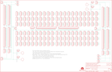

Contents
========

* [PRS12699 > Sparkfun](#prs12699--sparkfun)
	* [Schematic](#schematic)
	* [Interactive BOM](#interactive-bom)
	* [OOMP Parts](#oomp-parts)
	* [Images](#images)
	* [Tags](#tags)
  
![][im]
# PRS12699 > Sparkfun

- ID: PROJ-SPAR-12699-STAN-01
- Hex ID: PRS12699
- Name: Sparkfun
- Description: Sparkfun
- Long Link: [http://oom.lt/PROJ-SPAR-12699-STAN-01](http://oom.lt/PROJ-SPAR-12699-STAN-01)
- Short Link: [http://oom.lt/PRS12699](http://oom.lt/PRS12699)

## Schematic
  

## Interactive BOM

- Interactive BOM page: [ibom.html](https://htmlpreview.github.io/?https://github.com/oomlout/oomlout_OOMP_projects/blob/main/PROJ-SPAR-12699-STAN-01/kicad/bom/ibom.html)

## OOMP Parts
  

|OOMP Parts|
| :---: |
|FRAME2,UNMATCHED-UNMATCHED-UNMATCHED-UNMATCHED-UNMATCHED,FRAME2,FRAME-LEDGER,FRAME-LEDGER,CREATIVE_COMMONS,Schematic Frame,,|
|JG1,UNMATCHED-UNMATCHED-UNMATCHED-UNMATCHED-UNMATCHED,JG1,M021X02_NO_SILK,M021X02_NO_SILK,1X02_NO_SILK,Standard 2-pin 0.1 header. Use with,,|
|JG2,UNMATCHED-UNMATCHED-UNMATCHED-UNMATCHED-UNMATCHED,JG2,M021X02_NO_SILK,M021X02_NO_SILK,1X02_NO_SILK,Standard 2-pin 0.1 header. Use with,,|
|JG3,UNMATCHED-UNMATCHED-UNMATCHED-UNMATCHED-UNMATCHED,JG3,M021X02_NO_SILK,M021X02_NO_SILK,1X02_NO_SILK,Standard 2-pin 0.1 header. Use with,,|
|JG4,UNMATCHED-UNMATCHED-UNMATCHED-UNMATCHED-UNMATCHED,JG4,M021X02_NO_SILK,M021X02_NO_SILK,1X02_NO_SILK,Standard 2-pin 0.1 header. Use with,,|
|JG5,UNMATCHED-UNMATCHED-UNMATCHED-UNMATCHED-UNMATCHED,JG5,M021X02_NO_SILK,M021X02_NO_SILK,1X02_NO_SILK,Standard 2-pin 0.1 header. Use with,,|
|JG6,UNMATCHED-UNMATCHED-UNMATCHED-UNMATCHED-UNMATCHED,JG6,M021X02_NO_SILK,M021X02_NO_SILK,1X02_NO_SILK,Standard 2-pin 0.1 header. Use with,,|
|JP1,UNMATCHED-UNMATCHED-UNMATCHED-UNMATCHED-UNMATCHED,JP1,M29NO_SILK,M29NO_SILK,1X29_NO_SILK,1x29 .1 header,,|
|JP2,UNMATCHED-UNMATCHED-UNMATCHED-UNMATCHED-UNMATCHED,JP2,M29NO_SILK,M29NO_SILK,1X29_NO_SILK,1x29 .1 header,,|
|JP3,UNMATCHED-UNMATCHED-UNMATCHED-UNMATCHED-UNMATCHED,JP3,M29NO_SILK,M29NO_SILK,1X29_NO_SILK,1x29 .1 header,,|
|JP4,UNMATCHED-UNMATCHED-UNMATCHED-UNMATCHED-UNMATCHED,JP4,M29NO_SILK,M29NO_SILK,1X29_NO_SILK,1x29 .1 header,,|
|JP5,UNMATCHED-UNMATCHED-UNMATCHED-UNMATCHED-UNMATCHED,JP5,,M05NO_SILK,1X05_NO_SILK,Header 5,,|
|JP6,UNMATCHED-UNMATCHED-UNMATCHED-UNMATCHED-UNMATCHED,JP6,,M05NO_SILK,1X05_NO_SILK,Header 5,,|
|JP7,UNMATCHED-UNMATCHED-UNMATCHED-UNMATCHED-UNMATCHED,JP7,,M05NO_SILK,1X05_NO_SILK,Header 5,,|
|JP8,UNMATCHED-UNMATCHED-UNMATCHED-UNMATCHED-UNMATCHED,JP8,,M05NO_SILK,1X05_NO_SILK,Header 5,,|
|JP9,UNMATCHED-UNMATCHED-UNMATCHED-UNMATCHED-UNMATCHED,JP9,,M05NO_SILK,1X05_NO_SILK,Header 5,,|
|JP10,UNMATCHED-UNMATCHED-UNMATCHED-UNMATCHED-UNMATCHED,JP10,,M05NO_SILK,1X05_NO_SILK,Header 5,,|
|JP11,UNMATCHED-UNMATCHED-UNMATCHED-UNMATCHED-UNMATCHED,JP11,,M05NO_SILK,1X05_NO_SILK,Header 5,,|
|JP12,UNMATCHED-UNMATCHED-UNMATCHED-UNMATCHED-UNMATCHED,JP12,,M05NO_SILK,1X05_NO_SILK,Header 5,,|
|JP13,UNMATCHED-UNMATCHED-UNMATCHED-UNMATCHED-UNMATCHED,JP13,,M05NO_SILK,1X05_NO_SILK,Header 5,,|
|JP14,UNMATCHED-UNMATCHED-UNMATCHED-UNMATCHED-UNMATCHED,JP14,,M05NO_SILK,1X05_NO_SILK,Header 5,,|
|JP15,UNMATCHED-UNMATCHED-UNMATCHED-UNMATCHED-UNMATCHED,JP15,,M05NO_SILK,1X05_NO_SILK,Header 5,,|
|JP16,UNMATCHED-UNMATCHED-UNMATCHED-UNMATCHED-UNMATCHED,JP16,,M05NO_SILK,1X05_NO_SILK,Header 5,,|
|JP17,UNMATCHED-UNMATCHED-UNMATCHED-UNMATCHED-UNMATCHED,JP17,,M05NO_SILK,1X05_NO_SILK,Header 5,,|
|JP18,UNMATCHED-UNMATCHED-UNMATCHED-UNMATCHED-UNMATCHED,JP18,,M05NO_SILK,1X05_NO_SILK,Header 5,,|
|JP19,UNMATCHED-UNMATCHED-UNMATCHED-UNMATCHED-UNMATCHED,JP19,,M05NO_SILK,1X05_NO_SILK,Header 5,,|
|JP20,UNMATCHED-UNMATCHED-UNMATCHED-UNMATCHED-UNMATCHED,JP20,,M05NO_SILK,1X05_NO_SILK,Header 5,,|
|JP21,UNMATCHED-UNMATCHED-UNMATCHED-UNMATCHED-UNMATCHED,JP21,,M05NO_SILK,1X05_NO_SILK,Header 5,,|
|JP22,UNMATCHED-UNMATCHED-UNMATCHED-UNMATCHED-UNMATCHED,JP22,,M05NO_SILK,1X05_NO_SILK,Header 5,,|
|JP23,UNMATCHED-UNMATCHED-UNMATCHED-UNMATCHED-UNMATCHED,JP23,,M05NO_SILK,1X05_NO_SILK,Header 5,,|
|JP24,UNMATCHED-UNMATCHED-UNMATCHED-UNMATCHED-UNMATCHED,JP24,,M05NO_SILK,1X05_NO_SILK,Header 5,,|
|JP25,UNMATCHED-UNMATCHED-UNMATCHED-UNMATCHED-UNMATCHED,JP25,,M05NO_SILK,1X05_NO_SILK,Header 5,,|
|JP26,UNMATCHED-UNMATCHED-UNMATCHED-UNMATCHED-UNMATCHED,JP26,,M05NO_SILK,1X05_NO_SILK,Header 5,,|
|JP27,UNMATCHED-UNMATCHED-UNMATCHED-UNMATCHED-UNMATCHED,JP27,,M05NO_SILK,1X05_NO_SILK,Header 5,,|
|JP28,UNMATCHED-UNMATCHED-UNMATCHED-UNMATCHED-UNMATCHED,JP28,,M05NO_SILK,1X05_NO_SILK,Header 5,,|
|JP29,UNMATCHED-UNMATCHED-UNMATCHED-UNMATCHED-UNMATCHED,JP29,,M05NO_SILK,1X05_NO_SILK,Header 5,,|
|JP30,UNMATCHED-UNMATCHED-UNMATCHED-UNMATCHED-UNMATCHED,JP30,,M05NO_SILK,1X05_NO_SILK,Header 5,,|
|JP31,UNMATCHED-UNMATCHED-UNMATCHED-UNMATCHED-UNMATCHED,JP31,,M05NO_SILK,1X05_NO_SILK,Header 5,,|
|JP32,UNMATCHED-UNMATCHED-UNMATCHED-UNMATCHED-UNMATCHED,JP32,,M05NO_SILK,1X05_NO_SILK,Header 5,,|
|JP33,UNMATCHED-UNMATCHED-UNMATCHED-UNMATCHED-UNMATCHED,JP33,,M05NO_SILK,1X05_NO_SILK,Header 5,,|
|JP34,UNMATCHED-UNMATCHED-UNMATCHED-UNMATCHED-UNMATCHED,JP34,,M05NO_SILK,1X05_NO_SILK,Header 5,,|
|JP35,UNMATCHED-UNMATCHED-UNMATCHED-UNMATCHED-UNMATCHED,JP35,,M05NO_SILK,1X05_NO_SILK,Header 5,,|
|JP36,UNMATCHED-UNMATCHED-UNMATCHED-UNMATCHED-UNMATCHED,JP36,,M05NO_SILK,1X05_NO_SILK,Header 5,,|
|JP37,UNMATCHED-UNMATCHED-UNMATCHED-UNMATCHED-UNMATCHED,JP37,,M05NO_SILK,1X05_NO_SILK,Header 5,,|
|JP38,UNMATCHED-UNMATCHED-UNMATCHED-UNMATCHED-UNMATCHED,JP38,,M05NO_SILK,1X05_NO_SILK,Header 5,,|
|JP39,UNMATCHED-UNMATCHED-UNMATCHED-UNMATCHED-UNMATCHED,JP39,,M05NO_SILK,1X05_NO_SILK,Header 5,,|
|JP40,UNMATCHED-UNMATCHED-UNMATCHED-UNMATCHED-UNMATCHED,JP40,,M05NO_SILK,1X05_NO_SILK,Header 5,,|
|JP41,UNMATCHED-UNMATCHED-UNMATCHED-UNMATCHED-UNMATCHED,JP41,,M05NO_SILK,1X05_NO_SILK,Header 5,,|
|JP42,UNMATCHED-UNMATCHED-UNMATCHED-UNMATCHED-UNMATCHED,JP42,,M05NO_SILK,1X05_NO_SILK,Header 5,,|
|JP43,UNMATCHED-UNMATCHED-UNMATCHED-UNMATCHED-UNMATCHED,JP43,,M05NO_SILK,1X05_NO_SILK,Header 5,,|
|JP44,UNMATCHED-UNMATCHED-UNMATCHED-UNMATCHED-UNMATCHED,JP44,,M05NO_SILK,1X05_NO_SILK,Header 5,,|
|JP45,UNMATCHED-UNMATCHED-UNMATCHED-UNMATCHED-UNMATCHED,JP45,,M05NO_SILK,1X05_NO_SILK,Header 5,,|
|JP46,UNMATCHED-UNMATCHED-UNMATCHED-UNMATCHED-UNMATCHED,JP46,,M05NO_SILK,1X05_NO_SILK,Header 5,,|
|JP47,UNMATCHED-UNMATCHED-UNMATCHED-UNMATCHED-UNMATCHED,JP47,,M05NO_SILK,1X05_NO_SILK,Header 5,,|
|JP48,UNMATCHED-UNMATCHED-UNMATCHED-UNMATCHED-UNMATCHED,JP48,,M05NO_SILK,1X05_NO_SILK,Header 5,,|
|JP49,UNMATCHED-UNMATCHED-UNMATCHED-UNMATCHED-UNMATCHED,JP49,,M05NO_SILK,1X05_NO_SILK,Header 5,,|
|JP50,UNMATCHED-UNMATCHED-UNMATCHED-UNMATCHED-UNMATCHED,JP50,,M05NO_SILK,1X05_NO_SILK,Header 5,,|
|JP51,UNMATCHED-UNMATCHED-UNMATCHED-UNMATCHED-UNMATCHED,JP51,,M05NO_SILK,1X05_NO_SILK,Header 5,,|
|JP52,UNMATCHED-UNMATCHED-UNMATCHED-UNMATCHED-UNMATCHED,JP52,,M05NO_SILK,1X05_NO_SILK,Header 5,,|
|JP53,UNMATCHED-UNMATCHED-UNMATCHED-UNMATCHED-UNMATCHED,JP53,,M05NO_SILK,1X05_NO_SILK,Header 5,,|
|JP54,UNMATCHED-UNMATCHED-UNMATCHED-UNMATCHED-UNMATCHED,JP54,,M05NO_SILK,1X05_NO_SILK,Header 5,,|
|JP55,UNMATCHED-UNMATCHED-UNMATCHED-UNMATCHED-UNMATCHED,JP55,,M05NO_SILK,1X05_NO_SILK,Header 5,,|
|JP56,UNMATCHED-UNMATCHED-UNMATCHED-UNMATCHED-UNMATCHED,JP56,,M05NO_SILK,1X05_NO_SILK,Header 5,,|
|JP57,UNMATCHED-UNMATCHED-UNMATCHED-UNMATCHED-UNMATCHED,JP57,,M05NO_SILK,1X05_NO_SILK,Header 5,,|
|JP58,UNMATCHED-UNMATCHED-UNMATCHED-UNMATCHED-UNMATCHED,JP58,,M05NO_SILK,1X05_NO_SILK,Header 5,,|
|JP59,UNMATCHED-UNMATCHED-UNMATCHED-UNMATCHED-UNMATCHED,JP59,,M05NO_SILK,1X05_NO_SILK,Header 5,,|
|JP60,UNMATCHED-UNMATCHED-UNMATCHED-UNMATCHED-UNMATCHED,JP60,,M05NO_SILK,1X05_NO_SILK,Header 5,,|
|JP61,UNMATCHED-UNMATCHED-UNMATCHED-UNMATCHED-UNMATCHED,JP61,,M05NO_SILK,1X05_NO_SILK,Header 5,,|
|JP62,UNMATCHED-UNMATCHED-UNMATCHED-UNMATCHED-UNMATCHED,JP62,,M05NO_SILK,1X05_NO_SILK,Header 5,,|
|JP63,UNMATCHED-UNMATCHED-UNMATCHED-UNMATCHED-UNMATCHED,JP63,,M05NO_SILK,1X05_NO_SILK,Header 5,,|
|JP64,UNMATCHED-UNMATCHED-UNMATCHED-UNMATCHED-UNMATCHED,JP64,,M05NO_SILK,1X05_NO_SILK,Header 5,,|
|JP69,UNMATCHED-UNMATCHED-UNMATCHED-UNMATCHED-UNMATCHED,JP69,,M05NO_SILK,1X05_NO_SILK,Header 5,,|
|JP70,UNMATCHED-UNMATCHED-UNMATCHED-UNMATCHED-UNMATCHED,JP70,,M05NO_SILK,1X05_NO_SILK,Header 5,,|
|JP71,UNMATCHED-UNMATCHED-UNMATCHED-UNMATCHED-UNMATCHED,JP71,,M05NO_SILK,1X05_NO_SILK,Header 5,,|
|JP72,UNMATCHED-UNMATCHED-UNMATCHED-UNMATCHED-UNMATCHED,JP72,,M05NO_SILK,1X05_NO_SILK,Header 5,,|
|JP73,UNMATCHED-UNMATCHED-UNMATCHED-UNMATCHED-UNMATCHED,JP73,,M05NO_SILK,1X05_NO_SILK,Header 5,,|
|JP74,UNMATCHED-UNMATCHED-UNMATCHED-UNMATCHED-UNMATCHED,JP74,,M05NO_SILK,1X05_NO_SILK,Header 5,,|
|JP75,UNMATCHED-UNMATCHED-UNMATCHED-UNMATCHED-UNMATCHED,JP75,,M05NO_SILK,1X05_NO_SILK,Header 5,,|
|JP76,UNMATCHED-UNMATCHED-UNMATCHED-UNMATCHED-UNMATCHED,JP76,,M05NO_SILK,1X05_NO_SILK,Header 5,,|
|JP77,UNMATCHED-UNMATCHED-UNMATCHED-UNMATCHED-UNMATCHED,JP77,,M05NO_SILK,1X05_NO_SILK,Header 5,,|
|JP78,UNMATCHED-UNMATCHED-UNMATCHED-UNMATCHED-UNMATCHED,JP78,,M05NO_SILK,1X05_NO_SILK,Header 5,,|
|JP79,UNMATCHED-UNMATCHED-UNMATCHED-UNMATCHED-UNMATCHED,JP79,,M05NO_SILK,1X05_NO_SILK,Header 5,,|
|JP80,UNMATCHED-UNMATCHED-UNMATCHED-UNMATCHED-UNMATCHED,JP80,,M05NO_SILK,1X05_NO_SILK,Header 5,,|
|JP81,UNMATCHED-UNMATCHED-UNMATCHED-UNMATCHED-UNMATCHED,JP81,,M05NO_SILK,1X05_NO_SILK,Header 5,,|
|JP82,UNMATCHED-UNMATCHED-UNMATCHED-UNMATCHED-UNMATCHED,JP82,,M05NO_SILK,1X05_NO_SILK,Header 5,,|
|JP83,UNMATCHED-UNMATCHED-UNMATCHED-UNMATCHED-UNMATCHED,JP83,,M05NO_SILK,1X05_NO_SILK,Header 5,,|
|JP84,UNMATCHED-UNMATCHED-UNMATCHED-UNMATCHED-UNMATCHED,JP84,,M05NO_SILK,1X05_NO_SILK,Header 5,,|
|JP85,UNMATCHED-UNMATCHED-UNMATCHED-UNMATCHED-UNMATCHED,JP85,,M05NO_SILK,1X05_NO_SILK,Header 5,,|
|JP86,UNMATCHED-UNMATCHED-UNMATCHED-UNMATCHED-UNMATCHED,JP86,,M05NO_SILK,1X05_NO_SILK,Header 5,,|
|JP87,UNMATCHED-UNMATCHED-UNMATCHED-UNMATCHED-UNMATCHED,JP87,,M05NO_SILK,1X05_NO_SILK,Header 5,,|
|JP88,UNMATCHED-UNMATCHED-UNMATCHED-UNMATCHED-UNMATCHED,JP88,,M05NO_SILK,1X05_NO_SILK,Header 5,,|
|JP89,UNMATCHED-UNMATCHED-UNMATCHED-UNMATCHED-UNMATCHED,JP89,,M05NO_SILK,1X05_NO_SILK,Header 5,,|
|JP90,UNMATCHED-UNMATCHED-UNMATCHED-UNMATCHED-UNMATCHED,JP90,,M05NO_SILK,1X05_NO_SILK,Header 5,,|
|JP91,UNMATCHED-UNMATCHED-UNMATCHED-UNMATCHED-UNMATCHED,JP91,,M05NO_SILK,1X05_NO_SILK,Header 5,,|
|JP92,UNMATCHED-UNMATCHED-UNMATCHED-UNMATCHED-UNMATCHED,JP92,,M05NO_SILK,1X05_NO_SILK,Header 5,,|
|JP93,UNMATCHED-UNMATCHED-UNMATCHED-UNMATCHED-UNMATCHED,JP93,,M05NO_SILK,1X05_NO_SILK,Header 5,,|
|JP94,UNMATCHED-UNMATCHED-UNMATCHED-UNMATCHED-UNMATCHED,JP94,,M05NO_SILK,1X05_NO_SILK,Header 5,,|
|JP95,UNMATCHED-UNMATCHED-UNMATCHED-UNMATCHED-UNMATCHED,JP95,,M05NO_SILK,1X05_NO_SILK,Header 5,,|
|JP96,UNMATCHED-UNMATCHED-UNMATCHED-UNMATCHED-UNMATCHED,JP96,,M05NO_SILK,1X05_NO_SILK,Header 5,,|
|JP97,UNMATCHED-UNMATCHED-UNMATCHED-UNMATCHED-UNMATCHED,JP97,,M05NO_SILK,1X05_NO_SILK,Header 5,,|
|JP98,UNMATCHED-UNMATCHED-UNMATCHED-UNMATCHED-UNMATCHED,JP98,,M05NO_SILK,1X05_NO_SILK,Header 5,,|
|JP99,UNMATCHED-UNMATCHED-UNMATCHED-UNMATCHED-UNMATCHED,JP99,,M05NO_SILK,1X05_NO_SILK,Header 5,,|
|JP100,UNMATCHED-UNMATCHED-UNMATCHED-UNMATCHED-UNMATCHED,JP100,,M05NO_SILK,1X05_NO_SILK,Header 5,,|
|JP101,UNMATCHED-UNMATCHED-UNMATCHED-UNMATCHED-UNMATCHED,JP101,,M05NO_SILK,1X05_NO_SILK,Header 5,,|
|JP102,UNMATCHED-UNMATCHED-UNMATCHED-UNMATCHED-UNMATCHED,JP102,,M05NO_SILK,1X05_NO_SILK,Header 5,,|
|JP103,UNMATCHED-UNMATCHED-UNMATCHED-UNMATCHED-UNMATCHED,JP103,,M05NO_SILK,1X05_NO_SILK,Header 5,,|
|JP104,UNMATCHED-UNMATCHED-UNMATCHED-UNMATCHED-UNMATCHED,JP104,,M05NO_SILK,1X05_NO_SILK,Header 5,,|
|JP105,UNMATCHED-UNMATCHED-UNMATCHED-UNMATCHED-UNMATCHED,JP105,,M05NO_SILK,1X05_NO_SILK,Header 5,,|
|JP106,UNMATCHED-UNMATCHED-UNMATCHED-UNMATCHED-UNMATCHED,JP106,,M05NO_SILK,1X05_NO_SILK,Header 5,,|
|JP107,UNMATCHED-UNMATCHED-UNMATCHED-UNMATCHED-UNMATCHED,JP107,,M05NO_SILK,1X05_NO_SILK,Header 5,,|
|JP108,UNMATCHED-UNMATCHED-UNMATCHED-UNMATCHED-UNMATCHED,JP108,,M05NO_SILK,1X05_NO_SILK,Header 5,,|
|JP109,UNMATCHED-UNMATCHED-UNMATCHED-UNMATCHED-UNMATCHED,JP109,,M05NO_SILK,1X05_NO_SILK,Header 5,,|
|JP110,UNMATCHED-UNMATCHED-UNMATCHED-UNMATCHED-UNMATCHED,JP110,,M05NO_SILK,1X05_NO_SILK,Header 5,,|
|JP111,UNMATCHED-UNMATCHED-UNMATCHED-UNMATCHED-UNMATCHED,JP111,,M05NO_SILK,1X05_NO_SILK,Header 5,,|
|JP112,UNMATCHED-UNMATCHED-UNMATCHED-UNMATCHED-UNMATCHED,JP112,,M05NO_SILK,1X05_NO_SILK,Header 5,,|
|JP113,UNMATCHED-UNMATCHED-UNMATCHED-UNMATCHED-UNMATCHED,JP113,,M05NO_SILK,1X05_NO_SILK,Header 5,,|
|JP114,UNMATCHED-UNMATCHED-UNMATCHED-UNMATCHED-UNMATCHED,JP114,,M05NO_SILK,1X05_NO_SILK,Header 5,,|
|JP115,UNMATCHED-UNMATCHED-UNMATCHED-UNMATCHED-UNMATCHED,JP115,,M05NO_SILK,1X05_NO_SILK,Header 5,,|
|JP116,UNMATCHED-UNMATCHED-UNMATCHED-UNMATCHED-UNMATCHED,JP116,,M05NO_SILK,1X05_NO_SILK,Header 5,,|
|JP117,UNMATCHED-UNMATCHED-UNMATCHED-UNMATCHED-UNMATCHED,JP117,,M05NO_SILK,1X05_NO_SILK,Header 5,,|
|JP118,UNMATCHED-UNMATCHED-UNMATCHED-UNMATCHED-UNMATCHED,JP118,,M05NO_SILK,1X05_NO_SILK,Header 5,,|
|JP119,UNMATCHED-UNMATCHED-UNMATCHED-UNMATCHED-UNMATCHED,JP119,,M05NO_SILK,1X05_NO_SILK,Header 5,,|
|JP120,UNMATCHED-UNMATCHED-UNMATCHED-UNMATCHED-UNMATCHED,JP120,,M05NO_SILK,1X05_NO_SILK,Header 5,,|
|JP121,UNMATCHED-UNMATCHED-UNMATCHED-UNMATCHED-UNMATCHED,JP121,,M05NO_SILK,1X05_NO_SILK,Header 5,,|
|JP122,UNMATCHED-UNMATCHED-UNMATCHED-UNMATCHED-UNMATCHED,JP122,,M05NO_SILK,1X05_NO_SILK,Header 5,,|
|JP123,UNMATCHED-UNMATCHED-UNMATCHED-UNMATCHED-UNMATCHED,JP123,,M05NO_SILK,1X05_NO_SILK,Header 5,,|
|JP124,UNMATCHED-UNMATCHED-UNMATCHED-UNMATCHED-UNMATCHED,JP124,,M05NO_SILK,1X05_NO_SILK,Header 5,,|
|JP125,UNMATCHED-UNMATCHED-UNMATCHED-UNMATCHED-UNMATCHED,JP125,,M05NO_SILK,1X05_NO_SILK,Header 5,,|
|JP126,UNMATCHED-UNMATCHED-UNMATCHED-UNMATCHED-UNMATCHED,JP126,,M05NO_SILK,1X05_NO_SILK,Header 5,,|
|JP127,UNMATCHED-UNMATCHED-UNMATCHED-UNMATCHED-UNMATCHED,JP127,,M05NO_SILK,1X05_NO_SILK,Header 5,,|
|JP128,UNMATCHED-UNMATCHED-UNMATCHED-UNMATCHED-UNMATCHED,JP128,,M05NO_SILK,1X05_NO_SILK,Header 5,,|
|JP129,UNMATCHED-UNMATCHED-UNMATCHED-UNMATCHED-UNMATCHED,JP129,M29NO_SILK,M29NO_SILK,1X29_NO_SILK,1x29 .1 header,,|
|JP130,UNMATCHED-UNMATCHED-UNMATCHED-UNMATCHED-UNMATCHED,JP130,M29NO_SILK,M29NO_SILK,1X29_NO_SILK,1x29 .1 header,,|
|JP131,UNMATCHED-UNMATCHED-UNMATCHED-UNMATCHED-UNMATCHED,JP131,,M05NO_SILK,1X05_NO_SILK,Header 5,,|
|JP132,UNMATCHED-UNMATCHED-UNMATCHED-UNMATCHED-UNMATCHED,JP132,,M05NO_SILK,1X05_NO_SILK,Header 5,,|
|JP133,UNMATCHED-UNMATCHED-UNMATCHED-UNMATCHED-UNMATCHED,JP133,M29NO_SILK,M29NO_SILK,1X29_NO_SILK,1x29 .1 header,,|
|JP134,UNMATCHED-UNMATCHED-UNMATCHED-UNMATCHED-UNMATCHED,JP134,M29NO_SILK,M29NO_SILK,1X29_NO_SILK,1x29 .1 header,,|
|JP135,UNMATCHED-UNMATCHED-UNMATCHED-UNMATCHED-UNMATCHED,JP135,,M05NO_SILK,1X05_NO_SILK,Header 5,,|
|JP136,UNMATCHED-UNMATCHED-UNMATCHED-UNMATCHED-UNMATCHED,JP136,,M05NO_SILK,1X05_NO_SILK,Header 5,,|
|JP137,UNMATCHED-UNMATCHED-UNMATCHED-UNMATCHED-UNMATCHED,JP137,M29NO_SILK,M29NO_SILK,1X29_NO_SILK,1x29 .1 header,,|
|JP138,UNMATCHED-UNMATCHED-UNMATCHED-UNMATCHED-UNMATCHED,JP138,M29NO_SILK,M29NO_SILK,1X29_NO_SILK,1x29 .1 header,,|
|JP139,UNMATCHED-UNMATCHED-UNMATCHED-UNMATCHED-UNMATCHED,JP139,,M05NO_SILK,1X05_NO_SILK,Header 5,,|
|JP140,UNMATCHED-UNMATCHED-UNMATCHED-UNMATCHED-UNMATCHED,JP140,,M05NO_SILK,1X05_NO_SILK,Header 5,,|
|JP141,UNMATCHED-UNMATCHED-UNMATCHED-UNMATCHED-UNMATCHED,JP141,,M05NO_SILK,1X05_NO_SILK,Header 5,,|
|JP142,UNMATCHED-UNMATCHED-UNMATCHED-UNMATCHED-UNMATCHED,JP142,,M05NO_SILK,1X05_NO_SILK,Header 5,,|
|JP143,UNMATCHED-UNMATCHED-UNMATCHED-UNMATCHED-UNMATCHED,JP143,,M05NO_SILK,1X05_NO_SILK,Header 5,,|
|JP144,UNMATCHED-UNMATCHED-UNMATCHED-UNMATCHED-UNMATCHED,JP144,,M05NO_SILK,1X05_NO_SILK,Header 5,,|
|JP145,UNMATCHED-UNMATCHED-UNMATCHED-UNMATCHED-UNMATCHED,JP145,,M05NO_SILK,1X05_NO_SILK,Header 5,,|
|JP146,UNMATCHED-UNMATCHED-UNMATCHED-UNMATCHED-UNMATCHED,JP146,,M03-SCREW-5MM,SCREWTERMINAL-5MM-3,Header 3,,|
|JP147,UNMATCHED-UNMATCHED-UNMATCHED-UNMATCHED-UNMATCHED,JP147,,M03-SCREW-5MM,SCREWTERMINAL-5MM-3,Header 3,,|
|JP148,UNMATCHED-UNMATCHED-UNMATCHED-UNMATCHED-UNMATCHED,JP148,M025MM,M025MM,SCREWTERMINAL-5MM-2,Standard 2-pin 0.1 header. Use with,,|
|JP149,UNMATCHED-UNMATCHED-UNMATCHED-UNMATCHED-UNMATCHED,JP149,M025MM,M025MM,SCREWTERMINAL-5MM-2,Standard 2-pin 0.1 header. Use with,,|
|LOGO1,UNMATCHED-UNMATCHED-UNMATCHED-UNMATCHED-UNMATCHED,LOGO1,LOGO-SFENEW,LOGO-SFENEW,SFE-NEW-WEBLOGO,Spark Fun Electronics PCB Logo,,|
|LOGO2,UNMATCHED-UNMATCHED-UNMATCHED-UNMATCHED-UNMATCHED,LOGO2,LOGO-SFENEW,LOGO-SFENEW,SFE-NEW-WEBLOGO,Spark Fun Electronics PCB Logo,,|
|LOGO3,UNMATCHED-UNMATCHED-UNMATCHED-UNMATCHED-UNMATCHED,LOGO3,OSHW-LOGOS,OSHW-LOGOS,OSHW-LOGO-S,Open Source Hardware Logo This logo indicates the piece of hardware it is found on incorporates a OSHW license and/or adheres to the definition of open source hardware found here: http://freedomdefined.org/OSHW,,|
|S1,UNMATCHED-UNMATCHED-UNMATCHED-UNMATCHED-UNMATCHED,S1,STANDOFF_ELECTRICAL,STANDOFF_ELECTRICAL,STANDOFF-ELECTRICAL,A standoff intended to be an electrically connected point.,,|
|S2,UNMATCHED-UNMATCHED-UNMATCHED-UNMATCHED-UNMATCHED,S2,STANDOFF_ELECTRICAL,STANDOFF_ELECTRICAL,STANDOFF-ELECTRICAL,A standoff intended to be an electrically connected point.,,|
|S3,UNMATCHED-UNMATCHED-UNMATCHED-UNMATCHED-UNMATCHED,S3,STANDOFF_ELECTRICAL,STANDOFF_ELECTRICAL,STANDOFF-ELECTRICAL,A standoff intended to be an electrically connected point.,,|
|S4,UNMATCHED-UNMATCHED-UNMATCHED-UNMATCHED-UNMATCHED,S4,STANDOFF_ELECTRICAL,STANDOFF_ELECTRICAL,STANDOFF-ELECTRICAL,A standoff intended to be an electrically connected point.,,|
|TIE+1,UNMATCHED-UNMATCHED-UNMATCHED-UNMATCHED-UNMATCHED,TIE+1,M01SMDNS,M01SMDNS,1X01NS,Header 1,,|
|TIE+2,UNMATCHED-UNMATCHED-UNMATCHED-UNMATCHED-UNMATCHED,TIE+2,M01SMDNS,M01SMDNS,1X01NS,Header 1,,|
|TIE-1,UNMATCHED-UNMATCHED-UNMATCHED-UNMATCHED-UNMATCHED,TIE-1,M01SMDNS,M01SMDNS,1X01NS,Header 1,,|
|TIE-2,UNMATCHED-UNMATCHED-UNMATCHED-UNMATCHED-UNMATCHED,TIE-2,M01SMDNS,M01SMDNS,1X01NS,Header 1,,|

## Images
  
  

|kicadPcb3d|kicadPcb3dFront|kicadPcb3dBack|eagleImage|eagleSchemImage|
| :---: | :---: | :---: | :---: | :---: |
||||||

## Tags

- hexID: PRS12699
- oompType: PROJ
- oompSize: SPAR
- oompColor: 12699
- oompDesc: STAN
- oompIndex: 01
- oompName: Solderable Breadboard Large
- sources: All source files from https://github.com/sparkfun/Solderable_Breadboard_Large (source licence details in srcLicense.md)
- linkBuyPage: https://www.sparkfun.com/products/12699
- oompID: PROJ-SPAR-12699-STAN-01
- oompParts: FRAME2,UNMATCHED-UNMATCHED-UNMATCHED-UNMATCHED-UNMATCHED
- oompParts: JG1,UNMATCHED-UNMATCHED-UNMATCHED-UNMATCHED-UNMATCHED
- oompParts: JG2,UNMATCHED-UNMATCHED-UNMATCHED-UNMATCHED-UNMATCHED
- oompParts: JG3,UNMATCHED-UNMATCHED-UNMATCHED-UNMATCHED-UNMATCHED
- oompParts: JG4,UNMATCHED-UNMATCHED-UNMATCHED-UNMATCHED-UNMATCHED
- oompParts: JG5,UNMATCHED-UNMATCHED-UNMATCHED-UNMATCHED-UNMATCHED
- oompParts: JG6,UNMATCHED-UNMATCHED-UNMATCHED-UNMATCHED-UNMATCHED
- oompParts: JP1,UNMATCHED-UNMATCHED-UNMATCHED-UNMATCHED-UNMATCHED
- oompParts: JP2,UNMATCHED-UNMATCHED-UNMATCHED-UNMATCHED-UNMATCHED
- oompParts: JP3,UNMATCHED-UNMATCHED-UNMATCHED-UNMATCHED-UNMATCHED
- oompParts: JP4,UNMATCHED-UNMATCHED-UNMATCHED-UNMATCHED-UNMATCHED
- oompParts: JP5,UNMATCHED-UNMATCHED-UNMATCHED-UNMATCHED-UNMATCHED
- oompParts: JP6,UNMATCHED-UNMATCHED-UNMATCHED-UNMATCHED-UNMATCHED
- oompParts: JP7,UNMATCHED-UNMATCHED-UNMATCHED-UNMATCHED-UNMATCHED
- oompParts: JP8,UNMATCHED-UNMATCHED-UNMATCHED-UNMATCHED-UNMATCHED
- oompParts: JP9,UNMATCHED-UNMATCHED-UNMATCHED-UNMATCHED-UNMATCHED
- oompParts: JP10,UNMATCHED-UNMATCHED-UNMATCHED-UNMATCHED-UNMATCHED
- oompParts: JP11,UNMATCHED-UNMATCHED-UNMATCHED-UNMATCHED-UNMATCHED
- oompParts: JP12,UNMATCHED-UNMATCHED-UNMATCHED-UNMATCHED-UNMATCHED
- oompParts: JP13,UNMATCHED-UNMATCHED-UNMATCHED-UNMATCHED-UNMATCHED
- oompParts: JP14,UNMATCHED-UNMATCHED-UNMATCHED-UNMATCHED-UNMATCHED
- oompParts: JP15,UNMATCHED-UNMATCHED-UNMATCHED-UNMATCHED-UNMATCHED
- oompParts: JP16,UNMATCHED-UNMATCHED-UNMATCHED-UNMATCHED-UNMATCHED
- oompParts: JP17,UNMATCHED-UNMATCHED-UNMATCHED-UNMATCHED-UNMATCHED
- oompParts: JP18,UNMATCHED-UNMATCHED-UNMATCHED-UNMATCHED-UNMATCHED
- oompParts: JP19,UNMATCHED-UNMATCHED-UNMATCHED-UNMATCHED-UNMATCHED
- oompParts: JP20,UNMATCHED-UNMATCHED-UNMATCHED-UNMATCHED-UNMATCHED
- oompParts: JP21,UNMATCHED-UNMATCHED-UNMATCHED-UNMATCHED-UNMATCHED
- oompParts: JP22,UNMATCHED-UNMATCHED-UNMATCHED-UNMATCHED-UNMATCHED
- oompParts: JP23,UNMATCHED-UNMATCHED-UNMATCHED-UNMATCHED-UNMATCHED
- oompParts: JP24,UNMATCHED-UNMATCHED-UNMATCHED-UNMATCHED-UNMATCHED
- oompParts: JP25,UNMATCHED-UNMATCHED-UNMATCHED-UNMATCHED-UNMATCHED
- oompParts: JP26,UNMATCHED-UNMATCHED-UNMATCHED-UNMATCHED-UNMATCHED
- oompParts: JP27,UNMATCHED-UNMATCHED-UNMATCHED-UNMATCHED-UNMATCHED
- oompParts: JP28,UNMATCHED-UNMATCHED-UNMATCHED-UNMATCHED-UNMATCHED
- oompParts: JP29,UNMATCHED-UNMATCHED-UNMATCHED-UNMATCHED-UNMATCHED
- oompParts: JP30,UNMATCHED-UNMATCHED-UNMATCHED-UNMATCHED-UNMATCHED
- oompParts: JP31,UNMATCHED-UNMATCHED-UNMATCHED-UNMATCHED-UNMATCHED
- oompParts: JP32,UNMATCHED-UNMATCHED-UNMATCHED-UNMATCHED-UNMATCHED
- oompParts: JP33,UNMATCHED-UNMATCHED-UNMATCHED-UNMATCHED-UNMATCHED
- oompParts: JP34,UNMATCHED-UNMATCHED-UNMATCHED-UNMATCHED-UNMATCHED
- oompParts: JP35,UNMATCHED-UNMATCHED-UNMATCHED-UNMATCHED-UNMATCHED
- oompParts: JP36,UNMATCHED-UNMATCHED-UNMATCHED-UNMATCHED-UNMATCHED
- oompParts: JP37,UNMATCHED-UNMATCHED-UNMATCHED-UNMATCHED-UNMATCHED
- oompParts: JP38,UNMATCHED-UNMATCHED-UNMATCHED-UNMATCHED-UNMATCHED
- oompParts: JP39,UNMATCHED-UNMATCHED-UNMATCHED-UNMATCHED-UNMATCHED
- oompParts: JP40,UNMATCHED-UNMATCHED-UNMATCHED-UNMATCHED-UNMATCHED
- oompParts: JP41,UNMATCHED-UNMATCHED-UNMATCHED-UNMATCHED-UNMATCHED
- oompParts: JP42,UNMATCHED-UNMATCHED-UNMATCHED-UNMATCHED-UNMATCHED
- oompParts: JP43,UNMATCHED-UNMATCHED-UNMATCHED-UNMATCHED-UNMATCHED
- oompParts: JP44,UNMATCHED-UNMATCHED-UNMATCHED-UNMATCHED-UNMATCHED
- oompParts: JP45,UNMATCHED-UNMATCHED-UNMATCHED-UNMATCHED-UNMATCHED
- oompParts: JP46,UNMATCHED-UNMATCHED-UNMATCHED-UNMATCHED-UNMATCHED
- oompParts: JP47,UNMATCHED-UNMATCHED-UNMATCHED-UNMATCHED-UNMATCHED
- oompParts: JP48,UNMATCHED-UNMATCHED-UNMATCHED-UNMATCHED-UNMATCHED
- oompParts: JP49,UNMATCHED-UNMATCHED-UNMATCHED-UNMATCHED-UNMATCHED
- oompParts: JP50,UNMATCHED-UNMATCHED-UNMATCHED-UNMATCHED-UNMATCHED
- oompParts: JP51,UNMATCHED-UNMATCHED-UNMATCHED-UNMATCHED-UNMATCHED
- oompParts: JP52,UNMATCHED-UNMATCHED-UNMATCHED-UNMATCHED-UNMATCHED
- oompParts: JP53,UNMATCHED-UNMATCHED-UNMATCHED-UNMATCHED-UNMATCHED
- oompParts: JP54,UNMATCHED-UNMATCHED-UNMATCHED-UNMATCHED-UNMATCHED
- oompParts: JP55,UNMATCHED-UNMATCHED-UNMATCHED-UNMATCHED-UNMATCHED
- oompParts: JP56,UNMATCHED-UNMATCHED-UNMATCHED-UNMATCHED-UNMATCHED
- oompParts: JP57,UNMATCHED-UNMATCHED-UNMATCHED-UNMATCHED-UNMATCHED
- oompParts: JP58,UNMATCHED-UNMATCHED-UNMATCHED-UNMATCHED-UNMATCHED
- oompParts: JP59,UNMATCHED-UNMATCHED-UNMATCHED-UNMATCHED-UNMATCHED
- oompParts: JP60,UNMATCHED-UNMATCHED-UNMATCHED-UNMATCHED-UNMATCHED
- oompParts: JP61,UNMATCHED-UNMATCHED-UNMATCHED-UNMATCHED-UNMATCHED
- oompParts: JP62,UNMATCHED-UNMATCHED-UNMATCHED-UNMATCHED-UNMATCHED
- oompParts: JP63,UNMATCHED-UNMATCHED-UNMATCHED-UNMATCHED-UNMATCHED
- oompParts: JP64,UNMATCHED-UNMATCHED-UNMATCHED-UNMATCHED-UNMATCHED
- oompParts: JP69,UNMATCHED-UNMATCHED-UNMATCHED-UNMATCHED-UNMATCHED
- oompParts: JP70,UNMATCHED-UNMATCHED-UNMATCHED-UNMATCHED-UNMATCHED
- oompParts: JP71,UNMATCHED-UNMATCHED-UNMATCHED-UNMATCHED-UNMATCHED
- oompParts: JP72,UNMATCHED-UNMATCHED-UNMATCHED-UNMATCHED-UNMATCHED
- oompParts: JP73,UNMATCHED-UNMATCHED-UNMATCHED-UNMATCHED-UNMATCHED
- oompParts: JP74,UNMATCHED-UNMATCHED-UNMATCHED-UNMATCHED-UNMATCHED
- oompParts: JP75,UNMATCHED-UNMATCHED-UNMATCHED-UNMATCHED-UNMATCHED
- oompParts: JP76,UNMATCHED-UNMATCHED-UNMATCHED-UNMATCHED-UNMATCHED
- oompParts: JP77,UNMATCHED-UNMATCHED-UNMATCHED-UNMATCHED-UNMATCHED
- oompParts: JP78,UNMATCHED-UNMATCHED-UNMATCHED-UNMATCHED-UNMATCHED
- oompParts: JP79,UNMATCHED-UNMATCHED-UNMATCHED-UNMATCHED-UNMATCHED
- oompParts: JP80,UNMATCHED-UNMATCHED-UNMATCHED-UNMATCHED-UNMATCHED
- oompParts: JP81,UNMATCHED-UNMATCHED-UNMATCHED-UNMATCHED-UNMATCHED
- oompParts: JP82,UNMATCHED-UNMATCHED-UNMATCHED-UNMATCHED-UNMATCHED
- oompParts: JP83,UNMATCHED-UNMATCHED-UNMATCHED-UNMATCHED-UNMATCHED
- oompParts: JP84,UNMATCHED-UNMATCHED-UNMATCHED-UNMATCHED-UNMATCHED
- oompParts: JP85,UNMATCHED-UNMATCHED-UNMATCHED-UNMATCHED-UNMATCHED
- oompParts: JP86,UNMATCHED-UNMATCHED-UNMATCHED-UNMATCHED-UNMATCHED
- oompParts: JP87,UNMATCHED-UNMATCHED-UNMATCHED-UNMATCHED-UNMATCHED
- oompParts: JP88,UNMATCHED-UNMATCHED-UNMATCHED-UNMATCHED-UNMATCHED
- oompParts: JP89,UNMATCHED-UNMATCHED-UNMATCHED-UNMATCHED-UNMATCHED
- oompParts: JP90,UNMATCHED-UNMATCHED-UNMATCHED-UNMATCHED-UNMATCHED
- oompParts: JP91,UNMATCHED-UNMATCHED-UNMATCHED-UNMATCHED-UNMATCHED
- oompParts: JP92,UNMATCHED-UNMATCHED-UNMATCHED-UNMATCHED-UNMATCHED
- oompParts: JP93,UNMATCHED-UNMATCHED-UNMATCHED-UNMATCHED-UNMATCHED
- oompParts: JP94,UNMATCHED-UNMATCHED-UNMATCHED-UNMATCHED-UNMATCHED
- oompParts: JP95,UNMATCHED-UNMATCHED-UNMATCHED-UNMATCHED-UNMATCHED
- oompParts: JP96,UNMATCHED-UNMATCHED-UNMATCHED-UNMATCHED-UNMATCHED
- oompParts: JP97,UNMATCHED-UNMATCHED-UNMATCHED-UNMATCHED-UNMATCHED
- oompParts: JP98,UNMATCHED-UNMATCHED-UNMATCHED-UNMATCHED-UNMATCHED
- oompParts: JP99,UNMATCHED-UNMATCHED-UNMATCHED-UNMATCHED-UNMATCHED
- oompParts: JP100,UNMATCHED-UNMATCHED-UNMATCHED-UNMATCHED-UNMATCHED
- oompParts: JP101,UNMATCHED-UNMATCHED-UNMATCHED-UNMATCHED-UNMATCHED
- oompParts: JP102,UNMATCHED-UNMATCHED-UNMATCHED-UNMATCHED-UNMATCHED
- oompParts: JP103,UNMATCHED-UNMATCHED-UNMATCHED-UNMATCHED-UNMATCHED
- oompParts: JP104,UNMATCHED-UNMATCHED-UNMATCHED-UNMATCHED-UNMATCHED
- oompParts: JP105,UNMATCHED-UNMATCHED-UNMATCHED-UNMATCHED-UNMATCHED
- oompParts: JP106,UNMATCHED-UNMATCHED-UNMATCHED-UNMATCHED-UNMATCHED
- oompParts: JP107,UNMATCHED-UNMATCHED-UNMATCHED-UNMATCHED-UNMATCHED
- oompParts: JP108,UNMATCHED-UNMATCHED-UNMATCHED-UNMATCHED-UNMATCHED
- oompParts: JP109,UNMATCHED-UNMATCHED-UNMATCHED-UNMATCHED-UNMATCHED
- oompParts: JP110,UNMATCHED-UNMATCHED-UNMATCHED-UNMATCHED-UNMATCHED
- oompParts: JP111,UNMATCHED-UNMATCHED-UNMATCHED-UNMATCHED-UNMATCHED
- oompParts: JP112,UNMATCHED-UNMATCHED-UNMATCHED-UNMATCHED-UNMATCHED
- oompParts: JP113,UNMATCHED-UNMATCHED-UNMATCHED-UNMATCHED-UNMATCHED
- oompParts: JP114,UNMATCHED-UNMATCHED-UNMATCHED-UNMATCHED-UNMATCHED
- oompParts: JP115,UNMATCHED-UNMATCHED-UNMATCHED-UNMATCHED-UNMATCHED
- oompParts: JP116,UNMATCHED-UNMATCHED-UNMATCHED-UNMATCHED-UNMATCHED
- oompParts: JP117,UNMATCHED-UNMATCHED-UNMATCHED-UNMATCHED-UNMATCHED
- oompParts: JP118,UNMATCHED-UNMATCHED-UNMATCHED-UNMATCHED-UNMATCHED
- oompParts: JP119,UNMATCHED-UNMATCHED-UNMATCHED-UNMATCHED-UNMATCHED
- oompParts: JP120,UNMATCHED-UNMATCHED-UNMATCHED-UNMATCHED-UNMATCHED
- oompParts: JP121,UNMATCHED-UNMATCHED-UNMATCHED-UNMATCHED-UNMATCHED
- oompParts: JP122,UNMATCHED-UNMATCHED-UNMATCHED-UNMATCHED-UNMATCHED
- oompParts: JP123,UNMATCHED-UNMATCHED-UNMATCHED-UNMATCHED-UNMATCHED
- oompParts: JP124,UNMATCHED-UNMATCHED-UNMATCHED-UNMATCHED-UNMATCHED
- oompParts: JP125,UNMATCHED-UNMATCHED-UNMATCHED-UNMATCHED-UNMATCHED
- oompParts: JP126,UNMATCHED-UNMATCHED-UNMATCHED-UNMATCHED-UNMATCHED
- oompParts: JP127,UNMATCHED-UNMATCHED-UNMATCHED-UNMATCHED-UNMATCHED
- oompParts: JP128,UNMATCHED-UNMATCHED-UNMATCHED-UNMATCHED-UNMATCHED
- oompParts: JP129,UNMATCHED-UNMATCHED-UNMATCHED-UNMATCHED-UNMATCHED
- oompParts: JP130,UNMATCHED-UNMATCHED-UNMATCHED-UNMATCHED-UNMATCHED
- oompParts: JP131,UNMATCHED-UNMATCHED-UNMATCHED-UNMATCHED-UNMATCHED
- oompParts: JP132,UNMATCHED-UNMATCHED-UNMATCHED-UNMATCHED-UNMATCHED
- oompParts: JP133,UNMATCHED-UNMATCHED-UNMATCHED-UNMATCHED-UNMATCHED
- oompParts: JP134,UNMATCHED-UNMATCHED-UNMATCHED-UNMATCHED-UNMATCHED
- oompParts: JP135,UNMATCHED-UNMATCHED-UNMATCHED-UNMATCHED-UNMATCHED
- oompParts: JP136,UNMATCHED-UNMATCHED-UNMATCHED-UNMATCHED-UNMATCHED
- oompParts: JP137,UNMATCHED-UNMATCHED-UNMATCHED-UNMATCHED-UNMATCHED
- oompParts: JP138,UNMATCHED-UNMATCHED-UNMATCHED-UNMATCHED-UNMATCHED
- oompParts: JP139,UNMATCHED-UNMATCHED-UNMATCHED-UNMATCHED-UNMATCHED
- oompParts: JP140,UNMATCHED-UNMATCHED-UNMATCHED-UNMATCHED-UNMATCHED
- oompParts: JP141,UNMATCHED-UNMATCHED-UNMATCHED-UNMATCHED-UNMATCHED
- oompParts: JP142,UNMATCHED-UNMATCHED-UNMATCHED-UNMATCHED-UNMATCHED
- oompParts: JP143,UNMATCHED-UNMATCHED-UNMATCHED-UNMATCHED-UNMATCHED
- oompParts: JP144,UNMATCHED-UNMATCHED-UNMATCHED-UNMATCHED-UNMATCHED
- oompParts: JP145,UNMATCHED-UNMATCHED-UNMATCHED-UNMATCHED-UNMATCHED
- oompParts: JP146,UNMATCHED-UNMATCHED-UNMATCHED-UNMATCHED-UNMATCHED
- oompParts: JP147,UNMATCHED-UNMATCHED-UNMATCHED-UNMATCHED-UNMATCHED
- oompParts: JP148,UNMATCHED-UNMATCHED-UNMATCHED-UNMATCHED-UNMATCHED
- oompParts: JP149,UNMATCHED-UNMATCHED-UNMATCHED-UNMATCHED-UNMATCHED
- oompParts: LOGO1,UNMATCHED-UNMATCHED-UNMATCHED-UNMATCHED-UNMATCHED
- oompParts: LOGO2,UNMATCHED-UNMATCHED-UNMATCHED-UNMATCHED-UNMATCHED
- oompParts: LOGO3,UNMATCHED-UNMATCHED-UNMATCHED-UNMATCHED-UNMATCHED
- oompParts: S1,UNMATCHED-UNMATCHED-UNMATCHED-UNMATCHED-UNMATCHED
- oompParts: S2,UNMATCHED-UNMATCHED-UNMATCHED-UNMATCHED-UNMATCHED
- oompParts: S3,UNMATCHED-UNMATCHED-UNMATCHED-UNMATCHED-UNMATCHED
- oompParts: S4,UNMATCHED-UNMATCHED-UNMATCHED-UNMATCHED-UNMATCHED
- oompParts: TIE+1,UNMATCHED-UNMATCHED-UNMATCHED-UNMATCHED-UNMATCHED
- oompParts: TIE+2,UNMATCHED-UNMATCHED-UNMATCHED-UNMATCHED-UNMATCHED
- oompParts: TIE-1,UNMATCHED-UNMATCHED-UNMATCHED-UNMATCHED-UNMATCHED
- oompParts: TIE-2,UNMATCHED-UNMATCHED-UNMATCHED-UNMATCHED-UNMATCHED
- rawParts: FRAME2,FRAME-LEDGER,FRAME-LEDGER,CREATIVE_COMMONS,Schematic Frame,,
- rawParts: JG1,M021X02_NO_SILK,M021X02_NO_SILK,1X02_NO_SILK,Standard 2-pin 0.1 header. Use with,,
- rawParts: JG2,M021X02_NO_SILK,M021X02_NO_SILK,1X02_NO_SILK,Standard 2-pin 0.1 header. Use with,,
- rawParts: JG3,M021X02_NO_SILK,M021X02_NO_SILK,1X02_NO_SILK,Standard 2-pin 0.1 header. Use with,,
- rawParts: JG4,M021X02_NO_SILK,M021X02_NO_SILK,1X02_NO_SILK,Standard 2-pin 0.1 header. Use with,,
- rawParts: JG5,M021X02_NO_SILK,M021X02_NO_SILK,1X02_NO_SILK,Standard 2-pin 0.1 header. Use with,,
- rawParts: JG6,M021X02_NO_SILK,M021X02_NO_SILK,1X02_NO_SILK,Standard 2-pin 0.1 header. Use with,,
- rawParts: JP1,M29NO_SILK,M29NO_SILK,1X29_NO_SILK,1x29 .1 header,,
- rawParts: JP2,M29NO_SILK,M29NO_SILK,1X29_NO_SILK,1x29 .1 header,,
- rawParts: JP3,M29NO_SILK,M29NO_SILK,1X29_NO_SILK,1x29 .1 header,,
- rawParts: JP4,M29NO_SILK,M29NO_SILK,1X29_NO_SILK,1x29 .1 header,,
- rawParts: JP5,,M05NO_SILK,1X05_NO_SILK,Header 5,,
- rawParts: JP6,,M05NO_SILK,1X05_NO_SILK,Header 5,,
- rawParts: JP7,,M05NO_SILK,1X05_NO_SILK,Header 5,,
- rawParts: JP8,,M05NO_SILK,1X05_NO_SILK,Header 5,,
- rawParts: JP9,,M05NO_SILK,1X05_NO_SILK,Header 5,,
- rawParts: JP10,,M05NO_SILK,1X05_NO_SILK,Header 5,,
- rawParts: JP11,,M05NO_SILK,1X05_NO_SILK,Header 5,,
- rawParts: JP12,,M05NO_SILK,1X05_NO_SILK,Header 5,,
- rawParts: JP13,,M05NO_SILK,1X05_NO_SILK,Header 5,,
- rawParts: JP14,,M05NO_SILK,1X05_NO_SILK,Header 5,,
- rawParts: JP15,,M05NO_SILK,1X05_NO_SILK,Header 5,,
- rawParts: JP16,,M05NO_SILK,1X05_NO_SILK,Header 5,,
- rawParts: JP17,,M05NO_SILK,1X05_NO_SILK,Header 5,,
- rawParts: JP18,,M05NO_SILK,1X05_NO_SILK,Header 5,,
- rawParts: JP19,,M05NO_SILK,1X05_NO_SILK,Header 5,,
- rawParts: JP20,,M05NO_SILK,1X05_NO_SILK,Header 5,,
- rawParts: JP21,,M05NO_SILK,1X05_NO_SILK,Header 5,,
- rawParts: JP22,,M05NO_SILK,1X05_NO_SILK,Header 5,,
- rawParts: JP23,,M05NO_SILK,1X05_NO_SILK,Header 5,,
- rawParts: JP24,,M05NO_SILK,1X05_NO_SILK,Header 5,,
- rawParts: JP25,,M05NO_SILK,1X05_NO_SILK,Header 5,,
- rawParts: JP26,,M05NO_SILK,1X05_NO_SILK,Header 5,,
- rawParts: JP27,,M05NO_SILK,1X05_NO_SILK,Header 5,,
- rawParts: JP28,,M05NO_SILK,1X05_NO_SILK,Header 5,,
- rawParts: JP29,,M05NO_SILK,1X05_NO_SILK,Header 5,,
- rawParts: JP30,,M05NO_SILK,1X05_NO_SILK,Header 5,,
- rawParts: JP31,,M05NO_SILK,1X05_NO_SILK,Header 5,,
- rawParts: JP32,,M05NO_SILK,1X05_NO_SILK,Header 5,,
- rawParts: JP33,,M05NO_SILK,1X05_NO_SILK,Header 5,,
- rawParts: JP34,,M05NO_SILK,1X05_NO_SILK,Header 5,,
- rawParts: JP35,,M05NO_SILK,1X05_NO_SILK,Header 5,,
- rawParts: JP36,,M05NO_SILK,1X05_NO_SILK,Header 5,,
- rawParts: JP37,,M05NO_SILK,1X05_NO_SILK,Header 5,,
- rawParts: JP38,,M05NO_SILK,1X05_NO_SILK,Header 5,,
- rawParts: JP39,,M05NO_SILK,1X05_NO_SILK,Header 5,,
- rawParts: JP40,,M05NO_SILK,1X05_NO_SILK,Header 5,,
- rawParts: JP41,,M05NO_SILK,1X05_NO_SILK,Header 5,,
- rawParts: JP42,,M05NO_SILK,1X05_NO_SILK,Header 5,,
- rawParts: JP43,,M05NO_SILK,1X05_NO_SILK,Header 5,,
- rawParts: JP44,,M05NO_SILK,1X05_NO_SILK,Header 5,,
- rawParts: JP45,,M05NO_SILK,1X05_NO_SILK,Header 5,,
- rawParts: JP46,,M05NO_SILK,1X05_NO_SILK,Header 5,,
- rawParts: JP47,,M05NO_SILK,1X05_NO_SILK,Header 5,,
- rawParts: JP48,,M05NO_SILK,1X05_NO_SILK,Header 5,,
- rawParts: JP49,,M05NO_SILK,1X05_NO_SILK,Header 5,,
- rawParts: JP50,,M05NO_SILK,1X05_NO_SILK,Header 5,,
- rawParts: JP51,,M05NO_SILK,1X05_NO_SILK,Header 5,,
- rawParts: JP52,,M05NO_SILK,1X05_NO_SILK,Header 5,,
- rawParts: JP53,,M05NO_SILK,1X05_NO_SILK,Header 5,,
- rawParts: JP54,,M05NO_SILK,1X05_NO_SILK,Header 5,,
- rawParts: JP55,,M05NO_SILK,1X05_NO_SILK,Header 5,,
- rawParts: JP56,,M05NO_SILK,1X05_NO_SILK,Header 5,,
- rawParts: JP57,,M05NO_SILK,1X05_NO_SILK,Header 5,,
- rawParts: JP58,,M05NO_SILK,1X05_NO_SILK,Header 5,,
- rawParts: JP59,,M05NO_SILK,1X05_NO_SILK,Header 5,,
- rawParts: JP60,,M05NO_SILK,1X05_NO_SILK,Header 5,,
- rawParts: JP61,,M05NO_SILK,1X05_NO_SILK,Header 5,,
- rawParts: JP62,,M05NO_SILK,1X05_NO_SILK,Header 5,,
- rawParts: JP63,,M05NO_SILK,1X05_NO_SILK,Header 5,,
- rawParts: JP64,,M05NO_SILK,1X05_NO_SILK,Header 5,,
- rawParts: JP69,,M05NO_SILK,1X05_NO_SILK,Header 5,,
- rawParts: JP70,,M05NO_SILK,1X05_NO_SILK,Header 5,,
- rawParts: JP71,,M05NO_SILK,1X05_NO_SILK,Header 5,,
- rawParts: JP72,,M05NO_SILK,1X05_NO_SILK,Header 5,,
- rawParts: JP73,,M05NO_SILK,1X05_NO_SILK,Header 5,,
- rawParts: JP74,,M05NO_SILK,1X05_NO_SILK,Header 5,,
- rawParts: JP75,,M05NO_SILK,1X05_NO_SILK,Header 5,,
- rawParts: JP76,,M05NO_SILK,1X05_NO_SILK,Header 5,,
- rawParts: JP77,,M05NO_SILK,1X05_NO_SILK,Header 5,,
- rawParts: JP78,,M05NO_SILK,1X05_NO_SILK,Header 5,,
- rawParts: JP79,,M05NO_SILK,1X05_NO_SILK,Header 5,,
- rawParts: JP80,,M05NO_SILK,1X05_NO_SILK,Header 5,,
- rawParts: JP81,,M05NO_SILK,1X05_NO_SILK,Header 5,,
- rawParts: JP82,,M05NO_SILK,1X05_NO_SILK,Header 5,,
- rawParts: JP83,,M05NO_SILK,1X05_NO_SILK,Header 5,,
- rawParts: JP84,,M05NO_SILK,1X05_NO_SILK,Header 5,,
- rawParts: JP85,,M05NO_SILK,1X05_NO_SILK,Header 5,,
- rawParts: JP86,,M05NO_SILK,1X05_NO_SILK,Header 5,,
- rawParts: JP87,,M05NO_SILK,1X05_NO_SILK,Header 5,,
- rawParts: JP88,,M05NO_SILK,1X05_NO_SILK,Header 5,,
- rawParts: JP89,,M05NO_SILK,1X05_NO_SILK,Header 5,,
- rawParts: JP90,,M05NO_SILK,1X05_NO_SILK,Header 5,,
- rawParts: JP91,,M05NO_SILK,1X05_NO_SILK,Header 5,,
- rawParts: JP92,,M05NO_SILK,1X05_NO_SILK,Header 5,,
- rawParts: JP93,,M05NO_SILK,1X05_NO_SILK,Header 5,,
- rawParts: JP94,,M05NO_SILK,1X05_NO_SILK,Header 5,,
- rawParts: JP95,,M05NO_SILK,1X05_NO_SILK,Header 5,,
- rawParts: JP96,,M05NO_SILK,1X05_NO_SILK,Header 5,,
- rawParts: JP97,,M05NO_SILK,1X05_NO_SILK,Header 5,,
- rawParts: JP98,,M05NO_SILK,1X05_NO_SILK,Header 5,,
- rawParts: JP99,,M05NO_SILK,1X05_NO_SILK,Header 5,,
- rawParts: JP100,,M05NO_SILK,1X05_NO_SILK,Header 5,,
- rawParts: JP101,,M05NO_SILK,1X05_NO_SILK,Header 5,,
- rawParts: JP102,,M05NO_SILK,1X05_NO_SILK,Header 5,,
- rawParts: JP103,,M05NO_SILK,1X05_NO_SILK,Header 5,,
- rawParts: JP104,,M05NO_SILK,1X05_NO_SILK,Header 5,,
- rawParts: JP105,,M05NO_SILK,1X05_NO_SILK,Header 5,,
- rawParts: JP106,,M05NO_SILK,1X05_NO_SILK,Header 5,,
- rawParts: JP107,,M05NO_SILK,1X05_NO_SILK,Header 5,,
- rawParts: JP108,,M05NO_SILK,1X05_NO_SILK,Header 5,,
- rawParts: JP109,,M05NO_SILK,1X05_NO_SILK,Header 5,,
- rawParts: JP110,,M05NO_SILK,1X05_NO_SILK,Header 5,,
- rawParts: JP111,,M05NO_SILK,1X05_NO_SILK,Header 5,,
- rawParts: JP112,,M05NO_SILK,1X05_NO_SILK,Header 5,,
- rawParts: JP113,,M05NO_SILK,1X05_NO_SILK,Header 5,,
- rawParts: JP114,,M05NO_SILK,1X05_NO_SILK,Header 5,,
- rawParts: JP115,,M05NO_SILK,1X05_NO_SILK,Header 5,,
- rawParts: JP116,,M05NO_SILK,1X05_NO_SILK,Header 5,,
- rawParts: JP117,,M05NO_SILK,1X05_NO_SILK,Header 5,,
- rawParts: JP118,,M05NO_SILK,1X05_NO_SILK,Header 5,,
- rawParts: JP119,,M05NO_SILK,1X05_NO_SILK,Header 5,,
- rawParts: JP120,,M05NO_SILK,1X05_NO_SILK,Header 5,,
- rawParts: JP121,,M05NO_SILK,1X05_NO_SILK,Header 5,,
- rawParts: JP122,,M05NO_SILK,1X05_NO_SILK,Header 5,,
- rawParts: JP123,,M05NO_SILK,1X05_NO_SILK,Header 5,,
- rawParts: JP124,,M05NO_SILK,1X05_NO_SILK,Header 5,,
- rawParts: JP125,,M05NO_SILK,1X05_NO_SILK,Header 5,,
- rawParts: JP126,,M05NO_SILK,1X05_NO_SILK,Header 5,,
- rawParts: JP127,,M05NO_SILK,1X05_NO_SILK,Header 5,,
- rawParts: JP128,,M05NO_SILK,1X05_NO_SILK,Header 5,,
- rawParts: JP129,M29NO_SILK,M29NO_SILK,1X29_NO_SILK,1x29 .1 header,,
- rawParts: JP130,M29NO_SILK,M29NO_SILK,1X29_NO_SILK,1x29 .1 header,,
- rawParts: JP131,,M05NO_SILK,1X05_NO_SILK,Header 5,,
- rawParts: JP132,,M05NO_SILK,1X05_NO_SILK,Header 5,,
- rawParts: JP133,M29NO_SILK,M29NO_SILK,1X29_NO_SILK,1x29 .1 header,,
- rawParts: JP134,M29NO_SILK,M29NO_SILK,1X29_NO_SILK,1x29 .1 header,,
- rawParts: JP135,,M05NO_SILK,1X05_NO_SILK,Header 5,,
- rawParts: JP136,,M05NO_SILK,1X05_NO_SILK,Header 5,,
- rawParts: JP137,M29NO_SILK,M29NO_SILK,1X29_NO_SILK,1x29 .1 header,,
- rawParts: JP138,M29NO_SILK,M29NO_SILK,1X29_NO_SILK,1x29 .1 header,,
- rawParts: JP139,,M05NO_SILK,1X05_NO_SILK,Header 5,,
- rawParts: JP140,,M05NO_SILK,1X05_NO_SILK,Header 5,,
- rawParts: JP141,,M05NO_SILK,1X05_NO_SILK,Header 5,,
- rawParts: JP142,,M05NO_SILK,1X05_NO_SILK,Header 5,,
- rawParts: JP143,,M05NO_SILK,1X05_NO_SILK,Header 5,,
- rawParts: JP144,,M05NO_SILK,1X05_NO_SILK,Header 5,,
- rawParts: JP145,,M05NO_SILK,1X05_NO_SILK,Header 5,,
- rawParts: JP146,,M03-SCREW-5MM,SCREWTERMINAL-5MM-3,Header 3,,
- rawParts: JP147,,M03-SCREW-5MM,SCREWTERMINAL-5MM-3,Header 3,,
- rawParts: JP148,M025MM,M025MM,SCREWTERMINAL-5MM-2,Standard 2-pin 0.1 header. Use with,,
- rawParts: JP149,M025MM,M025MM,SCREWTERMINAL-5MM-2,Standard 2-pin 0.1 header. Use with,,
- rawParts: LOGO1,LOGO-SFENEW,LOGO-SFENEW,SFE-NEW-WEBLOGO,Spark Fun Electronics PCB Logo,,
- rawParts: LOGO2,LOGO-SFENEW,LOGO-SFENEW,SFE-NEW-WEBLOGO,Spark Fun Electronics PCB Logo,,
- rawParts: LOGO3,OSHW-LOGOS,OSHW-LOGOS,OSHW-LOGO-S,Open Source Hardware Logo This logo indicates the piece of hardware it is found on incorporates a OSHW license and/or adheres to the definition of open source hardware found here: http://freedomdefined.org/OSHW,,
- rawParts: S1,STANDOFF_ELECTRICAL,STANDOFF_ELECTRICAL,STANDOFF-ELECTRICAL,A standoff intended to be an electrically connected point.,,
- rawParts: S2,STANDOFF_ELECTRICAL,STANDOFF_ELECTRICAL,STANDOFF-ELECTRICAL,A standoff intended to be an electrically connected point.,,
- rawParts: S3,STANDOFF_ELECTRICAL,STANDOFF_ELECTRICAL,STANDOFF-ELECTRICAL,A standoff intended to be an electrically connected point.,,
- rawParts: S4,STANDOFF_ELECTRICAL,STANDOFF_ELECTRICAL,STANDOFF-ELECTRICAL,A standoff intended to be an electrically connected point.,,
- rawParts: TIE+1,M01SMDNS,M01SMDNS,1X01NS,Header 1,,
- rawParts: TIE+2,M01SMDNS,M01SMDNS,1X01NS,Header 1,,
- rawParts: TIE-1,M01SMDNS,M01SMDNS,1X01NS,Header 1,,
- rawParts: TIE-2,M01SMDNS,M01SMDNS,1X01NS,Header 1,,

[im]: kicadPcb3d_450.png
