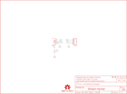

Contents
========

* [PRS12700 > USB Type A Female Breakout](#prs12700--usb-type-a-female-breakout)
	* [Schematic](#schematic)
	* [PCB](#pcb)
	* [Interactive BOM](#interactive-bom)
	* [OOMP Parts](#oomp-parts)
	* [Images](#images)
	* [Tags](#tags)
  
![][im]
# PRS12700 > USB Type A Female Breakout

- ID: PROJ-SPAR-12700-STAN-01
- Hex ID: PRS12700
- Name: Sparkfun
- Description: Sparkfun
- Long Link: [http://oom.lt/PROJ-SPAR-12700-STAN-01](http://oom.lt/PROJ-SPAR-12700-STAN-01)
- Short Link: [http://oom.lt/PRS12700](http://oom.lt/PRS12700)

## Schematic
  

## PCB
  

## Interactive BOM

- Interactive BOM page: [ibom.html](https://htmlpreview.github.io/?https://github.com/oomlout/oomlout_OOMP_projects/blob/main/PROJ-SPAR-12700-STAN-01/kicad/bom/ibom.html)

## OOMP Parts
  

|OOMP Parts|
| :---: |
|UNMATCHED-UNMATCHED-X-UNMATCHED-01 JP1|
|[HEAD-I01-X-PI04-01  2.54 mm 4 Pin Header  JP2](https://github.com/oomlout/oomlout_OOMP_parts/tree/main/HEAD-I01-X-PI04-01/)|
|RESE-0603-X-UNMATCHED-01 R1|

## Images
  
  

|kicadPcb3d|kicadPcb3dFront|kicadPcb3dBack|eagleImage|eagleSchemImage|
| :---: | :---: | :---: | :---: | :---: |
||||||

## Tags

- hexID: PRS12700
- oompType: PROJ
- oompSize: SPAR
- oompColor: 12700
- oompDesc: STAN
- oompIndex: 01
- oompName: USB Type A Female Breakout
- sources: All source files from https://github.com/sparkfun/USB_Type_A_Female_Breakout (source licence details in srcLicense.md)
- linkBuyPage: https://www.sparkfun.com/products/12700
- oompID: PROJ-SPAR-12700-STAN-01
- oompParts: JP1,UNMATCHED-UNMATCHED-X-UNMATCHED-01
- oompParts: JP2,HEAD-I01-X-PI04-01
- oompParts: R1,RESE-0603-X-UNMATCHED-01
- rawParts: FID1,FIDUCIAL1X2,FIDUCIAL1X2,FIDUCIAL-1X2,Fiducial Alignment Points,,
- rawParts: FID2,FIDUCIAL1X2,FIDUCIAL1X2,FIDUCIAL-1X2,Fiducial Alignment Points,,
- rawParts: FRAME1,FRAME-LETTER,FRAME-LETTER,CREATIVE_COMMONS,Schematic Frame,,
- rawParts: JP1,USB+SHIELDUSB-A-S-NOSILK-FEMALE,USB+SHIELDUSB-A-S-NOSILK-FEMALE,USB-A-S-NOSILK-FEMALE,USB+Shield,,
- rawParts: JP2,,M04PTH,1X04,Header 4,,
- rawParts: LOGO1,LOGO-SFENEW,LOGO-SFENEW,SFE-NEW-WEBLOGO,Spark Fun Electronics PCB Logo,,
- rawParts: LOGO2,OSHW-LOGOS,OSHW-LOGOS,OSHW-LOGO-S,Open Source Hardware Logo This logo indicates the piece of hardware it is found on incorporates a OSHW license and/or adheres to the definition of open source hardware found here: http://freedomdefined.org/OSHW,,
- rawParts: LOGO3,LOGO-SFESK,LOGO-SFESK,SFE-LOGO-FLAME,Spark Fun Electronics PCB Logo,,
- rawParts: R1,0,RESISTOR0603,0603-RES,Resistor,DNP,
- rawParts: STANDOFF1,STAND-OFF,STAND-OFF,STAND-OFF,#4 Stand Off,,
- rawParts: STANDOFF2,STAND-OFF,STAND-OFF,STAND-OFF,#4 Stand Off,,
- rawParts: STANDOFF3,STAND-OFF,STAND-OFF,STAND-OFF,#4 Stand Off,,
- rawParts: STANDOFF4,STAND-OFF,STAND-OFF,STAND-OFF,#4 Stand Off,,

[im]: kicadPcb3d_450.png
