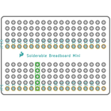
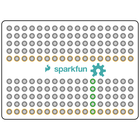
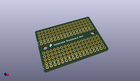
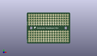
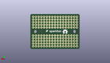
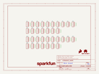
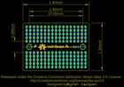
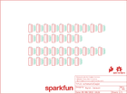
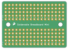
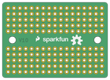

Contents
========

* [PRS12702 > Solderable Breadboard Mini](#prs12702--solderable-breadboard-mini)
	* [Schematic](#schematic)
	* [PCB](#pcb)
	* [Interactive BOM](#interactive-bom)
	* [OOMP Parts](#oomp-parts)
	* [Images](#images)
	* [Tags](#tags)
  
![][im]
# PRS12702 > Solderable Breadboard Mini

- ID: PROJ-SPAR-12702-STAN-01
- Hex ID: PRS12702
- Name: Sparkfun
- Description: Sparkfun
- Long Link: [http://oom.lt/PROJ-SPAR-12702-STAN-01](http://oom.lt/PROJ-SPAR-12702-STAN-01)
- Short Link: [http://oom.lt/PRS12702](http://oom.lt/PRS12702)

## Schematic
  

## PCB
  

## Interactive BOM

- Interactive BOM page: [ibom.html](https://htmlpreview.github.io/?https://github.com/oomlout/oomlout_OOMP_projects/blob/main/PROJ-SPAR-12702-STAN-01/kicad/bom/ibom.html)

## OOMP Parts
  

|OOMP ID|Name|Identifier|
| :---: | :---: | :---: |
|[HEAD-I01-X-PI05-01](https://github.com/oomlout/oomlout_OOMP_parts/tree/main/HEAD-I01-X-PI05-01/)|[2.54 mm 5 Pin Header](https://github.com/oomlout/oomlout_OOMP_parts/tree/main/HEAD-I01-X-PI05-01/)|[JP1, JP2, JP3, JP4, JP5, JP6, JP7, JP8, JP9, JP10, JP11, JP12, JP13, JP14, JP15, JP16, JP17, JP18, JP19, JP20, JP21, JP22, JP23, JP24, JP25, JP26, JP27, JP28, JP29, JP30, JP31, JP32, JP33, JP34](https://github.com/oomlout/oomlout_OOMP_parts/tree/main/HEAD-I01-X-PI05-01/)|

## Images
  
  

|bominteractivefront|bominteractiveback|kicadPcb3d|kicadPcb3dFront|kicadPcb3dBack|kicadSchem|eagleImage|eagleSchemImage|pcbdraw|pcbdrawback|
| :---: | :---: | :---: | :---: | :---: | :---: | :---: | :---: | :---: | :---: |
|||||||||||

## Tags

- hexID: PRS12702
- oompType: PROJ
- oompSize: SPAR
- oompColor: 12702
- oompDesc: STAN
- oompIndex: 01
- oompName: Solderable Breadboard Mini
- sources: All source files from https://github.com/sparkfun/Solderable_Breadboard_Mini (source licence details in srcLicense.md)
- linkBuyPage: https://www.sparkfun.com/products/12702
- oompID: PROJ-SPAR-12702-STAN-01
- oompParts: JP1,HEAD-I01-X-PI05-01
- oompParts: JP2,HEAD-I01-X-PI05-01
- oompParts: JP3,HEAD-I01-X-PI05-01
- oompParts: JP4,HEAD-I01-X-PI05-01
- oompParts: JP5,HEAD-I01-X-PI05-01
- oompParts: JP6,HEAD-I01-X-PI05-01
- oompParts: JP7,HEAD-I01-X-PI05-01
- oompParts: JP8,HEAD-I01-X-PI05-01
- oompParts: JP9,HEAD-I01-X-PI05-01
- oompParts: JP10,HEAD-I01-X-PI05-01
- oompParts: JP11,HEAD-I01-X-PI05-01
- oompParts: JP12,HEAD-I01-X-PI05-01
- oompParts: JP13,HEAD-I01-X-PI05-01
- oompParts: JP14,HEAD-I01-X-PI05-01
- oompParts: JP15,HEAD-I01-X-PI05-01
- oompParts: JP16,HEAD-I01-X-PI05-01
- oompParts: JP17,HEAD-I01-X-PI05-01
- oompParts: JP18,HEAD-I01-X-PI05-01
- oompParts: JP19,HEAD-I01-X-PI05-01
- oompParts: JP20,HEAD-I01-X-PI05-01
- oompParts: JP21,HEAD-I01-X-PI05-01
- oompParts: JP22,HEAD-I01-X-PI05-01
- oompParts: JP23,HEAD-I01-X-PI05-01
- oompParts: JP24,HEAD-I01-X-PI05-01
- oompParts: JP25,HEAD-I01-X-PI05-01
- oompParts: JP26,HEAD-I01-X-PI05-01
- oompParts: JP27,HEAD-I01-X-PI05-01
- oompParts: JP28,HEAD-I01-X-PI05-01
- oompParts: JP29,HEAD-I01-X-PI05-01
- oompParts: JP30,HEAD-I01-X-PI05-01
- oompParts: JP31,HEAD-I01-X-PI05-01
- oompParts: JP32,HEAD-I01-X-PI05-01
- oompParts: JP33,HEAD-I01-X-PI05-01
- oompParts: JP34,HEAD-I01-X-PI05-01
- rawParts: FRAME1,FRAME-LETTER,FRAME-LETTER,CREATIVE_COMMONS,Schematic Frame,,
- rawParts: JP1, ,M05NO_SILK,1X05_NO_SILK,Header 5,,
- rawParts: JP2, ,M05NO_SILK,1X05_NO_SILK,Header 5,,
- rawParts: JP3, ,M05NO_SILK,1X05_NO_SILK,Header 5,,
- rawParts: JP4, ,M05NO_SILK,1X05_NO_SILK,Header 5,,
- rawParts: JP5, ,M05NO_SILK,1X05_NO_SILK,Header 5,,
- rawParts: JP6, ,M05NO_SILK,1X05_NO_SILK,Header 5,,
- rawParts: JP7, ,M05NO_SILK,1X05_NO_SILK,Header 5,,
- rawParts: JP8, ,M05NO_SILK,1X05_NO_SILK,Header 5,,
- rawParts: JP9, ,M05NO_SILK,1X05_NO_SILK,Header 5,,
- rawParts: JP10, ,M05NO_SILK,1X05_NO_SILK,Header 5,,
- rawParts: JP11, ,M05NO_SILK,1X05_NO_SILK,Header 5,,
- rawParts: JP12, ,M05NO_SILK,1X05_NO_SILK,Header 5,,
- rawParts: JP13, ,M05NO_SILK,1X05_NO_SILK,Header 5,,
- rawParts: JP14, ,M05NO_SILK,1X05_NO_SILK,Header 5,,
- rawParts: JP15, ,M05NO_SILK,1X05_NO_SILK,Header 5,,
- rawParts: JP16, ,M05NO_SILK,1X05_NO_SILK,Header 5,,
- rawParts: JP17, ,M05NO_SILK,1X05_NO_SILK,Header 5,,
- rawParts: JP18, ,M05NO_SILK,1X05_NO_SILK,Header 5,,
- rawParts: JP19, ,M05NO_SILK,1X05_NO_SILK,Header 5,,
- rawParts: JP20, ,M05NO_SILK,1X05_NO_SILK,Header 5,,
- rawParts: JP21, ,M05NO_SILK,1X05_NO_SILK,Header 5,,
- rawParts: JP22, ,M05NO_SILK,1X05_NO_SILK,Header 5,,
- rawParts: JP23, ,M05NO_SILK,1X05_NO_SILK,Header 5,,
- rawParts: JP24, ,M05NO_SILK,1X05_NO_SILK,Header 5,,
- rawParts: JP25, ,M05NO_SILK,1X05_NO_SILK,Header 5,,
- rawParts: JP26, ,M05NO_SILK,1X05_NO_SILK,Header 5,,
- rawParts: JP27, ,M05NO_SILK,1X05_NO_SILK,Header 5,,
- rawParts: JP28, ,M05NO_SILK,1X05_NO_SILK,Header 5,,
- rawParts: JP29, ,M05NO_SILK,1X05_NO_SILK,Header 5,,
- rawParts: JP30, ,M05NO_SILK,1X05_NO_SILK,Header 5,,
- rawParts: JP31, ,M05NO_SILK,1X05_NO_SILK,Header 5,,
- rawParts: JP32, ,M05NO_SILK,1X05_NO_SILK,Header 5,,
- rawParts: JP33, ,M05NO_SILK,1X05_NO_SILK,Header 5,,
- rawParts: JP34, ,M05NO_SILK,1X05_NO_SILK,Header 5,,
- rawParts: LOGO1,SFE_LOGO_NAME.1_INCH,SFE_LOGO_NAME.1_INCH,SFE_LOGO_NAME_.1,SFE Logo, name only,,
- rawParts: LOGO2,OSHW-LOGOM,OSHW-LOGOM,OSHW-LOGO-M,Open Source Hardware Logo This logo indicates the piece of hardware it is found on incorporates a OSHW license and/or adheres to the definition of open source hardware found here: http://freedomdefined.org/OSHW,,
- rawParts: LOGO3,SFE_LOGO_FLAME.1_INCH,SFE_LOGO_FLAME.1_INCH,SFE_LOGO_FLAME_.1,SFE Logo, flame only,,
- rawParts: LOGO4,SFE_LOGO_FLAME.1_INCH,SFE_LOGO_FLAME.1_INCH,SFE_LOGO_FLAME_.1,SFE Logo, flame only,,

[im]: kicadPcb3d_450.png
