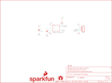

Contents
========

* [PRS12705 > ML8511 Breakout](#prs12705--ml8511-breakout)
	* [Schematic](#schematic)
	* [PCB](#pcb)
	* [Interactive BOM](#interactive-bom)
	* [OOMP Parts](#oomp-parts)
	* [Images](#images)
	* [Tags](#tags)
  
![][im]
# PRS12705 > ML8511 Breakout

- ID: PROJ-SPAR-12705-STAN-01
- Hex ID: PRS12705
- Name: Sparkfun
- Description: Sparkfun
- Long Link: [http://oom.lt/PROJ-SPAR-12705-STAN-01](http://oom.lt/PROJ-SPAR-12705-STAN-01)
- Short Link: [http://oom.lt/PRS12705](http://oom.lt/PRS12705)

## Schematic
  

## PCB
  

## Interactive BOM

- Interactive BOM page: [ibom.html](https://htmlpreview.github.io/?https://github.com/oomlout/oomlout_OOMP_projects/blob/main/PROJ-SPAR-12705-STAN-01/kicad/bom/ibom.html)

## OOMP Parts
  

|OOMP Parts|
| :---: |
|[CAPC-0603-X-NF1-V50  SMD (0603) 1 nF Capacitor (Ceramic) 50v  C1](https://github.com/oomlout/oomlout_OOMP_parts/tree/main/CAPC-0603-X-NF1-V50/)|
|[CAPC-0603-X-NF100-V50  SMD (0603) 100 nF Capacitor (Ceramic) 50v  C2](https://github.com/oomlout/oomlout_OOMP_parts/tree/main/CAPC-0603-X-NF100-V50/)|
|[HEAD-I01-X-PI04-01  2.54 mm 4 Pin Header  JP2](https://github.com/oomlout/oomlout_OOMP_parts/tree/main/HEAD-I01-X-PI04-01/)|
|[RESE-0603-X-O103-01  SMD (0603) 10k Ohm Resistor  R1](https://github.com/oomlout/oomlout_OOMP_parts/tree/main/RESE-0603-X-O103-01/)|
|UNMATCHED-UNMATCHED-X-UNMATCHED-01 U1|

## Images
  
  

|bominteractivefront|bominteractiveback|kicadPcb3d|kicadPcb3dFront|kicadPcb3dBack|eagleImage|eagleSchemImage|
| :---: | :---: | :---: | :---: | :---: | :---: | :---: |
||||||||

## Tags

- hexID: PRS12705
- oompType: PROJ
- oompSize: SPAR
- oompColor: 12705
- oompDesc: STAN
- oompIndex: 01
- oompName: ML8511 Breakout
- sources: All source files from https://github.com/sparkfun/ML8511_Breakout (source licence details in srcLicense.md)
- linkBuyPage: https://www.sparkfun.com/products/12705
- oompID: PROJ-SPAR-12705-STAN-01
- oompParts: C1,CAPC-0603-X-NF1-V50
- oompParts: C2,CAPC-0603-X-NF100-V50
- oompParts: JP2,HEAD-I01-X-PI04-01
- oompParts: R1,RESE-0603-X-O103-01
- oompParts: U1,UNMATCHED-UNMATCHED-X-UNMATCHED-01
- rawParts: C1,1nF,1NF/1000PF-50V-10%(0603),0603-CAP,CAP-07886,CAP-07886,1nF,
- rawParts: C2,0.1uF,0.1UF-25V(+80/-20%)(0603),0603-CAP,CAP-00810,CAP-00810,0.1uF,
- rawParts: FID1,FIDUCIAL1X2,FIDUCIAL1X2,FIDUCIAL-1X2,Fiducial Alignment Points,,,
- rawParts: FID2,FIDUCIAL1X2,FIDUCIAL1X2,FIDUCIAL-1X2,Fiducial Alignment Points,,,
- rawParts: FRAME2,FRAME-LETTER,FRAME-LETTER,CREATIVE_COMMONS,Schematic Frame,,,
- rawParts: JP2,,M04PTH,1X04,Header 4,,,
- rawParts: LOGO2,OSHW-LOGOS,OSHW-LOGOS,OSHW-LOGO-S,Open Source Hardware Logo This logo indicates the piece of hardware it is found on incorporates a OSHW license and/or adheres to the definition of open source hardware found here: http://freedomdefined.org/OSHW,,,
- rawParts: LOGO3,SFE_LOGO_FLAME.1_INCH,SFE_LOGO_FLAME.1_INCH,SFE_LOGO_FLAME_.1,SFE Logo, flame only,,,
- rawParts: LOGO4,SFE_LOGO_NAME.1_INCH,SFE_LOGO_NAME.1_INCH,SFE_LOGO_NAME_.1,SFE Logo, name only,,,
- rawParts: R1,10K,10KOHM1/10W1%(0603)0603,0603-RES,RES-00824,RES-00824,10K,
- rawParts: STANDOFF1,STAND-OFF,STAND-OFF,STAND-OFF,#4 Stand Off,,,
- rawParts: U1,ML8511-UV-SENSOR,ML8511-UV-SENSORSMD,ML8511,,,,

[im]: kicadPcb3d_450.png
