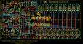
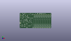
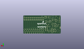
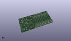

Contents
========

* [PROJ-SPAR-12707-STAN-01>Sparkpunk Sequencer](#proj-spar-12707-stan-01sparkpunk-sequencer)
	* [Images](#images)
	* [Interactive BOM](#interactive-bom)
	* [OOMP Parts](#oomp-parts)
	* [Tags](#tags)
  
![][im]
# PROJ-SPAR-12707-STAN-01>Sparkpunk Sequencer

- ID: PROJ-SPAR-12707-STAN-01
- Hex ID: PRS12707
- Name: Sparkpunk Sequencer
- Description: 

## Images
  
  

|eagleImage|kicadPcb3dFront|kicadPcb3dBack|kicadPcb3d|
| :---: | :---: | :---: | :---: |
|||||

## Interactive BOM

- Interactive BOM page: [ibom.html](kicad/bom/ibom.html)

## OOMP Parts
  

|OOMP Parts|
| :---: |
|UNMATCHED-UNMATCHED-X-UNMATCHED-01, BAT1, 24.13, 20.955, M90,BAT1, 9V, BC9VPC_KIT, SparkFun-Connectors, (0.95, 0.825), MR90|
|CAPC-UNMATCHED-X-UNMATCHED-01, C1, 29.209999999999997, 22.86, 180,C1, .1uf, CAP-PTH-SMALL-KIT, SparkFun-Capacitors, (1.15, 0.9), R180|
|CAPC-UNMATCHED-X-UNMATCHED-01, C2, 24.13, 40.64, 0,C2, 10uf, CPOL-RADIAL-10UF-25V-KIT, SparkFun-Capacitors, (0.95, 1.6), R0|
|CAPC-UNMATCHED-X-UNMATCHED-01, C3, 57.15, 33.654999999999994, 90,C3, 10uf, CPOL-RADIAL-10UF-25V-KIT, SparkFun-Capacitors, (2.25, 1.325), R90|
|CAPC-UNMATCHED-X-UNMATCHED-01, C4, 24.13, 48.26, 0,C4, 10uf, CPOL-RADIAL-10UF-25V-KIT, SparkFun-Capacitors, (0.95, 1.9), R0|
|CAPC-UNMATCHED-X-UNMATCHED-01, C5, 41.91, 26.669999999999998, 180,C5, .1uf, CAP-PTH-SMALL-KIT, SparkFun-Capacitors, (1.65, 1.05), R180|
|CAPC-UNMATCHED-X-UNMATCHED-01, C6, 67.30999999999999, 34.29, 0,C6, .1uf, CAP-PTH-SMALL-KIT, SparkFun-Capacitors, (2.65, 1.35), R0|
|CAPC-UNMATCHED-X-UNMATCHED-01, C7, 31.75, 46.99, 180,C7, .1uf, CAP-PTH-SMALL-KIT, SparkFun-Capacitors, (1.25, 1.85), R180|
|CAPC-UNMATCHED-X-UNMATCHED-01, C8, 41.91, 51.434999999999995, 90,C8, .1uf, CAP-PTH-SMALL-KIT, SparkFun-Capacitors, (1.65, 2.025), R90|
|UNMATCHED-UNMATCHED-X-UNMATCHED-01, C9, 38.099999999999994, 82.55, M0,C9, 1000uf/25V, CPOL-RADIAL-1000UF-25V-KIT, SparkFun-Capacitors, (1.5, 3.25), MR0|
|CAPC-UNMATCHED-X-UNMATCHED-01, C10, 50.8, 12.7, 270,C10, 1nf, CAP-PTH-SMALL-KIT, SparkFun-Capacitors, (2, 0.5), R270|
|CAPC-UNMATCHED-X-UNMATCHED-01, C11, 29.209999999999997, 12.7, 0,C11, .1uf, CAP-PTH-SMALL-KIT, SparkFun-Capacitors, (1.15, 0.5), R0|
|UNMATCHED-UNMATCHED-X-UNMATCHED-01, D1, 58.419999999999995, 12.7, 90,D1, 1n4148, DIODE-1N4148-KIT, SparkFun-DiscreteSemi, (2.3, 0.5), R90|
|UNMATCHED-UNMATCHED-X-UNMATCHED-01, D2, 55.88, 12.7, 270,D2, 1n4148, DIODE-1N4148-KIT, SparkFun-DiscreteSemi, (2.2, 0.5), R270|
|UNMATCHED-UNMATCHED-X-UNMATCHED-01, D3, 21.59, 77.46999999999998, 180,D3, 1N5819, DIODE-1N4001-KIT, SparkFun-DiscreteSemi, (0.85, 3.05), R180|
|UNMATCHED-UNMATCHED-X-UNMATCHED-01, D100, 81.28, 13.97, 270,D100, 1N5819, DIODE-1N4001-KIT, SparkFun-DiscreteSemi, (3.2, 0.55), R270|
|UNMATCHED-UNMATCHED-X-UNMATCHED-01, D101, 88.89999999999999, 13.97, 90,D101, 1N5819, DIODE-1N4001-KIT, SparkFun-DiscreteSemi, (3.5, 0.55), R90|
|UNMATCHED-UNMATCHED-X-UNMATCHED-01, D200, 91.44, 13.97, 270,D200, 1N5819, DIODE-1N4001-KIT, SparkFun-DiscreteSemi, (3.6, 0.55), R270|
|UNMATCHED-UNMATCHED-X-UNMATCHED-01, D201, 99.05999999999999, 13.97, 90,D201, 1N5819, DIODE-1N4001-KIT, SparkFun-DiscreteSemi, (3.9, 0.55), R90|
|UNMATCHED-UNMATCHED-X-UNMATCHED-01, D300, 101.6, 13.97, 270,D300, 1N5819, DIODE-1N4001-KIT, SparkFun-DiscreteSemi, (4, 0.55), R270|
|UNMATCHED-UNMATCHED-X-UNMATCHED-01, D301, 109.21999999999998, 13.97, 90,D301, 1N5819, DIODE-1N4001-KIT, SparkFun-DiscreteSemi, (4.3, 0.55), R90|
|UNMATCHED-UNMATCHED-X-UNMATCHED-01, D400, 111.76, 13.97, 270,D400, 1N5819, DIODE-1N4001-KIT, SparkFun-DiscreteSemi, (4.4, 0.55), R270|
|UNMATCHED-UNMATCHED-X-UNMATCHED-01, D401, 119.38, 13.97, 90,D401, 1N5819, DIODE-1N4001-KIT, SparkFun-DiscreteSemi, (4.7, 0.55), R90|
|UNMATCHED-UNMATCHED-X-UNMATCHED-01, D500, 121.91999999999999, 13.97, 270,D500, 1N5819, DIODE-1N4001-KIT, SparkFun-DiscreteSemi, (4.8, 0.55), R270|
|UNMATCHED-UNMATCHED-X-UNMATCHED-01, D501, 129.54, 13.97, 90,D501, 1N5819, DIODE-1N4001-KIT, SparkFun-DiscreteSemi, (5.1, 0.55), R90|
|UNMATCHED-UNMATCHED-X-UNMATCHED-01, D600, 132.07999999999998, 13.97, 270,D600, 1N5819, DIODE-1N4001-KIT, SparkFun-DiscreteSemi, (5.2, 0.55), R270|
|UNMATCHED-UNMATCHED-X-UNMATCHED-01, D601, 139.7, 13.97, 90,D601, 1N5819, DIODE-1N4001-KIT, SparkFun-DiscreteSemi, (5.5, 0.55), R90|
|UNMATCHED-UNMATCHED-X-UNMATCHED-01, D700, 142.23999999999998, 13.97, 270,D700, 1N5819, DIODE-1N4001-KIT, SparkFun-DiscreteSemi, (5.6, 0.55), R270|
|UNMATCHED-UNMATCHED-X-UNMATCHED-01, D701, 149.86, 13.97, 90,D701, 1N5819, DIODE-1N4001-KIT, SparkFun-DiscreteSemi, (5.9, 0.55), R90|
|UNMATCHED-UNMATCHED-X-UNMATCHED-01, D800, 152.39999999999998, 13.97, 270,D800, 1N5819, DIODE-1N4001-KIT, SparkFun-DiscreteSemi, (6, 0.55), R270|
|UNMATCHED-UNMATCHED-X-UNMATCHED-01, D801, 160.01999999999998, 13.97, 90,D801, 1N5819, DIODE-1N4001-KIT, SparkFun-DiscreteSemi, (6.3, 0.55), R90|
|UNMATCHED-UNMATCHED-X-UNMATCHED-01, D900, 162.56, 13.97, 270,D900, 1N5819, DIODE-1N4001-KIT, SparkFun-DiscreteSemi, (6.4, 0.55), R270|
|UNMATCHED-UNMATCHED-X-UNMATCHED-01, D901, 170.18, 13.97, 90,D901, 1N5819, DIODE-1N4001-KIT, SparkFun-DiscreteSemi, (6.7, 0.55), R90|
|UNMATCHED-UNMATCHED-X-UNMATCHED-01, D1000, 172.72, 13.97, 270,D1000, 1N5819, DIODE-1N4001-KIT, SparkFun-DiscreteSemi, (6.8, 0.55), R270|
|UNMATCHED-UNMATCHED-X-UNMATCHED-01, D1001, 180.33999999999997, 13.97, 90,D1001, 1N5819, DIODE-1N4001-KIT, SparkFun-DiscreteSemi, (7.1, 0.55), R90|
|UNMATCHED-UNMATCHED-X-UNMATCHED-01, IC1, 34.29, 38.099999999999994, 270,IC1, 7555, DIP08-KIT, SparkFun-AnalogIC, (1.35, 1.5), R270|
|UNMATCHED-UNMATCHED-X-UNMATCHED-01, IC2, 33.019999999999996, 67.30999999999999, 90,IC2, LM358, DIP08-KIT, SparkFun-AnalogIC, (1.3, 2.65), R90|
|UNMATCHED-UNMATCHED-X-UNMATCHED-01, IC3, 62.230000000000004, 58.419999999999995, 90,IC3, LM358, DIP08-KIT, SparkFun-AnalogIC, (2.45, 2.3), R90|
|UNMATCHED-UNMATCHED-X-UNMATCHED-01, IC4, 63.5, 80.00999999999999, 270,IC4, LM358, DIP08-KIT, SparkFun-AnalogIC, (2.5, 3.15), R270|
|UNMATCHED-UNMATCHED-X-UNMATCHED-01, IC5, 41.91, 13.97, 270,IC5, CD4013B, DIL14-KIT, SparkFun-DigitalIC, (1.65, 0.55), R270|
|UNMATCHED-UNMATCHED-X-UNMATCHED-01, IC6, 69.85, 21.59, 90,IC6, CD4017, DIL16-KIT, SparkFun-DigitalIC, (2.75, 0.85), R90|
|HEAD-I01-X-PI01-01, JP1, 6.35, 74.93, 0,JP1, GATE, 1X01NS, SparkFun-Connectors, (0.25, 2.95), R0|
|HEAD-I01-X-PI01-01, JP2, 6.35, 80.00999999999999, 0,JP2, CV1, 1X01NS, SparkFun-Connectors, (0.25, 3.15), R0|
|HEAD-I01-X-PI01-01, JP3, 38.099999999999994, 46.99, 0,JP3, TEMPO_CV, 1X01NS, SparkFun-Connectors, (1.5, 1.85), R0|
|HEAD-I01-X-PI01-01, JP4, 6.35, 77.46999999999998, 90,JP4, CV2, 1X01NS, SparkFun-Connectors, (0.25, 3.05), R90|
|HEAD-I01-X-PI01-01, JP5, 45.72, 59.69, 90,JP5, CV, 1X01NS, SparkFun-Connectors, (1.8, 2.35), R90|
|HEAD-I01-X-PI01-01, JP6, 6.35, 72.39, 0,JP6, VCC, 1X01NS, SparkFun-Connectors, (0.25, 2.85), R0|
|HEAD-I01-X-PI01-01, JP7, 6.35, 69.85, 0,JP7, GND, 1X01NS, SparkFun-Connectors, (0.25, 2.75), R0|
|HEAD-I01-X-PI01-01, JP100, 81.28, 3.8099999999999996, 0,JP100, STEP1, 1X01NS, SparkFun-Connectors, (3.2, 0.15), R0|
|<table><tr><td></td><td> JP200</td><td>[HEAD-I01-X-PI02-01 2.54 mm 2 Pin Header](https://github.com/oomlout/oomlout_OOMP_parts/tree/main/HEAD-I01-X-PI02-01/)</td><td>[H02](https://github.com/oomlout/oomlout_OOMP_parts/tree/main/HEAD-I01-X-PI02-01/)</td></tr></table>|
|<table><tr><td></td><td> JP300</td><td>[HEAD-I01-X-PI02-01 2.54 mm 2 Pin Header](https://github.com/oomlout/oomlout_OOMP_parts/tree/main/HEAD-I01-X-PI02-01/)</td><td>[H02](https://github.com/oomlout/oomlout_OOMP_parts/tree/main/HEAD-I01-X-PI02-01/)</td></tr></table>|
|<table><tr><td></td><td> JP400</td><td>[HEAD-I01-X-PI02-01 2.54 mm 2 Pin Header](https://github.com/oomlout/oomlout_OOMP_parts/tree/main/HEAD-I01-X-PI02-01/)</td><td>[H02](https://github.com/oomlout/oomlout_OOMP_parts/tree/main/HEAD-I01-X-PI02-01/)</td></tr></table>|
|<table><tr><td></td><td> JP500</td><td>[HEAD-I01-X-PI02-01 2.54 mm 2 Pin Header](https://github.com/oomlout/oomlout_OOMP_parts/tree/main/HEAD-I01-X-PI02-01/)</td><td>[H02](https://github.com/oomlout/oomlout_OOMP_parts/tree/main/HEAD-I01-X-PI02-01/)</td></tr></table>|
|<table><tr><td></td><td> JP600</td><td>[HEAD-I01-X-PI02-01 2.54 mm 2 Pin Header](https://github.com/oomlout/oomlout_OOMP_parts/tree/main/HEAD-I01-X-PI02-01/)</td><td>[H02](https://github.com/oomlout/oomlout_OOMP_parts/tree/main/HEAD-I01-X-PI02-01/)</td></tr></table>|
|<table><tr><td></td><td> JP700</td><td>[HEAD-I01-X-PI02-01 2.54 mm 2 Pin Header](https://github.com/oomlout/oomlout_OOMP_parts/tree/main/HEAD-I01-X-PI02-01/)</td><td>[H02](https://github.com/oomlout/oomlout_OOMP_parts/tree/main/HEAD-I01-X-PI02-01/)</td></tr></table>|
|<table><tr><td></td><td> JP800</td><td>[HEAD-I01-X-PI02-01 2.54 mm 2 Pin Header](https://github.com/oomlout/oomlout_OOMP_parts/tree/main/HEAD-I01-X-PI02-01/)</td><td>[H02](https://github.com/oomlout/oomlout_OOMP_parts/tree/main/HEAD-I01-X-PI02-01/)</td></tr></table>|
|<table><tr><td></td><td> JP900</td><td>[HEAD-I01-X-PI02-01 2.54 mm 2 Pin Header](https://github.com/oomlout/oomlout_OOMP_parts/tree/main/HEAD-I01-X-PI02-01/)</td><td>[H02](https://github.com/oomlout/oomlout_OOMP_parts/tree/main/HEAD-I01-X-PI02-01/)</td></tr></table>|
|<table><tr><td></td><td> JP1000</td><td>[HEAD-I01-X-PI02-01 2.54 mm 2 Pin Header](https://github.com/oomlout/oomlout_OOMP_parts/tree/main/HEAD-I01-X-PI02-01/)</td><td>[H02](https://github.com/oomlout/oomlout_OOMP_parts/tree/main/HEAD-I01-X-PI02-01/)</td></tr></table>|
|UNMATCHED-UNMATCHED-X-UNMATCHED-01, LED1, 43.18, 44.449999999999996, 270,LED1, RED, LED5MM-KIT, SparkFun-LED, (1.7, 1.75), R270|
|UNMATCHED-UNMATCHED-X-UNMATCHED-01, LED100, 85.09, 71.11999999999999, 0,LED100, RED, LED5MM-KIT, SparkFun-LED, (3.35, 2.8), R0|
|UNMATCHED-UNMATCHED-X-UNMATCHED-01, LED200, 95.25, 71.11999999999999, 0,LED200, RED, LED5MM-KIT, SparkFun-LED, (3.75, 2.8), R0|
|UNMATCHED-UNMATCHED-X-UNMATCHED-01, LED300, 105.41, 71.11999999999999, 0,LED300, RED, LED5MM-KIT, SparkFun-LED, (4.15, 2.8), R0|
|UNMATCHED-UNMATCHED-X-UNMATCHED-01, LED400, 115.57, 71.11999999999999, 0,LED400, RED, LED5MM-KIT, SparkFun-LED, (4.55, 2.8), R0|
|UNMATCHED-UNMATCHED-X-UNMATCHED-01, LED500, 125.73, 71.11999999999999, 0,LED500, RED, LED5MM-KIT, SparkFun-LED, (4.95, 2.8), R0|
|UNMATCHED-UNMATCHED-X-UNMATCHED-01, LED600, 135.89, 71.11999999999999, 0,LED600, RED, LED5MM-KIT, SparkFun-LED, (5.35, 2.8), R0|
|UNMATCHED-UNMATCHED-X-UNMATCHED-01, LED700, 146.04999999999998, 71.11999999999999, 0,LED700, RED, LED5MM-KIT, SparkFun-LED, (5.75, 2.8), R0|
|UNMATCHED-UNMATCHED-X-UNMATCHED-01, LED800, 156.21, 71.11999999999999, 0,LED800, RED, LED5MM-KIT, SparkFun-LED, (6.15, 2.8), R0|
|UNMATCHED-UNMATCHED-X-UNMATCHED-01, LED900, 166.36999999999998, 71.11999999999999, 0,LED900, RED, LED5MM-KIT, SparkFun-LED, (6.55, 2.8), R0|
|UNMATCHED-UNMATCHED-X-UNMATCHED-01, LED1000, 176.53, 71.11999999999999, 0,LED1000, RED, LED5MM-KIT, SparkFun-LED, (6.95, 2.8), R0|
|UNMATCHED-UNMATCHED-X-UNMATCHED-01, Q100, 85.09, 78.74, 0,Q100, 2N3904, TO-92-AMMO, SparkFun-DiscreteSemi, (3.35, 3.1), R0|
|UNMATCHED-UNMATCHED-X-UNMATCHED-01, Q200, 95.25, 78.74, 0,Q200, 2N3904, TO-92-AMMO, SparkFun-DiscreteSemi, (3.75, 3.1), R0|
|UNMATCHED-UNMATCHED-X-UNMATCHED-01, Q300, 105.41, 78.74, 0,Q300, 2N3904, TO-92-AMMO, SparkFun-DiscreteSemi, (4.15, 3.1), R0|
|UNMATCHED-UNMATCHED-X-UNMATCHED-01, Q400, 115.57, 78.74, 0,Q400, 2N3904, TO-92-AMMO, SparkFun-DiscreteSemi, (4.55, 3.1), R0|
|UNMATCHED-UNMATCHED-X-UNMATCHED-01, Q500, 125.73, 78.74, 0,Q500, 2N3904, TO-92-AMMO, SparkFun-DiscreteSemi, (4.95, 3.1), R0|
|UNMATCHED-UNMATCHED-X-UNMATCHED-01, Q600, 135.89, 78.74, 0,Q600, 2N3904, TO-92-AMMO, SparkFun-DiscreteSemi, (5.35, 3.1), R0|
|UNMATCHED-UNMATCHED-X-UNMATCHED-01, Q700, 146.04999999999998, 78.74, 0,Q700, 2N3904, TO-92-AMMO, SparkFun-DiscreteSemi, (5.75, 3.1), R0|
|UNMATCHED-UNMATCHED-X-UNMATCHED-01, Q800, 156.21, 78.74, 0,Q800, 2N3904, TO-92-AMMO, SparkFun-DiscreteSemi, (6.15, 3.1), R0|
|UNMATCHED-UNMATCHED-X-UNMATCHED-01, Q900, 166.36999999999998, 78.74, 0,Q900, 2N3904, TO-92-AMMO, SparkFun-DiscreteSemi, (6.55, 3.1), R0|
|UNMATCHED-UNMATCHED-X-UNMATCHED-01, Q1000, 176.53, 78.74, 0,Q1000, 2N3904, TO-92-AMMO, SparkFun-DiscreteSemi, (6.95, 3.1), R0|
|RESE-UNMATCHED-X-UNMATCHED-01, R1, 22.86, 36.195, 180,R1, 470, AXIAL-0.3EZ, SparkFun-Resistors, (0.9, 1.425), R180|
|RESE-UNMATCHED-X-O104-01, R2, 29.209999999999997, 20.32, 0,R2, 100k, AXIAL-0.3EZ, SparkFun-Resistors, (1.15, 0.8), R0|
|RESE-UNMATCHED-X-O104-01, R3, 60.959999999999994, 12.7, 90,R3, 100k, AXIAL-0.3EZ, SparkFun-Resistors, (2.4, 0.5), R90|
|RESE-UNMATCHED-X-O103-01, R4, 29.209999999999997, 17.779999999999998, 180,R4, 10k, AXIAL-0.3EZ, SparkFun-Resistors, (1.15, 0.7), R180|
|RESE-UNMATCHED-X-O473-01, R5, 22.86, 64.77, 90,R5, 47k, AXIAL-0.3EZ, SparkFun-Resistors, (0.9, 2.55), R90|
|RESE-UNMATCHED-X-UNMATCHED-01, R6, 29.209999999999997, 7.619999999999999, 180,R6, 2.2k, AXIAL-0.3EZ, SparkFun-Resistors, (1.15, 0.3), R180|
|RESE-UNMATCHED-X-O103-01, R7, 31.75, 50.8, 0,R7, 10k, AXIAL-0.3EZ, SparkFun-Resistors, (1.25, 2), R0|
|RESE-UNMATCHED-X-UNMATCHED-01, R9, 72.39, 58.419999999999995, 270,R9, 1k, AXIAL-0.3EZ, SparkFun-Resistors, (2.85, 2.3), R270|
|RESE-UNMATCHED-X-UNMATCHED-01, R10, 6.35, 60.959999999999994, 90,R10, 1k, AXIAL-0.3EZ, SparkFun-Resistors, (0.25, 2.4), R90|
|RESE-UNMATCHED-X-O103-01, R12, 69.85, 58.419999999999995, 90,R12, 10k, AXIAL-0.3EZ, SparkFun-Resistors, (2.75, 2.3), R90|
|RESE-UNMATCHED-X-O473-01, R13, 76.19999999999999, 80.00999999999999, 90,R13, 47k, AXIAL-0.3EZ, SparkFun-Resistors, (3, 3.15), R90|
|RESE-UNMATCHED-X-O104-01, R14, 29.209999999999997, 10.16, 0,R14, 100k, AXIAL-0.3EZ, SparkFun-Resistors, (1.15, 0.4), R0|
|RESE-UNMATCHED-X-UNMATCHED-01, R15, 3.8099999999999996, 60.959999999999994, 90,R15, 47, AXIAL-0.3EZ, SparkFun-Resistors, (0.15, 2.4), R90|
|RESE-UNMATCHED-X-O104-01, R16, 25.4, 64.77, 270,R16, 100k, AXIAL-0.3EZ, SparkFun-Resistors, (1, 2.55), R270|
|RESE-UNMATCHED-X-O223-01, R17, 20.32, 64.77, 90,R17, 22k, AXIAL-0.3EZ, SparkFun-Resistors, (0.8, 2.55), R90|
|RESE-UNMATCHED-X-O223-01, R18, 73.66, 80.00999999999999, 90,R18, 22k, AXIAL-0.3EZ, SparkFun-Resistors, (2.9, 3.15), R90|
|RESE-UNMATCHED-X-UNMATCHED-01, R19, 22.86, 33.654999999999994, 180,R19, 2.2k, AXIAL-0.3EZ, SparkFun-Resistors, (0.9, 1.325), R180|
|RESE-UNMATCHED-X-O473-01, R20, 52.06999999999999, 60.959999999999994, 270,R20, 47k, AXIAL-0.3EZ, SparkFun-Resistors, (2.05, 2.4), R270|
|RESE-UNMATCHED-X-O103-01, R21, 71.11999999999999, 80.00999999999999, 90,R21, 10k, AXIAL-0.3EZ, SparkFun-Resistors, (2.8, 3.15), R90|
|RESE-UNMATCHED-X-UNMATCHED-01, R22, 74.93, 58.419999999999995, 90,R22, 1k, AXIAL-0.3EZ, SparkFun-Resistors, (2.95, 2.3), R90|
|RESE-UNMATCHED-X-O103-01, R23, 55.88, 80.00999999999999, 270,R23, 10k, AXIAL-0.3EZ, SparkFun-Resistors, (2.2, 3.15), R270|
|RESE-UNMATCHED-X-O103-01, R24, 49.529999999999994, 60.959999999999994, 270,R24, 10k, AXIAL-0.3EZ, SparkFun-Resistors, (1.95, 2.4), R270|
|RESE-UNMATCHED-X-O103-01, R25, 49.529999999999994, 80.00999999999999, 270,R25, 10k, AXIAL-0.3EZ, SparkFun-Resistors, (1.95, 3.15), R270|
|RESE-UNMATCHED-X-UNMATCHED-01, R26, 8.889999999999999, 60.959999999999994, 90,R26, 1k, AXIAL-0.3EZ, SparkFun-Resistors, (0.35, 2.4), R90|
|RESE-UNMATCHED-X-O104-01, R27, 40.64, 67.30999999999999, 90,R27, 100k, AXIAL-0.3EZ, SparkFun-Resistors, (1.6, 2.65), R90|
|RESE-UNMATCHED-X-O104-01, R28, 43.18, 67.30999999999999, 270,R28, 100k, AXIAL-0.3EZ, SparkFun-Resistors, (1.7, 2.65), R270|
|RESE-UNMATCHED-X-O333-01, R29, 54.60999999999999, 60.959999999999994, 90,R29, 33k, AXIAL-0.3EZ, SparkFun-Resistors, (2.15, 2.4), R90|
|RESE-UNMATCHED-X-O223-01, R30, 78.74, 80.00999999999999, 270,R30, 22k, AXIAL-0.3EZ, SparkFun-Resistors, (3.1, 3.15), R270|
|RESE-UNMATCHED-X-UNMATCHED-01, R100, 88.89999999999999, 72.39, 90,R100, 2.2k, AXIAL-0.3EZ, SparkFun-Resistors, (3.5, 2.85), R90|
|RESE-UNMATCHED-X-UNMATCHED-01, R200, 99.05999999999999, 72.39, 90,R200, 2.2k, AXIAL-0.3EZ, SparkFun-Resistors, (3.9, 2.85), R90|
|RESE-UNMATCHED-X-UNMATCHED-01, R300, 109.21999999999998, 72.39, 90,R300, 2.2k, AXIAL-0.3EZ, SparkFun-Resistors, (4.3, 2.85), R90|
|RESE-UNMATCHED-X-UNMATCHED-01, R400, 119.38, 72.39, 90,R400, 2.2k, AXIAL-0.3EZ, SparkFun-Resistors, (4.7, 2.85), R90|
|RESE-UNMATCHED-X-UNMATCHED-01, R500, 129.54, 72.39, 90,R500, 2.2k, AXIAL-0.3EZ, SparkFun-Resistors, (5.1, 2.85), R90|
|RESE-UNMATCHED-X-UNMATCHED-01, R600, 139.7, 72.39, 90,R600, 2.2k, AXIAL-0.3EZ, SparkFun-Resistors, (5.5, 2.85), R90|
|RESE-UNMATCHED-X-UNMATCHED-01, R700, 149.86, 72.39, 90,R700, 2.2k, AXIAL-0.3EZ, SparkFun-Resistors, (5.9, 2.85), R90|
|RESE-UNMATCHED-X-UNMATCHED-01, R800, 160.01999999999998, 72.39, 90,R800, 2.2k, AXIAL-0.3EZ, SparkFun-Resistors, (6.3, 2.85), R90|
|RESE-UNMATCHED-X-UNMATCHED-01, R900, 170.18, 72.39, 90,R900, 2.2k, AXIAL-0.3EZ, SparkFun-Resistors, (6.7, 2.85), R90|
|RESE-UNMATCHED-X-UNMATCHED-01, R1000, 180.33999999999997, 72.39, 90,R1000, 2.2k, AXIAL-0.3EZ, SparkFun-Resistors, (7.1, 2.85), R90|
|UNMATCHED-UNMATCHED-X-UNMATCHED-01, RV1, 13.97, 44.449999999999996, 270,RV1, 10k, ALPS_POT_KIT, SparkFun-Electromechanical, (0.55, 1.75), R270|
|UNMATCHED-UNMATCHED-X-UNMATCHED-01, RV2, 64.77, 44.449999999999996, 270,RV2, 10k, ALPS_POT_KIT, SparkFun-Electromechanical, (2.55, 1.75), R270|
|UNMATCHED-UNMATCHED-X-UNMATCHED-01, S1, 22.86, 85.09, 270,S1, SPDT, SWITCH-SPDT_KIT, SparkFun-Electromechanical, (0.9, 3.35), R270|
|ERROR, S3 Play Button, 0, 0, 0,S3, Play, Button, TACTILE-PTH-LED-12MM-EZ, SparkFun-Electromechanical, (0.55, 0.55), R0|
|UNMATCHED-UNMATCHED-X-UNMATCHED-01, S5, 16.509999999999998, 64.77, 0,S5, SPDT, SWITCH-SPDT_KIT, SparkFun-Electromechanical, (0.65, 2.55), R0|
|UNMATCHED-UNMATCHED-X-UNMATCHED-01, S100, 85.09, 13.97, 180,S100, SPDT, SWITCH-SPDT_KIT, SparkFun-Electromechanical, (3.35, 0.55), R180|
|UNMATCHED-UNMATCHED-X-UNMATCHED-01, S200, 95.25, 13.97, 180,S200, SPDT, SWITCH-SPDT_KIT, SparkFun-Electromechanical, (3.75, 0.55), R180|
|UNMATCHED-UNMATCHED-X-UNMATCHED-01, S300, 105.41, 13.97, 180,S300, SPDT, SWITCH-SPDT_KIT, SparkFun-Electromechanical, (4.15, 0.55), R180|
|UNMATCHED-UNMATCHED-X-UNMATCHED-01, S400, 115.57, 13.97, 180,S400, SPDT, SWITCH-SPDT_KIT, SparkFun-Electromechanical, (4.55, 0.55), R180|
|UNMATCHED-UNMATCHED-X-UNMATCHED-01, S500, 125.73, 13.97, 180,S500, SPDT, SWITCH-SPDT_KIT, SparkFun-Electromechanical, (4.95, 0.55), R180|
|UNMATCHED-UNMATCHED-X-UNMATCHED-01, S600, 135.89, 13.97, 180,S600, SPDT, SWITCH-SPDT_KIT, SparkFun-Electromechanical, (5.35, 0.55), R180|
|UNMATCHED-UNMATCHED-X-UNMATCHED-01, S700, 146.04999999999998, 13.97, 180,S700, SPDT, SWITCH-SPDT_KIT, SparkFun-Electromechanical, (5.75, 0.55), R180|
|UNMATCHED-UNMATCHED-X-UNMATCHED-01, S800, 156.21, 13.97, 180,S800, SPDT, SWITCH-SPDT_KIT, SparkFun-Electromechanical, (6.15, 0.55), R180|
|UNMATCHED-UNMATCHED-X-UNMATCHED-01, S900, 166.36999999999998, 13.97, 180,S900, SPDT, SWITCH-SPDT_KIT, SparkFun-Electromechanical, (6.55, 0.55), R180|
|UNMATCHED-UNMATCHED-X-UNMATCHED-01, S1000, 176.53, 13.97, 180,S1000, SPDT, SWITCH-SPDT_KIT, SparkFun-Electromechanical, (6.95, 0.55), R180|
|UNMATCHED-UNMATCHED-X-UNMATCHED-01, VR100, 85.09, 44.449999999999996, 270,VR100, 10K, SLIDER-MEDIUM-KIT, SparkFun-Electromechanical, (3.35, 1.75), R270|
|UNMATCHED-UNMATCHED-X-UNMATCHED-01, VR200, 95.25, 44.449999999999996, 270,VR200, 10K, SLIDER-MEDIUM-KIT, SparkFun-Electromechanical, (3.75, 1.75), R270|
|UNMATCHED-UNMATCHED-X-UNMATCHED-01, VR300, 105.41, 44.449999999999996, 270,VR300, 10K, SLIDER-MEDIUM-KIT, SparkFun-Electromechanical, (4.15, 1.75), R270|
|UNMATCHED-UNMATCHED-X-UNMATCHED-01, VR400, 115.57, 44.449999999999996, 270,VR400, 10K, SLIDER-MEDIUM-KIT, SparkFun-Electromechanical, (4.55, 1.75), R270|
|UNMATCHED-UNMATCHED-X-UNMATCHED-01, VR500, 125.73, 44.449999999999996, 270,VR500, 10K, SLIDER-MEDIUM-KIT, SparkFun-Electromechanical, (4.95, 1.75), R270|
|UNMATCHED-UNMATCHED-X-UNMATCHED-01, VR600, 135.89, 44.449999999999996, 270,VR600, 10K, SLIDER-MEDIUM-KIT, SparkFun-Electromechanical, (5.35, 1.75), R270|
|UNMATCHED-UNMATCHED-X-UNMATCHED-01, VR700, 146.04999999999998, 44.449999999999996, 270,VR700, 10K, SLIDER-MEDIUM-KIT, SparkFun-Electromechanical, (5.75, 1.75), R270|
|UNMATCHED-UNMATCHED-X-UNMATCHED-01, VR800, 156.21, 44.449999999999996, 270,VR800, 10K, SLIDER-MEDIUM-KIT, SparkFun-Electromechanical, (6.15, 1.75), R270|
|UNMATCHED-UNMATCHED-X-UNMATCHED-01, VR900, 166.36999999999998, 44.449999999999996, 270,VR900, 10K, SLIDER-MEDIUM-KIT, SparkFun-Electromechanical, (6.55, 1.75), R270|
|UNMATCHED-UNMATCHED-X-UNMATCHED-01, VR1000, 176.53, 44.449999999999996, 270,VR1000, 10K, SLIDER-MEDIUM-KIT, SparkFun-Electromechanical, (6.95, 1.75), R270|

## Tags

- hexID: PRS12707
- oompType: PROJ
- oompSize: SPAR
- oompColor: 12707
- oompDesc: STAN
- oompIndex: 01
- oompName: Sparkpunk Sequencer
- sources: All source files from https://github.com/sparkfun/Sparkpunk_Sequencer (source licence details in srcLicense.md)
- linkBuyPage: https://www.sparkfun.com/products/12707
- oompPart: UNMATCHED-UNMATCHED-X-UNMATCHED-01, BAT1, 24.13, 20.955, M90
- oompPart: CAPC-UNMATCHED-X-UNMATCHED-01, C1, 29.209999999999997, 22.86, 180
- oompPart: CAPC-UNMATCHED-X-UNMATCHED-01, C2, 24.13, 40.64, 0
- oompPart: CAPC-UNMATCHED-X-UNMATCHED-01, C3, 57.15, 33.654999999999994, 90
- oompPart: CAPC-UNMATCHED-X-UNMATCHED-01, C4, 24.13, 48.26, 0
- oompPart: CAPC-UNMATCHED-X-UNMATCHED-01, C5, 41.91, 26.669999999999998, 180
- oompPart: CAPC-UNMATCHED-X-UNMATCHED-01, C6, 67.30999999999999, 34.29, 0
- oompPart: CAPC-UNMATCHED-X-UNMATCHED-01, C7, 31.75, 46.99, 180
- oompPart: CAPC-UNMATCHED-X-UNMATCHED-01, C8, 41.91, 51.434999999999995, 90
- oompPart: UNMATCHED-UNMATCHED-X-UNMATCHED-01, C9, 38.099999999999994, 82.55, M0
- oompPart: CAPC-UNMATCHED-X-UNMATCHED-01, C10, 50.8, 12.7, 270
- oompPart: CAPC-UNMATCHED-X-UNMATCHED-01, C11, 29.209999999999997, 12.7, 0
- oompPart: UNMATCHED-UNMATCHED-X-UNMATCHED-01, D1, 58.419999999999995, 12.7, 90
- oompPart: UNMATCHED-UNMATCHED-X-UNMATCHED-01, D2, 55.88, 12.7, 270
- oompPart: UNMATCHED-UNMATCHED-X-UNMATCHED-01, D3, 21.59, 77.46999999999998, 180
- oompPart: UNMATCHED-UNMATCHED-X-UNMATCHED-01, D100, 81.28, 13.97, 270
- oompPart: UNMATCHED-UNMATCHED-X-UNMATCHED-01, D101, 88.89999999999999, 13.97, 90
- oompPart: UNMATCHED-UNMATCHED-X-UNMATCHED-01, D200, 91.44, 13.97, 270
- oompPart: UNMATCHED-UNMATCHED-X-UNMATCHED-01, D201, 99.05999999999999, 13.97, 90
- oompPart: UNMATCHED-UNMATCHED-X-UNMATCHED-01, D300, 101.6, 13.97, 270
- oompPart: UNMATCHED-UNMATCHED-X-UNMATCHED-01, D301, 109.21999999999998, 13.97, 90
- oompPart: UNMATCHED-UNMATCHED-X-UNMATCHED-01, D400, 111.76, 13.97, 270
- oompPart: UNMATCHED-UNMATCHED-X-UNMATCHED-01, D401, 119.38, 13.97, 90
- oompPart: UNMATCHED-UNMATCHED-X-UNMATCHED-01, D500, 121.91999999999999, 13.97, 270
- oompPart: UNMATCHED-UNMATCHED-X-UNMATCHED-01, D501, 129.54, 13.97, 90
- oompPart: UNMATCHED-UNMATCHED-X-UNMATCHED-01, D600, 132.07999999999998, 13.97, 270
- oompPart: UNMATCHED-UNMATCHED-X-UNMATCHED-01, D601, 139.7, 13.97, 90
- oompPart: UNMATCHED-UNMATCHED-X-UNMATCHED-01, D700, 142.23999999999998, 13.97, 270
- oompPart: UNMATCHED-UNMATCHED-X-UNMATCHED-01, D701, 149.86, 13.97, 90
- oompPart: UNMATCHED-UNMATCHED-X-UNMATCHED-01, D800, 152.39999999999998, 13.97, 270
- oompPart: UNMATCHED-UNMATCHED-X-UNMATCHED-01, D801, 160.01999999999998, 13.97, 90
- oompPart: UNMATCHED-UNMATCHED-X-UNMATCHED-01, D900, 162.56, 13.97, 270
- oompPart: UNMATCHED-UNMATCHED-X-UNMATCHED-01, D901, 170.18, 13.97, 90
- oompPart: UNMATCHED-UNMATCHED-X-UNMATCHED-01, D1000, 172.72, 13.97, 270
- oompPart: UNMATCHED-UNMATCHED-X-UNMATCHED-01, D1001, 180.33999999999997, 13.97, 90
- oompPart: UNMATCHED-UNMATCHED-X-UNMATCHED-01, IC1, 34.29, 38.099999999999994, 270
- oompPart: UNMATCHED-UNMATCHED-X-UNMATCHED-01, IC2, 33.019999999999996, 67.30999999999999, 90
- oompPart: UNMATCHED-UNMATCHED-X-UNMATCHED-01, IC3, 62.230000000000004, 58.419999999999995, 90
- oompPart: UNMATCHED-UNMATCHED-X-UNMATCHED-01, IC4, 63.5, 80.00999999999999, 270
- oompPart: UNMATCHED-UNMATCHED-X-UNMATCHED-01, IC5, 41.91, 13.97, 270
- oompPart: UNMATCHED-UNMATCHED-X-UNMATCHED-01, IC6, 69.85, 21.59, 90
- oompPart: HEAD-I01-X-PI01-01, JP1, 6.35, 74.93, 0
- oompPart: HEAD-I01-X-PI01-01, JP2, 6.35, 80.00999999999999, 0
- oompPart: HEAD-I01-X-PI01-01, JP3, 38.099999999999994, 46.99, 0
- oompPart: HEAD-I01-X-PI01-01, JP4, 6.35, 77.46999999999998, 90
- oompPart: HEAD-I01-X-PI01-01, JP5, 45.72, 59.69, 90
- oompPart: HEAD-I01-X-PI01-01, JP6, 6.35, 72.39, 0
- oompPart: HEAD-I01-X-PI01-01, JP7, 6.35, 69.85, 0
- oompPart: HEAD-I01-X-PI01-01, JP100, 81.28, 3.8099999999999996, 0
- oompPart: HEAD-I01-X-PI02-01, JP200, 91.44, 1.27, 90
- oompPart: HEAD-I01-X-PI02-01, JP300, 101.6, 1.27, 90
- oompPart: HEAD-I01-X-PI02-01, JP400, 111.76, 1.27, 90
- oompPart: HEAD-I01-X-PI02-01, JP500, 121.91999999999999, 1.27, 90
- oompPart: HEAD-I01-X-PI02-01, JP600, 132.07999999999998, 1.27, 90
- oompPart: HEAD-I01-X-PI02-01, JP700, 142.23999999999998, 1.27, 90
- oompPart: HEAD-I01-X-PI02-01, JP800, 152.39999999999998, 1.27, 90
- oompPart: HEAD-I01-X-PI02-01, JP900, 162.56, 1.27, 90
- oompPart: HEAD-I01-X-PI02-01, JP1000, 172.72, 1.27, 90
- oompPart: UNMATCHED-UNMATCHED-X-UNMATCHED-01, LED1, 43.18, 44.449999999999996, 270
- oompPart: UNMATCHED-UNMATCHED-X-UNMATCHED-01, LED100, 85.09, 71.11999999999999, 0
- oompPart: UNMATCHED-UNMATCHED-X-UNMATCHED-01, LED200, 95.25, 71.11999999999999, 0
- oompPart: UNMATCHED-UNMATCHED-X-UNMATCHED-01, LED300, 105.41, 71.11999999999999, 0
- oompPart: UNMATCHED-UNMATCHED-X-UNMATCHED-01, LED400, 115.57, 71.11999999999999, 0
- oompPart: UNMATCHED-UNMATCHED-X-UNMATCHED-01, LED500, 125.73, 71.11999999999999, 0
- oompPart: UNMATCHED-UNMATCHED-X-UNMATCHED-01, LED600, 135.89, 71.11999999999999, 0
- oompPart: UNMATCHED-UNMATCHED-X-UNMATCHED-01, LED700, 146.04999999999998, 71.11999999999999, 0
- oompPart: UNMATCHED-UNMATCHED-X-UNMATCHED-01, LED800, 156.21, 71.11999999999999, 0
- oompPart: UNMATCHED-UNMATCHED-X-UNMATCHED-01, LED900, 166.36999999999998, 71.11999999999999, 0
- oompPart: UNMATCHED-UNMATCHED-X-UNMATCHED-01, LED1000, 176.53, 71.11999999999999, 0
- oompPart: UNMATCHED-UNMATCHED-X-UNMATCHED-01, Q100, 85.09, 78.74, 0
- oompPart: UNMATCHED-UNMATCHED-X-UNMATCHED-01, Q200, 95.25, 78.74, 0
- oompPart: UNMATCHED-UNMATCHED-X-UNMATCHED-01, Q300, 105.41, 78.74, 0
- oompPart: UNMATCHED-UNMATCHED-X-UNMATCHED-01, Q400, 115.57, 78.74, 0
- oompPart: UNMATCHED-UNMATCHED-X-UNMATCHED-01, Q500, 125.73, 78.74, 0
- oompPart: UNMATCHED-UNMATCHED-X-UNMATCHED-01, Q600, 135.89, 78.74, 0
- oompPart: UNMATCHED-UNMATCHED-X-UNMATCHED-01, Q700, 146.04999999999998, 78.74, 0
- oompPart: UNMATCHED-UNMATCHED-X-UNMATCHED-01, Q800, 156.21, 78.74, 0
- oompPart: UNMATCHED-UNMATCHED-X-UNMATCHED-01, Q900, 166.36999999999998, 78.74, 0
- oompPart: UNMATCHED-UNMATCHED-X-UNMATCHED-01, Q1000, 176.53, 78.74, 0
- oompPart: RESE-UNMATCHED-X-UNMATCHED-01, R1, 22.86, 36.195, 180
- oompPart: RESE-UNMATCHED-X-O104-01, R2, 29.209999999999997, 20.32, 0
- oompPart: RESE-UNMATCHED-X-O104-01, R3, 60.959999999999994, 12.7, 90
- oompPart: RESE-UNMATCHED-X-O103-01, R4, 29.209999999999997, 17.779999999999998, 180
- oompPart: RESE-UNMATCHED-X-O473-01, R5, 22.86, 64.77, 90
- oompPart: RESE-UNMATCHED-X-UNMATCHED-01, R6, 29.209999999999997, 7.619999999999999, 180
- oompPart: RESE-UNMATCHED-X-O103-01, R7, 31.75, 50.8, 0
- oompPart: RESE-UNMATCHED-X-UNMATCHED-01, R9, 72.39, 58.419999999999995, 270
- oompPart: RESE-UNMATCHED-X-UNMATCHED-01, R10, 6.35, 60.959999999999994, 90
- oompPart: RESE-UNMATCHED-X-O103-01, R12, 69.85, 58.419999999999995, 90
- oompPart: RESE-UNMATCHED-X-O473-01, R13, 76.19999999999999, 80.00999999999999, 90
- oompPart: RESE-UNMATCHED-X-O104-01, R14, 29.209999999999997, 10.16, 0
- oompPart: RESE-UNMATCHED-X-UNMATCHED-01, R15, 3.8099999999999996, 60.959999999999994, 90
- oompPart: RESE-UNMATCHED-X-O104-01, R16, 25.4, 64.77, 270
- oompPart: RESE-UNMATCHED-X-O223-01, R17, 20.32, 64.77, 90
- oompPart: RESE-UNMATCHED-X-O223-01, R18, 73.66, 80.00999999999999, 90
- oompPart: RESE-UNMATCHED-X-UNMATCHED-01, R19, 22.86, 33.654999999999994, 180
- oompPart: RESE-UNMATCHED-X-O473-01, R20, 52.06999999999999, 60.959999999999994, 270
- oompPart: RESE-UNMATCHED-X-O103-01, R21, 71.11999999999999, 80.00999999999999, 90
- oompPart: RESE-UNMATCHED-X-UNMATCHED-01, R22, 74.93, 58.419999999999995, 90
- oompPart: RESE-UNMATCHED-X-O103-01, R23, 55.88, 80.00999999999999, 270
- oompPart: RESE-UNMATCHED-X-O103-01, R24, 49.529999999999994, 60.959999999999994, 270
- oompPart: RESE-UNMATCHED-X-O103-01, R25, 49.529999999999994, 80.00999999999999, 270
- oompPart: RESE-UNMATCHED-X-UNMATCHED-01, R26, 8.889999999999999, 60.959999999999994, 90
- oompPart: RESE-UNMATCHED-X-O104-01, R27, 40.64, 67.30999999999999, 90
- oompPart: RESE-UNMATCHED-X-O104-01, R28, 43.18, 67.30999999999999, 270
- oompPart: RESE-UNMATCHED-X-O333-01, R29, 54.60999999999999, 60.959999999999994, 90
- oompPart: RESE-UNMATCHED-X-O223-01, R30, 78.74, 80.00999999999999, 270
- oompPart: RESE-UNMATCHED-X-UNMATCHED-01, R100, 88.89999999999999, 72.39, 90
- oompPart: RESE-UNMATCHED-X-UNMATCHED-01, R200, 99.05999999999999, 72.39, 90
- oompPart: RESE-UNMATCHED-X-UNMATCHED-01, R300, 109.21999999999998, 72.39, 90
- oompPart: RESE-UNMATCHED-X-UNMATCHED-01, R400, 119.38, 72.39, 90
- oompPart: RESE-UNMATCHED-X-UNMATCHED-01, R500, 129.54, 72.39, 90
- oompPart: RESE-UNMATCHED-X-UNMATCHED-01, R600, 139.7, 72.39, 90
- oompPart: RESE-UNMATCHED-X-UNMATCHED-01, R700, 149.86, 72.39, 90
- oompPart: RESE-UNMATCHED-X-UNMATCHED-01, R800, 160.01999999999998, 72.39, 90
- oompPart: RESE-UNMATCHED-X-UNMATCHED-01, R900, 170.18, 72.39, 90
- oompPart: RESE-UNMATCHED-X-UNMATCHED-01, R1000, 180.33999999999997, 72.39, 90
- oompPart: UNMATCHED-UNMATCHED-X-UNMATCHED-01, RV1, 13.97, 44.449999999999996, 270
- oompPart: UNMATCHED-UNMATCHED-X-UNMATCHED-01, RV2, 64.77, 44.449999999999996, 270
- oompPart: UNMATCHED-UNMATCHED-X-UNMATCHED-01, S1, 22.86, 85.09, 270
- oompPart: ERROR, S3 Play Button, 0, 0, 0
- oompPart: UNMATCHED-UNMATCHED-X-UNMATCHED-01, S5, 16.509999999999998, 64.77, 0
- oompPart: UNMATCHED-UNMATCHED-X-UNMATCHED-01, S100, 85.09, 13.97, 180
- oompPart: UNMATCHED-UNMATCHED-X-UNMATCHED-01, S200, 95.25, 13.97, 180
- oompPart: UNMATCHED-UNMATCHED-X-UNMATCHED-01, S300, 105.41, 13.97, 180
- oompPart: UNMATCHED-UNMATCHED-X-UNMATCHED-01, S400, 115.57, 13.97, 180
- oompPart: UNMATCHED-UNMATCHED-X-UNMATCHED-01, S500, 125.73, 13.97, 180
- oompPart: UNMATCHED-UNMATCHED-X-UNMATCHED-01, S600, 135.89, 13.97, 180
- oompPart: UNMATCHED-UNMATCHED-X-UNMATCHED-01, S700, 146.04999999999998, 13.97, 180
- oompPart: UNMATCHED-UNMATCHED-X-UNMATCHED-01, S800, 156.21, 13.97, 180
- oompPart: UNMATCHED-UNMATCHED-X-UNMATCHED-01, S900, 166.36999999999998, 13.97, 180
- oompPart: UNMATCHED-UNMATCHED-X-UNMATCHED-01, S1000, 176.53, 13.97, 180
- oompPart: SKIP-UNMATCHED-X-UNMATCHED-01, SJ1, 2.54, 27.94, 180
- oompPart: SKIP-UNMATCHED-X-UNMATCHED-01, SJ2, 2.54, 30.479999999999997, 180
- oompPart: SKIP-UNMATCHED-X-UNMATCHED-01, SJ3, 2.54, 33.019999999999996, 180
- oompPart: SKIP-UNMATCHED-X-UNMATCHED-01, SJ4, 2.54, 25.4, 180
- oompPart: SKIP-UNMATCHED-X-UNMATCHED-01, SJ5, 41.91, 3.8099999999999996, 0
- oompPart: UNMATCHED-UNMATCHED-X-UNMATCHED-01, VR100, 85.09, 44.449999999999996, 270
- oompPart: UNMATCHED-UNMATCHED-X-UNMATCHED-01, VR200, 95.25, 44.449999999999996, 270
- oompPart: UNMATCHED-UNMATCHED-X-UNMATCHED-01, VR300, 105.41, 44.449999999999996, 270
- oompPart: UNMATCHED-UNMATCHED-X-UNMATCHED-01, VR400, 115.57, 44.449999999999996, 270
- oompPart: UNMATCHED-UNMATCHED-X-UNMATCHED-01, VR500, 125.73, 44.449999999999996, 270
- oompPart: UNMATCHED-UNMATCHED-X-UNMATCHED-01, VR600, 135.89, 44.449999999999996, 270
- oompPart: UNMATCHED-UNMATCHED-X-UNMATCHED-01, VR700, 146.04999999999998, 44.449999999999996, 270
- oompPart: UNMATCHED-UNMATCHED-X-UNMATCHED-01, VR800, 156.21, 44.449999999999996, 270
- oompPart: UNMATCHED-UNMATCHED-X-UNMATCHED-01, VR900, 166.36999999999998, 44.449999999999996, 270
- oompPart: UNMATCHED-UNMATCHED-X-UNMATCHED-01, VR1000, 176.53, 44.449999999999996, 270
- rawPart: BAT1, 9V, BC9VPC_KIT, SparkFun-Connectors, (0.95, 0.825), MR90
- rawPart: C1, .1uf, CAP-PTH-SMALL-KIT, SparkFun-Capacitors, (1.15, 0.9), R180
- rawPart: C2, 10uf, CPOL-RADIAL-10UF-25V-KIT, SparkFun-Capacitors, (0.95, 1.6), R0
- rawPart: C3, 10uf, CPOL-RADIAL-10UF-25V-KIT, SparkFun-Capacitors, (2.25, 1.325), R90
- rawPart: C4, 10uf, CPOL-RADIAL-10UF-25V-KIT, SparkFun-Capacitors, (0.95, 1.9), R0
- rawPart: C5, .1uf, CAP-PTH-SMALL-KIT, SparkFun-Capacitors, (1.65, 1.05), R180
- rawPart: C6, .1uf, CAP-PTH-SMALL-KIT, SparkFun-Capacitors, (2.65, 1.35), R0
- rawPart: C7, .1uf, CAP-PTH-SMALL-KIT, SparkFun-Capacitors, (1.25, 1.85), R180
- rawPart: C8, .1uf, CAP-PTH-SMALL-KIT, SparkFun-Capacitors, (1.65, 2.025), R90
- rawPart: C9, 1000uf/25V, CPOL-RADIAL-1000UF-25V-KIT, SparkFun-Capacitors, (1.5, 3.25), MR0
- rawPart: C10, 1nf, CAP-PTH-SMALL-KIT, SparkFun-Capacitors, (2, 0.5), R270
- rawPart: C11, .1uf, CAP-PTH-SMALL-KIT, SparkFun-Capacitors, (1.15, 0.5), R0
- rawPart: D1, 1n4148, DIODE-1N4148-KIT, SparkFun-DiscreteSemi, (2.3, 0.5), R90
- rawPart: D2, 1n4148, DIODE-1N4148-KIT, SparkFun-DiscreteSemi, (2.2, 0.5), R270
- rawPart: D3, 1N5819, DIODE-1N4001-KIT, SparkFun-DiscreteSemi, (0.85, 3.05), R180
- rawPart: D100, 1N5819, DIODE-1N4001-KIT, SparkFun-DiscreteSemi, (3.2, 0.55), R270
- rawPart: D101, 1N5819, DIODE-1N4001-KIT, SparkFun-DiscreteSemi, (3.5, 0.55), R90
- rawPart: D200, 1N5819, DIODE-1N4001-KIT, SparkFun-DiscreteSemi, (3.6, 0.55), R270
- rawPart: D201, 1N5819, DIODE-1N4001-KIT, SparkFun-DiscreteSemi, (3.9, 0.55), R90
- rawPart: D300, 1N5819, DIODE-1N4001-KIT, SparkFun-DiscreteSemi, (4, 0.55), R270
- rawPart: D301, 1N5819, DIODE-1N4001-KIT, SparkFun-DiscreteSemi, (4.3, 0.55), R90
- rawPart: D400, 1N5819, DIODE-1N4001-KIT, SparkFun-DiscreteSemi, (4.4, 0.55), R270
- rawPart: D401, 1N5819, DIODE-1N4001-KIT, SparkFun-DiscreteSemi, (4.7, 0.55), R90
- rawPart: D500, 1N5819, DIODE-1N4001-KIT, SparkFun-DiscreteSemi, (4.8, 0.55), R270
- rawPart: D501, 1N5819, DIODE-1N4001-KIT, SparkFun-DiscreteSemi, (5.1, 0.55), R90
- rawPart: D600, 1N5819, DIODE-1N4001-KIT, SparkFun-DiscreteSemi, (5.2, 0.55), R270
- rawPart: D601, 1N5819, DIODE-1N4001-KIT, SparkFun-DiscreteSemi, (5.5, 0.55), R90
- rawPart: D700, 1N5819, DIODE-1N4001-KIT, SparkFun-DiscreteSemi, (5.6, 0.55), R270
- rawPart: D701, 1N5819, DIODE-1N4001-KIT, SparkFun-DiscreteSemi, (5.9, 0.55), R90
- rawPart: D800, 1N5819, DIODE-1N4001-KIT, SparkFun-DiscreteSemi, (6, 0.55), R270
- rawPart: D801, 1N5819, DIODE-1N4001-KIT, SparkFun-DiscreteSemi, (6.3, 0.55), R90
- rawPart: D900, 1N5819, DIODE-1N4001-KIT, SparkFun-DiscreteSemi, (6.4, 0.55), R270
- rawPart: D901, 1N5819, DIODE-1N4001-KIT, SparkFun-DiscreteSemi, (6.7, 0.55), R90
- rawPart: D1000, 1N5819, DIODE-1N4001-KIT, SparkFun-DiscreteSemi, (6.8, 0.55), R270
- rawPart: D1001, 1N5819, DIODE-1N4001-KIT, SparkFun-DiscreteSemi, (7.1, 0.55), R90
- rawPart: IC1, 7555, DIP08-KIT, SparkFun-AnalogIC, (1.35, 1.5), R270
- rawPart: IC2, LM358, DIP08-KIT, SparkFun-AnalogIC, (1.3, 2.65), R90
- rawPart: IC3, LM358, DIP08-KIT, SparkFun-AnalogIC, (2.45, 2.3), R90
- rawPart: IC4, LM358, DIP08-KIT, SparkFun-AnalogIC, (2.5, 3.15), R270
- rawPart: IC5, CD4013B, DIL14-KIT, SparkFun-DigitalIC, (1.65, 0.55), R270
- rawPart: IC6, CD4017, DIL16-KIT, SparkFun-DigitalIC, (2.75, 0.85), R90
- rawPart: JP1, GATE, 1X01NS, SparkFun-Connectors, (0.25, 2.95), R0
- rawPart: JP2, CV1, 1X01NS, SparkFun-Connectors, (0.25, 3.15), R0
- rawPart: JP3, TEMPO_CV, 1X01NS, SparkFun-Connectors, (1.5, 1.85), R0
- rawPart: JP4, CV2, 1X01NS, SparkFun-Connectors, (0.25, 3.05), R90
- rawPart: JP5, CV, 1X01NS, SparkFun-Connectors, (1.8, 2.35), R90
- rawPart: JP6, VCC, 1X01NS, SparkFun-Connectors, (0.25, 2.85), R0
- rawPart: JP7, GND, 1X01NS, SparkFun-Connectors, (0.25, 2.75), R0
- rawPart: JP100, STEP1, 1X01NS, SparkFun-Connectors, (3.2, 0.15), R0
- rawPart: JP200, STEP2, 1X02_NO_SILK, SparkFun-Connectors, (3.6, 0.05), R90
- rawPart: JP300, STEP3, 1X02_NO_SILK, SparkFun-Connectors, (4, 0.05), R90
- rawPart: JP400, STEP4, 1X02_NO_SILK, SparkFun-Connectors, (4.4, 0.05), R90
- rawPart: JP500, STEP5, 1X02_NO_SILK, SparkFun-Connectors, (4.8, 0.05), R90
- rawPart: JP600, STEP6, 1X02_NO_SILK, SparkFun-Connectors, (5.2, 0.05), R90
- rawPart: JP700, STEP7, 1X02_NO_SILK, SparkFun-Connectors, (5.6, 0.05), R90
- rawPart: JP800, STEP8, 1X02_NO_SILK, SparkFun-Connectors, (6, 0.05), R90
- rawPart: JP900, STEP9, 1X02_NO_SILK, SparkFun-Connectors, (6.4, 0.05), R90
- rawPart: JP1000, STEP10, 1X02_NO_SILK, SparkFun-Connectors, (6.8, 0.05), R90
- rawPart: LED1, RED, LED5MM-KIT, SparkFun-LED, (1.7, 1.75), R270
- rawPart: LED100, RED, LED5MM-KIT, SparkFun-LED, (3.35, 2.8), R0
- rawPart: LED200, RED, LED5MM-KIT, SparkFun-LED, (3.75, 2.8), R0
- rawPart: LED300, RED, LED5MM-KIT, SparkFun-LED, (4.15, 2.8), R0
- rawPart: LED400, RED, LED5MM-KIT, SparkFun-LED, (4.55, 2.8), R0
- rawPart: LED500, RED, LED5MM-KIT, SparkFun-LED, (4.95, 2.8), R0
- rawPart: LED600, RED, LED5MM-KIT, SparkFun-LED, (5.35, 2.8), R0
- rawPart: LED700, RED, LED5MM-KIT, SparkFun-LED, (5.75, 2.8), R0
- rawPart: LED800, RED, LED5MM-KIT, SparkFun-LED, (6.15, 2.8), R0
- rawPart: LED900, RED, LED5MM-KIT, SparkFun-LED, (6.55, 2.8), R0
- rawPart: LED1000, RED, LED5MM-KIT, SparkFun-LED, (6.95, 2.8), R0
- rawPart: Q100, 2N3904, TO-92-AMMO, SparkFun-DiscreteSemi, (3.35, 3.1), R0
- rawPart: Q200, 2N3904, TO-92-AMMO, SparkFun-DiscreteSemi, (3.75, 3.1), R0
- rawPart: Q300, 2N3904, TO-92-AMMO, SparkFun-DiscreteSemi, (4.15, 3.1), R0
- rawPart: Q400, 2N3904, TO-92-AMMO, SparkFun-DiscreteSemi, (4.55, 3.1), R0
- rawPart: Q500, 2N3904, TO-92-AMMO, SparkFun-DiscreteSemi, (4.95, 3.1), R0
- rawPart: Q600, 2N3904, TO-92-AMMO, SparkFun-DiscreteSemi, (5.35, 3.1), R0
- rawPart: Q700, 2N3904, TO-92-AMMO, SparkFun-DiscreteSemi, (5.75, 3.1), R0
- rawPart: Q800, 2N3904, TO-92-AMMO, SparkFun-DiscreteSemi, (6.15, 3.1), R0
- rawPart: Q900, 2N3904, TO-92-AMMO, SparkFun-DiscreteSemi, (6.55, 3.1), R0
- rawPart: Q1000, 2N3904, TO-92-AMMO, SparkFun-DiscreteSemi, (6.95, 3.1), R0
- rawPart: R1, 470, AXIAL-0.3EZ, SparkFun-Resistors, (0.9, 1.425), R180
- rawPart: R2, 100k, AXIAL-0.3EZ, SparkFun-Resistors, (1.15, 0.8), R0
- rawPart: R3, 100k, AXIAL-0.3EZ, SparkFun-Resistors, (2.4, 0.5), R90
- rawPart: R4, 10k, AXIAL-0.3EZ, SparkFun-Resistors, (1.15, 0.7), R180
- rawPart: R5, 47k, AXIAL-0.3EZ, SparkFun-Resistors, (0.9, 2.55), R90
- rawPart: R6, 2.2k, AXIAL-0.3EZ, SparkFun-Resistors, (1.15, 0.3), R180
- rawPart: R7, 10k, AXIAL-0.3EZ, SparkFun-Resistors, (1.25, 2), R0
- rawPart: R9, 1k, AXIAL-0.3EZ, SparkFun-Resistors, (2.85, 2.3), R270
- rawPart: R10, 1k, AXIAL-0.3EZ, SparkFun-Resistors, (0.25, 2.4), R90
- rawPart: R12, 10k, AXIAL-0.3EZ, SparkFun-Resistors, (2.75, 2.3), R90
- rawPart: R13, 47k, AXIAL-0.3EZ, SparkFun-Resistors, (3, 3.15), R90
- rawPart: R14, 100k, AXIAL-0.3EZ, SparkFun-Resistors, (1.15, 0.4), R0
- rawPart: R15, 47, AXIAL-0.3EZ, SparkFun-Resistors, (0.15, 2.4), R90
- rawPart: R16, 100k, AXIAL-0.3EZ, SparkFun-Resistors, (1, 2.55), R270
- rawPart: R17, 22k, AXIAL-0.3EZ, SparkFun-Resistors, (0.8, 2.55), R90
- rawPart: R18, 22k, AXIAL-0.3EZ, SparkFun-Resistors, (2.9, 3.15), R90
- rawPart: R19, 2.2k, AXIAL-0.3EZ, SparkFun-Resistors, (0.9, 1.325), R180
- rawPart: R20, 47k, AXIAL-0.3EZ, SparkFun-Resistors, (2.05, 2.4), R270
- rawPart: R21, 10k, AXIAL-0.3EZ, SparkFun-Resistors, (2.8, 3.15), R90
- rawPart: R22, 1k, AXIAL-0.3EZ, SparkFun-Resistors, (2.95, 2.3), R90
- rawPart: R23, 10k, AXIAL-0.3EZ, SparkFun-Resistors, (2.2, 3.15), R270
- rawPart: R24, 10k, AXIAL-0.3EZ, SparkFun-Resistors, (1.95, 2.4), R270
- rawPart: R25, 10k, AXIAL-0.3EZ, SparkFun-Resistors, (1.95, 3.15), R270
- rawPart: R26, 1k, AXIAL-0.3EZ, SparkFun-Resistors, (0.35, 2.4), R90
- rawPart: R27, 100k, AXIAL-0.3EZ, SparkFun-Resistors, (1.6, 2.65), R90
- rawPart: R28, 100k, AXIAL-0.3EZ, SparkFun-Resistors, (1.7, 2.65), R270
- rawPart: R29, 33k, AXIAL-0.3EZ, SparkFun-Resistors, (2.15, 2.4), R90
- rawPart: R30, 22k, AXIAL-0.3EZ, SparkFun-Resistors, (3.1, 3.15), R270
- rawPart: R100, 2.2k, AXIAL-0.3EZ, SparkFun-Resistors, (3.5, 2.85), R90
- rawPart: R200, 2.2k, AXIAL-0.3EZ, SparkFun-Resistors, (3.9, 2.85), R90
- rawPart: R300, 2.2k, AXIAL-0.3EZ, SparkFun-Resistors, (4.3, 2.85), R90
- rawPart: R400, 2.2k, AXIAL-0.3EZ, SparkFun-Resistors, (4.7, 2.85), R90
- rawPart: R500, 2.2k, AXIAL-0.3EZ, SparkFun-Resistors, (5.1, 2.85), R90
- rawPart: R600, 2.2k, AXIAL-0.3EZ, SparkFun-Resistors, (5.5, 2.85), R90
- rawPart: R700, 2.2k, AXIAL-0.3EZ, SparkFun-Resistors, (5.9, 2.85), R90
- rawPart: R800, 2.2k, AXIAL-0.3EZ, SparkFun-Resistors, (6.3, 2.85), R90
- rawPart: R900, 2.2k, AXIAL-0.3EZ, SparkFun-Resistors, (6.7, 2.85), R90
- rawPart: R1000, 2.2k, AXIAL-0.3EZ, SparkFun-Resistors, (7.1, 2.85), R90
- rawPart: RV1, 10k, ALPS_POT_KIT, SparkFun-Electromechanical, (0.55, 1.75), R270
- rawPart: RV2, 10k, ALPS_POT_KIT, SparkFun-Electromechanical, (2.55, 1.75), R270
- rawPart: S1, SPDT, SWITCH-SPDT_KIT, SparkFun-Electromechanical, (0.9, 3.35), R270
- rawPart: S3, Play, Button, TACTILE-PTH-LED-12MM-EZ, SparkFun-Electromechanical, (0.55, 0.55), R0
- rawPart: S5, SPDT, SWITCH-SPDT_KIT, SparkFun-Electromechanical, (0.65, 2.55), R0
- rawPart: S100, SPDT, SWITCH-SPDT_KIT, SparkFun-Electromechanical, (3.35, 0.55), R180
- rawPart: S200, SPDT, SWITCH-SPDT_KIT, SparkFun-Electromechanical, (3.75, 0.55), R180
- rawPart: S300, SPDT, SWITCH-SPDT_KIT, SparkFun-Electromechanical, (4.15, 0.55), R180
- rawPart: S400, SPDT, SWITCH-SPDT_KIT, SparkFun-Electromechanical, (4.55, 0.55), R180
- rawPart: S500, SPDT, SWITCH-SPDT_KIT, SparkFun-Electromechanical, (4.95, 0.55), R180
- rawPart: S600, SPDT, SWITCH-SPDT_KIT, SparkFun-Electromechanical, (5.35, 0.55), R180
- rawPart: S700, SPDT, SWITCH-SPDT_KIT, SparkFun-Electromechanical, (5.75, 0.55), R180
- rawPart: S800, SPDT, SWITCH-SPDT_KIT, SparkFun-Electromechanical, (6.15, 0.55), R180
- rawPart: S900, SPDT, SWITCH-SPDT_KIT, SparkFun-Electromechanical, (6.55, 0.55), R180
- rawPart: S1000, SPDT, SWITCH-SPDT_KIT, SparkFun-Electromechanical, (6.95, 0.55), R180
- rawPart: SJ1, RUN-N.C., SJ_2S-TRACE-PTH, SparkFun-Passives, (0.1, 1.1), R180
- rawPart: SJ2, STOP-N.C., SJ_2S-TRACE-PTH, SparkFun-Passives, (0.1, 1.2), R180
- rawPart: SJ3, CLK-N.C., SJ_2S-TRACE-PTH, SparkFun-Passives, (0.1, 1.3), R180
- rawPart: SJ4, BTN-N.C., SJ_2S-TRACE-PTH, SparkFun-Passives, (0.1, 1), R180
- rawPart: SJ5, ONE-SHOT-N.O., SJ_2S-PTH, SparkFun-Passives, (1.65, 0.15), R0
- rawPart: VR100, 10K, SLIDER-MEDIUM-KIT, SparkFun-Electromechanical, (3.35, 1.75), R270
- rawPart: VR200, 10K, SLIDER-MEDIUM-KIT, SparkFun-Electromechanical, (3.75, 1.75), R270
- rawPart: VR300, 10K, SLIDER-MEDIUM-KIT, SparkFun-Electromechanical, (4.15, 1.75), R270
- rawPart: VR400, 10K, SLIDER-MEDIUM-KIT, SparkFun-Electromechanical, (4.55, 1.75), R270
- rawPart: VR500, 10K, SLIDER-MEDIUM-KIT, SparkFun-Electromechanical, (4.95, 1.75), R270
- rawPart: VR600, 10K, SLIDER-MEDIUM-KIT, SparkFun-Electromechanical, (5.35, 1.75), R270
- rawPart: VR700, 10K, SLIDER-MEDIUM-KIT, SparkFun-Electromechanical, (5.75, 1.75), R270
- rawPart: VR800, 10K, SLIDER-MEDIUM-KIT, SparkFun-Electromechanical, (6.15, 1.75), R270
- rawPart: VR900, 10K, SLIDER-MEDIUM-KIT, SparkFun-Electromechanical, (6.55, 1.75), R270
- rawPart: VR1000, 10K, SLIDER-MEDIUM-KIT, SparkFun-Electromechanical, (6.95, 1.75), R270
- oompID: PROJ-SPAR-12707-STAN-01

[im]: kicadPcb3d_450.png
