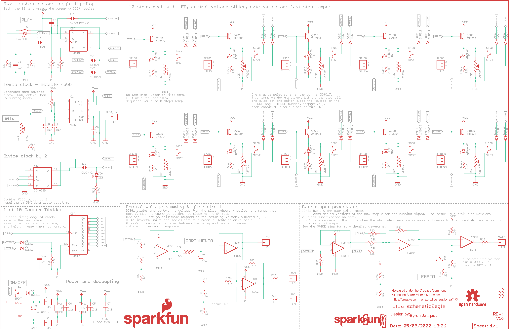
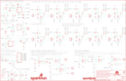

Contents
========

* [PRS12707 > Sparkfun](#prs12707--sparkfun)
	* [Schematic](#schematic)
	* [Interactive BOM](#interactive-bom)
	* [OOMP Parts](#oomp-parts)
	* [Images](#images)
	* [Tags](#tags)
  
![][im]
# PRS12707 > Sparkfun

- ID: PROJ-SPAR-12707-STAN-01
- Hex ID: PRS12707
- Name: Sparkfun
- Description: Sparkfun
- Long Link: [http://oom.lt/PROJ-SPAR-12707-STAN-01](http://oom.lt/PROJ-SPAR-12707-STAN-01)
- Short Link: [http://oom.lt/PRS12707](http://oom.lt/PRS12707)

## Schematic
  

## Interactive BOM

- Interactive BOM page: [ibom.html](https://htmlpreview.github.io/?https://github.com/oomlout/oomlout_OOMP_projects/blob/main/PROJ-SPAR-12707-STAN-01/kicad/bom/ibom.html)

## OOMP Parts
  

|OOMP Parts|
| :---: |
|BAT1,UNMATCHED-UNMATCHED-X-UNMATCHED-01,BAT1,9V,BC9VPCKIT_SOLDERMASK,BC9VPC_KIT,9V board-mount battery cradle,,,BATT-10855,,|
|C1,CAPX-UNMATCHED-X-UNMATCHED-01,C1,.1uf,0.1UF-50V-20%(PTH)KIT-EZ,CAP-PTH-SMALL-KIT,CAP-08370,,,CAP-08370,,|
|C2,CAPX-UNMATCHED-X-UF10-01,C2,10uf,10UF-25V-20%(PTH)KIT,CPOL-RADIAL-10UF-25V-KIT,CAP-08440,,,CAP-08440,,|
|C3,CAPX-UNMATCHED-X-UF10-01,C3,10uf,10UF-25V-20%(PTH)KIT,CPOL-RADIAL-10UF-25V-KIT,CAP-08440,,,CAP-08440,,|
|C4,CAPX-UNMATCHED-X-UF10-01,C4,10uf,10UF-25V-20%(PTH)KIT,CPOL-RADIAL-10UF-25V-KIT,CAP-08440,,,CAP-08440,,|
|C5,CAPX-UNMATCHED-X-UNMATCHED-01,C5,.1uf,0.1UF-50V-20%(PTH)KIT-EZ,CAP-PTH-SMALL-KIT,CAP-08370,,,CAP-08370,,|
|C6,CAPX-UNMATCHED-X-UNMATCHED-01,C6,.1uf,0.1UF-50V-20%(PTH)KIT-EZ,CAP-PTH-SMALL-KIT,CAP-08370,,,CAP-08370,,|
|C7,CAPX-UNMATCHED-X-UNMATCHED-01,C7,.1uf,0.1UF-50V-20%(PTH)KIT-EZ,CAP-PTH-SMALL-KIT,CAP-08370,,,CAP-08370,,|
|C8,CAPX-UNMATCHED-X-UNMATCHED-01,C8,.1uf,0.1UF-50V-20%(PTH)KIT-EZ,CAP-PTH-SMALL-KIT,CAP-08370,,,CAP-08370,,|
|C9,CAPX-UNMATCHED-X-UNMATCHED-01,C9,1000uf/25V,1000UF-25V(PTH)KIT,CPOL-RADIAL-1000UF-25V-KIT,CAP-08070,,,CAP-09538,1000uf/25V,|
|C10,CAPX-UNMATCHED-X-UNMATCHED-01,C10,1nf,CAPKIT,CAP-PTH-SMALL-KIT,Capacitor,,,CAP-09182,,|
|C11,CAPX-UNMATCHED-X-UNMATCHED-01,C11,.1uf,0.1UF-50V-20%(PTH)KIT-EZ,CAP-PTH-SMALL-KIT,CAP-08370,,,CAP-08370,,|
|D1,DIOD-UNMATCHED-X-UNMATCHED-01,D1,1n4148,DIODEKIT,DIODE-1N4148-KIT,Diode,,,DIO-08378,,|
|D2,DIOD-UNMATCHED-X-UNMATCHED-01,D2,1n4148,DIODEKIT,DIODE-1N4148-KIT,Diode,,,DIO-08378,,|
|D3,DIOD-UNMATCHED-X-UNMATCHED-01,D3,1N5819,DIODE,DIODE-1N4001-KIT,Diode,,,DIO-11895,,|
|D100,DIOD-UNMATCHED-X-UNMATCHED-01,D100,1N5819,DIODE,DIODE-1N4001-KIT,Diode,,,DIO-11895,,|
|D101,DIOD-UNMATCHED-X-UNMATCHED-01,D101,1N5819,DIODE,DIODE-1N4001-KIT,Diode,,,DIO-11895,,|
|D200,DIOD-UNMATCHED-X-UNMATCHED-01,D200,1N5819,DIODE,DIODE-1N4001-KIT,Diode,,,DIO-11895,,|
|D201,DIOD-UNMATCHED-X-UNMATCHED-01,D201,1N5819,DIODE,DIODE-1N4001-KIT,Diode,,,DIO-11895,,|
|D300,DIOD-UNMATCHED-X-UNMATCHED-01,D300,1N5819,DIODE,DIODE-1N4001-KIT,Diode,,,DIO-11895,,|
|D301,DIOD-UNMATCHED-X-UNMATCHED-01,D301,1N5819,DIODE,DIODE-1N4001-KIT,Diode,,,DIO-11895,,|
|D400,DIOD-UNMATCHED-X-UNMATCHED-01,D400,1N5819,DIODE,DIODE-1N4001-KIT,Diode,,,DIO-11895,,|
|D401,DIOD-UNMATCHED-X-UNMATCHED-01,D401,1N5819,DIODE,DIODE-1N4001-KIT,Diode,,,DIO-11895,,|
|D500,DIOD-UNMATCHED-X-UNMATCHED-01,D500,1N5819,DIODE,DIODE-1N4001-KIT,Diode,,,DIO-11895,,|
|D501,DIOD-UNMATCHED-X-UNMATCHED-01,D501,1N5819,DIODE,DIODE-1N4001-KIT,Diode,,,DIO-11895,,|
|D600,DIOD-UNMATCHED-X-UNMATCHED-01,D600,1N5819,DIODE,DIODE-1N4001-KIT,Diode,,,DIO-11895,,|
|D601,DIOD-UNMATCHED-X-UNMATCHED-01,D601,1N5819,DIODE,DIODE-1N4001-KIT,Diode,,,DIO-11895,,|
|D700,DIOD-UNMATCHED-X-UNMATCHED-01,D700,1N5819,DIODE,DIODE-1N4001-KIT,Diode,,,DIO-11895,,|
|D701,DIOD-UNMATCHED-X-UNMATCHED-01,D701,1N5819,DIODE,DIODE-1N4001-KIT,Diode,,,DIO-11895,,|
|D800,DIOD-UNMATCHED-X-UNMATCHED-01,D800,1N5819,DIODE,DIODE-1N4001-KIT,Diode,,,DIO-11895,,|
|D801,DIOD-UNMATCHED-X-UNMATCHED-01,D801,1N5819,DIODE,DIODE-1N4001-KIT,Diode,,,DIO-11895,,|
|D900,DIOD-UNMATCHED-X-UNMATCHED-01,D900,1N5819,DIODE,DIODE-1N4001-KIT,Diode,,,DIO-11895,,|
|D901,DIOD-UNMATCHED-X-UNMATCHED-01,D901,1N5819,DIODE,DIODE-1N4001-KIT,Diode,,,DIO-11895,,|
|D1000,DIOD-UNMATCHED-X-UNMATCHED-01,D1000,1N5819,DIODE,DIODE-1N4001-KIT,Diode,,,DIO-11895,,|
|D1001,DIOD-UNMATCHED-X-UNMATCHED-01,D1001,1N5819,DIODE,DIODE-1N4001-KIT,Diode,,,DIO-11895,,|
|IC1,UNMATCHED-UNMATCHED-X-UNMATCHED-01,FRAME1,FRAME-LEDGER,FRAME-LEDGER,CREATIVE_COMMONS,Schematic Frame,,,,,|
|IC2,UNMATCHED-UNMATCHED-X-UNMATCHED-01,IC1,7555,NE555KIT,DIP08-KIT,General purpose bipolar Timer,digikey,ICM7555IPAZ-ND,,,|
|IC3,UNMATCHED-UNMATCHED-X-UNMATCHED-01,IC2,LM358,LM358KIT,DIP08-KIT,Jellybean op-amp,,,IC-09172,,|
|IC4,UNMATCHED-UNMATCHED-X-UNMATCHED-01,IC3,LM358,LM358KIT,DIP08-KIT,Jellybean op-amp,,,IC-09172,,|
|IC5,UNMATCHED-UNMATCHED-X-UNMATCHED-01,IC4,LM358,LM358KIT,DIP08-KIT,Jellybean op-amp,,,IC-09172,,|
|IC6,UNMATCHED-UNMATCHED-X-UNMATCHED-01,IC5,CD4013B,CD4013,DIL14-KIT,Dual D-type Flip-Flop,,,IC-11930,CD4013B,|
|JP1,HEAD-I01-X-PI01-01,IC6,CD4017,CD4017KIT,DIL16-KIT,,Digikey,296-2037-5-ND,,,|
|JP2,HEAD-I01-X-PI01-01,JP1,GATE,M01SMDNS,1X01NS,Header 1,,,,,|
|JP3,HEAD-I01-X-PI01-01,JP2,CV1,M01SMDNS,1X01NS,Header 1,,,,,|
|JP4,HEAD-I01-X-PI01-01,JP3,TEMPO_CV,M01SMDNS,1X01NS,Header 1,,,,,|
|JP5,HEAD-I01-X-PI01-01,JP4,CV2,M01SMDNS,1X01NS,Header 1,,,,,|
|JP6,HEAD-I01-X-PI01-01,JP5,CV,M01SMDNS,1X01NS,Header 1,,,,,|
|JP7,HEAD-I01-X-PI01-01,JP6,VCC,M01SMDNS,1X01NS,Header 1,,,,,|
|JP100,HEAD-I01-X-PI01-01,JP7,GND,M01SMDNS,1X01NS,Header 1,,,,,|
|JP200,HEAD-I01-X-PI02-01,JP100,STEP1,M01SMDNS,1X01NS,Header 1,,,,,|
|JP300,HEAD-I01-X-PI02-01,JP200,STEP2,M021X02_NO_SILK,1X02_NO_SILK,Standard 2-pin 0.1 header. Use with,,,,,|
|JP400,HEAD-I01-X-PI02-01,JP300,STEP3,M021X02_NO_SILK,1X02_NO_SILK,Standard 2-pin 0.1 header. Use with,,,,,|
|JP500,HEAD-I01-X-PI02-01,JP400,STEP4,M021X02_NO_SILK,1X02_NO_SILK,Standard 2-pin 0.1 header. Use with,,,,,|
|JP600,HEAD-I01-X-PI02-01,JP500,STEP5,M021X02_NO_SILK,1X02_NO_SILK,Standard 2-pin 0.1 header. Use with,,,,,|
|JP700,HEAD-I01-X-PI02-01,JP600,STEP6,M021X02_NO_SILK,1X02_NO_SILK,Standard 2-pin 0.1 header. Use with,,,,,|
|JP800,HEAD-I01-X-PI02-01,JP700,STEP7,M021X02_NO_SILK,1X02_NO_SILK,Standard 2-pin 0.1 header. Use with,,,,,|
|JP900,HEAD-I01-X-PI02-01,JP800,STEP8,M021X02_NO_SILK,1X02_NO_SILK,Standard 2-pin 0.1 header. Use with,,,,,|
|JP1000,HEAD-I01-X-PI02-01,JP900,STEP9,M021X02_NO_SILK,1X02_NO_SILK,Standard 2-pin 0.1 header. Use with,,,,,|
|LED1,LEDS-UNMATCHED-G-STAN-01,JP1000,STEP10,M021X02_NO_SILK,1X02_NO_SILK,Standard 2-pin 0.1 header. Use with,,,,,|
|LED100,LEDS-UNMATCHED-G-STAN-01,LED1,RED,LED5MM-KIT,LED5MM-KIT,LEDs,,,DIO-09529,,|
|LED200,LEDS-UNMATCHED-G-STAN-01,LED100,RED,LED5MM-KIT,LED5MM-KIT,LEDs,,,DIO-09529,,|
|LED300,LEDS-UNMATCHED-G-STAN-01,LED200,RED,LED5MM-KIT,LED5MM-KIT,LEDs,,,DIO-09529,,|
|LED400,LEDS-UNMATCHED-G-STAN-01,LED300,RED,LED5MM-KIT,LED5MM-KIT,LEDs,,,DIO-09529,,|
|LED500,LEDS-UNMATCHED-G-STAN-01,LED400,RED,LED5MM-KIT,LED5MM-KIT,LEDs,,,DIO-09529,,|
|LED600,LEDS-UNMATCHED-G-STAN-01,LED500,RED,LED5MM-KIT,LED5MM-KIT,LEDs,,,DIO-09529,,|
|LED700,LEDS-UNMATCHED-G-STAN-01,LED600,RED,LED5MM-KIT,LED5MM-KIT,LEDs,,,DIO-09529,,|
|LED800,LEDS-UNMATCHED-G-STAN-01,LED700,RED,LED5MM-KIT,LED5MM-KIT,LEDs,,,DIO-09529,,|
|LED900,LEDS-UNMATCHED-G-STAN-01,LED800,RED,LED5MM-KIT,LED5MM-KIT,LEDs,,,DIO-09529,,|
|LED1000,LEDS-UNMATCHED-G-STAN-01,LED900,RED,LED5MM-KIT,LED5MM-KIT,LEDs,,,DIO-09529,,|
|Q100,UNMATCHED-UNMATCHED-X-UNMATCHED-01,LED1000,RED,LED5MM-KIT,LED5MM-KIT,LEDs,,,DIO-09529,,|
|Q200,UNMATCHED-UNMATCHED-X-UNMATCHED-01,LOGO1,SPARKPUNK_LOGO.2_INCH_TALL,SPARKPUNK_LOGO.2_INCH_TALL,SPARKPUNK_LOGO_.2,,,,,,|
|Q300,UNMATCHED-UNMATCHED-X-UNMATCHED-01,LOGO2,OSHW-LOGOM,OSHW-LOGOM,OSHW-LOGO-M,Open Source Hardware Logo This logo indicates the piece of hardware it is found on incorporates a OSHW license and/or adheres to the definition of open source hardware found here: http://freedomdefined.org/OSHW,,,,,|
|Q400,UNMATCHED-UNMATCHED-X-UNMATCHED-01,LOGO3,SPARKPUNK_LOGO.1INCH_TALL,SPARKPUNK_LOGO.1INCH_TALL,SPARKPUNK_LOGO_.1,,,,,,|
|Q500,UNMATCHED-UNMATCHED-X-UNMATCHED-01,LOGO4,SFE_LOGO_NAME_FLAME.4_INCH,SFE_LOGO_NAME_FLAME.4_INCH,SFE_LOGO_NAME_FLAME_.4,SFE Logo, name and flame,,,,,|
|Q600,UNMATCHED-UNMATCHED-X-UNMATCHED-01,Q100,2N3904,TRANSISTOR_NPNTO-92-AMMO,TO-92-AMMO,Generic NPN BJT,,,TRANS-08447,,|
|Q700,UNMATCHED-UNMATCHED-X-UNMATCHED-01,Q200,2N3904,TRANSISTOR_NPNTO-92-AMMO,TO-92-AMMO,Generic NPN BJT,,,TRANS-08447,,|
|Q800,UNMATCHED-UNMATCHED-X-UNMATCHED-01,Q300,2N3904,TRANSISTOR_NPNTO-92-AMMO,TO-92-AMMO,Generic NPN BJT,,,TRANS-08447,,|
|Q900,UNMATCHED-UNMATCHED-X-UNMATCHED-01,Q400,2N3904,TRANSISTOR_NPNTO-92-AMMO,TO-92-AMMO,Generic NPN BJT,,,TRANS-08447,,|
|Q1000,UNMATCHED-UNMATCHED-X-UNMATCHED-01,Q500,2N3904,TRANSISTOR_NPNTO-92-AMMO,TO-92-AMMO,Generic NPN BJT,,,TRANS-08447,,|
|R1,RESE-UNMATCHED-X-O471-01,Q600,2N3904,TRANSISTOR_NPNTO-92-AMMO,TO-92-AMMO,Generic NPN BJT,,,TRANS-08447,,|
|R2,RESE-UNMATCHED-X-O1003-01,Q700,2N3904,TRANSISTOR_NPNTO-92-AMMO,TO-92-AMMO,Generic NPN BJT,,,TRANS-08447,,|
|R3,RESE-UNMATCHED-X-O1003-01,Q800,2N3904,TRANSISTOR_NPNTO-92-AMMO,TO-92-AMMO,Generic NPN BJT,,,TRANS-08447,,|
|R4,RESE-UNMATCHED-X-O103-01,Q900,2N3904,TRANSISTOR_NPNTO-92-AMMO,TO-92-AMMO,Generic NPN BJT,,,TRANS-08447,,|
|R5,RESE-UNMATCHED-X-O473-01,Q1000,2N3904,TRANSISTOR_NPNTO-92-AMMO,TO-92-AMMO,Generic NPN BJT,,,TRANS-08447,,|
|R6,RESE-UNMATCHED-X-UNMATCHED-01,R1,470,RESISTOREZ,AXIAL-0.3EZ,Resistor,,,RES-10693,,|
|R7,RESE-UNMATCHED-X-O103-01,R2,100k,RESISTOREZ,AXIAL-0.3EZ,Resistor,,,RES-10686,,|
|R9,RESE-UNMATCHED-X-O102-01,R3,100k,RESISTOREZ,AXIAL-0.3EZ,Resistor,,,RES-10686,,|
|R10,RESE-UNMATCHED-X-O102-01,R4,10k,RESISTOREZ,AXIAL-0.3EZ,Resistor,,,RES-09435,,|
|R12,RESE-UNMATCHED-X-O103-01,R5,47k,RESISTOREZ,AXIAL-0.3EZ,Resistor,,,RES-10687,,|
|R13,RESE-UNMATCHED-X-O473-01,R6,2.2k,RESISTOREZ,AXIAL-0.3EZ,Resistor,,,RES-10691,,|
|R14,RESE-UNMATCHED-X-O1003-01,R7,10k,RESISTOREZ,AXIAL-0.3EZ,Resistor,,,RES-09435,,|
|R15,RESE-UNMATCHED-X-O41-01,R9,1k,RESISTOREZ,AXIAL-0.3EZ,Resistor,,,RES-08380,,|
|R16,RESE-UNMATCHED-X-O1003-01,R10,1k,RESISTOREZ,AXIAL-0.3EZ,Resistor,,,RES-08380,,|
|R17,RESE-UNMATCHED-X-O223-01,R12,10k,RESISTOREZ,AXIAL-0.3EZ,Resistor,,,RES-09435,,|
|R18,RESE-UNMATCHED-X-O223-01,R13,47k,RESISTOREZ,AXIAL-0.3EZ,Resistor,,,RES-10687,,|
|R19,RESE-UNMATCHED-X-UNMATCHED-01,R14,100k,RESISTOREZ,AXIAL-0.3EZ,Resistor,,,RES-10686,,|
|R20,RESE-UNMATCHED-X-O473-01,R15,47,RESISTOREZ,AXIAL-0.3EZ,Resistor,,,RES-10697,,|
|R21,RESE-UNMATCHED-X-O103-01,R16,100k,RESISTOREZ,AXIAL-0.3EZ,Resistor,,,RES-10686,,|
|R22,RESE-UNMATCHED-X-O102-01,R17,22k,RESISTOREZ,AXIAL-0.3EZ,Resistor,,,RES-10688,,|
|R23,RESE-UNMATCHED-X-O103-01,R18,22k,RESISTOREZ,AXIAL-0.3EZ,Resistor,,,RES-10688,,|
|R24,RESE-UNMATCHED-X-O103-01,R19,2.2k,RESISTOREZ,AXIAL-0.3EZ,Resistor,,,RES-10691,,|
|R25,RESE-UNMATCHED-X-O103-01,R20,47k,RESISTOREZ,AXIAL-0.3EZ,Resistor,,,RES-10687,,|
|R26,RESE-UNMATCHED-X-O102-01,R21,10k,RESISTOREZ,AXIAL-0.3EZ,Resistor,,,RES-09435,,|
|R27,RESE-UNMATCHED-X-O1003-01,R22,1k,RESISTOREZ,AXIAL-0.3EZ,Resistor,,,RES-08380,,|
|R28,RESE-UNMATCHED-X-O1003-01,R23,10k,RESISTOREZ,AXIAL-0.3EZ,Resistor,,,RES-09435,,|
|R29,RESE-UNMATCHED-X-O333-01,R24,10k,RESISTOREZ,AXIAL-0.3EZ,Resistor,,,RES-09435,,|
|R30,RESE-UNMATCHED-X-O223-01,R25,10k,RESISTOREZ,AXIAL-0.3EZ,Resistor,,,RES-09435,,|
|R100,RESE-UNMATCHED-X-UNMATCHED-01,R26,1k,RESISTOREZ,AXIAL-0.3EZ,Resistor,,,RES-08380,,|
|R200,RESE-UNMATCHED-X-UNMATCHED-01,R27,100k,RESISTOREZ,AXIAL-0.3EZ,Resistor,,,RES-10686,,|
|R300,RESE-UNMATCHED-X-UNMATCHED-01,R28,100k,RESISTOREZ,AXIAL-0.3EZ,Resistor,,,RES-10686,,|
|R400,RESE-UNMATCHED-X-UNMATCHED-01,R29,33k,RESISTOREZ,AXIAL-0.3EZ,Resistor,,,RES-10687,,|
|R500,RESE-UNMATCHED-X-UNMATCHED-01,R30,22k,RESISTOREZ,AXIAL-0.3EZ,Resistor,,,RES-10688,,|
|R600,RESE-UNMATCHED-X-UNMATCHED-01,R100,2.2k,RESISTOREZ,AXIAL-0.3EZ,Resistor,,,RES-10691,,|
|R700,RESE-UNMATCHED-X-UNMATCHED-01,R200,2.2k,RESISTOREZ,AXIAL-0.3EZ,Resistor,,,RES-10691,,|
|R800,RESE-UNMATCHED-X-UNMATCHED-01,R300,2.2k,RESISTOREZ,AXIAL-0.3EZ,Resistor,,,RES-10691,,|
|R900,RESE-UNMATCHED-X-UNMATCHED-01,R400,2.2k,RESISTOREZ,AXIAL-0.3EZ,Resistor,,,RES-10691,,|
|R1000,RESE-UNMATCHED-X-UNMATCHED-01,R500,2.2k,RESISTOREZ,AXIAL-0.3EZ,Resistor,,,RES-10691,,|
|RV1,UNMATCHED-UNMATCHED-X-UNMATCHED-01,R600,2.2k,RESISTOREZ,AXIAL-0.3EZ,Resistor,,,RES-10691,,|
|RV2,UNMATCHED-UNMATCHED-X-UNMATCHED-01,R700,2.2k,RESISTOREZ,AXIAL-0.3EZ,Resistor,,,RES-10691,,|
|S1,UNMATCHED-UNMATCHED-X-UNMATCHED-01,R800,2.2k,RESISTOREZ,AXIAL-0.3EZ,Resistor,,,RES-10691,,|
|S3,UNMATCHED-UNMATCHED-X-UNMATCHED-01,R900,2.2k,RESISTOREZ,AXIAL-0.3EZ,Resistor,,,RES-10691,,|
|S5,UNMATCHED-UNMATCHED-X-UNMATCHED-01,R1000,2.2k,RESISTOREZ,AXIAL-0.3EZ,Resistor,,,RES-10691,,|
|S100,UNMATCHED-UNMATCHED-X-UNMATCHED-01,RV1,10k,POTALPS-KIT,ALPS_POT_KIT,,,,RES-09177,,|
|S200,UNMATCHED-UNMATCHED-X-UNMATCHED-01,RV2,10k,POTALPS-KIT,ALPS_POT_KIT,,,,RES-09177,,|
|S300,UNMATCHED-UNMATCHED-X-UNMATCHED-01,S1,SPDT,SWITCH-SPDTKIT,SWITCH-SPDT_KIT,SPDT Switch,,,SWCH-08261,,|
|S400,UNMATCHED-UNMATCHED-X-UNMATCHED-01,S3,Play Button,SWITCH-MOMENTARY-LEDEZ,TACTILE-PTH-LED-12MM-EZ,EZ is for Kits. There is no tStop (covering up the top side of the pads with mask). This helps the beginner see which side they should be soldering too.,,,SWCH-11758,,|
|S500,UNMATCHED-UNMATCHED-X-UNMATCHED-01,S5,SPDT,SWITCH-SPDTKIT,SWITCH-SPDT_KIT,SPDT Switch,,,SWCH-08261,,|
|S600,UNMATCHED-UNMATCHED-X-UNMATCHED-01,S100,SPDT,SWITCH-SPDTKIT,SWITCH-SPDT_KIT,SPDT Switch,,,SWCH-08261,,|
|S700,UNMATCHED-UNMATCHED-X-UNMATCHED-01,S200,SPDT,SWITCH-SPDTKIT,SWITCH-SPDT_KIT,SPDT Switch,,,SWCH-08261,,|
|S800,UNMATCHED-UNMATCHED-X-UNMATCHED-01,S300,SPDT,SWITCH-SPDTKIT,SWITCH-SPDT_KIT,SPDT Switch,,,SWCH-08261,,|
|S900,UNMATCHED-UNMATCHED-X-UNMATCHED-01,S400,SPDT,SWITCH-SPDTKIT,SWITCH-SPDT_KIT,SPDT Switch,,,SWCH-08261,,|
|S1000,UNMATCHED-UNMATCHED-X-UNMATCHED-01,S500,SPDT,SWITCH-SPDTKIT,SWITCH-SPDT_KIT,SPDT Switch,,,SWCH-08261,,|
|VR100,UNMATCHED-UNMATCHED-X-UNMATCHED-01,S600,SPDT,SWITCH-SPDTKIT,SWITCH-SPDT_KIT,SPDT Switch,,,SWCH-08261,,|
|VR200,UNMATCHED-UNMATCHED-X-UNMATCHED-01,S700,SPDT,SWITCH-SPDTKIT,SWITCH-SPDT_KIT,SPDT Switch,,,SWCH-08261,,|
|VR300,UNMATCHED-UNMATCHED-X-UNMATCHED-01,S800,SPDT,SWITCH-SPDTKIT,SWITCH-SPDT_KIT,SPDT Switch,,,SWCH-08261,,|
|VR400,UNMATCHED-UNMATCHED-X-UNMATCHED-01,S900,SPDT,SWITCH-SPDTKIT,SWITCH-SPDT_KIT,SPDT Switch,,,SWCH-08261,,|
|VR500,UNMATCHED-UNMATCHED-X-UNMATCHED-01,S1000,SPDT,SWITCH-SPDTKIT,SWITCH-SPDT_KIT,SPDT Switch,,,SWCH-08261,,|
|VR600,UNMATCHED-UNMATCHED-X-UNMATCHED-01,SJ1,RUN-N.C.,SOLDERJUMPERTRACE-PTH,SJ_2S-TRACE-PTH,Solder Jumper,,,,,|
|VR700,UNMATCHED-UNMATCHED-X-UNMATCHED-01,SJ2,STOP-N.C.,SOLDERJUMPERTRACE-PTH,SJ_2S-TRACE-PTH,Solder Jumper,,,,,|
|VR800,UNMATCHED-UNMATCHED-X-UNMATCHED-01,SJ3,CLK-N.C.,SOLDERJUMPERTRACE-PTH,SJ_2S-TRACE-PTH,Solder Jumper,,,,,|
|VR900,UNMATCHED-UNMATCHED-X-UNMATCHED-01,SJ4,BTN-N.C.,SOLDERJUMPERTRACE-PTH,SJ_2S-TRACE-PTH,Solder Jumper,,,,,|
|VR1000,UNMATCHED-UNMATCHED-X-UNMATCHED-01,SJ5,ONE-SHOT-N.O.,SOLDERJUMPERPTH,SJ_2S-PTH,Solder Jumper,,,,,|

## Images
  
  

|kicadPcb3d|kicadPcb3dFront|kicadPcb3dBack|eagleImage|eagleSchemImage|
| :---: | :---: | :---: | :---: | :---: |
||||||

## Tags

- hexID: PRS12707
- oompType: PROJ
- oompSize: SPAR
- oompColor: 12707
- oompDesc: STAN
- oompIndex: 01
- oompName: Sparkpunk Sequencer
- sources: All source files from https://github.com/sparkfun/Sparkpunk_Sequencer (source licence details in srcLicense.md)
- linkBuyPage: https://www.sparkfun.com/products/12707
- oompID: PROJ-SPAR-12707-STAN-01
- oompParts: BAT1,UNMATCHED-UNMATCHED-X-UNMATCHED-01
- oompParts: C1,CAPX-UNMATCHED-X-UNMATCHED-01
- oompParts: C2,CAPX-UNMATCHED-X-UF10-01
- oompParts: C3,CAPX-UNMATCHED-X-UF10-01
- oompParts: C4,CAPX-UNMATCHED-X-UF10-01
- oompParts: C5,CAPX-UNMATCHED-X-UNMATCHED-01
- oompParts: C6,CAPX-UNMATCHED-X-UNMATCHED-01
- oompParts: C7,CAPX-UNMATCHED-X-UNMATCHED-01
- oompParts: C8,CAPX-UNMATCHED-X-UNMATCHED-01
- oompParts: C9,CAPX-UNMATCHED-X-UNMATCHED-01
- oompParts: C10,CAPX-UNMATCHED-X-UNMATCHED-01
- oompParts: C11,CAPX-UNMATCHED-X-UNMATCHED-01
- oompParts: D1,DIOD-UNMATCHED-X-UNMATCHED-01
- oompParts: D2,DIOD-UNMATCHED-X-UNMATCHED-01
- oompParts: D3,DIOD-UNMATCHED-X-UNMATCHED-01
- oompParts: D100,DIOD-UNMATCHED-X-UNMATCHED-01
- oompParts: D101,DIOD-UNMATCHED-X-UNMATCHED-01
- oompParts: D200,DIOD-UNMATCHED-X-UNMATCHED-01
- oompParts: D201,DIOD-UNMATCHED-X-UNMATCHED-01
- oompParts: D300,DIOD-UNMATCHED-X-UNMATCHED-01
- oompParts: D301,DIOD-UNMATCHED-X-UNMATCHED-01
- oompParts: D400,DIOD-UNMATCHED-X-UNMATCHED-01
- oompParts: D401,DIOD-UNMATCHED-X-UNMATCHED-01
- oompParts: D500,DIOD-UNMATCHED-X-UNMATCHED-01
- oompParts: D501,DIOD-UNMATCHED-X-UNMATCHED-01
- oompParts: D600,DIOD-UNMATCHED-X-UNMATCHED-01
- oompParts: D601,DIOD-UNMATCHED-X-UNMATCHED-01
- oompParts: D700,DIOD-UNMATCHED-X-UNMATCHED-01
- oompParts: D701,DIOD-UNMATCHED-X-UNMATCHED-01
- oompParts: D800,DIOD-UNMATCHED-X-UNMATCHED-01
- oompParts: D801,DIOD-UNMATCHED-X-UNMATCHED-01
- oompParts: D900,DIOD-UNMATCHED-X-UNMATCHED-01
- oompParts: D901,DIOD-UNMATCHED-X-UNMATCHED-01
- oompParts: D1000,DIOD-UNMATCHED-X-UNMATCHED-01
- oompParts: D1001,DIOD-UNMATCHED-X-UNMATCHED-01
- oompParts: IC1,UNMATCHED-UNMATCHED-X-UNMATCHED-01
- oompParts: IC2,UNMATCHED-UNMATCHED-X-UNMATCHED-01
- oompParts: IC3,UNMATCHED-UNMATCHED-X-UNMATCHED-01
- oompParts: IC4,UNMATCHED-UNMATCHED-X-UNMATCHED-01
- oompParts: IC5,UNMATCHED-UNMATCHED-X-UNMATCHED-01
- oompParts: IC6,UNMATCHED-UNMATCHED-X-UNMATCHED-01
- oompParts: JP1,HEAD-I01-X-PI01-01
- oompParts: JP2,HEAD-I01-X-PI01-01
- oompParts: JP3,HEAD-I01-X-PI01-01
- oompParts: JP4,HEAD-I01-X-PI01-01
- oompParts: JP5,HEAD-I01-X-PI01-01
- oompParts: JP6,HEAD-I01-X-PI01-01
- oompParts: JP7,HEAD-I01-X-PI01-01
- oompParts: JP100,HEAD-I01-X-PI01-01
- oompParts: JP200,HEAD-I01-X-PI02-01
- oompParts: JP300,HEAD-I01-X-PI02-01
- oompParts: JP400,HEAD-I01-X-PI02-01
- oompParts: JP500,HEAD-I01-X-PI02-01
- oompParts: JP600,HEAD-I01-X-PI02-01
- oompParts: JP700,HEAD-I01-X-PI02-01
- oompParts: JP800,HEAD-I01-X-PI02-01
- oompParts: JP900,HEAD-I01-X-PI02-01
- oompParts: JP1000,HEAD-I01-X-PI02-01
- oompParts: LED1,LEDS-UNMATCHED-G-STAN-01
- oompParts: LED100,LEDS-UNMATCHED-G-STAN-01
- oompParts: LED200,LEDS-UNMATCHED-G-STAN-01
- oompParts: LED300,LEDS-UNMATCHED-G-STAN-01
- oompParts: LED400,LEDS-UNMATCHED-G-STAN-01
- oompParts: LED500,LEDS-UNMATCHED-G-STAN-01
- oompParts: LED600,LEDS-UNMATCHED-G-STAN-01
- oompParts: LED700,LEDS-UNMATCHED-G-STAN-01
- oompParts: LED800,LEDS-UNMATCHED-G-STAN-01
- oompParts: LED900,LEDS-UNMATCHED-G-STAN-01
- oompParts: LED1000,LEDS-UNMATCHED-G-STAN-01
- oompParts: Q100,UNMATCHED-UNMATCHED-X-UNMATCHED-01
- oompParts: Q200,UNMATCHED-UNMATCHED-X-UNMATCHED-01
- oompParts: Q300,UNMATCHED-UNMATCHED-X-UNMATCHED-01
- oompParts: Q400,UNMATCHED-UNMATCHED-X-UNMATCHED-01
- oompParts: Q500,UNMATCHED-UNMATCHED-X-UNMATCHED-01
- oompParts: Q600,UNMATCHED-UNMATCHED-X-UNMATCHED-01
- oompParts: Q700,UNMATCHED-UNMATCHED-X-UNMATCHED-01
- oompParts: Q800,UNMATCHED-UNMATCHED-X-UNMATCHED-01
- oompParts: Q900,UNMATCHED-UNMATCHED-X-UNMATCHED-01
- oompParts: Q1000,UNMATCHED-UNMATCHED-X-UNMATCHED-01
- oompParts: R1,RESE-UNMATCHED-X-O471-01
- oompParts: R2,RESE-UNMATCHED-X-O1003-01
- oompParts: R3,RESE-UNMATCHED-X-O1003-01
- oompParts: R4,RESE-UNMATCHED-X-O103-01
- oompParts: R5,RESE-UNMATCHED-X-O473-01
- oompParts: R6,RESE-UNMATCHED-X-UNMATCHED-01
- oompParts: R7,RESE-UNMATCHED-X-O103-01
- oompParts: R9,RESE-UNMATCHED-X-O102-01
- oompParts: R10,RESE-UNMATCHED-X-O102-01
- oompParts: R12,RESE-UNMATCHED-X-O103-01
- oompParts: R13,RESE-UNMATCHED-X-O473-01
- oompParts: R14,RESE-UNMATCHED-X-O1003-01
- oompParts: R15,RESE-UNMATCHED-X-O41-01
- oompParts: R16,RESE-UNMATCHED-X-O1003-01
- oompParts: R17,RESE-UNMATCHED-X-O223-01
- oompParts: R18,RESE-UNMATCHED-X-O223-01
- oompParts: R19,RESE-UNMATCHED-X-UNMATCHED-01
- oompParts: R20,RESE-UNMATCHED-X-O473-01
- oompParts: R21,RESE-UNMATCHED-X-O103-01
- oompParts: R22,RESE-UNMATCHED-X-O102-01
- oompParts: R23,RESE-UNMATCHED-X-O103-01
- oompParts: R24,RESE-UNMATCHED-X-O103-01
- oompParts: R25,RESE-UNMATCHED-X-O103-01
- oompParts: R26,RESE-UNMATCHED-X-O102-01
- oompParts: R27,RESE-UNMATCHED-X-O1003-01
- oompParts: R28,RESE-UNMATCHED-X-O1003-01
- oompParts: R29,RESE-UNMATCHED-X-O333-01
- oompParts: R30,RESE-UNMATCHED-X-O223-01
- oompParts: R100,RESE-UNMATCHED-X-UNMATCHED-01
- oompParts: R200,RESE-UNMATCHED-X-UNMATCHED-01
- oompParts: R300,RESE-UNMATCHED-X-UNMATCHED-01
- oompParts: R400,RESE-UNMATCHED-X-UNMATCHED-01
- oompParts: R500,RESE-UNMATCHED-X-UNMATCHED-01
- oompParts: R600,RESE-UNMATCHED-X-UNMATCHED-01
- oompParts: R700,RESE-UNMATCHED-X-UNMATCHED-01
- oompParts: R800,RESE-UNMATCHED-X-UNMATCHED-01
- oompParts: R900,RESE-UNMATCHED-X-UNMATCHED-01
- oompParts: R1000,RESE-UNMATCHED-X-UNMATCHED-01
- oompParts: RV1,UNMATCHED-UNMATCHED-X-UNMATCHED-01
- oompParts: RV2,UNMATCHED-UNMATCHED-X-UNMATCHED-01
- oompParts: S1,UNMATCHED-UNMATCHED-X-UNMATCHED-01
- oompParts: S3,UNMATCHED-UNMATCHED-X-UNMATCHED-01
- oompParts: S5,UNMATCHED-UNMATCHED-X-UNMATCHED-01
- oompParts: S100,UNMATCHED-UNMATCHED-X-UNMATCHED-01
- oompParts: S200,UNMATCHED-UNMATCHED-X-UNMATCHED-01
- oompParts: S300,UNMATCHED-UNMATCHED-X-UNMATCHED-01
- oompParts: S400,UNMATCHED-UNMATCHED-X-UNMATCHED-01
- oompParts: S500,UNMATCHED-UNMATCHED-X-UNMATCHED-01
- oompParts: S600,UNMATCHED-UNMATCHED-X-UNMATCHED-01
- oompParts: S700,UNMATCHED-UNMATCHED-X-UNMATCHED-01
- oompParts: S800,UNMATCHED-UNMATCHED-X-UNMATCHED-01
- oompParts: S900,UNMATCHED-UNMATCHED-X-UNMATCHED-01
- oompParts: S1000,UNMATCHED-UNMATCHED-X-UNMATCHED-01
- oompParts: VR100,UNMATCHED-UNMATCHED-X-UNMATCHED-01
- oompParts: VR200,UNMATCHED-UNMATCHED-X-UNMATCHED-01
- oompParts: VR300,UNMATCHED-UNMATCHED-X-UNMATCHED-01
- oompParts: VR400,UNMATCHED-UNMATCHED-X-UNMATCHED-01
- oompParts: VR500,UNMATCHED-UNMATCHED-X-UNMATCHED-01
- oompParts: VR600,UNMATCHED-UNMATCHED-X-UNMATCHED-01
- oompParts: VR700,UNMATCHED-UNMATCHED-X-UNMATCHED-01
- oompParts: VR800,UNMATCHED-UNMATCHED-X-UNMATCHED-01
- oompParts: VR900,UNMATCHED-UNMATCHED-X-UNMATCHED-01
- oompParts: VR1000,UNMATCHED-UNMATCHED-X-UNMATCHED-01
- rawParts: BAT1,9V,BC9VPCKIT_SOLDERMASK,BC9VPC_KIT,9V board-mount battery cradle,,,BATT-10855,,
- rawParts: C1,.1uf,0.1UF-50V-20%(PTH)KIT-EZ,CAP-PTH-SMALL-KIT,CAP-08370,,,CAP-08370,,
- rawParts: C2,10uf,10UF-25V-20%(PTH)KIT,CPOL-RADIAL-10UF-25V-KIT,CAP-08440,,,CAP-08440,,
- rawParts: C3,10uf,10UF-25V-20%(PTH)KIT,CPOL-RADIAL-10UF-25V-KIT,CAP-08440,,,CAP-08440,,
- rawParts: C4,10uf,10UF-25V-20%(PTH)KIT,CPOL-RADIAL-10UF-25V-KIT,CAP-08440,,,CAP-08440,,
- rawParts: C5,.1uf,0.1UF-50V-20%(PTH)KIT-EZ,CAP-PTH-SMALL-KIT,CAP-08370,,,CAP-08370,,
- rawParts: C6,.1uf,0.1UF-50V-20%(PTH)KIT-EZ,CAP-PTH-SMALL-KIT,CAP-08370,,,CAP-08370,,
- rawParts: C7,.1uf,0.1UF-50V-20%(PTH)KIT-EZ,CAP-PTH-SMALL-KIT,CAP-08370,,,CAP-08370,,
- rawParts: C8,.1uf,0.1UF-50V-20%(PTH)KIT-EZ,CAP-PTH-SMALL-KIT,CAP-08370,,,CAP-08370,,
- rawParts: C9,1000uf/25V,1000UF-25V(PTH)KIT,CPOL-RADIAL-1000UF-25V-KIT,CAP-08070,,,CAP-09538,1000uf/25V,
- rawParts: C10,1nf,CAPKIT,CAP-PTH-SMALL-KIT,Capacitor,,,CAP-09182,,
- rawParts: C11,.1uf,0.1UF-50V-20%(PTH)KIT-EZ,CAP-PTH-SMALL-KIT,CAP-08370,,,CAP-08370,,
- rawParts: D1,1n4148,DIODEKIT,DIODE-1N4148-KIT,Diode,,,DIO-08378,,
- rawParts: D2,1n4148,DIODEKIT,DIODE-1N4148-KIT,Diode,,,DIO-08378,,
- rawParts: D3,1N5819,DIODE,DIODE-1N4001-KIT,Diode,,,DIO-11895,,
- rawParts: D100,1N5819,DIODE,DIODE-1N4001-KIT,Diode,,,DIO-11895,,
- rawParts: D101,1N5819,DIODE,DIODE-1N4001-KIT,Diode,,,DIO-11895,,
- rawParts: D200,1N5819,DIODE,DIODE-1N4001-KIT,Diode,,,DIO-11895,,
- rawParts: D201,1N5819,DIODE,DIODE-1N4001-KIT,Diode,,,DIO-11895,,
- rawParts: D300,1N5819,DIODE,DIODE-1N4001-KIT,Diode,,,DIO-11895,,
- rawParts: D301,1N5819,DIODE,DIODE-1N4001-KIT,Diode,,,DIO-11895,,
- rawParts: D400,1N5819,DIODE,DIODE-1N4001-KIT,Diode,,,DIO-11895,,
- rawParts: D401,1N5819,DIODE,DIODE-1N4001-KIT,Diode,,,DIO-11895,,
- rawParts: D500,1N5819,DIODE,DIODE-1N4001-KIT,Diode,,,DIO-11895,,
- rawParts: D501,1N5819,DIODE,DIODE-1N4001-KIT,Diode,,,DIO-11895,,
- rawParts: D600,1N5819,DIODE,DIODE-1N4001-KIT,Diode,,,DIO-11895,,
- rawParts: D601,1N5819,DIODE,DIODE-1N4001-KIT,Diode,,,DIO-11895,,
- rawParts: D700,1N5819,DIODE,DIODE-1N4001-KIT,Diode,,,DIO-11895,,
- rawParts: D701,1N5819,DIODE,DIODE-1N4001-KIT,Diode,,,DIO-11895,,
- rawParts: D800,1N5819,DIODE,DIODE-1N4001-KIT,Diode,,,DIO-11895,,
- rawParts: D801,1N5819,DIODE,DIODE-1N4001-KIT,Diode,,,DIO-11895,,
- rawParts: D900,1N5819,DIODE,DIODE-1N4001-KIT,Diode,,,DIO-11895,,
- rawParts: D901,1N5819,DIODE,DIODE-1N4001-KIT,Diode,,,DIO-11895,,
- rawParts: D1000,1N5819,DIODE,DIODE-1N4001-KIT,Diode,,,DIO-11895,,
- rawParts: D1001,1N5819,DIODE,DIODE-1N4001-KIT,Diode,,,DIO-11895,,
- rawParts: FRAME1,FRAME-LEDGER,FRAME-LEDGER,CREATIVE_COMMONS,Schematic Frame,,,,,
- rawParts: IC1,7555,NE555KIT,DIP08-KIT,General purpose bipolar Timer,digikey,ICM7555IPAZ-ND,,,
- rawParts: IC2,LM358,LM358KIT,DIP08-KIT,Jellybean op-amp,,,IC-09172,,
- rawParts: IC3,LM358,LM358KIT,DIP08-KIT,Jellybean op-amp,,,IC-09172,,
- rawParts: IC4,LM358,LM358KIT,DIP08-KIT,Jellybean op-amp,,,IC-09172,,
- rawParts: IC5,CD4013B,CD4013,DIL14-KIT,Dual D-type Flip-Flop,,,IC-11930,CD4013B,
- rawParts: IC6,CD4017,CD4017KIT,DIL16-KIT,,Digikey,296-2037-5-ND,,,
- rawParts: JP1,GATE,M01SMDNS,1X01NS,Header 1,,,,,
- rawParts: JP2,CV1,M01SMDNS,1X01NS,Header 1,,,,,
- rawParts: JP3,TEMPO_CV,M01SMDNS,1X01NS,Header 1,,,,,
- rawParts: JP4,CV2,M01SMDNS,1X01NS,Header 1,,,,,
- rawParts: JP5,CV,M01SMDNS,1X01NS,Header 1,,,,,
- rawParts: JP6,VCC,M01SMDNS,1X01NS,Header 1,,,,,
- rawParts: JP7,GND,M01SMDNS,1X01NS,Header 1,,,,,
- rawParts: JP100,STEP1,M01SMDNS,1X01NS,Header 1,,,,,
- rawParts: JP200,STEP2,M021X02_NO_SILK,1X02_NO_SILK,Standard 2-pin 0.1 header. Use with,,,,,
- rawParts: JP300,STEP3,M021X02_NO_SILK,1X02_NO_SILK,Standard 2-pin 0.1 header. Use with,,,,,
- rawParts: JP400,STEP4,M021X02_NO_SILK,1X02_NO_SILK,Standard 2-pin 0.1 header. Use with,,,,,
- rawParts: JP500,STEP5,M021X02_NO_SILK,1X02_NO_SILK,Standard 2-pin 0.1 header. Use with,,,,,
- rawParts: JP600,STEP6,M021X02_NO_SILK,1X02_NO_SILK,Standard 2-pin 0.1 header. Use with,,,,,
- rawParts: JP700,STEP7,M021X02_NO_SILK,1X02_NO_SILK,Standard 2-pin 0.1 header. Use with,,,,,
- rawParts: JP800,STEP8,M021X02_NO_SILK,1X02_NO_SILK,Standard 2-pin 0.1 header. Use with,,,,,
- rawParts: JP900,STEP9,M021X02_NO_SILK,1X02_NO_SILK,Standard 2-pin 0.1 header. Use with,,,,,
- rawParts: JP1000,STEP10,M021X02_NO_SILK,1X02_NO_SILK,Standard 2-pin 0.1 header. Use with,,,,,
- rawParts: LED1,RED,LED5MM-KIT,LED5MM-KIT,LEDs,,,DIO-09529,,
- rawParts: LED100,RED,LED5MM-KIT,LED5MM-KIT,LEDs,,,DIO-09529,,
- rawParts: LED200,RED,LED5MM-KIT,LED5MM-KIT,LEDs,,,DIO-09529,,
- rawParts: LED300,RED,LED5MM-KIT,LED5MM-KIT,LEDs,,,DIO-09529,,
- rawParts: LED400,RED,LED5MM-KIT,LED5MM-KIT,LEDs,,,DIO-09529,,
- rawParts: LED500,RED,LED5MM-KIT,LED5MM-KIT,LEDs,,,DIO-09529,,
- rawParts: LED600,RED,LED5MM-KIT,LED5MM-KIT,LEDs,,,DIO-09529,,
- rawParts: LED700,RED,LED5MM-KIT,LED5MM-KIT,LEDs,,,DIO-09529,,
- rawParts: LED800,RED,LED5MM-KIT,LED5MM-KIT,LEDs,,,DIO-09529,,
- rawParts: LED900,RED,LED5MM-KIT,LED5MM-KIT,LEDs,,,DIO-09529,,
- rawParts: LED1000,RED,LED5MM-KIT,LED5MM-KIT,LEDs,,,DIO-09529,,
- rawParts: LOGO1,SPARKPUNK_LOGO.2_INCH_TALL,SPARKPUNK_LOGO.2_INCH_TALL,SPARKPUNK_LOGO_.2,,,,,,
- rawParts: LOGO2,OSHW-LOGOM,OSHW-LOGOM,OSHW-LOGO-M,Open Source Hardware Logo This logo indicates the piece of hardware it is found on incorporates a OSHW license and/or adheres to the definition of open source hardware found here: http://freedomdefined.org/OSHW,,,,,
- rawParts: LOGO3,SPARKPUNK_LOGO.1INCH_TALL,SPARKPUNK_LOGO.1INCH_TALL,SPARKPUNK_LOGO_.1,,,,,,
- rawParts: LOGO4,SFE_LOGO_NAME_FLAME.4_INCH,SFE_LOGO_NAME_FLAME.4_INCH,SFE_LOGO_NAME_FLAME_.4,SFE Logo, name and flame,,,,,
- rawParts: Q100,2N3904,TRANSISTOR_NPNTO-92-AMMO,TO-92-AMMO,Generic NPN BJT,,,TRANS-08447,,
- rawParts: Q200,2N3904,TRANSISTOR_NPNTO-92-AMMO,TO-92-AMMO,Generic NPN BJT,,,TRANS-08447,,
- rawParts: Q300,2N3904,TRANSISTOR_NPNTO-92-AMMO,TO-92-AMMO,Generic NPN BJT,,,TRANS-08447,,
- rawParts: Q400,2N3904,TRANSISTOR_NPNTO-92-AMMO,TO-92-AMMO,Generic NPN BJT,,,TRANS-08447,,
- rawParts: Q500,2N3904,TRANSISTOR_NPNTO-92-AMMO,TO-92-AMMO,Generic NPN BJT,,,TRANS-08447,,
- rawParts: Q600,2N3904,TRANSISTOR_NPNTO-92-AMMO,TO-92-AMMO,Generic NPN BJT,,,TRANS-08447,,
- rawParts: Q700,2N3904,TRANSISTOR_NPNTO-92-AMMO,TO-92-AMMO,Generic NPN BJT,,,TRANS-08447,,
- rawParts: Q800,2N3904,TRANSISTOR_NPNTO-92-AMMO,TO-92-AMMO,Generic NPN BJT,,,TRANS-08447,,
- rawParts: Q900,2N3904,TRANSISTOR_NPNTO-92-AMMO,TO-92-AMMO,Generic NPN BJT,,,TRANS-08447,,
- rawParts: Q1000,2N3904,TRANSISTOR_NPNTO-92-AMMO,TO-92-AMMO,Generic NPN BJT,,,TRANS-08447,,
- rawParts: R1,470,RESISTOREZ,AXIAL-0.3EZ,Resistor,,,RES-10693,,
- rawParts: R2,100k,RESISTOREZ,AXIAL-0.3EZ,Resistor,,,RES-10686,,
- rawParts: R3,100k,RESISTOREZ,AXIAL-0.3EZ,Resistor,,,RES-10686,,
- rawParts: R4,10k,RESISTOREZ,AXIAL-0.3EZ,Resistor,,,RES-09435,,
- rawParts: R5,47k,RESISTOREZ,AXIAL-0.3EZ,Resistor,,,RES-10687,,
- rawParts: R6,2.2k,RESISTOREZ,AXIAL-0.3EZ,Resistor,,,RES-10691,,
- rawParts: R7,10k,RESISTOREZ,AXIAL-0.3EZ,Resistor,,,RES-09435,,
- rawParts: R9,1k,RESISTOREZ,AXIAL-0.3EZ,Resistor,,,RES-08380,,
- rawParts: R10,1k,RESISTOREZ,AXIAL-0.3EZ,Resistor,,,RES-08380,,
- rawParts: R12,10k,RESISTOREZ,AXIAL-0.3EZ,Resistor,,,RES-09435,,
- rawParts: R13,47k,RESISTOREZ,AXIAL-0.3EZ,Resistor,,,RES-10687,,
- rawParts: R14,100k,RESISTOREZ,AXIAL-0.3EZ,Resistor,,,RES-10686,,
- rawParts: R15,47,RESISTOREZ,AXIAL-0.3EZ,Resistor,,,RES-10697,,
- rawParts: R16,100k,RESISTOREZ,AXIAL-0.3EZ,Resistor,,,RES-10686,,
- rawParts: R17,22k,RESISTOREZ,AXIAL-0.3EZ,Resistor,,,RES-10688,,
- rawParts: R18,22k,RESISTOREZ,AXIAL-0.3EZ,Resistor,,,RES-10688,,
- rawParts: R19,2.2k,RESISTOREZ,AXIAL-0.3EZ,Resistor,,,RES-10691,,
- rawParts: R20,47k,RESISTOREZ,AXIAL-0.3EZ,Resistor,,,RES-10687,,
- rawParts: R21,10k,RESISTOREZ,AXIAL-0.3EZ,Resistor,,,RES-09435,,
- rawParts: R22,1k,RESISTOREZ,AXIAL-0.3EZ,Resistor,,,RES-08380,,
- rawParts: R23,10k,RESISTOREZ,AXIAL-0.3EZ,Resistor,,,RES-09435,,
- rawParts: R24,10k,RESISTOREZ,AXIAL-0.3EZ,Resistor,,,RES-09435,,
- rawParts: R25,10k,RESISTOREZ,AXIAL-0.3EZ,Resistor,,,RES-09435,,
- rawParts: R26,1k,RESISTOREZ,AXIAL-0.3EZ,Resistor,,,RES-08380,,
- rawParts: R27,100k,RESISTOREZ,AXIAL-0.3EZ,Resistor,,,RES-10686,,
- rawParts: R28,100k,RESISTOREZ,AXIAL-0.3EZ,Resistor,,,RES-10686,,
- rawParts: R29,33k,RESISTOREZ,AXIAL-0.3EZ,Resistor,,,RES-10687,,
- rawParts: R30,22k,RESISTOREZ,AXIAL-0.3EZ,Resistor,,,RES-10688,,
- rawParts: R100,2.2k,RESISTOREZ,AXIAL-0.3EZ,Resistor,,,RES-10691,,
- rawParts: R200,2.2k,RESISTOREZ,AXIAL-0.3EZ,Resistor,,,RES-10691,,
- rawParts: R300,2.2k,RESISTOREZ,AXIAL-0.3EZ,Resistor,,,RES-10691,,
- rawParts: R400,2.2k,RESISTOREZ,AXIAL-0.3EZ,Resistor,,,RES-10691,,
- rawParts: R500,2.2k,RESISTOREZ,AXIAL-0.3EZ,Resistor,,,RES-10691,,
- rawParts: R600,2.2k,RESISTOREZ,AXIAL-0.3EZ,Resistor,,,RES-10691,,
- rawParts: R700,2.2k,RESISTOREZ,AXIAL-0.3EZ,Resistor,,,RES-10691,,
- rawParts: R800,2.2k,RESISTOREZ,AXIAL-0.3EZ,Resistor,,,RES-10691,,
- rawParts: R900,2.2k,RESISTOREZ,AXIAL-0.3EZ,Resistor,,,RES-10691,,
- rawParts: R1000,2.2k,RESISTOREZ,AXIAL-0.3EZ,Resistor,,,RES-10691,,
- rawParts: RV1,10k,POTALPS-KIT,ALPS_POT_KIT,,,,RES-09177,,
- rawParts: RV2,10k,POTALPS-KIT,ALPS_POT_KIT,,,,RES-09177,,
- rawParts: S1,SPDT,SWITCH-SPDTKIT,SWITCH-SPDT_KIT,SPDT Switch,,,SWCH-08261,,
- rawParts: S3,Play Button,SWITCH-MOMENTARY-LEDEZ,TACTILE-PTH-LED-12MM-EZ,EZ is for Kits. There is no tStop (covering up the top side of the pads with mask). This helps the beginner see which side they should be soldering too.,,,SWCH-11758,,
- rawParts: S5,SPDT,SWITCH-SPDTKIT,SWITCH-SPDT_KIT,SPDT Switch,,,SWCH-08261,,
- rawParts: S100,SPDT,SWITCH-SPDTKIT,SWITCH-SPDT_KIT,SPDT Switch,,,SWCH-08261,,
- rawParts: S200,SPDT,SWITCH-SPDTKIT,SWITCH-SPDT_KIT,SPDT Switch,,,SWCH-08261,,
- rawParts: S300,SPDT,SWITCH-SPDTKIT,SWITCH-SPDT_KIT,SPDT Switch,,,SWCH-08261,,
- rawParts: S400,SPDT,SWITCH-SPDTKIT,SWITCH-SPDT_KIT,SPDT Switch,,,SWCH-08261,,
- rawParts: S500,SPDT,SWITCH-SPDTKIT,SWITCH-SPDT_KIT,SPDT Switch,,,SWCH-08261,,
- rawParts: S600,SPDT,SWITCH-SPDTKIT,SWITCH-SPDT_KIT,SPDT Switch,,,SWCH-08261,,
- rawParts: S700,SPDT,SWITCH-SPDTKIT,SWITCH-SPDT_KIT,SPDT Switch,,,SWCH-08261,,
- rawParts: S800,SPDT,SWITCH-SPDTKIT,SWITCH-SPDT_KIT,SPDT Switch,,,SWCH-08261,,
- rawParts: S900,SPDT,SWITCH-SPDTKIT,SWITCH-SPDT_KIT,SPDT Switch,,,SWCH-08261,,
- rawParts: S1000,SPDT,SWITCH-SPDTKIT,SWITCH-SPDT_KIT,SPDT Switch,,,SWCH-08261,,
- rawParts: SJ1,RUN-N.C.,SOLDERJUMPERTRACE-PTH,SJ_2S-TRACE-PTH,Solder Jumper,,,,,
- rawParts: SJ2,STOP-N.C.,SOLDERJUMPERTRACE-PTH,SJ_2S-TRACE-PTH,Solder Jumper,,,,,
- rawParts: SJ3,CLK-N.C.,SOLDERJUMPERTRACE-PTH,SJ_2S-TRACE-PTH,Solder Jumper,,,,,
- rawParts: SJ4,BTN-N.C.,SOLDERJUMPERTRACE-PTH,SJ_2S-TRACE-PTH,Solder Jumper,,,,,
- rawParts: SJ5,ONE-SHOT-N.O.,SOLDERJUMPERPTH,SJ_2S-PTH,Solder Jumper,,,,,
- rawParts: STANDOFF1,STAND-OFF,STAND-OFF,STAND-OFF,#4 Stand Off,,,,,
- rawParts: STANDOFF2,STAND-OFF,STAND-OFF,STAND-OFF,#4 Stand Off,,,,,
- rawParts: STANDOFF3,STAND-OFF,STAND-OFF,STAND-OFF,#4 Stand Off,,,,,
- rawParts: STANDOFF5,STAND-OFF,STAND-OFF,STAND-OFF,#4 Stand Off,,,,,
- rawParts: STANDOFF6,STAND-OFF,STAND-OFF,STAND-OFF,#4 Stand Off,,,,,
- rawParts: VR100,10K,SLIDER30MM-KIT,SLIDER-MEDIUM-KIT,Slide-type potentiometers.,,,RES-11931,,
- rawParts: VR200,10K,SLIDER30MM-KIT,SLIDER-MEDIUM-KIT,Slide-type potentiometers.,,,RES-11931,,
- rawParts: VR300,10K,SLIDER30MM-KIT,SLIDER-MEDIUM-KIT,Slide-type potentiometers.,,,RES-11931,,
- rawParts: VR400,10K,SLIDER30MM-KIT,SLIDER-MEDIUM-KIT,Slide-type potentiometers.,,,RES-11931,,
- rawParts: VR500,10K,SLIDER30MM-KIT,SLIDER-MEDIUM-KIT,Slide-type potentiometers.,,,RES-11931,,
- rawParts: VR600,10K,SLIDER30MM-KIT,SLIDER-MEDIUM-KIT,Slide-type potentiometers.,,,RES-11931,,
- rawParts: VR700,10K,SLIDER30MM-KIT,SLIDER-MEDIUM-KIT,Slide-type potentiometers.,,,RES-11931,,
- rawParts: VR800,10K,SLIDER30MM-KIT,SLIDER-MEDIUM-KIT,Slide-type potentiometers.,,,RES-11931,,
- rawParts: VR900,10K,SLIDER30MM-KIT,SLIDER-MEDIUM-KIT,Slide-type potentiometers.,,,RES-11931,,
- rawParts: VR1000,10K,SLIDER30MM-KIT,SLIDER-MEDIUM-KIT,Slide-type potentiometers.,,,RES-11931,,

[im]: kicadPcb3d_450.png
