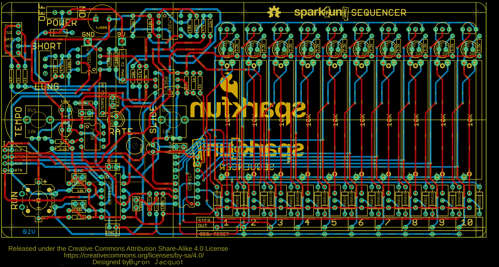
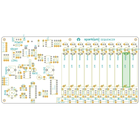
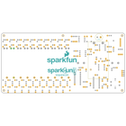
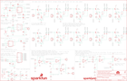

Contents
========

* [PRS12707 > Sparkpunk Sequencer](#prs12707--sparkpunk-sequencer)
	* [Schematic](#schematic)
	* [PCB](#pcb)
	* [Interactive BOM](#interactive-bom)
	* [OOMP Parts](#oomp-parts)
	* [Images](#images)
	* [Tags](#tags)
  
![][im]
# PRS12707 > Sparkpunk Sequencer

- ID: PROJ-SPAR-12707-STAN-01
- Hex ID: PRS12707
- Name: Sparkfun
- Description: Sparkfun
- Long Link: [http://oom.lt/PROJ-SPAR-12707-STAN-01](http://oom.lt/PROJ-SPAR-12707-STAN-01)
- Short Link: [http://oom.lt/PRS12707](http://oom.lt/PRS12707)

## Schematic
  

## PCB
  

## Interactive BOM

- Interactive BOM page: [ibom.html](https://htmlpreview.github.io/?https://github.com/oomlout/oomlout_OOMP_projects/blob/main/PROJ-SPAR-12707-STAN-01/kicad/bom/ibom.html)

## OOMP Parts
  

|OOMP Parts|
| :---: |
|UNMATCHED-UNMATCHED-X-UNMATCHED-01 BAT1, IC1, IC2, IC3, IC4, IC5, IC6, Q100, Q200, Q300, Q400, Q500, Q600, Q700, Q800, Q900, Q1000, RV1, RV2, S1, S3, S5, S100, S200, S300, S400, S500, S600, S700, S800, S900, S1000, VR100, VR200, VR300, VR400, VR500, VR600, VR700, VR800, VR900, VR1000|
|CAPX-UNMATCHED-X-NF100-01 C1, C5, C6, C7, C8, C11|
|CAPX-UNMATCHED-X-UF10-01 C2, C3, C4|
|CAPX-UNMATCHED-X-UNMATCHED-V25 C9|
|CAPX-UNMATCHED-X-NF1-01 C10|
|DIOD-UNMATCHED-X-K4148-01 D1, D2|
|DIOD-UNMATCHED-X-UNMATCHED-01 D3, D100, D101, D200, D201, D300, D301, D400, D401, D500, D501, D600, D601, D700, D701, D800, D801, D900, D901, D1000, D1001|
|HEAD-I01-X-PI01-01 JP1, JP2, JP3, JP4, JP5, JP6, JP7, JP100|
|[HEAD-I01-X-PI02-01  2.54 mm 2 Pin Header  JP200, JP300, JP400, JP500, JP600, JP700, JP800, JP900, JP1000](https://github.com/oomlout/oomlout_OOMP_parts/tree/main/HEAD-I01-X-PI02-01/)|
|LEDS-UNMATCHED-R-STAN-01 LED1, LED100, LED200, LED300, LED400, LED500, LED600, LED700, LED800, LED900, LED1000|
|RESE-UNMATCHED-X-O471-01 R1|
|RESE-UNMATCHED-X-O1003-01 R2, R3, R14, R16, R27, R28|
|RESE-UNMATCHED-X-O103-01 R4, R7, R12, R21, R23, R24, R25|
|RESE-UNMATCHED-X-O473-01 R5, R13, R20|
|RESE-UNMATCHED-X-O222-01 R6, R19, R100, R200, R300, R400, R500, R600, R700, R800, R900, R1000|
|RESE-UNMATCHED-X-O102-01 R9, R10, R22, R26|
|RESE-UNMATCHED-X-O470-01 R15|
|RESE-UNMATCHED-X-O223-01 R17, R18, R30|
|RESE-UNMATCHED-X-O333-01 R29|

## Images
  
  

|bominteractivefront|bominteractiveback|kicadPcb3d|kicadPcb3dFront|kicadPcb3dBack|eagleImage|eagleSchemImage|
| :---: | :---: | :---: | :---: | :---: | :---: | :---: |
||||||||

## Tags

- hexID: PRS12707
- oompType: PROJ
- oompSize: SPAR
- oompColor: 12707
- oompDesc: STAN
- oompIndex: 01
- oompName: Sparkpunk Sequencer
- sources: All source files from https://github.com/sparkfun/Sparkpunk_Sequencer (source licence details in srcLicense.md)
- linkBuyPage: https://www.sparkfun.com/products/12707
- oompID: PROJ-SPAR-12707-STAN-01
- oompParts: BAT1,UNMATCHED-UNMATCHED-X-UNMATCHED-01
- oompParts: C1,CAPX-UNMATCHED-X-NF100-01
- oompParts: C2,CAPX-UNMATCHED-X-UF10-01
- oompParts: C3,CAPX-UNMATCHED-X-UF10-01
- oompParts: C4,CAPX-UNMATCHED-X-UF10-01
- oompParts: C5,CAPX-UNMATCHED-X-NF100-01
- oompParts: C6,CAPX-UNMATCHED-X-NF100-01
- oompParts: C7,CAPX-UNMATCHED-X-NF100-01
- oompParts: C8,CAPX-UNMATCHED-X-NF100-01
- oompParts: C9,CAPX-UNMATCHED-X-UNMATCHED-V25
- oompParts: C10,CAPX-UNMATCHED-X-NF1-01
- oompParts: C11,CAPX-UNMATCHED-X-NF100-01
- oompParts: D1,DIOD-UNMATCHED-X-K4148-01
- oompParts: D2,DIOD-UNMATCHED-X-K4148-01
- oompParts: D3,DIOD-UNMATCHED-X-UNMATCHED-01
- oompParts: D100,DIOD-UNMATCHED-X-UNMATCHED-01
- oompParts: D101,DIOD-UNMATCHED-X-UNMATCHED-01
- oompParts: D200,DIOD-UNMATCHED-X-UNMATCHED-01
- oompParts: D201,DIOD-UNMATCHED-X-UNMATCHED-01
- oompParts: D300,DIOD-UNMATCHED-X-UNMATCHED-01
- oompParts: D301,DIOD-UNMATCHED-X-UNMATCHED-01
- oompParts: D400,DIOD-UNMATCHED-X-UNMATCHED-01
- oompParts: D401,DIOD-UNMATCHED-X-UNMATCHED-01
- oompParts: D500,DIOD-UNMATCHED-X-UNMATCHED-01
- oompParts: D501,DIOD-UNMATCHED-X-UNMATCHED-01
- oompParts: D600,DIOD-UNMATCHED-X-UNMATCHED-01
- oompParts: D601,DIOD-UNMATCHED-X-UNMATCHED-01
- oompParts: D700,DIOD-UNMATCHED-X-UNMATCHED-01
- oompParts: D701,DIOD-UNMATCHED-X-UNMATCHED-01
- oompParts: D800,DIOD-UNMATCHED-X-UNMATCHED-01
- oompParts: D801,DIOD-UNMATCHED-X-UNMATCHED-01
- oompParts: D900,DIOD-UNMATCHED-X-UNMATCHED-01
- oompParts: D901,DIOD-UNMATCHED-X-UNMATCHED-01
- oompParts: D1000,DIOD-UNMATCHED-X-UNMATCHED-01
- oompParts: D1001,DIOD-UNMATCHED-X-UNMATCHED-01
- oompParts: IC1,UNMATCHED-UNMATCHED-X-UNMATCHED-01
- oompParts: IC2,UNMATCHED-UNMATCHED-X-UNMATCHED-01
- oompParts: IC3,UNMATCHED-UNMATCHED-X-UNMATCHED-01
- oompParts: IC4,UNMATCHED-UNMATCHED-X-UNMATCHED-01
- oompParts: IC5,UNMATCHED-UNMATCHED-X-UNMATCHED-01
- oompParts: IC6,UNMATCHED-UNMATCHED-X-UNMATCHED-01
- oompParts: JP1,HEAD-I01-X-PI01-01
- oompParts: JP2,HEAD-I01-X-PI01-01
- oompParts: JP3,HEAD-I01-X-PI01-01
- oompParts: JP4,HEAD-I01-X-PI01-01
- oompParts: JP5,HEAD-I01-X-PI01-01
- oompParts: JP6,HEAD-I01-X-PI01-01
- oompParts: JP7,HEAD-I01-X-PI01-01
- oompParts: JP100,HEAD-I01-X-PI01-01
- oompParts: JP200,HEAD-I01-X-PI02-01
- oompParts: JP300,HEAD-I01-X-PI02-01
- oompParts: JP400,HEAD-I01-X-PI02-01
- oompParts: JP500,HEAD-I01-X-PI02-01
- oompParts: JP600,HEAD-I01-X-PI02-01
- oompParts: JP700,HEAD-I01-X-PI02-01
- oompParts: JP800,HEAD-I01-X-PI02-01
- oompParts: JP900,HEAD-I01-X-PI02-01
- oompParts: JP1000,HEAD-I01-X-PI02-01
- oompParts: LED1,LEDS-UNMATCHED-R-STAN-01
- oompParts: LED100,LEDS-UNMATCHED-R-STAN-01
- oompParts: LED200,LEDS-UNMATCHED-R-STAN-01
- oompParts: LED300,LEDS-UNMATCHED-R-STAN-01
- oompParts: LED400,LEDS-UNMATCHED-R-STAN-01
- oompParts: LED500,LEDS-UNMATCHED-R-STAN-01
- oompParts: LED600,LEDS-UNMATCHED-R-STAN-01
- oompParts: LED700,LEDS-UNMATCHED-R-STAN-01
- oompParts: LED800,LEDS-UNMATCHED-R-STAN-01
- oompParts: LED900,LEDS-UNMATCHED-R-STAN-01
- oompParts: LED1000,LEDS-UNMATCHED-R-STAN-01
- oompParts: Q100,UNMATCHED-UNMATCHED-X-UNMATCHED-01
- oompParts: Q200,UNMATCHED-UNMATCHED-X-UNMATCHED-01
- oompParts: Q300,UNMATCHED-UNMATCHED-X-UNMATCHED-01
- oompParts: Q400,UNMATCHED-UNMATCHED-X-UNMATCHED-01
- oompParts: Q500,UNMATCHED-UNMATCHED-X-UNMATCHED-01
- oompParts: Q600,UNMATCHED-UNMATCHED-X-UNMATCHED-01
- oompParts: Q700,UNMATCHED-UNMATCHED-X-UNMATCHED-01
- oompParts: Q800,UNMATCHED-UNMATCHED-X-UNMATCHED-01
- oompParts: Q900,UNMATCHED-UNMATCHED-X-UNMATCHED-01
- oompParts: Q1000,UNMATCHED-UNMATCHED-X-UNMATCHED-01
- oompParts: R1,RESE-UNMATCHED-X-O471-01
- oompParts: R2,RESE-UNMATCHED-X-O1003-01
- oompParts: R3,RESE-UNMATCHED-X-O1003-01
- oompParts: R4,RESE-UNMATCHED-X-O103-01
- oompParts: R5,RESE-UNMATCHED-X-O473-01
- oompParts: R6,RESE-UNMATCHED-X-O222-01
- oompParts: R7,RESE-UNMATCHED-X-O103-01
- oompParts: R9,RESE-UNMATCHED-X-O102-01
- oompParts: R10,RESE-UNMATCHED-X-O102-01
- oompParts: R12,RESE-UNMATCHED-X-O103-01
- oompParts: R13,RESE-UNMATCHED-X-O473-01
- oompParts: R14,RESE-UNMATCHED-X-O1003-01
- oompParts: R15,RESE-UNMATCHED-X-O470-01
- oompParts: R16,RESE-UNMATCHED-X-O1003-01
- oompParts: R17,RESE-UNMATCHED-X-O223-01
- oompParts: R18,RESE-UNMATCHED-X-O223-01
- oompParts: R19,RESE-UNMATCHED-X-O222-01
- oompParts: R20,RESE-UNMATCHED-X-O473-01
- oompParts: R21,RESE-UNMATCHED-X-O103-01
- oompParts: R22,RESE-UNMATCHED-X-O102-01
- oompParts: R23,RESE-UNMATCHED-X-O103-01
- oompParts: R24,RESE-UNMATCHED-X-O103-01
- oompParts: R25,RESE-UNMATCHED-X-O103-01
- oompParts: R26,RESE-UNMATCHED-X-O102-01
- oompParts: R27,RESE-UNMATCHED-X-O1003-01
- oompParts: R28,RESE-UNMATCHED-X-O1003-01
- oompParts: R29,RESE-UNMATCHED-X-O333-01
- oompParts: R30,RESE-UNMATCHED-X-O223-01
- oompParts: R100,RESE-UNMATCHED-X-O222-01
- oompParts: R200,RESE-UNMATCHED-X-O222-01
- oompParts: R300,RESE-UNMATCHED-X-O222-01
- oompParts: R400,RESE-UNMATCHED-X-O222-01
- oompParts: R500,RESE-UNMATCHED-X-O222-01
- oompParts: R600,RESE-UNMATCHED-X-O222-01
- oompParts: R700,RESE-UNMATCHED-X-O222-01
- oompParts: R800,RESE-UNMATCHED-X-O222-01
- oompParts: R900,RESE-UNMATCHED-X-O222-01
- oompParts: R1000,RESE-UNMATCHED-X-O222-01
- oompParts: RV1,UNMATCHED-UNMATCHED-X-UNMATCHED-01
- oompParts: RV2,UNMATCHED-UNMATCHED-X-UNMATCHED-01
- oompParts: S1,UNMATCHED-UNMATCHED-X-UNMATCHED-01
- oompParts: S3,UNMATCHED-UNMATCHED-X-UNMATCHED-01
- oompParts: S5,UNMATCHED-UNMATCHED-X-UNMATCHED-01
- oompParts: S100,UNMATCHED-UNMATCHED-X-UNMATCHED-01
- oompParts: S200,UNMATCHED-UNMATCHED-X-UNMATCHED-01
- oompParts: S300,UNMATCHED-UNMATCHED-X-UNMATCHED-01
- oompParts: S400,UNMATCHED-UNMATCHED-X-UNMATCHED-01
- oompParts: S500,UNMATCHED-UNMATCHED-X-UNMATCHED-01
- oompParts: S600,UNMATCHED-UNMATCHED-X-UNMATCHED-01
- oompParts: S700,UNMATCHED-UNMATCHED-X-UNMATCHED-01
- oompParts: S800,UNMATCHED-UNMATCHED-X-UNMATCHED-01
- oompParts: S900,UNMATCHED-UNMATCHED-X-UNMATCHED-01
- oompParts: S1000,UNMATCHED-UNMATCHED-X-UNMATCHED-01
- oompParts: VR100,UNMATCHED-UNMATCHED-X-UNMATCHED-01
- oompParts: VR200,UNMATCHED-UNMATCHED-X-UNMATCHED-01
- oompParts: VR300,UNMATCHED-UNMATCHED-X-UNMATCHED-01
- oompParts: VR400,UNMATCHED-UNMATCHED-X-UNMATCHED-01
- oompParts: VR500,UNMATCHED-UNMATCHED-X-UNMATCHED-01
- oompParts: VR600,UNMATCHED-UNMATCHED-X-UNMATCHED-01
- oompParts: VR700,UNMATCHED-UNMATCHED-X-UNMATCHED-01
- oompParts: VR800,UNMATCHED-UNMATCHED-X-UNMATCHED-01
- oompParts: VR900,UNMATCHED-UNMATCHED-X-UNMATCHED-01
- oompParts: VR1000,UNMATCHED-UNMATCHED-X-UNMATCHED-01
- rawParts: BAT1,9V,BC9VPCKIT_SOLDERMASK,BC9VPC_KIT,9V board-mount battery cradle,,,BATT-10855,,
- rawParts: C1,.1uf,0.1UF-50V-20%(PTH)KIT-EZ,CAP-PTH-SMALL-KIT,CAP-08370,,,CAP-08370,,
- rawParts: C2,10uf,10UF-25V-20%(PTH)KIT,CPOL-RADIAL-10UF-25V-KIT,CAP-08440,,,CAP-08440,,
- rawParts: C3,10uf,10UF-25V-20%(PTH)KIT,CPOL-RADIAL-10UF-25V-KIT,CAP-08440,,,CAP-08440,,
- rawParts: C4,10uf,10UF-25V-20%(PTH)KIT,CPOL-RADIAL-10UF-25V-KIT,CAP-08440,,,CAP-08440,,
- rawParts: C5,.1uf,0.1UF-50V-20%(PTH)KIT-EZ,CAP-PTH-SMALL-KIT,CAP-08370,,,CAP-08370,,
- rawParts: C6,.1uf,0.1UF-50V-20%(PTH)KIT-EZ,CAP-PTH-SMALL-KIT,CAP-08370,,,CAP-08370,,
- rawParts: C7,.1uf,0.1UF-50V-20%(PTH)KIT-EZ,CAP-PTH-SMALL-KIT,CAP-08370,,,CAP-08370,,
- rawParts: C8,.1uf,0.1UF-50V-20%(PTH)KIT-EZ,CAP-PTH-SMALL-KIT,CAP-08370,,,CAP-08370,,
- rawParts: C9,1000uf/25V,1000UF-25V(PTH)KIT,CPOL-RADIAL-1000UF-25V-KIT,CAP-08070,,,CAP-09538,1000uf/25V,
- rawParts: C10,1nf,CAPKIT,CAP-PTH-SMALL-KIT,Capacitor,,,CAP-09182,,
- rawParts: C11,.1uf,0.1UF-50V-20%(PTH)KIT-EZ,CAP-PTH-SMALL-KIT,CAP-08370,,,CAP-08370,,
- rawParts: D1,1n4148,DIODEKIT,DIODE-1N4148-KIT,Diode,,,DIO-08378,,
- rawParts: D2,1n4148,DIODEKIT,DIODE-1N4148-KIT,Diode,,,DIO-08378,,
- rawParts: D3,1N5819,DIODE,DIODE-1N4001-KIT,Diode,,,DIO-11895,,
- rawParts: D100,1N5819,DIODE,DIODE-1N4001-KIT,Diode,,,DIO-11895,,
- rawParts: D101,1N5819,DIODE,DIODE-1N4001-KIT,Diode,,,DIO-11895,,
- rawParts: D200,1N5819,DIODE,DIODE-1N4001-KIT,Diode,,,DIO-11895,,
- rawParts: D201,1N5819,DIODE,DIODE-1N4001-KIT,Diode,,,DIO-11895,,
- rawParts: D300,1N5819,DIODE,DIODE-1N4001-KIT,Diode,,,DIO-11895,,
- rawParts: D301,1N5819,DIODE,DIODE-1N4001-KIT,Diode,,,DIO-11895,,
- rawParts: D400,1N5819,DIODE,DIODE-1N4001-KIT,Diode,,,DIO-11895,,
- rawParts: D401,1N5819,DIODE,DIODE-1N4001-KIT,Diode,,,DIO-11895,,
- rawParts: D500,1N5819,DIODE,DIODE-1N4001-KIT,Diode,,,DIO-11895,,
- rawParts: D501,1N5819,DIODE,DIODE-1N4001-KIT,Diode,,,DIO-11895,,
- rawParts: D600,1N5819,DIODE,DIODE-1N4001-KIT,Diode,,,DIO-11895,,
- rawParts: D601,1N5819,DIODE,DIODE-1N4001-KIT,Diode,,,DIO-11895,,
- rawParts: D700,1N5819,DIODE,DIODE-1N4001-KIT,Diode,,,DIO-11895,,
- rawParts: D701,1N5819,DIODE,DIODE-1N4001-KIT,Diode,,,DIO-11895,,
- rawParts: D800,1N5819,DIODE,DIODE-1N4001-KIT,Diode,,,DIO-11895,,
- rawParts: D801,1N5819,DIODE,DIODE-1N4001-KIT,Diode,,,DIO-11895,,
- rawParts: D900,1N5819,DIODE,DIODE-1N4001-KIT,Diode,,,DIO-11895,,
- rawParts: D901,1N5819,DIODE,DIODE-1N4001-KIT,Diode,,,DIO-11895,,
- rawParts: D1000,1N5819,DIODE,DIODE-1N4001-KIT,Diode,,,DIO-11895,,
- rawParts: D1001,1N5819,DIODE,DIODE-1N4001-KIT,Diode,,,DIO-11895,,
- rawParts: FRAME1,FRAME-LEDGER,FRAME-LEDGER,CREATIVE_COMMONS,Schematic Frame,,,,,
- rawParts: IC1,7555,NE555KIT,DIP08-KIT,General purpose bipolar Timer,digikey,ICM7555IPAZ-ND,,,
- rawParts: IC2,LM358,LM358KIT,DIP08-KIT,Jellybean op-amp,,,IC-09172,,
- rawParts: IC3,LM358,LM358KIT,DIP08-KIT,Jellybean op-amp,,,IC-09172,,
- rawParts: IC4,LM358,LM358KIT,DIP08-KIT,Jellybean op-amp,,,IC-09172,,
- rawParts: IC5,CD4013B,CD4013,DIL14-KIT,Dual D-type Flip-Flop,,,IC-11930,CD4013B,
- rawParts: IC6,CD4017,CD4017KIT,DIL16-KIT,,Digikey,296-2037-5-ND,,,
- rawParts: JP1,GATE,M01SMDNS,1X01NS,Header 1,,,,,
- rawParts: JP2,CV1,M01SMDNS,1X01NS,Header 1,,,,,
- rawParts: JP3,TEMPO_CV,M01SMDNS,1X01NS,Header 1,,,,,
- rawParts: JP4,CV2,M01SMDNS,1X01NS,Header 1,,,,,
- rawParts: JP5,CV,M01SMDNS,1X01NS,Header 1,,,,,
- rawParts: JP6,VCC,M01SMDNS,1X01NS,Header 1,,,,,
- rawParts: JP7,GND,M01SMDNS,1X01NS,Header 1,,,,,
- rawParts: JP100,STEP1,M01SMDNS,1X01NS,Header 1,,,,,
- rawParts: JP200,STEP2,M021X02_NO_SILK,1X02_NO_SILK,Standard 2-pin 0.1 header. Use with,,,,,
- rawParts: JP300,STEP3,M021X02_NO_SILK,1X02_NO_SILK,Standard 2-pin 0.1 header. Use with,,,,,
- rawParts: JP400,STEP4,M021X02_NO_SILK,1X02_NO_SILK,Standard 2-pin 0.1 header. Use with,,,,,
- rawParts: JP500,STEP5,M021X02_NO_SILK,1X02_NO_SILK,Standard 2-pin 0.1 header. Use with,,,,,
- rawParts: JP600,STEP6,M021X02_NO_SILK,1X02_NO_SILK,Standard 2-pin 0.1 header. Use with,,,,,
- rawParts: JP700,STEP7,M021X02_NO_SILK,1X02_NO_SILK,Standard 2-pin 0.1 header. Use with,,,,,
- rawParts: JP800,STEP8,M021X02_NO_SILK,1X02_NO_SILK,Standard 2-pin 0.1 header. Use with,,,,,
- rawParts: JP900,STEP9,M021X02_NO_SILK,1X02_NO_SILK,Standard 2-pin 0.1 header. Use with,,,,,
- rawParts: JP1000,STEP10,M021X02_NO_SILK,1X02_NO_SILK,Standard 2-pin 0.1 header. Use with,,,,,
- rawParts: LED1,RED,LED5MM-KIT,LED5MM-KIT,LEDs,,,DIO-09529,,
- rawParts: LED100,RED,LED5MM-KIT,LED5MM-KIT,LEDs,,,DIO-09529,,
- rawParts: LED200,RED,LED5MM-KIT,LED5MM-KIT,LEDs,,,DIO-09529,,
- rawParts: LED300,RED,LED5MM-KIT,LED5MM-KIT,LEDs,,,DIO-09529,,
- rawParts: LED400,RED,LED5MM-KIT,LED5MM-KIT,LEDs,,,DIO-09529,,
- rawParts: LED500,RED,LED5MM-KIT,LED5MM-KIT,LEDs,,,DIO-09529,,
- rawParts: LED600,RED,LED5MM-KIT,LED5MM-KIT,LEDs,,,DIO-09529,,
- rawParts: LED700,RED,LED5MM-KIT,LED5MM-KIT,LEDs,,,DIO-09529,,
- rawParts: LED800,RED,LED5MM-KIT,LED5MM-KIT,LEDs,,,DIO-09529,,
- rawParts: LED900,RED,LED5MM-KIT,LED5MM-KIT,LEDs,,,DIO-09529,,
- rawParts: LED1000,RED,LED5MM-KIT,LED5MM-KIT,LEDs,,,DIO-09529,,
- rawParts: LOGO1,SPARKPUNK_LOGO.2_INCH_TALL,SPARKPUNK_LOGO.2_INCH_TALL,SPARKPUNK_LOGO_.2,,,,,,
- rawParts: LOGO2,OSHW-LOGOM,OSHW-LOGOM,OSHW-LOGO-M,Open Source Hardware Logo This logo indicates the piece of hardware it is found on incorporates a OSHW license and/or adheres to the definition of open source hardware found here: http://freedomdefined.org/OSHW,,,,,
- rawParts: LOGO3,SPARKPUNK_LOGO.1INCH_TALL,SPARKPUNK_LOGO.1INCH_TALL,SPARKPUNK_LOGO_.1,,,,,,
- rawParts: LOGO4,SFE_LOGO_NAME_FLAME.4_INCH,SFE_LOGO_NAME_FLAME.4_INCH,SFE_LOGO_NAME_FLAME_.4,SFE Logo, name and flame,,,,,
- rawParts: Q100,2N3904,TRANSISTOR_NPNTO-92-AMMO,TO-92-AMMO,Generic NPN BJT,,,TRANS-08447,,
- rawParts: Q200,2N3904,TRANSISTOR_NPNTO-92-AMMO,TO-92-AMMO,Generic NPN BJT,,,TRANS-08447,,
- rawParts: Q300,2N3904,TRANSISTOR_NPNTO-92-AMMO,TO-92-AMMO,Generic NPN BJT,,,TRANS-08447,,
- rawParts: Q400,2N3904,TRANSISTOR_NPNTO-92-AMMO,TO-92-AMMO,Generic NPN BJT,,,TRANS-08447,,
- rawParts: Q500,2N3904,TRANSISTOR_NPNTO-92-AMMO,TO-92-AMMO,Generic NPN BJT,,,TRANS-08447,,
- rawParts: Q600,2N3904,TRANSISTOR_NPNTO-92-AMMO,TO-92-AMMO,Generic NPN BJT,,,TRANS-08447,,
- rawParts: Q700,2N3904,TRANSISTOR_NPNTO-92-AMMO,TO-92-AMMO,Generic NPN BJT,,,TRANS-08447,,
- rawParts: Q800,2N3904,TRANSISTOR_NPNTO-92-AMMO,TO-92-AMMO,Generic NPN BJT,,,TRANS-08447,,
- rawParts: Q900,2N3904,TRANSISTOR_NPNTO-92-AMMO,TO-92-AMMO,Generic NPN BJT,,,TRANS-08447,,
- rawParts: Q1000,2N3904,TRANSISTOR_NPNTO-92-AMMO,TO-92-AMMO,Generic NPN BJT,,,TRANS-08447,,
- rawParts: R1,470,RESISTOREZ,AXIAL-0.3EZ,Resistor,,,RES-10693,,
- rawParts: R2,100k,RESISTOREZ,AXIAL-0.3EZ,Resistor,,,RES-10686,,
- rawParts: R3,100k,RESISTOREZ,AXIAL-0.3EZ,Resistor,,,RES-10686,,
- rawParts: R4,10k,RESISTOREZ,AXIAL-0.3EZ,Resistor,,,RES-09435,,
- rawParts: R5,47k,RESISTOREZ,AXIAL-0.3EZ,Resistor,,,RES-10687,,
- rawParts: R6,2.2k,RESISTOREZ,AXIAL-0.3EZ,Resistor,,,RES-10691,,
- rawParts: R7,10k,RESISTOREZ,AXIAL-0.3EZ,Resistor,,,RES-09435,,
- rawParts: R9,1k,RESISTOREZ,AXIAL-0.3EZ,Resistor,,,RES-08380,,
- rawParts: R10,1k,RESISTOREZ,AXIAL-0.3EZ,Resistor,,,RES-08380,,
- rawParts: R12,10k,RESISTOREZ,AXIAL-0.3EZ,Resistor,,,RES-09435,,
- rawParts: R13,47k,RESISTOREZ,AXIAL-0.3EZ,Resistor,,,RES-10687,,
- rawParts: R14,100k,RESISTOREZ,AXIAL-0.3EZ,Resistor,,,RES-10686,,
- rawParts: R15,47,RESISTOREZ,AXIAL-0.3EZ,Resistor,,,RES-10697,,
- rawParts: R16,100k,RESISTOREZ,AXIAL-0.3EZ,Resistor,,,RES-10686,,
- rawParts: R17,22k,RESISTOREZ,AXIAL-0.3EZ,Resistor,,,RES-10688,,
- rawParts: R18,22k,RESISTOREZ,AXIAL-0.3EZ,Resistor,,,RES-10688,,
- rawParts: R19,2.2k,RESISTOREZ,AXIAL-0.3EZ,Resistor,,,RES-10691,,
- rawParts: R20,47k,RESISTOREZ,AXIAL-0.3EZ,Resistor,,,RES-10687,,
- rawParts: R21,10k,RESISTOREZ,AXIAL-0.3EZ,Resistor,,,RES-09435,,
- rawParts: R22,1k,RESISTOREZ,AXIAL-0.3EZ,Resistor,,,RES-08380,,
- rawParts: R23,10k,RESISTOREZ,AXIAL-0.3EZ,Resistor,,,RES-09435,,
- rawParts: R24,10k,RESISTOREZ,AXIAL-0.3EZ,Resistor,,,RES-09435,,
- rawParts: R25,10k,RESISTOREZ,AXIAL-0.3EZ,Resistor,,,RES-09435,,
- rawParts: R26,1k,RESISTOREZ,AXIAL-0.3EZ,Resistor,,,RES-08380,,
- rawParts: R27,100k,RESISTOREZ,AXIAL-0.3EZ,Resistor,,,RES-10686,,
- rawParts: R28,100k,RESISTOREZ,AXIAL-0.3EZ,Resistor,,,RES-10686,,
- rawParts: R29,33k,RESISTOREZ,AXIAL-0.3EZ,Resistor,,,RES-10687,,
- rawParts: R30,22k,RESISTOREZ,AXIAL-0.3EZ,Resistor,,,RES-10688,,
- rawParts: R100,2.2k,RESISTOREZ,AXIAL-0.3EZ,Resistor,,,RES-10691,,
- rawParts: R200,2.2k,RESISTOREZ,AXIAL-0.3EZ,Resistor,,,RES-10691,,
- rawParts: R300,2.2k,RESISTOREZ,AXIAL-0.3EZ,Resistor,,,RES-10691,,
- rawParts: R400,2.2k,RESISTOREZ,AXIAL-0.3EZ,Resistor,,,RES-10691,,
- rawParts: R500,2.2k,RESISTOREZ,AXIAL-0.3EZ,Resistor,,,RES-10691,,
- rawParts: R600,2.2k,RESISTOREZ,AXIAL-0.3EZ,Resistor,,,RES-10691,,
- rawParts: R700,2.2k,RESISTOREZ,AXIAL-0.3EZ,Resistor,,,RES-10691,,
- rawParts: R800,2.2k,RESISTOREZ,AXIAL-0.3EZ,Resistor,,,RES-10691,,
- rawParts: R900,2.2k,RESISTOREZ,AXIAL-0.3EZ,Resistor,,,RES-10691,,
- rawParts: R1000,2.2k,RESISTOREZ,AXIAL-0.3EZ,Resistor,,,RES-10691,,
- rawParts: RV1,10k,POTALPS-KIT,ALPS_POT_KIT,,,,RES-09177,,
- rawParts: RV2,10k,POTALPS-KIT,ALPS_POT_KIT,,,,RES-09177,,
- rawParts: S1,SPDT,SWITCH-SPDTKIT,SWITCH-SPDT_KIT,SPDT Switch,,,SWCH-08261,,
- rawParts: S3,Play Button,SWITCH-MOMENTARY-LEDEZ,TACTILE-PTH-LED-12MM-EZ,EZ is for Kits. There is no tStop (covering up the top side of the pads with mask). This helps the beginner see which side they should be soldering too.,,,SWCH-11758,,
- rawParts: S5,SPDT,SWITCH-SPDTKIT,SWITCH-SPDT_KIT,SPDT Switch,,,SWCH-08261,,
- rawParts: S100,SPDT,SWITCH-SPDTKIT,SWITCH-SPDT_KIT,SPDT Switch,,,SWCH-08261,,
- rawParts: S200,SPDT,SWITCH-SPDTKIT,SWITCH-SPDT_KIT,SPDT Switch,,,SWCH-08261,,
- rawParts: S300,SPDT,SWITCH-SPDTKIT,SWITCH-SPDT_KIT,SPDT Switch,,,SWCH-08261,,
- rawParts: S400,SPDT,SWITCH-SPDTKIT,SWITCH-SPDT_KIT,SPDT Switch,,,SWCH-08261,,
- rawParts: S500,SPDT,SWITCH-SPDTKIT,SWITCH-SPDT_KIT,SPDT Switch,,,SWCH-08261,,
- rawParts: S600,SPDT,SWITCH-SPDTKIT,SWITCH-SPDT_KIT,SPDT Switch,,,SWCH-08261,,
- rawParts: S700,SPDT,SWITCH-SPDTKIT,SWITCH-SPDT_KIT,SPDT Switch,,,SWCH-08261,,
- rawParts: S800,SPDT,SWITCH-SPDTKIT,SWITCH-SPDT_KIT,SPDT Switch,,,SWCH-08261,,
- rawParts: S900,SPDT,SWITCH-SPDTKIT,SWITCH-SPDT_KIT,SPDT Switch,,,SWCH-08261,,
- rawParts: S1000,SPDT,SWITCH-SPDTKIT,SWITCH-SPDT_KIT,SPDT Switch,,,SWCH-08261,,
- rawParts: SJ1,RUN-N.C.,SOLDERJUMPERTRACE-PTH,SJ_2S-TRACE-PTH,Solder Jumper,,,,,
- rawParts: SJ2,STOP-N.C.,SOLDERJUMPERTRACE-PTH,SJ_2S-TRACE-PTH,Solder Jumper,,,,,
- rawParts: SJ3,CLK-N.C.,SOLDERJUMPERTRACE-PTH,SJ_2S-TRACE-PTH,Solder Jumper,,,,,
- rawParts: SJ4,BTN-N.C.,SOLDERJUMPERTRACE-PTH,SJ_2S-TRACE-PTH,Solder Jumper,,,,,
- rawParts: SJ5,ONE-SHOT-N.O.,SOLDERJUMPERPTH,SJ_2S-PTH,Solder Jumper,,,,,
- rawParts: STANDOFF1,STAND-OFF,STAND-OFF,STAND-OFF,#4 Stand Off,,,,,
- rawParts: STANDOFF2,STAND-OFF,STAND-OFF,STAND-OFF,#4 Stand Off,,,,,
- rawParts: STANDOFF3,STAND-OFF,STAND-OFF,STAND-OFF,#4 Stand Off,,,,,
- rawParts: STANDOFF5,STAND-OFF,STAND-OFF,STAND-OFF,#4 Stand Off,,,,,
- rawParts: STANDOFF6,STAND-OFF,STAND-OFF,STAND-OFF,#4 Stand Off,,,,,
- rawParts: VR100,10K,SLIDER30MM-KIT,SLIDER-MEDIUM-KIT,Slide-type potentiometers.,,,RES-11931,,
- rawParts: VR200,10K,SLIDER30MM-KIT,SLIDER-MEDIUM-KIT,Slide-type potentiometers.,,,RES-11931,,
- rawParts: VR300,10K,SLIDER30MM-KIT,SLIDER-MEDIUM-KIT,Slide-type potentiometers.,,,RES-11931,,
- rawParts: VR400,10K,SLIDER30MM-KIT,SLIDER-MEDIUM-KIT,Slide-type potentiometers.,,,RES-11931,,
- rawParts: VR500,10K,SLIDER30MM-KIT,SLIDER-MEDIUM-KIT,Slide-type potentiometers.,,,RES-11931,,
- rawParts: VR600,10K,SLIDER30MM-KIT,SLIDER-MEDIUM-KIT,Slide-type potentiometers.,,,RES-11931,,
- rawParts: VR700,10K,SLIDER30MM-KIT,SLIDER-MEDIUM-KIT,Slide-type potentiometers.,,,RES-11931,,
- rawParts: VR800,10K,SLIDER30MM-KIT,SLIDER-MEDIUM-KIT,Slide-type potentiometers.,,,RES-11931,,
- rawParts: VR900,10K,SLIDER30MM-KIT,SLIDER-MEDIUM-KIT,Slide-type potentiometers.,,,RES-11931,,
- rawParts: VR1000,10K,SLIDER30MM-KIT,SLIDER-MEDIUM-KIT,Slide-type potentiometers.,,,RES-11931,,

[im]: kicadPcb3d_450.png
