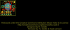
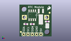
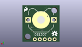
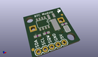

Contents
========

* [PROJ-SPAR-12708-STAN-01>RTC-Module](#proj-spar-12708-stan-01rtc-module)
	* [Images](#images)
	* [Interactive BOM](#interactive-bom)
	* [OOMP Parts](#oomp-parts)
	* [Tags](#tags)
  
![][im]
# PROJ-SPAR-12708-STAN-01>RTC-Module

- ID: PROJ-SPAR-12708-STAN-01
- Hex ID: PRS12708
- Name: RTC-Module
- Description: 

## Images
  
  

|eagleImage|kicadPcb3dFront|kicadPcb3dBack|kicadPcb3d|
| :---: | :---: | :---: | :---: |
|||||

## Interactive BOM

- Interactive BOM page: [ibom.html](kicad/bom/ibom.html)

## OOMP Parts
  

|OOMP Parts|
| :---: |
|UNMATCHED-UNMATCHED-X-UNMATCHED-01, BAT1, 9.524999999999999, 11.43, M0,BAT1, BATTCON_12MM_PTH, SparkFun-Electromechanical, (0.375, 0.45), MR0|
|CAPE-0603-X-NF100-01, C1, 16.509999999999998, 8.889999999999999, 0,C1, 0.1uF, 0603-CAP, SparkFun-Capacitors, (0.65, 0.35), R0|
|UNMATCHED-UNMATCHED-X-UNMATCHED-01, E$1, 0.8636, 2.667, 0,E$1, FIDUCIAL-1X2, SparkFun, (0.034, 0.105), R0|
|UNMATCHED-UNMATCHED-X-UNMATCHED-01, E$2, 17.8816, 14.173200000000001, 0,E$2, FIDUCIAL-1X2, SparkFun, (0.704, 0.558), R0|
|UNMATCHED-UNMATCHED-X-UNMATCHED-01, JP1, 12.7, 1.27, 180,JP1, 1X05, SparkFun, (0.5, 0.05), R180|
|UNMATCHED-UNMATCHED-X-UNMATCHED-01, Q1, 12.7, 15.239999999999998, 180,Q1, 32.768kHz, CRYSTAL-32KHZ-SMD, SparkFun-FreqCtrl, (0.5, 0.6), R180|
|RESE-0603-X-UNMATCHED-01, R1, 7.619999999999999, 7.365999999999999, 0,R1, 4.7k, 0603, SparkFun-Resistors, (0.3, 0.29), R0|
|RESE-0603-X-UNMATCHED-01, R2, 3.8099999999999996, 7.365999999999999, 0,R2, 4.7k, 0603, SparkFun-Resistors, (0.15, 0.29), R0|
|UNMATCHED-UNMATCHED-X-UNMATCHED-01, SJ2, 16.509999999999998, 6.35, 90,SJ2, SJ_3_PASTE1&2&3, SparkFun-Passives, (0.65, 0.25), R90|
|UNMATCHED-UNMATCHED-X-UNMATCHED-01, U1, 7.619999999999999, 12.7, 180,U1, DS1307, SO08-TIGHT, SparkFun-FreqCtrl, (0.3, 0.5), R180|

## Tags

- hexID: PRS12708
- oompType: PROJ
- oompSize: SPAR
- oompColor: 12708
- oompDesc: STAN
- oompIndex: 01
- oompName: RTC-Module
- sources: All source files from https://github.com/sparkfun/RTC-Module (source licence details in srcLicense.md)
- linkBuyPage: https://www.sparkfun.com/products/12708
- oompPart: UNMATCHED-UNMATCHED-X-UNMATCHED-01, BAT1, 9.524999999999999, 11.43, M0
- oompPart: CAPE-0603-X-NF100-01, C1, 16.509999999999998, 8.889999999999999, 0
- oompPart: UNMATCHED-UNMATCHED-X-UNMATCHED-01, E$1, 0.8636, 2.667, 0
- oompPart: UNMATCHED-UNMATCHED-X-UNMATCHED-01, E$2, 17.8816, 14.173200000000001, 0
- oompPart: UNMATCHED-UNMATCHED-X-UNMATCHED-01, JP1, 12.7, 1.27, 180
- oompPart: UNMATCHED-UNMATCHED-X-UNMATCHED-01, Q1, 12.7, 15.239999999999998, 180
- oompPart: RESE-0603-X-UNMATCHED-01, R1, 7.619999999999999, 7.365999999999999, 0
- oompPart: RESE-0603-X-UNMATCHED-01, R2, 3.8099999999999996, 7.365999999999999, 0
- oompPart: UNMATCHED-UNMATCHED-X-UNMATCHED-01, SJ2, 16.509999999999998, 6.35, 90
- oompPart: UNMATCHED-UNMATCHED-X-UNMATCHED-01, U1, 7.619999999999999, 12.7, 180
- rawPart: BAT1, BATTCON_12MM_PTH, SparkFun-Electromechanical, (0.375, 0.45), MR0
- rawPart: C1, 0.1uF, 0603-CAP, SparkFun-Capacitors, (0.65, 0.35), R0
- rawPart: E$1, FIDUCIAL-1X2, SparkFun, (0.034, 0.105), R0
- rawPart: E$2, FIDUCIAL-1X2, SparkFun, (0.704, 0.558), R0
- rawPart: JP1, 1X05, SparkFun, (0.5, 0.05), R180
- rawPart: Q1, 32.768kHz, CRYSTAL-32KHZ-SMD, SparkFun-FreqCtrl, (0.5, 0.6), R180
- rawPart: R1, 4.7k, 0603, SparkFun-Resistors, (0.3, 0.29), R0
- rawPart: R2, 4.7k, 0603, SparkFun-Resistors, (0.15, 0.29), R0
- rawPart: SJ2, SJ_3_PASTE1&2&3, SparkFun-Passives, (0.65, 0.25), R90
- rawPart: U1, DS1307, SO08-TIGHT, SparkFun-FreqCtrl, (0.3, 0.5), R180

[im]: kicadPcb3d_450.png
