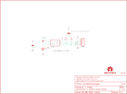

Contents
========

* [PRS12708 > RTC-Module](#prs12708--rtc-module)
	* [Schematic](#schematic)
	* [PCB](#pcb)
	* [Interactive BOM](#interactive-bom)
	* [OOMP Parts](#oomp-parts)
	* [Images](#images)
	* [Tags](#tags)
  
![][im]
# PRS12708 > RTC-Module

- ID: PROJ-SPAR-12708-STAN-01
- Hex ID: PRS12708
- Name: Sparkfun
- Description: Sparkfun
- Long Link: [http://oom.lt/PROJ-SPAR-12708-STAN-01](http://oom.lt/PROJ-SPAR-12708-STAN-01)
- Short Link: [http://oom.lt/PRS12708](http://oom.lt/PRS12708)

## Schematic
  

## PCB
  

## Interactive BOM

- Interactive BOM page: [ibom.html](https://htmlpreview.github.io/?https://github.com/oomlout/oomlout_OOMP_projects/blob/main/PROJ-SPAR-12708-STAN-01/kicad/bom/ibom.html)

## OOMP Parts
  

|OOMP Parts|
| :---: |
|BAT1 BAT1,UNMATCHED-UNMATCHED-X-UNMATCHED-01|
|C1 C1,CAPC-0603-X-UF1D-01|
|[JP1 HEAD-I01-X-PI05-01 2.54 mm 5 Pin Header](https://github.com/oomlout/oomlout_OOMP_parts/tree/main/HEAD-I01-X-PI05-01/)|
|Q1 Q1,UNMATCHED-UNMATCHED-X-UNMATCHED-01|
|[R1 RESE-0603-X-O472-01 SMD (0603) 4.7k Ohm Resistor](https://github.com/oomlout/oomlout_OOMP_parts/tree/main/RESE-0603-X-O472-01/)|
|[R2 RESE-0603-X-O472-01 SMD (0603) 4.7k Ohm Resistor](https://github.com/oomlout/oomlout_OOMP_parts/tree/main/RESE-0603-X-O472-01/)|
|U1 U1,UNMATCHED-UNMATCHED-X-UNMATCHED-01|

## Images
  
  

|kicadPcb3d|kicadPcb3dFront|kicadPcb3dBack|eagleImage|eagleSchemImage|
| :---: | :---: | :---: | :---: | :---: |
||||||

## Tags

- hexID: PRS12708
- oompType: PROJ
- oompSize: SPAR
- oompColor: 12708
- oompDesc: STAN
- oompIndex: 01
- oompName: RTC-Module
- sources: All source files from https://github.com/sparkfun/RTC-Module (source licence details in srcLicense.md)
- linkBuyPage: https://www.sparkfun.com/products/12708
- oompID: PROJ-SPAR-12708-STAN-01
- oompParts: BAT1,UNMATCHED-UNMATCHED-X-UNMATCHED-01
- oompParts: C1,CAPC-0603-X-UF1D-01
- oompParts: JP1,HEAD-I01-X-PI05-01
- oompParts: Q1,UNMATCHED-UNMATCHED-X-UNMATCHED-01
- oompParts: R1,RESE-0603-X-O472-01
- oompParts: R2,RESE-0603-X-O472-01
- oompParts: U1,UNMATCHED-UNMATCHED-X-UNMATCHED-01
- rawParts: BAT1,,BATTERY12PTH,BATTCON_12MM_PTH,Battery Holders,,,
- rawParts: C1,0.1uF,0.1UF-25V(+80/-20%)(0603),0603-CAP,CAP-00810,CAP-00810,0.1uF,
- rawParts: FRAME2,FRAME-LETTER,FRAME-LETTER,CREATIVE_COMMONS,Schematic Frame,,,
- rawParts: JP1,,M05PTH,1X05,Header 5,,,
- rawParts: LOGO1,OSHW-LOGOS,OSHW-LOGOS,OSHW-LOGO-S,Open Source Hardware Logo This logo indicates the piece of hardware it is found on incorporates a OSHW license and/or adheres to the definition of open source hardware found here: http://freedomdefined.org/OSHW,,,
- rawParts: Q1,32.768kHz,CRYSTAL32-SMD,CRYSTAL-32KHZ-SMD,Various standard crystals. Proven footprints. Spark Fun Electronics SKU : COM-00534,,,
- rawParts: R1,4.7k,4.7KOHM1/10W1%(0603),0603,RES-07857,RES-07857,,
- rawParts: R2,4.7k,4.7KOHM1/10W1%(0603),0603,RES-07857,RES-07857,,
- rawParts: SJ2,,SOLDERJUMPER_2WAYPASTE1&2&3,SJ_3_PASTE1&2&3,Solder Jumper,,,
- rawParts: U$2,LOGO-SFESK,LOGO-SFESK,SFE-LOGO-FLAME,Spark Fun Electronics PCB Logo,,,
- rawParts: U$6,STAND-OFF,STAND-OFF,STAND-OFF,Stand Off,,,
- rawParts: U$7,STAND-OFF,STAND-OFF,STAND-OFF,Stand Off,,,
- rawParts: U1,DS1307,DS1307SO8-TIGHT,SO08-TIGHT,I2C real-time clock with battery backup.,,,

[im]: kicadPcb3d_450.png
