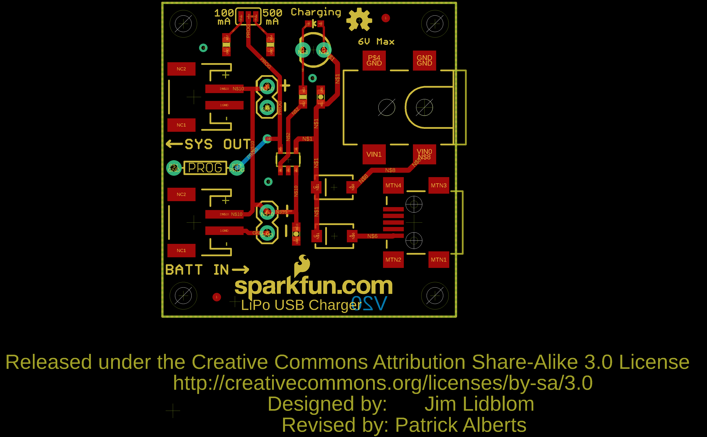

Contents
========

* [PRS12711 > USB LiPolyCharger SingleCell](#prs12711--usb-lipolycharger-singlecell)
	* [Schematic](#schematic)
	* [PCB](#pcb)
	* [Interactive BOM](#interactive-bom)
	* [OOMP Parts](#oomp-parts)
	* [Images](#images)
	* [Tags](#tags)
  
![][im]
# PRS12711 > USB LiPolyCharger SingleCell

- ID: PROJ-SPAR-12711-STAN-01
- Hex ID: PRS12711
- Name: Sparkfun
- Description: Sparkfun
- Long Link: [http://oom.lt/PROJ-SPAR-12711-STAN-01](http://oom.lt/PROJ-SPAR-12711-STAN-01)
- Short Link: [http://oom.lt/PRS12711](http://oom.lt/PRS12711)

## Schematic
  

## PCB
  

## Interactive BOM

- Interactive BOM page: [ibom.html](https://htmlpreview.github.io/?https://github.com/oomlout/oomlout_OOMP_projects/blob/main/PROJ-SPAR-12711-STAN-01/kicad/bom/ibom.html)

## OOMP Parts
  

|OOMP Parts|
| :---: |
|C1 C1,CAPC-0603-X-UF47D-01|
|C2 C2,CAPC-0603-X-UF47D-01|
|D1 D1,DIOD-UNMATCHED-X-UNMATCHED-01|
|D2 D2,DIOD-UNMATCHED-X-UNMATCHED-01|
|J1 J1,UNMATCHED-UNMATCHED-X-UNMATCHED-01|
|J2 J2,UNMATCHED-UNMATCHED-X-UNMATCHED-01|
|J3 J3,UNMATCHED-UNMATCHED-X-UNMATCHED-01|
|[JP1 HEAD-I01-X-PI02-01 2.54 mm 2 Pin Header](https://github.com/oomlout/oomlout_OOMP_parts/tree/main/HEAD-I01-X-PI02-01/)|
|[JP2 HEAD-I01-X-PI02-01 2.54 mm 2 Pin Header](https://github.com/oomlout/oomlout_OOMP_parts/tree/main/HEAD-I01-X-PI02-01/)|
|[LED2 LEDS-0603-G-STAN-01 SMD (0603) Green LED](https://github.com/oomlout/oomlout_OOMP_parts/tree/main/LEDS-0603-G-STAN-01/)|
|PROG PROG,UNMATCHED-UNMATCHED-X-UNMATCHED-01|
|R-PROG1 R-PROG1,UNMATCHED-0603-X-UNMATCHED-01|
|[R-PROG2 RESE-0603-X-O103-01 SMD (0603) 10k Ohm Resistor](https://github.com/oomlout/oomlout_OOMP_parts/tree/main/RESE-0603-X-O103-01/)|
|[R1 RESE-0603-X-O331-01 SMD (0603) 330 Ohm Resistor](https://github.com/oomlout/oomlout_OOMP_parts/tree/main/RESE-0603-X-O331-01/)|
|U1 U1,UNMATCHED-SO235-X-UNMATCHED-01|
|X1 X1,UNMATCHED-UNMATCHED-X-UNMATCHED-01|

## Images
  
  

|kicadPcb3d|kicadPcb3dFront|kicadPcb3dBack|eagleImage|eagleSchemImage|
| :---: | :---: | :---: | :---: | :---: |
||||||

## Tags

- hexID: PRS12711
- oompType: PROJ
- oompSize: SPAR
- oompColor: 12711
- oompDesc: STAN
- oompIndex: 01
- oompName: USB LiPolyCharger SingleCell
- sources: All source files from https://github.com/sparkfun/USB_LiPolyCharger_SingleCell (source licence details in srcLicense.md)
- linkBuyPage: https://www.sparkfun.com/products/12711
- oompID: PROJ-SPAR-12711-STAN-01
- oompParts: C1,CAPC-0603-X-UF47D-01
- oompParts: C2,CAPC-0603-X-UF47D-01
- oompParts: D1,DIOD-UNMATCHED-X-UNMATCHED-01
- oompParts: D2,DIOD-UNMATCHED-X-UNMATCHED-01
- oompParts: J1,UNMATCHED-UNMATCHED-X-UNMATCHED-01
- oompParts: J2,UNMATCHED-UNMATCHED-X-UNMATCHED-01
- oompParts: J3,UNMATCHED-UNMATCHED-X-UNMATCHED-01
- oompParts: JP1,HEAD-I01-X-PI02-01
- oompParts: JP2,HEAD-I01-X-PI02-01
- oompParts: LED2,LEDS-0603-G-STAN-01
- oompParts: PROG,UNMATCHED-UNMATCHED-X-UNMATCHED-01
- oompParts: R-PROG1,UNMATCHED-0603-X-UNMATCHED-01
- oompParts: R-PROG2,RESE-0603-X-O103-01
- oompParts: R1,RESE-0603-X-O331-01
- oompParts: U1,UNMATCHED-SO235-X-UNMATCHED-01
- oompParts: X1,UNMATCHED-UNMATCHED-X-UNMATCHED-01
- rawParts: C1,4.7uF,4.7UF-6.3V-10%(0603)0603,0603-CAP,CAP-08280,CAP-08280,4.7uF,
- rawParts: C2,4.7uF,4.7UF-6.3V-10%(0603)0603,0603-CAP,CAP-08280,CAP-08280,4.7uF,
- rawParts: D1,MBRA140,MBRA140,SMA-DIODE,40V, 1A Schottky rectifier,DIO-08053,,
- rawParts: D2,MBRA140,MBRA140,SMA-DIODE,40V, 1A Schottky rectifier,DIO-08053,,
- rawParts: FRAME1,FRAME-LETTER,FRAME-LETTER,CREATIVE_COMMONS,Schematic Frame,,,
- rawParts: J1,POWER_JACKSMD,POWER_JACKSMD,POWER_JACK_SMD,Power Jack,CONN-08106,5.5x2.1mm Barrel,
- rawParts: J2,,JST_2MM_MALE,JST-2-SMD,Mates to single-cell LiPo batteries.,CONN-08352,,
- rawParts: J3,,JST_2MM_MALE,JST-2-SMD,Mates to single-cell LiPo batteries.,CONN-08352,,
- rawParts: JP1,M02PTH,M02PTH,1X02,Standard 2-pin 0.1 header. Use with,,,
- rawParts: JP2,M02PTH,M02PTH,1X02,Standard 2-pin 0.1 header. Use with,,,
- rawParts: JP7,STAND-OFF,STAND-OFF,STAND-OFF,Stand Off,,,
- rawParts: JP8,STAND-OFF,STAND-OFF,STAND-OFF,Stand Off,,,
- rawParts: JP9,STAND-OFF,STAND-OFF,STAND-OFF,Stand Off,,,
- rawParts: JP10,STAND-OFF,STAND-OFF,STAND-OFF,Stand Off,,,
- rawParts: JP11,LOGO-SFENEW,LOGO-SFENEW,SFE-NEW-WEBLOGO,Spark Fun Electronics PCB Logo,,,
- rawParts: JP12,FIDUCIAL1X2,FIDUCIAL1X2,FIDUCIAL-1X2,Fiducial Alignment Points,,,
- rawParts: JP13,FIDUCIAL1X2,FIDUCIAL1X2,FIDUCIAL-1X2,Fiducial Alignment Points,,,
- rawParts: LED1,DNP,LED3MM,LED3MM,LEDs,,,
- rawParts: LED2,RED,LED-RED0603,LED-0603,Assorted Red LEDs,DIO-00819,RED,
- rawParts: LOGO1,OSHW-LOGOS,OSHW-LOGOS,OSHW-LOGO-S,Open Source Hardware Logo This logo indicates the piece of hardware it is found on incorporates a OSHW license and/or adheres to the definition of open source hardware found here: http://freedomdefined.org/OSHW,,,
- rawParts: PROG,,RESISTORAXIAL-0.3,AXIAL-0.3,Resistor,,,
- rawParts: R-PROG1,2k,2.0KOHM1/10W5%(0603),0603-RES,RES-08296,RES-08296,2.0k,
- rawParts: R-PROG2,10k,10KOHM1/10W1%(0603)0603,0603-RES,RES-00824,RES-00824,10K,
- rawParts: R1,330,330OHM1/10W1%(0603),0603-RES,RES-00818,RES-00818,330,
- rawParts: SJ1,,SOLDERJUMPER_2WAYS,SJ_3,Solder Jumper,,,
- rawParts: U1,MCP73831,MCP73831,SOT23-5,Miniature single cell, fully integrated Li-Ion, Li-polymer charge management controller,IC-09995,,
- rawParts: X1,USBSMD,USBSMD,USB-MINIB,USB Connectors,,,

[im]: kicadPcb3d_450.png
