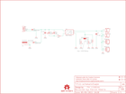

Contents
========

* [PRS12711 > Sparkfun](#prs12711--sparkfun)
	* [Images](#images)
	* [Tags](#tags)
  
![][im]
# PRS12711 > Sparkfun

- ID: PROJ-SPAR-12711-STAN-01
- Hex ID: PRS12711
- Name: Sparkfun
- Description: Sparkfun

## Images
  
  

|kicadPcb3d|kicadPcb3dFront|kicadPcb3dBack|eagleImage|eagleSchemImage|
| :---: | :---: | :---: | :---: | :---: |
||||||

## Tags

- hexID: PRS12711
- oompType: PROJ
- oompSize: SPAR
- oompColor: 12711
- oompDesc: STAN
- oompIndex: 01
- oompName: USB LiPolyCharger SingleCell
- sources: All source files from https://github.com/sparkfun/USB_LiPolyCharger_SingleCell (source licence details in srcLicense.md)
- linkBuyPage: https://www.sparkfun.com/products/12711
- oompID: PROJ-SPAR-12711-STAN-01
- oompParts: C1,UNMATCHED-UNMATCHED-UNMATCHED-UNMATCHED-UNMATCHED
- oompParts: C2,UNMATCHED-UNMATCHED-UNMATCHED-UNMATCHED-UNMATCHED
- oompParts: D1,UNMATCHED-UNMATCHED-UNMATCHED-UNMATCHED-UNMATCHED
- oompParts: D2,UNMATCHED-UNMATCHED-UNMATCHED-UNMATCHED-UNMATCHED
- oompParts: FRAME1,UNMATCHED-UNMATCHED-UNMATCHED-UNMATCHED-UNMATCHED
- oompParts: J1,UNMATCHED-UNMATCHED-UNMATCHED-UNMATCHED-UNMATCHED
- oompParts: J2,UNMATCHED-UNMATCHED-UNMATCHED-UNMATCHED-UNMATCHED
- oompParts: J3,UNMATCHED-UNMATCHED-UNMATCHED-UNMATCHED-UNMATCHED
- oompParts: JP1,UNMATCHED-UNMATCHED-UNMATCHED-UNMATCHED-UNMATCHED
- oompParts: JP2,UNMATCHED-UNMATCHED-UNMATCHED-UNMATCHED-UNMATCHED
- oompParts: JP7,UNMATCHED-UNMATCHED-UNMATCHED-UNMATCHED-UNMATCHED
- oompParts: JP8,UNMATCHED-UNMATCHED-UNMATCHED-UNMATCHED-UNMATCHED
- oompParts: JP9,UNMATCHED-UNMATCHED-UNMATCHED-UNMATCHED-UNMATCHED
- oompParts: JP10,UNMATCHED-UNMATCHED-UNMATCHED-UNMATCHED-UNMATCHED
- oompParts: JP11,UNMATCHED-UNMATCHED-UNMATCHED-UNMATCHED-UNMATCHED
- oompParts: LED1,UNMATCHED-UNMATCHED-UNMATCHED-UNMATCHED-UNMATCHED
- oompParts: LED2,UNMATCHED-UNMATCHED-UNMATCHED-UNMATCHED-UNMATCHED
- oompParts: LOGO1,UNMATCHED-UNMATCHED-UNMATCHED-UNMATCHED-UNMATCHED
- oompParts: PROG,UNMATCHED-UNMATCHED-UNMATCHED-UNMATCHED-UNMATCHED
- oompParts: R-PROG1,UNMATCHED-UNMATCHED-UNMATCHED-UNMATCHED-UNMATCHED
- oompParts: R-PROG2,UNMATCHED-UNMATCHED-UNMATCHED-UNMATCHED-UNMATCHED
- oompParts: R1,UNMATCHED-UNMATCHED-UNMATCHED-UNMATCHED-UNMATCHED
- oompParts: SJ1,UNMATCHED-UNMATCHED-UNMATCHED-UNMATCHED-UNMATCHED
- oompParts: U1,UNMATCHED-UNMATCHED-UNMATCHED-UNMATCHED-UNMATCHED
- oompParts: X1,UNMATCHED-UNMATCHED-UNMATCHED-UNMATCHED-UNMATCHED
- rawParts: C1,4.7uF,4.7UF-6.3V-10%(0603)0603,0603-CAP,CAP-08280,CAP-08280,4.7uF,
- rawParts: C2,4.7uF,4.7UF-6.3V-10%(0603)0603,0603-CAP,CAP-08280,CAP-08280,4.7uF,
- rawParts: D1,MBRA140,MBRA140,SMA-DIODE,40V, 1A Schottky rectifier,DIO-08053,,
- rawParts: D2,MBRA140,MBRA140,SMA-DIODE,40V, 1A Schottky rectifier,DIO-08053,,
- rawParts: FRAME1,FRAME-LETTER,FRAME-LETTER,CREATIVE_COMMONS,Schematic Frame,,,
- rawParts: J1,POWER_JACKSMD,POWER_JACKSMD,POWER_JACK_SMD,Power Jack,CONN-08106,5.5x2.1mm Barrel,
- rawParts: J2,,JST_2MM_MALE,JST-2-SMD,Mates to single-cell LiPo batteries.,CONN-08352,,
- rawParts: J3,,JST_2MM_MALE,JST-2-SMD,Mates to single-cell LiPo batteries.,CONN-08352,,
- rawParts: JP1,M02PTH,M02PTH,1X02,Standard 2-pin 0.1 header. Use with,,,
- rawParts: JP2,M02PTH,M02PTH,1X02,Standard 2-pin 0.1 header. Use with,,,
- rawParts: JP7,STAND-OFF,STAND-OFF,STAND-OFF,Stand Off,,,
- rawParts: JP8,STAND-OFF,STAND-OFF,STAND-OFF,Stand Off,,,
- rawParts: JP9,STAND-OFF,STAND-OFF,STAND-OFF,Stand Off,,,
- rawParts: JP10,STAND-OFF,STAND-OFF,STAND-OFF,Stand Off,,,
- rawParts: JP11,LOGO-SFENEW,LOGO-SFENEW,SFE-NEW-WEBLOGO,Spark Fun Electronics PCB Logo,,,
- rawParts: JP12,FIDUCIAL1X2,FIDUCIAL1X2,FIDUCIAL-1X2,Fiducial Alignment Points,,,
- rawParts: JP13,FIDUCIAL1X2,FIDUCIAL1X2,FIDUCIAL-1X2,Fiducial Alignment Points,,,
- rawParts: LED1,DNP,LED3MM,LED3MM,LEDs,,,
- rawParts: LED2,RED,LED-RED0603,LED-0603,Assorted Red LEDs,DIO-00819,RED,
- rawParts: LOGO1,OSHW-LOGOS,OSHW-LOGOS,OSHW-LOGO-S,Open Source Hardware Logo This logo indicates the piece of hardware it is found on incorporates a OSHW license and/or adheres to the definition of open source hardware found here: http://freedomdefined.org/OSHW,,,
- rawParts: PROG,,RESISTORAXIAL-0.3,AXIAL-0.3,Resistor,,,
- rawParts: R-PROG1,2k,2.0KOHM1/10W5%(0603),0603-RES,RES-08296,RES-08296,2.0k,
- rawParts: R-PROG2,10k,10KOHM1/10W1%(0603)0603,0603-RES,RES-00824,RES-00824,10K,
- rawParts: R1,330,330OHM1/10W1%(0603),0603-RES,RES-00818,RES-00818,330,
- rawParts: SJ1,,SOLDERJUMPER_2WAYS,SJ_3,Solder Jumper,,,
- rawParts: U1,MCP73831,MCP73831,SOT23-5,Miniature single cell, fully integrated Li-Ion, Li-polymer charge management controller,IC-09995,,
- rawParts: X1,USBSMD,USBSMD,USB-MINIB,USB Connectors,,,

[im]: kicadPcb3d_450.png
