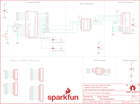

Contents
========

* [PRS12761 > Sparkfun](#prs12761--sparkfun)
	* [Images](#images)
	* [Tags](#tags)
  
![][im]
# PRS12761 > Sparkfun

- ID: PROJ-SPAR-12761-STAN-01
- Hex ID: PRS12761
- Name: Sparkfun
- Description: Sparkfun

## Images
  
  

|kicadPcb3d|kicadPcb3dFront|kicadPcb3dBack|eagleImage|eagleSchemImage|
| :---: | :---: | :---: | :---: | :---: |
||||||

## Tags

- hexID: PRS12761
- oompType: PROJ
- oompSize: SPAR
- oompColor: 12761
- oompDesc: STAN
- oompIndex: 01
- oompName: microSD Shield
- sources: All source files from https://github.com/sparkfun/microSD_Shield (source licence details in srcLicense.md)
- linkBuyPage: https://www.sparkfun.com/products/12761
- oompID: PROJ-SPAR-12761-STAN-01
- oompParts: C1,UNMATCHED-UNMATCHED-UNMATCHED-UNMATCHED-UNMATCHED
- oompParts: C2,UNMATCHED-UNMATCHED-UNMATCHED-UNMATCHED-UNMATCHED
- oompParts: C3,UNMATCHED-UNMATCHED-UNMATCHED-UNMATCHED-UNMATCHED
- oompParts: FRAME1,UNMATCHED-UNMATCHED-UNMATCHED-UNMATCHED-UNMATCHED
- oompParts: J1,UNMATCHED-UNMATCHED-UNMATCHED-UNMATCHED-UNMATCHED
- oompParts: JP1,UNMATCHED-UNMATCHED-UNMATCHED-UNMATCHED-UNMATCHED
- oompParts: JP4,UNMATCHED-UNMATCHED-UNMATCHED-UNMATCHED-UNMATCHED
- oompParts: JP5,UNMATCHED-UNMATCHED-UNMATCHED-UNMATCHED-UNMATCHED
- oompParts: JP6,UNMATCHED-UNMATCHED-UNMATCHED-UNMATCHED-UNMATCHED
- oompParts: JP7,UNMATCHED-UNMATCHED-UNMATCHED-UNMATCHED-UNMATCHED
- oompParts: LED1,UNMATCHED-UNMATCHED-UNMATCHED-UNMATCHED-UNMATCHED
- oompParts: LOGO1,UNMATCHED-UNMATCHED-UNMATCHED-UNMATCHED-UNMATCHED
- oompParts: LOGO2,UNMATCHED-UNMATCHED-UNMATCHED-UNMATCHED-UNMATCHED
- oompParts: R1,UNMATCHED-UNMATCHED-UNMATCHED-UNMATCHED-UNMATCHED
- oompParts: S1,UNMATCHED-UNMATCHED-UNMATCHED-UNMATCHED-UNMATCHED
- oompParts: SJ1,UNMATCHED-UNMATCHED-UNMATCHED-UNMATCHED-UNMATCHED
- oompParts: SJ2,UNMATCHED-UNMATCHED-UNMATCHED-UNMATCHED-UNMATCHED
- oompParts: U$1,UNMATCHED-UNMATCHED-UNMATCHED-UNMATCHED-UNMATCHED
- oompParts: U1,UNMATCHED-UNMATCHED-UNMATCHED-UNMATCHED-UNMATCHED
- oompParts: U2,UNMATCHED-UNMATCHED-UNMATCHED-UNMATCHED-UNMATCHED
- oompParts: U3,UNMATCHED-UNMATCHED-UNMATCHED-UNMATCHED-UNMATCHED
- rawParts: C1,0.1uF,0.1UF-25V-5%(0603),0603-CAP,CAP-08604,CAP-08604,0.1uF,
- rawParts: C2,0.1uF,0.1UF-25V-5%(0603),0603-CAP,CAP-08604,CAP-08604,0.1uF,
- rawParts: C3,10uF,10UF-6.3V-20%(0603),0603-CAP,CAP-11015,CAP-11015,10uF,
- rawParts: FRAME1,FRAME-LETTER,FRAME-LETTER,CREATIVE_COMMONS,Schematic Frame,,,
- rawParts: J1,AVR_SPI_PRG_6NS,AVR_SPI_PRG_6NS,2X3-NS,AVR ISP 6 Pin,,,
- rawParts: JP1,SFE_LOGO_NAME_FLAME.1_INCH,SFE_LOGO_NAME_FLAME.1_INCH,SFE_LOGO_NAME_FLAME_.1,SFE Logo, name and flame,,,
- rawParts: JP2,FIDUCIAL1X2,FIDUCIAL1X2,FIDUCIAL-1X2,Fiducial Alignment Points,,,
- rawParts: JP3,FIDUCIAL1X2,FIDUCIAL1X2,FIDUCIAL-1X2,Fiducial Alignment Points,,,
- rawParts: JP4,,M08,1X08,Header 8,,,
- rawParts: JP5,M10,M10,1X10,Header 10,,,
- rawParts: JP6,,M06SIP,1X06,Header 6,,,
- rawParts: JP7,,M081X08,1X08,Header 8,,,
- rawParts: LED1,Red,LED0603,LED-0603,LEDs,,,
- rawParts: LOGO1,OSHW-LOGOM,OSHW-LOGOM,OSHW-LOGO-M,Open Source Hardware Logo This logo indicates the piece of hardware it is found on incorporates a OSHW license and/or adheres to the definition of open source hardware found here: http://freedomdefined.org/OSHW,,,
- rawParts: LOGO2,SFE_LOGO_FLAME.6_INCH,SFE_LOGO_FLAME.6_INCH,SFE_LOGO_FLAME_.6,SFE Logo, flame only,,,
- rawParts: R1,1k,RESISTOR0603-RES,0603-RES,Resistor,,,
- rawParts: S1,,TAC_SWITCHSMD,TACTILE_SWITCH_SMD,Momentary Switch,,,
- rawParts: SJ1,SOLDERJUMPERNC,SOLDERJUMPERNC,SJ_2S,Solder Jumper,,,
- rawParts: SJ2,SOLDERJUMPERNC,SOLDERJUMPERNC,SJ_2S,Solder Jumper,,,
- rawParts: U$1,REVISION,REVISION,REVISION,,,,
- rawParts: U1,USD-SOCKETNEW,USD-SOCKETNEW,MICRO-SD-SOCKET-PP,microSD Socket,,,
- rawParts: U2,ARDUINO_R3_SHIELDNOLABELS,ARDUINO_R3_SHIELDNOLABELS,UNO_R3_SHIELD_NOLABELS,Shield form compatible with the Arduino Uno R3.,,,
- rawParts: U3,HEX_CONVERTER,HEX_CONVERTER,SO016,,,,

[im]: kicadPcb3d_450.png
