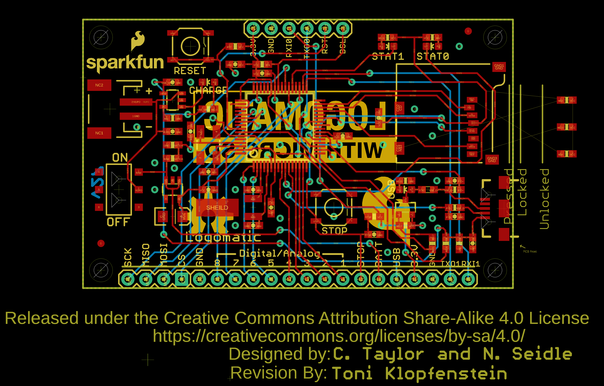
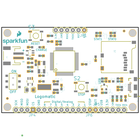
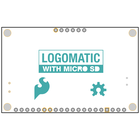
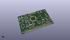
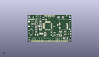
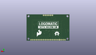
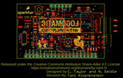
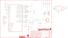
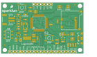
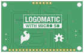

Contents
========

* [PRS12772 > Logomatic](#prs12772--logomatic)
	* [Schematic](#schematic)
	* [PCB](#pcb)
	* [Interactive BOM](#interactive-bom)
	* [OOMP Parts](#oomp-parts)
	* [Images](#images)
	* [Tags](#tags)
  
![][im]
# PRS12772 > Logomatic

- ID: PROJ-SPAR-12772-STAN-01
- Hex ID: PRS12772
- Name: Sparkfun
- Description: Sparkfun
- Long Link: [http://oom.lt/PROJ-SPAR-12772-STAN-01](http://oom.lt/PROJ-SPAR-12772-STAN-01)
- Short Link: [http://oom.lt/PRS12772](http://oom.lt/PRS12772)

## Schematic
  

## PCB
  

## Interactive BOM

- Interactive BOM page: [ibom.html](https://htmlpreview.github.io/?https://github.com/oomlout/oomlout_OOMP_projects/blob/main/PROJ-SPAR-12772-STAN-01/kicad/bom/ibom.html)

## OOMP Parts
  

|OOMP ID|Name|Identifier|
| :---: | :---: | :---: |
|[CAPC-0603-X-NF100-V50](https://github.com/oomlout/oomlout_OOMP_parts/tree/main/CAPC-0603-X-NF100-V50/)|[SMD (0603) 100 nF Capacitor (Ceramic) 50v](https://github.com/oomlout/oomlout_OOMP_parts/tree/main/CAPC-0603-X-NF100-V50/)|[C1, C2, C7, C8, C9, C10, C11, C12](https://github.com/oomlout/oomlout_OOMP_parts/tree/main/CAPC-0603-X-NF100-V50/)|
|CAPC-0603-X-PF18-01||C3, C4|
|[CAPC-0603-X-UF47D-V10](https://github.com/oomlout/oomlout_OOMP_parts/tree/main/CAPC-0603-X-UF47D-V10/)|[SMD (0603) 4.7 uF Capacitor (Ceramic) 10v](https://github.com/oomlout/oomlout_OOMP_parts/tree/main/CAPC-0603-X-UF47D-V10/)|[C5, C17](https://github.com/oomlout/oomlout_OOMP_parts/tree/main/CAPC-0603-X-UF47D-V10/)|
|[CAPT-3216-X-UF10-V10](https://github.com/oomlout/oomlout_OOMP_parts/tree/main/CAPT-3216-X-UF10-V10/)|[SMD (3216) 10 uF Capacitor (Tantalum) 10v](https://github.com/oomlout/oomlout_OOMP_parts/tree/main/CAPT-3216-X-UF10-V10/)|[C6](https://github.com/oomlout/oomlout_OOMP_parts/tree/main/CAPT-3216-X-UF10-V10/)|
|[CAPC-0603-X-PF22-V50](https://github.com/oomlout/oomlout_OOMP_parts/tree/main/CAPC-0603-X-PF22-V50/)|[SMD (0603) 22 pF Capacitor (Ceramic) 50v](https://github.com/oomlout/oomlout_OOMP_parts/tree/main/CAPC-0603-X-PF22-V50/)|[C13, C14, C15, C16](https://github.com/oomlout/oomlout_OOMP_parts/tree/main/CAPC-0603-X-PF22-V50/)|
|UNMATCHED-UNMATCHED-X-UNMATCHED-01||J1, Q1, Q2, S1, S2, S3, U4, X1|
|[HEAD-I01-X-PI06-01](https://github.com/oomlout/oomlout_OOMP_parts/tree/main/HEAD-I01-X-PI06-01/)|[2.54 mm 6 Pin Header](https://github.com/oomlout/oomlout_OOMP_parts/tree/main/HEAD-I01-X-PI06-01/)|[JP1, JP5](https://github.com/oomlout/oomlout_OOMP_parts/tree/main/HEAD-I01-X-PI06-01/)|
|HEAD-I01-X-UNMATCHED-01||JP2|
|[HEAD-I01-X-PI04-01](https://github.com/oomlout/oomlout_OOMP_parts/tree/main/HEAD-I01-X-PI04-01/)|[2.54 mm 4 Pin Header](https://github.com/oomlout/oomlout_OOMP_parts/tree/main/HEAD-I01-X-PI04-01/)|[JP4](https://github.com/oomlout/oomlout_OOMP_parts/tree/main/HEAD-I01-X-PI04-01/)|
|[HEAD-I01-X-PI10-01](https://github.com/oomlout/oomlout_OOMP_parts/tree/main/HEAD-I01-X-PI10-01/)|[2.54 mm 10 Pin Header](https://github.com/oomlout/oomlout_OOMP_parts/tree/main/HEAD-I01-X-PI10-01/)|[JP6](https://github.com/oomlout/oomlout_OOMP_parts/tree/main/HEAD-I01-X-PI10-01/)|
|[LEDS-0603-R-STAN-01](https://github.com/oomlout/oomlout_OOMP_parts/tree/main/LEDS-0603-R-STAN-01/)|[SMD (0603) Red LED](https://github.com/oomlout/oomlout_OOMP_parts/tree/main/LEDS-0603-R-STAN-01/)|[LED1, LED2](https://github.com/oomlout/oomlout_OOMP_parts/tree/main/LEDS-0603-R-STAN-01/)|
|[LEDS-0603-G-STAN-01](https://github.com/oomlout/oomlout_OOMP_parts/tree/main/LEDS-0603-G-STAN-01/)|[SMD (0603) Green LED](https://github.com/oomlout/oomlout_OOMP_parts/tree/main/LEDS-0603-G-STAN-01/)|[LED3, LED4](https://github.com/oomlout/oomlout_OOMP_parts/tree/main/LEDS-0603-G-STAN-01/)|
|UNMATCHED-SO23-X-UNMATCHED-01||Q4|
|RESE-UNMATCHED-X-O103-01||R1, R6, R7, R8, R13|
|RESE-0603-X-UNMATCHED-01||R2, R11|
|[RESE-0603-X-O331-01](https://github.com/oomlout/oomlout_OOMP_parts/tree/main/RESE-0603-X-O331-01/)|[SMD (0603) 330 Ohm Resistor](https://github.com/oomlout/oomlout_OOMP_parts/tree/main/RESE-0603-X-O331-01/)|[R3, R4, R5, R15](https://github.com/oomlout/oomlout_OOMP_parts/tree/main/RESE-0603-X-O331-01/)|
|[RESE-0603-X-O330-01](https://github.com/oomlout/oomlout_OOMP_parts/tree/main/RESE-0603-X-O330-01/)|[SMD (0603) 33 Ohm Resistor](https://github.com/oomlout/oomlout_OOMP_parts/tree/main/RESE-0603-X-O330-01/)|[R9, R10](https://github.com/oomlout/oomlout_OOMP_parts/tree/main/RESE-0603-X-O330-01/)|
|RESE-UNMATCHED-X-O102-01||R12|
|RESE-UNMATCHED-X-O1003-01||R14|
|RESE-UNMATCHED-X-O105-01||R16, R17|
|RESE-0603-X-O1003-01||R18, R19, R20|
|UNMATCHED-SO235-X-UNMATCHED-01||U1, U2|

## Images
  
  

|bominteractivefront|bominteractiveback|kicadPcb3d|kicadPcb3dFront|kicadPcb3dBack|eagleImage|eagleSchemImage|pcbdraw|pcbdrawback|
| :---: | :---: | :---: | :---: | :---: | :---: | :---: | :---: | :---: |
||||||||||

## Tags

- hexID: PRS12772
- oompType: PROJ
- oompSize: SPAR
- oompColor: 12772
- oompDesc: STAN
- oompIndex: 01
- oompName: Logomatic
- sources: All source files from https://github.com/sparkfun/Logomatic (source licence details in srcLicense.md)
- linkBuyPage: https://www.sparkfun.com/products/12772
- oompID: PROJ-SPAR-12772-STAN-01
- oompParts: C1,CAPC-0603-X-NF100-V50
- oompParts: C2,CAPC-0603-X-NF100-V50
- oompParts: C3,CAPC-0603-X-PF18-01
- oompParts: C4,CAPC-0603-X-PF18-01
- oompParts: C5,CAPC-0603-X-UF47D-V10
- oompParts: C6,CAPT-3216-X-UF10-V10
- oompParts: C7,CAPC-0603-X-NF100-V50
- oompParts: C8,CAPC-0603-X-NF100-V50
- oompParts: C9,CAPC-0603-X-NF100-V50
- oompParts: C10,CAPC-0603-X-NF100-V50
- oompParts: C11,CAPC-0603-X-NF100-V50
- oompParts: C12,CAPC-0603-X-NF100-V50
- oompParts: C13,CAPC-0603-X-PF22-V50
- oompParts: C14,CAPC-0603-X-PF22-V50
- oompParts: C15,CAPC-0603-X-PF22-V50
- oompParts: C16,CAPC-0603-X-PF22-V50
- oompParts: C17,CAPC-0603-X-UF47D-V10
- oompParts: J1,UNMATCHED-UNMATCHED-X-UNMATCHED-01
- oompParts: JP1,HEAD-I01-X-PI06-01
- oompParts: JP2,HEAD-I01-X-UNMATCHED-01
- oompParts: JP4,HEAD-I01-X-PI04-01
- oompParts: JP5,HEAD-I01-X-PI06-01
- oompParts: JP6,HEAD-I01-X-PI10-01
- oompParts: LED1,LEDS-0603-R-STAN-01
- oompParts: LED2,LEDS-0603-R-STAN-01
- oompParts: LED3,LEDS-0603-G-STAN-01
- oompParts: LED4,LEDS-0603-G-STAN-01
- oompParts: Q1,UNMATCHED-UNMATCHED-X-UNMATCHED-01
- oompParts: Q2,UNMATCHED-UNMATCHED-X-UNMATCHED-01
- oompParts: Q4,UNMATCHED-SO23-X-UNMATCHED-01
- oompParts: R1,RESE-UNMATCHED-X-O103-01
- oompParts: R2,RESE-0603-X-UNMATCHED-01
- oompParts: R3,RESE-0603-X-O331-01
- oompParts: R4,RESE-0603-X-O331-01
- oompParts: R5,RESE-0603-X-O331-01
- oompParts: R6,RESE-UNMATCHED-X-O103-01
- oompParts: R7,RESE-UNMATCHED-X-O103-01
- oompParts: R8,RESE-UNMATCHED-X-O103-01
- oompParts: R9,RESE-0603-X-O330-01
- oompParts: R10,RESE-0603-X-O330-01
- oompParts: R11,RESE-0603-X-UNMATCHED-01
- oompParts: R12,RESE-UNMATCHED-X-O102-01
- oompParts: R13,RESE-UNMATCHED-X-O103-01
- oompParts: R14,RESE-UNMATCHED-X-O1003-01
- oompParts: R15,RESE-0603-X-O331-01
- oompParts: R16,RESE-UNMATCHED-X-O105-01
- oompParts: R17,RESE-UNMATCHED-X-O105-01
- oompParts: R18,RESE-0603-X-O1003-01
- oompParts: R19,RESE-0603-X-O1003-01
- oompParts: R20,RESE-0603-X-O1003-01
- oompParts: S1,UNMATCHED-UNMATCHED-X-UNMATCHED-01
- oompParts: S2,UNMATCHED-UNMATCHED-X-UNMATCHED-01
- oompParts: S3,UNMATCHED-UNMATCHED-X-UNMATCHED-01
- oompParts: U1,UNMATCHED-SO235-X-UNMATCHED-01
- oompParts: U2,UNMATCHED-SO235-X-UNMATCHED-01
- oompParts: U4,UNMATCHED-UNMATCHED-X-UNMATCHED-01
- oompParts: X1,UNMATCHED-UNMATCHED-X-UNMATCHED-01
- rawParts: C1,0.1uF,0.1UF-25V(+80/-20%)(0603),0603-CAP,CAP-00810,CAP-00810,0.1uF,
- rawParts: C2,0.1uF,0.1UF-25V(+80/-20%)(0603),0603-CAP,CAP-00810,CAP-00810,0.1uF,
- rawParts: C3,18pF,18PF-50V-5%(0603),0603-CAP,CAP-08267,CAP-08267,18pF,
- rawParts: C4,18pF,18PF-50V-5%(0603),0603-CAP,CAP-08267,CAP-08267,18pF,
- rawParts: C5,4.7uF,4.7UF-6.3V-10%(0603)0603,0603-CAP,CAP-08280,CAP-08280,4.7uF,
- rawParts: C6,10uF,10UF-16V-10%(TANT),EIA3216,CAP-00811,CAP-00811,10uF,
- rawParts: C7,0.1uF,0.1UF-25V(+80/-20%)(0603),0603-CAP,CAP-00810,CAP-00810,0.1uF,
- rawParts: C8,0.1uF,0.1UF-25V(+80/-20%)(0603),0603-CAP,CAP-00810,CAP-00810,0.1uF,
- rawParts: C9,0.1uF,0.1UF-25V(+80/-20%)(0603),0603-CAP,CAP-00810,CAP-00810,0.1uF,
- rawParts: C10,0.1uF,0.1UF-25V(+80/-20%)(0603),0603-CAP,CAP-00810,CAP-00810,0.1uF,
- rawParts: C11,0.1uF,0.1UF-25V(+80/-20%)(0603),0603-CAP,CAP-00810,CAP-00810,0.1uF,
- rawParts: C12,0.1uF,0.1UF-25V(+80/-20%)(0603),0603-CAP,CAP-00810,CAP-00810,0.1uF,
- rawParts: C13,22pF,22PF-50V-5%(0603),0603-CAP,CAP-07876,CAP-07876,22pF,
- rawParts: C14,22pF,22PF-50V-5%(0603),0603-CAP,CAP-07876,CAP-07876,22pF,
- rawParts: C15,22pF,22PF-50V-5%(0603),0603-CAP,CAP-07876,CAP-07876,22pF,
- rawParts: C16,22pF,22PF-50V-5%(0603),0603-CAP,CAP-07876,CAP-07876,22pF,
- rawParts: C17,4.7uF,4.7UF-6.3V-10%(0603)0603,0603-CAP,CAP-08280,CAP-08280,4.7uF,
- rawParts: FRAME2,FRAME-LETTER,FRAME-LETTER,CREATIVE_COMMONS,Schematic Frame,,,
- rawParts: FRAME4,FRAME-LETTER,FRAME-LETTER,CREATIVE_COMMONS,Schematic Frame,,,
- rawParts: J1,USD_CONNECTOR,USD_CONNECTOR,MICRO-SD-SOCKET-PP,microSD Socket,CONN-07820,,
- rawParts: JP1,Prog,M06SIP,1X06,Header 6,,,
- rawParts: JP2,LiPo,M02-JST-2MM-SMT,JST-2-SMD,Header 2,,,
- rawParts: JP4,,M04PTH,1X04,Header 4,,,
- rawParts: JP5,,M06SIP,1X06,Header 6,,,
- rawParts: JP6,M100.1,M10,1X10,Header 10,,,
- rawParts: LED1,LED RED,LED-RED0603,LED-0603,Assorted Red LEDs,DIO-00819,RED,
- rawParts: LED2,RED,LED-RED0603,LED-0603,Assorted Red LEDs,DIO-00819,RED,
- rawParts: LED3,,LED-RED0603,LED-0603,Assorted Red LEDs,DIO-00819,RED,
- rawParts: LED4,GREEN,LED-GREEN0603,LED-0603,Various green LEDs,DIO-00821,GREEN,
- rawParts: LOGO1,OSHW-LOGOL,OSHW-LOGOL,OSHW-LOGO-L,Open Source Hardware Logo This logo indicates the piece of hardware it is found on incorporates a OSHW license and/or adheres to the definition of open source hardware found here: http://freedomdefined.org/OSHW,,,
- rawParts: LOGO2,SFE_LOGO_NAME.1_INCH,SFE_LOGO_NAME.1_INCH,SFE_LOGO_NAME_.1,SFE Logo, name only,,,
- rawParts: LOGO3,SFE_LOGO_FLAME.4_INCH,SFE_LOGO_FLAME.4_INCH,SFE_LOGO_FLAME_.4,SFE Logo, flame only,,,
- rawParts: Q1,12MHz,CRYSTAL5X3,CRYSTAL-SMD-5X3,Crystals,,,
- rawParts: Q2,32kHz,CRYSTAL32-SMD,CRYSTAL-32KHZ-SMD,Crystals,,,
- rawParts: Q4,TRANSISTOR_PNPSMD,TRANSISTOR_PNPSMD,SOT23-3,,,,
- rawParts: R1,10K,10KOHM1/10W1%(0603)0603,0603-RES@1,RES-00824,RES-00824,10K,
- rawParts: R2,2.0k,2.0KOHM1/10W5%(0603),0603-RES,RES-08296,RES-08296,2.0k,
- rawParts: R3,330,330OHM1/10W1%(0603),0603-RES,RES-00818,RES-00818,330,
- rawParts: R4,330,330OHM1/10W1%(0603),0603-RES,RES-00818,RES-00818,330,
- rawParts: R5,330,330OHM1/10W1%(0603),0603-RES,RES-00818,RES-00818,330,
- rawParts: R6,10K,10KOHM1/10W1%(0603)0603,0603-RES@1,RES-00824,RES-00824,10K,
- rawParts: R7,10K,10KOHM1/10W1%(0603)0603,0603-RES@1,RES-00824,RES-00824,10K,
- rawParts: R8,10k,10KOHM1/10W1%(0603)0603,0603-RES@1,RES-00824,RES-00824,10K,
- rawParts: R9,33,33OHM1/10W1%(0603),0603-RES,RES-08270,RES-08270,33,
- rawParts: R10,33,33OHM1/10W1%(0603),0603-RES,RES-08270,RES-08270,33,
- rawParts: R11,1.5k,1.5KOHM1/10W1%(0603),0603,RES-08306,RES-08306,1.5KOHM,
- rawParts: R12,1k,1KOHM1/10W1%(0603),0603-RES@1,RES-07856,RES-07856,1K,
- rawParts: R13,10k,10KOHM1/10W1%(0603)0603,0603-RES@1,RES-00824,RES-00824,10K,
- rawParts: R14,100k,100KOHM1/10W1%(0603),0603-RES@1,RES-07828,RES-07828,100k,
- rawParts: R15,330,330OHM1/10W1%(0603),0603-RES,RES-00818,RES-00818,330,
- rawParts: R16,1M,1MOHM1/10W1%(0603),0603-RES@1,RES-07868,RES-07868,,
- rawParts: R17,1M,1MOHM1/10W1%(0603),0603-RES@1,RES-07868,RES-07868,,
- rawParts: R18,100k,100KOHM-1/10W-1%(0603),0603-RES,RES-07828,RES-07828,100k,
- rawParts: R19,100k,100KOHM-1/10W-1%(0603),0603-RES,RES-07828,RES-07828,100k,
- rawParts: R20,100k,100KOHM-1/10W-1%(0603),0603-RES,RES-07828,RES-07828,100k,
- rawParts: S1,,SWITCH-SPSTSMD,AYZ0202,SPST Switch,,,
- rawParts: S2,Stop,TAC_SWITCHSND,TACTILE_SWITCH_SMD,Momentary Switch,,,
- rawParts: S3,Reset,TAC_SWITCHSND,TACTILE_SWITCH_SMD,Momentary Switch,,,
- rawParts: U$1,FIDUCIAL1X2,FIDUCIAL1X2,FIDUCIAL-1X2,Fiducial Alignment Points,,,
- rawParts: U$2,FIDUCIAL1X2,FIDUCIAL1X2,FIDUCIAL-1X2,Fiducial Alignment Points,,,
- rawParts: U$3,STAND-OFF,STAND-OFF,STAND-OFF,Stand Off,,,
- rawParts: U$4,STAND-OFF,STAND-OFF,STAND-OFF,Stand Off,,,
- rawParts: U$5,STAND-OFF,STAND-OFF,STAND-OFF,Stand Off,,,
- rawParts: U$6,LOGOMATIC_LOGO,LOGOMATIC_LOGO,LOGOMATIC_LOGO,Logo for the Logomatic boards.,,,
- rawParts: U$7,LOGO-SFESK,LOGO-SFESK,SFE-LOGO-FLAME,Spark Fun Electronics PCB Logo,,,
- rawParts: U$8,STAND-OFF,STAND-OFF,STAND-OFF,Stand Off,,,
- rawParts: U$10,REVISION,REVISION,REVISION,,,,
- rawParts: U1,MCP73831,MCP73831SMD,SOT23-5,,,,
- rawParts: U2,3.3V,V_REG_LDOSMD,SOT23-5,Voltage Regulator LDO,,,
- rawParts: U4,LPC213X,LPC213X,SQFP-S-10X10-64,LPC213x,,,
- rawParts: X1,USB_MICROB_PLUGCONN-11752,USB_MICROB_PLUGCONN-11752,USB-B-MICRO-SMD_V03,USB Micro-B Plug,CONN-11752,,

[im]: kicadPcb3d_450.png
