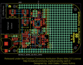
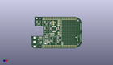
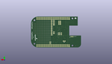
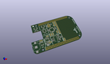

Contents
========

* [PROJ-SPAR-12773-STAN-01>CryptoCape](#proj-spar-12773-stan-01cryptocape)
	* [Images](#images)
	* [Interactive BOM](#interactive-bom)
	* [Tags](#tags)
  
![][im]
# PROJ-SPAR-12773-STAN-01>CryptoCape

- ID: PROJ-SPAR-12773-STAN-01
- Hex ID: PRS12773
- Name: CryptoCape
- Description: 

## Images
  
  

|eagleImage|kicadPcb3dFront|kicadPcb3dBack|kicadPcb3d|
| :---: | :---: | :---: | :---: |
|||||

## Interactive BOM

- Interactive BOM page: [ibom.html](kicad/bom/ibom.html)

## Tags

- hexID: PRS12773
- oompType: PROJ
- oompSize: SPAR
- oompColor: 12773
- oompDesc: STAN
- oompIndex: 01
- oompName: CryptoCape
- sources: All source files from https://github.com/sparkfun/CryptoCape (source licence details in srcLicense.md)
- linkBuyPage: https://www.sparkfun.com/products/12773
- oompID: PROJ-SPAR-12773-STAN-01
- oompParts: AES1,UNMATCHED-UNMATCHED-UNMATCHED-UNMATCHED-UNMATCHED
- oompParts: BAT1,UNMATCHED-UNMATCHED-UNMATCHED-UNMATCHED-UNMATCHED
- oompParts: C1,UNMATCHED-UNMATCHED-UNMATCHED-UNMATCHED-UNMATCHED
- oompParts: C2,UNMATCHED-UNMATCHED-UNMATCHED-UNMATCHED-UNMATCHED
- oompParts: C3,UNMATCHED-UNMATCHED-UNMATCHED-UNMATCHED-UNMATCHED
- oompParts: C4,UNMATCHED-UNMATCHED-UNMATCHED-UNMATCHED-UNMATCHED
- oompParts: C5,UNMATCHED-UNMATCHED-UNMATCHED-UNMATCHED-UNMATCHED
- oompParts: C6,UNMATCHED-UNMATCHED-UNMATCHED-UNMATCHED-UNMATCHED
- oompParts: C7,UNMATCHED-UNMATCHED-UNMATCHED-UNMATCHED-UNMATCHED
- oompParts: C8,UNMATCHED-UNMATCHED-UNMATCHED-UNMATCHED-UNMATCHED
- oompParts: C9,UNMATCHED-UNMATCHED-UNMATCHED-UNMATCHED-UNMATCHED
- oompParts: C10,UNMATCHED-UNMATCHED-UNMATCHED-UNMATCHED-UNMATCHED
- oompParts: C11,UNMATCHED-UNMATCHED-UNMATCHED-UNMATCHED-UNMATCHED
- oompParts: C12,UNMATCHED-UNMATCHED-UNMATCHED-UNMATCHED-UNMATCHED
- oompParts: C13,UNMATCHED-UNMATCHED-UNMATCHED-UNMATCHED-UNMATCHED
- oompParts: C14,UNMATCHED-UNMATCHED-UNMATCHED-UNMATCHED-UNMATCHED
- oompParts: D1,UNMATCHED-UNMATCHED-UNMATCHED-UNMATCHED-UNMATCHED
- oompParts: ECC1,UNMATCHED-UNMATCHED-UNMATCHED-UNMATCHED-UNMATCHED
- oompParts: FRAME1,UNMATCHED-UNMATCHED-UNMATCHED-UNMATCHED-UNMATCHED
- oompParts: J1,UNMATCHED-UNMATCHED-UNMATCHED-UNMATCHED-UNMATCHED
- oompParts: JP1,UNMATCHED-UNMATCHED-UNMATCHED-UNMATCHED-UNMATCHED
- oompParts: JP2,UNMATCHED-UNMATCHED-UNMATCHED-UNMATCHED-UNMATCHED
- oompParts: JP3,UNMATCHED-UNMATCHED-UNMATCHED-UNMATCHED-UNMATCHED
- oompParts: JP4,UNMATCHED-UNMATCHED-UNMATCHED-UNMATCHED-UNMATCHED
- oompParts: JP5,UNMATCHED-UNMATCHED-UNMATCHED-UNMATCHED-UNMATCHED
- oompParts: JP6,UNMATCHED-UNMATCHED-UNMATCHED-UNMATCHED-UNMATCHED
- oompParts: JP7,UNMATCHED-UNMATCHED-UNMATCHED-UNMATCHED-UNMATCHED
- oompParts: JP8,UNMATCHED-UNMATCHED-UNMATCHED-UNMATCHED-UNMATCHED
- oompParts: JP13,UNMATCHED-UNMATCHED-UNMATCHED-UNMATCHED-UNMATCHED
- oompParts: JP14,UNMATCHED-UNMATCHED-UNMATCHED-UNMATCHED-UNMATCHED
- oompParts: R1,UNMATCHED-UNMATCHED-UNMATCHED-UNMATCHED-UNMATCHED
- oompParts: R2,UNMATCHED-UNMATCHED-UNMATCHED-UNMATCHED-UNMATCHED
- oompParts: R6,UNMATCHED-UNMATCHED-UNMATCHED-UNMATCHED-UNMATCHED
- oompParts: R7,UNMATCHED-UNMATCHED-UNMATCHED-UNMATCHED-UNMATCHED
- oompParts: R8,UNMATCHED-UNMATCHED-UNMATCHED-UNMATCHED-UNMATCHED
- oompParts: R9,UNMATCHED-UNMATCHED-UNMATCHED-UNMATCHED-UNMATCHED
- oompParts: R10,UNMATCHED-UNMATCHED-UNMATCHED-UNMATCHED-UNMATCHED
- oompParts: R11,UNMATCHED-UNMATCHED-UNMATCHED-UNMATCHED-UNMATCHED
- oompParts: R12,UNMATCHED-UNMATCHED-UNMATCHED-UNMATCHED-UNMATCHED
- oompParts: RTC1,UNMATCHED-UNMATCHED-UNMATCHED-UNMATCHED-UNMATCHED
- oompParts: SHA1,UNMATCHED-UNMATCHED-UNMATCHED-UNMATCHED-UNMATCHED
- oompParts: SJ1,UNMATCHED-UNMATCHED-UNMATCHED-UNMATCHED-UNMATCHED
- oompParts: TPM1,UNMATCHED-UNMATCHED-UNMATCHED-UNMATCHED-UNMATCHED
- oompParts: U$2,UNMATCHED-UNMATCHED-UNMATCHED-UNMATCHED-UNMATCHED
- oompParts: U1,UNMATCHED-UNMATCHED-UNMATCHED-UNMATCHED-UNMATCHED
- oompParts: U2,UNMATCHED-UNMATCHED-UNMATCHED-UNMATCHED-UNMATCHED
- oompParts: U3,UNMATCHED-UNMATCHED-UNMATCHED-UNMATCHED-UNMATCHED
- oompParts: Y2,UNMATCHED-UNMATCHED-UNMATCHED-UNMATCHED-UNMATCHED
- rawParts: AES1,ATAES132,ATAES132,SOIC8,32Kb Serial EEPROM.,,,
- rawParts: BAT1,3V,BATTERY12MM,BATTCON_12MM,Battery Holders,,,
- rawParts: C1,0.1u,0.1UF-25V(+80/-20%)(0603),0603-CAP,CAP-00810,CAP-00810,0.1uF,
- rawParts: C2,.1uf,0.1UF-25V(+80/-20%)(0603),0603-CAP,CAP-00810,CAP-00810,0.1uF,
- rawParts: C3,0.1uF,0.1UF-25V(+80/-20%)(0603),0603-CAP,CAP-00810,CAP-00810,0.1uF,
- rawParts: C4,0.1uF,0.1UF-25V(+80/-20%)(0603),0603-CAP,CAP-00810,CAP-00810,0.1uF,
- rawParts: C5,.1uf,0.1UF-25V(+80/-20%)(0603),0603-CAP,CAP-00810,CAP-00810,0.1uF,
- rawParts: C6,0.1uF,0.1UF-25V(+80/-20%)(0603),0603-CAP,CAP-00810,CAP-00810,0.1uF,
- rawParts: C7,2200pf,2.2NF/2200PF-50V-10%(0603),0603-CAP,CAP-07877,CAP-07877,2.2nF,
- rawParts: C8,2200pf,2.2NF/2200PF-50V-10%(0603),0603-CAP,CAP-07877,CAP-07877,2.2nF,
- rawParts: C9,0.1uF,0.1UF-25V(+80/-20%)(0603),0603-CAP,CAP-00810,CAP-00810,0.1uF,
- rawParts: C10,0.1uF,0.1UF-25V(+80/-20%)(0603),0603-CAP,CAP-00810,CAP-00810,0.1uF,
- rawParts: C11,.1uf,0.1UF-25V(+80/-20%)(0603),0603-CAP,CAP-00810,CAP-00810,0.1uF,
- rawParts: C12,2200pf,2.2NF/2200PF-50V-10%(0603),0603-CAP,CAP-07877,CAP-07877,2.2nF,
- rawParts: C13,2200pf,2.2NF/2200PF-50V-10%(0603),0603-CAP,CAP-07877,CAP-07877,2.2nF,
- rawParts: C14,0.1uF,0.1UF-25V(+80/-20%)(0603),0603-CAP,CAP-00810,CAP-00810,0.1uF,
- rawParts: D1,GREEN,LED-GREEN0603,LED-0603,Various green LEDs,DIO-00821,GREEN,
- rawParts: ECC1,ATECC108,ATECC108,SOIC8,ATECC108: Provides ECDSA with NIST curves P256, B283, and K283.  Also, a RNG, 8.5Kb EEPROM.  2.0V - 5.5V.,,,
- rawParts: FID1,FIDUCIAL1X2,FIDUCIAL1X2,FIDUCIAL-1X2,Fiducial Alignment Points,,,
- rawParts: FID2,FIDUCIAL1X2,FIDUCIAL1X2,FIDUCIAL-1X2,Fiducial Alignment Points,,,
- rawParts: FRAME1,FRAME-LEDGER,FRAME-LEDGER,CREATIVE_COMMONS,Schematic Frame,,,
- rawParts: J1,AVR_SPI_PRG_6PTH,AVR_SPI_PRG_6PTH,2X3,AVR ISP 6 Pin,,,
- rawParts: JP1,Clears A0,JUMPER-2SMD-NO,SJ_2S-NO,Jumper,,,
- rawParts: JP2,Clears A1,JUMPER-2SMD-NO,SJ_2S-NO,Jumper,,,
- rawParts: JP3,Serial Program JMP,JUMPER-2PTH,1X02,Jumper,,,
- rawParts: JP4,Serial Program JMP,JUMPER-2PTH,1X02,Jumper,,,
- rawParts: JP5,M11PTH,M11PTH,1X11,Header 11,,,
- rawParts: JP6,,M04PTH,1X04,Header 4,,,
- rawParts: JP7,M02PTH,M02PTH,1X02,Standard 2-pin 0.1 header. Use with,,,
- rawParts: JP8,M02PTH,M02PTH,1X02,Standard 2-pin 0.1 header. Use with,,,
- rawParts: JP13,Jump for Read/Write,JUMPER-2PTH,1X02,Jumper,,,
- rawParts: JP14,,JUMPER-2PTH,1X02,Jumper,,,
- rawParts: R1,10k,10KOHM1/10W1%(0603)0603,0603-RES,RES-00824,RES-00824,10K,
- rawParts: R2,1k,1K-1%,0603-RES,1k-ohm SMT,RES-07856,1k,
- rawParts: R6,4.7K,4.7KOHM1/10W1%(0603),0603,RES-07857,RES-07857,,
- rawParts: R7,4.7k,4.7KOHM1/10W1%(0603),0603,RES-07857,RES-07857,,
- rawParts: R8,4.7k,4.7KOHM1/10W1%(0603),0603,RES-07857,RES-07857,,
- rawParts: R9,4.7k,4.7KOHM1/10W1%(0603),0603,RES-07857,RES-07857,,
- rawParts: R10,4.7k,4.7KOHM1/10W1%(0603),0603,RES-07857,RES-07857,,
- rawParts: R11,4.7k,4.7KOHM1/10W1%(0603),0603,RES-07857,RES-07857,,
- rawParts: R12,10k,10KOHM1/10W1%(0603)0603,0603-RES,RES-00824,RES-00824,10K,
- rawParts: RTC1,DS3231M,DS3231M,SOIC8,DS3231M Real Time Clock.  Accuracy +/-5ppm.  Battery Backup.  2.3V to 5.5V.,,,
- rawParts: SHA1,ATSHA204,ATSHA204,SOIC8,ATSHA204,,,
- rawParts: SJ1,Pull Up Res Jmp,SOLDERJUMPER_2WAYPASTE1&2&3,SJ_3_PASTE1&2&3,Solder Jumper,,,
- rawParts: TPM1,AT97SC3204T,AT97SC3204T,TSSOP28,Atmel TPM 1.2,,,
- rawParts: U$2,BEAGLE_BONE_BLACK_CAPE,BEAGLE_BONE_BLACK_CAPE,BEAGLE_BONE_BLACK_CAPE,,,,
- rawParts: U1,33mhz,OSCILLATOR,CRYSTAL-OSC-SMD-5X3.2,Generic 5x3.2 Oscillator,,,
- rawParts: U2,ATMEGA328P,ATMEGA328_SMT,TQFP32-08,32-Pin Atmega328 part,IC-09069,ATMEGA328P,
- rawParts: U3,EEPROM-I2CSMD,EEPROM-I2CSMD,SO08,I2C EEPROM chips, 24LC256 (and others),,,
- rawParts: Y2,8MHZ,RESONATOR8MHZ,RESONATOR-SMD,Resonator,XTAL-08895,8MHZ,

[im]: kicadPcb3d_450.png
