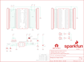

Contents
========

* [PRS12774 > Sparkfun](#prs12774--sparkfun)
	* [Schematic](#schematic)
	* [Interactive BOM](#interactive-bom)
	* [OOMP Parts](#oomp-parts)
	* [Images](#images)
	* [Tags](#tags)
  
![][im]
# PRS12774 > Sparkfun

- ID: PROJ-SPAR-12774-STAN-01
- Hex ID: PRS12774
- Name: Sparkfun
- Description: Sparkfun
- Long Link: [http://oom.lt/PROJ-SPAR-12774-STAN-01](http://oom.lt/PROJ-SPAR-12774-STAN-01)
- Short Link: [http://oom.lt/PRS12774](http://oom.lt/PRS12774)

## Schematic
  

## Interactive BOM

- Interactive BOM page: [ibom.html](https://htmlpreview.github.io/?https://github.com/oomlout/oomlout_OOMP_projects/blob/main/PROJ-SPAR-12774-STAN-01/kicad/bom/ibom.html)

## OOMP Parts
  

|OOMP Parts|
| :---: |
|C1,CAPC-0603-X-NF100-V50,C1,0.1uF,0.1UF-25V(+80/-20%)(0603),0603-CAP,CAP-00810,CAP-00810,0.1uF,|
|D1,LEDS-0603-G-STAN-01,D1,RED,LED-RED0603,LED-0603,Assorted Red LEDs,DIO-00819,RED,|
|D2,LEDS-0603-G-STAN-01,D2,RED,LED-RED0603,LED-0603,Assorted Red LEDs,DIO-00819,RED,|
|JP1,HEAD-I01-X-PI01-01,FID1,FIDUCIAL1X2,FIDUCIAL1X2,FIDUCIAL-1X2,Fiducial Alignment Points,,,|
|JP2,HEAD-I01-X-PI01-01,FID2,FIDUCIAL1X2,FIDUCIAL1X2,FIDUCIAL-1X2,Fiducial Alignment Points,,,|
|R1,RESE-UNMATCHED-X-UNMATCHED-01,FRAME1,FRAME-LETTER,FRAME-LETTER,CREATIVE_COMMONS,Schematic Frame,,,|
|R2,RESE-UNMATCHED-X-UNMATCHED-01,JP1,M01PTH,M01PTH,1X01,Header 1,,,|
|R3,RESE-UNMATCHED-X-UNMATCHED-01,JP2,M01PTH,M01PTH,1X01,Header 1,,,|
|R4,RESE-UNMATCHED-X-UNMATCHED-01,LOGO2,OSHW-LOGOS,OSHW-LOGOS,OSHW-LOGO-S,Open Source Hardware Logo This logo indicates the piece of hardware it is found on incorporates a OSHW license and/or adheres to the definition of open source hardware found here: http://freedomdefined.org/OSHW,,,|
|R5,RESE-UNMATCHED-X-UNMATCHED-01,LOGO3,SFE_LOGO_NAME_FLAME.1_INCH,SFE_LOGO_NAME_FLAME.1_INCH,SFE_LOGO_NAME_FLAME_.1,SFE Logo, name and flame,,,|
|R6,RESE-0603-X-O103-01,R1,4.7k,4.7KOHM1/10W1%(0603),0603@1,RES-07857,RES-07857,,|
|R7,RESE-0603-X-O102-01,R2,4.7k,4.7KOHM1/10W1%(0603),0603@1,RES-07857,RES-07857,,|
|R8,RESE-0603-X-O102-01,R3,4.7k,4.7KOHM1/10W1%(0603),0603@1,RES-07857,RES-07857,,|
|SJ1,UNMATCHED-UNMATCHED-X-UNMATCHED-01,R4,4.7k,4.7KOHM1/10W1%(0603),0603@1,RES-07857,RES-07857,,|
|SJ3,UNMATCHED-UNMATCHED-X-UNMATCHED-01,R5,4.7k,4.7KOHM1/10W1%(0603),0603@1,RES-07857,RES-07857,,|
|SJ4,UNMATCHED-UNMATCHED-X-UNMATCHED-01,R6,10k,10KOHM1/10W1%(0603)0603,0603-RES,RES-00824,RES-00824,10K,|
|SJ5,UNMATCHED-UNMATCHED-X-UNMATCHED-01,R7,1K,1KOHM1/10W1%(0603),0603-RES,RES-07856,RES-07856,1K,|
|U$1,UNMATCHED-UNMATCHED-X-UNMATCHED-01,R8,1K,1KOHM1/10W1%(0603),0603-RES,RES-07856,RES-07856,1K,|
|U$2,UNMATCHED-UNMATCHED-X-UNMATCHED-01,SJ1,I2C EN,JUMPER-SMT_3_2-NC_PASTE_SILK,SMT-JUMPER_3_2-NC_PASTE_SILK,Normally closed solder jumper (2 of 2 connections),,,|
|U$3,UNMATCHED-UNMATCHED-X-UNMATCHED-01,SJ3,A1,JUMPER-SMT_2_NO_SILK,SMT-JUMPER_2_NO_SILK,Normally open jumper,,,|
|U$4,UNMATCHED-UNMATCHED-X-UNMATCHED-01,SJ4,A0,JUMPER-SMT_2_NO_SILK,SMT-JUMPER_2_NO_SILK,Normally open jumper,,,|
|U$5,UNMATCHED-UNMATCHED-X-UNMATCHED-01,SJ5,WP,JUMPER-SMT_2_NO_SILK,SMT-JUMPER_2_NO_SILK,Normally open jumper,,,|
|U1,UNMATCHED-UNMATCHED-X-UNMATCHED-01,U$1,BEAGLE_BONE_BLACK_CAPE,BEAGLE_BONE_BLACK_CAPE,BEAGLE_BONE_BLACK_CAPE,,,,|

## Images
  
  

|kicadPcb3d|kicadPcb3dFront|kicadPcb3dBack|eagleImage|eagleSchemImage|
| :---: | :---: | :---: | :---: | :---: |
||||||

## Tags

- hexID: PRS12774
- oompType: PROJ
- oompSize: SPAR
- oompColor: 12774
- oompDesc: STAN
- oompIndex: 01
- oompName: BeagleBone Black Proto Cape
- sources: All source files from https://github.com/sparkfun/BeagleBone_Black_Proto_Cape (source licence details in srcLicense.md)
- linkBuyPage: https://www.sparkfun.com/products/12774
- oompID: PROJ-SPAR-12774-STAN-01
- oompParts: C1,CAPC-0603-X-NF100-V50
- oompParts: D1,LEDS-0603-G-STAN-01
- oompParts: D2,LEDS-0603-G-STAN-01
- oompParts: JP1,HEAD-I01-X-PI01-01
- oompParts: JP2,HEAD-I01-X-PI01-01
- oompParts: R1,RESE-UNMATCHED-X-UNMATCHED-01
- oompParts: R2,RESE-UNMATCHED-X-UNMATCHED-01
- oompParts: R3,RESE-UNMATCHED-X-UNMATCHED-01
- oompParts: R4,RESE-UNMATCHED-X-UNMATCHED-01
- oompParts: R5,RESE-UNMATCHED-X-UNMATCHED-01
- oompParts: R6,RESE-0603-X-O103-01
- oompParts: R7,RESE-0603-X-O102-01
- oompParts: R8,RESE-0603-X-O102-01
- oompParts: SJ1,UNMATCHED-UNMATCHED-X-UNMATCHED-01
- oompParts: SJ3,UNMATCHED-UNMATCHED-X-UNMATCHED-01
- oompParts: SJ4,UNMATCHED-UNMATCHED-X-UNMATCHED-01
- oompParts: SJ5,UNMATCHED-UNMATCHED-X-UNMATCHED-01
- oompParts: U$1,UNMATCHED-UNMATCHED-X-UNMATCHED-01
- oompParts: U$2,UNMATCHED-UNMATCHED-X-UNMATCHED-01
- oompParts: U$3,UNMATCHED-UNMATCHED-X-UNMATCHED-01
- oompParts: U$4,UNMATCHED-UNMATCHED-X-UNMATCHED-01
- oompParts: U$5,UNMATCHED-UNMATCHED-X-UNMATCHED-01
- oompParts: U1,UNMATCHED-UNMATCHED-X-UNMATCHED-01
- rawParts: C1,0.1uF,0.1UF-25V(+80/-20%)(0603),0603-CAP,CAP-00810,CAP-00810,0.1uF,
- rawParts: D1,RED,LED-RED0603,LED-0603,Assorted Red LEDs,DIO-00819,RED,
- rawParts: D2,RED,LED-RED0603,LED-0603,Assorted Red LEDs,DIO-00819,RED,
- rawParts: FID1,FIDUCIAL1X2,FIDUCIAL1X2,FIDUCIAL-1X2,Fiducial Alignment Points,,,
- rawParts: FID2,FIDUCIAL1X2,FIDUCIAL1X2,FIDUCIAL-1X2,Fiducial Alignment Points,,,
- rawParts: FRAME1,FRAME-LETTER,FRAME-LETTER,CREATIVE_COMMONS,Schematic Frame,,,
- rawParts: JP1,M01PTH,M01PTH,1X01,Header 1,,,
- rawParts: JP2,M01PTH,M01PTH,1X01,Header 1,,,
- rawParts: LOGO2,OSHW-LOGOS,OSHW-LOGOS,OSHW-LOGO-S,Open Source Hardware Logo This logo indicates the piece of hardware it is found on incorporates a OSHW license and/or adheres to the definition of open source hardware found here: http://freedomdefined.org/OSHW,,,
- rawParts: LOGO3,SFE_LOGO_NAME_FLAME.1_INCH,SFE_LOGO_NAME_FLAME.1_INCH,SFE_LOGO_NAME_FLAME_.1,SFE Logo, name and flame,,,
- rawParts: R1,4.7k,4.7KOHM1/10W1%(0603),0603@1,RES-07857,RES-07857,,
- rawParts: R2,4.7k,4.7KOHM1/10W1%(0603),0603@1,RES-07857,RES-07857,,
- rawParts: R3,4.7k,4.7KOHM1/10W1%(0603),0603@1,RES-07857,RES-07857,,
- rawParts: R4,4.7k,4.7KOHM1/10W1%(0603),0603@1,RES-07857,RES-07857,,
- rawParts: R5,4.7k,4.7KOHM1/10W1%(0603),0603@1,RES-07857,RES-07857,,
- rawParts: R6,10k,10KOHM1/10W1%(0603)0603,0603-RES,RES-00824,RES-00824,10K,
- rawParts: R7,1K,1KOHM1/10W1%(0603),0603-RES,RES-07856,RES-07856,1K,
- rawParts: R8,1K,1KOHM1/10W1%(0603),0603-RES,RES-07856,RES-07856,1K,
- rawParts: SJ1,I2C EN,JUMPER-SMT_3_2-NC_PASTE_SILK,SMT-JUMPER_3_2-NC_PASTE_SILK,Normally closed solder jumper (2 of 2 connections),,,
- rawParts: SJ3,A1,JUMPER-SMT_2_NO_SILK,SMT-JUMPER_2_NO_SILK,Normally open jumper,,,
- rawParts: SJ4,A0,JUMPER-SMT_2_NO_SILK,SMT-JUMPER_2_NO_SILK,Normally open jumper,,,
- rawParts: SJ5,WP,JUMPER-SMT_2_NO_SILK,SMT-JUMPER_2_NO_SILK,Normally open jumper,,,
- rawParts: U$1,BEAGLE_BONE_BLACK_CAPE,BEAGLE_BONE_BLACK_CAPE,BEAGLE_BONE_BLACK_CAPE,,,,
- rawParts: U$2,M23,M23,1X23,,,,
- rawParts: U$3,M23,M23,1X23,,,,
- rawParts: U$4,M23,M23,1X23,,,,
- rawParts: U$5,M23,M23,1X23,,,,
- rawParts: U1,EEPROM-I2CSMD,EEPROM-I2CSMD,SO08,I2C EEPROM chips, 24LC256 (and others),,,

[im]: kicadPcb3d_450.png
