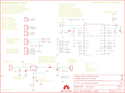

Contents
========

* [PRS12779 > Easy Driver](#prs12779--easy-driver)
	* [Schematic](#schematic)
	* [PCB](#pcb)
	* [Interactive BOM](#interactive-bom)
	* [OOMP Parts](#oomp-parts)
	* [Images](#images)
	* [Tags](#tags)
  
![][im]
# PRS12779 > Easy Driver

- ID: PROJ-SPAR-12779-STAN-01
- Hex ID: PRS12779
- Name: Sparkfun
- Description: Sparkfun
- Long Link: [http://oom.lt/PROJ-SPAR-12779-STAN-01](http://oom.lt/PROJ-SPAR-12779-STAN-01)
- Short Link: [http://oom.lt/PRS12779](http://oom.lt/PRS12779)

## Schematic
  

## PCB
  

## Interactive BOM

- Interactive BOM page: [ibom.html](https://htmlpreview.github.io/?https://github.com/oomlout/oomlout_OOMP_projects/blob/main/PROJ-SPAR-12779-STAN-01/kicad/bom/ibom.html)

## OOMP Parts
  

|OOMP Parts|
| :---: |
|C1 C1,CAPC-0603-X-UNMATCHED-01|
|C2 C2,CAPC-0603-X-UF1-01|
|C3 C3,CAPX-UNMATCHED-X-UF47-01|
|C4 C4,CAPC-0603-X-PF680-01|
|C5 C5,CAPC-0603-X-PF680-01|
|IC1 IC1,UNMATCHED-UNMATCHED-X-UNMATCHED-01|
|IC2 IC2,UNMATCHED-UNMATCHED-X-UNMATCHED-01|
|[JP1 HEAD-I01-X-PI02-01 2.54 mm 2 Pin Header](https://github.com/oomlout/oomlout_OOMP_parts/tree/main/HEAD-I01-X-PI02-01/)|
|[JP2 HEAD-I01-X-PI03-01 2.54 mm 3 Pin Header](https://github.com/oomlout/oomlout_OOMP_parts/tree/main/HEAD-I01-X-PI03-01/)|
|[JP3 HEAD-I01-X-PI04-01 2.54 mm 4 Pin Header](https://github.com/oomlout/oomlout_OOMP_parts/tree/main/HEAD-I01-X-PI04-01/)|
|[JP4 HEAD-I01-X-PI02-01 2.54 mm 2 Pin Header](https://github.com/oomlout/oomlout_OOMP_parts/tree/main/HEAD-I01-X-PI02-01/)|
|[JP5 HEAD-I01-X-PI02-01 2.54 mm 2 Pin Header](https://github.com/oomlout/oomlout_OOMP_parts/tree/main/HEAD-I01-X-PI02-01/)|
|[JP6 HEAD-I01-X-PI02-01 2.54 mm 2 Pin Header](https://github.com/oomlout/oomlout_OOMP_parts/tree/main/HEAD-I01-X-PI02-01/)|
|[JP7 HEAD-I01-X-PI02-01 2.54 mm 2 Pin Header](https://github.com/oomlout/oomlout_OOMP_parts/tree/main/HEAD-I01-X-PI02-01/)|
|[PWR_LED LEDS-0603-G-STAN-01 SMD (0603) Green LED](https://github.com/oomlout/oomlout_OOMP_parts/tree/main/LEDS-0603-G-STAN-01/)|
|R1 R1,RESE-0805-X-UNMATCHED-01|
|R2 R2,RESE-0805-X-UNMATCHED-01|
|[R3 RESE-0603-X-O203-01 SMD (0603) 20k Ohm Resistor](https://github.com/oomlout/oomlout_OOMP_parts/tree/main/RESE-0603-X-O203-01/)|
|[R4 RESE-0603-X-O203-01 SMD (0603) 20k Ohm Resistor](https://github.com/oomlout/oomlout_OOMP_parts/tree/main/RESE-0603-X-O203-01/)|
|R5 R5,RESE-0603-X-UNMATCHED-01|
|[R6 RESE-0603-X-O391-01 SMD (0603) 390 Ohm Resistor](https://github.com/oomlout/oomlout_OOMP_parts/tree/main/RESE-0603-X-O391-01/)|
|[R7 RESE-0603-X-O331-01 SMD (0603) 330 Ohm Resistor](https://github.com/oomlout/oomlout_OOMP_parts/tree/main/RESE-0603-X-O331-01/)|
|[R8 RESE-0603-X-O241-01 SMD (0603) 240 Ohm Resistor](https://github.com/oomlout/oomlout_OOMP_parts/tree/main/RESE-0603-X-O241-01/)|
|[R9 RESE-0603-X-O102-01 SMD (0603) 1k Ohm Resistor](https://github.com/oomlout/oomlout_OOMP_parts/tree/main/RESE-0603-X-O102-01/)|
|[R10 RESE-0603-X-O103-01 SMD (0603) 10k Ohm Resistor](https://github.com/oomlout/oomlout_OOMP_parts/tree/main/RESE-0603-X-O103-01/)|
|[R11 RESE-0603-X-O103-01 SMD (0603) 10k Ohm Resistor](https://github.com/oomlout/oomlout_OOMP_parts/tree/main/RESE-0603-X-O103-01/)|
|[R12 RESE-0603-X-O103-01 SMD (0603) 10k Ohm Resistor](https://github.com/oomlout/oomlout_OOMP_parts/tree/main/RESE-0603-X-O103-01/)|
|[R13 RESE-0603-X-O103-01 SMD (0603) 10k Ohm Resistor](https://github.com/oomlout/oomlout_OOMP_parts/tree/main/RESE-0603-X-O103-01/)|
|[R14 RESE-0603-X-O103-01 SMD (0603) 10k Ohm Resistor](https://github.com/oomlout/oomlout_OOMP_parts/tree/main/RESE-0603-X-O103-01/)|
|[R15 RESE-0603-X-O103-01 SMD (0603) 10k Ohm Resistor](https://github.com/oomlout/oomlout_OOMP_parts/tree/main/RESE-0603-X-O103-01/)|
|R16 R16,RESE-UNMATCHED-X-O103-01|
|R17 R17,RESE-0603-X-UNMATCHED-01|
|[R18 RESE-0603-X-O102-01 SMD (0603) 1k Ohm Resistor](https://github.com/oomlout/oomlout_OOMP_parts/tree/main/RESE-0603-X-O102-01/)|
|[R19 RESE-0603-X-O102-01 SMD (0603) 1k Ohm Resistor](https://github.com/oomlout/oomlout_OOMP_parts/tree/main/RESE-0603-X-O102-01/)|
|[R20 RESE-0603-X-O103-01 SMD (0603) 10k Ohm Resistor](https://github.com/oomlout/oomlout_OOMP_parts/tree/main/RESE-0603-X-O103-01/)|
|[R21 RESE-0603-X-O103-01 SMD (0603) 10k Ohm Resistor](https://github.com/oomlout/oomlout_OOMP_parts/tree/main/RESE-0603-X-O103-01/)|

## Images
  
  

|kicadPcb3d|kicadPcb3dFront|kicadPcb3dBack|eagleImage|eagleSchemImage|
| :---: | :---: | :---: | :---: | :---: |
||||||

## Tags

- hexID: PRS12779
- oompType: PROJ
- oompSize: SPAR
- oompColor: 12779
- oompDesc: STAN
- oompIndex: 01
- oompName: Easy Driver
- sources: All source files from https://github.com/sparkfun/Easy_Driver (source licence details in srcLicense.md)
- linkBuyPage: https://www.sparkfun.com/products/12779
- oompID: PROJ-SPAR-12779-STAN-01
- oompParts: C1,CAPC-0603-X-UNMATCHED-01
- oompParts: C2,CAPC-0603-X-UF1-01
- oompParts: C3,CAPX-UNMATCHED-X-UF47-01
- oompParts: C4,CAPC-0603-X-PF680-01
- oompParts: C5,CAPC-0603-X-PF680-01
- oompParts: IC1,UNMATCHED-UNMATCHED-X-UNMATCHED-01
- oompParts: IC2,UNMATCHED-UNMATCHED-X-UNMATCHED-01
- oompParts: JP1,HEAD-I01-X-PI02-01
- oompParts: JP2,HEAD-I01-X-PI03-01
- oompParts: JP3,HEAD-I01-X-PI04-01
- oompParts: JP4,HEAD-I01-X-PI02-01
- oompParts: JP5,HEAD-I01-X-PI02-01
- oompParts: JP6,HEAD-I01-X-PI02-01
- oompParts: JP7,HEAD-I01-X-PI02-01
- oompParts: PWR_LED,LEDS-0603-G-STAN-01
- oompParts: R1,RESE-0805-X-UNMATCHED-01
- oompParts: R2,RESE-0805-X-UNMATCHED-01
- oompParts: R3,RESE-0603-X-O203-01
- oompParts: R4,RESE-0603-X-O203-01
- oompParts: R5,RESE-0603-X-UNMATCHED-01
- oompParts: R6,RESE-0603-X-O391-01
- oompParts: R7,RESE-0603-X-O331-01
- oompParts: R8,RESE-0603-X-O241-01
- oompParts: R9,RESE-0603-X-O102-01
- oompParts: R10,RESE-0603-X-O103-01
- oompParts: R11,RESE-0603-X-O103-01
- oompParts: R12,RESE-0603-X-O103-01
- oompParts: R13,RESE-0603-X-O103-01
- oompParts: R14,RESE-0603-X-O103-01
- oompParts: R15,RESE-0603-X-O103-01
- oompParts: R16,RESE-UNMATCHED-X-O103-01
- oompParts: R17,RESE-0603-X-UNMATCHED-01
- oompParts: R18,RESE-0603-X-O102-01
- oompParts: R19,RESE-0603-X-O102-01
- oompParts: R20,RESE-0603-X-O103-01
- oompParts: R21,RESE-0603-X-O103-01
- rawParts: C1,.1uF,CAP0603-CAP,0603-CAP,Capacitor,,
- rawParts: C2,1uf,CAP0603-CAP,0603-CAP,Capacitor,,
- rawParts: C3,47uF,CPOL-USD,PANASONIC_D,POLARIZED CAPACITOR, American symbol,,
- rawParts: C4,680pF,CAP0603-CAP,0603-CAP,Capacitor,,
- rawParts: C5,680pF,CAP0603-CAP,0603-CAP,Capacitor,,
- rawParts: FID1,FIDUCIAL1X2,FIDUCIAL1X2,FIDUCIAL-1X2,Fiducial Alignment Points,,
- rawParts: FID2,FIDUCIAL1X2,FIDUCIAL1X2,FIDUCIAL-1X2,Fiducial Alignment Points,,
- rawParts: FRAME2,FRAME-LETTER,FRAME-LETTER,CREATIVE_COMMONS,Schematic Frame,,
- rawParts: IC1,A3967SLB,A3967SLB,SO24W,ANALOG DEVICES,,
- rawParts: IC2,V_REG_317SMD,V_REG_317SMD,SOT223,Voltage Regulator,,
- rawParts: JP1,,M021X02_NO_SILK,1X02_NO_SILK,Header 2,,
- rawParts: JP2,,M031X03_NO_SILK,1X03_NO_SILK,Header 3,,
- rawParts: JP3,,M041X04_NO_SILK,1X04_NO_SILK,Header 4,,
- rawParts: JP4,,M021X02_NO_SILK,1X02_NO_SILK,Header 2,,
- rawParts: JP5,,M021X02_NO_SILK,1X02_NO_SILK,Header 2,,
- rawParts: JP6,,M021X02_NO_SILK,1X02_NO_SILK,Header 2,,
- rawParts: JP7,,M021X02_NO_SILK,1X02_NO_SILK,Header 2,,
- rawParts: JP8,STAND-OFF,STAND-OFF,STAND-OFF,Stand Off,,
- rawParts: JP9,STAND-OFF,STAND-OFF,STAND-OFF,Stand Off,,
- rawParts: LOGO1,OSHW-LOGOS,OSHW-LOGOS,OSHW-LOGO-S,Open Source Hardware Logo This logo indicates the piece of hardware it is found on incorporates a OSHW license and/or adheres to the definition of open source hardware found here: http://freedomdefined.org/OSHW,,
- rawParts: PWR_LED,YELLOW,LED-YELLOW0603,LED-0603,Yellow SMD LEDs,DIO-09003,
- rawParts: R1,.75,RESISTOR0805-RES,0805,Resistor,,
- rawParts: R2,.75,RESISTOR0805-RES,0805,Resistor,,
- rawParts: R3,20K,RESISTOR0603,0603-RES,Resistor,,
- rawParts: R4,20K,RESISTOR0603,0603-RES,Resistor,,
- rawParts: R5,2.49K,RESISTOR0603,0603-RES,Resistor,,
- rawParts: R6,390,RESISTOR0603,0603-RES,Resistor,,
- rawParts: R7,330,RESISTOR0603,0603-RES,Resistor,,
- rawParts: R8,240,RESISTOR0603,0603-RES,Resistor,,
- rawParts: R9,1K,RESISTOR0603,0603-RES,Resistor,,
- rawParts: R10,10K,RESISTOR0603,0603-RES,Resistor,,
- rawParts: R11,10K,RESISTOR0603,0603-RES,Resistor,,
- rawParts: R12,10K,RESISTOR0603,0603-RES,Resistor,,
- rawParts: R13,10K,RESISTOR0603,0603-RES,Resistor,,
- rawParts: R14,10K,RESISTOR0603,0603-RES,Resistor,,
- rawParts: R15,10K,RESISTOR0603,0603-RES,Resistor,,
- rawParts: R16,10K,TRIMPOT3MM-2,TRIMPOT-3MM-2,Various small potentiometers for set-and-forget applications,,
- rawParts: R17,6.8K,RESISTOR0603,0603-RES,Resistor,,
- rawParts: R18,1K,RESISTOR0603,0603-RES,Resistor,,
- rawParts: R19,1K,RESISTOR0603,0603-RES,Resistor,,
- rawParts: R20,10K,RESISTOR0603,0603-RES,Resistor,,
- rawParts: R21,10K,RESISTOR0603,0603-RES,Resistor,,
- rawParts: SJ1,SOLDERJUMPERTRACE,SOLDERJUMPERTRACE,SJ_2S-TRACE,Solder Jumper,,
- rawParts: SJ2,SOLDERJUMPERNO,SOLDERJUMPERNO,SJ_2S-NO,Solder Jumper,,
- rawParts: TP1,TEST-POINTTP_15TH_THRU,TEST-POINTTP_15TH_THRU,TP_15TH,Bare copper test points for troubleshooting or ICT,,
- rawParts: U$2,LOGO-SFENEW,LOGO-SFENEW,SFE-NEW-WEBLOGO,Spark Fun Electronics PCB Logo,,

[im]: kicadPcb3d_450.png
