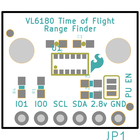
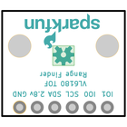
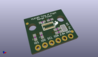
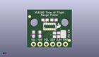
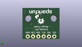
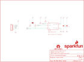
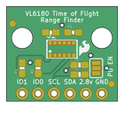
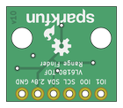

Contents
========

* [PRS12784 > ToF Range Finder Breakout-VL6180](#prs12784--tof-range-finder-breakout-vl6180)
	* [Schematic](#schematic)
	* [PCB](#pcb)
	* [Interactive BOM](#interactive-bom)
	* [OOMP Parts](#oomp-parts)
	* [Images](#images)
	* [Tags](#tags)
  
![][im]
# PRS12784 > ToF Range Finder Breakout-VL6180

- ID: PROJ-SPAR-12784-STAN-01
- Hex ID: PRS12784
- Name: Sparkfun
- Description: Sparkfun
- Long Link: [http://oom.lt/PROJ-SPAR-12784-STAN-01](http://oom.lt/PROJ-SPAR-12784-STAN-01)
- Short Link: [http://oom.lt/PRS12784](http://oom.lt/PRS12784)

## Schematic
  

## PCB
  

## Interactive BOM

- Interactive BOM page: [ibom.html](https://htmlpreview.github.io/?https://github.com/oomlout/oomlout_OOMP_projects/blob/main/PROJ-SPAR-12784-STAN-01/kicad/bom/ibom.html)

## OOMP Parts
  

|OOMP Parts|
| :---: |
|[CAPC-0603-X-UF47D-V10  SMD (0603) 4.7 uF Capacitor (Ceramic) 10v  C1](https://github.com/oomlout/oomlout_OOMP_parts/tree/main/CAPC-0603-X-UF47D-V10/)|
|[CAPC-0603-X-NF100-V50  SMD (0603) 100 nF Capacitor (Ceramic) 50v  C2](https://github.com/oomlout/oomlout_OOMP_parts/tree/main/CAPC-0603-X-NF100-V50/)|
|[HEAD-I01-X-PI06-01  2.54 mm 6 Pin Header  JP1](https://github.com/oomlout/oomlout_OOMP_parts/tree/main/HEAD-I01-X-PI06-01/)|
|[RESE-0603-X-O473-01  SMD (0603) 47k Ohm Resistor  R1, R4](https://github.com/oomlout/oomlout_OOMP_parts/tree/main/RESE-0603-X-O473-01/)|
|[RESE-0603-X-O222-01  SMD (0603) 2.2k Ohm Resistor  R2, R3](https://github.com/oomlout/oomlout_OOMP_parts/tree/main/RESE-0603-X-O222-01/)|
|UNMATCHED-UNMATCHED-X-UNMATCHED-01 U1|

## Images
  
  

|bominteractivefront|bominteractiveback|kicadPcb3d|kicadPcb3dFront|kicadPcb3dBack|eagleImage|eagleSchemImage|pcbdraw|pcbdrawback|
| :---: | :---: | :---: | :---: | :---: | :---: | :---: | :---: | :---: |
||||||||||

## Tags

- hexID: PRS12784
- oompType: PROJ
- oompSize: SPAR
- oompColor: 12784
- oompDesc: STAN
- oompIndex: 01
- oompName: ToF Range Finder Breakout-VL6180
- sources: All source files from https://github.com/sparkfun/ToF_Range_Finder_Breakout-VL6180 (source licence details in srcLicense.md)
- linkBuyPage: https://www.sparkfun.com/products/12784
- oompID: PROJ-SPAR-12784-STAN-01
- oompParts: C1,CAPC-0603-X-UF47D-V10
- oompParts: C2,CAPC-0603-X-NF100-V50
- oompParts: JP1,HEAD-I01-X-PI06-01
- oompParts: R1,RESE-0603-X-O473-01
- oompParts: R2,RESE-0603-X-O222-01
- oompParts: R3,RESE-0603-X-O222-01
- oompParts: R4,RESE-0603-X-O473-01
- oompParts: U1,UNMATCHED-UNMATCHED-X-UNMATCHED-01
- rawParts: C1,4.7uF,4.7UF-6.3V-10%(0603)0603,0603-CAP,CAP-08280,CAP-08280,4.7uF,
- rawParts: C2,0.1uF,0.1UF-25V(+80/-20%)(0603),0603-CAP,CAP-00810,CAP-00810,0.1uF,
- rawParts: FID1,FIDUCIAL1X2,FIDUCIAL1X2,FIDUCIAL-1X2,Fiducial Alignment Points,,,
- rawParts: FID2,FIDUCIAL1X2,FIDUCIAL1X2,FIDUCIAL-1X2,Fiducial Alignment Points,,,
- rawParts: FRAME1,FRAME-LETTER,FRAME-LETTER,CREATIVE_COMMONS,Schematic Frame,,,
- rawParts: JP1,,M06SIP,1X06,Header 6,,,
- rawParts: LOGO1,SFE_LOGO_NAME_FLAME.1_INCH,SFE_LOGO_NAME_FLAME.1_INCH,SFE_LOGO_NAME_FLAME_.1,SFE Logo, name and flame,,,
- rawParts: LOGO2,OSHW-LOGOS,OSHW-LOGOS,OSHW-LOGO-S,Open Source Hardware Logo This logo indicates the piece of hardware it is found on incorporates a OSHW license and/or adheres to the definition of open source hardware found here: http://freedomdefined.org/OSHW,,,
- rawParts: R1,47K,47KOHM1/10W1%(0603),0603-RES,RES-07871,RES-07871,47K,
- rawParts: R2,2.2k,2.2KOHM1/10W1%(0603),0603-RES,RES-08272,RES-08272,2.2k,
- rawParts: R3,2.2k,2.2KOHM1/10W1%(0603),0603-RES,RES-08272,RES-08272,2.2k,
- rawParts: R4,47K,47KOHM1/10W1%(0603),0603-RES,RES-07871,RES-07871,47K,
- rawParts: SJ1,,JUMPER-PAD-3-NC_BY_PASTE,PAD-JUMPER-3-NC_BY_PASTE_YES_SILK_FULL_BOX,,,,
- rawParts: STANDOFF1,STAND-OFF,STAND-OFF,STAND-OFF,#4 Stand Off,,,
- rawParts: STANDOFF2,STAND-OFF,STAND-OFF,STAND-OFF,#4 Stand Off,,,
- rawParts: U1,VL6180,VL6180,VL6180,,IC-12007,,

[im]: kicadPcb3d_450.png
