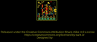
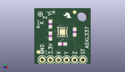
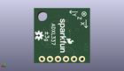
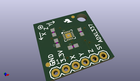

Contents
========

* [PROJ-SPAR-12786-STAN-01>ADXL337 Breakout](#proj-spar-12786-stan-01adxl337-breakout)
	* [Images](#images)
	* [Interactive BOM](#interactive-bom)
	* [OOMP Parts](#oomp-parts)
	* [Tags](#tags)
  
![][im]
# PROJ-SPAR-12786-STAN-01>ADXL337 Breakout

- ID: PROJ-SPAR-12786-STAN-01
- Hex ID: PRS12786
- Name: ADXL337 Breakout
- Description: 

## Images
  
  

|eagleImage|kicadPcb3dFront|kicadPcb3dBack|kicadPcb3d|
| :---: | :---: | :---: | :---: |
|||||

## Interactive BOM

- Interactive BOM page: [ibom.html](kicad/bom/ibom.html)

## OOMP Parts
  

|OOMP Parts|
| :---: |
|CAPC-0603-X-UNMATCHED-01, C1, 8.889999999999999, 6.35, 0,C1, 10nF, 0603-CAP, SparkFun-Capacitors, (0.35, 0.25), R0|
|CAPC-0603-X-UNMATCHED-01, C2, 5.08, 8.889999999999999, 90,C2, 10nF, 0603-CAP, SparkFun-Capacitors, (0.2, 0.35), R90|
|CAPC-0603-X-UNMATCHED-01, C3, 5.08, 12.7, 270,C3, 10nF, 0603-CAP, SparkFun-Capacitors, (0.2, 0.5), R270|
|<table><tr><td></td><td> C4</td><td>[CAPC-0603-X-NF100-V50 SMD (0603) 100 nF Capacitor (Ceramic) 50v](https://github.com/oomlout/oomlout_OOMP_parts/tree/main/CAPC-0603-X-NF100-V50/)</td><td>[C6N100](https://github.com/oomlout/oomlout_OOMP_parts/tree/main/CAPC-0603-X-NF100-V50/)</td></tr></table>|
|<table><tr><td></td><td> JP1</td><td>[HEAD-I01-X-PI06-01 2.54 mm 6 Pin Header](https://github.com/oomlout/oomlout_OOMP_parts/tree/main/HEAD-I01-X-PI06-01/)</td><td>[H06](https://github.com/oomlout/oomlout_OOMP_parts/tree/main/HEAD-I01-X-PI06-01/)</td></tr></table>|
|UNMATCHED-UNMATCHED-X-UNMATCHED-01, U1, 8.889999999999999, 10.16, 0,U1, ADXL337, LFCSP_LQ-16, SparkFun-Sensors, (0.35, 0.4), R0|

## Tags

- hexID: PRS12786
- oompType: PROJ
- oompSize: SPAR
- oompColor: 12786
- oompDesc: STAN
- oompIndex: 01
- oompName: ADXL337 Breakout
- sources: All source files from https://github.com/sparkfun/ADXL337_Breakout (source licence details in srcLicense.md)
- linkBuyPage: https://www.sparkfun.com/products/12786
- oompID: PROJ-SPAR-12786-STAN-01
- oompPart: CAPC-0603-X-UNMATCHED-01, C1, 8.889999999999999, 6.35, 0
- oompPart: CAPC-0603-X-UNMATCHED-01, C2, 5.08, 8.889999999999999, 90
- oompPart: CAPC-0603-X-UNMATCHED-01, C3, 5.08, 12.7, 270
- oompPart: CAPC-0603-X-NF100-V50, C4, 12.7, 10.16, 270
- oompPart: SKIP-UNMATCHED-X-UNMATCHED-01, FID1, 12.7, 16.509999999999998, 0
- oompPart: SKIP-UNMATCHED-X-UNMATCHED-01, FID2, 1.27, 3.8099999999999996, 0
- oompPart: HEAD-I01-X-PI06-01, JP1, 2.54, 1.27, 0
- oompPart: UNMATCHED-UNMATCHED-X-UNMATCHED-01, U1, 8.889999999999999, 10.16, 0
- rawPart: C1, 10nF, 0603-CAP, SparkFun-Capacitors, (0.35, 0.25), R0
- rawPart: C2, 10nF, 0603-CAP, SparkFun-Capacitors, (0.2, 0.35), R90
- rawPart: C3, 10nF, 0603-CAP, SparkFun-Capacitors, (0.2, 0.5), R270
- rawPart: C4, 0.1uF, 0603-CAP, SparkFun-Capacitors, (0.5, 0.4), R270
- rawPart: FID1, FIDUCIAL1X2, FIDUCIAL-1X2, SparkFun-Aesthetics, (0.5, 0.65), R0
- rawPart: FID2, FIDUCIAL1X2, FIDUCIAL-1X2, SparkFun-Aesthetics, (0.05, 0.15), R0
- rawPart: JP1, 1X06, SparkFun-Connectors, (0.1, 0.05), R0
- rawPart: U1, ADXL337, LFCSP_LQ-16, SparkFun-Sensors, (0.35, 0.4), R0

[im]: kicadPcb3d_450.png
