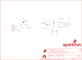

Contents
========

* [PRS12787 > Sparkfun](#prs12787--sparkfun)
	* [Schematic](#schematic)
	* [Interactive BOM](#interactive-bom)
	* [OOMP Parts](#oomp-parts)
	* [Images](#images)
	* [Tags](#tags)
  
![][im]
# PRS12787 > Sparkfun

- ID: PROJ-SPAR-12787-STAN-01
- Hex ID: PRS12787
- Name: Sparkfun
- Description: Sparkfun
- Long Link: [http://oom.lt/PROJ-SPAR-12787-STAN-01](http://oom.lt/PROJ-SPAR-12787-STAN-01)
- Short Link: [http://oom.lt/PRS12787](http://oom.lt/PRS12787)

## Schematic
  

## Interactive BOM

- Interactive BOM page: [ibom.html](https://htmlpreview.github.io/?https://github.com/oomlout/oomlout_OOMP_projects/blob/main/PROJ-SPAR-12787-STAN-01/kicad/bom/ibom.html)

## OOMP Parts
  

|OOMP Parts|
| :---: |
|C1,CAPX-UNMATCHED-X-UF100-01,C1,100uF,100UF-10V-10%(TANT),EIA7343,CAP-07890,CAP-07890,100uF,|
|C2,CAPC-0603-X-UNMATCHED-01,C2,1.0uF,1.0UF-16V-10%(0603),0603-CAP,CAP-00868,CAP-00868,1.0uF,|
|C3,CAPC-0603-X-UNMATCHED-01,C3,1.0uF,1.0UF-16V-10%(0603),0603-CAP,CAP-00868,CAP-00868,1.0uF,|
|JP1,HEAD-I01-X-PI06-01,FID1,FIDUCIAL1X2,FIDUCIAL1X2,FIDUCIAL-1X2,Fiducial Alignment Points,,,|
|R1,RESE-0603-X-O103-01,FID2,FIDUCIAL1X2,FIDUCIAL1X2,FIDUCIAL-1X2,Fiducial Alignment Points,,,|
|R2,RESE-0603-X-UNMATCHED-01,FRAME1,FRAME-LETTER,FRAME-LETTER,CREATIVE_COMMONS,Schematic Frame,,,|
|R3,RESE-0603-X-UNMATCHED-01,JP1,,M06SIP,1X06,Header 6,,,|
|R4,RESE-0603-X-UNMATCHED-01,LOGO1,SFE_LOGO_FLAME.1_INCH,SFE_LOGO_FLAME.1_INCH,SFE_LOGO_FLAME_.1,SFE Logo, flame only,,,|
|U1,UNMATCHED-UNMATCHED-X-UNMATCHED-01,LOGO2,OSHW-LOGOS,OSHW-LOGOS,OSHW-LOGO-S,Open Source Hardware Logo This logo indicates the piece of hardware it is found on incorporates a OSHW license and/or adheres to the definition of open source hardware found here: http://freedomdefined.org/OSHW,,,|

## Images
  
  

|kicadPcb3d|kicadPcb3dFront|kicadPcb3dBack|eagleImage|eagleSchemImage|
| :---: | :---: | :---: | :---: | :---: |
||||||

## Tags

- hexID: PRS12787
- oompType: PROJ
- oompSize: SPAR
- oompColor: 12787
- oompDesc: STAN
- oompIndex: 01
- oompName: APDS-9960 RGB and Gesture Sensor
- sources: All source files from https://github.com/sparkfun/APDS-9960_RGB_and_Gesture_Sensor (source licence details in srcLicense.md)
- linkBuyPage: https://www.sparkfun.com/products/12787
- oompID: PROJ-SPAR-12787-STAN-01
- oompParts: C1,CAPX-UNMATCHED-X-UF100-01
- oompParts: C2,CAPC-0603-X-UNMATCHED-01
- oompParts: C3,CAPC-0603-X-UNMATCHED-01
- oompParts: JP1,HEAD-I01-X-PI06-01
- oompParts: R1,RESE-0603-X-O103-01
- oompParts: R2,RESE-0603-X-UNMATCHED-01
- oompParts: R3,RESE-0603-X-UNMATCHED-01
- oompParts: R4,RESE-0603-X-UNMATCHED-01
- oompParts: U1,UNMATCHED-UNMATCHED-X-UNMATCHED-01
- rawParts: C1,100uF,100UF-10V-10%(TANT),EIA7343,CAP-07890,CAP-07890,100uF,
- rawParts: C2,1.0uF,1.0UF-16V-10%(0603),0603-CAP,CAP-00868,CAP-00868,1.0uF,
- rawParts: C3,1.0uF,1.0UF-16V-10%(0603),0603-CAP,CAP-00868,CAP-00868,1.0uF,
- rawParts: FID1,FIDUCIAL1X2,FIDUCIAL1X2,FIDUCIAL-1X2,Fiducial Alignment Points,,,
- rawParts: FID2,FIDUCIAL1X2,FIDUCIAL1X2,FIDUCIAL-1X2,Fiducial Alignment Points,,,
- rawParts: FRAME1,FRAME-LETTER,FRAME-LETTER,CREATIVE_COMMONS,Schematic Frame,,,
- rawParts: JP1,,M06SIP,1X06,Header 6,,,
- rawParts: LOGO1,SFE_LOGO_FLAME.1_INCH,SFE_LOGO_FLAME.1_INCH,SFE_LOGO_FLAME_.1,SFE Logo, flame only,,,
- rawParts: LOGO2,OSHW-LOGOS,OSHW-LOGOS,OSHW-LOGO-S,Open Source Hardware Logo This logo indicates the piece of hardware it is found on incorporates a OSHW license and/or adheres to the definition of open source hardware found here: http://freedomdefined.org/OSHW,,,
- rawParts: R1,10k,10KOHM1/10W1%(0603)0603,0603-RES,RES-00824,RES-00824,10K,
- rawParts: R2,4.7k,4.7KOHM1/10W1%(0603),0603,RES-07857,RES-07857,,
- rawParts: R3,4.7k,4.7KOHM1/10W1%(0603),0603,RES-07857,RES-07857,,
- rawParts: R4,DNP,RESISTOR0603,0603-RES,Resistor,,,
- rawParts: SJ1,,SOLDERJUMPER_2WAYPASTE1&2&3,SJ_3_PASTE1&2&3,Solder Jumper,,,
- rawParts: SJ2,SOLDERJUMPERNC,SOLDERJUMPERNC,SJ_2S,Solder Jumper,,,
- rawParts: STANDOFF1,STAND-OFF,STAND-OFF,STAND-OFF,#4 Stand Off,,,
- rawParts: STANDOFF2,STAND-OFF,STAND-OFF,STAND-OFF,#4 Stand Off,,,
- rawParts: U$1,SFE_LOGO_NAME_FLAME.1_INCH,SFE_LOGO_NAME_FLAME.1_INCH,SFE_LOGO_NAME_FLAME_.1,SFE Logo, name and flame,,,
- rawParts: U1,APDS-9960,APDS-9960,APDS-9960,Avago APDS-9960 digital proximity, ambient light, RGB, and gesture sensor.,SEN-12005,,

[im]: kicadPcb3d_450.png
