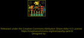
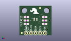
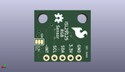
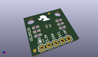

Contents
========

* [PROJ-SPAR-12829-STAN-01>ISL29125 Breakout](#proj-spar-12829-stan-01isl29125-breakout)
	* [Images](#images)
	* [Interactive BOM](#interactive-bom)
	* [OOMP Parts](#oomp-parts)
	* [Tags](#tags)
  
![][im]
# PROJ-SPAR-12829-STAN-01>ISL29125 Breakout

- ID: PROJ-SPAR-12829-STAN-01
- Hex ID: PRS12829
- Name: ISL29125 Breakout
- Description: 

## Images
  
  

|eagleImage|kicadPcb3dFront|kicadPcb3dBack|kicadPcb3d|
| :---: | :---: | :---: | :---: |
|||||

## Interactive BOM

- Interactive BOM page: [ibom.html](kicad/bom/ibom.html)

## OOMP Parts
  

|OOMP Parts|
| :---: |
|<table><tr><td></td><td> C1</td><td>[CAPC-0603-X-NF100-V50 SMD (0603) 100 nF Capacitor (Ceramic) 50v](https://github.com/oomlout/oomlout_OOMP_parts/tree/main/CAPC-0603-X-NF100-V50/)</td><td>[C6N100](https://github.com/oomlout/oomlout_OOMP_parts/tree/main/CAPC-0603-X-NF100-V50/)</td></tr></table>|
|CAPC-0603-X-UNMATCHED-01, C2, 3.8099999999999996, 10.16, 0,C2, 1.0uF, 0603-CAP, SparkFun-Capacitors, (0.15, 0.4), R0|
|<table><tr><td></td><td> JP1</td><td>[HEAD-I01-X-PI05-01 2.54 mm 5 Pin Header](https://github.com/oomlout/oomlout_OOMP_parts/tree/main/HEAD-I01-X-PI05-01/)</td><td>[H05](https://github.com/oomlout/oomlout_OOMP_parts/tree/main/HEAD-I01-X-PI05-01/)</td></tr></table>|
|RESE-0603-X-UNMATCHED-01, R1, 3.8099999999999996, 6.35, 0,R1, 100, 0603-RES, SparkFun-Resistors, (0.15, 0.25), R0|
|<table><tr><td></td><td> R2</td><td>[RESE-0603-X-O103-01 SMD (0603) 10k Ohm Resistor](https://github.com/oomlout/oomlout_OOMP_parts/tree/main/RESE-0603-X-O103-01/)</td><td>[R6103](https://github.com/oomlout/oomlout_OOMP_parts/tree/main/RESE-0603-X-O103-01/)</td></tr></table>|
|<table><tr><td></td><td> R3</td><td>[RESE-0603-X-O103-01 SMD (0603) 10k Ohm Resistor](https://github.com/oomlout/oomlout_OOMP_parts/tree/main/RESE-0603-X-O103-01/)</td><td>[R6103](https://github.com/oomlout/oomlout_OOMP_parts/tree/main/RESE-0603-X-O103-01/)</td></tr></table>|
|<table><tr><td></td><td> R4</td><td>[RESE-0603-X-O103-01 SMD (0603) 10k Ohm Resistor](https://github.com/oomlout/oomlout_OOMP_parts/tree/main/RESE-0603-X-O103-01/)</td><td>[R6103](https://github.com/oomlout/oomlout_OOMP_parts/tree/main/RESE-0603-X-O103-01/)</td></tr></table>|
|UNMATCHED-UNMATCHED-X-UNMATCHED-01, U1, 8.889999999999999, 8.889999999999999, 0,U1, ISL29125, ODFN-LD-6, SparkFun-Sensors, (0.35, 0.35), R0|

## Tags

- hexID: PRS12829
- oompType: PROJ
- oompSize: SPAR
- oompColor: 12829
- oompDesc: STAN
- oompIndex: 01
- oompName: ISL29125 Breakout
- sources: All source files from https://github.com/sparkfun/ISL29125_Breakout (source licence details in srcLicense.md)
- linkBuyPage: https://www.sparkfun.com/products/12829
- oompID: PROJ-SPAR-12829-STAN-01
- oompPart: CAPC-0603-X-NF100-V50, C1, 3.8099999999999996, 8.254999999999999, 0
- oompPart: CAPC-0603-X-UNMATCHED-01, C2, 3.8099999999999996, 10.16, 0
- oompPart: SKIP-UNMATCHED-X-UNMATCHED-01, FID1, 11.43, 15.239999999999998, 0
- oompPart: SKIP-UNMATCHED-X-UNMATCHED-01, FID2, 1.27, 1.27, 0
- oompPart: HEAD-I01-X-PI05-01, JP1, 3.8099999999999996, 1.27, 0
- oompPart: RESE-0603-X-UNMATCHED-01, R1, 3.8099999999999996, 6.35, 0
- oompPart: RESE-0603-X-O103-01, R2, 13.97, 6.35, 0
- oompPart: RESE-0603-X-O103-01, R3, 13.97, 8.254999999999999, 0
- oompPart: RESE-0603-X-O103-01, R4, 13.97, 10.16, 0
- oompPart: SKIP-UNMATCHED-X-UNMATCHED-01, SJ2, 16.256, 6.35, M0
- oompPart: UNMATCHED-UNMATCHED-X-UNMATCHED-01, U1, 8.889999999999999, 8.889999999999999, 0
- rawPart: C1, 0.1uF, 0603-CAP, SparkFun-Capacitors, (0.15, 0.325), R0
- rawPart: C2, 1.0uF, 0603-CAP, SparkFun-Capacitors, (0.15, 0.4), R0
- rawPart: FID1, FIDUCIAL1X2, FIDUCIAL-1X2, SparkFun-Aesthetics, (0.45, 0.6), R0
- rawPart: FID2, FIDUCIAL1X2, FIDUCIAL-1X2, SparkFun-Aesthetics, (0.05, 0.05), R0
- rawPart: JP1, 1X05, SparkFun-Connectors, (0.15, 0.05), R0
- rawPart: R1, 100, 0603-RES, SparkFun-Resistors, (0.15, 0.25), R0
- rawPart: R2, 10K, 0603-RES, SparkFun-Resistors, (0.55, 0.25), R0
- rawPart: R3, 10K, 0603-RES, SparkFun-Resistors, (0.55, 0.325), R0
- rawPart: R4, 10K, 0603-RES, SparkFun-Resistors, (0.55, 0.4), R0
- rawPart: SJ2, SJ_3, SparkFun-Passives, (0.64, 0.25), MR0
- rawPart: U1, ISL29125, ODFN-LD-6, SparkFun-Sensors, (0.35, 0.35), R0

[im]: kicadPcb3d_450.png
