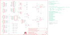

Contents
========

* [PRS12858 > Vernier Interface Shield](#prs12858--vernier-interface-shield)
	* [Schematic](#schematic)
	* [PCB](#pcb)
	* [Interactive BOM](#interactive-bom)
	* [OOMP Parts](#oomp-parts)
	* [Images](#images)
	* [Tags](#tags)
  
![][im]
# PRS12858 > Vernier Interface Shield

- ID: PROJ-SPAR-12858-STAN-01
- Hex ID: PRS12858
- Name: Sparkfun
- Description: Sparkfun
- Long Link: [http://oom.lt/PROJ-SPAR-12858-STAN-01](http://oom.lt/PROJ-SPAR-12858-STAN-01)
- Short Link: [http://oom.lt/PRS12858](http://oom.lt/PRS12858)

## Schematic
  

## PCB
  

## Interactive BOM

- Interactive BOM page: [ibom.html](https://htmlpreview.github.io/?https://github.com/oomlout/oomlout_OOMP_projects/blob/main/PROJ-SPAR-12858-STAN-01/kicad/bom/ibom.html)

## OOMP Parts
  

|OOMP Parts|
| :---: |
|[CAPC-0603-X-NF100-V50  SMD (0603) 100 nF Capacitor (Ceramic) 50v  C1, C2](https://github.com/oomlout/oomlout_OOMP_parts/tree/main/CAPC-0603-X-NF100-V50/)|
|[HEAD-I01-X-PI10-01  2.54 mm 10 Pin Header  JP1](https://github.com/oomlout/oomlout_OOMP_parts/tree/main/HEAD-I01-X-PI10-01/)|
|[HEAD-I01-X-PI08-01  2.54 mm 8 Pin Header  JP2, JP3](https://github.com/oomlout/oomlout_OOMP_parts/tree/main/HEAD-I01-X-PI08-01/)|
|[HEAD-I01-X-PI06-01  2.54 mm 6 Pin Header  JP4, JP12](https://github.com/oomlout/oomlout_OOMP_parts/tree/main/HEAD-I01-X-PI06-01/)|
|HEAD-I01-X-UNMATCHED-01 JP5, JP6, JP7, JP8|
|[HEAD-I01-X-PI03-01  2.54 mm 3 Pin Header  JP9, JP10](https://github.com/oomlout/oomlout_OOMP_parts/tree/main/HEAD-I01-X-PI03-01/)|
|[HEAD-I01-X-PI02-01  2.54 mm 2 Pin Header  JP11](https://github.com/oomlout/oomlout_OOMP_parts/tree/main/HEAD-I01-X-PI02-01/)|
|LEDS-UNMATCHED-G-STAN-01 LED1|
|[RESE-0603-X-O103-01  SMD (0603) 10k Ohm Resistor  R1, R5, R6, R7, R11, R12, R13, R15, R17, R18, R20](https://github.com/oomlout/oomlout_OOMP_parts/tree/main/RESE-0603-X-O103-01/)|
|[RESE-0603-X-O203-01  SMD (0603) 20k Ohm Resistor  R2, R3, R4, R8, R9, R10](https://github.com/oomlout/oomlout_OOMP_parts/tree/main/RESE-0603-X-O203-01/)|
|[RESE-0603-X-O153-01  SMD (0603) 16k Ohm Resistor  R14, R16](https://github.com/oomlout/oomlout_OOMP_parts/tree/main/RESE-0603-X-O153-01/)|
|[RESE-0603-X-O331-01  SMD (0603) 330 Ohm Resistor  R19](https://github.com/oomlout/oomlout_OOMP_parts/tree/main/RESE-0603-X-O331-01/)|
|UNMATCHED-UNMATCHED-X-UNMATCHED-01 S3, S4, U1, U2|

## Images
  
  

|bominteractivefront|bominteractiveback|kicadPcb3d|kicadPcb3dFront|kicadPcb3dBack|eagleImage|eagleSchemImage|pcbdraw|pcbdrawback|
| :---: | :---: | :---: | :---: | :---: | :---: | :---: | :---: | :---: |
||||||||||

## Tags

- hexID: PRS12858
- oompType: PROJ
- oompSize: SPAR
- oompColor: 12858
- oompDesc: STAN
- oompIndex: 01
- oompName: Vernier Interface Shield
- sources: All source files from https://github.com/sparkfun/Vernier_Interface_Shield (source licence details in srcLicense.md)
- linkBuyPage: https://www.sparkfun.com/products/12858
- oompID: PROJ-SPAR-12858-STAN-01
- oompParts: C1,CAPC-0603-X-NF100-V50
- oompParts: C2,CAPC-0603-X-NF100-V50
- oompParts: JP1,HEAD-I01-X-PI10-01
- oompParts: JP2,HEAD-I01-X-PI08-01
- oompParts: JP3,HEAD-I01-X-PI08-01
- oompParts: JP4,HEAD-I01-X-PI06-01
- oompParts: JP5,HEAD-I01-X-UNMATCHED-01
- oompParts: JP6,HEAD-I01-X-UNMATCHED-01
- oompParts: JP7,HEAD-I01-X-UNMATCHED-01
- oompParts: JP8,HEAD-I01-X-UNMATCHED-01
- oompParts: JP9,HEAD-I01-X-PI03-01
- oompParts: JP10,HEAD-I01-X-PI03-01
- oompParts: JP11,HEAD-I01-X-PI02-01
- oompParts: JP12,HEAD-I01-X-PI06-01
- oompParts: LED1,LEDS-UNMATCHED-G-STAN-01
- oompParts: R1,RESE-0603-X-O103-01
- oompParts: R2,RESE-0603-X-O203-01
- oompParts: R3,RESE-0603-X-O203-01
- oompParts: R4,RESE-0603-X-O203-01
- oompParts: R5,RESE-0603-X-O103-01
- oompParts: R6,RESE-0603-X-O103-01
- oompParts: R7,RESE-0603-X-O103-01
- oompParts: R8,RESE-0603-X-O203-01
- oompParts: R9,RESE-0603-X-O203-01
- oompParts: R10,RESE-0603-X-O203-01
- oompParts: R11,RESE-0603-X-O103-01
- oompParts: R12,RESE-0603-X-O103-01
- oompParts: R13,RESE-0603-X-O103-01
- oompParts: R14,RESE-0603-X-O153-01
- oompParts: R15,RESE-0603-X-O103-01
- oompParts: R16,RESE-0603-X-O153-01
- oompParts: R17,RESE-0603-X-O103-01
- oompParts: R18,RESE-0603-X-O103-01
- oompParts: R19,RESE-0603-X-O331-01
- oompParts: R20,RESE-0603-X-O103-01
- oompParts: S3,UNMATCHED-UNMATCHED-X-UNMATCHED-01
- oompParts: S4,UNMATCHED-UNMATCHED-X-UNMATCHED-01
- oompParts: U1,UNMATCHED-UNMATCHED-X-UNMATCHED-01
- oompParts: U2,UNMATCHED-UNMATCHED-X-UNMATCHED-01
- rawParts: C1,0.1uF,0.1UF-25V(+80/-20%)(0603),0603-CAP,CAP-00810,CAP-00810,0.1uF,
- rawParts: C2,0.1uF,0.1UF-25V(+80/-20%)(0603),0603-CAP,CAP-00810,CAP-00810,0.1uF,
- rawParts: FID1,FIDUCIAL1X2,FIDUCIAL1X2,FIDUCIAL-1X2,Fiducial Alignment Points,,,
- rawParts: FID2,FIDUCIAL1X2,FIDUCIAL1X2,FIDUCIAL-1X2,Fiducial Alignment Points,,,
- rawParts: FRAME1,FRAME-LETTER,FRAME-LETTER,CREATIVE_COMMONS,Schematic Frame,,,
- rawParts: JP1,Male,M10SMD_MALE,1X10_SMD_MALE,Header 10,CONN-11291,,
- rawParts: JP2,Male,M08SMD-MALE,1X08_SMD_MALE,Header 8,CONN-11292,,
- rawParts: JP3,Male,M08SMD-MALE,1X08_SMD_MALE,Header 8,CONN-11292,,
- rawParts: JP4,Male,M06SMD_MALE,1X06_SMD_MALE,Header 6,CONN-11293,,
- rawParts: JP5,BTA,M06VERNIER-ANALOG,BTA,Header 6,,,
- rawParts: JP6,BTA,M06VERNIER-ANALOG,BTA,Header 6,,,
- rawParts: JP7,BTD,M06VERNIER-DIGITAL,BTD,Header 6,,,
- rawParts: JP8,BTD,M06VERNIER-DIGITAL,BTD,Header 6,,,
- rawParts: JP9,,M031X03_NO_SILK,1X03_NO_SILK,Header 3,,,
- rawParts: JP10,,M031X03_NO_SILK,1X03_NO_SILK,Header 3,,,
- rawParts: JP11,M021X02_NO_SILK,M021X02_NO_SILK,1X02_NO_SILK,Standard 2-pin 0.1 header. Use with,,,
- rawParts: JP12,Male,M06SIP,1X06,Header 6,,,
- rawParts: LED1,,LED5MM,LED5MM,LEDs,,,
- rawParts: LOGO2,OSHW-LOGOS,OSHW-LOGOS,OSHW-LOGO-S,Open Source Hardware Logo This logo indicates the piece of hardware it is found on incorporates a OSHW license and/or adheres to the definition of open source hardware found here: http://freedomdefined.org/OSHW,,,
- rawParts: LOGO_1,LOGO-SFESK,LOGO-SFESK,SFE-LOGO-FLAME,Spark Fun Electronics PCB Logo,,,
- rawParts: R1,10K,10KOHM1/10W1%(0603)0603,0603-RES,RES-00824,RES-00824,10K,
- rawParts: R2,20k,20KOHM1/10W1%(0603),0603-RES,RES-09383,RES-09383,20k,
- rawParts: R3,20k,20KOHM1/10W1%(0603),0603-RES,RES-09383,RES-09383,20k,
- rawParts: R4,20k,20KOHM1/10W1%(0603),0603-RES,RES-09383,RES-09383,20k,
- rawParts: R5,10K,10KOHM1/10W1%(0603)0603,0603-RES,RES-00824,RES-00824,10K,
- rawParts: R6,10K,10KOHM1/10W1%(0603)0603,0603-RES,RES-00824,RES-00824,10K,
- rawParts: R7,10K,10KOHM1/10W1%(0603)0603,0603-RES,RES-00824,RES-00824,10K,
- rawParts: R8,20k,20KOHM1/10W1%(0603),0603-RES,RES-09383,RES-09383,20k,
- rawParts: R9,20k,20KOHM1/10W1%(0603),0603-RES,RES-09383,RES-09383,20k,
- rawParts: R10,20k,20KOHM1/10W1%(0603),0603-RES,RES-09383,RES-09383,20k,
- rawParts: R11,10K,10KOHM1/10W1%(0603)0603,0603-RES,RES-00824,RES-00824,10K,
- rawParts: R12,10K,10KOHM1/10W1%(0603)0603,0603-RES,RES-00824,RES-00824,10K,
- rawParts: R13,10K,10KOHM1/10W1%(0603)0603,0603-RES,RES-00824,RES-00824,10K,
- rawParts: R14,15K,15KOHM1/10W1%(0603)0603,0603-RES,RES-07854,RES-07854,15K,
- rawParts: R15,10K,10KOHM1/10W1%(0603)0603,0603-RES,RES-00824,RES-00824,10K,
- rawParts: R16,15K,15KOHM1/10W1%(0603)0603,0603-RES,RES-07854,RES-07854,15K,
- rawParts: R17,10K,10KOHM1/10W1%(0603)0603,0603-RES,RES-00824,RES-00824,10K,
- rawParts: R18,10K,10KOHM1/10W1%(0603)0603,0603-RES,RES-00824,RES-00824,10K,
- rawParts: R19,330,330OHM1/10W1%(0603),0603-RES,RES-00818,RES-00818,330,
- rawParts: R20,10K,10KOHM1/10W1%(0603)0603,0603-RES,RES-00824,RES-00824,10K,
- rawParts: S3,Reset,SWITCH-MOMENTARY-2PTH,TACTILE-PTH,Various NO switches- pushbuttons, reed, etc,,,
- rawParts: S4,D12,SWITCH-MOMENTARY-2PTH,TACTILE-PTH,Various NO switches- pushbuttons, reed, etc,,,
- rawParts: U$1,REVISION,REVISION,REVISION,,,,
- rawParts: U1,74HC4052SO,74HC4052SO,SO16,Dual 4:1 analog mux,IC-09813,74HC4052,
- rawParts: U2,LMV358SOICT,LMV358SOICT,SO08-TIGHT,Jellybean rail-to-rail output op-amp,IC-09657,,

[im]: kicadPcb3d_450.png
