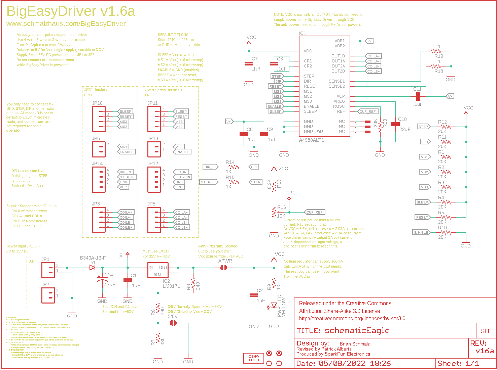
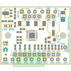
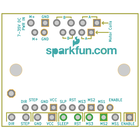
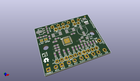
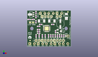
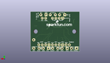
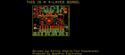
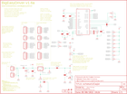

Contents
========

* [PRS12859 > Big Easy Driver](#prs12859--big-easy-driver)
	* [Schematic](#schematic)
	* [PCB](#pcb)
	* [Interactive BOM](#interactive-bom)
	* [OOMP Parts](#oomp-parts)
	* [Images](#images)
	* [Tags](#tags)
  
![][im]
# PRS12859 > Big Easy Driver

- ID: PROJ-SPAR-12859-STAN-01
- Hex ID: PRS12859
- Name: Sparkfun
- Description: Sparkfun
- Long Link: [http://oom.lt/PROJ-SPAR-12859-STAN-01](http://oom.lt/PROJ-SPAR-12859-STAN-01)
- Short Link: [http://oom.lt/PRS12859](http://oom.lt/PRS12859)

## Schematic
  

## PCB
  

## Interactive BOM

- Interactive BOM page: [ibom.html](https://htmlpreview.github.io/?https://github.com/oomlout/oomlout_OOMP_projects/blob/main/PROJ-SPAR-12859-STAN-01/kicad/bom/ibom.html)

## OOMP Parts
  

|OOMP Parts|
| :---: |
|[CAPC-0603-X-NF100-V50  SMD (0603) 100 nF Capacitor (Ceramic) 50v  C1, C6, C7, C8, C9, C11](https://github.com/oomlout/oomlout_OOMP_parts/tree/main/CAPC-0603-X-NF100-V50/)|
|[CAPC-0603-X-UF1-V25  SMD (0603) 1 uF Capacitor (Ceramic) 25v  C2](https://github.com/oomlout/oomlout_OOMP_parts/tree/main/CAPC-0603-X-UF1-V25/)|
|CAPC-UNMATCHED-X-NF220-01 C10|
|CAPE-PAND-X-UF47-01 C14|
|DIOD-UNMATCHED-X-UNMATCHED-01 D1|
|UNMATCHED-UNMATCHED-X-UNMATCHED-01 IC1, IC2|
|[HEAD-I01-X-PI02-01  2.54 mm 2 Pin Header  JP1, JP6](https://github.com/oomlout/oomlout_OOMP_parts/tree/main/HEAD-I01-X-PI02-01/)|
|[HEAD-I01-X-PI04-01  2.54 mm 4 Pin Header  JP3, JP10, JP14](https://github.com/oomlout/oomlout_OOMP_parts/tree/main/HEAD-I01-X-PI04-01/)|
|TERS-35D-L-PI04-01 JP5, JP11, JP12|
|[TERS-35D-L-PI02-01  3.5 mm 2 Pin Blue Screw Terminal  JP7, JP13](https://github.com/oomlout/oomlout_OOMP_parts/tree/main/TERS-35D-L-PI02-01/)|
|[LEDS-0603-Y-STAN-01  SMD (0603) Yellow LED  PWR_LED](https://github.com/oomlout/oomlout_OOMP_parts/tree/main/LEDS-0603-Y-STAN-01/)|
|[RESE-0603-X-O203-01  SMD (0603) 20k Ohm Resistor  R1, R2, R3, R4, R5, R10, R11, R12, R20](https://github.com/oomlout/oomlout_OOMP_parts/tree/main/RESE-0603-X-O203-01/)|
|[RESE-0603-X-O391-01  SMD (0603) 390 Ohm Resistor  R6](https://github.com/oomlout/oomlout_OOMP_parts/tree/main/RESE-0603-X-O391-01/)|
|[RESE-0603-X-O331-01  SMD (0603) 330 Ohm Resistor  R7](https://github.com/oomlout/oomlout_OOMP_parts/tree/main/RESE-0603-X-O331-01/)|
|[RESE-0603-X-O241-01  SMD (0603) 240 Ohm Resistor  R8](https://github.com/oomlout/oomlout_OOMP_parts/tree/main/RESE-0603-X-O241-01/)|
|[RESE-0603-X-O102-01  SMD (0603) 1k Ohm Resistor  R9, R14, R15](https://github.com/oomlout/oomlout_OOMP_parts/tree/main/RESE-0603-X-O102-01/)|
|RESE-0603-X-UNMATCHED-01 R13|
|RESE-UNMATCHED-X-O103-01 R16|
|RESE-UNMATCHED-X-UNMATCHED-01 R18, R19|

## Images
  
  

|bominteractivefront|bominteractiveback|kicadPcb3d|kicadPcb3dFront|kicadPcb3dBack|eagleImage|eagleSchemImage|
| :---: | :---: | :---: | :---: | :---: | :---: | :---: |
||||||||

## Tags

- hexID: PRS12859
- oompType: PROJ
- oompSize: SPAR
- oompColor: 12859
- oompDesc: STAN
- oompIndex: 01
- oompName: Big Easy Driver
- sources: All source files from https://github.com/sparkfun/Big_Easy_Driver (source licence details in srcLicense.md)
- linkBuyPage: https://www.sparkfun.com/products/12859
- oompID: PROJ-SPAR-12859-STAN-01
- oompParts: C1,CAPC-0603-X-NF100-V50
- oompParts: C2,CAPC-0603-X-UF1-V25
- oompParts: C6,CAPC-0603-X-NF100-V50
- oompParts: C7,CAPC-0603-X-NF100-V50
- oompParts: C8,CAPC-0603-X-NF100-V50
- oompParts: C9,CAPC-0603-X-NF100-V50
- oompParts: C10,CAPC-UNMATCHED-X-NF220-01
- oompParts: C11,CAPC-0603-X-NF100-V50
- oompParts: C14,CAPE-PAND-X-UF47-01
- oompParts: D1,DIOD-UNMATCHED-X-UNMATCHED-01
- oompParts: IC1,UNMATCHED-UNMATCHED-X-UNMATCHED-01
- oompParts: IC2,UNMATCHED-UNMATCHED-X-UNMATCHED-01
- oompParts: JP1,HEAD-I01-X-PI02-01
- oompParts: JP3,HEAD-I01-X-PI04-01
- oompParts: JP5,TERS-35D-L-PI04-01
- oompParts: JP6,HEAD-I01-X-PI02-01
- oompParts: JP7,TERS-35D-L-PI02-01
- oompParts: JP10,HEAD-I01-X-PI04-01
- oompParts: JP11,TERS-35D-L-PI04-01
- oompParts: JP12,TERS-35D-L-PI04-01
- oompParts: JP13,TERS-35D-L-PI02-01
- oompParts: JP14,HEAD-I01-X-PI04-01
- oompParts: PWR_LED,LEDS-0603-Y-STAN-01
- oompParts: R1,RESE-0603-X-O203-01
- oompParts: R2,RESE-0603-X-O203-01
- oompParts: R3,RESE-0603-X-O203-01
- oompParts: R4,RESE-0603-X-O203-01
- oompParts: R5,RESE-0603-X-O203-01
- oompParts: R6,RESE-0603-X-O391-01
- oompParts: R7,RESE-0603-X-O331-01
- oompParts: R8,RESE-0603-X-O241-01
- oompParts: R9,RESE-0603-X-O102-01
- oompParts: R10,RESE-0603-X-O203-01
- oompParts: R11,RESE-0603-X-O203-01
- oompParts: R12,RESE-0603-X-O203-01
- oompParts: R13,RESE-0603-X-UNMATCHED-01
- oompParts: R14,RESE-0603-X-O102-01
- oompParts: R15,RESE-0603-X-O102-01
- oompParts: R16,RESE-UNMATCHED-X-O103-01
- oompParts: R18,RESE-UNMATCHED-X-UNMATCHED-01
- oompParts: R19,RESE-UNMATCHED-X-UNMATCHED-01
- oompParts: R20,RESE-0603-X-O203-01
- rawParts: 3/5V,SOLDERJUMPERNO,SOLDERJUMPERNO,SJ_2S-NO,Solder Jumper,,,,
- rawParts: APWR,SOLDERJUMPERTRACE,SOLDERJUMPERTRACE,SJ_2S-TRACE,Solder Jumper,,,,
- rawParts: C1,.1uF,0.1UF-100V-10%(0603),0603-CAP,CAP-08390,CAP-08390,,0.1uF,
- rawParts: C2,1uF,1.0UF-16V-10%(0603),0603-CAP,CAP-00868,CAP-00868,,1.0uF,
- rawParts: C6,.1uf,0.1UF-100V-10%(0603),0603-CAP,CAP-08390,CAP-08390,,0.1uF,
- rawParts: C7,.1uf,0.1UF-100V-10%(0603),0603-CAP,CAP-08390,CAP-08390,,0.1uF,
- rawParts: C8,.1uf,0.1UF-100V-10%(0603),0603-CAP,CAP-08390,CAP-08390,,0.1uF,
- rawParts: C9,.1uf,0.1UF-100V-10%(0603),0603-CAP,CAP-08390,CAP-08390,,0.1uF,
- rawParts: C10,.22uF,0.22UF50V-20%,+80%(0603),0603-CAP,CAP-09885,CAP-09885,,0.22uF,
- rawParts: C11,.1uf,0.1UF-100V-10%(0603),0603-CAP,CAP-08390,CAP-08390,,0.1uF,
- rawParts: C14,47uF,47UF-50V-20%(ELECT),PANASONIC_D,CAP-10547,CAP-10547,,,
- rawParts: D1,B340A-13-F,DIODE-DO-214AC,DO-214AC,DIODE,,,,
- rawParts: FID1,FIDUCIAL1X2,FIDUCIAL1X2,FIDUCIAL-1X2,Fiducial Alignment Points,,,,
- rawParts: FID2,FIDUCIAL1X2,FIDUCIAL1X2,FIDUCIAL-1X2,Fiducial Alignment Points,,,,
- rawParts: FRAME1,FRAME-LETTER,FRAME-LETTER,CREATIVE_COMMONS,Schematic Frame,,,,
- rawParts: IC1,A4988ALT1,A4988ALT1,QFN-28-5MM_ALT1,DMOS Microstepping Driver with Translator,IC-11483,,,
- rawParts: IC2,LM317L,SPARKFUN03_30_09_V_REG_317SOT89SOT89,SCHMALZHAUS_SOT89,Voltage Regulator,,,,
- rawParts: JP1,,M02PTH,1X02,Header 2,,,,
- rawParts: JP3,,M04PTH,1X04,Header 4,,,,
- rawParts: JP5,,M04SCREW_LOCK,SCREWTERMINAL-3.5MM-4_LOCK,Header 4,,,,
- rawParts: JP6,,M02PTH,1X02,Header 2,,,,
- rawParts: JP7,,M023.5MM_LOCK,SCREWTERMINAL-3.5MM-2_LOCK,Header 2,,,,
- rawParts: JP8,STAND-OFF,STAND-OFF,STAND-OFF,Stand Off,,,,
- rawParts: JP9,STAND-OFF,STAND-OFF,STAND-OFF,Stand Off,,,,
- rawParts: JP10,,M04PTH,1X04,Header 4,,,,
- rawParts: JP11,,M04SCREW_LOCK,SCREWTERMINAL-3.5MM-4_LOCK,Header 4,,,,
- rawParts: JP12,,M04SCREW_LOCK,SCREWTERMINAL-3.5MM-4_LOCK,Header 4,,,,
- rawParts: JP13,,M023.5MM_LOCK,SCREWTERMINAL-3.5MM-2_LOCK,Header 2,,,,
- rawParts: JP14,,M04PTH,1X04,Header 4,,,,
- rawParts: LOGO1,OSHW_LOGO_FILLX0100-NT,OSHW_LOGO_FILLX0100-NT,OSHW_FILLX100_NOTEXT,,,,,
- rawParts: PWR_LED,YELLOW,LED0603,LED-0603,LEDs,,,,
- rawParts: R1,20K,20KOHM1/10W5%(0603),0603-RES,RES-09231,RES-09231,,,
- rawParts: R2,20K,20KOHM1/10W5%(0603),0603-RES,RES-09231,RES-09231,,,
- rawParts: R3,20K,20KOHM1/10W5%(0603),0603-RES,RES-09231,RES-09231,,,
- rawParts: R4,20K,20KOHM1/10W5%(0603),0603-RES,RES-09231,RES-09231,,,
- rawParts: R5,20K,20KOHM1/10W5%(0603),0603-RES,RES-09231,RES-09231,,,
- rawParts: R6,390,390OHM1/10W1%(0603),0603-RES,RES-07864,RES-07864,,390,
- rawParts: R7,330,330OHM1/10W1%(0603),0603-RES,RES-00818,RES-00818,,330,
- rawParts: R8,240,240OHM1/10W1%(0603),0603-RES,RES-07849,RES-07849,,240,
- rawParts: R9,1K,1KOHM1/10W1%(0603),0603-RES,RES-07856,RES-07856,,1K,
- rawParts: R10,20K,20KOHM1/10W5%(0603),0603-RES,RES-09231,RES-09231,,,
- rawParts: R11,20K,20KOHM1/10W5%(0603),0603-RES,RES-09231,RES-09231,,,
- rawParts: R12,20K,20KOHM1/10W5%(0603),0603-RES,RES-09231,RES-09231,,,
- rawParts: R13,8.2K,8.2KOHM-1/10W-5%(0603),0603-RES,RES-10646,RES-10646,,,
- rawParts: R14,1K,1KOHM1/10W1%(0603),0603-RES,RES-07856,RES-07856,,1K,
- rawParts: R15,1K,1KOHM1/10W1%(0603),0603-RES,RES-07856,RES-07856,,1K,
- rawParts: R16,10K,TRIMPOT3MM-2,TRIMPOT-3MM-2,Various small potentiometers for set-and-forget applications,,,,
- rawParts: R18,.11,0.11OHM1/2W1%(2010),R2010,RES-08354,RES-08354,,,
- rawParts: R19,.11,0.11OHM1/2W1%(2010),R2010,RES-08354,RES-08354,,,
- rawParts: R20,20K,20KOHM1/10W5%(0603),0603-RES,RES-09231,RES-09231,,,
- rawParts: TP1,TPPAD1-13,TPPAD1-13,P1-13,Test pad,,,,
- rawParts: U$2,LOGO-SFENEW,LOGO-SFENEW,SFE-NEW-WEBLOGO,Spark Fun Electronics PCB Logo,,,,
- rawParts: U$3,PAD,PAD,PAD-0.008,,,,,
- rawParts: U$4,PAD,PAD,PAD-0.008,,,,,
- rawParts: U$5,PAD,PAD,PAD-0.008,,,,,

[im]: kicadPcb3d_450.png
