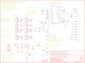

Contents
========

* [PRS12859 > Sparkfun](#prs12859--sparkfun)
	* [Schematic](#schematic)
	* [Interactive BOM](#interactive-bom)
	* [OOMP Parts](#oomp-parts)
	* [Images](#images)
	* [Tags](#tags)
  
![][im]
# PRS12859 > Sparkfun

- ID: PROJ-SPAR-12859-STAN-01
- Hex ID: PRS12859
- Name: Sparkfun
- Description: Sparkfun
- Long Link: [http://oom.lt/PROJ-SPAR-12859-STAN-01](http://oom.lt/PROJ-SPAR-12859-STAN-01)
- Short Link: [http://oom.lt/PRS12859](http://oom.lt/PRS12859)

## Schematic
  

## Interactive BOM

- Interactive BOM page: [ibom.html](https://htmlpreview.github.io/?https://github.com/oomlout/oomlout_OOMP_projects/blob/main/PROJ-SPAR-12859-STAN-01/kicad/bom/ibom.html)

## OOMP Parts
  

|OOMP Parts|
| :---: |
|3/5V,UNMATCHED-UNMATCHED-UNMATCHED-UNMATCHED-UNMATCHED,3/5V,SOLDERJUMPERNO,SOLDERJUMPERNO,SJ_2S-NO,Solder Jumper,,,,|
|APWR,UNMATCHED-UNMATCHED-UNMATCHED-UNMATCHED-UNMATCHED,APWR,SOLDERJUMPERTRACE,SOLDERJUMPERTRACE,SJ_2S-TRACE,Solder Jumper,,,,|
|C1,UNMATCHED-UNMATCHED-UNMATCHED-UNMATCHED-UNMATCHED,C1,.1uF,0.1UF-100V-10%(0603),0603-CAP,CAP-08390,CAP-08390,,0.1uF,|
|C2,UNMATCHED-UNMATCHED-UNMATCHED-UNMATCHED-UNMATCHED,C2,1uF,1.0UF-16V-10%(0603),0603-CAP,CAP-00868,CAP-00868,,1.0uF,|
|C6,UNMATCHED-UNMATCHED-UNMATCHED-UNMATCHED-UNMATCHED,C6,.1uf,0.1UF-100V-10%(0603),0603-CAP,CAP-08390,CAP-08390,,0.1uF,|
|C7,UNMATCHED-UNMATCHED-UNMATCHED-UNMATCHED-UNMATCHED,C7,.1uf,0.1UF-100V-10%(0603),0603-CAP,CAP-08390,CAP-08390,,0.1uF,|
|C8,UNMATCHED-UNMATCHED-UNMATCHED-UNMATCHED-UNMATCHED,C8,.1uf,0.1UF-100V-10%(0603),0603-CAP,CAP-08390,CAP-08390,,0.1uF,|
|C9,UNMATCHED-UNMATCHED-UNMATCHED-UNMATCHED-UNMATCHED,C9,.1uf,0.1UF-100V-10%(0603),0603-CAP,CAP-08390,CAP-08390,,0.1uF,|
|C10,UNMATCHED-UNMATCHED-UNMATCHED-UNMATCHED-UNMATCHED,C10,.22uF,0.22UF50V-20%,+80%(0603),0603-CAP,CAP-09885,CAP-09885,,0.22uF,|
|C11,UNMATCHED-UNMATCHED-UNMATCHED-UNMATCHED-UNMATCHED,C11,.1uf,0.1UF-100V-10%(0603),0603-CAP,CAP-08390,CAP-08390,,0.1uF,|
|C14,UNMATCHED-UNMATCHED-UNMATCHED-UNMATCHED-UNMATCHED,C14,47uF,47UF-50V-20%(ELECT),PANASONIC_D,CAP-10547,CAP-10547,,,|
|D1,UNMATCHED-UNMATCHED-UNMATCHED-UNMATCHED-UNMATCHED,D1,B340A-13-F,DIODE-DO-214AC,DO-214AC,DIODE,,,,|
|FRAME1,UNMATCHED-UNMATCHED-UNMATCHED-UNMATCHED-UNMATCHED,FID1,FIDUCIAL1X2,FIDUCIAL1X2,FIDUCIAL-1X2,Fiducial Alignment Points,,,,|
|IC1,UNMATCHED-UNMATCHED-UNMATCHED-UNMATCHED-UNMATCHED,FID2,FIDUCIAL1X2,FIDUCIAL1X2,FIDUCIAL-1X2,Fiducial Alignment Points,,,,|
|IC2,UNMATCHED-UNMATCHED-UNMATCHED-UNMATCHED-UNMATCHED,FRAME1,FRAME-LETTER,FRAME-LETTER,CREATIVE_COMMONS,Schematic Frame,,,,|
|JP1,UNMATCHED-UNMATCHED-UNMATCHED-UNMATCHED-UNMATCHED,IC1,A4988ALT1,A4988ALT1,QFN-28-5MM_ALT1,DMOS Microstepping Driver with Translator,IC-11483,,,|
|JP3,UNMATCHED-UNMATCHED-UNMATCHED-UNMATCHED-UNMATCHED,IC2,LM317L,SPARKFUN03_30_09_V_REG_317SOT89SOT89,SCHMALZHAUS_SOT89,Voltage Regulator,,,,|
|JP5,UNMATCHED-UNMATCHED-UNMATCHED-UNMATCHED-UNMATCHED,JP1,,M02PTH,1X02,Header 2,,,,|
|JP6,UNMATCHED-UNMATCHED-UNMATCHED-UNMATCHED-UNMATCHED,JP3,,M04PTH,1X04,Header 4,,,,|
|JP7,UNMATCHED-UNMATCHED-UNMATCHED-UNMATCHED-UNMATCHED,JP5,,M04SCREW_LOCK,SCREWTERMINAL-3.5MM-4_LOCK,Header 4,,,,|
|JP8,UNMATCHED-UNMATCHED-UNMATCHED-UNMATCHED-UNMATCHED,JP6,,M02PTH,1X02,Header 2,,,,|
|JP9,UNMATCHED-UNMATCHED-UNMATCHED-UNMATCHED-UNMATCHED,JP7,,M023.5MM_LOCK,SCREWTERMINAL-3.5MM-2_LOCK,Header 2,,,,|
|JP10,UNMATCHED-UNMATCHED-UNMATCHED-UNMATCHED-UNMATCHED,JP8,STAND-OFF,STAND-OFF,STAND-OFF,Stand Off,,,,|
|JP11,UNMATCHED-UNMATCHED-UNMATCHED-UNMATCHED-UNMATCHED,JP9,STAND-OFF,STAND-OFF,STAND-OFF,Stand Off,,,,|
|JP12,UNMATCHED-UNMATCHED-UNMATCHED-UNMATCHED-UNMATCHED,JP10,,M04PTH,1X04,Header 4,,,,|
|JP13,UNMATCHED-UNMATCHED-UNMATCHED-UNMATCHED-UNMATCHED,JP11,,M04SCREW_LOCK,SCREWTERMINAL-3.5MM-4_LOCK,Header 4,,,,|
|JP14,UNMATCHED-UNMATCHED-UNMATCHED-UNMATCHED-UNMATCHED,JP12,,M04SCREW_LOCK,SCREWTERMINAL-3.5MM-4_LOCK,Header 4,,,,|
|LOGO1,UNMATCHED-UNMATCHED-UNMATCHED-UNMATCHED-UNMATCHED,JP13,,M023.5MM_LOCK,SCREWTERMINAL-3.5MM-2_LOCK,Header 2,,,,|
|PWR_LED,UNMATCHED-UNMATCHED-UNMATCHED-UNMATCHED-UNMATCHED,JP14,,M04PTH,1X04,Header 4,,,,|
|R1,UNMATCHED-UNMATCHED-UNMATCHED-UNMATCHED-UNMATCHED,LOGO1,OSHW_LOGO_FILLX0100-NT,OSHW_LOGO_FILLX0100-NT,OSHW_FILLX100_NOTEXT,,,,,|
|R2,UNMATCHED-UNMATCHED-UNMATCHED-UNMATCHED-UNMATCHED,PWR_LED,YELLOW,LED0603,LED-0603,LEDs,,,,|
|R3,UNMATCHED-UNMATCHED-UNMATCHED-UNMATCHED-UNMATCHED,R1,20K,20KOHM1/10W5%(0603),0603-RES,RES-09231,RES-09231,,,|
|R4,UNMATCHED-UNMATCHED-UNMATCHED-UNMATCHED-UNMATCHED,R2,20K,20KOHM1/10W5%(0603),0603-RES,RES-09231,RES-09231,,,|
|R5,UNMATCHED-UNMATCHED-UNMATCHED-UNMATCHED-UNMATCHED,R3,20K,20KOHM1/10W5%(0603),0603-RES,RES-09231,RES-09231,,,|
|R6,UNMATCHED-UNMATCHED-UNMATCHED-UNMATCHED-UNMATCHED,R4,20K,20KOHM1/10W5%(0603),0603-RES,RES-09231,RES-09231,,,|
|R7,UNMATCHED-UNMATCHED-UNMATCHED-UNMATCHED-UNMATCHED,R5,20K,20KOHM1/10W5%(0603),0603-RES,RES-09231,RES-09231,,,|
|R8,UNMATCHED-UNMATCHED-UNMATCHED-UNMATCHED-UNMATCHED,R6,390,390OHM1/10W1%(0603),0603-RES,RES-07864,RES-07864,,390,|
|R9,UNMATCHED-UNMATCHED-UNMATCHED-UNMATCHED-UNMATCHED,R7,330,330OHM1/10W1%(0603),0603-RES,RES-00818,RES-00818,,330,|
|R10,UNMATCHED-UNMATCHED-UNMATCHED-UNMATCHED-UNMATCHED,R8,240,240OHM1/10W1%(0603),0603-RES,RES-07849,RES-07849,,240,|
|R11,UNMATCHED-UNMATCHED-UNMATCHED-UNMATCHED-UNMATCHED,R9,1K,1KOHM1/10W1%(0603),0603-RES,RES-07856,RES-07856,,1K,|
|R12,UNMATCHED-UNMATCHED-UNMATCHED-UNMATCHED-UNMATCHED,R10,20K,20KOHM1/10W5%(0603),0603-RES,RES-09231,RES-09231,,,|
|R13,UNMATCHED-UNMATCHED-UNMATCHED-UNMATCHED-UNMATCHED,R11,20K,20KOHM1/10W5%(0603),0603-RES,RES-09231,RES-09231,,,|
|R14,UNMATCHED-UNMATCHED-UNMATCHED-UNMATCHED-UNMATCHED,R12,20K,20KOHM1/10W5%(0603),0603-RES,RES-09231,RES-09231,,,|
|R15,UNMATCHED-UNMATCHED-UNMATCHED-UNMATCHED-UNMATCHED,R13,8.2K,8.2KOHM-1/10W-5%(0603),0603-RES,RES-10646,RES-10646,,,|
|R16,UNMATCHED-UNMATCHED-UNMATCHED-UNMATCHED-UNMATCHED,R14,1K,1KOHM1/10W1%(0603),0603-RES,RES-07856,RES-07856,,1K,|
|R18,UNMATCHED-UNMATCHED-UNMATCHED-UNMATCHED-UNMATCHED,R15,1K,1KOHM1/10W1%(0603),0603-RES,RES-07856,RES-07856,,1K,|
|R19,UNMATCHED-UNMATCHED-UNMATCHED-UNMATCHED-UNMATCHED,R16,10K,TRIMPOT3MM-2,TRIMPOT-3MM-2,Various small potentiometers for set-and-forget applications,,,,|
|R20,UNMATCHED-UNMATCHED-UNMATCHED-UNMATCHED-UNMATCHED,R18,.11,0.11OHM1/2W1%(2010),R2010,RES-08354,RES-08354,,,|
|TP1,UNMATCHED-UNMATCHED-UNMATCHED-UNMATCHED-UNMATCHED,R19,.11,0.11OHM1/2W1%(2010),R2010,RES-08354,RES-08354,,,|
|U$2,UNMATCHED-UNMATCHED-UNMATCHED-UNMATCHED-UNMATCHED,R20,20K,20KOHM1/10W5%(0603),0603-RES,RES-09231,RES-09231,,,|
|U$3,UNMATCHED-UNMATCHED-UNMATCHED-UNMATCHED-UNMATCHED,TP1,TPPAD1-13,TPPAD1-13,P1-13,Test pad,,,,|
|U$4,UNMATCHED-UNMATCHED-UNMATCHED-UNMATCHED-UNMATCHED,U$2,LOGO-SFENEW,LOGO-SFENEW,SFE-NEW-WEBLOGO,Spark Fun Electronics PCB Logo,,,,|
|U$5,UNMATCHED-UNMATCHED-UNMATCHED-UNMATCHED-UNMATCHED,U$3,PAD,PAD,PAD-0.008,,,,,|

## Images
  
  

|kicadPcb3d|kicadPcb3dFront|kicadPcb3dBack|eagleImage|eagleSchemImage|
| :---: | :---: | :---: | :---: | :---: |
||||||

## Tags

- hexID: PRS12859
- oompType: PROJ
- oompSize: SPAR
- oompColor: 12859
- oompDesc: STAN
- oompIndex: 01
- oompName: Big Easy Driver
- sources: All source files from https://github.com/sparkfun/Big_Easy_Driver (source licence details in srcLicense.md)
- linkBuyPage: https://www.sparkfun.com/products/12859
- oompID: PROJ-SPAR-12859-STAN-01
- oompParts: 3/5V,UNMATCHED-UNMATCHED-UNMATCHED-UNMATCHED-UNMATCHED
- oompParts: APWR,UNMATCHED-UNMATCHED-UNMATCHED-UNMATCHED-UNMATCHED
- oompParts: C1,UNMATCHED-UNMATCHED-UNMATCHED-UNMATCHED-UNMATCHED
- oompParts: C2,UNMATCHED-UNMATCHED-UNMATCHED-UNMATCHED-UNMATCHED
- oompParts: C6,UNMATCHED-UNMATCHED-UNMATCHED-UNMATCHED-UNMATCHED
- oompParts: C7,UNMATCHED-UNMATCHED-UNMATCHED-UNMATCHED-UNMATCHED
- oompParts: C8,UNMATCHED-UNMATCHED-UNMATCHED-UNMATCHED-UNMATCHED
- oompParts: C9,UNMATCHED-UNMATCHED-UNMATCHED-UNMATCHED-UNMATCHED
- oompParts: C10,UNMATCHED-UNMATCHED-UNMATCHED-UNMATCHED-UNMATCHED
- oompParts: C11,UNMATCHED-UNMATCHED-UNMATCHED-UNMATCHED-UNMATCHED
- oompParts: C14,UNMATCHED-UNMATCHED-UNMATCHED-UNMATCHED-UNMATCHED
- oompParts: D1,UNMATCHED-UNMATCHED-UNMATCHED-UNMATCHED-UNMATCHED
- oompParts: FRAME1,UNMATCHED-UNMATCHED-UNMATCHED-UNMATCHED-UNMATCHED
- oompParts: IC1,UNMATCHED-UNMATCHED-UNMATCHED-UNMATCHED-UNMATCHED
- oompParts: IC2,UNMATCHED-UNMATCHED-UNMATCHED-UNMATCHED-UNMATCHED
- oompParts: JP1,UNMATCHED-UNMATCHED-UNMATCHED-UNMATCHED-UNMATCHED
- oompParts: JP3,UNMATCHED-UNMATCHED-UNMATCHED-UNMATCHED-UNMATCHED
- oompParts: JP5,UNMATCHED-UNMATCHED-UNMATCHED-UNMATCHED-UNMATCHED
- oompParts: JP6,UNMATCHED-UNMATCHED-UNMATCHED-UNMATCHED-UNMATCHED
- oompParts: JP7,UNMATCHED-UNMATCHED-UNMATCHED-UNMATCHED-UNMATCHED
- oompParts: JP8,UNMATCHED-UNMATCHED-UNMATCHED-UNMATCHED-UNMATCHED
- oompParts: JP9,UNMATCHED-UNMATCHED-UNMATCHED-UNMATCHED-UNMATCHED
- oompParts: JP10,UNMATCHED-UNMATCHED-UNMATCHED-UNMATCHED-UNMATCHED
- oompParts: JP11,UNMATCHED-UNMATCHED-UNMATCHED-UNMATCHED-UNMATCHED
- oompParts: JP12,UNMATCHED-UNMATCHED-UNMATCHED-UNMATCHED-UNMATCHED
- oompParts: JP13,UNMATCHED-UNMATCHED-UNMATCHED-UNMATCHED-UNMATCHED
- oompParts: JP14,UNMATCHED-UNMATCHED-UNMATCHED-UNMATCHED-UNMATCHED
- oompParts: LOGO1,UNMATCHED-UNMATCHED-UNMATCHED-UNMATCHED-UNMATCHED
- oompParts: PWR_LED,UNMATCHED-UNMATCHED-UNMATCHED-UNMATCHED-UNMATCHED
- oompParts: R1,UNMATCHED-UNMATCHED-UNMATCHED-UNMATCHED-UNMATCHED
- oompParts: R2,UNMATCHED-UNMATCHED-UNMATCHED-UNMATCHED-UNMATCHED
- oompParts: R3,UNMATCHED-UNMATCHED-UNMATCHED-UNMATCHED-UNMATCHED
- oompParts: R4,UNMATCHED-UNMATCHED-UNMATCHED-UNMATCHED-UNMATCHED
- oompParts: R5,UNMATCHED-UNMATCHED-UNMATCHED-UNMATCHED-UNMATCHED
- oompParts: R6,UNMATCHED-UNMATCHED-UNMATCHED-UNMATCHED-UNMATCHED
- oompParts: R7,UNMATCHED-UNMATCHED-UNMATCHED-UNMATCHED-UNMATCHED
- oompParts: R8,UNMATCHED-UNMATCHED-UNMATCHED-UNMATCHED-UNMATCHED
- oompParts: R9,UNMATCHED-UNMATCHED-UNMATCHED-UNMATCHED-UNMATCHED
- oompParts: R10,UNMATCHED-UNMATCHED-UNMATCHED-UNMATCHED-UNMATCHED
- oompParts: R11,UNMATCHED-UNMATCHED-UNMATCHED-UNMATCHED-UNMATCHED
- oompParts: R12,UNMATCHED-UNMATCHED-UNMATCHED-UNMATCHED-UNMATCHED
- oompParts: R13,UNMATCHED-UNMATCHED-UNMATCHED-UNMATCHED-UNMATCHED
- oompParts: R14,UNMATCHED-UNMATCHED-UNMATCHED-UNMATCHED-UNMATCHED
- oompParts: R15,UNMATCHED-UNMATCHED-UNMATCHED-UNMATCHED-UNMATCHED
- oompParts: R16,UNMATCHED-UNMATCHED-UNMATCHED-UNMATCHED-UNMATCHED
- oompParts: R18,UNMATCHED-UNMATCHED-UNMATCHED-UNMATCHED-UNMATCHED
- oompParts: R19,UNMATCHED-UNMATCHED-UNMATCHED-UNMATCHED-UNMATCHED
- oompParts: R20,UNMATCHED-UNMATCHED-UNMATCHED-UNMATCHED-UNMATCHED
- oompParts: TP1,UNMATCHED-UNMATCHED-UNMATCHED-UNMATCHED-UNMATCHED
- oompParts: U$2,UNMATCHED-UNMATCHED-UNMATCHED-UNMATCHED-UNMATCHED
- oompParts: U$3,UNMATCHED-UNMATCHED-UNMATCHED-UNMATCHED-UNMATCHED
- oompParts: U$4,UNMATCHED-UNMATCHED-UNMATCHED-UNMATCHED-UNMATCHED
- oompParts: U$5,UNMATCHED-UNMATCHED-UNMATCHED-UNMATCHED-UNMATCHED
- rawParts: 3/5V,SOLDERJUMPERNO,SOLDERJUMPERNO,SJ_2S-NO,Solder Jumper,,,,
- rawParts: APWR,SOLDERJUMPERTRACE,SOLDERJUMPERTRACE,SJ_2S-TRACE,Solder Jumper,,,,
- rawParts: C1,.1uF,0.1UF-100V-10%(0603),0603-CAP,CAP-08390,CAP-08390,,0.1uF,
- rawParts: C2,1uF,1.0UF-16V-10%(0603),0603-CAP,CAP-00868,CAP-00868,,1.0uF,
- rawParts: C6,.1uf,0.1UF-100V-10%(0603),0603-CAP,CAP-08390,CAP-08390,,0.1uF,
- rawParts: C7,.1uf,0.1UF-100V-10%(0603),0603-CAP,CAP-08390,CAP-08390,,0.1uF,
- rawParts: C8,.1uf,0.1UF-100V-10%(0603),0603-CAP,CAP-08390,CAP-08390,,0.1uF,
- rawParts: C9,.1uf,0.1UF-100V-10%(0603),0603-CAP,CAP-08390,CAP-08390,,0.1uF,
- rawParts: C10,.22uF,0.22UF50V-20%,+80%(0603),0603-CAP,CAP-09885,CAP-09885,,0.22uF,
- rawParts: C11,.1uf,0.1UF-100V-10%(0603),0603-CAP,CAP-08390,CAP-08390,,0.1uF,
- rawParts: C14,47uF,47UF-50V-20%(ELECT),PANASONIC_D,CAP-10547,CAP-10547,,,
- rawParts: D1,B340A-13-F,DIODE-DO-214AC,DO-214AC,DIODE,,,,
- rawParts: FID1,FIDUCIAL1X2,FIDUCIAL1X2,FIDUCIAL-1X2,Fiducial Alignment Points,,,,
- rawParts: FID2,FIDUCIAL1X2,FIDUCIAL1X2,FIDUCIAL-1X2,Fiducial Alignment Points,,,,
- rawParts: FRAME1,FRAME-LETTER,FRAME-LETTER,CREATIVE_COMMONS,Schematic Frame,,,,
- rawParts: IC1,A4988ALT1,A4988ALT1,QFN-28-5MM_ALT1,DMOS Microstepping Driver with Translator,IC-11483,,,
- rawParts: IC2,LM317L,SPARKFUN03_30_09_V_REG_317SOT89SOT89,SCHMALZHAUS_SOT89,Voltage Regulator,,,,
- rawParts: JP1,,M02PTH,1X02,Header 2,,,,
- rawParts: JP3,,M04PTH,1X04,Header 4,,,,
- rawParts: JP5,,M04SCREW_LOCK,SCREWTERMINAL-3.5MM-4_LOCK,Header 4,,,,
- rawParts: JP6,,M02PTH,1X02,Header 2,,,,
- rawParts: JP7,,M023.5MM_LOCK,SCREWTERMINAL-3.5MM-2_LOCK,Header 2,,,,
- rawParts: JP8,STAND-OFF,STAND-OFF,STAND-OFF,Stand Off,,,,
- rawParts: JP9,STAND-OFF,STAND-OFF,STAND-OFF,Stand Off,,,,
- rawParts: JP10,,M04PTH,1X04,Header 4,,,,
- rawParts: JP11,,M04SCREW_LOCK,SCREWTERMINAL-3.5MM-4_LOCK,Header 4,,,,
- rawParts: JP12,,M04SCREW_LOCK,SCREWTERMINAL-3.5MM-4_LOCK,Header 4,,,,
- rawParts: JP13,,M023.5MM_LOCK,SCREWTERMINAL-3.5MM-2_LOCK,Header 2,,,,
- rawParts: JP14,,M04PTH,1X04,Header 4,,,,
- rawParts: LOGO1,OSHW_LOGO_FILLX0100-NT,OSHW_LOGO_FILLX0100-NT,OSHW_FILLX100_NOTEXT,,,,,
- rawParts: PWR_LED,YELLOW,LED0603,LED-0603,LEDs,,,,
- rawParts: R1,20K,20KOHM1/10W5%(0603),0603-RES,RES-09231,RES-09231,,,
- rawParts: R2,20K,20KOHM1/10W5%(0603),0603-RES,RES-09231,RES-09231,,,
- rawParts: R3,20K,20KOHM1/10W5%(0603),0603-RES,RES-09231,RES-09231,,,
- rawParts: R4,20K,20KOHM1/10W5%(0603),0603-RES,RES-09231,RES-09231,,,
- rawParts: R5,20K,20KOHM1/10W5%(0603),0603-RES,RES-09231,RES-09231,,,
- rawParts: R6,390,390OHM1/10W1%(0603),0603-RES,RES-07864,RES-07864,,390,
- rawParts: R7,330,330OHM1/10W1%(0603),0603-RES,RES-00818,RES-00818,,330,
- rawParts: R8,240,240OHM1/10W1%(0603),0603-RES,RES-07849,RES-07849,,240,
- rawParts: R9,1K,1KOHM1/10W1%(0603),0603-RES,RES-07856,RES-07856,,1K,
- rawParts: R10,20K,20KOHM1/10W5%(0603),0603-RES,RES-09231,RES-09231,,,
- rawParts: R11,20K,20KOHM1/10W5%(0603),0603-RES,RES-09231,RES-09231,,,
- rawParts: R12,20K,20KOHM1/10W5%(0603),0603-RES,RES-09231,RES-09231,,,
- rawParts: R13,8.2K,8.2KOHM-1/10W-5%(0603),0603-RES,RES-10646,RES-10646,,,
- rawParts: R14,1K,1KOHM1/10W1%(0603),0603-RES,RES-07856,RES-07856,,1K,
- rawParts: R15,1K,1KOHM1/10W1%(0603),0603-RES,RES-07856,RES-07856,,1K,
- rawParts: R16,10K,TRIMPOT3MM-2,TRIMPOT-3MM-2,Various small potentiometers for set-and-forget applications,,,,
- rawParts: R18,.11,0.11OHM1/2W1%(2010),R2010,RES-08354,RES-08354,,,
- rawParts: R19,.11,0.11OHM1/2W1%(2010),R2010,RES-08354,RES-08354,,,
- rawParts: R20,20K,20KOHM1/10W5%(0603),0603-RES,RES-09231,RES-09231,,,
- rawParts: TP1,TPPAD1-13,TPPAD1-13,P1-13,Test pad,,,,
- rawParts: U$2,LOGO-SFENEW,LOGO-SFENEW,SFE-NEW-WEBLOGO,Spark Fun Electronics PCB Logo,,,,
- rawParts: U$3,PAD,PAD,PAD-0.008,,,,,
- rawParts: U$4,PAD,PAD,PAD-0.008,,,,,
- rawParts: U$5,PAD,PAD,PAD-0.008,,,,,

[im]: kicadPcb3d_450.png
