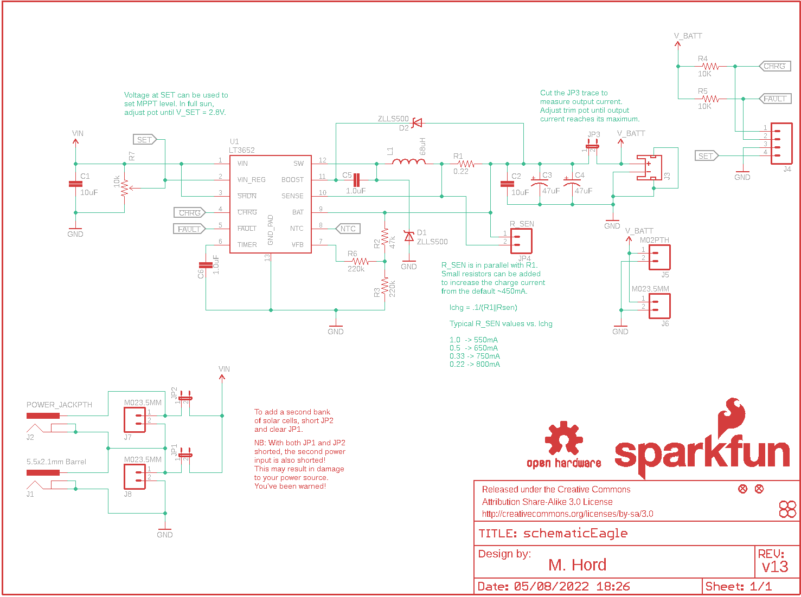
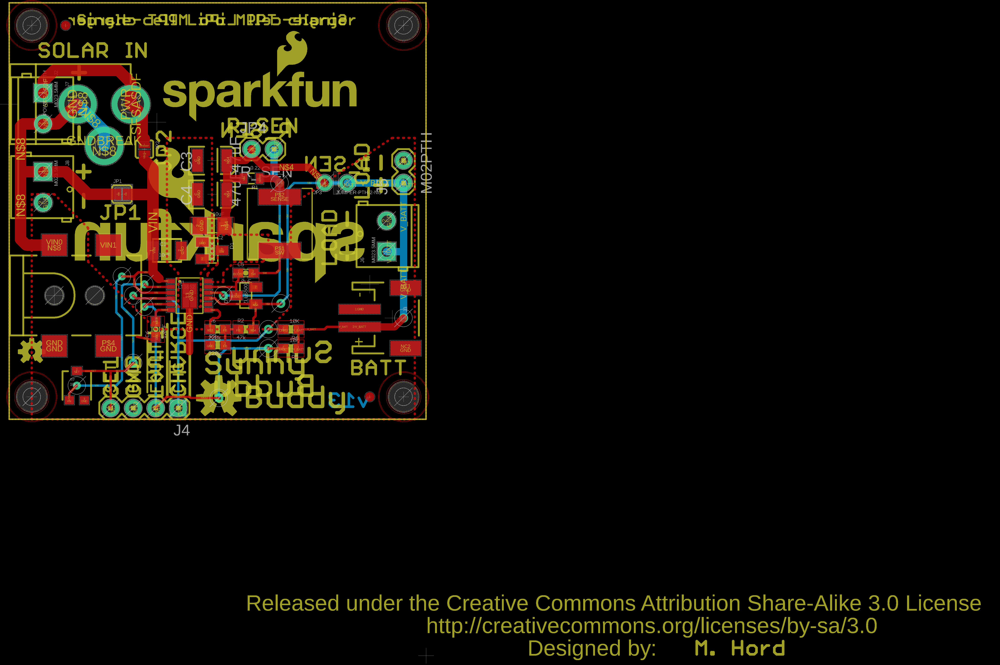
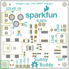
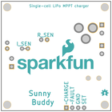

Contents
========

* [PRS12885 > SunnyBuddy](#prs12885--sunnybuddy)
	* [Schematic](#schematic)
	* [PCB](#pcb)
	* [Interactive BOM](#interactive-bom)
	* [OOMP Parts](#oomp-parts)
	* [Images](#images)
	* [Tags](#tags)
  
![][im]
# PRS12885 > SunnyBuddy

- ID: PROJ-SPAR-12885-STAN-01
- Hex ID: PRS12885
- Name: Sparkfun
- Description: Sparkfun
- Long Link: [http://oom.lt/PROJ-SPAR-12885-STAN-01](http://oom.lt/PROJ-SPAR-12885-STAN-01)
- Short Link: [http://oom.lt/PRS12885](http://oom.lt/PRS12885)

## Schematic
  

## PCB
  

## Interactive BOM

- Interactive BOM page: [ibom.html](https://htmlpreview.github.io/?https://github.com/oomlout/oomlout_OOMP_projects/blob/main/PROJ-SPAR-12885-STAN-01/kicad/bom/ibom.html)

## OOMP Parts
  

|OOMP Parts|
| :---: |
|CAPX-UNMATCHED-X-UF10-01 C1|
|[CAPC-1206-X-UF10-V25  SMD (1206) 10 uF Capacitor (Ceramic) 25v  C2](https://github.com/oomlout/oomlout_OOMP_parts/tree/main/CAPC-1206-X-UF10-V25/)|
|CAPX-3528-X-UF47-01 C3, C4|
|CAPC-0603-X-UNMATCHED-01 C5, C6|
|DIOD-SO23-X-UNMATCHED-01 D1, D2|
|UNMATCHED-UNMATCHED-X-UNMATCHED-01 J1, J3, JP1, JP2, JP3, L1, U1|
|[DCJP-21D-X-STAN-01  2.1 mm DC Jack  J2](https://github.com/oomlout/oomlout_OOMP_parts/tree/main/DCJP-21D-X-STAN-01/)|
|[HEAD-I01-X-PI04-01  2.54 mm 4 Pin Header  J4](https://github.com/oomlout/oomlout_OOMP_parts/tree/main/HEAD-I01-X-PI04-01/)|
|[HEAD-I01-X-PI02-01  2.54 mm 2 Pin Header  J5, JP4](https://github.com/oomlout/oomlout_OOMP_parts/tree/main/HEAD-I01-X-PI02-01/)|
|[TERS-35D-L-PI02-01  3.5 mm 2 Pin Blue Screw Terminal  J6, J7, J8](https://github.com/oomlout/oomlout_OOMP_parts/tree/main/TERS-35D-L-PI02-01/)|
|RESE-0805-X-UNMATCHED-01 R1|
|[RESE-0603-X-O473-01  SMD (0603) 47k Ohm Resistor  R2](https://github.com/oomlout/oomlout_OOMP_parts/tree/main/RESE-0603-X-O473-01/)|
|RESE-0603-X-O2203-01 R3, R6|
|[RESE-0603-X-O103-01  SMD (0603) 10k Ohm Resistor  R4, R5](https://github.com/oomlout/oomlout_OOMP_parts/tree/main/RESE-0603-X-O103-01/)|
|RESE-UNMATCHED-X-O103-01 R7|

## Images
  
  

|bominteractivefront|bominteractiveback|kicadPcb3d|kicadPcb3dFront|kicadPcb3dBack|eagleImage|eagleSchemImage|
| :---: | :---: | :---: | :---: | :---: | :---: | :---: |
||||||||

## Tags

- hexID: PRS12885
- oompType: PROJ
- oompSize: SPAR
- oompColor: 12885
- oompDesc: STAN
- oompIndex: 01
- oompName: SunnyBuddy
- sources: All source files from https://github.com/sparkfun/SunnyBuddy (source licence details in srcLicense.md)
- linkBuyPage: https://www.sparkfun.com/products/12885
- oompID: PROJ-SPAR-12885-STAN-01
- oompParts: C1,CAPX-UNMATCHED-X-UF10-01
- oompParts: C2,CAPC-1206-X-UF10-V25
- oompParts: C3,CAPX-3528-X-UF47-01
- oompParts: C4,CAPX-3528-X-UF47-01
- oompParts: C5,CAPC-0603-X-UNMATCHED-01
- oompParts: C6,CAPC-0603-X-UNMATCHED-01
- oompParts: D1,DIOD-SO23-X-UNMATCHED-01
- oompParts: D2,DIOD-SO23-X-UNMATCHED-01
- oompParts: J1,UNMATCHED-UNMATCHED-X-UNMATCHED-01
- oompParts: J2,DCJP-21D-X-STAN-01
- oompParts: J3,UNMATCHED-UNMATCHED-X-UNMATCHED-01
- oompParts: J4,HEAD-I01-X-PI04-01
- oompParts: J5,HEAD-I01-X-PI02-01
- oompParts: J6,TERS-35D-L-PI02-01
- oompParts: J7,TERS-35D-L-PI02-01
- oompParts: J8,TERS-35D-L-PI02-01
- oompParts: JP1,UNMATCHED-UNMATCHED-X-UNMATCHED-01
- oompParts: JP2,UNMATCHED-UNMATCHED-X-UNMATCHED-01
- oompParts: JP3,UNMATCHED-UNMATCHED-X-UNMATCHED-01
- oompParts: JP4,HEAD-I01-X-PI02-01
- oompParts: L1,UNMATCHED-UNMATCHED-X-UNMATCHED-01
- oompParts: R1,RESE-0805-X-UNMATCHED-01
- oompParts: R2,RESE-0603-X-O473-01
- oompParts: R3,RESE-0603-X-O2203-01
- oompParts: R4,RESE-0603-X-O103-01
- oompParts: R5,RESE-0603-X-O103-01
- oompParts: R6,RESE-0603-X-O2203-01
- oompParts: R7,RESE-UNMATCHED-X-O103-01
- oompParts: U1,UNMATCHED-UNMATCHED-X-UNMATCHED-01
- rawParts: C1,10uF,10UF50V20%(1210),1210,CAP-09824,CAP-09824,10uF,
- rawParts: C2,10uF,10UF-6.3V-20%(1206),1206,Ceramic,CAP-10057,10uF,
- rawParts: C3,47uF,47UF-TANT,EIA3528,47uF Tantalum SMT,CAP-08310,47uF,
- rawParts: C4,47uF,47UF-TANT,EIA3528,47uF Tantalum SMT,CAP-08310,47uF,
- rawParts: C5,1.0uF,1.0UF-16V-10%(0603),0603-CAP,CAP-00868,CAP-00868,1.0uF,
- rawParts: C6,1.0uF,1.0UF-16V-10%(0603),0603-CAP,CAP-00868,CAP-00868,1.0uF,
- rawParts: D1,ZLLS500,ZLLS500ZLLS500,SOT23,700mA 40V SOT-23 Schottky,DIO-08411,ZLLS500,
- rawParts: D2,ZLLS500,ZLLS500ZLLS500,SOT23,700mA 40V SOT-23 Schottky,DIO-08411,ZLLS500,
- rawParts: FID1,FIDUCIAL1X2,FIDUCIAL1X2,FIDUCIAL-1X2,Fiducial Alignment Points,,,
- rawParts: FID2,FIDUCIAL1X2,FIDUCIAL1X2,FIDUCIAL-1X2,Fiducial Alignment Points,,,
- rawParts: FRAME1,FRAME-LETTER,FRAME-LETTER,CREATIVE_COMMONS,Schematic Frame,,,
- rawParts: J1,5.5x2.1mm Barrel,POWER_JACKSMD,POWER_JACK_SMD,Power Jack,CONN-08106,5.5x2.1mm Barrel,
- rawParts: J2,POWER_JACKPTH,POWER_JACKPTH,POWER_JACK_PTH,Power Jack,,,
- rawParts: J3,,JST_2MM_MALE,JST-2-SMD,Mates to single-cell LiPo batteries.,CONN-08352,,
- rawParts: J4,,M04PTH,1X04,Header 4,,,
- rawParts: J5,M02PTH,M02PTH,1X02,Standard 2-pin 0.1 header. Use with,,,
- rawParts: J6,M023.5MM,M023.5MM,SCREWTERMINAL-3.5MM-2,Standard 2-pin 0.1 header. Use with,,,
- rawParts: J7,M023.5MM,M023.5MM,SCREWTERMINAL-3.5MM-2,Standard 2-pin 0.1 header. Use with,,,
- rawParts: J8,M023.5MM,M023.5MM,SCREWTERMINAL-3.5MM-2,Standard 2-pin 0.1 header. Use with,,,
- rawParts: JP1,,JUMPER-2SMD-NC,SJ_2S,Jumper,,,
- rawParts: JP2,,JUMPER-2SMD-NO,SJ_2S-NO,Jumper,,,
- rawParts: JP3,JUMPER-PTH-2-NC,JUMPER-PTH-2-NC,PTH-JUMPER-NC_BOTTOM_NO_SILK,,,,
- rawParts: JP4,R_SEN,M02PTH,1X02,Standard 2-pin 0.1 header. Use with,,,
- rawParts: L1,68uH,INDUCTOR68UH-1A,CR75,Inductors,NDUC-09739,68uH,
- rawParts: LOGO1,SFE_LOGO_NAME_FLAME.2_INCH,SFE_LOGO_NAME_FLAME.2_INCH,SFE_LOGO_NAME_FLAME_.2,SFE Logo, name and flame,,,
- rawParts: LOGO2,OSHW-LOGOM,OSHW-LOGOM,OSHW-LOGO-M,Open Source Hardware Logo This logo indicates the piece of hardware it is found on incorporates a OSHW license and/or adheres to the definition of open source hardware found here: http://freedomdefined.org/OSHW,,,
- rawParts: LOGO3,OSHW-LOGOS,OSHW-LOGOS,OSHW-LOGO-S,Open Source Hardware Logo This logo indicates the piece of hardware it is found on incorporates a OSHW license and/or adheres to the definition of open source hardware found here: http://freedomdefined.org/OSHW,,,
- rawParts: LOGO4,SFE_LOGO_NAME_FLAME.3_INCH,SFE_LOGO_NAME_FLAME.3_INCH,SFE_LOGO_NAME_FLAME_.3,SFE Logo, name and flame,,,
- rawParts: R1,0.22,0.22OHM1/4W1%(0805),0805,RES-09883,RES-09883,0.22,
- rawParts: R2,47k,47KOHM1/10W1%(0603),0603-RES,RES-07871,RES-07871,47K,
- rawParts: R3,220k,220KOHM1/10W1%(0603),0603-RES,RES-08969,RES-08969,220k,
- rawParts: R4,10K,10KOHM1/10W1%(0603)0603,0603-RES,RES-00824,RES-00824,10K,
- rawParts: R5,10K,10KOHM1/10W1%(0603)0603,0603-RES,RES-00824,RES-00824,10K,
- rawParts: R6,220k,220KOHM1/10W1%(0603),0603-RES,RES-08969,RES-08969,220k,
- rawParts: R7,10k,TRIMPOTRES-09285,TRIMPOT-3MM,Various small potentiometers for set-and-forget applications,RES-09285,10k,
- rawParts: STANDOFF1,STAND-OFF,STAND-OFF,STAND-OFF,#4 Stand Off,,,
- rawParts: STANDOFF2,STAND-OFF,STAND-OFF,STAND-OFF,#4 Stand Off,,,
- rawParts: STANDOFF3,STAND-OFF,STAND-OFF,STAND-OFF,#4 Stand Off,,,
- rawParts: STANDOFF4,STAND-OFF,STAND-OFF,STAND-OFF,#4 Stand Off,,,
- rawParts: U1,LT3652,LT3652,MSOP-12_GND,LT3652 MPPT Solar Charge Controller,,LT3652,

[im]: kicadPcb3d_450.png
