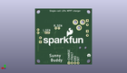

Contents
========

* [PROJ-SPAR-12885-STAN-01>SunnyBuddy](#proj-spar-12885-stan-01sunnybuddy)
	* [Images](#images)
	* [Interactive BOM](#interactive-bom)
	* [OOMP Parts](#oomp-parts)
	* [Tags](#tags)
  
![][im]
# PROJ-SPAR-12885-STAN-01>SunnyBuddy

- ID: PROJ-SPAR-12885-STAN-01
- Hex ID: PRS12885
- Name: SunnyBuddy
- Description: 

## Images
  
  

|eagleImage|kicadPcb3dFront|kicadPcb3dBack|kicadPcb3d|
| :---: | :---: | :---: | :---: |
|||||

## Interactive BOM

- Interactive BOM page: [ibom.html](kicad/bom/ibom.html)

## OOMP Parts
  

|OOMP Parts|
| :---: |
|CAPE-1210-X-UNMATCHED-01, C1, 17.779999999999998, 19.049999999999997, 0,C1, 10uF, 1210, SparkFun-Capacitors, (0.7, 0.75), R0|
|CAPE-UNMATCHED-X-UNMATCHED-01, C2, 22.86, 21.843999999999998, 180,C2, 10uF, 1206, SparkFun-Capacitors, (0.9, 0.86), R180|
|CAPE-UNMATCHED-X-UNMATCHED-01, C3, 22.86, 29.209999999999997, 0,C3, 47uF, EIA3528, SparkFun-Capacitors, (0.9, 1.15), R0|
|CAPE-UNMATCHED-X-UNMATCHED-01, C4, 22.86, 25.4, 0,C4, 47uF, EIA3528, SparkFun-Capacitors, (0.9, 1), R0|
|CAPE-0603-X-UNMATCHED-01, C5, 26.669999999999998, 16.509999999999998, 0,C5, 1.0uF, 0603-CAP, SparkFun-Capacitors, (1.05, 0.65), R0|
|CAPE-0603-X-UNMATCHED-01, C6, 16.509999999999998, 10.16, 90,C6, 1.0uF, 0603-CAP, SparkFun-Capacitors, (0.65, 0.4), R90|
|UNMATCHED-UNMATCHED-X-UNMATCHED-01, D1, 22.86, 19.049999999999997, 270,D1, ZLLS500, SOT23, SparkFun-DiscreteSemi, (0.9, 0.75), R270|
|UNMATCHED-UNMATCHED-X-UNMATCHED-01, D2, 26.669999999999998, 13.97, 90,D2, ZLLS500, SOT23, SparkFun-DiscreteSemi, (1.05, 0.55), R90|
|ERROR, J1 5.5x2.1mm Barrel, 0, 0, 0,J1, 5.5x2.1mm, Barrel, POWER_JACK_SMD, SparkFun-Connectors, (0.2, 0.55), R0|
|UNMATCHED-UNMATCHED-X-UNMATCHED-01, J2, 0.0, 35.559999999999995, 270,J2, POWER_JACKPTH, POWER_JACK_PTH, SparkFun-Connectors, (0, 1.4), R270|
|UNMATCHED-UNMATCHED-X-UNMATCHED-01, J3, 43.18, 11.43, 270,J3, JST-2-SMD, SparkFun-Connectors, (1.7, 0.45), R270|
|UNMATCHED-UNMATCHED-X-UNMATCHED-01, J4, 19.049999999999997, 1.27, 180,J4, 1X04, SparkFun-Connectors, (0.75, 0.05), R180|
|UNMATCHED-UNMATCHED-X-UNMATCHED-01, J5, 44.449999999999996, 26.669999999999998, 90,J5, M02PTH, 1X02, SparkFun-Connectors, (1.75, 1.05), R90|
|UNMATCHED-UNMATCHED-X-UNMATCHED-01, J6, 42.545, 18.923, 90,J6, M023.5MM, SCREWTERMINAL-3.5MM-2, SparkFun-Connectors, (1.675, 0.745), R90|
|UNMATCHED-UNMATCHED-X-UNMATCHED-01, J7, 3.8099999999999996, 36.83, 270,J7, M023.5MM, SCREWTERMINAL-3.5MM-2, SparkFun-Connectors, (0.15, 1.45), R270|
|UNMATCHED-UNMATCHED-X-UNMATCHED-01, J8, 3.8099999999999996, 27.94, 270,J8, M023.5MM, SCREWTERMINAL-3.5MM-2, SparkFun-Connectors, (0.15, 1.1), R270|
|UNMATCHED-UNMATCHED-X-UNMATCHED-01, JP1, 12.7, 25.4, 0,JP1, SJ_2S, SparkFun-Passives, (0.5, 1), R0|
|UNMATCHED-UNMATCHED-X-UNMATCHED-01, JP2, 15.239999999999998, 30.479999999999997, 270,JP2, SJ_2S-NO, SparkFun-Passives, (0.6, 1.2), R270|
|UNMATCHED-UNMATCHED-X-UNMATCHED-01, JP3, 36.83, 26.669999999999998, 0,JP3, JUMPER-PTH-2-NC, PTH-JUMPER-NC_BOTTOM_NO_SILK, SparkFun-Passives, (1.45, 1.05), R0|
|UNMATCHED-UNMATCHED-X-UNMATCHED-01, JP4, 27.304999999999996, 30.479999999999997, 0,JP4, R_SEN, 1X02, SparkFun-Connectors, (1.075, 1.2), R0|
|UNMATCHED-UNMATCHED-X-UNMATCHED-01, L1, 30.479999999999997, 19.049999999999997, 90,L1, 68uH, CR75, SparkFun-Passives, (1.2, 0.75), R90|
|RESE-0805-X-UNMATCHED-01, R1, 27.304999999999996, 27.178, 180,R1, 0.22, 0805, SparkFun-Resistors, (1.075, 1.07), R180|
|<table><tr><td></td><td> R2</td><td>[RESE-0603-X-O473-01 SMD (0603) 47k Ohm Resistor](https://github.com/oomlout/oomlout_OOMP_parts/tree/main/RESE-0603-X-O473-01/)</td><td>[R6473](https://github.com/oomlout/oomlout_OOMP_parts/tree/main/RESE-0603-X-O473-01/)</td></tr></table>|
|<table><tr><td></td><td> R3</td><td>[RESE-0603-X-O224-01 SMD (0603) 220k Ohm Resistor](https://github.com/oomlout/oomlout_OOMP_parts/tree/main/RESE-0603-X-O224-01/)</td><td>[R6224](https://github.com/oomlout/oomlout_OOMP_parts/tree/main/RESE-0603-X-O224-01/)</td></tr></table>|
|<table><tr><td></td><td> R4</td><td>[RESE-0603-X-O103-01 SMD (0603) 10k Ohm Resistor](https://github.com/oomlout/oomlout_OOMP_parts/tree/main/RESE-0603-X-O103-01/)</td><td>[R6103](https://github.com/oomlout/oomlout_OOMP_parts/tree/main/RESE-0603-X-O103-01/)</td></tr></table>|
|<table><tr><td></td><td> R5</td><td>[RESE-0603-X-O103-01 SMD (0603) 10k Ohm Resistor](https://github.com/oomlout/oomlout_OOMP_parts/tree/main/RESE-0603-X-O103-01/)</td><td>[R6103](https://github.com/oomlout/oomlout_OOMP_parts/tree/main/RESE-0603-X-O103-01/)</td></tr></table>|
|<table><tr><td></td><td> R6</td><td>[RESE-0603-X-O224-01 SMD (0603) 220k Ohm Resistor](https://github.com/oomlout/oomlout_OOMP_parts/tree/main/RESE-0603-X-O224-01/)</td><td>[R6224](https://github.com/oomlout/oomlout_OOMP_parts/tree/main/RESE-0603-X-O224-01/)</td></tr></table>|
|RESE-UNMATCHED-X-O103-01, R7, 7.619999999999999, 3.8099999999999996, 0,R7, 10k, TRIMPOT-3MM, SparkFun-Electromechanical, (0.3, 0.15), R0|
|UNMATCHED-UNMATCHED-X-UNMATCHED-01, U1, 20.32, 13.97, 0,U1, LT3652, MSOP-12_GND, SparkFun-PowerIC, (0.8, 0.55), R0|

## Tags

- hexID: PRS12885
- oompType: PROJ
- oompSize: SPAR
- oompColor: 12885
- oompDesc: STAN
- oompIndex: 01
- oompName: SunnyBuddy
- sources: All source files from https://github.com/sparkfun/SunnyBuddy (source licence details in srcLicense.md)
- linkBuyPage: https://www.sparkfun.com/products/12885
- oompPart: CAPE-1210-X-UNMATCHED-01, C1, 17.779999999999998, 19.049999999999997, 0
- oompPart: CAPE-UNMATCHED-X-UNMATCHED-01, C2, 22.86, 21.843999999999998, 180
- oompPart: CAPE-UNMATCHED-X-UNMATCHED-01, C3, 22.86, 29.209999999999997, 0
- oompPart: CAPE-UNMATCHED-X-UNMATCHED-01, C4, 22.86, 25.4, 0
- oompPart: CAPE-0603-X-UNMATCHED-01, C5, 26.669999999999998, 16.509999999999998, 0
- oompPart: CAPE-0603-X-UNMATCHED-01, C6, 16.509999999999998, 10.16, 90
- oompPart: UNMATCHED-UNMATCHED-X-UNMATCHED-01, D1, 22.86, 19.049999999999997, 270
- oompPart: UNMATCHED-UNMATCHED-X-UNMATCHED-01, D2, 26.669999999999998, 13.97, 90
- oompPart: SKIP-UNMATCHED-X-UNMATCHED-01, FID1, 6.35, 44.449999999999996, 0
- oompPart: SKIP-UNMATCHED-X-UNMATCHED-01, FID2, 40.64, 2.54, 0
- oompPart: ERROR, J1 5.5x2.1mm Barrel, 0, 0, 0
- oompPart: UNMATCHED-UNMATCHED-X-UNMATCHED-01, J2, 0.0, 35.559999999999995, 270
- oompPart: UNMATCHED-UNMATCHED-X-UNMATCHED-01, J3, 43.18, 11.43, 270
- oompPart: UNMATCHED-UNMATCHED-X-UNMATCHED-01, J4, 19.049999999999997, 1.27, 180
- oompPart: UNMATCHED-UNMATCHED-X-UNMATCHED-01, J5, 44.449999999999996, 26.669999999999998, 90
- oompPart: UNMATCHED-UNMATCHED-X-UNMATCHED-01, J6, 42.545, 18.923, 90
- oompPart: UNMATCHED-UNMATCHED-X-UNMATCHED-01, J7, 3.8099999999999996, 36.83, 270
- oompPart: UNMATCHED-UNMATCHED-X-UNMATCHED-01, J8, 3.8099999999999996, 27.94, 270
- oompPart: UNMATCHED-UNMATCHED-X-UNMATCHED-01, JP1, 12.7, 25.4, 0
- oompPart: UNMATCHED-UNMATCHED-X-UNMATCHED-01, JP2, 15.239999999999998, 30.479999999999997, 270
- oompPart: UNMATCHED-UNMATCHED-X-UNMATCHED-01, JP3, 36.83, 26.669999999999998, 0
- oompPart: UNMATCHED-UNMATCHED-X-UNMATCHED-01, JP4, 27.304999999999996, 30.479999999999997, 0
- oompPart: UNMATCHED-UNMATCHED-X-UNMATCHED-01, L1, 30.479999999999997, 19.049999999999997, 90
- oompPart: RESE-0805-X-UNMATCHED-01, R1, 27.304999999999996, 27.178, 180
- oompPart: RESE-0603-X-O473-01, R2, 26.669999999999998, 10.16, 0
- oompPart: RESE-0603-X-O224-01, R3, 23.495, 8.382, 0
- oompPart: RESE-0603-X-O103-01, R4, 31.75, 10.16, 180
- oompPart: RESE-0603-X-O103-01, R5, 31.75, 8.001, 180
- oompPart: RESE-0603-X-O224-01, R6, 23.495, 10.16, 0
- oompPart: RESE-UNMATCHED-X-O103-01, R7, 7.619999999999999, 3.8099999999999996, 0
- oompPart: UNMATCHED-UNMATCHED-X-UNMATCHED-01, U1, 20.32, 13.97, 0
- rawPart: C1, 10uF, 1210, SparkFun-Capacitors, (0.7, 0.75), R0
- rawPart: C2, 10uF, 1206, SparkFun-Capacitors, (0.9, 0.86), R180
- rawPart: C3, 47uF, EIA3528, SparkFun-Capacitors, (0.9, 1.15), R0
- rawPart: C4, 47uF, EIA3528, SparkFun-Capacitors, (0.9, 1), R0
- rawPart: C5, 1.0uF, 0603-CAP, SparkFun-Capacitors, (1.05, 0.65), R0
- rawPart: C6, 1.0uF, 0603-CAP, SparkFun-Capacitors, (0.65, 0.4), R90
- rawPart: D1, ZLLS500, SOT23, SparkFun-DiscreteSemi, (0.9, 0.75), R270
- rawPart: D2, ZLLS500, SOT23, SparkFun-DiscreteSemi, (1.05, 0.55), R90
- rawPart: FID1, FIDUCIAL1X2, FIDUCIAL-1X2, SparkFun-Aesthetics, (0.25, 1.75), R0
- rawPart: FID2, FIDUCIAL1X2, FIDUCIAL-1X2, SparkFun-Aesthetics, (1.6, 0.1), R0
- rawPart: J1, 5.5x2.1mm, Barrel, POWER_JACK_SMD, SparkFun-Connectors, (0.2, 0.55), R0
- rawPart: J2, POWER_JACKPTH, POWER_JACK_PTH, SparkFun-Connectors, (0, 1.4), R270
- rawPart: J3, JST-2-SMD, SparkFun-Connectors, (1.7, 0.45), R270
- rawPart: J4, 1X04, SparkFun-Connectors, (0.75, 0.05), R180
- rawPart: J5, M02PTH, 1X02, SparkFun-Connectors, (1.75, 1.05), R90
- rawPart: J6, M023.5MM, SCREWTERMINAL-3.5MM-2, SparkFun-Connectors, (1.675, 0.745), R90
- rawPart: J7, M023.5MM, SCREWTERMINAL-3.5MM-2, SparkFun-Connectors, (0.15, 1.45), R270
- rawPart: J8, M023.5MM, SCREWTERMINAL-3.5MM-2, SparkFun-Connectors, (0.15, 1.1), R270
- rawPart: JP1, SJ_2S, SparkFun-Passives, (0.5, 1), R0
- rawPart: JP2, SJ_2S-NO, SparkFun-Passives, (0.6, 1.2), R270
- rawPart: JP3, JUMPER-PTH-2-NC, PTH-JUMPER-NC_BOTTOM_NO_SILK, SparkFun-Passives, (1.45, 1.05), R0
- rawPart: JP4, R_SEN, 1X02, SparkFun-Connectors, (1.075, 1.2), R0
- rawPart: L1, 68uH, CR75, SparkFun-Passives, (1.2, 0.75), R90
- rawPart: R1, 0.22, 0805, SparkFun-Resistors, (1.075, 1.07), R180
- rawPart: R2, 47k, 0603-RES, SparkFun-Resistors, (1.05, 0.4), R0
- rawPart: R3, 220k, 0603-RES, SparkFun-Resistors, (0.925, 0.33), R0
- rawPart: R4, 10K, 0603-RES, SparkFun-Resistors, (1.25, 0.4), R180
- rawPart: R5, 10K, 0603-RES, SparkFun-Resistors, (1.25, 0.315), R180
- rawPart: R6, 220k, 0603-RES, SparkFun-Resistors, (0.925, 0.4), R0
- rawPart: R7, 10k, TRIMPOT-3MM, SparkFun-Electromechanical, (0.3, 0.15), R0
- rawPart: U1, LT3652, MSOP-12_GND, SparkFun-PowerIC, (0.8, 0.55), R0

[im]: kicadPcb3d_450.png
