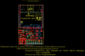
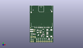
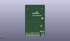
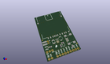

Contents
========

* [PROJ-SPAR-12886-STAN-01>Electric Imp Breakout](#proj-spar-12886-stan-01electric-imp-breakout)
	* [Images](#images)
	* [Interactive BOM](#interactive-bom)
	* [Tags](#tags)
  
![][im]
# PROJ-SPAR-12886-STAN-01>Electric Imp Breakout

- ID: PROJ-SPAR-12886-STAN-01
- Hex ID: PRS12886
- Name: Electric Imp Breakout
- Description: 

## Images
  
  

|eagleImage|kicadPcb3dFront|kicadPcb3dBack|kicadPcb3d|
| :---: | :---: | :---: | :---: |
|||||

## Interactive BOM

- Interactive BOM page: [ibom.html](kicad/bom/ibom.html)

## Tags

- hexID: PRS12886
- oompType: PROJ
- oompSize: SPAR
- oompColor: 12886
- oompDesc: STAN
- oompIndex: 01
- oompName: Electric Imp Breakout
- sources: All source files from https://github.com/sparkfun/Electric_Imp_Breakout (source licence details in srcLicense.md)
- linkBuyPage: https://www.sparkfun.com/products/12886
- oompID: PROJ-SPAR-12886-STAN-01
- oompParts: C1,UNMATCHED-UNMATCHED-UNMATCHED-UNMATCHED-UNMATCHED
- oompParts: C2,UNMATCHED-UNMATCHED-UNMATCHED-UNMATCHED-UNMATCHED
- oompParts: C4,UNMATCHED-UNMATCHED-UNMATCHED-UNMATCHED-UNMATCHED
- oompParts: FRAME1,UNMATCHED-UNMATCHED-UNMATCHED-UNMATCHED-UNMATCHED
- oompParts: JP1,UNMATCHED-UNMATCHED-UNMATCHED-UNMATCHED-UNMATCHED
- oompParts: JP2,UNMATCHED-UNMATCHED-UNMATCHED-UNMATCHED-UNMATCHED
- oompParts: JP3,UNMATCHED-UNMATCHED-UNMATCHED-UNMATCHED-UNMATCHED
- oompParts: JP4,UNMATCHED-UNMATCHED-UNMATCHED-UNMATCHED-UNMATCHED
- oompParts: JP5,UNMATCHED-UNMATCHED-UNMATCHED-UNMATCHED-UNMATCHED
- oompParts: JP6,UNMATCHED-UNMATCHED-UNMATCHED-UNMATCHED-UNMATCHED
- oompParts: JP7,UNMATCHED-UNMATCHED-UNMATCHED-UNMATCHED-UNMATCHED
- oompParts: L1,UNMATCHED-UNMATCHED-UNMATCHED-UNMATCHED-UNMATCHED
- oompParts: Q1,UNMATCHED-UNMATCHED-UNMATCHED-UNMATCHED-UNMATCHED
- oompParts: R1,UNMATCHED-UNMATCHED-UNMATCHED-UNMATCHED-UNMATCHED
- oompParts: R2,UNMATCHED-UNMATCHED-UNMATCHED-UNMATCHED-UNMATCHED
- oompParts: R3,UNMATCHED-UNMATCHED-UNMATCHED-UNMATCHED-UNMATCHED
- oompParts: U$3,UNMATCHED-UNMATCHED-UNMATCHED-UNMATCHED-UNMATCHED
- oompParts: U$5,UNMATCHED-UNMATCHED-UNMATCHED-UNMATCHED-UNMATCHED
- oompParts: U2,UNMATCHED-UNMATCHED-UNMATCHED-UNMATCHED-UNMATCHED
- oompParts: U3,UNMATCHED-UNMATCHED-UNMATCHED-UNMATCHED-UNMATCHED
- oompParts: U4,UNMATCHED-UNMATCHED-UNMATCHED-UNMATCHED-UNMATCHED
- oompParts: X1,UNMATCHED-UNMATCHED-UNMATCHED-UNMATCHED-UNMATCHED
- rawParts: C1,10uF,10UF50V20%(1210),1210,CAP-09824,CAP-09824,10uF,
- rawParts: C2,22uF,22UF-6.3V-20%(0805),0805,CAP-08402,CAP-08402,22uF,
- rawParts: C4,0.1uF,0.1UF-25V(+80/-20%)(0603),0603-CAP,CAP-00810,CAP-00810,0.1uF,
- rawParts: FID1,FIDUCIAL1X2,FIDUCIAL1X2,FIDUCIAL-1X2,Fiducial Alignment Points,,,
- rawParts: FID2,FIDUCIAL1X2,FIDUCIAL1X2,FIDUCIAL-1X2,Fiducial Alignment Points,,,
- rawParts: FRAME1,FRAME-LETTER,FRAME-LETTER,CREATIVE_COMMONS,Schematic Frame,,,
- rawParts: JP1,M09NO_SILK,M09NO_SILK,1X09_NO_SILK,Header 9,,,
- rawParts: JP2,,M021X02_NO_SILK,1X02_NO_SILK,Header 2,,,
- rawParts: JP3,,M02SMD,1X02_SMD,Header 2,,,
- rawParts: JP4,,M02-JST-2-PTH-NO_SILK,JST-2-PTH-NS,Header 2,,,
- rawParts: JP5,,M031X03_NO_SILK,1X03_NO_SILK,Header 3,,,
- rawParts: JP6,LOGO-SFESK,LOGO-SFESK,SFE-LOGO-FLAME,Spark Fun Electronics PCB Logo,,,
- rawParts: JP7,SFE_LOGO_NAME_FLAME.1_INCH,SFE_LOGO_NAME_FLAME.1_INCH,SFE_LOGO_NAME_FLAME_.1,SFE Logo, name and flame,,,
- rawParts: L1,2.2uH,INDUCTORVLF4012A,VLF4012A,Inductors,,,
- rawParts: Q1,DMG2307L-7,MOSFET-PCHANNELSMD,SOT23-3,Generic PMOSFET,,,
- rawParts: R1,100k,100KOHM1/10W1%(0603),0603-RES,RES-07828,RES-07828,100k,
- rawParts: R2,dnp,RESISTOR0603,0603-RES,Resistor,,,
- rawParts: R3,100k,100KOHM1/10W1%(0603),0603-RES,RES-07828,RES-07828,100k,
- rawParts: U$3,REVISION,REVISION,REVISION,,,,
- rawParts: U$5,OSHW-LOGOS,OSHW-LOGOS,OSHW-LOGO-S,Open Source Hardware Logo This logo indicates the piece of hardware it is found on incorporates a OSHW license and/or adheres to the definition of open source hardware found here: http://freedomdefined.org/OSHW,,,
- rawParts: U2,TPS62172,TPS62172,WSON-8-PAD,,,,
- rawParts: U3,ATSHA204-TSU,ATSHA204-TSU,SOT23-3,,,,
- rawParts: U4,ELECTRIC_IMP,ELECTRIC_IMP,SD_1:1,Electric Imp SD Socket,CONN-11976,,
- rawParts: X1,USBSMD,USBSMD,USB-MINIB,USB Connectors,,,

[im]: kicadPcb3d_450.png
