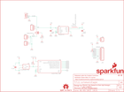

Contents
========

* [PRS12886 > Electric Imp Breakout](#prs12886--electric-imp-breakout)
	* [Schematic](#schematic)
	* [PCB](#pcb)
	* [Interactive BOM](#interactive-bom)
	* [OOMP Parts](#oomp-parts)
	* [Images](#images)
	* [Tags](#tags)
  
![][im]
# PRS12886 > Electric Imp Breakout

- ID: PROJ-SPAR-12886-STAN-01
- Hex ID: PRS12886
- Name: Sparkfun
- Description: Sparkfun
- Long Link: [http://oom.lt/PROJ-SPAR-12886-STAN-01](http://oom.lt/PROJ-SPAR-12886-STAN-01)
- Short Link: [http://oom.lt/PRS12886](http://oom.lt/PRS12886)

## Schematic
  

## PCB
  

## Interactive BOM

- Interactive BOM page: [ibom.html](https://htmlpreview.github.io/?https://github.com/oomlout/oomlout_OOMP_projects/blob/main/PROJ-SPAR-12886-STAN-01/kicad/bom/ibom.html)

## OOMP Parts
  

|OOMP Parts|
| :---: |
|CAPX-UNMATCHED-X-UF10-01 C1|
|[CAPC-0805-X-UF22-V63D  SMD (0805) 22 uF Capacitor (Ceramic) 6.3v  C2](https://github.com/oomlout/oomlout_OOMP_parts/tree/main/CAPC-0805-X-UF22-V63D/)|
|[CAPC-0603-X-NF100-V50  SMD (0603) 100 nF Capacitor (Ceramic) 50v  C4](https://github.com/oomlout/oomlout_OOMP_parts/tree/main/CAPC-0603-X-NF100-V50/)|
|[HEAD-I01-X-PI09-01  2.54 mm 9 Pin Header  JP1](https://github.com/oomlout/oomlout_OOMP_parts/tree/main/HEAD-I01-X-PI09-01/)|
|[HEAD-I01-X-PI02-01  2.54 mm 2 Pin Header  JP2, JP3](https://github.com/oomlout/oomlout_OOMP_parts/tree/main/HEAD-I01-X-PI02-01/)|
|HEAD-I01-X-UNMATCHED-01 JP4|
|[HEAD-I01-X-PI03-01  2.54 mm 3 Pin Header  JP5](https://github.com/oomlout/oomlout_OOMP_parts/tree/main/HEAD-I01-X-PI03-01/)|
|UNMATCHED-UNMATCHED-X-UNMATCHED-01 L1, U2, U4, X1|
|UNMATCHED-SO23-X-UNMATCHED-01 Q1, U3|
|RESE-0603-X-O1003-01 R1, R3|
|RESE-0603-X-UNMATCHED-01 R2|

## Images
  
  

|bominteractivefront|bominteractiveback|kicadPcb3d|kicadPcb3dFront|kicadPcb3dBack|eagleImage|eagleSchemImage|
| :---: | :---: | :---: | :---: | :---: | :---: | :---: |
||||||||

## Tags

- hexID: PRS12886
- oompType: PROJ
- oompSize: SPAR
- oompColor: 12886
- oompDesc: STAN
- oompIndex: 01
- oompName: Electric Imp Breakout
- sources: All source files from https://github.com/sparkfun/Electric_Imp_Breakout (source licence details in srcLicense.md)
- linkBuyPage: https://www.sparkfun.com/products/12886
- oompID: PROJ-SPAR-12886-STAN-01
- oompParts: C1,CAPX-UNMATCHED-X-UF10-01
- oompParts: C2,CAPC-0805-X-UF22-V63D
- oompParts: C4,CAPC-0603-X-NF100-V50
- oompParts: JP1,HEAD-I01-X-PI09-01
- oompParts: JP2,HEAD-I01-X-PI02-01
- oompParts: JP3,HEAD-I01-X-PI02-01
- oompParts: JP4,HEAD-I01-X-UNMATCHED-01
- oompParts: JP5,HEAD-I01-X-PI03-01
- oompParts: L1,UNMATCHED-UNMATCHED-X-UNMATCHED-01
- oompParts: Q1,UNMATCHED-SO23-X-UNMATCHED-01
- oompParts: R1,RESE-0603-X-O1003-01
- oompParts: R2,RESE-0603-X-UNMATCHED-01
- oompParts: R3,RESE-0603-X-O1003-01
- oompParts: U2,UNMATCHED-UNMATCHED-X-UNMATCHED-01
- oompParts: U3,UNMATCHED-SO23-X-UNMATCHED-01
- oompParts: U4,UNMATCHED-UNMATCHED-X-UNMATCHED-01
- oompParts: X1,UNMATCHED-UNMATCHED-X-UNMATCHED-01
- rawParts: C1,10uF,10UF50V20%(1210),1210,CAP-09824,CAP-09824,10uF,
- rawParts: C2,22uF,22UF-6.3V-20%(0805),0805,CAP-08402,CAP-08402,22uF,
- rawParts: C4,0.1uF,0.1UF-25V(+80/-20%)(0603),0603-CAP,CAP-00810,CAP-00810,0.1uF,
- rawParts: FID1,FIDUCIAL1X2,FIDUCIAL1X2,FIDUCIAL-1X2,Fiducial Alignment Points,,,
- rawParts: FID2,FIDUCIAL1X2,FIDUCIAL1X2,FIDUCIAL-1X2,Fiducial Alignment Points,,,
- rawParts: FRAME1,FRAME-LETTER,FRAME-LETTER,CREATIVE_COMMONS,Schematic Frame,,,
- rawParts: JP1,M09NO_SILK,M09NO_SILK,1X09_NO_SILK,Header 9,,,
- rawParts: JP2,,M021X02_NO_SILK,1X02_NO_SILK,Header 2,,,
- rawParts: JP3,,M02SMD,1X02_SMD,Header 2,,,
- rawParts: JP4,,M02-JST-2-PTH-NO_SILK,JST-2-PTH-NS,Header 2,,,
- rawParts: JP5,,M031X03_NO_SILK,1X03_NO_SILK,Header 3,,,
- rawParts: JP6,LOGO-SFESK,LOGO-SFESK,SFE-LOGO-FLAME,Spark Fun Electronics PCB Logo,,,
- rawParts: JP7,SFE_LOGO_NAME_FLAME.1_INCH,SFE_LOGO_NAME_FLAME.1_INCH,SFE_LOGO_NAME_FLAME_.1,SFE Logo, name and flame,,,
- rawParts: L1,2.2uH,INDUCTORVLF4012A,VLF4012A,Inductors,,,
- rawParts: Q1,DMG2307L-7,MOSFET-PCHANNELSMD,SOT23-3,Generic PMOSFET,,,
- rawParts: R1,100k,100KOHM1/10W1%(0603),0603-RES,RES-07828,RES-07828,100k,
- rawParts: R2,dnp,RESISTOR0603,0603-RES,Resistor,,,
- rawParts: R3,100k,100KOHM1/10W1%(0603),0603-RES,RES-07828,RES-07828,100k,
- rawParts: U$3,REVISION,REVISION,REVISION,,,,
- rawParts: U$5,OSHW-LOGOS,OSHW-LOGOS,OSHW-LOGO-S,Open Source Hardware Logo This logo indicates the piece of hardware it is found on incorporates a OSHW license and/or adheres to the definition of open source hardware found here: http://freedomdefined.org/OSHW,,,
- rawParts: U2,TPS62172,TPS62172,WSON-8-PAD,,,,
- rawParts: U3,ATSHA204-TSU,ATSHA204-TSU,SOT23-3,,,,
- rawParts: U4,ELECTRIC_IMP,ELECTRIC_IMP,SD_1:1,Electric Imp SD Socket,CONN-11976,,
- rawParts: X1,USBSMD,USBSMD,USB-MINIB,USB Connectors,,,

[im]: kicadPcb3d_450.png
