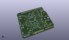
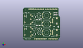
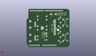
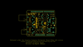
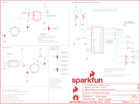

Contents
========

* [PRS12898 > Sparkfun](#prs12898--sparkfun)
	* [Schematic](#schematic)
	* [Interactive BOM](#interactive-bom)
	* [OOMP Parts](#oomp-parts)
	* [Images](#images)
	* [Tags](#tags)
  
![][im]
# PRS12898 > Sparkfun

- ID: PROJ-SPAR-12898-STAN-01
- Hex ID: PRS12898
- Name: Sparkfun
- Description: Sparkfun
- Long Link: [http://oom.lt/PROJ-SPAR-12898-STAN-01](http://oom.lt/PROJ-SPAR-12898-STAN-01)
- Short Link: [http://oom.lt/PRS12898](http://oom.lt/PRS12898)

## Schematic
  

## Interactive BOM

- Interactive BOM page: [ibom.html](https://htmlpreview.github.io/?https://github.com/oomlout/oomlout_OOMP_projects/blob/main/PROJ-SPAR-12898-STAN-01/kicad/bom/ibom.html)

## OOMP Parts
  

|OOMP Parts|
| :---: |
|D1,DIOD-UNMATCHED-X-UNMATCHED-01,D1,MBRA140,MBRA140,SMA-DIODE,40V, 1A Schottky rectifier,DIO-08053,,|
|FRAME1,UNMATCHED-UNMATCHED-X-UNMATCHED-01,FID1,FIDUCIALUFIDUCIAL,FIDUCIALUFIDUCIAL,MICRO-FIDUCIAL,Fiducial Alignment Points,,,|
|J1,UNMATCHED-UNMATCHED-X-UNMATCHED-01,FID2,FIDUCIALUFIDUCIAL,FIDUCIALUFIDUCIAL,MICRO-FIDUCIAL,Fiducial Alignment Points,,,|
|J2,UNMATCHED-UNMATCHED-X-UNMATCHED-01,FRAME1,Frame,FRAME-LETTER,CREATIVE_COMMONS,Schematic Frame,,,|
|J3,UNMATCHED-UNMATCHED-X-UNMATCHED-01,J1,MIDI IN,5-PIN-CIRCULAR-DINNEW,5-PIN-DIN-RA-PCB-NEW,5-pin circular DIN connector.,CONN-09481,,|
|LED1,LEDS-0603-G-STAN-01,J2,MIDI OUT,5-PIN-CIRCULAR-DINNEW,5-PIN-DIN-RA-PCB-NEW,5-pin circular DIN connector.,CONN-09481,,|
|LED2,LEDS-0603-G-STAN-01,J3,UNO_R3_SHIELD,ARDUINO_R3_SHIELD,UNO_R3_SHIELD,Shield form compatible with the Arduino Uno R3.,,,|
|R1,RESE-0603-X-O221-01,LED1,RED,LED-RED0603,LED-0603,Assorted Red LEDs,DIO-00819,RED,|
|R2,RESE-0603-X-O221-01,LED2,GREEN,LED-GREEN0603,LED-0603,Various green LEDs,DIO-00821,GREEN,|
|R3,RESE-0603-X-O221-01,LOGO1,SFE_LOGO_NAME_FLAME.2_INCH,SFE_LOGO_NAME_FLAME.2_INCH,SFE_LOGO_NAME_FLAME_.2,SFE Logo, name and flame,,,|
|R4,RESE-0603-X-O221-01,LOGO2,OSHW-LOGOS,OSHW-LOGOS,OSHW-LOGO-S,Open Source Hardware Logo,,,|
|R5,RESE-0603-X-O331-01,LOGO3,OSHW-LOGOM,OSHW-LOGOM,OSHW-LOGO-M,Open Source Hardware Logo,,,|
|R6,RESE-0603-X-O331-01,LOGO5,SFE_LOGO_FLAME.1_INCH,SFE_LOGO_FLAME.1_INCH,SFE_LOGO_FLAME_.1,SFE Logo, flame only,,,|
|RV1,UNMATCHED-UNMATCHED-X-UNMATCHED-01,R1,220,220OHM-1/10W-1%(0603),0603-RES,RES-07861,RES-07861,220,|
|RV2,UNMATCHED-UNMATCHED-X-UNMATCHED-01,R2,220,220OHM-1/10W-1%(0603),0603-RES,RES-07861,RES-07861,220,|
|S1,UNMATCHED-UNMATCHED-X-UNMATCHED-01,R3,220,220OHM-1/10W-1%(0603),0603-RES,RES-07861,RES-07861,220,|
|S2,UNMATCHED-UNMATCHED-X-UNMATCHED-01,R4,220,220OHM-1/10W-1%(0603),0603-RES,RES-07861,RES-07861,220,|
|S3,UNMATCHED-UNMATCHED-X-UNMATCHED-01,R5,330,330OHM1/10W1%(0603),0603-RES,RES-00818,RES-00818,330,|
|S4,UNMATCHED-UNMATCHED-X-UNMATCHED-01,R6,330,330OHM1/10W1%(0603),0603-RES,RES-00818,RES-00818,330,|
|S5,UNMATCHED-UNMATCHED-X-UNMATCHED-01,RV1,10k,POT,ALPS_POT,,RES-09177,,|
|U$1,UNMATCHED-UNMATCHED-X-UNMATCHED-01,RV2,10k,POT,ALPS_POT,,RES-09177,,|
|U1,UNMATCHED-UNMATCHED-X-UNMATCHED-01,S1,Reset,SWITCH-MOMENTARY-2SMD,TACTILE-SWITCH-SMD,Various NO switches- pushbuttons, reed, etc,SWCH-08247,,|
|U2,UNMATCHED-SO235-X-UNMATCHED-01,S2,RUN/PROGRAM,SWITCH-SPDTSMD,AYZ0202,SPDT Switch,SWCH-08179,,|

## Images
  
  

|kicadPcb3d|kicadPcb3dFront|kicadPcb3dBack|eagleImage|eagleSchemImage|
| :---: | :---: | :---: | :---: | :---: |
||||||

## Tags

- hexID: PRS12898
- oompType: PROJ
- oompSize: SPAR
- oompColor: 12898
- oompDesc: STAN
- oompIndex: 01
- oompName: MIDI Shield
- sources: All source files from https://github.com/sparkfun/MIDI_Shield (source licence details in srcLicense.md)
- linkBuyPage: https://www.sparkfun.com/products/12898
- oompID: PROJ-SPAR-12898-STAN-01
- oompParts: D1,DIOD-UNMATCHED-X-UNMATCHED-01
- oompParts: FRAME1,UNMATCHED-UNMATCHED-X-UNMATCHED-01
- oompParts: J1,UNMATCHED-UNMATCHED-X-UNMATCHED-01
- oompParts: J2,UNMATCHED-UNMATCHED-X-UNMATCHED-01
- oompParts: J3,UNMATCHED-UNMATCHED-X-UNMATCHED-01
- oompParts: LED1,LEDS-0603-G-STAN-01
- oompParts: LED2,LEDS-0603-G-STAN-01
- oompParts: R1,RESE-0603-X-O221-01
- oompParts: R2,RESE-0603-X-O221-01
- oompParts: R3,RESE-0603-X-O221-01
- oompParts: R4,RESE-0603-X-O221-01
- oompParts: R5,RESE-0603-X-O331-01
- oompParts: R6,RESE-0603-X-O331-01
- oompParts: RV1,UNMATCHED-UNMATCHED-X-UNMATCHED-01
- oompParts: RV2,UNMATCHED-UNMATCHED-X-UNMATCHED-01
- oompParts: S1,UNMATCHED-UNMATCHED-X-UNMATCHED-01
- oompParts: S2,UNMATCHED-UNMATCHED-X-UNMATCHED-01
- oompParts: S3,UNMATCHED-UNMATCHED-X-UNMATCHED-01
- oompParts: S4,UNMATCHED-UNMATCHED-X-UNMATCHED-01
- oompParts: S5,UNMATCHED-UNMATCHED-X-UNMATCHED-01
- oompParts: U$1,UNMATCHED-UNMATCHED-X-UNMATCHED-01
- oompParts: U1,UNMATCHED-UNMATCHED-X-UNMATCHED-01
- oompParts: U2,UNMATCHED-SO235-X-UNMATCHED-01
- rawParts: D1,MBRA140,MBRA140,SMA-DIODE,40V, 1A Schottky rectifier,DIO-08053,,
- rawParts: FID1,FIDUCIALUFIDUCIAL,FIDUCIALUFIDUCIAL,MICRO-FIDUCIAL,Fiducial Alignment Points,,,
- rawParts: FID2,FIDUCIALUFIDUCIAL,FIDUCIALUFIDUCIAL,MICRO-FIDUCIAL,Fiducial Alignment Points,,,
- rawParts: FRAME1,Frame,FRAME-LETTER,CREATIVE_COMMONS,Schematic Frame,,,
- rawParts: J1,MIDI IN,5-PIN-CIRCULAR-DINNEW,5-PIN-DIN-RA-PCB-NEW,5-pin circular DIN connector.,CONN-09481,,
- rawParts: J2,MIDI OUT,5-PIN-CIRCULAR-DINNEW,5-PIN-DIN-RA-PCB-NEW,5-pin circular DIN connector.,CONN-09481,,
- rawParts: J3,UNO_R3_SHIELD,ARDUINO_R3_SHIELD,UNO_R3_SHIELD,Shield form compatible with the Arduino Uno R3.,,,
- rawParts: LED1,RED,LED-RED0603,LED-0603,Assorted Red LEDs,DIO-00819,RED,
- rawParts: LED2,GREEN,LED-GREEN0603,LED-0603,Various green LEDs,DIO-00821,GREEN,
- rawParts: LOGO1,SFE_LOGO_NAME_FLAME.2_INCH,SFE_LOGO_NAME_FLAME.2_INCH,SFE_LOGO_NAME_FLAME_.2,SFE Logo, name and flame,,,
- rawParts: LOGO2,OSHW-LOGOS,OSHW-LOGOS,OSHW-LOGO-S,Open Source Hardware Logo,,,
- rawParts: LOGO3,OSHW-LOGOM,OSHW-LOGOM,OSHW-LOGO-M,Open Source Hardware Logo,,,
- rawParts: LOGO5,SFE_LOGO_FLAME.1_INCH,SFE_LOGO_FLAME.1_INCH,SFE_LOGO_FLAME_.1,SFE Logo, flame only,,,
- rawParts: R1,220,220OHM-1/10W-1%(0603),0603-RES,RES-07861,RES-07861,220,
- rawParts: R2,220,220OHM-1/10W-1%(0603),0603-RES,RES-07861,RES-07861,220,
- rawParts: R3,220,220OHM-1/10W-1%(0603),0603-RES,RES-07861,RES-07861,220,
- rawParts: R4,220,220OHM-1/10W-1%(0603),0603-RES,RES-07861,RES-07861,220,
- rawParts: R5,330,330OHM1/10W1%(0603),0603-RES,RES-00818,RES-00818,330,
- rawParts: R6,330,330OHM1/10W1%(0603),0603-RES,RES-00818,RES-00818,330,
- rawParts: RV1,10k,POT,ALPS_POT,,RES-09177,,
- rawParts: RV2,10k,POT,ALPS_POT,,RES-09177,,
- rawParts: S1,Reset,SWITCH-MOMENTARY-2SMD,TACTILE-SWITCH-SMD,Various NO switches- pushbuttons, reed, etc,SWCH-08247,,
- rawParts: S2,RUN/PROGRAM,SWITCH-SPDTSMD,AYZ0202,SPDT Switch,SWCH-08179,,
- rawParts: S3,SWITCH-MOMENTARY-212MM,SWITCH-MOMENTARY-212MM,TACTILE-PTH-12MM,Various NO switches- pushbuttons, reed, etc,SWCH-09185,,
- rawParts: S4,SWITCH-MOMENTARY-212MM,SWITCH-MOMENTARY-212MM,TACTILE-PTH-12MM,Various NO switches- pushbuttons, reed, etc,SWCH-09185,,
- rawParts: S5,SWITCH-MOMENTARY-212MM,SWITCH-MOMENTARY-212MM,TACTILE-PTH-12MM,Various NO switches- pushbuttons, reed, etc,SWCH-09185,,
- rawParts: SJ1,RX sel,JUMPER-PAD-3-2OF3_NC_BY_TRACE_SMALL,PAD-JUMPER-3-2OF3_NC_BY_TRACE_YES_SILK_FULL_BOX,,,,
- rawParts: SJ2,TX sel,JUMPER-PAD-3-2OF3_NC_BY_TRACE_SMALL,PAD-JUMPER-3-2OF3_NC_BY_TRACE_YES_SILK_FULL_BOX,,,,
- rawParts: SJ3,out/thru,JUMPER-PAD-3-2OF3_NC_BY_TRACE_SMALL,PAD-JUMPER-3-2OF3_NC_BY_TRACE_YES_SILK_FULL_BOX,,,,
- rawParts: SJ4,JUMPER-PAD-2-NOYES_SILK,JUMPER-PAD-2-NOYES_SILK,PAD-JUMPER-2-NO_YES_SILK,,,,
- rawParts: SJ5,JUMPER-PAD-2-NOYES_SILK,JUMPER-PAD-2-NOYES_SILK,PAD-JUMPER-2-NO_YES_SILK,,,,
- rawParts: SJ6,JUMPER-PAD-2-NOYES_SILK,JUMPER-PAD-2-NOYES_SILK,PAD-JUMPER-2-NO_YES_SILK,,,,
- rawParts: SJ7,JUMPER-PAD-2-NOYES_SILK,JUMPER-PAD-2-NOYES_SILK,PAD-JUMPER-2-NO_YES_SILK,,,,
- rawParts: U$1,REVISION,REVISION,REVISION,,,,
- rawParts: U1,6N138M,OPTO_DARL_6N138S,8-SMD,Optoisolator, darlington pair output,IC-09482,6N138M,
- rawParts: U2,74AHC1G125,74AHC1G125,SOT23-5,Single bus buffer gate with 3-state output,IC-11920,,

[im]: kicadPcb3d_450.png
