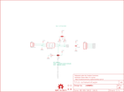

Contents
========

* [PRS12918 > Sparkfun](#prs12918--sparkfun)
	* [Images](#images)
	* [Tags](#tags)
  
![][im]
# PRS12918 > Sparkfun

- ID: PROJ-SPAR-12918-STAN-01
- Hex ID: PRS12918
- Name: Sparkfun
- Description: Sparkfun

## Images
  
  

|kicadPcb3d|kicadPcb3dFront|kicadPcb3dBack|eagleImage|eagleSchemImage|
| :---: | :---: | :---: | :---: | :---: |
||||||

## Tags

- hexID: PRS12918
- oompType: PROJ
- oompSize: SPAR
- oompColor: 12918
- oompDesc: STAN
- oompIndex: 01
- oompName: MCP4725 Breakout
- sources: All source files from https://github.com/sparkfun/MCP4725_Breakout (source licence details in srcLicense.md)
- linkBuyPage: https://www.sparkfun.com/products/12918
- oompID: PROJ-SPAR-12918-STAN-01
- oompParts: C1,UNMATCHED-UNMATCHED-UNMATCHED-UNMATCHED-UNMATCHED
- oompParts: FRAME2,UNMATCHED-UNMATCHED-UNMATCHED-UNMATCHED-UNMATCHED
- oompParts: GND,UNMATCHED-UNMATCHED-UNMATCHED-UNMATCHED-UNMATCHED
- oompParts: JP5,UNMATCHED-UNMATCHED-UNMATCHED-UNMATCHED-UNMATCHED
- oompParts: JP6,UNMATCHED-UNMATCHED-UNMATCHED-UNMATCHED-UNMATCHED
- oompParts: LOGO1,UNMATCHED-UNMATCHED-UNMATCHED-UNMATCHED-UNMATCHED
- oompParts: R1,UNMATCHED-UNMATCHED-UNMATCHED-UNMATCHED-UNMATCHED
- oompParts: R2,UNMATCHED-UNMATCHED-UNMATCHED-UNMATCHED-UNMATCHED
- oompParts: R3,UNMATCHED-UNMATCHED-UNMATCHED-UNMATCHED-UNMATCHED
- oompParts: SJ1,UNMATCHED-UNMATCHED-UNMATCHED-UNMATCHED-UNMATCHED
- oompParts: SJ2,UNMATCHED-UNMATCHED-UNMATCHED-UNMATCHED-UNMATCHED
- oompParts: STANDOFF1,UNMATCHED-UNMATCHED-UNMATCHED-UNMATCHED-UNMATCHED
- oompParts: STANDOFF2,UNMATCHED-UNMATCHED-UNMATCHED-UNMATCHED-UNMATCHED
- oompParts: U1,UNMATCHED-UNMATCHED-UNMATCHED-UNMATCHED-UNMATCHED
- rawParts: C1,0.1uF,CAP0603-CAP,0603-CAP,Capacitor,,,,,
- rawParts: FID1,FIDUCIAL1X2,FIDUCIAL1X2,FIDUCIAL-1X2,Fiducial Alignment Points,,,,,
- rawParts: FID2,FIDUCIAL1X2,FIDUCIAL1X2,FIDUCIAL-1X2,Fiducial Alignment Points,,,,,
- rawParts: FRAME2,,FRAME-LETTER,CREATIVE_COMMONS,Schematic Frame,NAME,,,v01,
- rawParts: GND,LOGO-SFESK,LOGO-SFESK,SFE-LOGO-FLAME,Spark Fun Electronics PCB Logo,,,,,
- rawParts: JP5,,M04PTH,1X04,Header 4,,,,,
- rawParts: JP6,M02PTH,M02PTH,1X02,Standard 2-pin 0.1 header. Use with,,,,,
- rawParts: LOGO1,OSHW-LOGOS,OSHW-LOGOS,OSHW-LOGO-S,Open Source Hardware Logo This logo indicates the piece of hardware it is found on incorporates a OSHW license and/or adheres to the definition of open source hardware found here: http://freedomdefined.org/OSHW,,,,,
- rawParts: R1,4.7k,RESISTOR0603-RES,0603-RES,Resistor,,,,,
- rawParts: R2,4.7k,RESISTOR0603-RES,0603-RES,Resistor,,,,,
- rawParts: R3,10k,RESISTOR0603-RES,0603-RES,Resistor,,,,,
- rawParts: SJ1,,JUMPER-PAD-3-NC_BY_TRACE,PAD-JUMPER-3-3OF3_NC_BY_TRACE_YES_SILK_FULL_BOX,,,,,,
- rawParts: SJ2,JUMPER-PAD-3-2OF3_NC_BY_PASTE,JUMPER-PAD-3-2OF3_NC_BY_PASTE,PAD-JUMPER-3-2OF3_NC_BY_PASTE_YES_SILK_FULL_BOX,,,,,,
- rawParts: STANDOFF1,STAND-OFF,STAND-OFF,STAND-OFF,#4 Stand Off,,,,,
- rawParts: STANDOFF2,STAND-OFF,STAND-OFF,STAND-OFF,#4 Stand Off,,,,,
- rawParts: U1,MCP4725,MCP4725SOT-23,SOT23-6,Microchip 12-bit I2C DAC, SOT23-6,,IC-08886,MCP4725,,

[im]: kicadPcb3d_450.png
