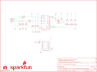

Contents
========

* [PRS12924 > MicroView USB Programmer](#prs12924--microview-usb-programmer)
	* [Schematic](#schematic)
	* [PCB](#pcb)
	* [Interactive BOM](#interactive-bom)
	* [OOMP Parts](#oomp-parts)
	* [Images](#images)
	* [Tags](#tags)
  
![][im]
# PRS12924 > MicroView USB Programmer

- ID: PROJ-SPAR-12924-STAN-01
- Hex ID: PRS12924
- Name: Sparkfun
- Description: Sparkfun
- Long Link: [http://oom.lt/PROJ-SPAR-12924-STAN-01](http://oom.lt/PROJ-SPAR-12924-STAN-01)
- Short Link: [http://oom.lt/PRS12924](http://oom.lt/PRS12924)

## Schematic
  

## PCB
  

## Interactive BOM

- Interactive BOM page: [ibom.html](https://htmlpreview.github.io/?https://github.com/oomlout/oomlout_OOMP_projects/blob/main/PROJ-SPAR-12924-STAN-01/kicad/bom/ibom.html)

## OOMP Parts
  

|OOMP ID|Name|Identifier|
| :---: | :---: | :---: |
|[CAPC-0603-X-NF100-V50](https://github.com/oomlout/oomlout_OOMP_parts/tree/main/CAPC-0603-X-NF100-V50/)|[SMD (0603) 100 nF Capacitor (Ceramic) 50v](https://github.com/oomlout/oomlout_OOMP_parts/tree/main/CAPC-0603-X-NF100-V50/)|[C1, C5, C6, C7](https://github.com/oomlout/oomlout_OOMP_parts/tree/main/CAPC-0603-X-NF100-V50/)|
|CAPC-0603-X-PF47-01||C2, C3|
|CAPT-3216-X-UF10-01||C4|
|LEDS-1206-G-STAN-01||D1|
|LEDS-1206-R-STAN-01||D2|
|LEDS-1206-Y-STAN-01||D3|
|REFU-1206-X-UNMATCHED-01||F1|
|UNMATCHED-UNMATCHED-X-UNMATCHED-01||J1, JP1, Q1, U1|
|[RESE-0603-X-O103-01](https://github.com/oomlout/oomlout_OOMP_parts/tree/main/RESE-0603-X-O103-01/)|[SMD (0603) 10k Ohm Resistor](https://github.com/oomlout/oomlout_OOMP_parts/tree/main/RESE-0603-X-O103-01/)|[R1, R2](https://github.com/oomlout/oomlout_OOMP_parts/tree/main/RESE-0603-X-O103-01/)|
|[RESE-0603-X-O102-01](https://github.com/oomlout/oomlout_OOMP_parts/tree/main/RESE-0603-X-O102-01/)|[SMD (0603) 1k Ohm Resistor](https://github.com/oomlout/oomlout_OOMP_parts/tree/main/RESE-0603-X-O102-01/)|[R3, R4, R5](https://github.com/oomlout/oomlout_OOMP_parts/tree/main/RESE-0603-X-O102-01/)|
|RESE-0603-X-O270-01||R6, R7|

## Images
  
  

|bominteractivefront|bominteractiveback|kicadPcb3d|kicadPcb3dFront|kicadPcb3dBack|eagleImage|eagleSchemImage|pcbdraw|pcbdrawback|
| :---: | :---: | :---: | :---: | :---: | :---: | :---: | :---: | :---: |
||||||||||

## Tags

- hexID: PRS12924
- oompType: PROJ
- oompSize: SPAR
- oompColor: 12924
- oompDesc: STAN
- oompIndex: 01
- oompName: MicroView USB Programmer
- sources: All source files from https://github.com/sparkfun/MicroView_USB_Programmer (source licence details in srcLicense.md)
- linkBuyPage: https://www.sparkfun.com/products/12924
- oompID: PROJ-SPAR-12924-STAN-01
- oompParts: C1,CAPC-0603-X-NF100-V50
- oompParts: C2,CAPC-0603-X-PF47-01
- oompParts: C3,CAPC-0603-X-PF47-01
- oompParts: C4,CAPT-3216-X-UF10-01
- oompParts: C5,CAPC-0603-X-NF100-V50
- oompParts: C6,CAPC-0603-X-NF100-V50
- oompParts: C7,CAPC-0603-X-NF100-V50
- oompParts: D1,LEDS-1206-G-STAN-01
- oompParts: D2,LEDS-1206-R-STAN-01
- oompParts: D3,LEDS-1206-Y-STAN-01
- oompParts: F1,REFU-1206-X-UNMATCHED-01
- oompParts: J1,UNMATCHED-UNMATCHED-X-UNMATCHED-01
- oompParts: JP1,UNMATCHED-UNMATCHED-X-UNMATCHED-01
- oompParts: Q1,UNMATCHED-UNMATCHED-X-UNMATCHED-01
- oompParts: R1,RESE-0603-X-O103-01
- oompParts: R2,RESE-0603-X-O103-01
- oompParts: R3,RESE-0603-X-O102-01
- oompParts: R4,RESE-0603-X-O102-01
- oompParts: R5,RESE-0603-X-O102-01
- oompParts: R6,RESE-0603-X-O270-01
- oompParts: R7,RESE-0603-X-O270-01
- oompParts: U1,UNMATCHED-UNMATCHED-X-UNMATCHED-01
- rawParts: C1,0.1uF,0.1UF-25V(+80/-20%)(0603),0603-CAP,CAP-00810,CAP-00810,0.1uF,
- rawParts: C2,47pF,47PF-50V-5%(0603),0603-CAP,CAP-08913,CAP-08913,47pF,
- rawParts: C3,47pF,47PF-50V-5%(0603),0603-CAP,CAP-08913,CAP-08913,47pF,
- rawParts: C4,10uF,10UF-16V-10%(TANT),EIA3216,CAP-00811,CAP-00811,10uF,
- rawParts: C5,0.1uF,0.1UF-25V(+80/-20%)(0603),0603-CAP,CAP-00810,CAP-00810,0.1uF,
- rawParts: C6,0.1uF,0.1UF-25V(+80/-20%)(0603),0603-CAP,CAP-00810,CAP-00810,0.1uF,
- rawParts: C7,0.1uF,0.1UF-25V(+80/-20%)(0603),0603-CAP,CAP-00810,CAP-00810,0.1uF,
- rawParts: D1,GREEN,LED-GREENLARGE,LED-1206,Various green LEDs,DIO-00862,GREEN,
- rawParts: D2,RED,LED-RED1206,LED-1206,Assorted Red LEDs,DIO-00809,RED,
- rawParts: D3,Yellow,LED-YELLOWLILYPAD,LED-1206,Yellow SMD LEDs,DIO-09909,Yellow,
- rawParts: F1,500mA,PTCSMD-W,PTC-1206-WIDE,Resettable Fuse PTC,,,
- rawParts: FID1,FIDUCIAL1X2,FIDUCIAL1X2,FIDUCIAL-1X2,Fiducial Alignment Points,,,
- rawParts: FID2,FIDUCIAL1X2,FIDUCIAL1X2,FIDUCIAL-1X2,Fiducial Alignment Points,,,
- rawParts: FRAME1,FRAME-LETTER,FRAME-LETTER,CREATIVE_COMMONS,Schematic Frame,,,
- rawParts: J1,MICROVIEW-16ND,MICROVIEW-16ND,MV-DIP16-NODIMENSION,,,,
- rawParts: JP1,USBA-SMD-MALE,USBA-SMD-MALE,USB-A-SMT-MALE,USB Connectors,,,
- rawParts: LOGO1,SFE_LOGO_FLAME.1_INCH,SFE_LOGO_FLAME.1_INCH,SFE_LOGO_FLAME_.1,SFE Logo, flame only,,,
- rawParts: LOGO2,OSHW-LOGOS,OSHW-LOGOS,OSHW-LOGO-S,Open Source Hardware Logo This logo indicates the piece of hardware it is found on incorporates a OSHW license and/or adheres to the definition of open source hardware found here: http://freedomdefined.org/OSHW,,,
- rawParts: LOGO3,SFE_LOGO_NAME_FLAME.1_INCH,SFE_LOGO_NAME_FLAME.1_INCH,SFE_LOGO_NAME_FLAME_.1,SFE Logo, name and flame,,,
- rawParts: Q1,2N7002PW,MOSFET-NCHANNEL2N7002PW,SOT323,Common NMOSFET Parts,TRANS-11151,,
- rawParts: R1,10K,10KOHM1/10W1%(0603)0603,0603-RES,RES-00824,RES-00824,10K,
- rawParts: R2,10K,10KOHM1/10W1%(0603)0603,0603-RES,RES-00824,RES-00824,10K,
- rawParts: R3,1K,1KOHM1/10W1%(0603),0603-RES,RES-07856,RES-07856,1K,
- rawParts: R4,1K,1KOHM1/10W1%(0603),0603-RES,RES-07856,RES-07856,1K,
- rawParts: R5,1K,1KOHM1/10W1%(0603),0603-RES,RES-07856,RES-07856,1K,
- rawParts: R6,27,RESISTOR0603-RES,0603-RES,Resistor,,,
- rawParts: R7,27,RESISTOR0603-RES,0603-RES,Resistor,,,
- rawParts: U1,FT231XS,FT231XS,SSOP20_L,FTDI FT231X Full Speed USB to Full-handshake UART,,,

[im]: kicadPcb3d_450.png
