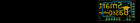

Contents
========

* [PRS12935 > Sparkfun](#prs12935--sparkfun)
	* [Schematic](#schematic)
	* [Interactive BOM](#interactive-bom)
	* [OOMP Parts](#oomp-parts)
	* [Images](#images)
	* [Tags](#tags)
  
![][im]
# PRS12935 > Sparkfun

- ID: PROJ-SPAR-12935-STAN-01
- Hex ID: PRS12935
- Name: Sparkfun
- Description: Sparkfun
- Long Link: [http://oom.lt/PROJ-SPAR-12935-STAN-01](http://oom.lt/PROJ-SPAR-12935-STAN-01)
- Short Link: [http://oom.lt/PRS12935](http://oom.lt/PRS12935)

## Schematic
  

## Interactive BOM

- Interactive BOM page: [ibom.html](https://htmlpreview.github.io/?https://github.com/oomlout/oomlout_OOMP_projects/blob/main/PROJ-SPAR-12935-STAN-01/kicad/bom/ibom.html)

## OOMP Parts
  

|OOMP Parts|
| :---: |
|C1,CAPX-UNMATCHED-X-UF10-01,C1,10uF,10UF-16V-10%(TANT),EIA3216,CAP-00811,CAP-00811,10uF,|
|C2,CAPC-0603-X-NF100-V50,C2,0.1uF,0.1UF-25V(+80/-20%)(0603),0603-CAP,CAP-00810,CAP-00810,0.1uF,|
|C3,CAPX-UNMATCHED-X-UF10-01,C3,10uF,10UF-16V-10%(TANT),EIA3216,CAP-00811,CAP-00811,10uF,|
|C4,CAPC-0603-X-NF100-V50,C4,0.1uF,0.1UF-25V(+80/-20%)(0603),0603-CAP,CAP-00810,CAP-00810,0.1uF,|
|C5,CAPC-0603-X-NF100-V50,C5,0.1uF,0.1UF-25V(+80/-20%)(0603),0603-CAP,CAP-00810,CAP-00810,0.1uF,|
|C6,CAPC-0603-X-NF100-V50,C6,0.1uF,0.1UF-25V(+80/-20%)(0603),0603-CAP,CAP-00810,CAP-00810,0.1uF,|
|CLIENT,UNMATCHED-UNMATCHED-X-UNMATCHED-01,CLIENT,,FTDI_BASICPTH,FTDI_BASIC,FTDI Basic header with labels,,,|
|D1,LEDS-0603-G-STAN-01,D1,GREEN,LED-GREEN0603,LED-0603,Various green LEDs,DIO-00821,GREEN,|
|D2,LEDS-0603-G-STAN-01,D2,RED,LED-RED0603,LED-0603,Assorted Red LEDs,DIO-00819,RED,|
|D4,LEDS-0603-G-STAN-01,D4,GREEN,LED-GREEN0603,LED-0603,Various green LEDs,DIO-00821,GREEN,|
|HOST,UNMATCHED-UNMATCHED-X-UNMATCHED-01,FID1,FIDUCIAL1X2,FIDUCIAL1X2,FIDUCIAL-1X2,Fiducial Alignment Points,,,|
|JP2,HEAD-I01-X-PI02-01,FID2,FIDUCIAL1X2,FIDUCIAL1X2,FIDUCIAL-1X2,Fiducial Alignment Points,,,|
|JP4,UNMATCHED-UNMATCHED-X-UNMATCHED-01,FRAME1,FRAME-LETTER,FRAME-LETTER,CREATIVE_COMMONS,Schematic Frame,,,|
|R1,RESE-0603-X-O102-01,HOST,,FTDI_DEVICE,FTDI_DEVICE_SIDE,Connector which mates to FTDI basic or FTDI cable.,,,|
|R2,RESE-0603-X-O102-01,JP2,M02PTH,M02PTH,1X02,Standard 2-pin 0.1 header. Use with,,,|
|R3,RESE-0603-X-O102-01,JP4,USB Micro B,USB_MICROB_PLUGCONN-11752,USB-B-MICRO-SMD_V03,USB Micro-B connectors,CONN-11752,,|
|R4,RESE-0603-X-O103-01,LOGO1,SFE_LOGO_NAME.1_INCH,SFE_LOGO_NAME.1_INCH,SFE_LOGO_NAME_.1,SFE Logo, name only,,,|
|R5,RESE-0603-X-O102-01,LOGO2,SFE_LOGO_FLAME.2_INCH,SFE_LOGO_FLAME.2_INCH,SFE_LOGO_FLAME_.2,SFE Logo, flame only,,,|
|U1,UNMATCHED-UNMATCHED-X-UNMATCHED-01,LOGO3,OSHW-LOGOS,OSHW-LOGOS,OSHW-LOGO-S,Open Source Hardware Logo This logo indicates the piece of hardware it is found on incorporates a OSHW license and/or adheres to the definition of open source hardware found here: http://freedomdefined.org/OSHW,,,|
|U2,UNMATCHED-SO235-X-UNMATCHED-01,R1,1K,1KOHM1/10W1%(0603),0603-RES,RES-07856,RES-07856,1K,|
|U3,UNMATCHED-UNMATCHED-X-UNMATCHED-01,R2,1K,1KOHM1/10W1%(0603),0603-RES,RES-07856,RES-07856,1K,|

## Images
  
  

|kicadPcb3d|kicadPcb3dFront|kicadPcb3dBack|eagleImage|eagleSchemImage|
| :---: | :---: | :---: | :---: | :---: |
||||||

## Tags

- hexID: PRS12935
- oompType: PROJ
- oompSize: SPAR
- oompColor: 12935
- oompDesc: STAN
- oompIndex: 01
- oompName: FTDI SmartBasic
- sources: All source files from https://github.com/sparkfun/FTDI_SmartBasic (source licence details in srcLicense.md)
- linkBuyPage: https://www.sparkfun.com/products/12935
- oompID: PROJ-SPAR-12935-STAN-01
- oompParts: C1,CAPX-UNMATCHED-X-UF10-01
- oompParts: C2,CAPC-0603-X-NF100-V50
- oompParts: C3,CAPX-UNMATCHED-X-UF10-01
- oompParts: C4,CAPC-0603-X-NF100-V50
- oompParts: C5,CAPC-0603-X-NF100-V50
- oompParts: C6,CAPC-0603-X-NF100-V50
- oompParts: CLIENT,UNMATCHED-UNMATCHED-X-UNMATCHED-01
- oompParts: D1,LEDS-0603-G-STAN-01
- oompParts: D2,LEDS-0603-G-STAN-01
- oompParts: D4,LEDS-0603-G-STAN-01
- oompParts: HOST,UNMATCHED-UNMATCHED-X-UNMATCHED-01
- oompParts: JP2,HEAD-I01-X-PI02-01
- oompParts: JP4,UNMATCHED-UNMATCHED-X-UNMATCHED-01
- oompParts: R1,RESE-0603-X-O102-01
- oompParts: R2,RESE-0603-X-O102-01
- oompParts: R3,RESE-0603-X-O102-01
- oompParts: R4,RESE-0603-X-O103-01
- oompParts: R5,RESE-0603-X-O102-01
- oompParts: U1,UNMATCHED-UNMATCHED-X-UNMATCHED-01
- oompParts: U2,UNMATCHED-SO235-X-UNMATCHED-01
- oompParts: U3,UNMATCHED-UNMATCHED-X-UNMATCHED-01
- rawParts: C1,10uF,10UF-16V-10%(TANT),EIA3216,CAP-00811,CAP-00811,10uF,
- rawParts: C2,0.1uF,0.1UF-25V(+80/-20%)(0603),0603-CAP,CAP-00810,CAP-00810,0.1uF,
- rawParts: C3,10uF,10UF-16V-10%(TANT),EIA3216,CAP-00811,CAP-00811,10uF,
- rawParts: C4,0.1uF,0.1UF-25V(+80/-20%)(0603),0603-CAP,CAP-00810,CAP-00810,0.1uF,
- rawParts: C5,0.1uF,0.1UF-25V(+80/-20%)(0603),0603-CAP,CAP-00810,CAP-00810,0.1uF,
- rawParts: C6,0.1uF,0.1UF-25V(+80/-20%)(0603),0603-CAP,CAP-00810,CAP-00810,0.1uF,
- rawParts: CLIENT,,FTDI_BASICPTH,FTDI_BASIC,FTDI Basic header with labels,,,
- rawParts: D1,GREEN,LED-GREEN0603,LED-0603,Various green LEDs,DIO-00821,GREEN,
- rawParts: D2,RED,LED-RED0603,LED-0603,Assorted Red LEDs,DIO-00819,RED,
- rawParts: D4,GREEN,LED-GREEN0603,LED-0603,Various green LEDs,DIO-00821,GREEN,
- rawParts: FID1,FIDUCIAL1X2,FIDUCIAL1X2,FIDUCIAL-1X2,Fiducial Alignment Points,,,
- rawParts: FID2,FIDUCIAL1X2,FIDUCIAL1X2,FIDUCIAL-1X2,Fiducial Alignment Points,,,
- rawParts: FRAME1,FRAME-LETTER,FRAME-LETTER,CREATIVE_COMMONS,Schematic Frame,,,
- rawParts: HOST,,FTDI_DEVICE,FTDI_DEVICE_SIDE,Connector which mates to FTDI basic or FTDI cable.,,,
- rawParts: JP2,M02PTH,M02PTH,1X02,Standard 2-pin 0.1 header. Use with,,,
- rawParts: JP4,USB Micro B,USB_MICROB_PLUGCONN-11752,USB-B-MICRO-SMD_V03,USB Micro-B connectors,CONN-11752,,
- rawParts: LOGO1,SFE_LOGO_NAME.1_INCH,SFE_LOGO_NAME.1_INCH,SFE_LOGO_NAME_.1,SFE Logo, name only,,,
- rawParts: LOGO2,SFE_LOGO_FLAME.2_INCH,SFE_LOGO_FLAME.2_INCH,SFE_LOGO_FLAME_.2,SFE Logo, flame only,,,
- rawParts: LOGO3,OSHW-LOGOS,OSHW-LOGOS,OSHW-LOGO-S,Open Source Hardware Logo This logo indicates the piece of hardware it is found on incorporates a OSHW license and/or adheres to the definition of open source hardware found here: http://freedomdefined.org/OSHW,,,
- rawParts: R1,1K,1KOHM1/10W1%(0603),0603-RES,RES-07856,RES-07856,1K,
- rawParts: R2,1K,1KOHM1/10W1%(0603),0603-RES,RES-07856,RES-07856,1K,
- rawParts: R3,1K,1KOHM1/10W1%(0603),0603-RES,RES-07856,RES-07856,1K,
- rawParts: R4,10K,10KOHM1/10W1%(0603)0603,0603-RES,RES-00824,RES-00824,10K,
- rawParts: R5,1K,1KOHM1/10W1%(0603),0603-RES,RES-07856,RES-07856,1K,
- rawParts: SJ1,JUMPER-PAD-3-2OF3_NC_BY_PASTE,JUMPER-PAD-3-2OF3_NC_BY_PASTE,PAD-JUMPER-3-2OF3_NC_BY_PASTE_YES_SILK_FULL_BOX,,,,
- rawParts: U$1,SMART_BASIC_LOGO,SMART_BASIC_LOGO,SMART_BASIC_LOGO,,,,
- rawParts: U1,FT232RLSSOP,FT232RLSSOP,SSOP28DB,USB UART,IC-00870,,
- rawParts: U2,MIC5219 3.3V,V_REG_MIC52193.3V,SOT23-5,V_REG MIC5219,VREG-09872,MIC5219 3.3V,
- rawParts: U3,TS3USB221A,TS3USB221A,QFN-10-RSE,DPDT Analog Mux,IC-12115,TS3USB221A,

[im]: kicadPcb3d_450.png
