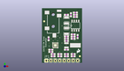
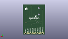
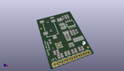

Contents
========

* [PROJ-SPAR-12938-STAN-01>Si4703 FM Tuner Evaluation Board](#proj-spar-12938-stan-01si4703-fm-tuner-evaluation-board)
	* [Images](#images)
	* [Interactive BOM](#interactive-bom)
	* [OOMP Parts](#oomp-parts)
	* [Tags](#tags)
  
![][im]
# PROJ-SPAR-12938-STAN-01>Si4703 FM Tuner Evaluation Board

- ID: PROJ-SPAR-12938-STAN-01
- Hex ID: PRS12938
- Name: Si4703 FM Tuner Evaluation Board
- Description: 

## Images
  
  

|eagleImage|kicadPcb3dFront|kicadPcb3dBack|kicadPcb3d|
| :---: | :---: | :---: | :---: |
|||||

## Interactive BOM

- Interactive BOM page: [ibom.html](kicad/bom/ibom.html)

## OOMP Parts
  

|OOMP Parts|
| :---: |
|<table><tr><td></td><td> C1</td><td>[CAPC-0603-X-NF100-V50 SMD (0603) 100 nF Capacitor (Ceramic) 50v](https://github.com/oomlout/oomlout_OOMP_parts/tree/main/CAPC-0603-X-NF100-V50/)</td><td>[C6N100](https://github.com/oomlout/oomlout_OOMP_parts/tree/main/CAPC-0603-X-NF100-V50/)</td></tr></table>|
|CAPE-0603-X-UNMATCHED-01, C2, 3.8099999999999996, 13.97, 90,C2, 22nF, 0603-CAP, SparkFun-Capacitors, (0.15, 0.55), R90|
|CAPE-0603-X-UNMATCHED-01, C3, 13.97, 12.7, 180,C3, 22pF, 0603-CAP, SparkFun-Capacitors, (0.55, 0.5), R180|
|CAPE-0603-X-UNMATCHED-01, C4, 13.97, 7.619999999999999, 180,C4, 22pF, 0603-CAP, SparkFun-Capacitors, (0.55, 0.3), R180|
|CAPC-0603-X-UNMATCHED-01, C5, 5.08, 7.619999999999999, 180,C5, 1nF, 0603-CAP, SparkFun-Capacitors, (0.2, 0.3), R180|
|<table><tr><td></td><td> C6</td><td>[CAPC-0603-X-NF100-V50 SMD (0603) 100 nF Capacitor (Ceramic) 50v](https://github.com/oomlout/oomlout_OOMP_parts/tree/main/CAPC-0603-X-NF100-V50/)</td><td>[C6N100](https://github.com/oomlout/oomlout_OOMP_parts/tree/main/CAPC-0603-X-NF100-V50/)</td></tr></table>|
|CAPE-UNMATCHED-X-UNMATCHED-01, C7, 13.97, 18.541999999999998, 90,C7, 47uF, EIA3528, SparkFun-Capacitors, (0.55, 0.73), R90|
|CAPE-UNMATCHED-X-UNMATCHED-01, C8, 13.97, 24.637999999999998, 270,C8, 47uF, EIA3528, SparkFun-Capacitors, (0.55, 0.97), R270|
|<table><tr><td></td><td> C9</td><td>[CAPC-0603-X-NF100-V50 SMD (0603) 100 nF Capacitor (Ceramic) 50v](https://github.com/oomlout/oomlout_OOMP_parts/tree/main/CAPC-0603-X-NF100-V50/)</td><td>[C6N100](https://github.com/oomlout/oomlout_OOMP_parts/tree/main/CAPC-0603-X-NF100-V50/)</td></tr></table>|
|CAPC-0603-X-UNMATCHED-01, C10, 17.779999999999998, 13.97, 180,C10, 1uF, 0603-CAP, SparkFun-Capacitors, (0.7, 0.55), R180|
|CAPC-0603-X-UNMATCHED-01, C11, 19.049999999999997, 29.209999999999997, 180,C11, 1uF, 0603-CAP, SparkFun-Capacitors, (0.75, 1.15), R180|
|<table><tr><td></td><td> JP1</td><td>[HEAD-I01-X-PI08-01 2.54 mm 8 Pin Header](https://github.com/oomlout/oomlout_OOMP_parts/tree/main/HEAD-I01-X-PI08-01/)</td><td>[H08](https://github.com/oomlout/oomlout_OOMP_parts/tree/main/HEAD-I01-X-PI08-01/)</td></tr></table>|
|HEAD-I01-X-PI2-01, JP4, 21.59, 3.8099999999999996, 0,JP4, FIDUCIAL1X2, FIDUCIAL-1X2, SparkFun, (0.85, 0.15), R0|
|HEAD-I01-X-PI2-01, JP5, 1.27, 24.13, 0,JP5, FIDUCIAL1X2, FIDUCIAL-1X2, SparkFun, (0.05, 0.95), R0|
|UNMATCHED-0603-X-UNMATCHED-01, L1, 5.08, 6.35, 0,L1, 270nH, 0603, SparkFun-Passives, (0.2, 0.25), R0|
|ERROR, L2 Ferrite 2.5k, 0, 0, 0,L2, Ferrite, 2.5k, 0603, SparkFun-Passives, (0.55, 0.6), R180|
|ERROR, L3 Ferrite 2.5k, 0, 0, 0,L3, Ferrite, 2.5k, 0603, SparkFun-Passives, (0.55, 1.1), R180|
|<table><tr><td></td><td> R1</td><td>[RESE-0603-X-O103-01 SMD (0603) 10k Ohm Resistor](https://github.com/oomlout/oomlout_OOMP_parts/tree/main/RESE-0603-X-O103-01/)</td><td>[R6103](https://github.com/oomlout/oomlout_OOMP_parts/tree/main/RESE-0603-X-O103-01/)</td></tr></table>|
|<table><tr><td></td><td> R2</td><td>[RESE-0603-X-O103-01 SMD (0603) 10k Ohm Resistor](https://github.com/oomlout/oomlout_OOMP_parts/tree/main/RESE-0603-X-O103-01/)</td><td>[R6103](https://github.com/oomlout/oomlout_OOMP_parts/tree/main/RESE-0603-X-O103-01/)</td></tr></table>|
|RESE-0603-X-UNMATCHED-01, R3, 13.97, 5.08, 180,R3, 4.7k, 0603, SparkFun-Resistors, (0.55, 0.2), R180|
|<table><tr><td></td><td> R4</td><td>[RESE-0603-X-O203-01 SMD (0603) 20k Ohm Resistor](https://github.com/oomlout/oomlout_OOMP_parts/tree/main/RESE-0603-X-O203-01/)</td><td>[R6203](https://github.com/oomlout/oomlout_OOMP_parts/tree/main/RESE-0603-X-O203-01/)</td></tr></table>|
|<table><tr><td></td><td> R5</td><td>[RESE-0603-X-O203-01 SMD (0603) 20k Ohm Resistor](https://github.com/oomlout/oomlout_OOMP_parts/tree/main/RESE-0603-X-O203-01/)</td><td>[R6203](https://github.com/oomlout/oomlout_OOMP_parts/tree/main/RESE-0603-X-O203-01/)</td></tr></table>|
|<table><tr><td></td><td> R6</td><td>[RESE-0603-X-O203-01 SMD (0603) 20k Ohm Resistor](https://github.com/oomlout/oomlout_OOMP_parts/tree/main/RESE-0603-X-O203-01/)</td><td>[R6203](https://github.com/oomlout/oomlout_OOMP_parts/tree/main/RESE-0603-X-O203-01/)</td></tr></table>|
|<table><tr><td></td><td> R7</td><td>[RESE-0603-X-O203-01 SMD (0603) 20k Ohm Resistor](https://github.com/oomlout/oomlout_OOMP_parts/tree/main/RESE-0603-X-O203-01/)</td><td>[R6203](https://github.com/oomlout/oomlout_OOMP_parts/tree/main/RESE-0603-X-O203-01/)</td></tr></table>|
|RESE-0603-X-UNMATCHED-01, R8, 17.779999999999998, 5.08, 0,R8, 4.7k, 0603, SparkFun-Resistors, (0.7, 0.2), R0|
|<table><tr><td></td><td> R9</td><td>[RESE-0603-X-O331-01 SMD (0603) 330 Ohm Resistor](https://github.com/oomlout/oomlout_OOMP_parts/tree/main/RESE-0603-X-O331-01/)</td><td>[R6331](https://github.com/oomlout/oomlout_OOMP_parts/tree/main/RESE-0603-X-O331-01/)</td></tr></table>|
|<table><tr><td></td><td> R10</td><td>[RESE-0603-X-O331-01 SMD (0603) 330 Ohm Resistor](https://github.com/oomlout/oomlout_OOMP_parts/tree/main/RESE-0603-X-O331-01/)</td><td>[R6331](https://github.com/oomlout/oomlout_OOMP_parts/tree/main/RESE-0603-X-O331-01/)</td></tr></table>|
|<table><tr><td></td><td> R11</td><td>[RESE-0603-X-O331-01 SMD (0603) 330 Ohm Resistor](https://github.com/oomlout/oomlout_OOMP_parts/tree/main/RESE-0603-X-O331-01/)</td><td>[R6331](https://github.com/oomlout/oomlout_OOMP_parts/tree/main/RESE-0603-X-O331-01/)</td></tr></table>|
|<table><tr><td></td><td> R12</td><td>[RESE-0603-X-O331-01 SMD (0603) 330 Ohm Resistor](https://github.com/oomlout/oomlout_OOMP_parts/tree/main/RESE-0603-X-O331-01/)</td><td>[R6331](https://github.com/oomlout/oomlout_OOMP_parts/tree/main/RESE-0603-X-O331-01/)</td></tr></table>|
|UNMATCHED-UNMATCHED-X-UNMATCHED-01, U1, 7.619999999999999, 10.16, 90,U1, SI4703, SI470X, SparkFun-RF, (0.3, 0.4), R90|
|UNMATCHED-UNMATCHED-X-UNMATCHED-01, U3, 19.049999999999997, 21.59, 0,U3, TPA6111, SO08-TIGHT, SparkFun-AnalogIC, (0.75, 0.85), R0|
|UNMATCHED-UNMATCHED-X-UNMATCHED-01, U4, 6.35, 31.75, 270,U4, AUDIO-JACK-3.5MM-SMD, SparkFun-Connectors, (0.25, 1.25), R270|
|UNMATCHED-UNMATCHED-X-UNMATCHED-01, Y1, 13.97, 10.16, 270,Y1, 32.768kHz, CRYSTAL-32KHZ-SMD, SparkFun-FreqCtrl, (0.55, 0.4), R270|

## Tags

- hexID: PRS12938
- oompType: PROJ
- oompSize: SPAR
- oompColor: 12938
- oompDesc: STAN
- oompIndex: 01
- oompName: Si4703 FM Tuner Evaluation Board
- sources: All source files from https://github.com/sparkfun/Si4703_FM_Tuner_Evaluation_Board (source licence details in srcLicense.md)
- linkBuyPage: https://www.sparkfun.com/products/12938
- oompPart: CAPC-0603-X-NF100-V50, C1, 13.97, 13.97, 0
- oompPart: CAPE-0603-X-UNMATCHED-01, C2, 3.8099999999999996, 13.97, 90
- oompPart: CAPE-0603-X-UNMATCHED-01, C3, 13.97, 12.7, 180
- oompPart: CAPE-0603-X-UNMATCHED-01, C4, 13.97, 7.619999999999999, 180
- oompPart: CAPC-0603-X-UNMATCHED-01, C5, 5.08, 7.619999999999999, 180
- oompPart: CAPC-0603-X-NF100-V50, C6, 16.509999999999998, 27.94, 270
- oompPart: CAPE-UNMATCHED-X-UNMATCHED-01, C7, 13.97, 18.541999999999998, 90
- oompPart: CAPE-UNMATCHED-X-UNMATCHED-01, C8, 13.97, 24.637999999999998, 270
- oompPart: CAPC-0603-X-NF100-V50, C9, 20.32, 15.239999999999998, 270
- oompPart: CAPC-0603-X-UNMATCHED-01, C10, 17.779999999999998, 13.97, 180
- oompPart: CAPC-0603-X-UNMATCHED-01, C11, 19.049999999999997, 29.209999999999997, 180
- oompPart: HEAD-I01-X-PI08-01, JP1, 2.54, 1.27, 0
- oompPart: HEAD-I01-X-PI2-01, JP4, 21.59, 3.8099999999999996, 0
- oompPart: HEAD-I01-X-PI2-01, JP5, 1.27, 24.13, 0
- oompPart: UNMATCHED-0603-X-UNMATCHED-01, L1, 5.08, 6.35, 0
- oompPart: ERROR, L2 Ferrite 2.5k, 0, 0, 0
- oompPart: ERROR, L3 Ferrite 2.5k, 0, 0, 0
- oompPart: RESE-0603-X-O103-01, R1, 6.35, 5.08, 180
- oompPart: RESE-0603-X-O103-01, R2, 10.16, 5.08, 0
- oompPart: RESE-0603-X-UNMATCHED-01, R3, 13.97, 5.08, 180
- oompPart: RESE-0603-X-O203-01, R4, 17.779999999999998, 15.239999999999998, 180
- oompPart: RESE-0603-X-O203-01, R5, 19.049999999999997, 27.94, 180
- oompPart: RESE-0603-X-O203-01, R6, 17.779999999999998, 16.509999999999998, 0
- oompPart: RESE-0603-X-O203-01, R7, 19.049999999999997, 26.669999999999998, 0
- oompPart: RESE-0603-X-UNMATCHED-01, R8, 17.779999999999998, 5.08, 0
- oompPart: RESE-0603-X-O331-01, R9, 17.779999999999998, 3.8099999999999996, 0
- oompPart: RESE-0603-X-O331-01, R10, 13.97, 3.8099999999999996, 180
- oompPart: RESE-0603-X-O331-01, R11, 10.16, 3.8099999999999996, 0
- oompPart: RESE-0603-X-O331-01, R12, 6.35, 3.8099999999999996, 180
- oompPart: UNMATCHED-UNMATCHED-X-UNMATCHED-01, U1, 7.619999999999999, 10.16, 90
- oompPart: UNMATCHED-UNMATCHED-X-UNMATCHED-01, U3, 19.049999999999997, 21.59, 0
- oompPart: UNMATCHED-UNMATCHED-X-UNMATCHED-01, U4, 6.35, 31.75, 270
- oompPart: UNMATCHED-UNMATCHED-X-UNMATCHED-01, Y1, 13.97, 10.16, 270
- rawPart: C1, 0.1uF, 0603-CAP, SparkFun-Capacitors, (0.55, 0.55), R0
- rawPart: C2, 22nF, 0603-CAP, SparkFun-Capacitors, (0.15, 0.55), R90
- rawPart: C3, 22pF, 0603-CAP, SparkFun-Capacitors, (0.55, 0.5), R180
- rawPart: C4, 22pF, 0603-CAP, SparkFun-Capacitors, (0.55, 0.3), R180
- rawPart: C5, 1nF, 0603-CAP, SparkFun-Capacitors, (0.2, 0.3), R180
- rawPart: C6, 0.1uF, 0603-CAP, SparkFun-Capacitors, (0.65, 1.1), R270
- rawPart: C7, 47uF, EIA3528, SparkFun-Capacitors, (0.55, 0.73), R90
- rawPart: C8, 47uF, EIA3528, SparkFun-Capacitors, (0.55, 0.97), R270
- rawPart: C9, 0.1uF, 0603-CAP, SparkFun-Capacitors, (0.8, 0.6), R270
- rawPart: C10, 1uF, 0603-CAP, SparkFun-Capacitors, (0.7, 0.55), R180
- rawPart: C11, 1uF, 0603-CAP, SparkFun-Capacitors, (0.75, 1.15), R180
- rawPart: JP1, 1X08, SparkFun, (0.1, 0.05), R0
- rawPart: JP4, FIDUCIAL1X2, FIDUCIAL-1X2, SparkFun, (0.85, 0.15), R0
- rawPart: JP5, FIDUCIAL1X2, FIDUCIAL-1X2, SparkFun, (0.05, 0.95), R0
- rawPart: L1, 270nH, 0603, SparkFun-Passives, (0.2, 0.25), R0
- rawPart: L2, Ferrite, 2.5k, 0603, SparkFun-Passives, (0.55, 0.6), R180
- rawPart: L3, Ferrite, 2.5k, 0603, SparkFun-Passives, (0.55, 1.1), R180
- rawPart: R1, 10k, 0603-RES, SparkFun-Resistors, (0.25, 0.2), R180
- rawPart: R2, 10k, 0603-RES, SparkFun-Resistors, (0.4, 0.2), R0
- rawPart: R3, 4.7k, 0603, SparkFun-Resistors, (0.55, 0.2), R180
- rawPart: R4, 20k, 0603-RES, SparkFun-Resistors, (0.7, 0.6), R180
- rawPart: R5, 20k, 0603-RES, SparkFun-Resistors, (0.75, 1.1), R180
- rawPart: R6, 20k, 0603-RES, SparkFun-Resistors, (0.7, 0.65), R0
- rawPart: R7, 20k, 0603-RES, SparkFun-Resistors, (0.75, 1.05), R0
- rawPart: R8, 4.7k, 0603, SparkFun-Resistors, (0.7, 0.2), R0
- rawPart: R9, 330, 0603-RES, SparkFun-Resistors, (0.7, 0.15), R0
- rawPart: R10, 330, 0603-RES, SparkFun-Resistors, (0.55, 0.15), R180
- rawPart: R11, 330, 0603-RES, SparkFun-Resistors, (0.4, 0.15), R0
- rawPart: R12, 330, 0603-RES, SparkFun-Resistors, (0.25, 0.15), R180
- rawPart: U1, SI4703, SI470X, SparkFun-RF, (0.3, 0.4), R90
- rawPart: U3, TPA6111, SO08-TIGHT, SparkFun-AnalogIC, (0.75, 0.85), R0
- rawPart: U4, AUDIO-JACK-3.5MM-SMD, SparkFun-Connectors, (0.25, 1.25), R270
- rawPart: Y1, 32.768kHz, CRYSTAL-32KHZ-SMD, SparkFun-FreqCtrl, (0.55, 0.4), R270
- oompID: PROJ-SPAR-12938-STAN-01

[im]: kicadPcb3d_450.png
