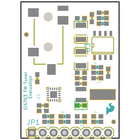
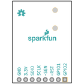
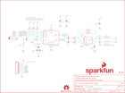
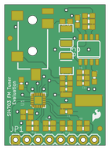
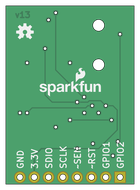

Contents
========

* [PRS12938 > Si4703 FM Tuner Evaluation Board](#prs12938--si4703-fm-tuner-evaluation-board)
	* [Schematic](#schematic)
	* [PCB](#pcb)
	* [Interactive BOM](#interactive-bom)
	* [OOMP Parts](#oomp-parts)
	* [Images](#images)
	* [Tags](#tags)
  
![][im]
# PRS12938 > Si4703 FM Tuner Evaluation Board

- ID: PROJ-SPAR-12938-STAN-01
- Hex ID: PRS12938
- Name: Sparkfun
- Description: Sparkfun
- Long Link: [http://oom.lt/PROJ-SPAR-12938-STAN-01](http://oom.lt/PROJ-SPAR-12938-STAN-01)
- Short Link: [http://oom.lt/PRS12938](http://oom.lt/PRS12938)

## Schematic
  

## PCB
  

## Interactive BOM

- Interactive BOM page: [ibom.html](https://htmlpreview.github.io/?https://github.com/oomlout/oomlout_OOMP_projects/blob/main/PROJ-SPAR-12938-STAN-01/kicad/bom/ibom.html)

## OOMP Parts
  

|OOMP ID|Name|Identifier|
| :---: | :---: | :---: |
|[CAPC-0603-X-NF100-V50](https://github.com/oomlout/oomlout_OOMP_parts/tree/main/CAPC-0603-X-NF100-V50/)|[SMD (0603) 100 nF Capacitor (Ceramic) 50v](https://github.com/oomlout/oomlout_OOMP_parts/tree/main/CAPC-0603-X-NF100-V50/)|[C1, C6, C9](https://github.com/oomlout/oomlout_OOMP_parts/tree/main/CAPC-0603-X-NF100-V50/)|
|CAPC-UNMATCHED-X-NF22-01||C2|
|[CAPC-0603-X-PF22-V50](https://github.com/oomlout/oomlout_OOMP_parts/tree/main/CAPC-0603-X-PF22-V50/)|[SMD (0603) 22 pF Capacitor (Ceramic) 50v](https://github.com/oomlout/oomlout_OOMP_parts/tree/main/CAPC-0603-X-PF22-V50/)|[C3, C4](https://github.com/oomlout/oomlout_OOMP_parts/tree/main/CAPC-0603-X-PF22-V50/)|
|[CAPC-0603-X-NF1-V50](https://github.com/oomlout/oomlout_OOMP_parts/tree/main/CAPC-0603-X-NF1-V50/)|[SMD (0603) 1 nF Capacitor (Ceramic) 50v](https://github.com/oomlout/oomlout_OOMP_parts/tree/main/CAPC-0603-X-NF1-V50/)|[C5](https://github.com/oomlout/oomlout_OOMP_parts/tree/main/CAPC-0603-X-NF1-V50/)|
|CAPX-3528-X-UF47-01||C7, C8|
|[CAPC-0603-X-UF1-V25](https://github.com/oomlout/oomlout_OOMP_parts/tree/main/CAPC-0603-X-UF1-V25/)|[SMD (0603) 1 uF Capacitor (Ceramic) 25v](https://github.com/oomlout/oomlout_OOMP_parts/tree/main/CAPC-0603-X-UF1-V25/)|[C10, C11](https://github.com/oomlout/oomlout_OOMP_parts/tree/main/CAPC-0603-X-UF1-V25/)|
|[HEAD-I01-X-PI08-01](https://github.com/oomlout/oomlout_OOMP_parts/tree/main/HEAD-I01-X-PI08-01/)|[2.54 mm 8 Pin Header](https://github.com/oomlout/oomlout_OOMP_parts/tree/main/HEAD-I01-X-PI08-01/)|[JP1](https://github.com/oomlout/oomlout_OOMP_parts/tree/main/HEAD-I01-X-PI08-01/)|
|UNMATCHED-0603-X-UNMATCHED-01||L1, L2, L3|
|[RESE-0603-X-O103-01](https://github.com/oomlout/oomlout_OOMP_parts/tree/main/RESE-0603-X-O103-01/)|[SMD (0603) 10k Ohm Resistor](https://github.com/oomlout/oomlout_OOMP_parts/tree/main/RESE-0603-X-O103-01/)|[R1, R2](https://github.com/oomlout/oomlout_OOMP_parts/tree/main/RESE-0603-X-O103-01/)|
|[RESE-0603-X-O472-01](https://github.com/oomlout/oomlout_OOMP_parts/tree/main/RESE-0603-X-O472-01/)|[SMD (0603) 4.7k Ohm Resistor](https://github.com/oomlout/oomlout_OOMP_parts/tree/main/RESE-0603-X-O472-01/)|[R3, R8](https://github.com/oomlout/oomlout_OOMP_parts/tree/main/RESE-0603-X-O472-01/)|
|[RESE-0603-X-O203-01](https://github.com/oomlout/oomlout_OOMP_parts/tree/main/RESE-0603-X-O203-01/)|[SMD (0603) 20k Ohm Resistor](https://github.com/oomlout/oomlout_OOMP_parts/tree/main/RESE-0603-X-O203-01/)|[R4, R5, R6, R7](https://github.com/oomlout/oomlout_OOMP_parts/tree/main/RESE-0603-X-O203-01/)|
|[RESE-0603-X-O331-01](https://github.com/oomlout/oomlout_OOMP_parts/tree/main/RESE-0603-X-O331-01/)|[SMD (0603) 330 Ohm Resistor](https://github.com/oomlout/oomlout_OOMP_parts/tree/main/RESE-0603-X-O331-01/)|[R9, R10, R11, R12](https://github.com/oomlout/oomlout_OOMP_parts/tree/main/RESE-0603-X-O331-01/)|
|UNMATCHED-UNMATCHED-X-UNMATCHED-01||U1, U3, Y1|
|TERS-35D-L-UNMATCHED-01||U4|

## Images
  
  

|bominteractivefront|bominteractiveback|kicadPcb3d|kicadPcb3dFront|kicadPcb3dBack|eagleImage|eagleSchemImage|pcbdraw|pcbdrawback|
| :---: | :---: | :---: | :---: | :---: | :---: | :---: | :---: | :---: |
||||||||||

## Tags

- hexID: PRS12938
- oompType: PROJ
- oompSize: SPAR
- oompColor: 12938
- oompDesc: STAN
- oompIndex: 01
- oompName: Si4703 FM Tuner Evaluation Board
- sources: All source files from https://github.com/sparkfun/Si4703_FM_Tuner_Evaluation_Board (source licence details in srcLicense.md)
- linkBuyPage: https://www.sparkfun.com/products/12938
- oompID: PROJ-SPAR-12938-STAN-01
- oompParts: C1,CAPC-0603-X-NF100-V50
- oompParts: C2,CAPC-UNMATCHED-X-NF22-01
- oompParts: C3,CAPC-0603-X-PF22-V50
- oompParts: C4,CAPC-0603-X-PF22-V50
- oompParts: C5,CAPC-0603-X-NF1-V50
- oompParts: C6,CAPC-0603-X-NF100-V50
- oompParts: C7,CAPX-3528-X-UF47-01
- oompParts: C8,CAPX-3528-X-UF47-01
- oompParts: C9,CAPC-0603-X-NF100-V50
- oompParts: C10,CAPC-0603-X-UF1-V25
- oompParts: C11,CAPC-0603-X-UF1-V25
- oompParts: JP1,HEAD-I01-X-PI08-01
- oompParts: L1,UNMATCHED-0603-X-UNMATCHED-01
- oompParts: L2,UNMATCHED-0603-X-UNMATCHED-01
- oompParts: L3,UNMATCHED-0603-X-UNMATCHED-01
- oompParts: R1,RESE-0603-X-O103-01
- oompParts: R2,RESE-0603-X-O103-01
- oompParts: R3,RESE-0603-X-O472-01
- oompParts: R4,RESE-0603-X-O203-01
- oompParts: R5,RESE-0603-X-O203-01
- oompParts: R6,RESE-0603-X-O203-01
- oompParts: R7,RESE-0603-X-O203-01
- oompParts: R8,RESE-0603-X-O472-01
- oompParts: R9,RESE-0603-X-O331-01
- oompParts: R10,RESE-0603-X-O331-01
- oompParts: R11,RESE-0603-X-O331-01
- oompParts: R12,RESE-0603-X-O331-01
- oompParts: U1,UNMATCHED-UNMATCHED-X-UNMATCHED-01
- oompParts: U3,UNMATCHED-UNMATCHED-X-UNMATCHED-01
- oompParts: U4,TERS-35D-L-UNMATCHED-01
- oompParts: Y1,UNMATCHED-UNMATCHED-X-UNMATCHED-01
- rawParts: C1,0.1uF,0.1UF-25V(+80/-20%)(0603),0603-CAP,CAP-00810,CAP-00810,0.1uF,
- rawParts: C2,22nF,22NF/22,000PF-50V-10%(0603),0603-CAP,CAP-07885,CAP-07885,22nF,
- rawParts: C3,22pF,22PF-50V-5%(0603),0603-CAP,CAP-07876,CAP-07876,22pF,
- rawParts: C4,22pF,22PF-50V-5%(0603),0603-CAP,CAP-07876,CAP-07876,22pF,
- rawParts: C5,1nF,1NF/1000PF-50V-10%(0603),0603-CAP,CAP-07886,CAP-07886,1nF,
- rawParts: C6,0.1uF,0.1UF-25V(+80/-20%)(0603),0603-CAP,CAP-00810,CAP-00810,0.1uF,
- rawParts: C7,47uF,47UF-TANT,EIA3528,47uF Tantalum SMT,CAP-08310,47uF,
- rawParts: C8,47uF,47UF-TANT,EIA3528,47uF Tantalum SMT,CAP-08310,47uF,
- rawParts: C9,0.1uF,0.1UF-25V(+80/-20%)(0603),0603-CAP,CAP-00810,CAP-00810,0.1uF,
- rawParts: C10,1uF,1.0UF-16V-10%(0603),0603-CAP,CAP-00868,CAP-00868,1.0uF,
- rawParts: C11,1uF,1.0UF-16V-10%(0603),0603-CAP,CAP-00868,CAP-00868,1.0uF,
- rawParts: FRAME2,FRAME-LETTER,FRAME-LETTER,CREATIVE_COMMONS,Schematic Frame,,,
- rawParts: JP1,,M08,1X08,Header 8,,,
- rawParts: JP3,LOGO-SFESK,LOGO-SFESK,SFE-LOGO-FLAME,Spark Fun Electronics PCB Logo,,,
- rawParts: JP4,FIDUCIAL1X2,FIDUCIAL1X2,FIDUCIAL-1X2,Fiducial Alignment Points,,,
- rawParts: JP5,FIDUCIAL1X2,FIDUCIAL1X2,FIDUCIAL-1X2,Fiducial Alignment Points,,,
- rawParts: L1,270nH,INDUCTOR0603,0603,Inductors,,,
- rawParts: L2,Ferrite 2.5k,INDUCTOR0603,0603,Inductors,,,
- rawParts: L3,Ferrite 2.5k,INDUCTOR0603,0603,Inductors,,,
- rawParts: LOGO1,SFE_LOGO_NAME_FLAME.1_INCH,SFE_LOGO_NAME_FLAME.1_INCH,SFE_LOGO_NAME_FLAME_.1,SFE Logo, name and flame,,,
- rawParts: LOGO2,OSHW-LOGOS,OSHW-LOGOS,OSHW-LOGO-S,Open Source Hardware Logo This logo indicates the piece of hardware it is found on incorporates a OSHW license and/or adheres to the definition of open source hardware found here: http://freedomdefined.org/OSHW,,,
- rawParts: R1,10k,10KOHM1/10W1%(0603)0603,0603-RES,RES-00824,RES-00824,10K,
- rawParts: R2,10k,10KOHM1/10W1%(0603)0603,0603-RES,RES-00824,RES-00824,10K,
- rawParts: R3,4.7k,4.7KOHM1/10W1%(0603),0603,RES-07857,RES-07857,,
- rawParts: R4,20k,20KOHM1/10W1%(0603),0603-RES,RES-09383,RES-09383,20k,
- rawParts: R5,20k,20KOHM1/10W1%(0603),0603-RES,RES-09383,RES-09383,20k,
- rawParts: R6,20k,20KOHM1/10W1%(0603),0603-RES,RES-09383,RES-09383,20k,
- rawParts: R7,20k,20KOHM1/10W1%(0603),0603-RES,RES-09383,RES-09383,20k,
- rawParts: R8,4.7k,4.7KOHM1/10W1%(0603),0603,RES-07857,RES-07857,,
- rawParts: R9,330,330OHM1/10W1%(0603),0603-RES,RES-00818,RES-00818,330,
- rawParts: R10,330,330OHM1/10W1%(0603),0603-RES,RES-00818,RES-00818,330,
- rawParts: R11,330,330OHM1/10W1%(0603),0603-RES,RES-00818,RES-00818,330,
- rawParts: R12,330,330OHM1/10W1%(0603),0603-RES,RES-00818,RES-00818,330,
- rawParts: U$1,REVISION,REVISION,REVISION,,,,
- rawParts: U1,SI4703,SI470X,SI470X,FM receiver IC. Tested with Si4703. You really only need SEN, RST, SCLK, and SDIO to get a full FM radio working. Antenna comes from headphone jack. See BOB-10344.,,,
- rawParts: U3,TPA6111,TPA6111SMD-T,SO08-TIGHT,,IC-10149,,
- rawParts: U4,,AUDIO-JACKSMD2,AUDIO-JACK-3.5MM-SMD,3.5mm Audio Jack,,,
- rawParts: Y1,32.768kHz,CRYSTAL32-SMD,CRYSTAL-32KHZ-SMD,Various standard crystals. Proven footprints. Spark Fun Electronics SKU : COM-00534,XTAL-07894,,

[im]: kicadPcb3d_450.png
