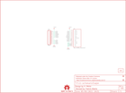

Contents
========

* [PRS12941 > Sparkfun](#prs12941--sparkfun)
	* [Images](#images)
	* [Tags](#tags)
  
![][im]
# PRS12941 > Sparkfun

- ID: PROJ-SPAR-12941-STAN-01
- Hex ID: PRS12941
- Name: Sparkfun
- Description: Sparkfun

## Images
  
  

|kicadPcb3d|kicadPcb3dFront|kicadPcb3dBack|eagleImage|eagleSchemImage|
| :---: | :---: | :---: | :---: | :---: |
||||||

## Tags

- hexID: PRS12941
- oompType: PROJ
- oompSize: SPAR
- oompColor: 12941
- oompDesc: STAN
- oompIndex: 01
- oompName: SD-MMC Breakout
- sources: All source files from https://github.com/sparkfun/SD-MMC_Breakout (source licence details in srcLicense.md)
- linkBuyPage: https://www.sparkfun.com/products/12941
- oompID: PROJ-SPAR-12941-STAN-01
- oompParts: FRAME1,UNMATCHED-UNMATCHED-UNMATCHED-UNMATCHED-UNMATCHED
- oompParts: JP5,UNMATCHED-UNMATCHED-UNMATCHED-UNMATCHED-UNMATCHED
- oompParts: U$1,UNMATCHED-UNMATCHED-UNMATCHED-UNMATCHED-UNMATCHED
- oompParts: U$3,UNMATCHED-UNMATCHED-UNMATCHED-UNMATCHED-UNMATCHED
- oompParts: U1,UNMATCHED-UNMATCHED-UNMATCHED-UNMATCHED-UNMATCHED
- rawParts: FID1,FIDUCIAL1X2,FIDUCIAL1X2,FIDUCIAL-1X2,Fiducial Alignment Points,,
- rawParts: FID2,FIDUCIAL1X2,FIDUCIAL1X2,FIDUCIAL-1X2,Fiducial Alignment Points,,
- rawParts: FRAME1,FRAME-LETTER,FRAME-LETTER,CREATIVE_COMMONS,Schematic Frame,,
- rawParts: JP5,M10,M10,1X10,Header 10,,
- rawParts: U$1,LOGO-SFENEW,LOGO-SFENEW,SFE-NEW-WEBLOGO,Spark Fun Electronics PCB Logo,,
- rawParts: U$3,OSHW-LOGOS,OSHW-LOGOS,OSHW-LOGO-S,Open Source Hardware Logo This logo indicates the piece of hardware it is found on incorporates a OSHW license and/or adheres to the definition of open source hardware found here: http://freedomdefined.org/OSHW,,
- rawParts: U1,SD_CARD_SOCKET,SD_CARD_SOCKET,SD_1:1,SD Memory Card Connector, push-push normal type, CD enable, WP enable,,

[im]: kicadPcb3d_450.png
