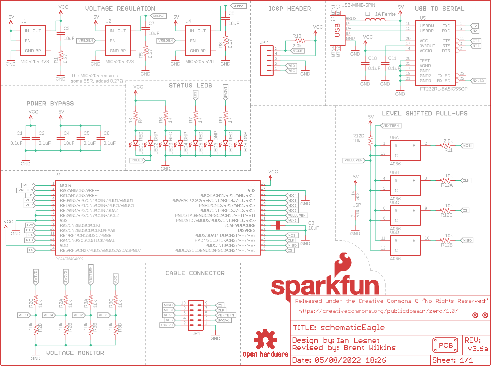
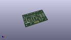
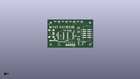
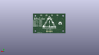
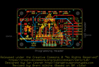
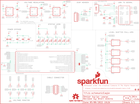

Contents
========

* [PRS12942 > Sparkfun](#prs12942--sparkfun)
	* [Schematic](#schematic)
	* [Interactive BOM](#interactive-bom)
	* [OOMP Parts](#oomp-parts)
	* [Images](#images)
	* [Tags](#tags)
  
![][im]
# PRS12942 > Sparkfun

- ID: PROJ-SPAR-12942-STAN-01
- Hex ID: PRS12942
- Name: Sparkfun
- Description: Sparkfun
- Long Link: [http://oom.lt/PROJ-SPAR-12942-STAN-01](http://oom.lt/PROJ-SPAR-12942-STAN-01)
- Short Link: [http://oom.lt/PRS12942](http://oom.lt/PRS12942)

## Schematic
  

## Interactive BOM

- Interactive BOM page: [ibom.html](https://htmlpreview.github.io/?https://github.com/oomlout/oomlout_OOMP_projects/blob/main/PROJ-SPAR-12942-STAN-01/kicad/bom/ibom.html)

## OOMP Parts
  

|OOMP Parts|
| :---: |
|C1,UNMATCHED-UNMATCHED-UNMATCHED-UNMATCHED-UNMATCHED,C1,0.1uF,0.1UF-25V(+80/-20%)(0603),0603-CAP,CAP-00810,CAP-00810,0.1uF,|
|C2,UNMATCHED-UNMATCHED-UNMATCHED-UNMATCHED-UNMATCHED,C2,0.1uF,0.1UF-25V(+80/-20%)(0603),0603-CAP,CAP-00810,CAP-00810,0.1uF,|
|C3,UNMATCHED-UNMATCHED-UNMATCHED-UNMATCHED-UNMATCHED,C3,10uF,10UF10V10%(0805),0805-CAP,CAP-11330,CAP-11330,,|
|C4,UNMATCHED-UNMATCHED-UNMATCHED-UNMATCHED-UNMATCHED,C4,10uF,10UF10V10%(0805),0805-CAP,CAP-11330,CAP-11330,,|
|C5,UNMATCHED-UNMATCHED-UNMATCHED-UNMATCHED-UNMATCHED,C5,0.1uF,0.1UF-25V(+80/-20%)(0603),0603-CAP,CAP-00810,CAP-00810,0.1uF,|
|C6,UNMATCHED-UNMATCHED-UNMATCHED-UNMATCHED-UNMATCHED,C6,0.1uF,0.1UF-25V(+80/-20%)(0603),0603-CAP,CAP-00810,CAP-00810,0.1uF,|
|C7,UNMATCHED-UNMATCHED-UNMATCHED-UNMATCHED-UNMATCHED,C7,10uF,10UF10V10%(0805),0805-CAP,CAP-11330,CAP-11330,,|
|C8,UNMATCHED-UNMATCHED-UNMATCHED-UNMATCHED-UNMATCHED,C8,10uF,10UF10V10%(0805),0805-CAP,CAP-11330,CAP-11330,,|
|C9,UNMATCHED-UNMATCHED-UNMATCHED-UNMATCHED-UNMATCHED,C9,10uF,10UF10V10%(0805),0805-CAP,CAP-11330,CAP-11330,,|
|C10,UNMATCHED-UNMATCHED-UNMATCHED-UNMATCHED-UNMATCHED,C10,0.1uF,0.1UF-25V(+80/-20%)(0603),0603-CAP,CAP-00810,CAP-00810,0.1uF,|
|C11,UNMATCHED-UNMATCHED-UNMATCHED-UNMATCHED-UNMATCHED,C11,0.1uF,0.1UF-25V(+80/-20%)(0603),0603-CAP,CAP-00810,CAP-00810,0.1uF,|
|J1,UNMATCHED-UNMATCHED-UNMATCHED-UNMATCHED-UNMATCHED,FID1,FIDUCIAL1X2,FIDUCIAL1X2,FIDUCIAL-1X2,Fiducial Alignment Points,,,|
|JP1,UNMATCHED-UNMATCHED-UNMATCHED-UNMATCHED-UNMATCHED,FID2,FIDUCIAL1X2,FIDUCIAL1X2,FIDUCIAL-1X2,Fiducial Alignment Points,,,|
|JP2,UNMATCHED-UNMATCHED-UNMATCHED-UNMATCHED-UNMATCHED,J1,USB-MINIB-5PIN,USB-MINIB-5PIN,USB-MINIB,Mini-USB B connector with 5th pin broken out.,CONN-08193,,|
|L1,UNMATCHED-UNMATCHED-UNMATCHED-UNMATCHED-UNMATCHED,JP1,,M05X2SHD_SMD,2X5-SHROUDED_SMD,Header 5x2,CONN-09508,,|
|LED1,UNMATCHED-UNMATCHED-UNMATCHED-UNMATCHED-UNMATCHED,JP2,,M05PTH,1X05,Header 5,,,|
|LED2,UNMATCHED-UNMATCHED-UNMATCHED-UNMATCHED-UNMATCHED,L1,1A Ferrite,INDUCTOR0603,0603,Inductors,NDUC-12579,,|
|LED3,UNMATCHED-UNMATCHED-UNMATCHED-UNMATCHED-UNMATCHED,LED1,RED,LED-RED0603,LED-0603,Assorted Red LEDs,DIO-00819,RED,|
|LED4,UNMATCHED-UNMATCHED-UNMATCHED-UNMATCHED-UNMATCHED,LED2,DNP,LED-RED0603,LED-0603,Assorted Red LEDs,DIO-00819,RED,|
|LED5,UNMATCHED-UNMATCHED-UNMATCHED-UNMATCHED-UNMATCHED,LED3,RED,LED-RED0603,LED-0603,Assorted Red LEDs,DIO-00819,RED,|
|LED6,UNMATCHED-UNMATCHED-UNMATCHED-UNMATCHED-UNMATCHED,LED4,DNP,LED-RED0603,LED-0603,Assorted Red LEDs,DIO-00819,RED,|
|LED7,UNMATCHED-UNMATCHED-UNMATCHED-UNMATCHED-UNMATCHED,LED5,RED,LED-RED0603,LED-0603,Assorted Red LEDs,DIO-00819,RED,|
|LED8,UNMATCHED-UNMATCHED-UNMATCHED-UNMATCHED-UNMATCHED,LED6,DNP,LED-RED0603,LED-0603,Assorted Red LEDs,DIO-00819,RED,|
|LOGO1,UNMATCHED-UNMATCHED-UNMATCHED-UNMATCHED-UNMATCHED,LED7,RED,LED-RED0603,LED-0603,Assorted Red LEDs,DIO-00819,RED,|
|LOGO2,UNMATCHED-UNMATCHED-UNMATCHED-UNMATCHED-UNMATCHED,LED8,DNP,LED-RED0603,LED-0603,Assorted Red LEDs,DIO-00819,RED,|
|PCB1,UNMATCHED-UNMATCHED-UNMATCHED-UNMATCHED-UNMATCHED,LOGO1,OSHW-LOGOL,OSHW-LOGOL,OSHW-LOGO-L,Open Source Hardware Logo,,,|
|R1,UNMATCHED-UNMATCHED-UNMATCHED-UNMATCHED-UNMATCHED,LOGO2,SFE_LOGO_NAME_FLAME.1_INCH,SFE_LOGO_NAME_FLAME.1_INCH,SFE_LOGO_NAME_FLAME_.1,SFE Logo, name and flame,,,|
|R2,UNMATCHED-UNMATCHED-UNMATCHED-UNMATCHED-UNMATCHED,PCB1,PCB_DP_RECTANGLE-37X60,PCB_DP_RECTANGLE-37X60,DP6037_V1,Dangerous Prototypes Standard Rectangular PCB sizes,,,|
|R3,UNMATCHED-UNMATCHED-UNMATCHED-UNMATCHED-UNMATCHED,R1,0.27,0OHM-1/10W-5%(0603),0603,RES-08609,RES-08787,0,|
|R4,UNMATCHED-UNMATCHED-UNMATCHED-UNMATCHED-UNMATCHED,R2,10k,CAY16-F4,4XARRAY,CAY16-F4,RES-13167,,|
|R5,UNMATCHED-UNMATCHED-UNMATCHED-UNMATCHED-UNMATCHED,R3,10k,CAY16-F4,4XARRAY,CAY16-F4,RES-13167,,|
|R6,UNMATCHED-UNMATCHED-UNMATCHED-UNMATCHED-UNMATCHED,R4,1K,1KOHM-1/10W-1%(0603),0603-RES,RES-07856,RES-07856,1K,|
|R7,UNMATCHED-UNMATCHED-UNMATCHED-UNMATCHED-UNMATCHED,R5,0.27,0OHM-1/10W-5%(0603),0603,RES-08609,RES-08787,0,|
|R8,UNMATCHED-UNMATCHED-UNMATCHED-UNMATCHED-UNMATCHED,R6,1K,1KOHM-1/10W-1%(0603),0603-RES,RES-07856,RES-07856,1K,|
|R9,UNMATCHED-UNMATCHED-UNMATCHED-UNMATCHED-UNMATCHED,R7,1K,1KOHM-1/10W-1%(0603),0603-RES,RES-07856,RES-07856,1K,|
|R10,UNMATCHED-UNMATCHED-UNMATCHED-UNMATCHED-UNMATCHED,R8,0.27,0OHM-1/10W-5%(0603),0603,RES-08609,RES-08787,0,|
|R11,UNMATCHED-UNMATCHED-UNMATCHED-UNMATCHED-UNMATCHED,R9,1K,1KOHM-1/10W-1%(0603),0603-RES,RES-07856,RES-07856,1K,|
|R12,UNMATCHED-UNMATCHED-UNMATCHED-UNMATCHED-UNMATCHED,R10,2.0k,2.0KOHM1/10W5%(0603),0603-RES,RES-08296,RES-08296,2.0k,|
|U1,UNMATCHED-UNMATCHED-UNMATCHED-UNMATCHED-UNMATCHED,R11,2.0k,2.0KOHM1/10W5%(0603),0603-RES,RES-08296,RES-08296,2.0k,|
|U2,UNMATCHED-UNMATCHED-UNMATCHED-UNMATCHED-UNMATCHED,R12,10k,CAY16-F4,4XARRAY,CAY16-F4,RES-13167,,|
|U3,UNMATCHED-UNMATCHED-UNMATCHED-UNMATCHED-UNMATCHED,U1,MIC5205 3V3,MIC52053.3V,SOT23-5,MIC5205 150mA vreg,VREG-00822,,|
|U4,UNMATCHED-UNMATCHED-UNMATCHED-UNMATCHED-UNMATCHED,U2,MIC5205 3V3,MIC52053.3V,SOT23-5,MIC5205 150mA vreg,VREG-00822,,|
|U5,UNMATCHED-UNMATCHED-UNMATCHED-UNMATCHED-UNMATCHED,U3,PIC24FJ64GA002,PIC24FJ64GA002,SSOP28,16-bit General Purpose Flash Microcontroller,IC-09426,,|
|U6,UNMATCHED-UNMATCHED-UNMATCHED-UNMATCHED-UNMATCHED,U4,MIC5205 5V0,MIC52055V,SOT23-5,MIC5205 150mA vreg,VREG-00823,,|

## Images
  
  

|kicadPcb3d|kicadPcb3dFront|kicadPcb3dBack|eagleImage|eagleSchemImage|
| :---: | :---: | :---: | :---: | :---: |
||||||

## Tags

- hexID: PRS12942
- oompType: PROJ
- oompSize: SPAR
- oompColor: 12942
- oompDesc: STAN
- oompIndex: 01
- oompName: Bus Pirate
- sources: All source files from https://github.com/sparkfun/Bus_Pirate (source licence details in srcLicense.md)
- linkBuyPage: https://www.sparkfun.com/products/12942
- oompID: PROJ-SPAR-12942-STAN-01
- oompParts: C1,UNMATCHED-UNMATCHED-UNMATCHED-UNMATCHED-UNMATCHED
- oompParts: C2,UNMATCHED-UNMATCHED-UNMATCHED-UNMATCHED-UNMATCHED
- oompParts: C3,UNMATCHED-UNMATCHED-UNMATCHED-UNMATCHED-UNMATCHED
- oompParts: C4,UNMATCHED-UNMATCHED-UNMATCHED-UNMATCHED-UNMATCHED
- oompParts: C5,UNMATCHED-UNMATCHED-UNMATCHED-UNMATCHED-UNMATCHED
- oompParts: C6,UNMATCHED-UNMATCHED-UNMATCHED-UNMATCHED-UNMATCHED
- oompParts: C7,UNMATCHED-UNMATCHED-UNMATCHED-UNMATCHED-UNMATCHED
- oompParts: C8,UNMATCHED-UNMATCHED-UNMATCHED-UNMATCHED-UNMATCHED
- oompParts: C9,UNMATCHED-UNMATCHED-UNMATCHED-UNMATCHED-UNMATCHED
- oompParts: C10,UNMATCHED-UNMATCHED-UNMATCHED-UNMATCHED-UNMATCHED
- oompParts: C11,UNMATCHED-UNMATCHED-UNMATCHED-UNMATCHED-UNMATCHED
- oompParts: J1,UNMATCHED-UNMATCHED-UNMATCHED-UNMATCHED-UNMATCHED
- oompParts: JP1,UNMATCHED-UNMATCHED-UNMATCHED-UNMATCHED-UNMATCHED
- oompParts: JP2,UNMATCHED-UNMATCHED-UNMATCHED-UNMATCHED-UNMATCHED
- oompParts: L1,UNMATCHED-UNMATCHED-UNMATCHED-UNMATCHED-UNMATCHED
- oompParts: LED1,UNMATCHED-UNMATCHED-UNMATCHED-UNMATCHED-UNMATCHED
- oompParts: LED2,UNMATCHED-UNMATCHED-UNMATCHED-UNMATCHED-UNMATCHED
- oompParts: LED3,UNMATCHED-UNMATCHED-UNMATCHED-UNMATCHED-UNMATCHED
- oompParts: LED4,UNMATCHED-UNMATCHED-UNMATCHED-UNMATCHED-UNMATCHED
- oompParts: LED5,UNMATCHED-UNMATCHED-UNMATCHED-UNMATCHED-UNMATCHED
- oompParts: LED6,UNMATCHED-UNMATCHED-UNMATCHED-UNMATCHED-UNMATCHED
- oompParts: LED7,UNMATCHED-UNMATCHED-UNMATCHED-UNMATCHED-UNMATCHED
- oompParts: LED8,UNMATCHED-UNMATCHED-UNMATCHED-UNMATCHED-UNMATCHED
- oompParts: LOGO1,UNMATCHED-UNMATCHED-UNMATCHED-UNMATCHED-UNMATCHED
- oompParts: LOGO2,UNMATCHED-UNMATCHED-UNMATCHED-UNMATCHED-UNMATCHED
- oompParts: PCB1,UNMATCHED-UNMATCHED-UNMATCHED-UNMATCHED-UNMATCHED
- oompParts: R1,UNMATCHED-UNMATCHED-UNMATCHED-UNMATCHED-UNMATCHED
- oompParts: R2,UNMATCHED-UNMATCHED-UNMATCHED-UNMATCHED-UNMATCHED
- oompParts: R3,UNMATCHED-UNMATCHED-UNMATCHED-UNMATCHED-UNMATCHED
- oompParts: R4,UNMATCHED-UNMATCHED-UNMATCHED-UNMATCHED-UNMATCHED
- oompParts: R5,UNMATCHED-UNMATCHED-UNMATCHED-UNMATCHED-UNMATCHED
- oompParts: R6,UNMATCHED-UNMATCHED-UNMATCHED-UNMATCHED-UNMATCHED
- oompParts: R7,UNMATCHED-UNMATCHED-UNMATCHED-UNMATCHED-UNMATCHED
- oompParts: R8,UNMATCHED-UNMATCHED-UNMATCHED-UNMATCHED-UNMATCHED
- oompParts: R9,UNMATCHED-UNMATCHED-UNMATCHED-UNMATCHED-UNMATCHED
- oompParts: R10,UNMATCHED-UNMATCHED-UNMATCHED-UNMATCHED-UNMATCHED
- oompParts: R11,UNMATCHED-UNMATCHED-UNMATCHED-UNMATCHED-UNMATCHED
- oompParts: R12,UNMATCHED-UNMATCHED-UNMATCHED-UNMATCHED-UNMATCHED
- oompParts: U1,UNMATCHED-UNMATCHED-UNMATCHED-UNMATCHED-UNMATCHED
- oompParts: U2,UNMATCHED-UNMATCHED-UNMATCHED-UNMATCHED-UNMATCHED
- oompParts: U3,UNMATCHED-UNMATCHED-UNMATCHED-UNMATCHED-UNMATCHED
- oompParts: U4,UNMATCHED-UNMATCHED-UNMATCHED-UNMATCHED-UNMATCHED
- oompParts: U5,UNMATCHED-UNMATCHED-UNMATCHED-UNMATCHED-UNMATCHED
- oompParts: U6,UNMATCHED-UNMATCHED-UNMATCHED-UNMATCHED-UNMATCHED
- rawParts: C1,0.1uF,0.1UF-25V(+80/-20%)(0603),0603-CAP,CAP-00810,CAP-00810,0.1uF,
- rawParts: C2,0.1uF,0.1UF-25V(+80/-20%)(0603),0603-CAP,CAP-00810,CAP-00810,0.1uF,
- rawParts: C3,10uF,10UF10V10%(0805),0805-CAP,CAP-11330,CAP-11330,,
- rawParts: C4,10uF,10UF10V10%(0805),0805-CAP,CAP-11330,CAP-11330,,
- rawParts: C5,0.1uF,0.1UF-25V(+80/-20%)(0603),0603-CAP,CAP-00810,CAP-00810,0.1uF,
- rawParts: C6,0.1uF,0.1UF-25V(+80/-20%)(0603),0603-CAP,CAP-00810,CAP-00810,0.1uF,
- rawParts: C7,10uF,10UF10V10%(0805),0805-CAP,CAP-11330,CAP-11330,,
- rawParts: C8,10uF,10UF10V10%(0805),0805-CAP,CAP-11330,CAP-11330,,
- rawParts: C9,10uF,10UF10V10%(0805),0805-CAP,CAP-11330,CAP-11330,,
- rawParts: C10,0.1uF,0.1UF-25V(+80/-20%)(0603),0603-CAP,CAP-00810,CAP-00810,0.1uF,
- rawParts: C11,0.1uF,0.1UF-25V(+80/-20%)(0603),0603-CAP,CAP-00810,CAP-00810,0.1uF,
- rawParts: FID1,FIDUCIAL1X2,FIDUCIAL1X2,FIDUCIAL-1X2,Fiducial Alignment Points,,,
- rawParts: FID2,FIDUCIAL1X2,FIDUCIAL1X2,FIDUCIAL-1X2,Fiducial Alignment Points,,,
- rawParts: J1,USB-MINIB-5PIN,USB-MINIB-5PIN,USB-MINIB,Mini-USB B connector with 5th pin broken out.,CONN-08193,,
- rawParts: JP1,,M05X2SHD_SMD,2X5-SHROUDED_SMD,Header 5x2,CONN-09508,,
- rawParts: JP2,,M05PTH,1X05,Header 5,,,
- rawParts: L1,1A Ferrite,INDUCTOR0603,0603,Inductors,NDUC-12579,,
- rawParts: LED1,RED,LED-RED0603,LED-0603,Assorted Red LEDs,DIO-00819,RED,
- rawParts: LED2,DNP,LED-RED0603,LED-0603,Assorted Red LEDs,DIO-00819,RED,
- rawParts: LED3,RED,LED-RED0603,LED-0603,Assorted Red LEDs,DIO-00819,RED,
- rawParts: LED4,DNP,LED-RED0603,LED-0603,Assorted Red LEDs,DIO-00819,RED,
- rawParts: LED5,RED,LED-RED0603,LED-0603,Assorted Red LEDs,DIO-00819,RED,
- rawParts: LED6,DNP,LED-RED0603,LED-0603,Assorted Red LEDs,DIO-00819,RED,
- rawParts: LED7,RED,LED-RED0603,LED-0603,Assorted Red LEDs,DIO-00819,RED,
- rawParts: LED8,DNP,LED-RED0603,LED-0603,Assorted Red LEDs,DIO-00819,RED,
- rawParts: LOGO1,OSHW-LOGOL,OSHW-LOGOL,OSHW-LOGO-L,Open Source Hardware Logo,,,
- rawParts: LOGO2,SFE_LOGO_NAME_FLAME.1_INCH,SFE_LOGO_NAME_FLAME.1_INCH,SFE_LOGO_NAME_FLAME_.1,SFE Logo, name and flame,,,
- rawParts: PCB1,PCB_DP_RECTANGLE-37X60,PCB_DP_RECTANGLE-37X60,DP6037_V1,Dangerous Prototypes Standard Rectangular PCB sizes,,,
- rawParts: R1,0.27,0OHM-1/10W-5%(0603),0603,RES-08609,RES-08787,0,
- rawParts: R2,10k,CAY16-F4,4XARRAY,CAY16-F4,RES-13167,,
- rawParts: R3,10k,CAY16-F4,4XARRAY,CAY16-F4,RES-13167,,
- rawParts: R4,1K,1KOHM-1/10W-1%(0603),0603-RES,RES-07856,RES-07856,1K,
- rawParts: R5,0.27,0OHM-1/10W-5%(0603),0603,RES-08609,RES-08787,0,
- rawParts: R6,1K,1KOHM-1/10W-1%(0603),0603-RES,RES-07856,RES-07856,1K,
- rawParts: R7,1K,1KOHM-1/10W-1%(0603),0603-RES,RES-07856,RES-07856,1K,
- rawParts: R8,0.27,0OHM-1/10W-5%(0603),0603,RES-08609,RES-08787,0,
- rawParts: R9,1K,1KOHM-1/10W-1%(0603),0603-RES,RES-07856,RES-07856,1K,
- rawParts: R10,2.0k,2.0KOHM1/10W5%(0603),0603-RES,RES-08296,RES-08296,2.0k,
- rawParts: R11,2.0k,2.0KOHM1/10W5%(0603),0603-RES,RES-08296,RES-08296,2.0k,
- rawParts: R12,10k,CAY16-F4,4XARRAY,CAY16-F4,RES-13167,,
- rawParts: U1,MIC5205 3V3,MIC52053.3V,SOT23-5,MIC5205 150mA vreg,VREG-00822,,
- rawParts: U2,MIC5205 3V3,MIC52053.3V,SOT23-5,MIC5205 150mA vreg,VREG-00822,,
- rawParts: U3,PIC24FJ64GA002,PIC24FJ64GA002,SSOP28,16-bit General Purpose Flash Microcontroller,IC-09426,,
- rawParts: U4,MIC5205 5V0,MIC52055V,SOT23-5,MIC5205 150mA vreg,VREG-00823,,
- rawParts: U5,FT232RL-BASICSSOP,FT232RL-BASICSSOP,SSOP28DB,USB UART,IC-00870,,
- rawParts: U6,4066,4066,TSSOP14,Quad bilateral ANALOG SWITCH,IC-13191,,

[im]: kicadPcb3d_450.png
