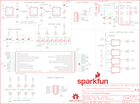

Contents
========

* [PRS12942 > Bus Pirate](#prs12942--bus-pirate)
	* [Schematic](#schematic)
	* [PCB](#pcb)
	* [Interactive BOM](#interactive-bom)
	* [OOMP Parts](#oomp-parts)
	* [Images](#images)
	* [Tags](#tags)
  
![][im]
# PRS12942 > Bus Pirate

- ID: PROJ-SPAR-12942-STAN-01
- Hex ID: PRS12942
- Name: Sparkfun
- Description: Sparkfun
- Long Link: [http://oom.lt/PROJ-SPAR-12942-STAN-01](http://oom.lt/PROJ-SPAR-12942-STAN-01)
- Short Link: [http://oom.lt/PRS12942](http://oom.lt/PRS12942)

## Schematic
  

## PCB
  

## Interactive BOM

- Interactive BOM page: [ibom.html](https://htmlpreview.github.io/?https://github.com/oomlout/oomlout_OOMP_projects/blob/main/PROJ-SPAR-12942-STAN-01/kicad/bom/ibom.html)

## OOMP Parts
  

|OOMP Parts|
| :---: |
|[CAPC-0603-X-NF100-V50  SMD (0603) 100 nF Capacitor (Ceramic) 50v  C1, C2, C5, C6, C10, C11](https://github.com/oomlout/oomlout_OOMP_parts/tree/main/CAPC-0603-X-NF100-V50/)|
|[CAPC-0805-X-UF10-V10  SMD (0805) 10 uF Capacitor (Ceramic) 10v  C3, C4, C7, C8, C9](https://github.com/oomlout/oomlout_OOMP_parts/tree/main/CAPC-0805-X-UF10-V10/)|
|UNMATCHED-UNMATCHED-X-UNMATCHED-01 J1, PCB1, U3, U5, U6|
|HEAD-I01-X-UNMATCHED-01 JP1|
|[HEAD-I01-X-PI05-01  2.54 mm 5 Pin Header  JP2](https://github.com/oomlout/oomlout_OOMP_parts/tree/main/HEAD-I01-X-PI05-01/)|
|UNMATCHED-0603-X-UNMATCHED-01 L1|
|[LEDS-0603-R-STAN-01  SMD (0603) Red LED  LED1, LED3, LED5, LED7](https://github.com/oomlout/oomlout_OOMP_parts/tree/main/LEDS-0603-R-STAN-01/)|
|RESE-0603-X-UNMATCHED-01 R1, R5, R8, R10, R11|
|RESE-UNMATCHED-X-O103-01 R2, R3, R12|
|[RESE-0603-X-O102-01  SMD (0603) 1k Ohm Resistor  R4, R6, R7, R9](https://github.com/oomlout/oomlout_OOMP_parts/tree/main/RESE-0603-X-O102-01/)|
|VREG-SO235-X-KMIC5205-01 U1, U2, U4|

## Images
  
  

|bominteractivefront|bominteractiveback|kicadPcb3d|kicadPcb3dFront|kicadPcb3dBack|eagleImage|eagleSchemImage|pcbdraw|pcbdrawback|
| :---: | :---: | :---: | :---: | :---: | :---: | :---: | :---: | :---: |
||||||||||

## Tags

- hexID: PRS12942
- oompType: PROJ
- oompSize: SPAR
- oompColor: 12942
- oompDesc: STAN
- oompIndex: 01
- oompName: Bus Pirate
- sources: All source files from https://github.com/sparkfun/Bus_Pirate (source licence details in srcLicense.md)
- linkBuyPage: https://www.sparkfun.com/products/12942
- oompID: PROJ-SPAR-12942-STAN-01
- oompParts: C1,CAPC-0603-X-NF100-V50
- oompParts: C2,CAPC-0603-X-NF100-V50
- oompParts: C3,CAPC-0805-X-UF10-V10
- oompParts: C4,CAPC-0805-X-UF10-V10
- oompParts: C5,CAPC-0603-X-NF100-V50
- oompParts: C6,CAPC-0603-X-NF100-V50
- oompParts: C7,CAPC-0805-X-UF10-V10
- oompParts: C8,CAPC-0805-X-UF10-V10
- oompParts: C9,CAPC-0805-X-UF10-V10
- oompParts: C10,CAPC-0603-X-NF100-V50
- oompParts: C11,CAPC-0603-X-NF100-V50
- oompParts: J1,UNMATCHED-UNMATCHED-X-UNMATCHED-01
- oompParts: JP1,HEAD-I01-X-UNMATCHED-01
- oompParts: JP2,HEAD-I01-X-PI05-01
- oompParts: L1,UNMATCHED-0603-X-UNMATCHED-01
- oompParts: LED1,LEDS-0603-R-STAN-01
- oompParts: LED3,LEDS-0603-R-STAN-01
- oompParts: LED5,LEDS-0603-R-STAN-01
- oompParts: LED7,LEDS-0603-R-STAN-01
- oompParts: PCB1,UNMATCHED-UNMATCHED-X-UNMATCHED-01
- oompParts: R1,RESE-0603-X-UNMATCHED-01
- oompParts: R2,RESE-UNMATCHED-X-O103-01
- oompParts: R3,RESE-UNMATCHED-X-O103-01
- oompParts: R4,RESE-0603-X-O102-01
- oompParts: R5,RESE-0603-X-UNMATCHED-01
- oompParts: R6,RESE-0603-X-O102-01
- oompParts: R7,RESE-0603-X-O102-01
- oompParts: R8,RESE-0603-X-UNMATCHED-01
- oompParts: R9,RESE-0603-X-O102-01
- oompParts: R10,RESE-0603-X-UNMATCHED-01
- oompParts: R11,RESE-0603-X-UNMATCHED-01
- oompParts: R12,RESE-UNMATCHED-X-O103-01
- oompParts: U1,VREG-SO235-X-KMIC5205-01
- oompParts: U2,VREG-SO235-X-KMIC5205-01
- oompParts: U3,UNMATCHED-UNMATCHED-X-UNMATCHED-01
- oompParts: U4,VREG-SO235-X-KMIC5205-01
- oompParts: U5,UNMATCHED-UNMATCHED-X-UNMATCHED-01
- oompParts: U6,UNMATCHED-UNMATCHED-X-UNMATCHED-01
- rawParts: C1,0.1uF,0.1UF-25V(+80/-20%)(0603),0603-CAP,CAP-00810,CAP-00810,0.1uF,
- rawParts: C2,0.1uF,0.1UF-25V(+80/-20%)(0603),0603-CAP,CAP-00810,CAP-00810,0.1uF,
- rawParts: C3,10uF,10UF10V10%(0805),0805-CAP,CAP-11330,CAP-11330,,
- rawParts: C4,10uF,10UF10V10%(0805),0805-CAP,CAP-11330,CAP-11330,,
- rawParts: C5,0.1uF,0.1UF-25V(+80/-20%)(0603),0603-CAP,CAP-00810,CAP-00810,0.1uF,
- rawParts: C6,0.1uF,0.1UF-25V(+80/-20%)(0603),0603-CAP,CAP-00810,CAP-00810,0.1uF,
- rawParts: C7,10uF,10UF10V10%(0805),0805-CAP,CAP-11330,CAP-11330,,
- rawParts: C8,10uF,10UF10V10%(0805),0805-CAP,CAP-11330,CAP-11330,,
- rawParts: C9,10uF,10UF10V10%(0805),0805-CAP,CAP-11330,CAP-11330,,
- rawParts: C10,0.1uF,0.1UF-25V(+80/-20%)(0603),0603-CAP,CAP-00810,CAP-00810,0.1uF,
- rawParts: C11,0.1uF,0.1UF-25V(+80/-20%)(0603),0603-CAP,CAP-00810,CAP-00810,0.1uF,
- rawParts: FID1,FIDUCIAL1X2,FIDUCIAL1X2,FIDUCIAL-1X2,Fiducial Alignment Points,,,
- rawParts: FID2,FIDUCIAL1X2,FIDUCIAL1X2,FIDUCIAL-1X2,Fiducial Alignment Points,,,
- rawParts: J1,USB-MINIB-5PIN,USB-MINIB-5PIN,USB-MINIB,Mini-USB B connector with 5th pin broken out.,CONN-08193,,
- rawParts: JP1,,M05X2SHD_SMD,2X5-SHROUDED_SMD,Header 5x2,CONN-09508,,
- rawParts: JP2,,M05PTH,1X05,Header 5,,,
- rawParts: L1,1A Ferrite,INDUCTOR0603,0603,Inductors,NDUC-12579,,
- rawParts: LED1,RED,LED-RED0603,LED-0603,Assorted Red LEDs,DIO-00819,RED,
- rawParts: LED2,DNP,LED-RED0603,LED-0603,Assorted Red LEDs,DIO-00819,RED,
- rawParts: LED3,RED,LED-RED0603,LED-0603,Assorted Red LEDs,DIO-00819,RED,
- rawParts: LED4,DNP,LED-RED0603,LED-0603,Assorted Red LEDs,DIO-00819,RED,
- rawParts: LED5,RED,LED-RED0603,LED-0603,Assorted Red LEDs,DIO-00819,RED,
- rawParts: LED6,DNP,LED-RED0603,LED-0603,Assorted Red LEDs,DIO-00819,RED,
- rawParts: LED7,RED,LED-RED0603,LED-0603,Assorted Red LEDs,DIO-00819,RED,
- rawParts: LED8,DNP,LED-RED0603,LED-0603,Assorted Red LEDs,DIO-00819,RED,
- rawParts: LOGO1,OSHW-LOGOL,OSHW-LOGOL,OSHW-LOGO-L,Open Source Hardware Logo,,,
- rawParts: LOGO2,SFE_LOGO_NAME_FLAME.1_INCH,SFE_LOGO_NAME_FLAME.1_INCH,SFE_LOGO_NAME_FLAME_.1,SFE Logo, name and flame,,,
- rawParts: PCB1,PCB_DP_RECTANGLE-37X60,PCB_DP_RECTANGLE-37X60,DP6037_V1,Dangerous Prototypes Standard Rectangular PCB sizes,,,
- rawParts: R1,0.27,0OHM-1/10W-5%(0603),0603,RES-08609,RES-08787,0,
- rawParts: R2,10k,CAY16-F4,4XARRAY,CAY16-F4,RES-13167,,
- rawParts: R3,10k,CAY16-F4,4XARRAY,CAY16-F4,RES-13167,,
- rawParts: R4,1K,1KOHM-1/10W-1%(0603),0603-RES,RES-07856,RES-07856,1K,
- rawParts: R5,0.27,0OHM-1/10W-5%(0603),0603,RES-08609,RES-08787,0,
- rawParts: R6,1K,1KOHM-1/10W-1%(0603),0603-RES,RES-07856,RES-07856,1K,
- rawParts: R7,1K,1KOHM-1/10W-1%(0603),0603-RES,RES-07856,RES-07856,1K,
- rawParts: R8,0.27,0OHM-1/10W-5%(0603),0603,RES-08609,RES-08787,0,
- rawParts: R9,1K,1KOHM-1/10W-1%(0603),0603-RES,RES-07856,RES-07856,1K,
- rawParts: R10,2.0k,2.0KOHM1/10W5%(0603),0603-RES,RES-08296,RES-08296,2.0k,
- rawParts: R11,2.0k,2.0KOHM1/10W5%(0603),0603-RES,RES-08296,RES-08296,2.0k,
- rawParts: R12,10k,CAY16-F4,4XARRAY,CAY16-F4,RES-13167,,
- rawParts: U1,MIC5205 3V3,MIC52053.3V,SOT23-5,MIC5205 150mA vreg,VREG-00822,,
- rawParts: U2,MIC5205 3V3,MIC52053.3V,SOT23-5,MIC5205 150mA vreg,VREG-00822,,
- rawParts: U3,PIC24FJ64GA002,PIC24FJ64GA002,SSOP28,16-bit General Purpose Flash Microcontroller,IC-09426,,
- rawParts: U4,MIC5205 5V0,MIC52055V,SOT23-5,MIC5205 150mA vreg,VREG-00823,,
- rawParts: U5,FT232RL-BASICSSOP,FT232RL-BASICSSOP,SSOP28DB,USB UART,IC-00870,,
- rawParts: U6,4066,4066,TSSOP14,Quad bilateral ANALOG SWITCH,IC-13191,,

[im]: kicadPcb3d_450.png
