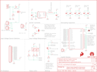

Contents
========

* [PRS12958 > Electric Imp imp002 Breakout](#prs12958--electric-imp-imp002-breakout)
	* [Schematic](#schematic)
	* [PCB](#pcb)
	* [Interactive BOM](#interactive-bom)
	* [OOMP Parts](#oomp-parts)
	* [Images](#images)
	* [Tags](#tags)
  
![][im]
# PRS12958 > Electric Imp imp002 Breakout

- ID: PROJ-SPAR-12958-STAN-01
- Hex ID: PRS12958
- Name: Sparkfun
- Description: Sparkfun
- Long Link: [http://oom.lt/PROJ-SPAR-12958-STAN-01](http://oom.lt/PROJ-SPAR-12958-STAN-01)
- Short Link: [http://oom.lt/PRS12958](http://oom.lt/PRS12958)

## Schematic
  

## PCB
  

## Interactive BOM

- Interactive BOM page: [ibom.html](https://htmlpreview.github.io/?https://github.com/oomlout/oomlout_OOMP_projects/blob/main/PROJ-SPAR-12958-STAN-01/kicad/bom/ibom.html)

## OOMP Parts
  

|OOMP ID|Name|Identifier|
| :---: | :---: | :---: |
|CAPX-UNMATCHED-X-UF10-01||C1|
|[CAPC-0805-X-UF22-V63D](https://github.com/oomlout/oomlout_OOMP_parts/tree/main/CAPC-0805-X-UF22-V63D/)|[SMD (0805) 22 uF Capacitor (Ceramic) 6.3v](https://github.com/oomlout/oomlout_OOMP_parts/tree/main/CAPC-0805-X-UF22-V63D/)|[C2](https://github.com/oomlout/oomlout_OOMP_parts/tree/main/CAPC-0805-X-UF22-V63D/)|
|[CAPC-0603-X-PF100-V50](https://github.com/oomlout/oomlout_OOMP_parts/tree/main/CAPC-0603-X-PF100-V50/)|[SMD (0603) 100 pF Capacitor (Ceramic) 50v](https://github.com/oomlout/oomlout_OOMP_parts/tree/main/CAPC-0603-X-PF100-V50/)|[C3, C5, C7](https://github.com/oomlout/oomlout_OOMP_parts/tree/main/CAPC-0603-X-PF100-V50/)|
|CAPC-0603-X-UNMATCHED-01||C4, C6|
|DIOD-UNMATCHED-X-UNMATCHED-01||D1|
|LEDS-UNMATCHED-G-STAN-01||D2|
|HEAD-I01-X-PI15-01||JP1|
|[HEAD-I01-X-PI02-01](https://github.com/oomlout/oomlout_OOMP_parts/tree/main/HEAD-I01-X-PI02-01/)|[2.54 mm 2 Pin Header](https://github.com/oomlout/oomlout_OOMP_parts/tree/main/HEAD-I01-X-PI02-01/)|[JP2, JP4](https://github.com/oomlout/oomlout_OOMP_parts/tree/main/HEAD-I01-X-PI02-01/)|
|HEAD-I01-X-UNMATCHED-01||JP3|
|HEAD-I01-X-PI01-01||JP5|
|UNMATCHED-UNMATCHED-X-UNMATCHED-01||L1, Q2, U1, U2, X1|
|UNMATCHED-SO23-X-UNMATCHED-01||Q1|
|RESE-0603-X-O1003-01||R1|
|[RESE-0603-X-O331-01](https://github.com/oomlout/oomlout_OOMP_parts/tree/main/RESE-0603-X-O331-01/)|[SMD (0603) 330 Ohm Resistor](https://github.com/oomlout/oomlout_OOMP_parts/tree/main/RESE-0603-X-O331-01/)|[R2, R3](https://github.com/oomlout/oomlout_OOMP_parts/tree/main/RESE-0603-X-O331-01/)|
|[RESE-0603-X-O333-01](https://github.com/oomlout/oomlout_OOMP_parts/tree/main/RESE-0603-X-O333-01/)|[SMD (0603) 33k Ohm Resistor](https://github.com/oomlout/oomlout_OOMP_parts/tree/main/RESE-0603-X-O333-01/)|[R4, R5](https://github.com/oomlout/oomlout_OOMP_parts/tree/main/RESE-0603-X-O333-01/)|
|[RESE-0603-X-O623-01](https://github.com/oomlout/oomlout_OOMP_parts/tree/main/RESE-0603-X-O623-01/)|[SMD (0603) 62k Ohm Resistor](https://github.com/oomlout/oomlout_OOMP_parts/tree/main/RESE-0603-X-O623-01/)|[R6](https://github.com/oomlout/oomlout_OOMP_parts/tree/main/RESE-0603-X-O623-01/)|
|[RESE-0603-X-O103-01](https://github.com/oomlout/oomlout_OOMP_parts/tree/main/RESE-0603-X-O103-01/)|[SMD (0603) 10k Ohm Resistor](https://github.com/oomlout/oomlout_OOMP_parts/tree/main/RESE-0603-X-O103-01/)|[R7](https://github.com/oomlout/oomlout_OOMP_parts/tree/main/RESE-0603-X-O103-01/)|

## Images
  
  

|bominteractivefront|bominteractiveback|kicadPcb3d|kicadPcb3dFront|kicadPcb3dBack|kicadSchem|eagleImage|eagleSchemImage|pcbdraw|pcbdrawback|
| :---: | :---: | :---: | :---: | :---: | :---: | :---: | :---: | :---: | :---: |
|||||||||||

## Tags

- hexID: PRS12958
- oompType: PROJ
- oompSize: SPAR
- oompColor: 12958
- oompDesc: STAN
- oompIndex: 01
- oompName: Electric Imp imp002 Breakout
- sources: All source files from https://github.com/sparkfun/Electric_Imp_imp002_Breakout (source licence details in srcLicense.md)
- linkBuyPage: https://www.sparkfun.com/products/12958
- oompID: PROJ-SPAR-12958-STAN-01
- oompParts: C1,CAPX-UNMATCHED-X-UF10-01
- oompParts: C2,CAPC-0805-X-UF22-V63D
- oompParts: C3,CAPC-0603-X-PF100-V50
- oompParts: C4,CAPC-0603-X-UNMATCHED-01
- oompParts: C5,CAPC-0603-X-PF100-V50
- oompParts: C6,CAPC-0603-X-UNMATCHED-01
- oompParts: C7,CAPC-0603-X-PF100-V50
- oompParts: D1,DIOD-UNMATCHED-X-UNMATCHED-01
- oompParts: D2,LEDS-UNMATCHED-G-STAN-01
- oompParts: JP1,HEAD-I01-X-PI15-01
- oompParts: JP2,HEAD-I01-X-PI02-01
- oompParts: JP3,HEAD-I01-X-UNMATCHED-01
- oompParts: JP4,HEAD-I01-X-PI02-01
- oompParts: JP5,HEAD-I01-X-PI01-01
- oompParts: L1,UNMATCHED-UNMATCHED-X-UNMATCHED-01
- oompParts: Q1,UNMATCHED-SO23-X-UNMATCHED-01
- oompParts: Q2,UNMATCHED-UNMATCHED-X-UNMATCHED-01
- oompParts: R1,RESE-0603-X-O1003-01
- oompParts: R2,RESE-0603-X-O331-01
- oompParts: R3,RESE-0603-X-O331-01
- oompParts: R4,RESE-0603-X-O333-01
- oompParts: R5,RESE-0603-X-O333-01
- oompParts: R6,RESE-0603-X-O623-01
- oompParts: R7,RESE-0603-X-O103-01
- oompParts: U1,UNMATCHED-UNMATCHED-X-UNMATCHED-01
- oompParts: U2,UNMATCHED-UNMATCHED-X-UNMATCHED-01
- oompParts: X1,UNMATCHED-UNMATCHED-X-UNMATCHED-01
- rawParts: C1,10uF,CAP1210,1210,Capacitor,,,
- rawParts: C2,22uF,CAP0805,0805,Capacitor,CAP-08402,,
- rawParts: C3,100pF,CAP0603-CAP,0603-CAP,Capacitor,CAP-07883,,
- rawParts: C4,1.0uF,1.0UF-16V-10%(0603),0603-CAP,CAP-00868,CAP-00868,1.0uF,
- rawParts: C5,100pF,CAP0603-CAP,0603-CAP,Capacitor,CAP-07883,,
- rawParts: C6,1.0uF,1.0UF-16V-10%(0603),0603-CAP,CAP-00868,CAP-00868,1.0uF,
- rawParts: C7,100pF,CAP0603-CAP,0603-CAP,Capacitor,CAP-07883,,
- rawParts: C8,DNP,CAP0603-CAP,0603-CAP,Capacitor,,,
- rawParts: D1,MBRA140,DIODE-SCHOTTKY-MBRA140,SMA-DIODE,Schottky diodes in SFEs production catalog,DIO-08053,MBRA140,
- rawParts: D2,LED-RGLTST-C195KGJRKT,LED-RGLTST-C195KGJRKT,LTST-C195KGJRKT,,DIO-12140,,
- rawParts: FID1,FIDUCIAL1X2,FIDUCIAL1X2,FIDUCIAL-1X2,Fiducial Alignment Points,,,
- rawParts: FID2,FIDUCIAL1X2,FIDUCIAL1X2,FIDUCIAL-1X2,Fiducial Alignment Points,,,
- rawParts: FRAME1,FRAME-LETTER,FRAME-LETTER,CREATIVE_COMMONS,Schematic Frame,,,
- rawParts: JP1,M15,M15,1X15,Header 15,,,
- rawParts: JP2,M02PTH,M02PTH,1X02,Standard 2-pin 0.1 header. Use with,,,
- rawParts: JP3,M02-JST-2MM-SMT,M02-JST-2MM-SMT,JST-2-SMD,Standard 2-pin 0.1 header. Use with,CONN-08352,,
- rawParts: JP4,M02PTH,M02PTH,1X02,Standard 2-pin 0.1 header. Use with,,,
- rawParts: JP5,M01PTH,M01PTH,1X01,Header 1,,,
- rawParts: L1,2.2uH,INDUCTORVLF4012A,VLF4012A,Inductors,,,
- rawParts: LOGO1,OSHW-LOGOS,OSHW-LOGOS,OSHW-LOGO-S,Open Source Hardware Logo This logo indicates the piece of hardware it is found on incorporates a OSHW license and/or adheres to the definition of open source hardware found here: http://freedomdefined.org/OSHW,,,
- rawParts: LOGO2,SFE_LOGO_FLAME.1_INCH,SFE_LOGO_FLAME.1_INCH,SFE_LOGO_FLAME_.1,SFE Logo, flame only,,,
- rawParts: Q1,DMG2307L,MOSFET-PCHANNELDMG2307L,SOT23-3,Generic PMOSFET,TRANS-11308,2.5A/30V,
- rawParts: Q2,PT17-21C-L41-TR8,PHOTOTRANSISTORPT17-21C-L41-TR8,PT17-21C-L41-TR8,,TRANS-12141,,
- rawParts: R1,100k,100KOHM1/10W1%(0603),0603-RES,RES-07828,RES-07828,100k,
- rawParts: R2,330,330OHM1/10W1%(0603),0603-RES,RES-00818,RES-00818,330,
- rawParts: R3,330,330OHM1/10W1%(0603),0603-RES,RES-00818,RES-00818,330,
- rawParts: R4,33k,33KOHM1/10W1%(0603),0603-RES,RES-08416,RES-08416,,
- rawParts: R5,33k,33KOHM1/10W1%(0603),0603-RES,RES-08416,RES-08416,,
- rawParts: R6,62k,RESISTOR0603,0603-RES,Resistor,RES-09993,,
- rawParts: R7,10K,10KOHM1/10W1%(0603)0603,0603-RES,RES-00824,RES-00824,10K,
- rawParts: SJ1,JUMPER-PAD-2-NC_BY_PASTE,JUMPER-PAD-2-NC_BY_PASTE,PAD-JUMPER-2-NC_BY_PASTE_YES_SILK,,,,
- rawParts: SJ2,JUMPER-PAD-3-NOFULL_BOX_SILK,JUMPER-PAD-3-NOFULL_BOX_SILK,PAD-JUMPER-3-NO_YES_SILK_FULL_BOX,,,,
- rawParts: STANDOFF1,STAND-OFF,STAND-OFF,STAND-OFF,#4 Stand Off,,,
- rawParts: STANDOFF2,STAND-OFF,STAND-OFF,STAND-OFF,#4 Stand Off,,,
- rawParts: STANDOFF3,STAND-OFF,STAND-OFF,STAND-OFF,#4 Stand Off,,,
- rawParts: STANDOFF4,STAND-OFF,STAND-OFF,STAND-OFF,#4 Stand Off,,,
- rawParts: TP1,TEST-POINT3X5,TEST-POINT3X5,PAD.03X.05,Bare copper test points for troubleshooting or ICT,,,
- rawParts: TP2,TEST-POINT3X5,TEST-POINT3X5,PAD.03X.05,Bare copper test points for troubleshooting or ICT,,,
- rawParts: U$9,SFE_LOGO_NAME_WEB,SFE_LOGO_NAME_WEB,SFE-NEW-WEBLOGO,SparkFun.com board silk.,,,
- rawParts: U1,imp002,ELECTRIC_IMP_IMP002,ELECTRIC_IMP_IMP002,,IC-12130,imp002,
- rawParts: U2,TPS62172,TPS62172,WSON-8-PAD,Texas Instruments TPS62172,IC-11307,,
- rawParts: X1,USBSMD,USBSMD,USB-MINIB,USB Connectors,CONN-08193,,

[im]: kicadPcb3d_450.png
