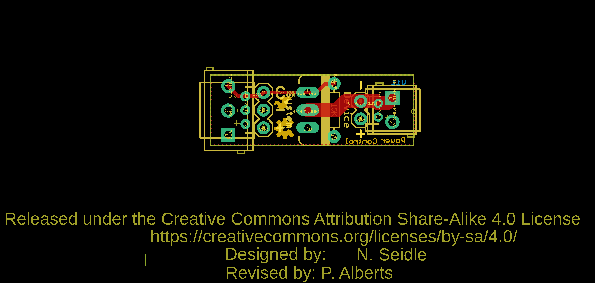
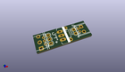
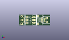
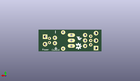
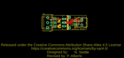
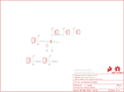

Contents
========

* [PRS12959 > MOSFET Power Control Kit](#prs12959--mosfet-power-control-kit)
	* [Schematic](#schematic)
	* [PCB](#pcb)
	* [Interactive BOM](#interactive-bom)
	* [OOMP Parts](#oomp-parts)
	* [Images](#images)
	* [Tags](#tags)
  
![][im]
# PRS12959 > MOSFET Power Control Kit

- ID: PROJ-SPAR-12959-STAN-01
- Hex ID: PRS12959
- Name: Sparkfun
- Description: Sparkfun
- Long Link: [http://oom.lt/PROJ-SPAR-12959-STAN-01](http://oom.lt/PROJ-SPAR-12959-STAN-01)
- Short Link: [http://oom.lt/PRS12959](http://oom.lt/PRS12959)

## Schematic
  

## PCB
  

## Interactive BOM

- Interactive BOM page: [ibom.html](https://htmlpreview.github.io/?https://github.com/oomlout/oomlout_OOMP_projects/blob/main/PROJ-SPAR-12959-STAN-01/kicad/bom/ibom.html)

## OOMP Parts
  

|OOMP Parts|
| :---: |
|[JP1 TERS-35D-L-PI02-01 3.5 mm 2 Pin Blue Screw Terminal](https://github.com/oomlout/oomlout_OOMP_parts/tree/main/TERS-35D-L-PI02-01/)|
|JP2 JP2,UNMATCHED-UNMATCHED-X-UNMATCHED-01|
|[JP3 HEAD-I01-X-PI02-01 2.54 mm 2 Pin Header](https://github.com/oomlout/oomlout_OOMP_parts/tree/main/HEAD-I01-X-PI02-01/)|
|[JP4 TERS-35D-L-PI03-01 3.5 mm 3 Pin Blue Screw Terminal](https://github.com/oomlout/oomlout_OOMP_parts/tree/main/TERS-35D-L-PI03-01/)|
|[JP5 HEAD-I01-X-PI03-01 2.54 mm 3 Pin Header](https://github.com/oomlout/oomlout_OOMP_parts/tree/main/HEAD-I01-X-PI03-01/)|
|JP8 JP8,UNMATCHED-UNMATCHED-X-UNMATCHED-01|
|Q1 Q1,UNMATCHED-UNMATCHED-X-UNMATCHED-01|
|R1 R1,RESE-UNMATCHED-X-O103-01|

## Images
  
  

|kicadPcb3d|kicadPcb3dFront|kicadPcb3dBack|eagleImage|eagleSchemImage|
| :---: | :---: | :---: | :---: | :---: |
||||||

## Tags

- hexID: PRS12959
- oompType: PROJ
- oompSize: SPAR
- oompColor: 12959
- oompDesc: STAN
- oompIndex: 01
- oompName: MOSFET Power Control Kit
- sources: All source files from https://github.com/sparkfun/MOSFET_Power_Control_Kit (source licence details in srcLicense.md)
- linkBuyPage: https://www.sparkfun.com/products/12959
- oompID: PROJ-SPAR-12959-STAN-01
- oompParts: JP1,TERS-35D-L-PI02-01
- oompParts: JP2,UNMATCHED-UNMATCHED-X-UNMATCHED-01
- oompParts: JP3,HEAD-I01-X-PI02-01
- oompParts: JP4,TERS-35D-L-PI03-01
- oompParts: JP5,HEAD-I01-X-PI03-01
- oompParts: JP8,UNMATCHED-UNMATCHED-X-UNMATCHED-01
- oompParts: Q1,UNMATCHED-UNMATCHED-X-UNMATCHED-01
- oompParts: R1,RESE-UNMATCHED-X-O103-01
- rawParts: FRAME1,FRAME-LETTER,FRAME-LETTER,CREATIVE_COMMONS,Schematic Frame,,
- rawParts: JP1,,M023.5MM,SCREWTERMINAL-3.5MM-2,Header 2,,
- rawParts: JP2,,M03JST-PTH,JST-3-PTH,Header 3,,
- rawParts: JP3,,M02PTH,1X02,Standard 2-pin 0.1 header. Use with,,
- rawParts: JP4,,M03SCREW,SCREWTERMINAL-3.5MM-3,Header 3,,
- rawParts: JP5,,M03PTH,1X03,Header 3,,
- rawParts: JP8,,M02JST-PTH-2,JST-2-PTH,Header 2,,
- rawParts: LOGO1,OSHW-LOGOS,OSHW-LOGOS,OSHW-LOGO-S,Open Source Hardware Logo This logo indicates the piece of hardware it is found on incorporates a OSHW license and/or adheres to the definition of open source hardware found here: http://freedomdefined.org/OSHW,,
- rawParts: LOGO2,SFE_LOGO_FLAME.1_INCH,SFE_LOGO_FLAME.1_INCH,SFE_LOGO_FLAME_.1,SFE Logo, flame only,,
- rawParts: Q1,RFP30N6LE,MOSFET-NCHANNELPTH2,TO220V,,,
- rawParts: R1,10K,RESISTORPTH1,AXIAL-0.3,Resistor,,

[im]: kicadPcb3d_450.png
