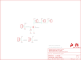

Contents
========

* [PRS12959 > Sparkfun](#prs12959--sparkfun)
	* [Images](#images)
	* [Tags](#tags)
  
![][im]
# PRS12959 > Sparkfun

- ID: PROJ-SPAR-12959-STAN-01
- Hex ID: PRS12959
- Name: Sparkfun
- Description: Sparkfun

## Images
  
  

|kicadPcb3d|kicadPcb3dFront|kicadPcb3dBack|eagleImage|eagleSchemImage|
| :---: | :---: | :---: | :---: | :---: |
||||||

## Tags

- hexID: PRS12959
- oompType: PROJ
- oompSize: SPAR
- oompColor: 12959
- oompDesc: STAN
- oompIndex: 01
- oompName: MOSFET Power Control Kit
- sources: All source files from https://github.com/sparkfun/MOSFET_Power_Control_Kit (source licence details in srcLicense.md)
- linkBuyPage: https://www.sparkfun.com/products/12959
- oompID: PROJ-SPAR-12959-STAN-01
- oompParts: FRAME1,UNMATCHED-UNMATCHED-UNMATCHED-UNMATCHED-UNMATCHED
- oompParts: JP1,UNMATCHED-UNMATCHED-UNMATCHED-UNMATCHED-UNMATCHED
- oompParts: JP2,UNMATCHED-UNMATCHED-UNMATCHED-UNMATCHED-UNMATCHED
- oompParts: JP3,UNMATCHED-UNMATCHED-UNMATCHED-UNMATCHED-UNMATCHED
- oompParts: JP4,UNMATCHED-UNMATCHED-UNMATCHED-UNMATCHED-UNMATCHED
- oompParts: JP5,UNMATCHED-UNMATCHED-UNMATCHED-UNMATCHED-UNMATCHED
- oompParts: JP8,UNMATCHED-UNMATCHED-UNMATCHED-UNMATCHED-UNMATCHED
- oompParts: LOGO1,UNMATCHED-UNMATCHED-UNMATCHED-UNMATCHED-UNMATCHED
- oompParts: LOGO2,UNMATCHED-UNMATCHED-UNMATCHED-UNMATCHED-UNMATCHED
- oompParts: Q1,UNMATCHED-UNMATCHED-UNMATCHED-UNMATCHED-UNMATCHED
- oompParts: R1,UNMATCHED-UNMATCHED-UNMATCHED-UNMATCHED-UNMATCHED
- rawParts: FRAME1,FRAME-LETTER,FRAME-LETTER,CREATIVE_COMMONS,Schematic Frame,,
- rawParts: JP1,,M023.5MM,SCREWTERMINAL-3.5MM-2,Header 2,,
- rawParts: JP2,,M03JST-PTH,JST-3-PTH,Header 3,,
- rawParts: JP3,,M02PTH,1X02,Standard 2-pin 0.1 header. Use with,,
- rawParts: JP4,,M03SCREW,SCREWTERMINAL-3.5MM-3,Header 3,,
- rawParts: JP5,,M03PTH,1X03,Header 3,,
- rawParts: JP8,,M02JST-PTH-2,JST-2-PTH,Header 2,,
- rawParts: LOGO1,OSHW-LOGOS,OSHW-LOGOS,OSHW-LOGO-S,Open Source Hardware Logo This logo indicates the piece of hardware it is found on incorporates a OSHW license and/or adheres to the definition of open source hardware found here: http://freedomdefined.org/OSHW,,
- rawParts: LOGO2,SFE_LOGO_FLAME.1_INCH,SFE_LOGO_FLAME.1_INCH,SFE_LOGO_FLAME_.1,SFE Logo, flame only,,
- rawParts: Q1,RFP30N6LE,MOSFET-NCHANNELPTH2,TO220V,,,
- rawParts: R1,10K,RESISTORPTH1,AXIAL-0.3,Resistor,,

[im]: kicadPcb3d_450.png
