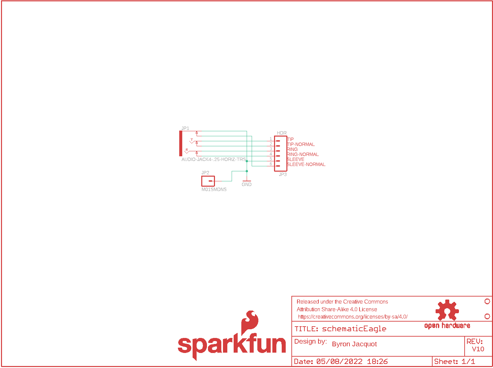
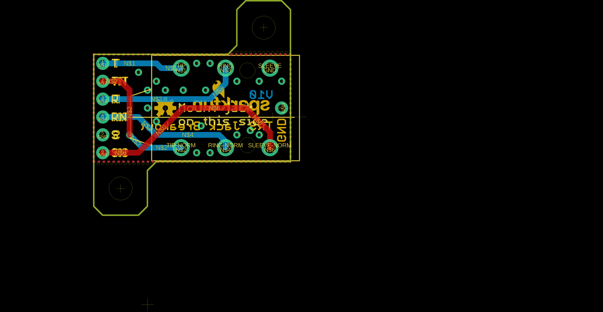
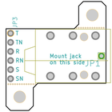
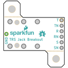
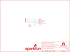
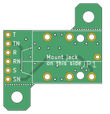

Contents
========

* [PRS13005 > TRS Jack Breakout](#prs13005--trs-jack-breakout)
	* [Schematic](#schematic)
	* [PCB](#pcb)
	* [Interactive BOM](#interactive-bom)
	* [OOMP Parts](#oomp-parts)
	* [Images](#images)
	* [Tags](#tags)
  
![][im]
# PRS13005 > TRS Jack Breakout

- ID: PROJ-SPAR-13005-STAN-01
- Hex ID: PRS13005
- Name: Sparkfun
- Description: Sparkfun
- Long Link: [http://oom.lt/PROJ-SPAR-13005-STAN-01](http://oom.lt/PROJ-SPAR-13005-STAN-01)
- Short Link: [http://oom.lt/PRS13005](http://oom.lt/PRS13005)

## Schematic
  

## PCB
  

## Interactive BOM

- Interactive BOM page: [ibom.html](https://htmlpreview.github.io/?https://github.com/oomlout/oomlout_OOMP_projects/blob/main/PROJ-SPAR-13005-STAN-01/kicad/bom/ibom.html)

## OOMP Parts
  

|OOMP ID|Name|Identifier|
| :---: | :---: | :---: |
|UNMATCHED-UNMATCHED-X-UNMATCHED-01||JP1|
|HEAD-I01-X-PI01-01||JP2|
|[HEAD-I01-X-PI06-01](https://github.com/oomlout/oomlout_OOMP_parts/tree/main/HEAD-I01-X-PI06-01/)|[2.54 mm 6 Pin Header](https://github.com/oomlout/oomlout_OOMP_parts/tree/main/HEAD-I01-X-PI06-01/)|[JP3](https://github.com/oomlout/oomlout_OOMP_parts/tree/main/HEAD-I01-X-PI06-01/)|

## Images
  
  

|bominteractivefront|bominteractiveback|kicadPcb3d|kicadPcb3dFront|kicadPcb3dBack|eagleImage|eagleSchemImage|pcbdraw|pcbdrawback|
| :---: | :---: | :---: | :---: | :---: | :---: | :---: | :---: | :---: |
||||||||||

## Tags

- hexID: PRS13005
- oompType: PROJ
- oompSize: SPAR
- oompColor: 13005
- oompDesc: STAN
- oompIndex: 01
- oompName: TRS Jack Breakout
- sources: All source files from https://github.com/sparkfun/TRS_Jack_Breakout (source licence details in srcLicense.md)
- linkBuyPage: https://www.sparkfun.com/products/13005
- oompID: PROJ-SPAR-13005-STAN-01
- oompParts: JP1,UNMATCHED-UNMATCHED-X-UNMATCHED-01
- oompParts: JP2,HEAD-I01-X-PI01-01
- oompParts: JP3,HEAD-I01-X-PI06-01
- rawParts: FRAME1,FRAME-LETTER,FRAME-LETTER,CREATIVE_COMMONS,Schematic Frame,,
- rawParts: JP1,AUDIO-JACK4-.25-HORIZ-TRS,AUDIO-JACK4-.25-HORIZ-TRS,AUDIO-JACK-.25-INCH-HORIZ-PTH,1/4 TRS jack, horizontal,COM-11144,
- rawParts: JP2,M01SMDNS,M01SMDNS,1X01NS,Header 1,,
- rawParts: JP3,HDR,M06NO_SILK,1X06_NO_SILK,Header 6,,
- rawParts: LOGO1,SFE_LOGO_NAME_FLAME.1_INCH,SFE_LOGO_NAME_FLAME.1_INCH,SFE_LOGO_NAME_FLAME_.1,SFE Logo, name and flame,,
- rawParts: LOGO2,OSHW-LOGOS,OSHW-LOGOS,OSHW-LOGO-S,Open Source Hardware Logo This logo indicates the piece of hardware it is found on incorporates a OSHW license and/or adheres to the definition of open source hardware found here: http://freedomdefined.org/OSHW,,
- rawParts: STANDOFF1,STAND-OFF,STAND-OFF,STAND-OFF,#4 Stand Off,,
- rawParts: STANDOFF2,STAND-OFF,STAND-OFF,STAND-OFF,#4 Stand Off,,

[im]: kicadPcb3d_450.png
