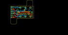
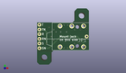
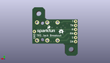
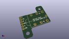

Contents
========

* [PROJ-SPAR-13005-STAN-01>TRS Jack Breakout](#proj-spar-13005-stan-01trs-jack-breakout)
	* [Images](#images)
	* [Interactive BOM](#interactive-bom)
	* [OOMP Parts](#oomp-parts)
	* [Tags](#tags)
  
![][im]
# PROJ-SPAR-13005-STAN-01>TRS Jack Breakout

- ID: PROJ-SPAR-13005-STAN-01
- Hex ID: PRS13005
- Name: TRS Jack Breakout
- Description: 

## Images
  
  

|eagleImage|kicadPcb3dFront|kicadPcb3dBack|kicadPcb3d|
| :---: | :---: | :---: | :---: |
|||||

## Interactive BOM

- Interactive BOM page: [ibom.html](kicad/bom/ibom.html)

## OOMP Parts
  

|OOMP Parts|
| :---: |
|UNMATCHED-UNMATCHED-X-UNMATCHED-01, JP1, 29.209999999999997, 13.97, 180,JP1, AUDIO-JACK4-.25-HORIZ-TRS, AUDIO-JACK-.25-INCH-HORIZ-PTH, SparkFun-Connectors, (1.15, 0.55), R180|
|HEAD-I01-X-PI01-01, JP2, 26.669999999999998, 15.239999999999998, 0,JP2, M01SMDNS, 1X01NS, SparkFun-Connectors, (1.05, 0.6), R0|
|<table><tr><td></td><td> JP3</td><td>[HEAD-I01-X-PI06-01 2.54 mm 6 Pin Header](https://github.com/oomlout/oomlout_OOMP_parts/tree/main/HEAD-I01-X-PI06-01/)</td><td>[H06](https://github.com/oomlout/oomlout_OOMP_parts/tree/main/HEAD-I01-X-PI06-01/)</td></tr></table>|

## Tags

- hexID: PRS13005
- oompType: PROJ
- oompSize: SPAR
- oompColor: 13005
- oompDesc: STAN
- oompIndex: 01
- oompName: TRS Jack Breakout
- sources: All source files from https://github.com/sparkfun/TRS_Jack_Breakout (source licence details in srcLicense.md)
- linkBuyPage: https://www.sparkfun.com/products/13005
- oompPart: UNMATCHED-UNMATCHED-X-UNMATCHED-01, JP1, 29.209999999999997, 13.97, 180
- oompPart: HEAD-I01-X-PI01-01, JP2, 26.669999999999998, 15.239999999999998, 0
- oompPart: HEAD-I01-X-PI06-01, JP3, 1.27, 21.59, 270
- rawPart: JP1, AUDIO-JACK4-.25-HORIZ-TRS, AUDIO-JACK-.25-INCH-HORIZ-PTH, SparkFun-Connectors, (1.15, 0.55), R180
- rawPart: JP2, M01SMDNS, 1X01NS, SparkFun-Connectors, (1.05, 0.6), R0
- rawPart: JP3, HDR, 1X06_NO_SILK, SparkFun-Connectors, (0.05, 0.85), R270
- oompID: PROJ-SPAR-13005-STAN-01

[im]: kicadPcb3d_450.png
