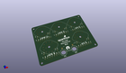
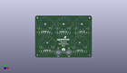
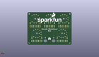
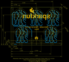
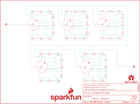

Contents
========

* [PRS13006 > Sparkfun](#prs13006--sparkfun)
	* [Schematic](#schematic)
	* [Interactive BOM](#interactive-bom)
	* [OOMP Parts](#oomp-parts)
	* [Images](#images)
	* [Tags](#tags)
  
![][im]
# PRS13006 > Sparkfun

- ID: PROJ-SPAR-13006-STAN-01
- Hex ID: PRS13006
- Name: Sparkfun
- Description: Sparkfun
- Long Link: [http://oom.lt/PROJ-SPAR-13006-STAN-01](http://oom.lt/PROJ-SPAR-13006-STAN-01)
- Long Link: [http://oom.lt/PRS13006](http://oom.lt/PRS13006)

## Schematic
  
![][schem]
## Interactive BOM

- Interactive BOM page: [ibom.html](https://htmlpreview.github.io/?https://github.com/oomlout/oomlout_OOMP_projects/blob/main/PROJ-SPAR-13006-STAN-01/kicad/bom/ibom.html)

## OOMP Parts
  

|OOMP Parts|
| :---: |
|FRAME1,UNMATCHED-UNMATCHED-UNMATCHED-UNMATCHED-UNMATCHED,FRAME1,FRAME-LETTER,FRAME-LETTER,CREATIVE_COMMONS,Schematic Frame,,,|
|JP1,UNMATCHED-UNMATCHED-UNMATCHED-UNMATCHED-UNMATCHED,JP1,,BANANA-JACK,BANANA-JACK,Single Banana jack.,,,|
|JP2,UNMATCHED-UNMATCHED-UNMATCHED-UNMATCHED-UNMATCHED,JP2,,BANANA-JACK,BANANA-JACK,Single Banana jack.,,,|
|LOGO1,UNMATCHED-UNMATCHED-UNMATCHED-UNMATCHED-UNMATCHED,LOGO1,OSHW-LOGOL,OSHW-LOGOL,OSHW-LOGO-L,Open Source Hardware Logo This logo indicates the piece of hardware it is found on incorporates a OSHW license and/or adheres to the definition of open source hardware found here: http://freedomdefined.org/OSHW,,,|
|LOGO2,UNMATCHED-UNMATCHED-UNMATCHED-UNMATCHED-UNMATCHED,LOGO2,SFE_LOGO_NAME_FLAME.2_INCH,SFE_LOGO_NAME_FLAME.2_INCH,SFE_LOGO_NAME_FLAME_.2,SFE Logo, name and flame,,,|
|LOGO3,UNMATCHED-UNMATCHED-UNMATCHED-UNMATCHED-UNMATCHED,LOGO3,SFE_LOGO_NAME_FLAME.5_INCH,SFE_LOGO_NAME_FLAME.5_INCH,SFE_LOGO_NAME_FLAME_.5,SFE Logo, name and flame,,,|
|LOGO4,UNMATCHED-UNMATCHED-UNMATCHED-UNMATCHED-UNMATCHED,LOGO4,OSHW-LOGOL,OSHW-LOGOL,OSHW-LOGO-L,Open Source Hardware Logo This logo indicates the piece of hardware it is found on incorporates a OSHW license and/or adheres to the definition of open source hardware found here: http://freedomdefined.org/OSHW,,,|
|R1,UNMATCHED-UNMATCHED-UNMATCHED-UNMATCHED-UNMATCHED,R1,100k,100KOHM-1/4W-1%(PTH)VERT-KIT,AXIAL-0.1EZ,RES-12184,RES-12184,100K,|
|R2,UNMATCHED-UNMATCHED-UNMATCHED-UNMATCHED-UNMATCHED,R2,100k,100KOHM-1/4W-1%(PTH)VERT-KIT,AXIAL-0.1EZ,RES-12184,RES-12184,100K,|
|R3,UNMATCHED-UNMATCHED-UNMATCHED-UNMATCHED-UNMATCHED,R3,100k,100KOHM-1/4W-1%(PTH)VERT-KIT,AXIAL-0.1EZ,RES-12184,RES-12184,100K,|
|R4,UNMATCHED-UNMATCHED-UNMATCHED-UNMATCHED-UNMATCHED,R4,100k,100KOHM-1/4W-1%(PTH)VERT-KIT,AXIAL-0.1EZ,RES-12184,RES-12184,100K,|
|R5,UNMATCHED-UNMATCHED-UNMATCHED-UNMATCHED-UNMATCHED,R5,100k,100KOHM-1/4W-1%(PTH)VERT-KIT,AXIAL-0.1EZ,RES-12184,RES-12184,100K,|
|R6,UNMATCHED-UNMATCHED-UNMATCHED-UNMATCHED-UNMATCHED,R6,100k,100KOHM-1/4W-1%(PTH)VERT-KIT,AXIAL-0.1EZ,RES-12184,RES-12184,100K,|
|R7,UNMATCHED-UNMATCHED-UNMATCHED-UNMATCHED-UNMATCHED,R7,100k,100KOHM-1/4W-1%(PTH)VERT-KIT,AXIAL-0.1EZ,RES-12184,RES-12184,100K,|
|R8,UNMATCHED-UNMATCHED-UNMATCHED-UNMATCHED-UNMATCHED,R8,100k,100KOHM-1/4W-1%(PTH)VERT-KIT,AXIAL-0.1EZ,RES-12184,RES-12184,100K,|
|R9,UNMATCHED-UNMATCHED-UNMATCHED-UNMATCHED-UNMATCHED,R9,100k,100KOHM-1/4W-1%(PTH)VERT-KIT,AXIAL-0.1EZ,RES-12184,RES-12184,100K,|
|R10,UNMATCHED-UNMATCHED-UNMATCHED-UNMATCHED-UNMATCHED,R10,10k,10KOHM-1/4W-1%(PTH)VERT-KIT,AXIAL-0.1EZ,RES-12183,RES-12183,10k,|
|R11,UNMATCHED-UNMATCHED-UNMATCHED-UNMATCHED-UNMATCHED,R11,10k,10KOHM-1/4W-1%(PTH)VERT-KIT,AXIAL-0.1EZ,RES-12183,RES-12183,10k,|
|R12,UNMATCHED-UNMATCHED-UNMATCHED-UNMATCHED-UNMATCHED,R12,10k,10KOHM-1/4W-1%(PTH)VERT-KIT,AXIAL-0.1EZ,RES-12183,RES-12183,10k,|
|R13,UNMATCHED-UNMATCHED-UNMATCHED-UNMATCHED-UNMATCHED,R13,10k,10KOHM-1/4W-1%(PTH)VERT-KIT,AXIAL-0.1EZ,RES-12183,RES-12183,10k,|
|R14,UNMATCHED-UNMATCHED-UNMATCHED-UNMATCHED-UNMATCHED,R14,10k,10KOHM-1/4W-1%(PTH)VERT-KIT,AXIAL-0.1EZ,RES-12183,RES-12183,10k,|
|R15,UNMATCHED-UNMATCHED-UNMATCHED-UNMATCHED-UNMATCHED,R15,10k,10KOHM-1/4W-1%(PTH)VERT-KIT,AXIAL-0.1EZ,RES-12183,RES-12183,10k,|
|R16,UNMATCHED-UNMATCHED-UNMATCHED-UNMATCHED-UNMATCHED,R16,10k,10KOHM-1/4W-1%(PTH)VERT-KIT,AXIAL-0.1EZ,RES-12183,RES-12183,10k,|
|R17,UNMATCHED-UNMATCHED-UNMATCHED-UNMATCHED-UNMATCHED,R17,10k,10KOHM-1/4W-1%(PTH)VERT-KIT,AXIAL-0.1EZ,RES-12183,RES-12183,10k,|
|R18,UNMATCHED-UNMATCHED-UNMATCHED-UNMATCHED-UNMATCHED,R18,10k,10KOHM-1/4W-1%(PTH)VERT-KIT,AXIAL-0.1EZ,RES-12183,RES-12183,10k,|
|R19,UNMATCHED-UNMATCHED-UNMATCHED-UNMATCHED-UNMATCHED,R19,1k,1KOHM-1/4W-1%(PTH)VERT-KIT,AXIAL-0.1EZ,RES-12182,RES-12182,1K,|
|R20,UNMATCHED-UNMATCHED-UNMATCHED-UNMATCHED-UNMATCHED,R20,1k,1KOHM-1/4W-1%(PTH)VERT-KIT,AXIAL-0.1EZ,RES-12182,RES-12182,1K,|
|R21,UNMATCHED-UNMATCHED-UNMATCHED-UNMATCHED-UNMATCHED,R21,1k,1KOHM-1/4W-1%(PTH)VERT-KIT,AXIAL-0.1EZ,RES-12182,RES-12182,1K,|
|R22,UNMATCHED-UNMATCHED-UNMATCHED-UNMATCHED-UNMATCHED,R22,1k,1KOHM-1/4W-1%(PTH)VERT-KIT,AXIAL-0.1EZ,RES-12182,RES-12182,1K,|
|R23,UNMATCHED-UNMATCHED-UNMATCHED-UNMATCHED-UNMATCHED,R23,1k,1KOHM-1/4W-1%(PTH)VERT-KIT,AXIAL-0.1EZ,RES-12182,RES-12182,1K,|
|R24,UNMATCHED-UNMATCHED-UNMATCHED-UNMATCHED-UNMATCHED,R24,1k,1KOHM-1/4W-1%(PTH)VERT-KIT,AXIAL-0.1EZ,RES-12182,RES-12182,1K,|
|R25,UNMATCHED-UNMATCHED-UNMATCHED-UNMATCHED-UNMATCHED,R25,1k,1KOHM-1/4W-1%(PTH)VERT-KIT,AXIAL-0.1EZ,RES-12182,RES-12182,1K,|
|R26,UNMATCHED-UNMATCHED-UNMATCHED-UNMATCHED-UNMATCHED,R26,1k,1KOHM-1/4W-1%(PTH)VERT-KIT,AXIAL-0.1EZ,RES-12182,RES-12182,1K,|
|R27,UNMATCHED-UNMATCHED-UNMATCHED-UNMATCHED-UNMATCHED,R27,1k,1KOHM-1/4W-1%(PTH)VERT-KIT,AXIAL-0.1EZ,RES-12182,RES-12182,1K,|
|R28,UNMATCHED-UNMATCHED-UNMATCHED-UNMATCHED-UNMATCHED,R28,100,100OHM-1/4W-1%(PTH)VERT-KIT,AXIAL-0.1EZ,RES-12181,RES-12181,100,|
|R29,UNMATCHED-UNMATCHED-UNMATCHED-UNMATCHED-UNMATCHED,R29,100,100OHM-1/4W-1%(PTH)VERT-KIT,AXIAL-0.1EZ,RES-12181,RES-12181,100,|
|R30,UNMATCHED-UNMATCHED-UNMATCHED-UNMATCHED-UNMATCHED,R30,100,100OHM-1/4W-1%(PTH)VERT-KIT,AXIAL-0.1EZ,RES-12181,RES-12181,100,|
|R31,UNMATCHED-UNMATCHED-UNMATCHED-UNMATCHED-UNMATCHED,R31,100,100OHM-1/4W-1%(PTH)VERT-KIT,AXIAL-0.1EZ,RES-12181,RES-12181,100,|
|R32,UNMATCHED-UNMATCHED-UNMATCHED-UNMATCHED-UNMATCHED,R32,100,100OHM-1/4W-1%(PTH)VERT-KIT,AXIAL-0.1EZ,RES-12181,RES-12181,100,|
|R33,UNMATCHED-UNMATCHED-UNMATCHED-UNMATCHED-UNMATCHED,R33,100,100OHM-1/4W-1%(PTH)VERT-KIT,AXIAL-0.1EZ,RES-12181,RES-12181,100,|
|R34,UNMATCHED-UNMATCHED-UNMATCHED-UNMATCHED-UNMATCHED,R34,100,100OHM-1/4W-1%(PTH)VERT-KIT,AXIAL-0.1EZ,RES-12181,RES-12181,100,|
|R35,UNMATCHED-UNMATCHED-UNMATCHED-UNMATCHED-UNMATCHED,R35,100,100OHM-1/4W-1%(PTH)VERT-KIT,AXIAL-0.1EZ,RES-12181,RES-12181,100,|
|R36,UNMATCHED-UNMATCHED-UNMATCHED-UNMATCHED-UNMATCHED,R36,100,100OHM-1/4W-1%(PTH)VERT-KIT,AXIAL-0.1EZ,RES-12181,RES-12181,100,|
|R37,UNMATCHED-UNMATCHED-UNMATCHED-UNMATCHED-UNMATCHED,R37,10,10OHM-1/4W-1%(PTH)VERT-KIT,AXIAL-0.1EZ,RES-12180,RES-12180,10.0,|
|R38,UNMATCHED-UNMATCHED-UNMATCHED-UNMATCHED-UNMATCHED,R38,10,10OHM-1/4W-1%(PTH)VERT-KIT,AXIAL-0.1EZ,RES-12180,RES-12180,10.0,|
|R39,UNMATCHED-UNMATCHED-UNMATCHED-UNMATCHED-UNMATCHED,R39,10,10OHM-1/4W-1%(PTH)VERT-KIT,AXIAL-0.1EZ,RES-12180,RES-12180,10.0,|
|R40,UNMATCHED-UNMATCHED-UNMATCHED-UNMATCHED-UNMATCHED,R40,10,10OHM-1/4W-1%(PTH)VERT-KIT,AXIAL-0.1EZ,RES-12180,RES-12180,10.0,|
|R41,UNMATCHED-UNMATCHED-UNMATCHED-UNMATCHED-UNMATCHED,R41,10,10OHM-1/4W-1%(PTH)VERT-KIT,AXIAL-0.1EZ,RES-12180,RES-12180,10.0,|
|R42,UNMATCHED-UNMATCHED-UNMATCHED-UNMATCHED-UNMATCHED,R42,10,10OHM-1/4W-1%(PTH)VERT-KIT,AXIAL-0.1EZ,RES-12180,RES-12180,10.0,|
|R43,UNMATCHED-UNMATCHED-UNMATCHED-UNMATCHED-UNMATCHED,R43,10,10OHM-1/4W-1%(PTH)VERT-KIT,AXIAL-0.1EZ,RES-12180,RES-12180,10.0,|
|R44,UNMATCHED-UNMATCHED-UNMATCHED-UNMATCHED-UNMATCHED,R44,10,10OHM-1/4W-1%(PTH)VERT-KIT,AXIAL-0.1EZ,RES-12180,RES-12180,10.0,|
|R45,UNMATCHED-UNMATCHED-UNMATCHED-UNMATCHED-UNMATCHED,R45,10,10OHM-1/4W-1%(PTH)VERT-KIT,AXIAL-0.1EZ,RES-12180,RES-12180,10.0,|
|STANDOFF1,UNMATCHED-UNMATCHED-UNMATCHED-UNMATCHED-UNMATCHED,STANDOFF1,STAND-OFF,STAND-OFF,STAND-OFF,#4 Stand Off,,,|
|STANDOFF2,UNMATCHED-UNMATCHED-UNMATCHED-UNMATCHED-UNMATCHED,STANDOFF2,STAND-OFF,STAND-OFF,STAND-OFF,#4 Stand Off,,,|
|STANDOFF3,UNMATCHED-UNMATCHED-UNMATCHED-UNMATCHED-UNMATCHED,STANDOFF3,STAND-OFF,STAND-OFF,STAND-OFF,#4 Stand Off,,,|
|STANDOFF4,UNMATCHED-UNMATCHED-UNMATCHED-UNMATCHED-UNMATCHED,STANDOFF4,STAND-OFF,STAND-OFF,STAND-OFF,#4 Stand Off,,,|
|SW1,UNMATCHED-UNMATCHED-UNMATCHED-UNMATCHED-UNMATCHED,SW1,SWITCH_ROTARY_1X10KIT,SWITCH_ROTARY_1X10KIT,ROTARY_SWITCH_1X10_KIT,SWCH-12120,SWCH-12120,1x10,|
|SW2,UNMATCHED-UNMATCHED-UNMATCHED-UNMATCHED-UNMATCHED,SW2,SWITCH_ROTARY_1X10KIT,SWITCH_ROTARY_1X10KIT,ROTARY_SWITCH_1X10_KIT,SWCH-12120,SWCH-12120,1x10,|
|SW3,UNMATCHED-UNMATCHED-UNMATCHED-UNMATCHED-UNMATCHED,SW3,SWITCH_ROTARY_1X10KIT,SWITCH_ROTARY_1X10KIT,ROTARY_SWITCH_1X10_KIT,SWCH-12120,SWCH-12120,1x10,|
|SW4,UNMATCHED-UNMATCHED-UNMATCHED-UNMATCHED-UNMATCHED,SW4,SWITCH_ROTARY_1X10KIT,SWITCH_ROTARY_1X10KIT,ROTARY_SWITCH_1X10_KIT,SWCH-12120,SWCH-12120,1x10,|
|SW5,UNMATCHED-UNMATCHED-UNMATCHED-UNMATCHED-UNMATCHED,SW5,SWITCH_ROTARY_1X10KIT,SWITCH_ROTARY_1X10KIT,ROTARY_SWITCH_1X10_KIT,SWCH-12120,SWCH-12120,1x10,|

## Images
  
  

|kicadPcb3d|kicadPcb3dFront|kicadPcb3dBack|eagleImage|eagleSchemImage|
| :---: | :---: | :---: | :---: | :---: |
||||||

## Tags

- hexID: PRS13006
- oompType: PROJ
- oompSize: SPAR
- oompColor: 13006
- oompDesc: STAN
- oompIndex: 01
- oompName: Decade Resistance Box
- sources: All source files from https://github.com/sparkfun/Decade_Resistance_Box (source licence details in srcLicense.md)
- linkBuyPage: https://www.sparkfun.com/products/13006
- oompID: PROJ-SPAR-13006-STAN-01
- oompParts: FRAME1,UNMATCHED-UNMATCHED-UNMATCHED-UNMATCHED-UNMATCHED
- oompParts: JP1,UNMATCHED-UNMATCHED-UNMATCHED-UNMATCHED-UNMATCHED
- oompParts: JP2,UNMATCHED-UNMATCHED-UNMATCHED-UNMATCHED-UNMATCHED
- oompParts: LOGO1,UNMATCHED-UNMATCHED-UNMATCHED-UNMATCHED-UNMATCHED
- oompParts: LOGO2,UNMATCHED-UNMATCHED-UNMATCHED-UNMATCHED-UNMATCHED
- oompParts: LOGO3,UNMATCHED-UNMATCHED-UNMATCHED-UNMATCHED-UNMATCHED
- oompParts: LOGO4,UNMATCHED-UNMATCHED-UNMATCHED-UNMATCHED-UNMATCHED
- oompParts: R1,UNMATCHED-UNMATCHED-UNMATCHED-UNMATCHED-UNMATCHED
- oompParts: R2,UNMATCHED-UNMATCHED-UNMATCHED-UNMATCHED-UNMATCHED
- oompParts: R3,UNMATCHED-UNMATCHED-UNMATCHED-UNMATCHED-UNMATCHED
- oompParts: R4,UNMATCHED-UNMATCHED-UNMATCHED-UNMATCHED-UNMATCHED
- oompParts: R5,UNMATCHED-UNMATCHED-UNMATCHED-UNMATCHED-UNMATCHED
- oompParts: R6,UNMATCHED-UNMATCHED-UNMATCHED-UNMATCHED-UNMATCHED
- oompParts: R7,UNMATCHED-UNMATCHED-UNMATCHED-UNMATCHED-UNMATCHED
- oompParts: R8,UNMATCHED-UNMATCHED-UNMATCHED-UNMATCHED-UNMATCHED
- oompParts: R9,UNMATCHED-UNMATCHED-UNMATCHED-UNMATCHED-UNMATCHED
- oompParts: R10,UNMATCHED-UNMATCHED-UNMATCHED-UNMATCHED-UNMATCHED
- oompParts: R11,UNMATCHED-UNMATCHED-UNMATCHED-UNMATCHED-UNMATCHED
- oompParts: R12,UNMATCHED-UNMATCHED-UNMATCHED-UNMATCHED-UNMATCHED
- oompParts: R13,UNMATCHED-UNMATCHED-UNMATCHED-UNMATCHED-UNMATCHED
- oompParts: R14,UNMATCHED-UNMATCHED-UNMATCHED-UNMATCHED-UNMATCHED
- oompParts: R15,UNMATCHED-UNMATCHED-UNMATCHED-UNMATCHED-UNMATCHED
- oompParts: R16,UNMATCHED-UNMATCHED-UNMATCHED-UNMATCHED-UNMATCHED
- oompParts: R17,UNMATCHED-UNMATCHED-UNMATCHED-UNMATCHED-UNMATCHED
- oompParts: R18,UNMATCHED-UNMATCHED-UNMATCHED-UNMATCHED-UNMATCHED
- oompParts: R19,UNMATCHED-UNMATCHED-UNMATCHED-UNMATCHED-UNMATCHED
- oompParts: R20,UNMATCHED-UNMATCHED-UNMATCHED-UNMATCHED-UNMATCHED
- oompParts: R21,UNMATCHED-UNMATCHED-UNMATCHED-UNMATCHED-UNMATCHED
- oompParts: R22,UNMATCHED-UNMATCHED-UNMATCHED-UNMATCHED-UNMATCHED
- oompParts: R23,UNMATCHED-UNMATCHED-UNMATCHED-UNMATCHED-UNMATCHED
- oompParts: R24,UNMATCHED-UNMATCHED-UNMATCHED-UNMATCHED-UNMATCHED
- oompParts: R25,UNMATCHED-UNMATCHED-UNMATCHED-UNMATCHED-UNMATCHED
- oompParts: R26,UNMATCHED-UNMATCHED-UNMATCHED-UNMATCHED-UNMATCHED
- oompParts: R27,UNMATCHED-UNMATCHED-UNMATCHED-UNMATCHED-UNMATCHED
- oompParts: R28,UNMATCHED-UNMATCHED-UNMATCHED-UNMATCHED-UNMATCHED
- oompParts: R29,UNMATCHED-UNMATCHED-UNMATCHED-UNMATCHED-UNMATCHED
- oompParts: R30,UNMATCHED-UNMATCHED-UNMATCHED-UNMATCHED-UNMATCHED
- oompParts: R31,UNMATCHED-UNMATCHED-UNMATCHED-UNMATCHED-UNMATCHED
- oompParts: R32,UNMATCHED-UNMATCHED-UNMATCHED-UNMATCHED-UNMATCHED
- oompParts: R33,UNMATCHED-UNMATCHED-UNMATCHED-UNMATCHED-UNMATCHED
- oompParts: R34,UNMATCHED-UNMATCHED-UNMATCHED-UNMATCHED-UNMATCHED
- oompParts: R35,UNMATCHED-UNMATCHED-UNMATCHED-UNMATCHED-UNMATCHED
- oompParts: R36,UNMATCHED-UNMATCHED-UNMATCHED-UNMATCHED-UNMATCHED
- oompParts: R37,UNMATCHED-UNMATCHED-UNMATCHED-UNMATCHED-UNMATCHED
- oompParts: R38,UNMATCHED-UNMATCHED-UNMATCHED-UNMATCHED-UNMATCHED
- oompParts: R39,UNMATCHED-UNMATCHED-UNMATCHED-UNMATCHED-UNMATCHED
- oompParts: R40,UNMATCHED-UNMATCHED-UNMATCHED-UNMATCHED-UNMATCHED
- oompParts: R41,UNMATCHED-UNMATCHED-UNMATCHED-UNMATCHED-UNMATCHED
- oompParts: R42,UNMATCHED-UNMATCHED-UNMATCHED-UNMATCHED-UNMATCHED
- oompParts: R43,UNMATCHED-UNMATCHED-UNMATCHED-UNMATCHED-UNMATCHED
- oompParts: R44,UNMATCHED-UNMATCHED-UNMATCHED-UNMATCHED-UNMATCHED
- oompParts: R45,UNMATCHED-UNMATCHED-UNMATCHED-UNMATCHED-UNMATCHED
- oompParts: STANDOFF1,UNMATCHED-UNMATCHED-UNMATCHED-UNMATCHED-UNMATCHED
- oompParts: STANDOFF2,UNMATCHED-UNMATCHED-UNMATCHED-UNMATCHED-UNMATCHED
- oompParts: STANDOFF3,UNMATCHED-UNMATCHED-UNMATCHED-UNMATCHED-UNMATCHED
- oompParts: STANDOFF4,UNMATCHED-UNMATCHED-UNMATCHED-UNMATCHED-UNMATCHED
- oompParts: SW1,UNMATCHED-UNMATCHED-UNMATCHED-UNMATCHED-UNMATCHED
- oompParts: SW2,UNMATCHED-UNMATCHED-UNMATCHED-UNMATCHED-UNMATCHED
- oompParts: SW3,UNMATCHED-UNMATCHED-UNMATCHED-UNMATCHED-UNMATCHED
- oompParts: SW4,UNMATCHED-UNMATCHED-UNMATCHED-UNMATCHED-UNMATCHED
- oompParts: SW5,UNMATCHED-UNMATCHED-UNMATCHED-UNMATCHED-UNMATCHED
- rawParts: FRAME1,FRAME-LETTER,FRAME-LETTER,CREATIVE_COMMONS,Schematic Frame,,,
- rawParts: JP1,,BANANA-JACK,BANANA-JACK,Single Banana jack.,,,
- rawParts: JP2,,BANANA-JACK,BANANA-JACK,Single Banana jack.,,,
- rawParts: LOGO1,OSHW-LOGOL,OSHW-LOGOL,OSHW-LOGO-L,Open Source Hardware Logo This logo indicates the piece of hardware it is found on incorporates a OSHW license and/or adheres to the definition of open source hardware found here: http://freedomdefined.org/OSHW,,,
- rawParts: LOGO2,SFE_LOGO_NAME_FLAME.2_INCH,SFE_LOGO_NAME_FLAME.2_INCH,SFE_LOGO_NAME_FLAME_.2,SFE Logo, name and flame,,,
- rawParts: LOGO3,SFE_LOGO_NAME_FLAME.5_INCH,SFE_LOGO_NAME_FLAME.5_INCH,SFE_LOGO_NAME_FLAME_.5,SFE Logo, name and flame,,,
- rawParts: LOGO4,OSHW-LOGOL,OSHW-LOGOL,OSHW-LOGO-L,Open Source Hardware Logo This logo indicates the piece of hardware it is found on incorporates a OSHW license and/or adheres to the definition of open source hardware found here: http://freedomdefined.org/OSHW,,,
- rawParts: R1,100k,100KOHM-1/4W-1%(PTH)VERT-KIT,AXIAL-0.1EZ,RES-12184,RES-12184,100K,
- rawParts: R2,100k,100KOHM-1/4W-1%(PTH)VERT-KIT,AXIAL-0.1EZ,RES-12184,RES-12184,100K,
- rawParts: R3,100k,100KOHM-1/4W-1%(PTH)VERT-KIT,AXIAL-0.1EZ,RES-12184,RES-12184,100K,
- rawParts: R4,100k,100KOHM-1/4W-1%(PTH)VERT-KIT,AXIAL-0.1EZ,RES-12184,RES-12184,100K,
- rawParts: R5,100k,100KOHM-1/4W-1%(PTH)VERT-KIT,AXIAL-0.1EZ,RES-12184,RES-12184,100K,
- rawParts: R6,100k,100KOHM-1/4W-1%(PTH)VERT-KIT,AXIAL-0.1EZ,RES-12184,RES-12184,100K,
- rawParts: R7,100k,100KOHM-1/4W-1%(PTH)VERT-KIT,AXIAL-0.1EZ,RES-12184,RES-12184,100K,
- rawParts: R8,100k,100KOHM-1/4W-1%(PTH)VERT-KIT,AXIAL-0.1EZ,RES-12184,RES-12184,100K,
- rawParts: R9,100k,100KOHM-1/4W-1%(PTH)VERT-KIT,AXIAL-0.1EZ,RES-12184,RES-12184,100K,
- rawParts: R10,10k,10KOHM-1/4W-1%(PTH)VERT-KIT,AXIAL-0.1EZ,RES-12183,RES-12183,10k,
- rawParts: R11,10k,10KOHM-1/4W-1%(PTH)VERT-KIT,AXIAL-0.1EZ,RES-12183,RES-12183,10k,
- rawParts: R12,10k,10KOHM-1/4W-1%(PTH)VERT-KIT,AXIAL-0.1EZ,RES-12183,RES-12183,10k,
- rawParts: R13,10k,10KOHM-1/4W-1%(PTH)VERT-KIT,AXIAL-0.1EZ,RES-12183,RES-12183,10k,
- rawParts: R14,10k,10KOHM-1/4W-1%(PTH)VERT-KIT,AXIAL-0.1EZ,RES-12183,RES-12183,10k,
- rawParts: R15,10k,10KOHM-1/4W-1%(PTH)VERT-KIT,AXIAL-0.1EZ,RES-12183,RES-12183,10k,
- rawParts: R16,10k,10KOHM-1/4W-1%(PTH)VERT-KIT,AXIAL-0.1EZ,RES-12183,RES-12183,10k,
- rawParts: R17,10k,10KOHM-1/4W-1%(PTH)VERT-KIT,AXIAL-0.1EZ,RES-12183,RES-12183,10k,
- rawParts: R18,10k,10KOHM-1/4W-1%(PTH)VERT-KIT,AXIAL-0.1EZ,RES-12183,RES-12183,10k,
- rawParts: R19,1k,1KOHM-1/4W-1%(PTH)VERT-KIT,AXIAL-0.1EZ,RES-12182,RES-12182,1K,
- rawParts: R20,1k,1KOHM-1/4W-1%(PTH)VERT-KIT,AXIAL-0.1EZ,RES-12182,RES-12182,1K,
- rawParts: R21,1k,1KOHM-1/4W-1%(PTH)VERT-KIT,AXIAL-0.1EZ,RES-12182,RES-12182,1K,
- rawParts: R22,1k,1KOHM-1/4W-1%(PTH)VERT-KIT,AXIAL-0.1EZ,RES-12182,RES-12182,1K,
- rawParts: R23,1k,1KOHM-1/4W-1%(PTH)VERT-KIT,AXIAL-0.1EZ,RES-12182,RES-12182,1K,
- rawParts: R24,1k,1KOHM-1/4W-1%(PTH)VERT-KIT,AXIAL-0.1EZ,RES-12182,RES-12182,1K,
- rawParts: R25,1k,1KOHM-1/4W-1%(PTH)VERT-KIT,AXIAL-0.1EZ,RES-12182,RES-12182,1K,
- rawParts: R26,1k,1KOHM-1/4W-1%(PTH)VERT-KIT,AXIAL-0.1EZ,RES-12182,RES-12182,1K,
- rawParts: R27,1k,1KOHM-1/4W-1%(PTH)VERT-KIT,AXIAL-0.1EZ,RES-12182,RES-12182,1K,
- rawParts: R28,100,100OHM-1/4W-1%(PTH)VERT-KIT,AXIAL-0.1EZ,RES-12181,RES-12181,100,
- rawParts: R29,100,100OHM-1/4W-1%(PTH)VERT-KIT,AXIAL-0.1EZ,RES-12181,RES-12181,100,
- rawParts: R30,100,100OHM-1/4W-1%(PTH)VERT-KIT,AXIAL-0.1EZ,RES-12181,RES-12181,100,
- rawParts: R31,100,100OHM-1/4W-1%(PTH)VERT-KIT,AXIAL-0.1EZ,RES-12181,RES-12181,100,
- rawParts: R32,100,100OHM-1/4W-1%(PTH)VERT-KIT,AXIAL-0.1EZ,RES-12181,RES-12181,100,
- rawParts: R33,100,100OHM-1/4W-1%(PTH)VERT-KIT,AXIAL-0.1EZ,RES-12181,RES-12181,100,
- rawParts: R34,100,100OHM-1/4W-1%(PTH)VERT-KIT,AXIAL-0.1EZ,RES-12181,RES-12181,100,
- rawParts: R35,100,100OHM-1/4W-1%(PTH)VERT-KIT,AXIAL-0.1EZ,RES-12181,RES-12181,100,
- rawParts: R36,100,100OHM-1/4W-1%(PTH)VERT-KIT,AXIAL-0.1EZ,RES-12181,RES-12181,100,
- rawParts: R37,10,10OHM-1/4W-1%(PTH)VERT-KIT,AXIAL-0.1EZ,RES-12180,RES-12180,10.0,
- rawParts: R38,10,10OHM-1/4W-1%(PTH)VERT-KIT,AXIAL-0.1EZ,RES-12180,RES-12180,10.0,
- rawParts: R39,10,10OHM-1/4W-1%(PTH)VERT-KIT,AXIAL-0.1EZ,RES-12180,RES-12180,10.0,
- rawParts: R40,10,10OHM-1/4W-1%(PTH)VERT-KIT,AXIAL-0.1EZ,RES-12180,RES-12180,10.0,
- rawParts: R41,10,10OHM-1/4W-1%(PTH)VERT-KIT,AXIAL-0.1EZ,RES-12180,RES-12180,10.0,
- rawParts: R42,10,10OHM-1/4W-1%(PTH)VERT-KIT,AXIAL-0.1EZ,RES-12180,RES-12180,10.0,
- rawParts: R43,10,10OHM-1/4W-1%(PTH)VERT-KIT,AXIAL-0.1EZ,RES-12180,RES-12180,10.0,
- rawParts: R44,10,10OHM-1/4W-1%(PTH)VERT-KIT,AXIAL-0.1EZ,RES-12180,RES-12180,10.0,
- rawParts: R45,10,10OHM-1/4W-1%(PTH)VERT-KIT,AXIAL-0.1EZ,RES-12180,RES-12180,10.0,
- rawParts: STANDOFF1,STAND-OFF,STAND-OFF,STAND-OFF,#4 Stand Off,,,
- rawParts: STANDOFF2,STAND-OFF,STAND-OFF,STAND-OFF,#4 Stand Off,,,
- rawParts: STANDOFF3,STAND-OFF,STAND-OFF,STAND-OFF,#4 Stand Off,,,
- rawParts: STANDOFF4,STAND-OFF,STAND-OFF,STAND-OFF,#4 Stand Off,,,
- rawParts: SW1,SWITCH_ROTARY_1X10KIT,SWITCH_ROTARY_1X10KIT,ROTARY_SWITCH_1X10_KIT,SWCH-12120,SWCH-12120,1x10,
- rawParts: SW2,SWITCH_ROTARY_1X10KIT,SWITCH_ROTARY_1X10KIT,ROTARY_SWITCH_1X10_KIT,SWCH-12120,SWCH-12120,1x10,
- rawParts: SW3,SWITCH_ROTARY_1X10KIT,SWITCH_ROTARY_1X10KIT,ROTARY_SWITCH_1X10_KIT,SWCH-12120,SWCH-12120,1x10,
- rawParts: SW4,SWITCH_ROTARY_1X10KIT,SWITCH_ROTARY_1X10KIT,ROTARY_SWITCH_1X10_KIT,SWCH-12120,SWCH-12120,1x10,
- rawParts: SW5,SWITCH_ROTARY_1X10KIT,SWITCH_ROTARY_1X10KIT,ROTARY_SWITCH_1X10_KIT,SWCH-12120,SWCH-12120,1x10,

[im]: kicadPcb3d_450.png
[schem]: eagleSchemImage.png
