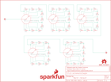

Contents
========

* [PRS13006 > Sparkfun](#prs13006--sparkfun)
	* [Schematic](#schematic)
	* [Interactive BOM](#interactive-bom)
	* [OOMP Parts](#oomp-parts)
	* [Images](#images)
	* [Tags](#tags)
  
![][im]
# PRS13006 > Sparkfun

- ID: PROJ-SPAR-13006-STAN-01
- Hex ID: PRS13006
- Name: Sparkfun
- Description: Sparkfun
- Long Link: [http://oom.lt/PROJ-SPAR-13006-STAN-01](http://oom.lt/PROJ-SPAR-13006-STAN-01)
- Short Link: [http://oom.lt/PRS13006](http://oom.lt/PRS13006)

## Schematic
  

## Interactive BOM

- Interactive BOM page: [ibom.html](https://htmlpreview.github.io/?https://github.com/oomlout/oomlout_OOMP_projects/blob/main/PROJ-SPAR-13006-STAN-01/kicad/bom/ibom.html)

## OOMP Parts
  

|OOMP Parts|
| :---: |
|JP1,UNMATCHED-UNMATCHED-X-UNMATCHED-01,FRAME1,FRAME-LETTER,FRAME-LETTER,CREATIVE_COMMONS,Schematic Frame,,,|
|JP2,UNMATCHED-UNMATCHED-X-UNMATCHED-01,JP1,,BANANA-JACK,BANANA-JACK,Single Banana jack.,,,|
|R1,RESE-UNMATCHED-X-O1003-01,JP2,,BANANA-JACK,BANANA-JACK,Single Banana jack.,,,|
|R2,RESE-UNMATCHED-X-O1003-01,LOGO1,OSHW-LOGOL,OSHW-LOGOL,OSHW-LOGO-L,Open Source Hardware Logo This logo indicates the piece of hardware it is found on incorporates a OSHW license and/or adheres to the definition of open source hardware found here: http://freedomdefined.org/OSHW,,,|
|R3,RESE-UNMATCHED-X-O1003-01,LOGO2,SFE_LOGO_NAME_FLAME.2_INCH,SFE_LOGO_NAME_FLAME.2_INCH,SFE_LOGO_NAME_FLAME_.2,SFE Logo, name and flame,,,|
|R4,RESE-UNMATCHED-X-O1003-01,LOGO3,SFE_LOGO_NAME_FLAME.5_INCH,SFE_LOGO_NAME_FLAME.5_INCH,SFE_LOGO_NAME_FLAME_.5,SFE Logo, name and flame,,,|
|R5,RESE-UNMATCHED-X-O1003-01,LOGO4,OSHW-LOGOL,OSHW-LOGOL,OSHW-LOGO-L,Open Source Hardware Logo This logo indicates the piece of hardware it is found on incorporates a OSHW license and/or adheres to the definition of open source hardware found here: http://freedomdefined.org/OSHW,,,|
|R6,RESE-UNMATCHED-X-O1003-01,R1,100k,100KOHM-1/4W-1%(PTH)VERT-KIT,AXIAL-0.1EZ,RES-12184,RES-12184,100K,|
|R7,RESE-UNMATCHED-X-O1003-01,R2,100k,100KOHM-1/4W-1%(PTH)VERT-KIT,AXIAL-0.1EZ,RES-12184,RES-12184,100K,|
|R8,RESE-UNMATCHED-X-O1003-01,R3,100k,100KOHM-1/4W-1%(PTH)VERT-KIT,AXIAL-0.1EZ,RES-12184,RES-12184,100K,|
|R9,RESE-UNMATCHED-X-O1003-01,R4,100k,100KOHM-1/4W-1%(PTH)VERT-KIT,AXIAL-0.1EZ,RES-12184,RES-12184,100K,|
|R10,RESE-UNMATCHED-X-O103-01,R5,100k,100KOHM-1/4W-1%(PTH)VERT-KIT,AXIAL-0.1EZ,RES-12184,RES-12184,100K,|
|R11,RESE-UNMATCHED-X-O103-01,R6,100k,100KOHM-1/4W-1%(PTH)VERT-KIT,AXIAL-0.1EZ,RES-12184,RES-12184,100K,|
|R12,RESE-UNMATCHED-X-O103-01,R7,100k,100KOHM-1/4W-1%(PTH)VERT-KIT,AXIAL-0.1EZ,RES-12184,RES-12184,100K,|
|R13,RESE-UNMATCHED-X-O103-01,R8,100k,100KOHM-1/4W-1%(PTH)VERT-KIT,AXIAL-0.1EZ,RES-12184,RES-12184,100K,|
|R14,RESE-UNMATCHED-X-O103-01,R9,100k,100KOHM-1/4W-1%(PTH)VERT-KIT,AXIAL-0.1EZ,RES-12184,RES-12184,100K,|
|R15,RESE-UNMATCHED-X-O103-01,R10,10k,10KOHM-1/4W-1%(PTH)VERT-KIT,AXIAL-0.1EZ,RES-12183,RES-12183,10k,|
|R16,RESE-UNMATCHED-X-O103-01,R11,10k,10KOHM-1/4W-1%(PTH)VERT-KIT,AXIAL-0.1EZ,RES-12183,RES-12183,10k,|
|R17,RESE-UNMATCHED-X-O103-01,R12,10k,10KOHM-1/4W-1%(PTH)VERT-KIT,AXIAL-0.1EZ,RES-12183,RES-12183,10k,|
|R18,RESE-UNMATCHED-X-O103-01,R13,10k,10KOHM-1/4W-1%(PTH)VERT-KIT,AXIAL-0.1EZ,RES-12183,RES-12183,10k,|
|R19,RESE-UNMATCHED-X-O102-01,R14,10k,10KOHM-1/4W-1%(PTH)VERT-KIT,AXIAL-0.1EZ,RES-12183,RES-12183,10k,|
|R20,RESE-UNMATCHED-X-O102-01,R15,10k,10KOHM-1/4W-1%(PTH)VERT-KIT,AXIAL-0.1EZ,RES-12183,RES-12183,10k,|
|R21,RESE-UNMATCHED-X-O102-01,R16,10k,10KOHM-1/4W-1%(PTH)VERT-KIT,AXIAL-0.1EZ,RES-12183,RES-12183,10k,|
|R22,RESE-UNMATCHED-X-O102-01,R17,10k,10KOHM-1/4W-1%(PTH)VERT-KIT,AXIAL-0.1EZ,RES-12183,RES-12183,10k,|
|R23,RESE-UNMATCHED-X-O102-01,R18,10k,10KOHM-1/4W-1%(PTH)VERT-KIT,AXIAL-0.1EZ,RES-12183,RES-12183,10k,|
|R24,RESE-UNMATCHED-X-O102-01,R19,1k,1KOHM-1/4W-1%(PTH)VERT-KIT,AXIAL-0.1EZ,RES-12182,RES-12182,1K,|
|R25,RESE-UNMATCHED-X-O102-01,R20,1k,1KOHM-1/4W-1%(PTH)VERT-KIT,AXIAL-0.1EZ,RES-12182,RES-12182,1K,|
|R26,RESE-UNMATCHED-X-O102-01,R21,1k,1KOHM-1/4W-1%(PTH)VERT-KIT,AXIAL-0.1EZ,RES-12182,RES-12182,1K,|
|R27,RESE-UNMATCHED-X-O102-01,R22,1k,1KOHM-1/4W-1%(PTH)VERT-KIT,AXIAL-0.1EZ,RES-12182,RES-12182,1K,|
|R28,RESE-UNMATCHED-X-O101-01,R23,1k,1KOHM-1/4W-1%(PTH)VERT-KIT,AXIAL-0.1EZ,RES-12182,RES-12182,1K,|
|R29,RESE-UNMATCHED-X-O101-01,R24,1k,1KOHM-1/4W-1%(PTH)VERT-KIT,AXIAL-0.1EZ,RES-12182,RES-12182,1K,|
|R30,RESE-UNMATCHED-X-O101-01,R25,1k,1KOHM-1/4W-1%(PTH)VERT-KIT,AXIAL-0.1EZ,RES-12182,RES-12182,1K,|
|R31,RESE-UNMATCHED-X-O101-01,R26,1k,1KOHM-1/4W-1%(PTH)VERT-KIT,AXIAL-0.1EZ,RES-12182,RES-12182,1K,|
|R32,RESE-UNMATCHED-X-O101-01,R27,1k,1KOHM-1/4W-1%(PTH)VERT-KIT,AXIAL-0.1EZ,RES-12182,RES-12182,1K,|
|R33,RESE-UNMATCHED-X-O101-01,R28,100,100OHM-1/4W-1%(PTH)VERT-KIT,AXIAL-0.1EZ,RES-12181,RES-12181,100,|
|R34,RESE-UNMATCHED-X-O101-01,R29,100,100OHM-1/4W-1%(PTH)VERT-KIT,AXIAL-0.1EZ,RES-12181,RES-12181,100,|
|R35,RESE-UNMATCHED-X-O101-01,R30,100,100OHM-1/4W-1%(PTH)VERT-KIT,AXIAL-0.1EZ,RES-12181,RES-12181,100,|
|R36,RESE-UNMATCHED-X-O101-01,R31,100,100OHM-1/4W-1%(PTH)VERT-KIT,AXIAL-0.1EZ,RES-12181,RES-12181,100,|
|R37,RESE-UNMATCHED-X-O11-01,R32,100,100OHM-1/4W-1%(PTH)VERT-KIT,AXIAL-0.1EZ,RES-12181,RES-12181,100,|
|R38,RESE-UNMATCHED-X-O11-01,R33,100,100OHM-1/4W-1%(PTH)VERT-KIT,AXIAL-0.1EZ,RES-12181,RES-12181,100,|
|R39,RESE-UNMATCHED-X-O11-01,R34,100,100OHM-1/4W-1%(PTH)VERT-KIT,AXIAL-0.1EZ,RES-12181,RES-12181,100,|
|R40,RESE-UNMATCHED-X-O11-01,R35,100,100OHM-1/4W-1%(PTH)VERT-KIT,AXIAL-0.1EZ,RES-12181,RES-12181,100,|
|R41,RESE-UNMATCHED-X-O11-01,R36,100,100OHM-1/4W-1%(PTH)VERT-KIT,AXIAL-0.1EZ,RES-12181,RES-12181,100,|
|R42,RESE-UNMATCHED-X-O11-01,R37,10,10OHM-1/4W-1%(PTH)VERT-KIT,AXIAL-0.1EZ,RES-12180,RES-12180,10.0,|
|R43,RESE-UNMATCHED-X-O11-01,R38,10,10OHM-1/4W-1%(PTH)VERT-KIT,AXIAL-0.1EZ,RES-12180,RES-12180,10.0,|
|R44,RESE-UNMATCHED-X-O11-01,R39,10,10OHM-1/4W-1%(PTH)VERT-KIT,AXIAL-0.1EZ,RES-12180,RES-12180,10.0,|
|R45,RESE-UNMATCHED-X-O11-01,R40,10,10OHM-1/4W-1%(PTH)VERT-KIT,AXIAL-0.1EZ,RES-12180,RES-12180,10.0,|
|SW1,UNMATCHED-UNMATCHED-X-UNMATCHED-01,R41,10,10OHM-1/4W-1%(PTH)VERT-KIT,AXIAL-0.1EZ,RES-12180,RES-12180,10.0,|
|SW2,UNMATCHED-UNMATCHED-X-UNMATCHED-01,R42,10,10OHM-1/4W-1%(PTH)VERT-KIT,AXIAL-0.1EZ,RES-12180,RES-12180,10.0,|
|SW3,UNMATCHED-UNMATCHED-X-UNMATCHED-01,R43,10,10OHM-1/4W-1%(PTH)VERT-KIT,AXIAL-0.1EZ,RES-12180,RES-12180,10.0,|
|SW4,UNMATCHED-UNMATCHED-X-UNMATCHED-01,R44,10,10OHM-1/4W-1%(PTH)VERT-KIT,AXIAL-0.1EZ,RES-12180,RES-12180,10.0,|
|SW5,UNMATCHED-UNMATCHED-X-UNMATCHED-01,R45,10,10OHM-1/4W-1%(PTH)VERT-KIT,AXIAL-0.1EZ,RES-12180,RES-12180,10.0,|

## Images
  
  

|kicadPcb3d|kicadPcb3dFront|kicadPcb3dBack|eagleImage|eagleSchemImage|
| :---: | :---: | :---: | :---: | :---: |
||||||

## Tags

- hexID: PRS13006
- oompType: PROJ
- oompSize: SPAR
- oompColor: 13006
- oompDesc: STAN
- oompIndex: 01
- oompName: Decade Resistance Box
- sources: All source files from https://github.com/sparkfun/Decade_Resistance_Box (source licence details in srcLicense.md)
- linkBuyPage: https://www.sparkfun.com/products/13006
- oompID: PROJ-SPAR-13006-STAN-01
- oompParts: JP1,UNMATCHED-UNMATCHED-X-UNMATCHED-01
- oompParts: JP2,UNMATCHED-UNMATCHED-X-UNMATCHED-01
- oompParts: R1,RESE-UNMATCHED-X-O1003-01
- oompParts: R2,RESE-UNMATCHED-X-O1003-01
- oompParts: R3,RESE-UNMATCHED-X-O1003-01
- oompParts: R4,RESE-UNMATCHED-X-O1003-01
- oompParts: R5,RESE-UNMATCHED-X-O1003-01
- oompParts: R6,RESE-UNMATCHED-X-O1003-01
- oompParts: R7,RESE-UNMATCHED-X-O1003-01
- oompParts: R8,RESE-UNMATCHED-X-O1003-01
- oompParts: R9,RESE-UNMATCHED-X-O1003-01
- oompParts: R10,RESE-UNMATCHED-X-O103-01
- oompParts: R11,RESE-UNMATCHED-X-O103-01
- oompParts: R12,RESE-UNMATCHED-X-O103-01
- oompParts: R13,RESE-UNMATCHED-X-O103-01
- oompParts: R14,RESE-UNMATCHED-X-O103-01
- oompParts: R15,RESE-UNMATCHED-X-O103-01
- oompParts: R16,RESE-UNMATCHED-X-O103-01
- oompParts: R17,RESE-UNMATCHED-X-O103-01
- oompParts: R18,RESE-UNMATCHED-X-O103-01
- oompParts: R19,RESE-UNMATCHED-X-O102-01
- oompParts: R20,RESE-UNMATCHED-X-O102-01
- oompParts: R21,RESE-UNMATCHED-X-O102-01
- oompParts: R22,RESE-UNMATCHED-X-O102-01
- oompParts: R23,RESE-UNMATCHED-X-O102-01
- oompParts: R24,RESE-UNMATCHED-X-O102-01
- oompParts: R25,RESE-UNMATCHED-X-O102-01
- oompParts: R26,RESE-UNMATCHED-X-O102-01
- oompParts: R27,RESE-UNMATCHED-X-O102-01
- oompParts: R28,RESE-UNMATCHED-X-O101-01
- oompParts: R29,RESE-UNMATCHED-X-O101-01
- oompParts: R30,RESE-UNMATCHED-X-O101-01
- oompParts: R31,RESE-UNMATCHED-X-O101-01
- oompParts: R32,RESE-UNMATCHED-X-O101-01
- oompParts: R33,RESE-UNMATCHED-X-O101-01
- oompParts: R34,RESE-UNMATCHED-X-O101-01
- oompParts: R35,RESE-UNMATCHED-X-O101-01
- oompParts: R36,RESE-UNMATCHED-X-O101-01
- oompParts: R37,RESE-UNMATCHED-X-O11-01
- oompParts: R38,RESE-UNMATCHED-X-O11-01
- oompParts: R39,RESE-UNMATCHED-X-O11-01
- oompParts: R40,RESE-UNMATCHED-X-O11-01
- oompParts: R41,RESE-UNMATCHED-X-O11-01
- oompParts: R42,RESE-UNMATCHED-X-O11-01
- oompParts: R43,RESE-UNMATCHED-X-O11-01
- oompParts: R44,RESE-UNMATCHED-X-O11-01
- oompParts: R45,RESE-UNMATCHED-X-O11-01
- oompParts: SW1,UNMATCHED-UNMATCHED-X-UNMATCHED-01
- oompParts: SW2,UNMATCHED-UNMATCHED-X-UNMATCHED-01
- oompParts: SW3,UNMATCHED-UNMATCHED-X-UNMATCHED-01
- oompParts: SW4,UNMATCHED-UNMATCHED-X-UNMATCHED-01
- oompParts: SW5,UNMATCHED-UNMATCHED-X-UNMATCHED-01
- rawParts: FRAME1,FRAME-LETTER,FRAME-LETTER,CREATIVE_COMMONS,Schematic Frame,,,
- rawParts: JP1,,BANANA-JACK,BANANA-JACK,Single Banana jack.,,,
- rawParts: JP2,,BANANA-JACK,BANANA-JACK,Single Banana jack.,,,
- rawParts: LOGO1,OSHW-LOGOL,OSHW-LOGOL,OSHW-LOGO-L,Open Source Hardware Logo This logo indicates the piece of hardware it is found on incorporates a OSHW license and/or adheres to the definition of open source hardware found here: http://freedomdefined.org/OSHW,,,
- rawParts: LOGO2,SFE_LOGO_NAME_FLAME.2_INCH,SFE_LOGO_NAME_FLAME.2_INCH,SFE_LOGO_NAME_FLAME_.2,SFE Logo, name and flame,,,
- rawParts: LOGO3,SFE_LOGO_NAME_FLAME.5_INCH,SFE_LOGO_NAME_FLAME.5_INCH,SFE_LOGO_NAME_FLAME_.5,SFE Logo, name and flame,,,
- rawParts: LOGO4,OSHW-LOGOL,OSHW-LOGOL,OSHW-LOGO-L,Open Source Hardware Logo This logo indicates the piece of hardware it is found on incorporates a OSHW license and/or adheres to the definition of open source hardware found here: http://freedomdefined.org/OSHW,,,
- rawParts: R1,100k,100KOHM-1/4W-1%(PTH)VERT-KIT,AXIAL-0.1EZ,RES-12184,RES-12184,100K,
- rawParts: R2,100k,100KOHM-1/4W-1%(PTH)VERT-KIT,AXIAL-0.1EZ,RES-12184,RES-12184,100K,
- rawParts: R3,100k,100KOHM-1/4W-1%(PTH)VERT-KIT,AXIAL-0.1EZ,RES-12184,RES-12184,100K,
- rawParts: R4,100k,100KOHM-1/4W-1%(PTH)VERT-KIT,AXIAL-0.1EZ,RES-12184,RES-12184,100K,
- rawParts: R5,100k,100KOHM-1/4W-1%(PTH)VERT-KIT,AXIAL-0.1EZ,RES-12184,RES-12184,100K,
- rawParts: R6,100k,100KOHM-1/4W-1%(PTH)VERT-KIT,AXIAL-0.1EZ,RES-12184,RES-12184,100K,
- rawParts: R7,100k,100KOHM-1/4W-1%(PTH)VERT-KIT,AXIAL-0.1EZ,RES-12184,RES-12184,100K,
- rawParts: R8,100k,100KOHM-1/4W-1%(PTH)VERT-KIT,AXIAL-0.1EZ,RES-12184,RES-12184,100K,
- rawParts: R9,100k,100KOHM-1/4W-1%(PTH)VERT-KIT,AXIAL-0.1EZ,RES-12184,RES-12184,100K,
- rawParts: R10,10k,10KOHM-1/4W-1%(PTH)VERT-KIT,AXIAL-0.1EZ,RES-12183,RES-12183,10k,
- rawParts: R11,10k,10KOHM-1/4W-1%(PTH)VERT-KIT,AXIAL-0.1EZ,RES-12183,RES-12183,10k,
- rawParts: R12,10k,10KOHM-1/4W-1%(PTH)VERT-KIT,AXIAL-0.1EZ,RES-12183,RES-12183,10k,
- rawParts: R13,10k,10KOHM-1/4W-1%(PTH)VERT-KIT,AXIAL-0.1EZ,RES-12183,RES-12183,10k,
- rawParts: R14,10k,10KOHM-1/4W-1%(PTH)VERT-KIT,AXIAL-0.1EZ,RES-12183,RES-12183,10k,
- rawParts: R15,10k,10KOHM-1/4W-1%(PTH)VERT-KIT,AXIAL-0.1EZ,RES-12183,RES-12183,10k,
- rawParts: R16,10k,10KOHM-1/4W-1%(PTH)VERT-KIT,AXIAL-0.1EZ,RES-12183,RES-12183,10k,
- rawParts: R17,10k,10KOHM-1/4W-1%(PTH)VERT-KIT,AXIAL-0.1EZ,RES-12183,RES-12183,10k,
- rawParts: R18,10k,10KOHM-1/4W-1%(PTH)VERT-KIT,AXIAL-0.1EZ,RES-12183,RES-12183,10k,
- rawParts: R19,1k,1KOHM-1/4W-1%(PTH)VERT-KIT,AXIAL-0.1EZ,RES-12182,RES-12182,1K,
- rawParts: R20,1k,1KOHM-1/4W-1%(PTH)VERT-KIT,AXIAL-0.1EZ,RES-12182,RES-12182,1K,
- rawParts: R21,1k,1KOHM-1/4W-1%(PTH)VERT-KIT,AXIAL-0.1EZ,RES-12182,RES-12182,1K,
- rawParts: R22,1k,1KOHM-1/4W-1%(PTH)VERT-KIT,AXIAL-0.1EZ,RES-12182,RES-12182,1K,
- rawParts: R23,1k,1KOHM-1/4W-1%(PTH)VERT-KIT,AXIAL-0.1EZ,RES-12182,RES-12182,1K,
- rawParts: R24,1k,1KOHM-1/4W-1%(PTH)VERT-KIT,AXIAL-0.1EZ,RES-12182,RES-12182,1K,
- rawParts: R25,1k,1KOHM-1/4W-1%(PTH)VERT-KIT,AXIAL-0.1EZ,RES-12182,RES-12182,1K,
- rawParts: R26,1k,1KOHM-1/4W-1%(PTH)VERT-KIT,AXIAL-0.1EZ,RES-12182,RES-12182,1K,
- rawParts: R27,1k,1KOHM-1/4W-1%(PTH)VERT-KIT,AXIAL-0.1EZ,RES-12182,RES-12182,1K,
- rawParts: R28,100,100OHM-1/4W-1%(PTH)VERT-KIT,AXIAL-0.1EZ,RES-12181,RES-12181,100,
- rawParts: R29,100,100OHM-1/4W-1%(PTH)VERT-KIT,AXIAL-0.1EZ,RES-12181,RES-12181,100,
- rawParts: R30,100,100OHM-1/4W-1%(PTH)VERT-KIT,AXIAL-0.1EZ,RES-12181,RES-12181,100,
- rawParts: R31,100,100OHM-1/4W-1%(PTH)VERT-KIT,AXIAL-0.1EZ,RES-12181,RES-12181,100,
- rawParts: R32,100,100OHM-1/4W-1%(PTH)VERT-KIT,AXIAL-0.1EZ,RES-12181,RES-12181,100,
- rawParts: R33,100,100OHM-1/4W-1%(PTH)VERT-KIT,AXIAL-0.1EZ,RES-12181,RES-12181,100,
- rawParts: R34,100,100OHM-1/4W-1%(PTH)VERT-KIT,AXIAL-0.1EZ,RES-12181,RES-12181,100,
- rawParts: R35,100,100OHM-1/4W-1%(PTH)VERT-KIT,AXIAL-0.1EZ,RES-12181,RES-12181,100,
- rawParts: R36,100,100OHM-1/4W-1%(PTH)VERT-KIT,AXIAL-0.1EZ,RES-12181,RES-12181,100,
- rawParts: R37,10,10OHM-1/4W-1%(PTH)VERT-KIT,AXIAL-0.1EZ,RES-12180,RES-12180,10.0,
- rawParts: R38,10,10OHM-1/4W-1%(PTH)VERT-KIT,AXIAL-0.1EZ,RES-12180,RES-12180,10.0,
- rawParts: R39,10,10OHM-1/4W-1%(PTH)VERT-KIT,AXIAL-0.1EZ,RES-12180,RES-12180,10.0,
- rawParts: R40,10,10OHM-1/4W-1%(PTH)VERT-KIT,AXIAL-0.1EZ,RES-12180,RES-12180,10.0,
- rawParts: R41,10,10OHM-1/4W-1%(PTH)VERT-KIT,AXIAL-0.1EZ,RES-12180,RES-12180,10.0,
- rawParts: R42,10,10OHM-1/4W-1%(PTH)VERT-KIT,AXIAL-0.1EZ,RES-12180,RES-12180,10.0,
- rawParts: R43,10,10OHM-1/4W-1%(PTH)VERT-KIT,AXIAL-0.1EZ,RES-12180,RES-12180,10.0,
- rawParts: R44,10,10OHM-1/4W-1%(PTH)VERT-KIT,AXIAL-0.1EZ,RES-12180,RES-12180,10.0,
- rawParts: R45,10,10OHM-1/4W-1%(PTH)VERT-KIT,AXIAL-0.1EZ,RES-12180,RES-12180,10.0,
- rawParts: STANDOFF1,STAND-OFF,STAND-OFF,STAND-OFF,#4 Stand Off,,,
- rawParts: STANDOFF2,STAND-OFF,STAND-OFF,STAND-OFF,#4 Stand Off,,,
- rawParts: STANDOFF3,STAND-OFF,STAND-OFF,STAND-OFF,#4 Stand Off,,,
- rawParts: STANDOFF4,STAND-OFF,STAND-OFF,STAND-OFF,#4 Stand Off,,,
- rawParts: SW1,SWITCH_ROTARY_1X10KIT,SWITCH_ROTARY_1X10KIT,ROTARY_SWITCH_1X10_KIT,SWCH-12120,SWCH-12120,1x10,
- rawParts: SW2,SWITCH_ROTARY_1X10KIT,SWITCH_ROTARY_1X10KIT,ROTARY_SWITCH_1X10_KIT,SWCH-12120,SWCH-12120,1x10,
- rawParts: SW3,SWITCH_ROTARY_1X10KIT,SWITCH_ROTARY_1X10KIT,ROTARY_SWITCH_1X10_KIT,SWCH-12120,SWCH-12120,1x10,
- rawParts: SW4,SWITCH_ROTARY_1X10KIT,SWITCH_ROTARY_1X10KIT,ROTARY_SWITCH_1X10_KIT,SWCH-12120,SWCH-12120,1x10,
- rawParts: SW5,SWITCH_ROTARY_1X10KIT,SWITCH_ROTARY_1X10KIT,ROTARY_SWITCH_1X10_KIT,SWCH-12120,SWCH-12120,1x10,

[im]: kicadPcb3d_450.png
